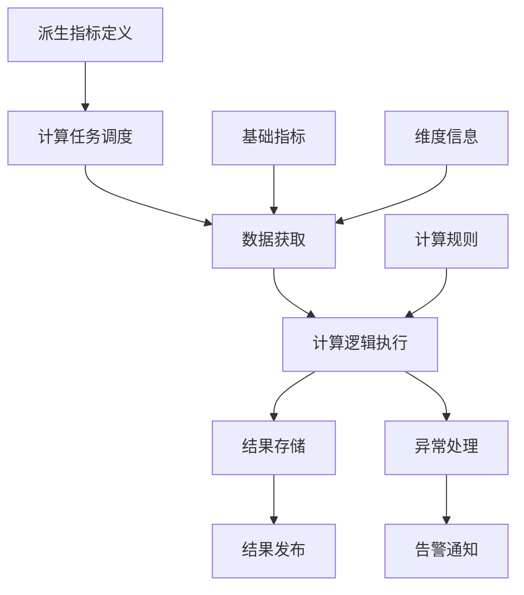
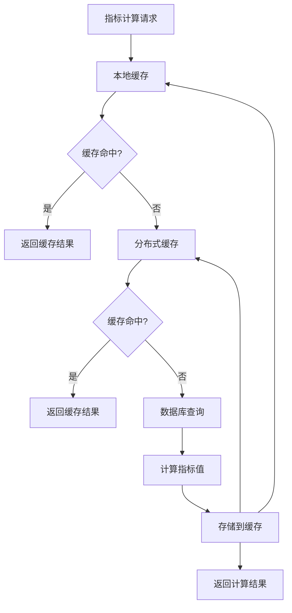

在企业级统一度量平台中，原子指标（基础指标）提供了最原始的数据，但往往无法直接反映复杂的业务现象。派生指标和复合指标通过对基础指标进行计算和组合，能够提供更高层次的洞察，帮助决策者更好地理解业务状况。本节将深入探讨派生指标与复合指标的设计原则、计算方法和管理实践。

## 派生指标与复合指标的概念

### 1.1 基本定义

#### 1.1.1 派生指标（Derived Metrics）

派生指标是通过对一个或多个基础指标进行数学运算或逻辑处理得到的新指标。它保持了原有指标的维度，但在数值上进行了转换或计算。

```yaml
派生指标特征:
  计算方式:
    - 基于单一基础指标的转换
    - 如：环比增长率、同比增长率
    - 如：累计值、平均值
  维度保持:
    - 保持原有指标的维度结构
    - 不改变指标的业务含义本质
  实时性:
    - 通常可以实时或近实时计算
    - 计算复杂度相对较低
```

#### 1.1.2 复合指标（Composite Metrics）

复合指标是通过组合多个不同维度或类型的指标，形成一个综合性评价指标。它通常用于衡量复杂业务现象或整体表现。

```yaml
复合指标特征:
  组合方式:
    - 多个指标的加权组合
    - 多维度指标的综合评价
    - 如：研发效能指数、客户满意度指数
  综合性:
    - 反映多个方面的综合表现
    - 提供高层次的业务洞察
  复杂性:
    - 计算逻辑相对复杂
    - 可能涉及归一化处理
```

### 1.2 两者区别与联系

```yaml
派生指标 vs 复合指标:
  派生指标:
    - 基于单一指标或同类型指标计算
    - 保持原有维度结构
    - 计算逻辑相对简单
    - 如：用户增长率 = (本期用户数-上期用户数)/上期用户数
  复合指标:
    - 组合多个不同类型指标
    - 可能改变维度结构
    - 计算逻辑相对复杂
    - 如：研发效能指数 = 交付吞吐量 * 交付质量 * 技术能力
```

## 派生指标的设计与实现

### 2.1 常见派生指标类型

#### 2.1.1 比率类指标

比率类指标通过计算两个相关指标的比值来反映业务关系：

```sql
-- 用户转化率
SELECT 
  date,
  COUNT(DISTINCT CASE WHEN event_type = 'visit' THEN user_id END) as visitors,
  COUNT(DISTINCT CASE WHEN event_type = 'purchase' THEN user_id END) as purchasers,
  CASE 
    WHEN visitors > 0 THEN (purchasers * 100.0 / visitors)
    ELSE 0 
  END as conversion_rate
FROM user_events
WHERE date >= '2025-01-01'
GROUP BY date;

-- 系统可用性
SELECT 
  date,
  SUM(CASE WHEN status = 'up' THEN 1 ELSE 0 END) as up_minutes,
  COUNT(*) as total_minutes,
  (up_minutes * 100.0 / total_minutes) as availability
FROM system_status
WHERE date >= '2025-01-01'
GROUP BY date;
```

#### 2.1.2 趋势类指标

趋势类指标反映指标随时间的变化情况：

```python
class TrendMetricsCalculator:
    def __init__(self, data_source):
        self.data_source = data_source
    
    def calculate_mom_growth(self, metric_name, date):
        """
        计算环比增长率
        """
        current_value = self.data_source.get_metric_value(metric_name, date)
        previous_date = self.get_previous_period(date)
        previous_value = self.data_source.get_metric_value(metric_name, previous_date)
        
        if previous_value > 0:
            return (current_value - previous_value) / previous_value * 100
        return 0
    
    def calculate_yoy_growth(self, metric_name, date):
        """
        计算同比增长率
        """
        current_value = self.data_source.get_metric_value(metric_name, date)
        previous_year_date = self.get_previous_year(date)
        previous_value = self.data_source.get_metric_value(metric_name, previous_year_date)
        
        if previous_value > 0:
            return (current_value - previous_value) / previous_value * 100
        return 0
    
    def calculate_moving_average(self, metric_name, date, window=7):
        """
        计算移动平均值
        """
        values = []
        for i in range(window):
            target_date = date - timedelta(days=i)
            value = self.data_source.get_metric_value(metric_name, target_date)
            values.append(value)
        
        return sum(values) / len(values) if values else 0
```

#### 2.1.3 累计类指标

累计类指标反映指标的累积情况：

```java
public class CumulativeMetricsService {
    
    public Map<String, Object> calculateCumulativeMetrics(String metricId, LocalDate startDate, LocalDate endDate) {
        Map<String, Object> result = new HashMap<>();
        
        // 获取每日数据
        List<DailyMetric> dailyMetrics = metricRepository.findByMetricIdAndDateRange(
            metricId, startDate, endDate);
        
        double cumulativeValue = 0;
        List<Map<String, Object>> cumulativeData = new ArrayList<>();
        
        for (DailyMetric dailyMetric : dailyMetrics) {
            cumulativeValue += dailyMetric.getValue();
            
            Map<String, Object> dataPoint = new HashMap<>();
            dataPoint.put("date", dailyMetric.getDate());
            dataPoint.put("daily_value", dailyMetric.getValue());
            dataPoint.put("cumulative_value", cumulativeValue);
            
            cumulativeData.add(dataPoint);
        }
        
        result.put("data", cumulativeData);
        result.put("total", cumulativeValue);
        
        return result;
    }
}
```

### 2.2 派生指标的计算框架

#### 2.2.1 计算引擎设计



#### 2.2.2 计算逻辑实现

```javascript
class DerivedMetricCalculator {
    constructor(metricRegistry, dataSource) {
        this.metricRegistry = metricRegistry;
        this.dataSource = dataSource;
    }
    
    async calculateDerivedMetric(derivedMetricId, dimensions) {
        // 获取派生指标定义
        const metricDef = await this.metricRegistry.getDerivedMetric(derivedMetricId);
        if (!metricDef) {
            throw new Error(`派生指标未定义: ${derivedMetricId}`);
        }
        
        // 解析计算表达式
        const expression = metricDef.calculationExpression;
        const baseMetrics = this.extractBaseMetrics(expression);
        
        // 获取基础指标数据
        const baseData = {};
        for (const baseMetric of baseMetrics) {
            baseData[baseMetric] = await this.dataSource.getMetricData(
                baseMetric, dimensions);
        }
        
        // 执行计算
        const result = this.evaluateExpression(expression, baseData, dimensions);
        
        return result;
    }
    
    extractBaseMetrics(expression) {
        // 从表达式中提取基础指标ID
        const regex = /metric\(['"]([^'"]+)['"]\)/g;
        const matches = [];
        let match;
        
        while ((match = regex.exec(expression)) !== null) {
            matches.push(match[1]);
        }
        
        return [...new Set(matches)]; // 去重
    }
    
    evaluateExpression(expression, baseData, dimensions) {
        // 替换表达式中的指标引用
        let evalExpression = expression;
        for (const [metricId, data] of Object.entries(baseData)) {
            const value = this.getDimensionValue(data, dimensions);
            evalExpression = evalExpression.replace(
                new RegExp(`metric\\(['"]${metricId}['"]\\)`, 'g'), 
                value.toString());
        }
        
        // 安全计算表达式
        try {
            // 注意：实际生产中应使用安全的表达式计算库
            return eval(evalExpression);
        } catch (error) {
            throw new Error(`表达式计算失败: ${error.message}`);
        }
    }
    
    getDimensionValue(data, dimensions) {
        // 根据维度获取对应的数据值
        if (!dimensions || Object.keys(dimensions).length === 0) {
            return data.value || 0;
        }
        
        // 在多维数据中查找匹配的维度值
        for (const dataPoint of data.dataPoints || []) {
            if (this.matchDimensions(dataPoint.dimensions, dimensions)) {
                return dataPoint.value;
            }
        }
        
        return 0;
    }
    
    matchDimensions(dataDimensions, queryDimensions) {
        // 检查维度是否匹配
        for (const [key, value] of Object.entries(queryDimensions)) {
            if (dataDimensions[key] !== value) {
                return false;
            }
        }
        return true;
    }
}
```

## 复合指标的设计与实现

### 3.1 复合指标构建方法

#### 3.1.1 加权平均法

加权平均法是最常用的复合指标构建方法，通过对各子指标赋予不同权重来计算综合得分：

```yaml
加权平均法示例 - 研发效能指数:
  指标构成:
    - 交付吞吐量 (权重: 0.4)
    - 交付质量 (权重: 0.3)
    - 技术能力 (权重: 0.2)
    - 协作效率 (权重: 0.1)
  计算公式:
    研发效能指数 = 交付吞吐量*0.4 + 交付质量*0.3 + 技术能力*0.2 + 协作效率*0.1
  标准化处理:
    - 各子指标需进行标准化处理，统一到0-100分区间
    - 避免因量纲不同导致的权重失衡
```

#### 3.1.2 乘积法

乘积法通过将各子指标相乘来构建复合指标，强调各指标的协同效应：

```python
class CompositeMetricCalculator:
    def __init__(self, metric_registry):
        self.metric_registry = metric_registry
    
    def calculate_product_composite(self, composite_def, dimensions):
        """
        乘积法计算复合指标
        """
        components = composite_def.get('components', [])
        component_values = []
        
        for component in components:
            metric_id = component['metric_id']
            weight = component.get('weight', 1.0)
            
            # 获取子指标值
            metric_value = self.get_normalized_metric_value(metric_id, dimensions)
            
            # 应用权重并加入计算列表
            weighted_value = pow(metric_value, weight)
            component_values.append(weighted_value)
        
        # 计算乘积
        composite_value = 1.0
        for value in component_values:
            composite_value *= value
        
        return composite_value
    
    def get_normalized_metric_value(self, metric_id, dimensions):
        """
        获取标准化的指标值 (0-100分)
        """
        raw_value = self.metric_registry.get_metric_value(metric_id, dimensions)
        metric_info = self.metric_registry.get_metric_info(metric_id)
        
        # 根据指标定义进行标准化
        min_value = metric_info.get('min_value', 0)
        max_value = metric_info.get('max_value', 100)
        
        if max_value - min_value == 0:
            return 50  # 默认值
        
        normalized_value = (raw_value - min_value) / (max_value - min_value) * 100
        return max(0, min(100, normalized_value))  # 限制在0-100范围内
```

#### 3.1.3 层次分析法（AHP）

层次分析法通过构建判断矩阵来确定各指标权重，适用于复杂的多指标评价场景：

```yaml
层次分析法步骤:
  1. 构建层次结构:
    - 目标层: 研发效能评价
    - 准则层: 交付能力、质量保障、技术创新、团队协作
    - 指标层: 具体可量化的基础指标
  2. 构造判断矩阵:
    - 对准则层各元素进行两两比较
    - 确定相对重要性
  3. 计算权重向量:
    - 通过特征向量法计算权重
    - 进行一致性检验
  4. 综合评价:
    - 计算各层级指标得分
    - 得出最终综合评价结果
```

### 3.2 复合指标的标准化处理

#### 3.2.1 极值标准化

```sql
-- 极值标准化公式: (当前值-最小值)/(最大值-最小值)
SELECT 
  metric_date,
  metric_value,
  (metric_value - min_value) / (max_value - min_value) as normalized_value
FROM (
  SELECT 
    date as metric_date,
    value as metric_value,
    MIN(value) OVER() as min_value,
    MAX(value) OVER() as max_value
  FROM metric_data
  WHERE metric_id = 'delivery_throughput'
    AND date >= '2025-01-01'
) t;
```

#### 3.2.2 Z-Score标准化

```python
import numpy as np

def z_score_normalize(values):
    """
    Z-Score标准化
    """
    mean_val = np.mean(values)
    std_val = np.std(values)
    
    if std_val == 0:
        return [0 for _ in values]
    
    normalized_values = [(val - mean_val) / std_val for val in values]
    return normalized_values

# 使用示例
delivery_times = [2.1, 1.8, 2.5, 1.9, 2.3, 2.0, 2.2]
normalized_times = z_score_normalize(delivery_times)
print(f"原始值: {delivery_times}")
print(f"标准化值: {normalized_times}")
```

#### 3.2.3 百分位数标准化

```java
public class PercentileNormalizer {
    
    public double[] percentileNormalize(double[] values) {
        int n = values.length;
        double[] normalized = new double[n];
        
        // 创建索引数组并按值排序
        Integer[] indices = IntStream.range(0, n).boxed().toArray(Integer[]::new);
        Arrays.sort(indices, Comparator.comparingDouble(i -> values[i]));
        
        // 计算百分位数
        for (int i = 0; i < n; i++) {
            int rank = Arrays.binarySearch(indices, i, 
                Comparator.comparingDouble(idx -> values[idx]));
            // 二分查找可能返回负值，需要处理
            if (rank < 0) {
                rank = -rank - 1;
            }
            normalized[i] = (double) rank / (n - 1) * 100;
        }
        
        return normalized;
    }
}
```

### 3.3 复合指标的动态调整

#### 3.3.1 权重动态调整

```javascript
class DynamicWeightAdjuster {
    constructor(metricRegistry, feedbackCollector) {
        this.metricRegistry = metricRegistry;
        this.feedbackCollector = feedbackCollector;
    }
    
    async adjustWeights(compositeMetricId, period) {
        // 获取历史反馈数据
        const feedbackData = await this.feedbackCollector.getFeedback(
            compositeMetricId, period);
        
        // 获取当前权重配置
        const currentWeights = await this.metricRegistry.getCompositeWeights(
            compositeMetricId);
        
        // 根据反馈调整权重
        const adjustedWeights = this.calculateAdjustedWeights(
            currentWeights, feedbackData);
        
        // 更新权重配置
        await this.metricRegistry.updateCompositeWeights(
            compositeMetricId, adjustedWeights);
        
        return adjustedWeights;
    }
    
    calculateAdjustedWeights(currentWeights, feedbackData) {
        // 基于反馈数据计算权重调整
        const componentFeedback = {};
        
        // 统计各组件的反馈得分
        for (const feedback of feedbackData) {
            for (const [componentId, score] of Object.entries(feedback.componentScores)) {
                if (!componentFeedback[componentId]) {
                    componentFeedback[componentId] = [];
                }
                componentFeedback[componentId].push(score);
            }
        }
        
        // 计算各组件的平均反馈得分
        const avgScores = {};
        for (const [componentId, scores] of Object.entries(componentFeedback)) {
            avgScores[componentId] = scores.reduce((a, b) => a + b, 0) / scores.length;
        }
        
        // 根据反馈得分调整权重
        const totalScore = Object.values(avgScores).reduce((a, b) => a + b, 0);
        const adjustedWeights = {};
        
        for (const [componentId, score] of Object.entries(avgScores)) {
            const currentWeight = currentWeights[componentId] || 0;
            const scoreRatio = totalScore > 0 ? score / totalScore : 0;
            
            // 调整权重（可以设置调整幅度限制）
            const adjustmentFactor = 0.1; // 最大调整幅度10%
            const targetWeight = scoreRatio;
            const adjustedWeight = currentWeight + 
                (targetWeight - currentWeight) * adjustmentFactor;
            
            adjustedWeights[componentId] = Math.max(0, Math.min(1, adjustedWeight));
        }
        
        // 确保权重总和为1
        const weightSum = Object.values(adjustedWeights).reduce((a, b) => a + b, 0);
        if (weightSum > 0) {
            for (const componentId in adjustedWeights) {
                adjustedWeights[componentId] = adjustedWeights[componentId] / weightSum;
            }
        }
        
        return adjustedWeights;
    }
}
```

## 指标计算的性能优化

### 4.1 计算缓存策略

#### 4.1.1 多级缓存架构



#### 4.1.2 缓存实现

```python
import redis
import json
from functools import wraps
import hashlib

class MetricCache:
    def __init__(self, redis_client, local_cache_size=1000):
        self.redis_client = redis_client
        self.local_cache = {}
        self.local_cache_size = local_cache_size
        self.local_cache_keys = []
    
    def get_cache_key(self, metric_id, dimensions, time_range):
        """生成缓存键"""
        key_data = {
            'metric_id': metric_id,
            'dimensions': dimensions,
            'time_range': time_range
        }
        key_string = json.dumps(key_data, sort_keys=True)
        return hashlib.md5(key_string.encode()).hexdigest()
    
    def get(self, metric_id, dimensions, time_range):
        """获取缓存值"""
        cache_key = self.get_cache_key(metric_id, dimensions, time_range)
        
        # 1. 检查本地缓存
        if cache_key in self.local_cache:
            return self.local_cache[cache_key]
        
        # 2. 检查Redis缓存
        cached_value = self.redis_client.get(cache_key)
        if cached_value:
            value = json.loads(cached_value)
            # 回填本地缓存
            self._set_local_cache(cache_key, value)
            return value
        
        return None
    
    def set(self, metric_id, dimensions, time_range, value, ttl=3600):
        """设置缓存值"""
        cache_key = self.get_cache_key(metric_id, dimensions, time_range)
        
        # 1. 设置Redis缓存
        self.redis_client.setex(cache_key, ttl, json.dumps(value))
        
        # 2. 设置本地缓存
        self._set_local_cache(cache_key, value)
    
    def _set_local_cache(self, key, value):
        """设置本地缓存"""
        if len(self.local_cache_keys) >= self.local_cache_size:
            # 移除最老的缓存项
            oldest_key = self.local_cache_keys.pop(0)
            del self.local_cache[oldest_key]
        
        self.local_cache[key] = value
        self.local_cache_keys.append(key)
```

### 4.2 并行计算优化

```java
public class ParallelMetricCalculator {
    
    private final ExecutorService executorService;
    private final MetricRegistry metricRegistry;
    
    public ParallelMetricCalculator(MetricRegistry metricRegistry, int threadPoolSize) {
        this.metricRegistry = metricRegistry;
        this.executorService = Executors.newFixedThreadPool(threadPoolSize);
    }
    
    public Map<String, Double> calculateMetricsParallel(
            List<String> metricIds, Map<String, Object> dimensions) {
        
        // 创建计算任务
        List<CompletableFuture<Map.Entry<String, Double>>> futures = 
            new ArrayList<>();
        
        for (String metricId : metricIds) {
            CompletableFuture<Map.Entry<String, Double>> future = 
                CompletableFuture.supplyAsync(() -> {
                    try {
                        Double value = calculateSingleMetric(metricId, dimensions);
                        return Map.entry(metricId, value);
                    } catch (Exception e) {
                        // 记录错误但不中断其他计算
                        log.error("计算指标失败: " + metricId, e);
                        return Map.entry(metricId, 0.0);
                    }
                }, executorService);
            
            futures.add(future);
        }
        
        // 等待所有计算完成
        CompletableFuture<Void> allFutures = CompletableFuture.allOf(
            futures.toArray(new CompletableFuture[0]));
        
        try {
            allFutures.join();
        } catch (CompletionException e) {
            log.error("并行计算过程中发生错误", e);
        }
        
        // 收集结果
        Map<String, Double> results = new HashMap<>();
        for (CompletableFuture<Map.Entry<String, Double>> future : futures) {
            try {
                Map.Entry<String, Double> result = future.get();
                results.put(result.getKey(), result.getValue());
            } catch (Exception e) {
                log.error("获取计算结果失败", e);
            }
        }
        
        return results;
    }
    
    private Double calculateSingleMetric(String metricId, Map<String, Object> dimensions) {
        // 实际的指标计算逻辑
        MetricDefinition definition = metricRegistry.getMetricDefinition(metricId);
        // ... 执行具体计算
        return 0.0;
    }
}
```

## 指标计算的质量保障

### 5.1 数据质量检查

#### 5.1.1 完整性检查

```sql
-- 检查指标数据完整性
WITH daily_data AS (
  SELECT 
    metric_id,
    date,
    COUNT(*) as record_count
  FROM metric_data
  WHERE date >= CURRENT_DATE - INTERVAL '30 days'
  GROUP BY metric_id, date
),
expected_dates AS (
  SELECT generate_series(
    CURRENT_DATE - INTERVAL '30 days',
    CURRENT_DATE,
    '1 day'::interval
  )::date as date
)
SELECT 
  m.metric_id,
  COUNT(d.date) as actual_records,
  COUNT(e.date) as expected_records,
  CASE 
    WHEN COUNT(e.date) > 0 THEN 
      (COUNT(d.date) * 100.0 / COUNT(e.date))
    ELSE 0 
  END as completeness_rate
FROM metrics m
CROSS JOIN expected_dates e
LEFT JOIN daily_data d ON m.metric_id = d.metric_id AND e.date = d.date
GROUP BY m.metric_id
HAVING completeness_rate < 95; -- 完整性低于95%的指标
```

#### 5.1.2 准确性检查

```python
class DataAccuracyChecker:
    def __init__(self, data_source):
        self.data_source = data_source
    
    def check_metric_accuracy(self, metric_id, check_rules):
        """
        检查指标准确性
        """
        issues = []
        
        for rule in check_rules:
            if rule['type'] == 'range_check':
                issues.extend(self._check_range(metric_id, rule))
            elif rule['type'] == 'trend_check':
                issues.extend(self._check_trend(metric_id, rule))
            elif rule['type'] == 'consistency_check':
                issues.extend(self._check_consistency(metric_id, rule))
        
        return issues
    
    def _check_range(self, metric_id, rule):
        """
        范围检查
        """
        min_value = rule.get('min_value')
        max_value = rule.get('max_value')
        
        query = f"""
        SELECT date, value
        FROM metric_data
        WHERE metric_id = '{metric_id}'
          AND (value < {min_value} OR value > {max_value})
        ORDER BY date
        """
        
        results = self.data_source.execute_query(query)
        issues = []
        
        for row in results:
            issues.append({
                'type': 'range_violation',
                'metric_id': metric_id,
                'date': row['date'],
                'value': row['value'],
                'expected_range': f"[{min_value}, {max_value}]",
                'severity': rule.get('severity', 'medium')
            })
        
        return issues
    
    def _check_trend(self, metric_id, rule):
        """
        趋势检查
        """
        max_change_rate = rule.get('max_change_rate', 0.5)  # 默认50%
        
        query = f"""
        SELECT 
          date,
          value,
          LAG(value) OVER (ORDER BY date) as previous_value
        FROM metric_data
        WHERE metric_id = '{metric_id}'
        ORDER BY date
        """
        
        results = self.data_source.execute_query(query)
        issues = []
        
        for row in results:
            if row['previous_value'] is not None and row['previous_value'] != 0:
                change_rate = abs((row['value'] - row['previous_value']) / row['previous_value'])
                if change_rate > max_change_rate:
                    issues.append({
                        'type': 'trend_anomaly',
                        'metric_id': metric_id,
                        'date': row['date'],
                        'value': row['value'],
                        'previous_value': row['previous_value'],
                        'change_rate': change_rate,
                        'severity': rule.get('severity', 'medium')
                    })
        
        return issues
```

### 5.2 异常处理机制

```java
@Component
public class MetricCalculationExceptionHandler {
    
    private final AlertService alertService;
    private final MetricCalculationLogRepository logRepository;
    
    public void handleCalculationException(
            String metricId, Map<String, Object> dimensions, Exception exception) {
        
        // 记录异常日志
        MetricCalculationLog log = new MetricCalculationLog();
        log.setMetricId(metricId);
        log.setDimensions(dimensions);
        log.setExceptionType(exception.getClass().getSimpleName());
        log.setErrorMessage(exception.getMessage());
        log.setStackTrace(ExceptionUtils.getStackTrace(exception));
        log.setTimestamp(new Timestamp(System.currentTimeMillis()));
        
        logRepository.save(log);
        
        // 根据异常类型决定处理方式
        if (exception instanceof DataNotFoundException) {
            handleDataNotFound(metricId, dimensions, (DataNotFoundException) exception);
        } else if (exception instanceof CalculationException) {
            handleCalculationError(metricId, dimensions, (CalculationException) exception);
        } else {
            handleUnexpectedError(metricId, dimensions, exception);
        }
    }
    
    private void handleDataNotFound(String metricId, Map<String, Object> dimensions, 
                                  DataNotFoundException exception) {
        // 数据未找到，可能是正常情况，记录警告
        log.warn("计算指标时数据未找到: metricId={}, dimensions={}, message={}", 
                metricId, dimensions, exception.getMessage());
        
        // 发送低优先级告警
        alertService.sendAlert(AlertLevel.LOW, "METRIC_DATA_NOT_FOUND", 
            String.format("指标数据未找到: %s, 维度: %s", metricId, dimensions));
    }
    
    private void handleCalculationError(String metricId, Map<String, Object> dimensions, 
                                      CalculationException exception) {
        // 计算错误，需要关注
        log.error("指标计算错误: metricId={}, dimensions={}, message={}", 
                 metricId, dimensions, exception.getMessage());
        
        // 发送中优先级告警
        alertService.sendAlert(AlertLevel.MEDIUM, "METRIC_CALCULATION_ERROR", 
            String.format("指标计算错误: %s, 维度: %s, 错误: %s", 
                         metricId, dimensions, exception.getMessage()));
    }
    
    private void handleUnexpectedError(String metricId, Map<String, Object> dimensions, 
                                     Exception exception) {
        // 未预期的错误，需要紧急处理
        log.error("指标计算未预期错误: metricId={}, dimensions={}", 
                 metricId, dimensions, exception);
        
        // 发送高优先级告警
        alertService.sendAlert(AlertLevel.HIGH, "METRIC_UNEXPECTED_ERROR", 
            String.format("指标计算未预期错误: %s, 维度: %s, 错误: %s", 
                         metricId, dimensions, exception.getMessage()));
    }
}
```

## 实施案例与最佳实践

### 6.1 案例1：某科技公司的研发效能指标体系

该公司构建了完整的研发效能指标体系，包括：

1. **基础指标层**：
   - 交付吞吐量：代码提交频次、需求交付周期
   - 交付质量：缺陷密度、测试通过率、线上故障率
   - 技术能力：技术债务比率、代码复用率
   - 协作效率：响应时间、会议效率

2. **派生指标层**：
   - 环比增长率、同比增长率
   - 移动平均值、累计值
   - 趋势分析指标

3. **复合指标层**：
   - 研发效能指数 = 交付吞吐量×0.4 + 交付质量×0.3 + 技术能力×0.2 + 协作效率×0.1
   - 团队健康度指数
   - 创新能力指数

### 6.2 案例2：某金融机构的风险评估指标体系

该机构建立了多层次的风险评估指标体系：

1. **市场风险指标**：
   - VaR值、波动率、相关性系数

2. **信用风险指标**：
   - 违约率、损失率、信用利差

3. **操作风险指标**：
   - 操作失误率、系统故障率、人为错误率

4. **复合风险指标**：
   - 综合风险指数 = 市场风险×0.35 + 信用风险×0.4 + 操作风险×0.25
   - 风险调整收益 = 收益率 / 综合风险指数

### 6.3 最佳实践总结

基于多个实施案例，总结出以下最佳实践：

```yaml
最佳实践:
  指标设计:
    - 从业务需求出发设计指标
    - 确保指标的可解释性和可操作性
    - 建立指标间的逻辑关系
  技术实现:
    - 采用分层架构设计
    - 实现计算缓存和并行处理
    - 建立完善的异常处理机制
  质量保障:
    - 建立数据质量检查规则
    - 实施多维度的验证机制
    - 定期评估和优化指标体系
  持续改进:
    - 建立反馈机制
    - 支持指标动态调整
    - 持续监控和优化性能
```

## 实施建议与注意事项

### 7.1 实施建议

1. **分步实施**：
   - 先从核心业务指标开始
   - 逐步扩展到全量指标
   - 边实施边优化

2. **工具支撑**：
   - 建设统一的指标计算平台
   - 提供可视化的指标管理界面
   - 集成监控和告警功能

3. **人才培养**：
   - 培养指标设计和分析人才
   - 建立指标治理团队
   - 推广数据驱动文化

### 7.2 注意事项

1. **避免过度复杂化**：
   - 指标计算逻辑不宜过于复杂
   - 权重设置要合理且可解释
   - 避免为了复合而复合

2. **关注性能影响**：
   - 评估计算复杂度对系统性能的影响
   - 实施合理的缓存策略
   - 监控计算任务的执行效率

3. **确保数据质量**：
   - 建立数据质量检查机制
   - 及时发现和处理异常数据
   - 确保基础指标的准确性

## 总结

派生指标和复合指标是企业级统一度量平台中的重要组成部分，它们通过对基础指标的计算和组合，提供了更高层次的业务洞察。在设计和实现过程中，需要关注以下几个关键点：

1. **明确概念区分**：理解派生指标和复合指标的区别与联系
2. **合理设计方法**：选择合适的计算方法和标准化处理方式
3. **优化计算性能**：通过缓存和并行计算提升计算效率
4. **保障数据质量**：建立完善的质量检查和异常处理机制
5. **持续改进优化**：根据业务反馈动态调整指标体系

通过系统性的方法和最佳实践，可以构建出既科学又实用的派生指标和复合指标体系，为企业的数据驱动决策提供有力支撑。在下一节中，我们将探讨如何将指标服务API化，为所有下游应用提供统一的指标查询服务。