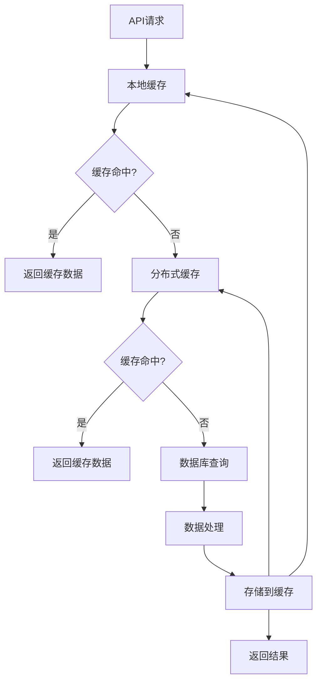

在企业级统一度量平台建设中，将指标服务API化是实现数据价值最大化的重要环节。通过提供标准化、易用的API接口，可以为各种下游应用（如报表系统、监控告警、数据分析平台等）提供统一的指标查询服务，避免重复建设，提高数据使用效率。本节将深入探讨指标API服务的设计原则、技术实现和最佳实践。

## 指标API服务的核心价值

### 1.1 统一数据出口

指标API服务作为统一的数据出口，解决了数据孤岛和重复建设的问题：

```yaml
统一数据出口的价值:
  数据一致性:
    - 所有应用使用同一份数据源
    - 避免因数据源不同导致的不一致
    - 确保指标定义和计算逻辑的统一
  降低复杂度:
    - 下游应用无需关心数据存储细节
    - 简化数据接入流程
    - 减少维护成本
  提高效率:
    - 避免重复的数据处理逻辑
    - 加快应用开发速度
    - 提升数据使用效率
```

### 1.2 服务化架构优势

采用服务化架构提供指标查询服务，具有以下优势：

```yaml
服务化架构优势:
  可扩展性:
    - 支持水平扩展应对高并发
    - 可根据需求独立扩展计算能力
    - 支持多租户隔离
  可维护性:
    - 集中管理指标计算逻辑
    - 统一的版本控制和更新机制
    - 独立部署和升级
  可监控性:
    - 统一的访问日志和性能监控
    - 详细的API调用统计
    - 可视化的服务健康状态
```

## API设计原则与规范

### 2.1 设计原则

#### 2.1.1 RESTful设计原则

遵循RESTful设计原则，使API易于理解和使用：

```yaml
RESTful设计原则:
  资源导向:
    - 将指标视为资源
    - 使用名词而非动词
    - 如：/api/v1/metrics/{metricId}
  统一接口:
    - 使用标准HTTP方法
    - GET获取数据，POST创建资源等
  无状态:
    - 每个请求包含完整信息
    - 服务端不保存客户端状态
  可缓存:
    - 支持HTTP缓存机制
    - 合理设置缓存头
```

#### 2.1.2 易用性原则

API设计应注重易用性，降低使用门槛：

```yaml
易用性原则:
  直观的URL设计:
    - URL结构清晰易懂
    - 支持层级化组织
  丰富的查询参数:
    - 支持时间范围查询
    - 支持维度过滤
    - 支持聚合计算
  详细的文档:
    - 提供完整的API文档
    - 包含示例和错误码说明
    - 支持在线测试
```

### 2.2 API规范定义

#### 2.2.1 URL结构设计

```yaml
URL结构:
  基础路径:
    - /api/v1/metrics - 指标相关接口
  资源路径:
    - GET /api/v1/metrics - 获取指标列表
    - GET /api/v1/metrics/{metricId} - 获取指定指标定义
    - GET /api/v1/metrics/{metricId}/data - 获取指标数据
    - GET /api/v1/metrics/{metricId}/lineage - 获取指标血缘关系
  查询参数:
    - ?startTime=2025-01-01&endTime=2025-01-31 - 时间范围
    - ?dimensions=region:cn-north,product:cloud - 维度过滤
    - ?aggregation=sum&groupBy=region - 聚合计算
```

#### 2.2.2 请求响应格式

```json
// 指标定义响应示例
{
  "code": 200,
  "message": "success",
  "data": {
    "id": "user_active_daily",
    "name": "日活跃用户数",
    "description": "每日访问产品的独立用户数",
    "domain": "user",
    "type": "atomic",
    "calculationLogic": "COUNT(DISTINCT user_id)",
    "dataSource": "user_events",
    "dimensions": ["region", "product", "channel"],
    "owner": "product-team",
    "createdAt": "2025-01-01T00:00:00Z",
    "updatedAt": "2025-01-01T00:00:00Z"
  }
}

// 指标数据响应示例
{
  "code": 200,
  "message": "success",
  "data": {
    "metricId": "user_active_daily",
    "timeRange": {
      "startTime": "2025-01-01T00:00:00Z",
      "endTime": "2025-01-07T00:00:00Z"
    },
    "dimensions": {
      "region": "cn-north"
    },
    "dataPoints": [
      {
        "timestamp": "2025-01-01T00:00:00Z",
        "value": 12345,
        "dimensions": {
          "region": "cn-north",
          "product": "cloud"
        }
      },
      {
        "timestamp": "2025-01-02T00:00:00Z",
        "value": 13456,
        "dimensions": {
          "region": "cn-north",
          "product": "cloud"
        }
      }
    ],
    "aggregatedValue": 12900.5
  }
}
```

## 核心API接口设计

### 3.1 指标元数据接口

#### 3.1.1 获取指标列表

```java
@RestController
@RequestMapping("/api/v1/metrics")
public class MetricMetadataController {
    
    @Autowired
    private MetricMetadataService metadataService;
    
    /**
     * 获取指标列表
     */
    @GetMapping
    public ResponseEntity<ApiResponse<List<MetricSummary>>> getMetrics(
            @RequestParam(required = false) String domain,
            @RequestParam(required = false) String type,
            @RequestParam(defaultValue = "0") int page,
            @RequestParam(defaultValue = "20") int size) {
        
        MetricQueryCriteria criteria = MetricQueryCriteria.builder()
            .domain(domain)
            .type(type)
            .page(page)
            .size(size)
            .build();
        
        Page<MetricSummary> metrics = metadataService.queryMetrics(criteria);
        
        return ResponseEntity.ok(ApiResponse.success(metrics.getContent()));
    }
    
    /**
     * 获取指标详细定义
     */
    @GetMapping("/{metricId}")
    public ResponseEntity<ApiResponse<MetricDefinition>> getMetricDefinition(
            @PathVariable String metricId) {
        
        MetricDefinition definition = metadataService.getMetricDefinition(metricId);
        if (definition == null) {
            return ResponseEntity.notFound().build();
        }
        
        return ResponseEntity.ok(ApiResponse.success(definition));
    }
    
    /**
     * 搜索指标
     */
    @GetMapping("/search")
    public ResponseEntity<ApiResponse<List<MetricSummary>>> searchMetrics(
            @RequestParam String keyword,
            @RequestParam(required = false) String domain) {
        
        List<MetricSummary> metrics = metadataService.searchMetrics(keyword, domain);
        return ResponseEntity.ok(ApiResponse.success(metrics));
    }
}
```

#### 3.1.2 指标血缘关系接口

```python
class MetricLineageController:
    def __init__(self, lineage_service):
        self.lineage_service = lineage_service
    
    def get_metric_lineage(self, metric_id):
        """
        获取指标血缘关系
        """
        try:
            lineage = self.lineage_service.get_lineage(metric_id)
            
            response = {
                "code": 200,
                "message": "success",
                "data": {
                    "metricId": metric_id,
                    "sources": lineage.get("sources", []),
                    "derivedMetrics": lineage.get("derivedMetrics", []),
                    "compositeMetrics": lineage.get("compositeMetrics", [])
                }
            }
            
            return jsonify(response), 200
            
        except MetricNotFoundException as e:
            return jsonify({
                "code": 404,
                "message": f"指标未找到: {str(e)}"
            }), 404
            
        except Exception as e:
            return jsonify({
                "code": 500,
                "message": f"内部错误: {str(e)}"
            }), 500
```

### 3.2 指标数据查询接口

#### 3.2.1 基础数据查询

```javascript
class MetricDataController {
    constructor(metricDataService, cacheService) {
        this.metricDataService = metricDataService;
        this.cacheService = cacheService;
    }
    
    async getMetricData(req, res) {
        try {
            const { metricId } = req.params;
            const { 
                startTime, 
                endTime, 
                dimensions, 
                aggregation, 
                groupBy,
                format = 'json'
            } = req.query;
            
            // 参数验证
            if (!metricId) {
                return res.status(400).json({
                    code: 400,
                    message: "缺少必需参数: metricId"
                });
            }
            
            // 构建查询参数
            const queryParams = {
                metricId,
                timeRange: {
                    startTime: startTime ? new Date(startTime) : null,
                    endTime: endTime ? new Date(endTime) : null
                },
                dimensions: this.parseDimensions(dimensions),
                aggregation: aggregation || 'none',
                groupBy: groupBy ? groupBy.split(',') : []
            };
            
            // 检查缓存
            const cacheKey = this.generateCacheKey(queryParams);
            let result = await this.cacheService.get(cacheKey);
            
            if (!result) {
                // 查询数据
                result = await this.metricDataService.queryMetricData(queryParams);
                
                // 缓存结果（1小时）
                await this.cacheService.set(cacheKey, result, 3600);
            }
            
            // 根据format参数返回不同格式
            if (format === 'csv') {
                return this.returnAsCSV(res, result);
            } else {
                return res.json({
                    code: 200,
                    message: "success",
                    data: result
                });
            }
            
        } catch (error) {
            console.error("查询指标数据失败:", error);
            
            return res.status(500).json({
                code: 500,
                message: `查询失败: ${error.message}`
            });
        }
    }
    
    parseDimensions(dimensionsStr) {
        if (!dimensionsStr) return {};
        
        const dimensions = {};
        const pairs = dimensionsStr.split(',');
        
        for (const pair of pairs) {
            const [key, value] = pair.split(':');
            if (key && value) {
                dimensions[key.trim()] = value.trim();
            }
        }
        
        return dimensions;
    }
    
    generateCacheKey(queryParams) {
        // 生成缓存键
        const keyData = {
            ...queryParams,
            timeRange: {
                startTime: queryParams.timeRange.startTime?.toISOString(),
                endTime: queryParams.timeRange.endTime?.toISOString()
            }
        };
        
        return `metric_data_${JSON.stringify(keyData)}`;
    }
    
    returnAsCSV(res, data) {
        // 将数据转换为CSV格式
        let csvContent = "timestamp,value";
        
        // 添加维度列头
        if (data.dataPoints.length > 0 && data.dataPoints[0].dimensions) {
            const dimensionKeys = Object.keys(data.dataPoints[0].dimensions);
            csvContent += "," + dimensionKeys.join(",");
        }
        csvContent += "\n";
        
        // 添加数据行
        for (const point of data.dataPoints) {
            csvContent += `${point.timestamp},${point.value}`;
            
            if (point.dimensions) {
                const dimensionValues = Object.values(point.dimensions);
                csvContent += "," + dimensionValues.join(",");
            }
            csvContent += "\n";
        }
        
        res.setHeader('Content-Type', 'text/csv');
        res.setHeader('Content-Disposition', `attachment; filename="metric_${data.metricId}.csv"`);
        res.send(csvContent);
    }
}
```

#### 3.2.2 实时数据查询

```go
type RealTimeMetricController struct {
    service *RealTimeMetricService
    cache   *CacheService
}

func (c *RealTimeMetricController) GetRealTimeMetricData(ctx *gin.Context) {
    metricId := ctx.Param("metricId")
    if metricId == "" {
        ctx.JSON(http.StatusBadRequest, gin.H{
            "code":    400,
            "message": "缺少必需参数: metricId",
        })
        return
    }
    
    // 解析查询参数
    query := &MetricQuery{
        MetricId: metricId,
        Window:   ctx.DefaultQuery("window", "5m"), // 默认5分钟窗口
        Format:   ctx.DefaultQuery("format", "json"),
    }
    
    // 从缓存获取数据
    cacheKey := fmt.Sprintf("realtime_%s_%s", metricId, query.Window)
    if cachedData, found := c.cache.Get(cacheKey); found {
        ctx.JSON(http.StatusOK, gin.H{
            "code": 200,
            "message": "success",
            "data": cachedData,
        })
        return
    }
    
    // 查询实时数据
    data, err := c.service.GetRealTimeData(query)
    if err != nil {
        ctx.JSON(http.StatusInternalServerError, gin.H{
            "code":    500,
            "message": fmt.Sprintf("查询失败: %v", err),
        })
        return
    }
    
    // 缓存结果
    c.cache.Set(cacheKey, data, 30*time.Second) // 实时数据缓存30秒
    
    ctx.JSON(http.StatusOK, gin.H{
        "code": 200,
        "message": "success",
        "data": data,
    })
}

func (s *RealTimeMetricService) GetRealTimeData(query *MetricQuery) (*RealTimeMetricData, error) {
    // 解析时间窗口
    window, err := time.ParseDuration(query.Window)
    if err != nil {
        return nil, fmt.Errorf("无效的时间窗口: %v", err)
    }
    
    // 计算时间范围
    endTime := time.Now()
    startTime := endTime.Add(-window)
    
    // 查询实时数据
    // 这里可以集成各种实时数据源，如Kafka、Redis等
    dataPoints, err := s.queryRealTimeDataSource(query.MetricId, startTime, endTime)
    if err != nil {
        return nil, err
    }
    
    // 计算统计值
    stats := s.calculateStatistics(dataPoints)
    
    return &RealTimeMetricData{
        MetricId:   query.MetricId,
        TimeRange:  TimeRange{Start: startTime, End: endTime},
        DataPoints: dataPoints,
        Statistics: stats,
    }, nil
}
```

## API安全与权限控制

### 4.1 认证机制

#### 4.1.1 API密钥认证

```yaml
API密钥认证:
  密钥生成:
    - 为每个应用生成唯一的API密钥
    - 支持密钥的创建、更新、撤销
    - 密钥应具备有效期限制
  密钥验证:
    - 请求头中包含X-API-Key
    - 服务端验证密钥有效性
    - 记录密钥使用日志
```

#### 4.1.2 OAuth 2.0认证

```java
@Configuration
@EnableWebSecurity
public class SecurityConfig {
    
    @Bean
    public SecurityFilterChain filterChain(HttpSecurity http) throws Exception {
        http
            .authorizeHttpRequests(authorize -> authorize
                .requestMatchers("/api/public/**").permitAll()
                .requestMatchers("/api/v1/metrics/**").authenticated()
                .anyRequest().authenticated()
            )
            .oauth2ResourceServer(oauth2 -> oauth2
                .jwt(jwt -> jwt
                    .jwtAuthenticationConverter(jwtAuthenticationConverter())
                )
            );
        
        return http.build();
    }
    
    @Bean
    public JwtAuthenticationConverter jwtAuthenticationConverter() {
        JwtGrantedAuthoritiesConverter authoritiesConverter = 
            new JwtGrantedAuthoritiesConverter();
        authoritiesConverter.setAuthorityPrefix("ROLE_");
        authoritiesConverter.setAuthoritiesClaimName("roles");
        
        JwtAuthenticationConverter converter = new JwtAuthenticationConverter();
        converter.setJwtGrantedAuthoritiesConverter(authoritiesConverter);
        return converter;
    }
}
```

### 4.2 权限控制

#### 4.2.1 基于角色的访问控制（RBAC）

```python
class PermissionService:
    def __init__(self, user_service, role_service):
        self.user_service = user_service
        self.role_service = role_service
    
    def check_permission(self, user_id, metric_id, action):
        """
        检查用户对指标的权限
        """
        # 获取用户角色
        user_roles = self.user_service.get_user_roles(user_id)
        
        # 获取指标权限配置
        metric_permissions = self.role_service.get_metric_permissions(metric_id)
        
        # 检查权限
        for role in user_roles:
            if role in metric_permissions:
                role_permissions = metric_permissions[role]
                if action in role_permissions:
                    return True
        
        return False
    
    def filter_metrics_by_permission(self, user_id, metrics):
        """
        根据用户权限过滤指标列表
        """
        filtered_metrics = []
        
        for metric in metrics:
            if self.check_permission(user_id, metric['id'], 'read'):
                filtered_metrics.append(metric)
        
        return filtered_metrics
```

#### 4.2.2 数据行级权限控制

```sql
-- 基于用户组织架构的数据权限控制
CREATE VIEW user_metrics AS
SELECT 
    m.*,
    mp.permission_level
FROM metrics m
JOIN metric_permissions mp ON m.metric_id = mp.metric_id
JOIN user_organizations uo ON mp.org_id = uo.org_id
WHERE uo.user_id = @current_user_id
  AND mp.permission_level IN ('read', 'write', 'admin');

-- 查询用户有权限的指标数据
SELECT 
    md.*
FROM metric_data md
JOIN user_metrics um ON md.metric_id = um.metric_id
WHERE um.permission_level IN ('read', 'write', 'admin')
  AND md.dimensions @> jsonb_build_object('org_id', @user_org_id);
```

## API性能优化

### 5.1 缓存策略

#### 5.1.1 多级缓存架构



#### 5.1.2 缓存实现

```typescript
class MetricCacheService {
    private localCache: Map<string, CacheEntry>;
    private redisClient: RedisClient;
    private readonly LOCAL_CACHE_SIZE = 1000;
    
    constructor(redisClient: RedisClient) {
        this.redisClient = redisClient;
        this.localCache = new Map();
    }
    
    async getMetricData(cacheKey: string): Promise<MetricData | null> {
        // 1. 检查本地缓存
        const localEntry = this.localCache.get(cacheKey);
        if (localEntry && !this.isExpired(localEntry)) {
            return localEntry.data;
        }
        
        // 2. 检查Redis缓存
        try {
            const redisData = await this.redisClient.get(cacheKey);
            if (redisData) {
                const data = JSON.parse(redisData) as MetricData;
                // 回填本地缓存
                this.setLocalCache(cacheKey, data);
                return data;
            }
        } catch (error) {
            console.warn('Redis缓存读取失败:', error);
        }
        
        return null;
    }
    
    async setMetricData(cacheKey: string, data: MetricData, ttl: number): Promise<void> {
        // 1. 设置Redis缓存
        try {
            await this.redisClient.setex(cacheKey, ttl, JSON.stringify(data));
        } catch (error) {
            console.warn('Redis缓存写入失败:', error);
        }
        
        // 2. 设置本地缓存
        this.setLocalCache(cacheKey, data, ttl);
    }
    
    private setLocalCache(key: string, data: MetricData, ttl: number = 3600): void {
        // 控制本地缓存大小
        if (this.localCache.size >= this.LOCAL_CACHE_SIZE) {
            // 移除最旧的缓存项
            const firstKey = this.localCache.keys().next().value;
            if (firstKey) {
                this.localCache.delete(firstKey);
            }
        }
        
        this.localCache.set(key, {
            data: data,
            expireTime: Date.now() + ttl * 1000
        });
    }
    
    private isExpired(entry: CacheEntry): boolean {
        return Date.now() > entry.expireTime;
    }
}
```

### 5.2 查询优化

#### 5.2.1 数据库查询优化

```sql
-- 优化指标数据查询
-- 1. 创建复合索引
CREATE INDEX idx_metric_data_lookup ON metric_data 
(metric_id, timestamp DESC, dimensions);

-- 2. 分区表优化（按时间分区）
CREATE TABLE metric_data_partitioned (
    id BIGSERIAL PRIMARY KEY,
    metric_id VARCHAR(64) NOT NULL,
    timestamp TIMESTAMP NOT NULL,
    value NUMERIC NOT NULL,
    dimensions JSONB
) PARTITION BY RANGE (timestamp);

-- 3. 优化查询语句
-- 避免全表扫描，使用索引
EXPLAIN ANALYZE
SELECT 
    timestamp,
    value,
    dimensions
FROM metric_data 
WHERE metric_id = 'user_active_daily'
  AND timestamp >= '2025-01-01' 
  AND timestamp < '2025-02-01'
  AND dimensions @> '{"region": "cn-north"}'
ORDER BY timestamp DESC
LIMIT 1000;
```

#### 5.2.2 异步处理

```rust
use tokio::task;
use std::sync::Arc;

struct AsyncMetricService {
    data_source: Arc<dyn MetricDataSource>,
    task_manager: Arc<TaskManager>,
}

impl AsyncMetricService {
    async fn query_metric_data_async(&self, query: MetricQuery) -> Result<MetricData, Error> {
        // 对于复杂查询，使用异步处理
        if self.is_complex_query(&query) {
            let task_id = self.task_manager.create_task(query.clone());
            
            // 异步执行查询
            let data_source = self.data_source.clone();
            let query_clone = query.clone();
            
            task::spawn(async move {
                let result = data_source.query_complex_data(query_clone).await;
                // 处理结果，存储到临时存储或通知客户端
                // ...
            });
            
            // 立即返回任务ID，客户端可以轮询结果
            return Err(Error::AsyncTaskCreated(task_id));
        }
        
        // 简单查询直接同步处理
        self.data_source.query_simple_data(query).await
    }
    
    fn is_complex_query(&self, query: &MetricQuery) -> bool {
        // 判断是否为复杂查询
        query.time_range.duration() > chrono::Duration::hours(24) ||
        !query.dimensions.is_empty() ||
        query.aggregations.len() > 1
    }
}
```

## API监控与治理

### 6.1 监控指标

#### 6.1.1 API性能监控

```yaml
API性能监控指标:
  请求量监控:
    - QPS（每秒请求数）
    - 并发请求数
    - 请求成功率
  响应时间监控:
    - 平均响应时间
    - P95/P99响应时间
    - 超时请求数
  错误监控:
    - 错误率统计
    - 错误类型分布
    - 异常堆栈跟踪
```

#### 6.1.2 业务指标监控

```go
type MetricAPIMonitor struct {
    metricsCollector *MetricsCollector
}

func (m *MetricAPIMonitor) RecordAPICall(method, path string, statusCode int, duration time.Duration) {
    // 记录API调用次数
    m.metricsCollector.IncrementCounter("api_calls_total", map[string]string{
        "method": method,
        "path":   path,
        "status": strconv.Itoa(statusCode),
    })
    
    // 记录响应时间
    m.metricsCollector.ObserveHistogram("api_response_time_seconds", duration.Seconds(), map[string]string{
        "method": method,
        "path":   path,
    })
    
    // 记录数据量
    m.metricsCollector.ObserveHistogram("api_response_size_bytes", float64(responseSize), map[string]string{
        "method": method,
        "path":   path,
    })
}
```

### 6.2 限流与熔断

#### 6.2.1 限流策略

```java
@Component
public class MetricAPIRateLimiter {
    
    private final RedisTemplate<String, String> redisTemplate;
    private final MeterRegistry meterRegistry;
    
    // 限流配置
    private static final int DEFAULT_RATE_LIMIT = 1000; // 每分钟1000次
    private static final int DEFAULT_WINDOW_SIZE = 60; // 60秒窗口
    
    public boolean isAllowed(String clientId, String apiPath) {
        String key = String.format("rate_limit:%s:%s", clientId, apiPath);
        String timestamp = String.valueOf(System.currentTimeMillis());
        
        try {
            // 使用Redis的有序集合实现滑动窗口限流
            redisTemplate.opsForZSet().add(key, timestamp, Double.valueOf(timestamp));
            
            // 移除窗口外的记录
            long windowStart = System.currentTimeMillis() - DEFAULT_WINDOW_SIZE * 1000;
            redisTemplate.opsForZSet().removeRangeByScore(key, 0, windowStart);
            
            // 统计当前窗口内的请求数
            long currentCount = redisTemplate.opsForZSet().zCard(key);
            
            // 记录指标
            meterRegistry.counter("api_requests_total", 
                "client_id", clientId, 
                "api_path", apiPath).increment();
            
            return currentCount <= DEFAULT_RATE_LIMIT;
            
        } catch (Exception e) {
            // Redis异常时，采用宽松策略允许请求
            log.warn("限流检查失败，采用宽松策略: {}", e.getMessage());
            return true;
        }
    }
}
```

#### 6.2.2 熔断机制

```python
from circuitbreaker import circuit
import requests
from typing import Optional

class MetricDataClient:
    def __init__(self, base_url: str, timeout: int = 30):
        self.base_url = base_url
        self.timeout = timeout
        self.session = requests.Session()
    
    @circuit(failure_threshold=5, expected_exception=Exception, timeout_duration=60)
    def query_metric_data(self, metric_id: str, **kwargs) -> Optional[dict]:
        """
        查询指标数据，带熔断保护
        """
        url = f"{self.base_url}/api/v1/metrics/{metric_id}/data"
        
        try:
            response = self.session.get(
                url, 
                params=kwargs, 
                timeout=self.timeout
            )
            response.raise_for_status()
            return response.json()
            
        except requests.exceptions.RequestException as e:
            # 记录错误日志
            logger.error(f"查询指标数据失败: {metric_id}, 错误: {str(e)}")
            raise
    
    def get_metric_definition(self, metric_id: str) -> Optional[dict]:
        """
        获取指标定义
        """
        url = f"{self.base_url}/api/v1/metrics/{metric_id}"
        
        try:
            response = self.session.get(url, timeout=self.timeout)
            response.raise_for_status()
            return response.json()
            
        except requests.exceptions.RequestException as e:
            logger.error(f"获取指标定义失败: {metric_id}, 错误: {str(e)}")
            return None
```

## 客户端SDK设计

### 7.1 多语言SDK支持

#### 7.1.1 Python SDK

```python
class MetricAPIClient:
    def __init__(self, base_url: str, api_key: str = None, timeout: int = 30):
        self.base_url = base_url.rstrip('/')
        self.api_key = api_key
        self.timeout = timeout
        self.session = requests.Session()
        
        if api_key:
            self.session.headers.update({'X-API-Key': api_key})
    
    def get_metric_definition(self, metric_id: str) -> dict:
        """获取指标定义"""
        url = f"{self.base_url}/api/v1/metrics/{metric_id}"
        response = self.session.get(url, timeout=self.timeout)
        response.raise_for_status()
        return response.json()['data']
    
    def query_metric_data(self, metric_id: str, 
                         start_time: str = None, 
                         end_time: str = None,
                         dimensions: dict = None,
                         aggregation: str = None) -> dict:
        """查询指标数据"""
        url = f"{self.base_url}/api/v1/metrics/{metric_id}/data"
        
        params = {}
        if start_time:
            params['startTime'] = start_time
        if end_time:
            params['endTime'] = end_time
        if dimensions:
            params['dimensions'] = ','.join([f"{k}:{v}" for k, v in dimensions.items()])
        if aggregation:
            params['aggregation'] = aggregation
        
        response = self.session.get(url, params=params, timeout=self.timeout)
        response.raise_for_status()
        return response.json()['data']
    
    def search_metrics(self, keyword: str, domain: str = None) -> list:
        """搜索指标"""
        url = f"{self.base_url}/api/v1/metrics/search"
        
        params = {'keyword': keyword}
        if domain:
            params['domain'] = domain
        
        response = self.session.get(url, params=params, timeout=self.timeout)
        response.raise_for_status()
        return response.json()['data']

# 使用示例
client = MetricAPIClient('https://metrics-api.example.com', 'your-api-key')

# 获取指标定义
definition = client.get_metric_definition('user_active_daily')
print(f"指标名称: {definition['name']}")

# 查询指标数据
data = client.query_metric_data(
    'user_active_daily',
    start_time='2025-01-01T00:00:00Z',
    end_time='2025-01-07T00:00:00Z',
    dimensions={'region': 'cn-north'}
)
print(f"数据点数量: {len(data['dataPoints'])}")
```

#### 7.1.2 Java SDK

```java
public class MetricAPIClient {
    private final String baseUrl;
    private final String apiKey;
    private final OkHttpClient httpClient;
    private final ObjectMapper objectMapper;
    
    public MetricAPIClient(String baseUrl, String apiKey) {
        this.baseUrl = baseUrl.endsWith("/") ? baseUrl.substring(0, baseUrl.length() - 1) : baseUrl;
        this.apiKey = apiKey;
        this.httpClient = new OkHttpClient.Builder()
            .connectTimeout(30, TimeUnit.SECONDS)
            .readTimeout(30, TimeUnit.SECONDS)
            .build();
        this.objectMapper = new ObjectMapper();
    }
    
    public MetricDefinition getMetricDefinition(String metricId) throws IOException {
        String url = String.format("%s/api/v1/metrics/%s", baseUrl, metricId);
        
        Request request = new Request.Builder()
            .url(url)
            .addHeader("X-API-Key", apiKey)
            .build();
        
        try (Response response = httpClient.newCall(request).execute()) {
            if (!response.isSuccessful()) {
                throw new IOException("请求失败: " + response.code());
            }
            
            String responseBody = response.body().string();
            ApiResponse<MetricDefinition> apiResponse = objectMapper.readValue(
                responseBody, 
                new TypeReference<ApiResponse<MetricDefinition>>() {}
            );
            
            return apiResponse.getData();
        }
    }
    
    public MetricData queryMetricData(String metricId, MetricQueryParams params) throws IOException {
        HttpUrl.Builder urlBuilder = HttpUrl.parse(
            String.format("%s/api/v1/metrics/%s/data", baseUrl, metricId)
        ).newBuilder();
        
        // 添加查询参数
        if (params.getStartTime() != null) {
            urlBuilder.addQueryParameter("startTime", params.getStartTime().toString());
        }
        if (params.getEndTime() != null) {
            urlBuilder.addQueryParameter("endTime", params.getEndTime().toString());
        }
        if (params.getDimensions() != null && !params.getDimensions().isEmpty()) {
            String dimensionsStr = params.getDimensions().entrySet().stream()
                .map(entry -> entry.getKey() + ":" + entry.getValue())
                .collect(Collectors.joining(","));
            urlBuilder.addQueryParameter("dimensions", dimensionsStr);
        }
        
        Request request = new Request.Builder()
            .url(urlBuilder.build())
            .addHeader("X-API-Key", apiKey)
            .build();
        
        try (Response response = httpClient.newCall(request).execute()) {
            if (!response.isSuccessful()) {
                throw new IOException("请求失败: " + response.code());
            }
            
            String responseBody = response.body().string();
            ApiResponse<MetricData> apiResponse = objectMapper.readValue(
                responseBody,
                new TypeReference<ApiResponse<MetricData>>() {}
            );
            
            return apiResponse.getData();
        }
    }
}

// 使用示例
MetricAPIClient client = new MetricAPIClient("https://metrics-api.example.com", "your-api-key");

try {
    // 获取指标定义
    MetricDefinition definition = client.getMetricDefinition("user_active_daily");
    System.out.println("指标名称: " + definition.getName());
    
    // 查询指标数据
    MetricQueryParams params = new MetricQueryParams.Builder()
        .startTime(Instant.parse("2025-01-01T00:00:00Z"))
        .endTime(Instant.parse("2025-01-07T00:00:00Z"))
        .addDimension("region", "cn-north")
        .build();
    
    MetricData data = client.queryMetricData("user_active_daily", params);
    System.out.println("数据点数量: " + data.getDataPoints().size());
    
} catch (IOException e) {
    System.err.println("API调用失败: " + e.getMessage());
}
```

## 实施案例与最佳实践

### 8.1 案例1：某大型互联网公司的指标API平台

该公司构建了统一的指标API平台，服务数千个内部应用：

1. **架构设计**：
   - 采用微服务架构，独立部署
   - 支持多租户和权限隔离
   - 实现多级缓存和异步处理

2. **性能表现**：
   - 平均响应时间：<50ms
   - 支持10万+ QPS
   - 99.9%可用性保障

3. **安全机制**：
   - 多层次认证和授权
   - 细粒度权限控制
   - 完整的审计日志

### 8.2 案例2：某金融机构的实时指标服务

该机构构建了低延迟的实时指标服务：

1. **技术选型**：
   - 基于Apache Kafka实现实时数据流
   - 使用Redis作为高速缓存
   - 采用Go语言实现高性能API

2. **关键特性**：
   - 毫秒级延迟
   - 支持复杂聚合计算
   - 提供WebSocket实时推送

3. **业务价值**：
   - 支持实时风控决策
   - 提升用户体验
   - 降低业务风险

### 8.3 最佳实践总结

基于多个实施案例，总结出以下最佳实践：

```yaml
最佳实践:
  架构设计:
    - 采用微服务架构，独立部署和扩展
    - 实现多级缓存，提升查询性能
    - 支持异步处理，应对复杂查询
  安全保障:
    - 实施多层次认证和授权机制
    - 建立完善的权限控制体系
    - 记录完整的操作审计日志
  性能优化:
    - 优化数据库查询和索引设计
    - 实施合理的限流和熔断机制
    - 监控关键性能指标
  用户体验:
    - 提供多语言SDK
    - 编写详细的API文档
    - 支持多种数据格式输出
```

## 实施建议与注意事项

### 9.1 实施建议

1. **分阶段实施**：
   - 先实现核心指标的API服务
   - 逐步扩展到全量指标
   - 边实施边优化

2. **工具支撑**：
   - 建设统一的API网关
   - 提供可视化的监控面板
   - 集成日志分析系统

3. **团队建设**：
   - 培养API设计和开发人才
   - 建立API治理团队
   - 推广API使用最佳实践

### 9.2 注意事项

1. **版本管理**：
   - 合理设计API版本策略
   - 确保向后兼容性
   - 建立版本淘汰机制

2. **性能考量**：
   - 评估API调用对系统性能的影响
   - 实施合理的缓存策略
   - 监控和优化关键路径

3. **安全防护**：
   - 实施完善的认证授权机制
   - 防范常见安全攻击
   - 定期进行安全审计

## 总结

API化服务是企业级统一度量平台的重要组成部分，通过提供标准化、易用的API接口，可以为各种下游应用提供统一的指标查询服务。在设计和实现过程中，需要关注以下几个关键点：

1. **遵循设计原则**：采用RESTful设计，注重易用性
2. **完善安全机制**：实施认证授权和权限控制
3. **优化性能表现**：通过缓存和异步处理提升性能
4. **建立监控体系**：实现全面的监控和治理
5. **提供客户端支持**：开发多语言SDK降低使用门槛

通过系统性的方法和最佳实践，可以构建出高性能、高可用、易使用的指标API服务，为企业的数据驱动决策提供强有力的技术支撑。这标志着第7章"指标定义与服务中心"的完整内容创作完成，接下来我们将进入第8章"可视化、报表与洞察"的创作。