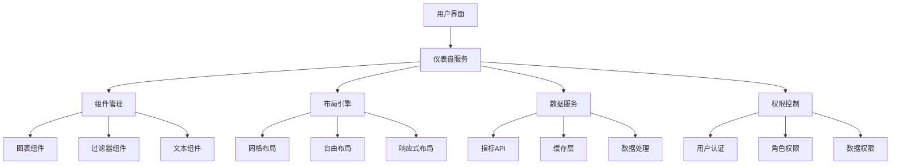

在企业级统一度量平台中，仪表盘是用户与数据交互的主要界面。一个优秀的可配置化仪表盘不仅能够直观地展示关键指标，还能让用户根据自己的需求自由定制视图。本节将深入探讨如何设计和实现支持拖拽、自定义和分享功能的仪表盘系统，提升用户体验和数据使用效率。

## 可配置化仪表盘的核心价值

### 1.1 提升用户体验

可配置化仪表盘通过提供灵活的界面定制能力，显著提升用户体验：

```yaml
用户体验提升:
  个性化定制:
    - 用户可根据角色和需求定制视图
    - 支持保存多个仪表盘模板
    - 提供个性化主题和布局选项
  操作便捷性:
    - 拖拽式组件添加和调整
    - 直观的配置界面
    - 实时预览功能
  协作共享:
    - 支持仪表盘分享和协作
    - 提供评论和标注功能
    - 支持团队模板库
```

### 1.2 降低使用门槛

通过可视化的配置方式，降低用户使用数据分析工具的门槛：

```yaml
降低使用门槛:
  无需编程:
    - 图形化界面操作
    - 预设模板和组件
    - 向导式配置流程
  快速上手:
    - 直观的操作指引
    - 丰富的帮助文档
    - 实时效果预览
  灵活适配:
    - 支持多种数据源
    - 适配不同屏幕尺寸
    - 响应式布局设计
```

## 仪表盘架构设计

### 2.1 整体架构

可配置化仪表盘的架构需要支持高可用性、可扩展性和易维护性：



### 2.2 核心组件设计

#### 2.2.1 仪表盘管理服务

```java
@Service
public class DashboardService {
    
    @Autowired
    private DashboardRepository dashboardRepository;
    
    @Autowired
    private ComponentService componentService;
    
    @Autowired
    private DataService dataService;
    
    /**
     * 创建新仪表盘
     */
    public Dashboard createDashboard(DashboardCreateRequest request, String userId) {
        Dashboard dashboard = new Dashboard();
        dashboard.setName(request.getName());
        dashboard.setDescription(request.getDescription());
        dashboard.setOwnerId(userId);
        dashboard.setLayoutType(request.getLayoutType());
        dashboard.setIsPublic(request.getIsPublic());
        dashboard.setCreatedAt(new Timestamp(System.currentTimeMillis()));
        dashboard.setUpdatedAt(new Timestamp(System.currentTimeMillis()));
        
        return dashboardRepository.save(dashboard);
    }
    
    /**
     * 更新仪表盘配置
     */
    public Dashboard updateDashboard(String dashboardId, DashboardUpdateRequest request, String userId) {
        Dashboard dashboard = dashboardRepository.findById(dashboardId)
            .orElseThrow(() -> new DashboardNotFoundException("仪表盘不存在: " + dashboardId));
        
        // 权限检查
        if (!dashboard.getOwnerId().equals(userId) && !hasEditPermission(userId, dashboardId)) {
            throw new PermissionDeniedException("无权限编辑此仪表盘");
        }
        
        // 更新配置
        if (request.getName() != null) {
            dashboard.setName(request.getName());
        }
        if (request.getDescription() != null) {
            dashboard.setDescription(request.getDescription());
        }
        if (request.getLayout() != null) {
            dashboard.setLayout(request.getLayout());
        }
        dashboard.setUpdatedAt(new Timestamp(System.currentTimeMillis()));
        
        return dashboardRepository.save(dashboard);
    }
    
    /**
     * 获取仪表盘数据
     */
    public DashboardData getDashboardData(String dashboardId, Map<String, Object> filters) {
        Dashboard dashboard = dashboardRepository.findById(dashboardId)
            .orElseThrow(() -> new DashboardNotFoundException("仪表盘不存在: " + dashboardId));
        
        // 获取组件配置
        List<Component> components = componentService.getComponentsByDashboard(dashboardId);
        
        // 获取组件数据
        DashboardData dashboardData = new DashboardData();
        dashboardData.setDashboardId(dashboardId);
        dashboardData.setComponents(new ArrayList<>());
        
        for (Component component : components) {
            ComponentData componentData = new ComponentData();
            componentData.setComponentId(component.getId());
            componentData.setComponentType(component.getType());
            componentData.setPosition(component.getPosition());
            componentData.setConfig(component.getConfig());
            
            // 获取组件数据
            if (component.getDataSource() != null) {
                Object data = dataService.getComponentData(
                    component.getDataSource(), 
                    component.getQueryParams(), 
                    filters
                );
                componentData.setData(data);
            }
            
            dashboardData.getComponents().add(componentData);
        }
        
        return dashboardData;
    }
}
```

#### 2.2.2 组件管理系统

```typescript
class ComponentManager {
    private components: Map<string, ComponentType>;
    private registry: ComponentRegistry;
    
    constructor(registry: ComponentRegistry) {
        this.registry = registry;
        this.components = new Map();
        this.initializeBuiltInComponents();
    }
    
    private initializeBuiltInComponents(): void {
        // 注册内置组件
        this.registerComponent('line-chart', new LineChartComponent());
        this.registerComponent('bar-chart', new BarChartComponent());
        this.registerComponent('pie-chart', new PieChartComponent());
        this.registerComponent('table', new TableComponent());
        this.registerComponent('kpi', new KPIComponent());
        this.registerComponent('text', new TextComponent());
        this.registerComponent('filter', new FilterComponent());
    }
    
    registerComponent(type: string, component: ComponentType): void {
        this.components.set(type, component);
    }
    
    getComponent(type: string): ComponentType | undefined {
        return this.components.get(type);
    }
    
    getAvailableComponents(): ComponentInfo[] {
        const componentInfos: ComponentInfo[] = [];
        
        this.components.forEach((component, type) => {
            componentInfos.push({
                type: type,
                name: component.getName(),
                description: component.getDescription(),
                icon: component.getIcon(),
                category: component.getCategory(),
                configSchema: component.getConfigSchema()
            });
        });
        
        return componentInfos;
    }
    
    renderComponent(type: string, config: ComponentConfig, data: any): HTMLElement {
        const component = this.getComponent(type);
        if (!component) {
            throw new Error(`组件类型未找到: ${type}`);
        }
        
        return component.render(config, data);
    }
}

interface ComponentType {
    getName(): string;
    getDescription(): string;
    getIcon(): string;
    getCategory(): string;
    getConfigSchema(): ConfigSchema;
    render(config: ComponentConfig, data: any): HTMLElement;
}

class LineChartComponent implements ComponentType {
    getName(): string {
        return '折线图';
    }
    
    getDescription(): string {
        return '用于展示数据随时间变化的趋势';
    }
    
    getIcon(): string {
        return 'line-chart';
    }
    
    getCategory(): string {
        return 'charts';
    }
    
    getConfigSchema(): ConfigSchema {
        return {
            type: 'object',
            properties: {
                metricId: {
                    type: 'string',
                    title: '指标ID',
                    description: '要展示的指标'
                },
                xAxis: {
                    type: 'string',
                    title: 'X轴字段',
                    description: 'X轴使用的数据字段'
                },
                yAxis: {
                    type: 'string',
                    title: 'Y轴字段',
                    description: 'Y轴使用的数据字段'
                },
                color: {
                    type: 'string',
                    title: '颜色',
                    description: '图表颜色'
                }
            },
            required: ['metricId', 'xAxis', 'yAxis']
        };
    }
    
    render(config: ComponentConfig, data: any): HTMLElement {
        const container = document.createElement('div');
        container.className = 'line-chart-container';
        
        // 使用Chart.js或其他图表库渲染折线图
        // 这里简化处理，实际实现会更复杂
        const canvas = document.createElement('canvas');
        container.appendChild(canvas);
        
        // 渲染图表逻辑
        this.renderChart(canvas, config, data);
        
        return container;
    }
    
    private renderChart(canvas: HTMLCanvasElement, config: ComponentConfig, data: any): void {
        // 实际的图表渲染逻辑
        // 使用Chart.js、D3.js等库实现
    }
}
```

## 拖拽式界面实现

### 3.1 拖拽交互设计

#### 3.1.1 拖拽事件处理

```javascript
class DragAndDropManager {
    constructor(container) {
        this.container = container;
        this.draggedElement = null;
        this.draggedComponent = null;
        this.initializeEventListeners();
    }
    
    initializeEventListeners() {
        // 组件面板拖拽开始
        this.container.addEventListener('dragstart', (e) => {
            if (e.target.classList.contains('component-item')) {
                this.draggedComponent = {
                    type: e.target.dataset.componentType,
                    name: e.target.dataset.componentName
                };
                e.dataTransfer.effectAllowed = 'copy';
            }
        });
        
        // 仪表盘区域拖拽进入
        this.container.addEventListener('dragenter', (e) => {
            if (this.draggedComponent && e.target.classList.contains('dashboard-grid')) {
                e.preventDefault();
                e.target.classList.add('drag-over');
            }
        });
        
        // 仪表盘区域拖拽悬停
        this.container.addEventListener('dragover', (e) => {
            if (this.draggedComponent) {
                e.preventDefault();
                e.dataTransfer.dropEffect = 'copy';
            }
        });
        
        // 仪表盘区域拖拽离开
        this.container.addEventListener('dragleave', (e) => {
            if (e.target.classList.contains('dashboard-grid')) {
                e.target.classList.remove('drag-over');
            }
        });
        
        // 仪表盘区域放置
        this.container.addEventListener('drop', (e) => {
            if (this.draggedComponent) {
                e.preventDefault();
                e.target.classList.remove('drag-over');
                
                // 计算放置位置
                const position = this.calculateDropPosition(e);
                
                // 添加组件到仪表盘
                this.addComponentToDashboard(this.draggedComponent.type, position);
                
                this.draggedComponent = null;
            }
        });
    }
    
    calculateDropPosition(event) {
        const grid = event.target.closest('.dashboard-grid');
        if (!grid) return { x: 0, y: 0 };
        
        const rect = grid.getBoundingClientRect();
        const x = event.clientX - rect.left;
        const y = event.clientY - rect.top;
        
        // 转换为网格坐标
        const gridSize = 20; // 20px网格
        return {
            x: Math.floor(x / gridSize) * gridSize,
            y: Math.floor(y / gridSize) * gridSize
        };
    }
    
    addComponentToDashboard(componentType, position) {
        // 创建组件实例
        const component = {
            id: this.generateComponentId(),
            type: componentType,
            position: position,
            config: {}
        };
        
        // 触发添加组件事件
        this.container.dispatchEvent(new CustomEvent('component-added', {
            detail: { component }
        }));
    }
    
    generateComponentId() {
        return 'component_' + Date.now() + '_' + Math.random().toString(36).substr(2, 9);
    }
}
```

#### 3.1.2 网格布局系统

```css
/* 仪表盘网格布局样式 */
.dashboard-grid {
    position: relative;
    width: 100%;
    height: 100%;
    background-image: 
        linear-gradient(rgba(0, 0, 0, 0.1) 1px, transparent 1px),
        linear-gradient(90deg, rgba(0, 0, 0, 0.1) 1px, transparent 1px);
    background-size: 20px 20px;
    min-height: 600px;
}

.dashboard-grid.drag-over {
    background-color: rgba(0, 123, 255, 0.1);
    border: 2px dashed #007bff;
}

.dashboard-component {
    position: absolute;
    border: 1px solid #ddd;
    border-radius: 4px;
    background: white;
    box-shadow: 0 2px 4px rgba(0,0,0,0.1);
    transition: all 0.2s ease;
}

.dashboard-component:hover {
    box-shadow: 0 4px 8px rgba(0,0,0,0.15);
    border-color: #007bff;
}

.dashboard-component.selected {
    border-color: #007bff;
    box-shadow: 0 0 0 2px rgba(0, 123, 255, 0.25);
}

.component-resizer {
    position: absolute;
    width: 10px;
    height: 10px;
    background: #007bff;
    border-radius: 50%;
    cursor: se-resize;
    bottom: 0;
    right: 0;
    transform: translate(50%, 50%);
}
```

### 3.2 组件配置面板

```html
<!-- 组件配置面板 -->
<div class="component-config-panel">
    <div class="panel-header">
        <h3>组件配置</h3>
        <button class="close-btn">&times;</button>
    </div>
    <div class="panel-body">
        <form id="component-config-form">
            <div class="form-group">
                <label for="component-title">标题</label>
                <input type="text" id="component-title" name="title" class="form-control">
            </div>
            
            <div class="form-group">
                <label for="component-metric">指标</label>
                <select id="component-metric" name="metricId" class="form-control">
                    <option value="">请选择指标</option>
                    <!-- 动态加载指标选项 -->
                </select>
            </div>
            
            <div class="form-group">
                <label for="component-time-range">时间范围</label>
                <select id="component-time-range" name="timeRange" class="form-control">
                    <option value="1h">最近1小时</option>
                    <option value="24h">最近24小时</option>
                    <option value="7d">最近7天</option>
                    <option value="30d">最近30天</option>
                </select>
            </div>
            
            <div class="form-group">
                <label>维度过滤</label>
                <div class="dimension-filters">
                    <!-- 动态添加维度过滤器 -->
                </div>
                <button type="button" class="btn btn-sm btn-outline-primary" id="add-dimension-filter">
                    添加过滤条件
                </button>
            </div>
            
            <div class="form-group">
                <label for="component-refresh-interval">刷新间隔</label>
                <select id="component-refresh-interval" name="refreshInterval" class="form-control">
                    <option value="0">不自动刷新</option>
                    <option value="30">30秒</option>
                    <option value="60">1分钟</option>
                    <option value="300">5分钟</option>
                    <option value="600">10分钟</option>
                </select>
            </div>
        </form>
    </div>
    <div class="panel-footer">
        <button type="button" class="btn btn-primary" id="save-component-config">保存</button>
        <button type="button" class="btn btn-secondary" id="cancel-component-config">取消</button>
    </div>
</div>
```

## 自定义功能实现

### 4.1 布局自定义

#### 4.1.1 响应式布局

```scss
// 响应式布局系统
.dashboard-layout {
    display: grid;
    gap: 16px;
    padding: 16px;
    
    // 默认桌面布局
    grid-template-columns: repeat(12, 1fr);
    
    // 平板布局
    @media (max-width: 1024px) {
        grid-template-columns: repeat(8, 1fr);
    }
    
    // 手机布局
    @media (max-width: 768px) {
        grid-template-columns: repeat(4, 1fr);
        gap: 8px;
        padding: 8px;
    }
    
    // 超小屏布局
    @media (max-width: 480px) {
        grid-template-columns: 1fr;
    }
}

.dashboard-item {
    // 默认占据4列
    grid-column: span 4;
    
    // 大组件
    &.large {
        grid-column: span 8;
        
        @media (max-width: 1024px) {
            grid-column: span 6;
        }
        
        @media (max-width: 768px) {
            grid-column: span 4;
        }
    }
    
    // 小组件
    &.small {
        grid-column: span 2;
        
        @media (max-width: 768px) {
            grid-column: span 4;
        }
        
        @media (max-width: 480px) {
            grid-column: span 1;
        }
    }
    
    // 全宽组件
    &.full-width {
        grid-column: 1 / -1;
    }
}
```

#### 4.1.2 主题自定义

```javascript
class ThemeManager {
    constructor() {
        this.currentTheme = this.getDefaultTheme();
        this.loadUserTheme();
    }
    
    getDefaultTheme() {
        return {
            name: 'default',
            colors: {
                primary: '#007bff',
                secondary: '#6c757d',
                success: '#28a745',
                danger: '#dc3545',
                warning: '#ffc107',
                info: '#17a2b8',
                light: '#f8f9fa',
                dark: '#343a40'
            },
            typography: {
                fontFamily: '-apple-system, BlinkMacSystemFont, "Segoe UI", Roboto, "Helvetica Neue", Arial, sans-serif',
                fontSizeBase: '14px',
                lineHeightBase: '1.5'
            },
            spacing: {
                unit: 4,
                small: 8,
                medium: 16,
                large: 24
            }
        };
    }
    
    applyTheme(theme) {
        this.currentTheme = theme;
        this.updateCSSVariables(theme);
        this.saveUserTheme(theme);
    }
    
    updateCSSVariables(theme) {
        const root = document.documentElement;
        
        // 更新颜色变量
        Object.entries(theme.colors).forEach(([name, value]) => {
            root.style.setProperty(`--theme-${name}`, value);
        });
        
        // 更新排版变量
        Object.entries(theme.typography).forEach(([name, value]) => {
            root.style.setProperty(`--theme-${name}`, value);
        });
        
        // 更新间距变量
        Object.entries(theme.spacing).forEach(([name, value]) => {
            root.style.setProperty(`--theme-spacing-${name}`, `${value}px`);
        });
    }
    
    loadUserTheme() {
        try {
            const savedTheme = localStorage.getItem('dashboard-theme');
            if (savedTheme) {
                const theme = JSON.parse(savedTheme);
                this.applyTheme(theme);
            }
        } catch (error) {
            console.warn('加载用户主题失败:', error);
        }
    }
    
    saveUserTheme(theme) {
        try {
            localStorage.setItem('dashboard-theme', JSON.stringify(theme));
        } catch (error) {
            console.warn('保存用户主题失败:', error);
        }
    }
    
    getAvailableThemes() {
        return [
            {
                id: 'default',
                name: '默认主题',
                preview: '#007bff'
            },
            {
                id: 'dark',
                name: '深色主题',
                preview: '#343a40'
            },
            {
                id: 'blue',
                name: '蓝色主题',
                preview: '#007bff'
            },
            {
                id: 'green',
                name: '绿色主题',
                preview: '#28a745'
            }
        ];
    }
}
```

### 4.2 交互自定义

#### 4.2.1 快捷键支持

```javascript
class KeyboardManager {
    constructor(dashboard) {
        this.dashboard = dashboard;
        this.shortcuts = new Map();
        this.initializeShortcuts();
        this.bindEvents();
    }
    
    initializeShortcuts() {
        // 注册快捷键
        this.registerShortcut('ctrl+s', '保存仪表盘', () => {
            this.dashboard.save();
        });
        
        this.registerShortcut('ctrl+z', '撤销操作', () => {
            this.dashboard.undo();
        });
        
        this.registerShortcut('ctrl+shift+z', '重做操作', () => {
            this.dashboard.redo();
        });
        
        this.registerShortcut('ctrl+d', '复制选中组件', () => {
            this.dashboard.duplicateSelectedComponent();
        });
        
        this.registerShortcut('delete', '删除选中组件', () => {
            this.dashboard.deleteSelectedComponent();
        });
        
        this.registerShortcut('ctrl+a', '全选组件', () => {
            this.dashboard.selectAllComponents();
        });
        
        this.registerShortcut('f2', '重命名仪表盘', () => {
            this.dashboard.rename();
        });
    }
    
    registerShortcut(key, description, handler) {
        this.shortcuts.set(key.toLowerCase(), {
            description: description,
            handler: handler
        });
    }
    
    bindEvents() {
        document.addEventListener('keydown', (e) => {
            // 构建快捷键字符串
            let key = '';
            
            if (e.ctrlKey) key += 'ctrl+';
            if (e.shiftKey) key += 'shift+';
            if (e.altKey) key += 'alt+';
            
            key += e.key.toLowerCase();
            
            // 处理快捷键
            const shortcut = this.shortcuts.get(key);
            if (shortcut) {
                e.preventDefault();
                shortcut.handler();
            }
        });
    }
    
    getAvailableShortcuts() {
        const shortcuts = [];
        this.shortcuts.forEach((value, key) => {
            shortcuts.push({
                key: key,
                description: value.description
            });
        });
        return shortcuts;
    }
}
```

## 分享与协作功能

### 5.1 仪表盘分享

#### 5.1.1 分享机制设计

```yaml
分享机制设计:
  分享方式:
    - 链接分享: 生成唯一URL
    - 邮件分享: 直接发送给指定用户
    - 团队分享: 分享给整个团队
  权限控制:
    - 查看权限: 仅可查看
    - 编辑权限: 可修改配置
    - 管理权限: 可删除分享
  过期控制:
    - 永久有效
    - 指定时间后过期
    - 访问次数限制
```

#### 5.1.2 分享功能实现

```python
class DashboardSharingService:
    def __init__(self, dashboard_repository, user_service):
        self.dashboard_repository = dashboard_repository
        self.user_service = user_service
        self.share_token_repository = ShareTokenRepository()
    
    def create_share_link(self, dashboard_id, user_id, permissions, expiration_days=30):
        """
        创建仪表盘分享链接
        """
        # 验证权限
        dashboard = self.dashboard_repository.get_by_id(dashboard_id)
        if not dashboard:
            raise DashboardNotFoundError(f"仪表盘不存在: {dashboard_id}")
        
        if dashboard.owner_id != user_id and not self._has_share_permission(user_id, dashboard_id):
            raise PermissionDeniedError("无权限分享此仪表盘")
        
        # 生成分享令牌
        share_token = self._generate_share_token()
        
        # 创建分享记录
        share_record = ShareRecord(
            token=share_token,
            dashboard_id=dashboard_id,
            creator_id=user_id,
            permissions=permissions,
            expires_at=datetime.utcnow() + timedelta(days=expiration_days),
            created_at=datetime.utcnow()
        )
        
        self.share_token_repository.save(share_record)
        
        # 返回分享链接
        share_url = f"https://dashboard.example.com/share/{share_token}"
        return {
            "share_url": share_url,
            "token": share_token,
            "expires_at": share_record.expires_at.isoformat()
        }
    
    def _generate_share_token(self):
        """
        生成唯一的分享令牌
        """
        return secrets.token_urlsafe(32)
    
    def validate_share_token(self, token):
        """
        验证分享令牌有效性
        """
        share_record = self.share_token_repository.get_by_token(token)
        if not share_record:
            return None
        
        # 检查是否过期
        if share_record.expires_at < datetime.utcnow():
            return None
        
        return share_record
    
    def get_shared_dashboard(self, token, user_id=None):
        """
        获取分享的仪表盘数据
        """
        share_record = self.validate_share_token(token)
        if not share_record:
            raise InvalidShareTokenError("分享链接无效或已过期")
        
        # 获取仪表盘数据
        dashboard = self.dashboard_repository.get_by_id(share_record.dashboard_id)
        if not dashboard:
            raise DashboardNotFoundError("仪表盘不存在")
        
        # 根据权限过滤数据
        dashboard_data = self._filter_dashboard_data(dashboard, share_record.permissions)
        
        return {
            "dashboard": dashboard_data,
            "permissions": share_record.permissions,
            "expires_at": share_record.expires_at.isoformat()
        }
    
    def _filter_dashboard_data(self, dashboard, permissions):
        """
        根据权限过滤仪表盘数据
        """
        # 移除敏感信息
        filtered_dashboard = dashboard.copy()
        filtered_dashboard.pop('owner_id', None)
        filtered_dashboard.pop('private_config', None)
        
        # 如果没有编辑权限，移除编辑相关配置
        if 'edit' not in permissions:
            filtered_dashboard.pop('editable_components', None)
        
        return filtered_dashboard
```

### 5.2 协作功能

#### 5.2.1 实时协作

```go
type CollaborationService struct {
    hub      *websocket.Hub
    sessions map[string]*CollaborationSession
    mutex    sync.RWMutex
}

type CollaborationSession struct {
    DashboardID string
    Participants map[string]*Participant
    Changes     chan *ChangeEvent
}

type Participant struct {
    UserID   string
    UserName string
    Conn     *websocket.Conn
    LastSeen time.Time
}

type ChangeEvent struct {
    Type      string      `json:"type"`
    UserID    string      `json:"user_id"`
    UserName  string      `json:"user_name"`
    Timestamp time.Time   `json:"timestamp"`
    Data      interface{} `json:"data"`
}

func (s *CollaborationService) HandleConnection(conn *websocket.Conn, dashboardID, userID, userName string) {
    // 创建或加入协作会话
    session := s.getOrCreateSession(dashboardID)
    
    // 添加参与者
    participant := &Participant{
        UserID:   userID,
        UserName: userName,
        Conn:     conn,
        LastSeen: time.Now(),
    }
    
    session.Participants[userID] = participant
    
    // 广播用户加入消息
    s.broadcastToSession(dashboardID, &ChangeEvent{
        Type:      "user_joined",
        UserID:    userID,
        UserName:  userName,
        Timestamp: time.Now(),
        Data: map[string]interface{}{
            "participant_count": len(session.Participants),
        },
    })
    
    // 处理消息循环
    go s.handleParticipantMessages(session, participant)
    
    // 处理心跳检测
    go s.handleHeartbeat(session, participant)
}

func (s *CollaborationService) handleParticipantMessages(session *CollaborationSession, participant *Participant) {
    defer func() {
        // 清理参与者
        delete(session.Participants, participant.UserID)
        
        // 如果会话为空，清理会话
        if len(session.Participants) == 0 {
            s.mutex.Lock()
            delete(s.sessions, session.DashboardID)
            s.mutex.Unlock()
        }
        
        // 广播用户离开消息
        s.broadcastToSession(session.DashboardID, &ChangeEvent{
            Type:      "user_left",
            UserID:    participant.UserID,
            UserName:  participant.UserName,
            Timestamp: time.Now(),
            Data: map[string]interface{}{
                "participant_count": len(session.Participants),
            },
        })
    }()
    
    for {
        var event ChangeEvent
        err := participant.Conn.ReadJSON(&event)
        if err != nil {
            log.Printf("读取WebSocket消息失败: %v", err)
            return
        }
        
        // 更新最后活动时间
        participant.LastSeen = time.Now()
        
        // 广播变更事件
        event.UserID = participant.UserID
        event.UserName = participant.UserName
        event.Timestamp = time.Now()
        
        s.broadcastToSession(session.DashboardID, &event)
    }
}

func (s *CollaborationService) broadcastToSession(dashboardID string, event *ChangeEvent) {
    s.mutex.RLock()
    session, exists := s.sessions[dashboardID]
    s.mutex.RUnlock()
    
    if !exists {
        return
    }
    
    // 广播给所有参与者
    for _, participant := range session.Participants {
        select {
        case participant.Conn.WriteJSON(event):
        default:
            log.Printf("消息发送失败，连接可能已关闭")
        }
    }
}
```

## 性能优化

### 6.1 数据加载优化

#### 6.1.1 懒加载机制

```typescript
class LazyLoadManager {
    private observer: IntersectionObserver;
    private components: Map<string, Component>;
    
    constructor() {
        this.components = new Map();
        this.initializeObserver();
    }
    
    private initializeObserver() {
        this.observer = new IntersectionObserver((entries) => {
            entries.forEach(entry => {
                if (entry.isIntersecting) {
                    const componentId = entry.target.getAttribute('data-component-id');
                    if (componentId) {
                        this.loadComponent(componentId);
                        this.observer.unobserve(entry.target);
                    }
                }
            });
        }, {
            rootMargin: '100px' // 提前100px开始加载
        });
    }
    
    registerComponent(componentId: string, element: HTMLElement, loader: () => Promise<any>) {
        this.components.set(componentId, {
            element: element,
            loader: loader,
            loaded: false
        });
        
        // 开始观察元素
        this.observer.observe(element);
    }
    
    private async loadComponent(componentId: string) {
        const component = this.components.get(componentId);
        if (!component || component.loaded) {
            return;
        }
        
        try {
            // 显示加载状态
            this.showLoadingIndicator(component.element);
            
            // 加载数据
            const data = await component.loader();
            
            // 渲染组件
            this.renderComponent(component.element, data);
            
            component.loaded = true;
        } catch (error) {
            console.error(`加载组件失败: ${componentId}`, error);
            this.showErrorIndicator(component.element);
        }
    }
    
    private showLoadingIndicator(element: HTMLElement) {
        element.innerHTML = `
            <div class="loading-indicator">
                <div class="spinner"></div>
                <div class="loading-text">加载中...</div>
            </div>
        `;
    }
    
    private showErrorIndicator(element: HTMLElement) {
        element.innerHTML = `
            <div class="error-indicator">
                <div class="error-icon">⚠️</div>
                <div class="error-text">加载失败，请刷新重试</div>
                <button class="retry-btn">重试</button>
            </div>
        `;
        
        // 绑定重试按钮事件
        const retryBtn = element.querySelector('.retry-btn');
        if (retryBtn) {
            retryBtn.addEventListener('click', () => {
                const componentId = element.getAttribute('data-component-id');
                if (componentId) {
                    this.loadComponent(componentId);
                }
            });
        }
    }
    
    private renderComponent(element: HTMLElement, data: any) {
        // 根据组件类型渲染不同内容
        // 这里简化处理，实际实现会更复杂
        element.innerHTML = `<div class="component-content">${JSON.stringify(data)}</div>`;
    }
}
```

#### 6.1.2 数据缓存策略

```java
@Component
public class DashboardCacheManager {
    
    @Autowired
    private RedisTemplate<String, Object> redisTemplate;
    
    private final Cache<String, DashboardData> localCache = Caffeine.newBuilder()
        .maximumSize(1000)
        .expireAfterWrite(5, TimeUnit.MINUTES)
        .build();
    
    /**
     * 获取仪表盘数据（带缓存）
     */
    public DashboardData getDashboardData(String dashboardId, Map<String, Object> filters) {
        // 生成缓存键
        String cacheKey = generateCacheKey(dashboardId, filters);
        
        // 1. 检查本地缓存
        DashboardData data = localCache.getIfPresent(cacheKey);
        if (data != null) {
            return data;
        }
        
        // 2. 检查Redis缓存
        data = (DashboardData) redisTemplate.opsForValue().get(cacheKey);
        if (data != null) {
            // 回填本地缓存
            localCache.put(cacheKey, data);
            return data;
        }
        
        // 3. 从数据库加载
        data = loadDashboardDataFromDatabase(dashboardId, filters);
        
        // 4. 缓存数据
        if (data != null) {
            redisTemplate.opsForValue().set(cacheKey, data, Duration.ofMinutes(10));
            localCache.put(cacheKey, data);
        }
        
        return data;
    }
    
    /**
     * 生成缓存键
     */
    private String generateCacheKey(String dashboardId, Map<String, Object> filters) {
        StringBuilder keyBuilder = new StringBuilder();
        keyBuilder.append("dashboard:").append(dashboardId);
        
        if (filters != null && !filters.isEmpty()) {
            // 按键排序以确保一致性
            List<String> sortedKeys = new ArrayList<>(filters.keySet());
            Collections.sort(sortedKeys);
            
            for (String key : sortedKeys) {
                keyBuilder.append(":").append(key).append("=").append(filters.get(key));
            }
        }
        
        return keyBuilder.toString();
    }
    
    /**
     * 从数据库加载仪表盘数据
     */
    private DashboardData loadDashboardDataFromDatabase(String dashboardId, Map<String, Object> filters) {
        // 实际的数据加载逻辑
        // 这里简化处理
        return new DashboardData();
    }
    
    /**
     * 清除缓存
     */
    public void evictCache(String dashboardId) {
        // 清除相关的所有缓存
        // 实际实现中可能需要更复杂的逻辑
        localCache.invalidateAll();
        // Redis中的缓存清理需要根据模式匹配来实现
    }
}
```

## 实施案例与最佳实践

### 7.1 案例1：某互联网公司的可视化平台

该公司构建了支持数千用户同时在线的可视化平台：

1. **架构特点**：
   - 采用微服务架构，支持水平扩展
   - 实现多级缓存，提升响应速度
   - 支持实时协作和版本控制

2. **性能表现**：
   - 仪表盘加载时间 < 2秒
   - 支持1000+并发用户
   - 99.9%可用性保障

3. **用户体验**：
   - 提供丰富的可视化组件
   - 支持拖拽式配置
   - 实现智能推荐布局

### 7.2 案例2：某金融机构的风控仪表盘

该机构构建了高安全性的风控仪表盘系统：

1. **安全特性**：
   - 实施严格的数据权限控制
   - 支持数据脱敏和加密
   - 实现完整的审计日志

2. **定制能力**：
   - 支持复杂的条件格式化
   - 提供专业的金融图表组件
   - 实现动态阈值预警

3. **协作功能**：
   - 支持多人实时协作
   - 提供评论和标注功能
   - 实现变更历史追踪

### 7.3 最佳实践总结

基于多个实施案例，总结出以下最佳实践：

```yaml
最佳实践:
  架构设计:
    - 采用微服务架构，独立部署和扩展
    - 实现多级缓存，提升查询性能
    - 支持异步处理，应对复杂查询
  用户体验:
    - 提供直观的拖拽式界面
    - 支持丰富的可视化组件
    - 实现响应式布局设计
  性能优化:
    - 实施懒加载和数据缓存
    - 优化数据查询和传输
    - 监控关键性能指标
  安全保障:
    - 实施完善的权限控制
    - 支持数据脱敏和加密
    - 记录完整的操作日志
```

## 实施建议与注意事项

### 8.1 实施建议

1. **分阶段实施**：
   - 先实现基础的仪表盘功能
   - 逐步添加高级特性
   - 边实施边收集用户反馈

2. **技术选型**：
   - 选择成熟的前端框架（如React、Vue）
   - 使用专业的图表库（如ECharts、D3.js）
   - 考虑云原生部署方案

3. **团队建设**：
   - 培养前端开发和可视化专家
   - 建立用户体验设计团队
   - 推广数据可视化最佳实践

### 8.2 注意事项

1. **性能考量**：
   - 评估仪表盘对系统性能的影响
   - 实施合理的缓存策略
   - 监控和优化关键路径

2. **安全防护**：
   - 实施完善的数据权限控制
   - 防范XSS和CSRF攻击
   - 定期进行安全审计

3. **用户体验**：
   - 关注不同用户群体的需求
   - 提供详细的使用文档
   - 建立用户反馈机制

## 总结

可配置化仪表盘是企业级统一度量平台中用户接触最频繁的功能之一。通过支持拖拽、自定义和分享功能，可以显著提升用户体验和数据使用效率。在设计和实现过程中，需要关注以下几个关键点：

1. **架构设计**：采用模块化设计，支持灵活扩展
2. **交互体验**：提供直观易用的拖拽式界面
3. **性能优化**：实施缓存和懒加载策略
4. **协作功能**：支持多人实时协作和分享
5. **安全保障**：实施完善的数据权限控制

通过系统性的方法和最佳实践，可以构建出功能强大、性能优异、安全可靠的可配置化仪表盘系统，为企业的数据驱动决策提供强有力的可视化支撑。在下一节中，我们将探讨如何为不同角色的用户设计定制化的视图。