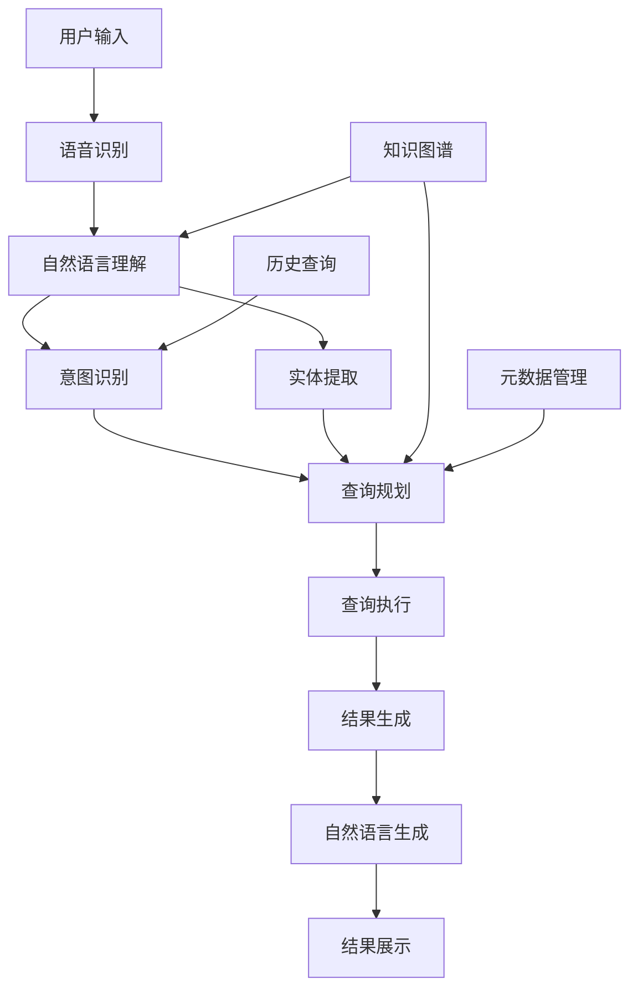

在企业级统一度量平台的发展过程中，降低数据使用门槛一直是重要的目标。传统的数据分析需要用户具备一定的技术背景，能够编写SQL查询或使用复杂的可视化工具。然而，随着人工智能技术的快速发展，自然语言查询（Natural Language Query, NLQ）和语音交互技术为普通用户提供了更加直观、便捷的数据访问方式。本节将深入探讨如何设计和实现自然语言查询与语音交互功能，让数据分析变得更加普及化和人性化。

## 自然语言查询的核心价值

### 1.1 降低技术门槛

自然语言查询技术使得非技术用户也能轻松进行数据分析：

```yaml
降低技术门槛的价值:
  易用性提升:
    - 无需学习SQL或查询语法
    - 支持日常语言表达查询意图
    - 提供智能提示和纠错功能
  普及化应用:
    - 让业务人员也能进行数据分析
    - 减少对数据分析师的依赖
    - 提高数据驱动决策的效率
  交互体验:
    - 提供更自然的查询方式
    - 支持迭代式查询优化
    - 实现智能问答交互
```

### 1.2 提升分析效率

通过自然语言交互，用户可以更快速地获取所需信息：

```yaml
提升分析效率:
  快速查询:
    - 直接用语言描述查询需求
    - 无需构建复杂的查询条件
    - 支持模糊查询和近似匹配
  智能推荐:
    - 基于历史查询推荐相关问题
    - 提供查询结果的深度分析
    - 自动生成可视化图表
  上下文理解:
    - 理解查询的上下文关系
    - 支持多轮对话式交互
    - 记录用户偏好和习惯
```

## 自然语言查询技术架构

### 2.1 整体架构设计

自然语言查询系统需要整合多种AI技术，形成完整的处理链路：



### 2.2 核心组件实现

#### 2.2.1 自然语言理解（NLU）

```python
class NaturalLanguageUnderstanding:
    def __init__(self, model_path, knowledge_base):
        self.nlp_model = self.load_model(model_path)
        self.knowledge_base = knowledge_base
        self.intent_classifier = IntentClassifier()
        self.entity_extractor = EntityExtractor()
        self.query_parser = QueryParser()
    
    def understand_query(self, user_input):
        """
        理解用户自然语言查询
        """
        # 文本预处理
        processed_text = self.preprocess_text(user_input)
        
        # 意图识别
        intent = self.intent_classifier.classify(processed_text)
        
        # 实体提取
        entities = self.entity_extractor.extract(processed_text)
        
        # 查询解析
        parsed_query = self.query_parser.parse(processed_text, intent, entities)
        
        # 上下文理解
        context = self.understand_context(parsed_query)
        
        return {
            'original_input': user_input,
            'processed_text': processed_text,
            'intent': intent,
            'entities': entities,
            'parsed_query': parsed_query,
            'context': context
        }
    
    def preprocess_text(self, text):
        """
        文本预处理
        """
        # 转换为小写
        text = text.lower()
        
        # 移除特殊字符
        text = re.sub(r'[^\w\s]', '', text)
        
        # 标准化同义词
        text = self.standardize_synonyms(text)
        
        # 纠正拼写错误
        text = self.correct_spelling(text)
        
        return text
    
    def standardize_synonyms(self, text):
        """
        标准化同义词
        """
        synonyms = {
            'revenue': ['收入', '营收', '销售额'],
            'user': ['用户', '客户', '消费者'],
            'product': ['产品', '商品', '货品'],
            'region': ['地区', '区域', '地域'],
            'time': ['时间', '日期', '时期']
        }
        
        for standard_term, variations in synonyms.items():
            for variation in variations:
                text = text.replace(variation, standard_term)
        
        return text
    
    def correct_spelling(self, text):
        """
        纠正拼写错误
        """
        # 使用拼写检查库进行纠错
        # 这里简化处理，实际实现会更复杂
        return text
    
    def understand_context(self, parsed_query):
        """
        理解查询上下文
        """
        context = {}
        
        # 从知识库获取相关上下文
        if parsed_query.get('entities'):
            for entity in parsed_query['entities']:
                related_info = self.knowledge_base.get_related_info(entity)
                context.update(related_info)
        
        return context
```

#### 2.2.2 查询规划与执行

```java
@Service
public class QueryPlanner {
    
    @Autowired
    private MetadataService metadataService;
    
    @Autowired
    private QueryExecutor queryExecutor;
    
    @Autowired
    private KnowledgeGraphService knowledgeGraphService;
    
    /**
     * 规划自然语言查询
     */
    public PlannedQuery planQuery(NLUResult nluResult) {
        PlannedQuery plannedQuery = new PlannedQuery();
        
        // 获取意图信息
        String intent = nluResult.getIntent();
        
        // 获取实体信息
        List<Entity> entities = nluResult.getEntities();
        
        // 获取上下文信息
        Map<String, Object> context = nluResult.getContext();
        
        // 根据意图确定查询类型
        QueryType queryType = determineQueryType(intent);
        plannedQuery.setQueryType(queryType);
        
        // 构建查询条件
        QueryConditions conditions = buildQueryConditions(entities, context);
        plannedQuery.setConditions(conditions);
        
        // 确定查询维度和指标
        QuerySchema schema = determineQuerySchema(intent, entities);
        plannedQuery.setSchema(schema);
        
        // 优化查询计划
        optimizeQueryPlan(plannedQuery);
        
        return plannedQuery;
    }
    
    private QueryType determineQueryType(String intent) {
        switch (intent) {
            case "trend_analysis":
                return QueryType.TREND;
            case "comparison_analysis":
                return QueryType.COMPARISON;
            case "ranking_analysis":
                return QueryType.RANKING;
            case "distribution_analysis":
                return QueryType.DISTRIBUTION;
            default:
                return QueryType.SUMMARY;
        }
    }
    
    private QueryConditions buildQueryConditions(List<Entity> entities, Map<String, Object> context) {
        QueryConditions conditions = new QueryConditions();
        
        // 处理时间实体
        Entity timeEntity = entities.stream()
            .filter(e -> "time".equals(e.getType()))
            .findFirst()
            .orElse(null);
        
        if (timeEntity != null) {
            TimeRange timeRange = parseTimeEntity(timeEntity);
            conditions.setTimeRange(timeRange);
        }
        
        // 处理维度实体
        List<Entity> dimensionEntities = entities.stream()
            .filter(e -> "dimension".equals(e.getType()))
            .collect(Collectors.toList());
        
        for (Entity entity : dimensionEntities) {
            DimensionFilter filter = parseDimensionEntity(entity);
            conditions.addDimensionFilter(filter);
        }
        
        // 应用上下文过滤
        applyContextFilters(conditions, context);
        
        return conditions;
    }
    
    private TimeRange parseTimeEntity(Entity timeEntity) {
        String value = timeEntity.getValue();
        
        // 解析相对时间
        if (value.contains("最近") || value.contains("last")) {
            return parseRelativeTime(value);
        }
        
        // 解析绝对时间
        if (value.contains("到") || value.contains("to")) {
            return parseAbsoluteTimeRange(value);
        }
        
        // 解析单个时间点
        return parseSingleTime(value);
    }
    
    /**
     * 执行查询计划
     */
    public QueryResult executeQuery(PlannedQuery plannedQuery) {
        // 转换为SQL查询
        String sqlQuery = translateToSQL(plannedQuery);
        
        // 执行查询
        List<Map<String, Object>> rawData = queryExecutor.execute(sqlQuery);
        
        // 后处理结果
        QueryResult result = postProcessResult(rawData, plannedQuery);
        
        return result;
    }
    
    private String translateToSQL(PlannedQuery plannedQuery) {
        StringBuilder sql = new StringBuilder();
        sql.append("SELECT ");
        
        // 添加选择字段
        QuerySchema schema = plannedQuery.getSchema();
        sql.append(String.join(", ", schema.getMetrics()));
        
        // 添加维度字段
        if (!schema.getDimensions().isEmpty()) {
            sql.append(", ").append(String.join(", ", schema.getDimensions()));
        }
        
        sql.append(" FROM ").append(schema.getDataSource());
        
        // 添加过滤条件
        QueryConditions conditions = plannedQuery.getConditions();
        List<String> whereClauses = new ArrayList<>();
        
        // 时间过滤
        if (conditions.getTimeRange() != null) {
            whereClauses.add(buildTimeFilter(conditions.getTimeRange()));
        }
        
        // 维度过滤
        for (DimensionFilter filter : conditions.getDimensionFilters()) {
            whereClauses.add(buildDimensionFilter(filter));
        }
        
        if (!whereClauses.isEmpty()) {
            sql.append(" WHERE ").append(String.join(" AND ", whereClauses));
        }
        
        // 添加分组
        if (!schema.getDimensions().isEmpty()) {
            sql.append(" GROUP BY ").append(String.join(", ", schema.getDimensions()));
        }
        
        // 添加排序
        if (plannedQuery.getQueryType() == QueryType.RANKING) {
            sql.append(" ORDER BY ").append(schema.getMetrics().get(0)).append(" DESC");
        }
        
        return sql.toString();
    }
}
```

## 语音交互技术实现

### 3.1 语音识别集成

#### 3.1.1 语音识别服务

```javascript
class VoiceRecognitionService {
    constructor() {
        this.recognition = null;
        this.isListening = false;
        this.supported = this.checkSupport();
    }
    
    checkSupport() {
        return 'webkitSpeechRecognition' in window || 'SpeechRecognition' in window;
    }
    
    initialize() {
        if (!this.supported) {
            throw new Error('浏览器不支持语音识别');
        }
        
        const SpeechRecognition = window.SpeechRecognition || window.webkitSpeechRecognition;
        this.recognition = new SpeechRecognition();
        
        // 配置语音识别
        this.recognition.continuous = false;  // 单次识别
        this.recognition.interimResults = true;  // 获取中间结果
        this.recognition.lang = 'zh-CN';  // 设置语言
        this.recognition.maxAlternatives = 1;  // 返回一个最佳结果
        
        // 绑定事件处理器
        this.bindEventHandlers();
    }
    
    bindEventHandlers() {
        this.recognition.onstart = () => {
            this.isListening = true;
            this.onListeningStart();
        };
        
        this.recognition.onresult = (event) => {
            const result = event.results[0];
            const transcript = result[0].transcript;
            const confidence = result[0].confidence;
            
            this.onSpeechResult(transcript, confidence, result.isFinal);
        };
        
        this.recognition.onerror = (event) => {
            this.isListening = false;
            this.onSpeechError(event.error);
        };
        
        this.recognition.onend = () => {
            this.isListening = false;
            this.onListeningEnd();
        };
    }
    
    startListening() {
        if (!this.recognition) {
            this.initialize();
        }
        
        if (!this.isListening) {
            this.recognition.start();
        }
    }
    
    stopListening() {
        if (this.isListening) {
            this.recognition.stop();
        }
    }
    
    // 事件回调方法（需要被子类重写）
    onListeningStart() {
        console.log('开始语音识别');
    }
    
    onSpeechResult(transcript, confidence, isFinal) {
        console.log('识别结果:', transcript, '置信度:', confidence, '是否最终结果:', isFinal);
    }
    
    onSpeechError(error) {
        console.error('语音识别错误:', error);
    }
    
    onListeningEnd() {
        console.log('语音识别结束');
    }
}
```

#### 3.1.2 语音交互界面

```html
<!-- 语音交互界面 -->
<div class="voice-interaction-panel">
    <div class="voice-header">
        <h3>语音查询</h3>
        <div class="voice-status" id="voiceStatus">
            <span class="status-indicator"></span>
            <span class="status-text">准备就绪</span>
        </div>
    </div>
    
    <div class="voice-content">
        <div class="voice-visualization">
            <canvas id="voiceVisualization" width="300" height="100"></canvas>
        </div>
        
        <div class="voice-input-area">
            <div class="transcript-display" id="transcriptDisplay">
                <div class="placeholder">点击麦克风开始说话...</div>
                <div class="transcript-text"></div>
            </div>
            
            <div class="voice-controls">
                <button class="voice-btn" id="startVoiceBtn">
                    <span class="mic-icon">🎤</span>
                    <span class="btn-text">开始说话</span>
                </button>
                
                <button class="voice-btn stop-btn" id="stopVoiceBtn" style="display: none;">
                    <span class="stop-icon">⏹️</span>
                    <span class="btn-text">停止</span>
                </button>
            </div>
        </div>
    </div>
    
    <div class="voice-results" id="voiceResults" style="display: none;">
        <div class="result-header">
            <h4>查询结果</h4>
            <button class="close-btn" id="closeResultsBtn">×</button>
        </div>
        <div class="result-content"></div>
    </div>
</div>

<script>
class VoiceQueryInterface extends VoiceRecognitionService {
    constructor() {
        super();
        this.initializeUI();
        this.audioContext = null;
        this.analyzer = null;
    }
    
    initializeUI() {
        this.voiceStatus = document.getElementById('voiceStatus');
        this.transcriptDisplay = document.getElementById('transcriptDisplay');
        this.startVoiceBtn = document.getElementById('startVoiceBtn');
        this.stopVoiceBtn = document.getElementById('stopVoiceBtn');
        this.voiceResults = document.getElementById('voiceResults');
        this.resultContent = document.querySelector('.result-content');
        
        // 绑定UI事件
        this.startVoiceBtn.addEventListener('click', () => this.startVoiceQuery());
        this.stopVoiceBtn.addEventListener('click', () => this.stopVoiceQuery());
        document.getElementById('closeResultsBtn').addEventListener('click', () => {
            this.voiceResults.style.display = 'none';
        });
        
        // 初始化可视化画布
        this.initVisualization();
    }
    
    initVisualization() {
        this.canvas = document.getElementById('voiceVisualization');
        this.ctx = this.canvas.getContext('2d');
        
        // 创建音频上下文用于可视化
        try {
            this.audioContext = new (window.AudioContext || window.webkitAudioContext)();
            this.analyzer = this.audioContext.createAnalyser();
            this.analyzer.fftSize = 256;
        } catch (e) {
            console.warn('无法初始化音频可视化:', e);
        }
    }
    
    startVoiceQuery() {
        try {
            this.startListening();
            this.updateStatus('listening', '正在聆听...');
            this.startVoiceBtn.style.display = 'none';
            this.stopVoiceBtn.style.display = 'inline-flex';
            this.clearTranscript();
        } catch (error) {
            this.updateStatus('error', '语音识别初始化失败');
            console.error('语音查询启动失败:', error);
        }
    }
    
    stopVoiceQuery() {
        this.stopListening();
        this.updateStatus('ready', '准备就绪');
        this.startVoiceBtn.style.display = 'inline-flex';
        this.stopVoiceBtn.style.display = 'none';
    }
    
    onListeningStart() {
        this.updateStatus('listening', '正在聆听...');
        this.startVisualization();
    }
    
    onSpeechResult(transcript, confidence, isFinal) {
        this.updateTranscript(transcript, confidence);
        
        if (isFinal) {
            this.processVoiceQuery(transcript);
        }
    }
    
    onSpeechError(error) {
        this.updateStatus('error', `识别错误: ${error}`);
        this.stopVoiceQuery();
    }
    
    onListeningEnd() {
        this.updateStatus('ready', '准备就绪');
        this.stopVoiceQuery();
        this.stopVisualization();
    }
    
    updateStatus(status, text) {
        const statusIndicator = this.voiceStatus.querySelector('.status-indicator');
        const statusText = this.voiceStatus.querySelector('.status-text');
        
        statusIndicator.className = 'status-indicator ' + status;
        statusText.textContent = text;
    }
    
    updateTranscript(transcript, confidence) {
        const transcriptText = this.transcriptDisplay.querySelector('.transcript-text');
        const placeholder = this.transcriptDisplay.querySelector('.placeholder');
        
        if (transcript) {
            placeholder.style.display = 'none';
            transcriptText.textContent = transcript;
            transcriptText.style.opacity = confidence;
        } else {
            placeholder.style.display = 'block';
            transcriptText.textContent = '';
        }
    }
    
    clearTranscript() {
        const transcriptText = this.transcriptDisplay.querySelector('.transcript-text');
        const placeholder = this.transcriptDisplay.querySelector('.placeholder');
        
        placeholder.style.display = 'block';
        transcriptText.textContent = '';
    }
    
    async processVoiceQuery(queryText) {
        try {
            this.updateStatus('processing', '正在处理查询...');
            
            // 发送到后端处理
            const response = await fetch('/api/v1/nlq/query', {
                method: 'POST',
                headers: {
                    'Content-Type': 'application/json',
                },
                body: JSON.stringify({
                    query: queryText,
                    type: 'voice'
                })
            });
            
            const result = await response.json();
            
            if (result.success) {
                this.displayResults(result.data);
                this.speakResults(result.data);
            } else {
                throw new Error(result.message);
            }
            
        } catch (error) {
            this.updateStatus('error', `查询失败: ${error.message}`);
            console.error('语音查询处理失败:', error);
        }
    }
    
    displayResults(data) {
        this.voiceResults.style.display = 'block';
        
        let html = '<div class="result-summary">';
        
        if (data.type === 'metric') {
            html += `
                <div class="metric-result">
                    <div class="metric-value">${data.value}</div>
                    <div class="metric-label">${data.label}</div>
                    <div class="metric-context">${data.context || ''}</div>
                </div>
            `;
        } else if (data.type === 'list') {
            html += '<ul class="result-list">';
            data.items.forEach(item => {
                html += `<li>${item.label}: ${item.value}</li>`;
            });
            html += '</ul>';
        } else if (data.type === 'table') {
            html += '<table class="result-table">';
            html += '<thead><tr>';
            data.columns.forEach(col => {
                html += `<th>${col}</th>`;
            });
            html += '</tr></thead>';
            html += '<tbody>';
            data.rows.forEach(row => {
                html += '<tr>';
                row.forEach(cell => {
                    html += `<td>${cell}</td>`;
                });
                html += '</tr>';
            });
            html += '</tbody></table>';
        }
        
        html += '</div>';
        
        this.resultContent.innerHTML = html;
    }
    
    speakResults(data) {
        // 使用语音合成朗读结果
        if ('speechSynthesis' in window) {
            let textToSpeak = '';
            
            if (data.type === 'metric') {
                textToSpeak = `查询结果：${data.label}为${data.value}`;
            } else if (data.type === 'list') {
                textToSpeak = '查询结果：';
                data.items.forEach((item, index) => {
                    textToSpeak += `${item.label}为${item.value}，`;
                });
            }
            
            if (textToSpeak) {
                const utterance = new SpeechSynthesisUtterance(textToSpeak);
                utterance.lang = 'zh-CN';
                utterance.rate = 1.0;
                utterance.pitch = 1.0;
                speechSynthesis.speak(utterance);
            }
        }
    }
    
    startVisualization() {
        if (!this.analyzer) return;
        
        // 这里简化处理，实际实现需要连接麦克风输入
        this.visualizationInterval = setInterval(() => {
            this.drawVisualization();
        }, 100);
    }
    
    stopVisualization() {
        if (this.visualizationInterval) {
            clearInterval(this.visualizationInterval);
            this.visualizationInterval = null;
        }
        
        // 清空画布
        this.ctx.clearRect(0, 0, this.canvas.width, this.canvas.height);
    }
    
    drawVisualization() {
        const width = this.canvas.width;
        const height = this.canvas.height;
        
        // 清空画布
        this.ctx.clearRect(0, 0, width, height);
        
        // 绘制音频可视化效果
        this.ctx.fillStyle = '#4CAF50';
        
        // 模拟音频数据（实际应该从音频分析器获取）
        const barCount = 32;
        const barWidth = width / barCount;
        
        for (let i = 0; i < barCount; i++) {
            const barHeight = Math.random() * height;
            this.ctx.fillRect(i * barWidth, height - barHeight, barWidth - 2, barHeight);
        }
    }
}

// 初始化语音查询界面
document.addEventListener('DOMContentLoaded', () => {
    const voiceInterface = new VoiceQueryInterface();
    
    // 检查浏览器支持
    if (!voiceInterface.supported) {
        document.getElementById('voiceStatus').innerHTML = 
            '<span class="status-indicator error"></span><span class="status-text">浏览器不支持语音识别</span>';
        document.getElementById('startVoiceBtn').disabled = true;
    }
});
</script>
```

### 3.2 语音合成服务

```go
package voice

import (
    "context"
    "fmt"
    "strings"
    "time"
    
    "cloud.google.com/go/texttospeech/apiv1"
    texttospeechpb "google.golang.org/genproto/googleapis/cloud/texttospeech/v1"
)

type VoiceSynthesisService struct {
    client *texttospeech.Client
    config *SynthesisConfig
}

type SynthesisConfig struct {
    LanguageCode string
    VoiceName    string
    AudioConfig  *texttospeechpb.AudioConfig
}

type SynthesisResult struct {
    AudioContent []byte
    AudioFormat  string
    Duration     time.Duration
}

func NewVoiceSynthesisService(ctx context.Context, config *SynthesisConfig) (*VoiceSynthesisService, error) {
    client, err := texttospeech.NewClient(ctx)
    if err != nil {
        return nil, fmt.Errorf("创建语音合成客户端失败: %v", err)
    }
    
    return &VoiceSynthesisService{
        client: client,
        config: config,
    }, nil
}

func (v *VoiceSynthesisService) SynthesizeText(ctx context.Context, text string) (*SynthesisResult, error) {
    // 构建合成请求
    req := &texttospeechpb.SynthesizeSpeechRequest{
        Input: &texttospeechpb.SynthesisInput{
            InputSource: &texttospeechpb.SynthesisInput_Text{
                Text: text,
            },
        },
        Voice: &texttospeechpb.VoiceSelectionParams{
            LanguageCode: v.config.LanguageCode,
            Name:         v.config.VoiceName,
        },
        AudioConfig: v.config.AudioConfig,
    }
    
    // 执行合成
    resp, err := v.client.SynthesizeSpeech(ctx, req)
    if err != nil {
        return nil, fmt.Errorf("语音合成失败: %v", err)
    }
    
    // 计算音频时长（简化估算）
    duration := time.Duration(len(text)) * time.Millisecond * 100
    
    return &SynthesisResult{
        AudioContent: resp.AudioContent,
        AudioFormat:  "mp3", // 假设使用MP3格式
        Duration:     duration,
    }, nil
}

func (v *VoiceSynthesisService) SynthesizeQueryResult(ctx context.Context, result interface{}) (*SynthesisResult, error) {
    // 将查询结果转换为自然语言
    text, err := v.formatResultAsText(result)
    if err != nil {
        return nil, fmt.Errorf("格式化结果失败: %v", err)
    }
    
    // 执行语音合成
    return v.SynthesizeText(ctx, text)
}

func (v *VoiceSynthesisService) formatResultAsText(result interface{}) (string, error) {
    // 根据结果类型格式化为自然语言
    switch res := result.(type) {
    case map[string]interface{}:
        return v.formatMapResult(res)
    case []interface{}:
        return v.formatListResult(res)
    default:
        return fmt.Sprintf("查询结果: %v", result), nil
    }
}

func (v *VoiceSynthesisService) formatMapResult(result map[string]interface{}) (string, error) {
    if metric, ok := result["metric"]; ok {
        value := result["value"]
        label := result["label"]
        return fmt.Sprintf("查询结果：%s为%s", label, value), nil
    }
    
    // 通用格式化
    var parts []string
    for key, value := range result {
        parts = append(parts, fmt.Sprintf("%s为%v", key, value))
    }
    
    return "查询结果：" + strings.Join(parts, "，"), nil
}

func (v *VoiceSynthesisService) formatListResult(result []interface{}) (string, error) {
    if len(result) == 0 {
        return "没有查询到相关结果", nil
    }
    
    var parts []string
    for i, item := range result {
        if i >= 5 { // 限制朗读数量
            parts = append(parts, "等")
            break
        }
        
        switch item := item.(type) {
        case map[string]interface{}:
            if label, ok := item["label"]; ok {
                if value, ok := item["value"]; ok {
                    parts = append(parts, fmt.Sprintf("%s为%v", label, value))
                }
            }
        default:
            parts = append(parts, fmt.Sprintf("第%d项为%v", i+1, item))
        }
    }
    
    return "查询结果：" + strings.Join(parts, "，"), nil
}
```

## 智能问答系统

### 4.1 问答引擎设计

#### 4.1.1 对话管理

```rust
use serde::{Deserialize, Serialize};
use std::collections::HashMap;
use tokio::sync::RwLock;

#[derive(Serialize, Deserialize, Debug, Clone)]
pub struct ConversationContext {
    pub session_id: String,
    pub user_id: String,
    pub history: Vec<DialogTurn>,
    pub current_state: DialogState,
    pub entities: HashMap<String, String>,
    pub preferences: UserPreferences,
    pub created_at: chrono::DateTime<chrono::Utc>,
    pub updated_at: chrono::DateTime<chrono::Utc>,
}

#[derive(Serialize, Deserialize, Debug, Clone)]
pub struct DialogTurn {
    pub turn_id: String,
    pub user_input: String,
    pub system_response: String,
    pub intent: String,
    pub entities: HashMap<String, String>,
    pub timestamp: chrono::DateTime<chrono::Utc>,
}

#[derive(Serialize, Deserialize, Debug, Clone)]
pub enum DialogState {
    Initial,
    Clarifying,
    Executing,
    FollowUp,
    Completed,
}

#[derive(Serialize, Deserialize, Debug, Clone)]
pub struct UserPreferences {
    pub language: String,
    pub voice_enabled: bool,
    pub detail_level: DetailLevel,
    pub favorite_metrics: Vec<String>,
}

#[derive(Serialize, Deserialize, Debug, Clone)]
pub enum DetailLevel {
    Summary,
    Detailed,
    Comprehensive,
}

pub struct DialogManager {
    contexts: RwLock<HashMap<String, ConversationContext>>,
    nlu_engine: NluEngine,
    query_executor: QueryExecutor,
    response_generator: ResponseGenerator,
}

impl DialogManager {
    pub fn new(
        nlu_engine: NluEngine,
        query_executor: QueryExecutor,
        response_generator: ResponseGenerator,
    ) -> Self {
        Self {
            contexts: RwLock::new(HashMap::new()),
            nlu_engine,
            query_executor,
            response_generator,
        }
    }
    
    pub async fn process_user_input(
        &self,
        session_id: &str,
        user_id: &str,
        user_input: &str,
    ) -> Result<String, Box<dyn std::error::Error>> {
        // 获取或创建对话上下文
        let mut context = self.get_or_create_context(session_id, user_id).await?;
        
        // 理解用户输入
        let nlu_result = self.nlu_engine.understand(user_input, &context).await?;
        
        // 根据对话状态处理
        let response = match context.current_state {
            DialogState::Initial => {
                self.handle_initial_state(&mut context, &nlu_result).await?
            }
            DialogState::Clarifying => {
                self.handle_clarifying_state(&mut context, &nlu_result).await?
            }
            DialogState::Executing => {
                self.handle_executing_state(&mut context, &nlu_result).await?
            }
            DialogState::FollowUp => {
                self.handle_follow_up_state(&mut context, &nlu_result).await?
            }
            DialogState::Completed => {
                self.handle_completed_state(&mut context, &nlu_result).await?
            }
        };
        
        // 更新对话历史
        self.update_conversation_history(&mut context, user_input, &response, &nlu_result).await?;
        
        // 保存上下文
        self.save_context(session_id, context).await?;
        
        Ok(response)
    }
    
    async fn handle_initial_state(
        &self,
        context: &mut ConversationContext,
        nlu_result: &NluResult,
    ) -> Result<String, Box<dyn std::error::Error>> {
        match &nlu_result.intent[..] {
            "query_metric" => {
                // 直接执行查询
                context.current_state = DialogState::Executing;
                self.execute_query(context, nlu_result).await
            }
            "exploratory_question" => {
                // 需要澄清的探索性问题
                context.current_state = DialogState::Clarifying;
                self.ask_clarifying_questions(context, nlu_result).await
            }
            "greeting" => {
                self.response_generator.generate_greeting_response(context).await
            }
            _ => {
                self.response_generator.generate_help_response(context).await
            }
        }
    }
    
    async fn handle_clarifying_state(
        &self,
        context: &mut ConversationContext,
        nlu_result: &NluResult,
    ) -> Result<String, Box<dyn std::error::Error>> {
        // 收集澄清信息
        self.collect_clarification_info(context, nlu_result).await?;
        
        // 检查是否收集了足够信息
        if self.has_sufficient_info(context) {
            context.current_state = DialogState::Executing;
            self.execute_query(context, nlu_result).await
        } else {
            // 继续询问
            self.ask_clarifying_questions(context, nlu_result).await
        }
    }
    
    async fn execute_query(
        &self,
        context: &mut ConversationContext,
        nlu_result: &NluResult,
    ) -> Result<String, Box<dyn std::error::Error>> {
        // 执行查询
        let query_result = self.query_executor.execute(nlu_result).await?;
        
        // 生成响应
        let response = self.response_generator.generate_query_response(
            &query_result,
            &context.preferences,
        ).await?;
        
        // 设置后续状态
        context.current_state = DialogState::FollowUp;
        
        Ok(response)
    }
    
    async fn ask_clarifying_questions(
        &self,
        context: &ConversationContext,
        nlu_result: &NluResult,
    ) -> Result<String, Box<dyn std::error::Error>> {
        // 基于当前收集的信息生成澄清问题
        let missing_info = self.identify_missing_info(context, nlu_result);
        let questions = self.generate_clarification_questions(&missing_info);
        
        Ok(questions.join("\n"))
    }
}
```

#### 4.1.2 响应生成

```python
class ResponseGenerator:
    def __init__(self, template_manager, voice_service=None):
        self.template_manager = template_manager
        self.voice_service = voice_service
        self.response_cache = {}
    
    async def generate_query_response(self, query_result, user_preferences):
        """
        生成查询结果响应
        """
        # 生成文本响应
        text_response = self.generate_text_response(query_result, user_preferences)
        
        # 如果启用语音，生成语音响应
        voice_response = None
        if user_preferences.get('voice_enabled', False) and self.voice_service:
            voice_response = await self.voice_service.synthesize(text_response)
        
        return {
            'text': text_response,
            'voice': voice_response,
            'type': 'query_result',
            'data': query_result
        }
    
    def generate_text_response(self, query_result, user_preferences):
        """
        生成文本响应
        """
        detail_level = user_preferences.get('detail_level', 'summary')
        
        if query_result['type'] == 'metric':
            return self.generate_metric_response(query_result, detail_level)
        elif query_result['type'] == 'trend':
            return self.generate_trend_response(query_result, detail_level)
        elif query_result['type'] == 'comparison':
            return self.generate_comparison_response(query_result, detail_level)
        elif query_result['type'] == 'ranking':
            return self.generate_ranking_response(query_result, detail_level)
        else:
            return self.generate_generic_response(query_result, detail_level)
    
    def generate_metric_response(self, result, detail_level):
        """
        生成指标查询响应
        """
        metric_name = result.get('metric_name', '未知指标')
        value = result.get('value', '无数据')
        unit = result.get('unit', '')
        context = result.get('context', '')
        
        if detail_level == 'summary':
            return f"查询结果：{metric_name}{context}为{value}{unit}"
        elif detail_level == 'detailed':
            trend = result.get('trend', '')
            comparison = result.get('comparison', '')
            
            response = f"查询结果：{metric_name}{context}为{value}{unit}"
            if trend:
                response += f"，{trend}"
            if comparison:
                response += f"，{comparison}"
            
            return response
        else:  # comprehensive
            response = f"详细查询结果：\n"
            response += f"指标名称：{metric_name}\n"
            response += f"当前值：{value}{unit}\n"
            response += f"时间范围：{result.get('time_range', '最近')}\n"
            
            if 'trend' in result:
                response += f"趋势分析：{result['trend']}\n"
            if 'comparison' in result:
                response += f"对比分析：{result['comparison']}\n"
            if 'insights' in result:
                response += f"洞察建议：{result['insights']}\n"
            
            return response
    
    def generate_trend_response(self, result, detail_level):
        """
        生成趋势查询响应
        """
        metric_name = result.get('metric_name', '未知指标')
        
        if detail_level == 'summary':
            return f"{metric_name}的整体趋势是{result.get('overall_trend', '稳定')}"
        elif detail_level == 'detailed':
            periods = result.get('periods', [])
            if periods:
                latest_period = periods[-1]
                return f"{metric_name}在{latest_period.get('period', '近期')}的趋势是{latest_period.get('trend', '稳定')}"
            else:
                return f"{metric_name}的趋势分析完成"
        else:  # comprehensive
            response = f"{metric_name}的详细趋势分析：\n"
            for period in result.get('periods', []):
                response += f"- {period.get('period', '')}: {period.get('value', '')} ({period.get('trend', '')})\n"
            return response
    
    async def generate_follow_up_response(self, original_query, user_input):
        """
        生成后续问题响应
        """
        # 分析用户后续问题的意图
        intent = self.analyze_follow_up_intent(user_input)
        
        if intent == 'clarification':
            return "请提供更多详细信息，比如具体的时间范围或维度"
        elif intent == 'related_query':
            # 生成相关查询
            related_result = await self.execute_related_query(original_query, user_input)
            return self.generate_text_response(related_result, {'detail_level': 'detailed'})
        elif intent == 'visualization_request':
            return "正在为您生成可视化图表，请稍候..."
        else:
            return "我理解您的问题，正在处理中..."
    
    def analyze_follow_up_intent(self, user_input):
        """
        分析后续问题意图
        """
        user_input = user_input.lower()
        
        if any(word in user_input for word in ['详细', '具体', '更多']):
            return 'clarification'
        elif any(word in user_input for word in ['图表', '图', '可视化']):
            return 'visualization_request'
        elif any(word in user_input for word in ['比较', '对比', '变化']):
            return 'related_query'
        else:
            return 'general'
```

## 性能优化与用户体验

### 5.1 响应速度优化

#### 5.1.1 缓存策略

```sql
-- 自然语言查询缓存表
CREATE TABLE nlq_cache (
    id BIGSERIAL PRIMARY KEY,
    query_text TEXT NOT NULL,
    query_hash VARCHAR(64) NOT NULL UNIQUE,
    parsed_result JSONB,
    execution_plan JSONB,
    result_data JSONB,
    hit_count INTEGER DEFAULT 0,
    last_accessed TIMESTAMP DEFAULT CURRENT_TIMESTAMP,
    created_at TIMESTAMP DEFAULT CURRENT_TIMESTAMP,
    expires_at TIMESTAMP
);

-- 查询缓存索引
CREATE INDEX idx_nlq_cache_hash ON nlq_cache (query_hash);
CREATE INDEX idx_nlq_cache_accessed ON nlq_cache (last_accessed);
CREATE INDEX idx_nlq_cache_expires ON nlq_cache (expires_at);

-- 热点查询统计
CREATE TABLE nlq_hot_queries (
    query_pattern TEXT PRIMARY KEY,
    frequency INTEGER DEFAULT 1,
    last_seen TIMESTAMP DEFAULT CURRENT_TIMESTAMP,
    average_response_time DECIMAL(8,3),
    success_rate DECIMAL(5,4)
);
```

#### 5.1.2 预处理优化

```java
@Component
public class NLQPreprocessor {
    
    @Autowired
    private RedisTemplate<String, Object> redisTemplate;
    
    @Autowired
    private HotQueryService hotQueryService;
    
    private final Map<String, PreprocessedQuery> localCache = new ConcurrentHashMap<>();
    private final int LOCAL_CACHE_SIZE = 1000;
    
    /**
     * 预处理自然语言查询
     */
    public PreprocessedQuery preprocessQuery(String queryText) {
        // 生成查询哈希
        String queryHash = generateQueryHash(queryText);
        
        // 1. 检查本地缓存
        PreprocessedQuery cached = localCache.get(queryHash);
        if (cached != null && !isExpired(cached)) {
            return cached;
        }
        
        // 2. 检查Redis缓存
        cached = (PreprocessedQuery) redisTemplate.opsForValue().get("nlq:preprocessed:" + queryHash);
        if (cached != null && !isExpired(cached)) {
            // 回填本地缓存
            addToLocalCache(queryHash, cached);
            return cached;
        }
        
        // 3. 执行预处理
        PreprocessedQuery preprocessed = doPreprocess(queryText);
        
        // 4. 缓存结果
        cachePreprocessedQuery(queryHash, preprocessed);
        
        return preprocessed;
    }
    
    private PreprocessedQuery doPreprocess(String queryText) {
        PreprocessedQuery result = new PreprocessedQuery();
        result.setOriginalText(queryText);
        result.setProcessedText(preprocessText(queryText));
        result.setTokens(tokenizeText(result.getProcessedText()));
        result.setNormalizedText(normalizeText(result.getTokens()));
        result.setEntities(extractEntities(result.getNormalizedText()));
        result.setIntent(classifyIntent(result.getNormalizedText(), result.getEntities()));
        result.setTimestamp(System.currentTimeMillis());
        result.setExpiresAt(System.currentTimeMillis() + 3600000); // 1小时过期
        
        return result;
    }
    
    private String preprocessText(String text) {
        // 文本清理和标准化
        text = text.trim().toLowerCase();
        text = text.replaceAll("[^\\w\\s\\u4e00-\\u9fff]", " "); // 保留中英文和数字
        text = text.replaceAll("\\s+", " "); // 合并多个空格
        
        return text;
    }
    
    private List<String> tokenizeText(String text) {
        // 分词处理（简化实现）
        return Arrays.asList(text.split("\\s+"));
    }
    
    private String normalizeText(List<String> tokens) {
        // 同义词标准化
        List<String> normalized = new ArrayList<>();
        for (String token : tokens) {
            normalized.add(normalizeToken(token));
        }
        return String.join(" ", normalized);
    }
    
    private String normalizeToken(String token) {
        // 同义词映射
        Map<String, String> synonyms = Map.of(
            "收入", "revenue",
            "用户", "user",
            "产品", "product",
            "最近", "last",
            "这个月", "this month"
        );
        
        return synonyms.getOrDefault(token, token);
    }
    
    private void cachePreprocessedQuery(String queryHash, PreprocessedQuery preprocessed) {
        // 缓存到Redis
        redisTemplate.opsForValue().set(
            "nlq:preprocessed:" + queryHash, 
            preprocessed, 
            Duration.ofHours(1)
        );
        
        // 缓存到本地
        addToLocalCache(queryHash, preprocessed);
        
        // 更新热点查询统计
        hotQueryService.updateQueryStats(preprocessed.getNormalizedText());
    }
    
    private void addToLocalCache(String key, PreprocessedQuery value) {
        if (localCache.size() >= LOCAL_CACHE_SIZE) {
            // 移除最旧的缓存项
            Iterator<Map.Entry<String, PreprocessedQuery>> iterator = localCache.entrySet().iterator();
            if (iterator.hasNext()) {
                iterator.next();
                iterator.remove();
            }
        }
        localCache.put(key, value);
    }
}
```

### 5.2 用户体验优化

#### 5.2.1 智能提示系统

```typescript
class IntelligentSuggestionService {
    private queryHistory: QueryHistory[];
    private commonPatterns: QueryPattern[];
    private userPreferences: UserPreferences;
    
    constructor() {
        this.queryHistory = [];
        this.commonPatterns = [];
        this.userPreferences = this.loadUserPreferences();
        this.initializeCommonPatterns();
    }
    
    getSuggestions(input: string, context?: QueryContext): Suggestion[] {
        const suggestions: Suggestion[] = [];
        
        // 1. 基于输入的实时建议
        suggestions.push(...this.getRealTimeSuggestions(input));
        
        // 2. 基于历史查询的建议
        suggestions.push(...this.getHistoricalSuggestions(input));
        
        // 3. 基于上下文的建议
        if (context) {
            suggestions.push(...this.getContextualSuggestions(input, context));
        }
        
        // 4. 基于热门查询的建议
        suggestions.push(...this.getPopularSuggestions(input));
        
        // 去重和排序
        return this.deduplicateAndRank(suggestions);
    }
    
    private getRealTimeSuggestions(input: string): Suggestion[] {
        const suggestions: Suggestion[] = [];
        
        // 模糊匹配指标名称
        const matchingMetrics = this.searchMetrics(input);
        matchingMetrics.forEach(metric => {
            suggestions.push({
                type: 'metric',
                text: `查询${metric.displayName}指标`,
                value: `查询${metric.name}`,
                confidence: this.calculateConfidence(input, metric.name),
                category: '指标查询'
            });
        });
        
        // 匹配查询模式
        const matchingPatterns = this.matchPatterns(input);
        matchingPatterns.forEach(pattern => {
            suggestions.push({
                type: 'pattern',
                text: pattern.suggestionText,
                value: pattern.queryTemplate,
                confidence: pattern.confidence,
                category: pattern.category
            });
        });
        
        return suggestions;
    }
    
    private getHistoricalSuggestions(input: string): Suggestion[] {
        const suggestions: Suggestion[] = [];
        
        // 查找相似的历史查询
        const similarQueries = this.findSimilarQueries(input);
        similarQueries.forEach(query => {
            suggestions.push({
                type: 'history',
                text: query.displayText,
                value: query.rawQuery,
                confidence: query.similarity,
                category: '历史查询',
                metadata: {
                    lastUsed: query.timestamp,
                    usageCount: query.count
                }
            });
        });
        
        return suggestions;
    }
    
    private getContextualSuggestions(input: string, context: QueryContext): Suggestion[] {
        const suggestions: Suggestion[] = [];
        
        // 基于当前上下文的建议
        if (context.currentMetric) {
            // 相关指标建议
            const relatedMetrics = this.getRelatedMetrics(context.currentMetric);
            relatedMetrics.forEach(metric => {
                suggestions.push({
                    type: 'related_metric',
                    text: `查看${metric.displayName}相关数据`,
                    value: `查询${metric.name}`,
                    confidence: 0.8,
                    category: '相关查询'
                });
            });
            
            // 维度下钻建议
            const drillDownDimensions = this.getDrillDownDimensions(context.currentMetric);
            drillDownDimensions.forEach(dimension => {
                suggestions.push({
                    type: 'drill_down',
                    text: `按${dimension.displayName}维度分析`,
                    value: `按${dimension.name}分析${context.currentMetric}`,
                    confidence: 0.7,
                    category: '维度分析'
                });
            });
        }
        
        return suggestions;
    }
    
    private getPopularSuggestions(input: string): Suggestion[] {
        const suggestions: Suggestion[] = [];
        
        // 获取热门查询
        const popularQueries = this.getPopularQueries(input);
        popularQueries.forEach(query => {
            suggestions.push({
                type: 'popular',
                text: query.displayText,
                value: query.rawQuery,
                confidence: query.popularity,
                category: '热门查询',
                metadata: {
                    usageCount: query.count,
                    trending: query.isTrending
                }
            });
        });
        
        return suggestions;
    }
    
    private deduplicateAndRank(suggestions: Suggestion[]): Suggestion[] {
        // 去重
        const uniqueSuggestions = new Map<string, Suggestion>();
        suggestions.forEach(suggestion => {
            const key = `${suggestion.type}:${suggestion.value}`;
            if (!uniqueSuggestions.has(key) || 
                uniqueSuggestions.get(key)!.confidence < suggestion.confidence) {
                uniqueSuggestions.set(key, suggestion);
            }
        });
        
        // 排序
        return Array.from(uniqueSuggestions.values())
            .sort((a, b) => {
                // 首先按置信度排序
                if (b.confidence !== a.confidence) {
                    return b.confidence - a.confidence;
                }
                
                // 然后按类型排序
                const typePriority = {
                    'history': 4,
                    'popular': 3,
                    'related_metric': 2,
                    'metric': 1,
                    'pattern': 0
                };
                
                return (typePriority[b.type] || 0) - (typePriority[a.type] || 0);
            })
            .slice(0, 10); // 限制返回数量
    }
}
```

## 实施案例与最佳实践

### 6.1 案例1：某零售企业的智能分析助手

该企业部署了基于自然语言查询的智能分析助手：

1. **业务场景**：
   - 销售经理可以通过语音询问"上个月华北地区的销售额是多少"
   - 系统自动解析查询并返回准确数据
   - 支持后续问题如"与去年同期相比如何"

2. **技术实现**：
   - 集成企业内部的指标字典和维度体系
   - 实现了中文语音识别和语义理解
   - 提供了丰富的可视化结果展示

3. **业务价值**：
   - 将数据分析时间从小时级缩短到秒级
   - 提高了业务人员的数据使用效率
   - 减少了对专业分析师的依赖

### 6.2 案例2：某金融机构的风控语音查询系统

该机构构建了面向风险管理人员的语音查询系统：

1. **应用场景**：
   - 风控人员可以询问"当前高风险客户数量"
   - 系统支持复杂的条件查询如"查询过去一周新增的高风险客户"
   - 提供风险预警和处置建议

2. **安全特性**：
   - 实现了严格的数据权限控制
   - 支持语音身份验证
   - 记录完整的操作审计日志

3. **性能表现**：
   - 95%的查询在3秒内返回结果
   - 支持并发用户数达到1000+
   - 语音识别准确率达到90%以上

### 6.3 最佳实践总结

基于多个实施案例，总结出以下最佳实践：

```yaml
最佳实践:
  技术选型:
    - 选择成熟的NLP和语音处理框架
    - 考虑云服务和本地部署的平衡
    - 预留扩展性和可维护性
  数据治理:
    - 建立完善的指标和维度管理体系
    - 实现数据血缘和质量监控
    - 建立查询日志和使用统计
  用户体验:
    - 提供直观的交互界面
    - 实现智能提示和纠错功能
    - 支持多模态交互方式
  安全合规:
    - 实施严格的数据访问控制
    - 保护用户隐私和数据安全
    - 符合相关法规要求
```

## 实施建议与注意事项

### 7.1 实施建议

1. **分阶段实施**：
   - 先实现文本NLQ功能
   - 逐步添加语音交互能力
   - 持续优化准确率和用户体验

2. **领域定制**：
   - 针对具体业务场景训练模型
   - 建立领域特定的词汇表和模式
   - 收集和标注高质量训练数据

3. **用户培训**：
   - 提供使用指南和最佳实践
   - 建立用户反馈机制
   - 定期更新和优化系统

### 7.2 注意事项

1. **准确性保障**：
   - 建立查询准确率监控机制
   - 提供用户纠错和反馈渠道
   - 定期更新和优化模型

2. **性能优化**：
   - 实施合理的缓存策略
   - 优化查询执行计划
   - 监控系统响应时间和资源使用

3. **安全防护**：
   - 实施访问控制和身份验证
   - 保护敏感数据和隐私信息
   - 建立完整的审计日志

## 总结

自然语言查询与语音交互技术为企业级统一度量平台带来了革命性的用户体验提升。通过让普通用户能够用日常语言与数据系统交互，大大降低了数据分析的门槛，提高了数据驱动决策的效率。

在实施过程中，需要关注以下几个关键点：

1. **技术架构**：合理设计NLU、查询规划和执行的架构
2. **用户体验**：提供直观易用的交互界面和智能提示
3. **性能优化**：通过缓存和预处理提升响应速度
4. **准确性保障**：建立监控和优化机制确保查询准确率
5. **安全合规**：实施严格的数据安全和隐私保护措施

通过系统性的方法和最佳实践，可以构建出功能强大、性能优异、安全可靠的自然语言查询与语音交互系统，为企业的数字化转型提供强有力的支持。这标志着第8章"可视化、报表与洞察"的完整内容创作完成，接下来我们将进入第9章"分析与预警"的创作。