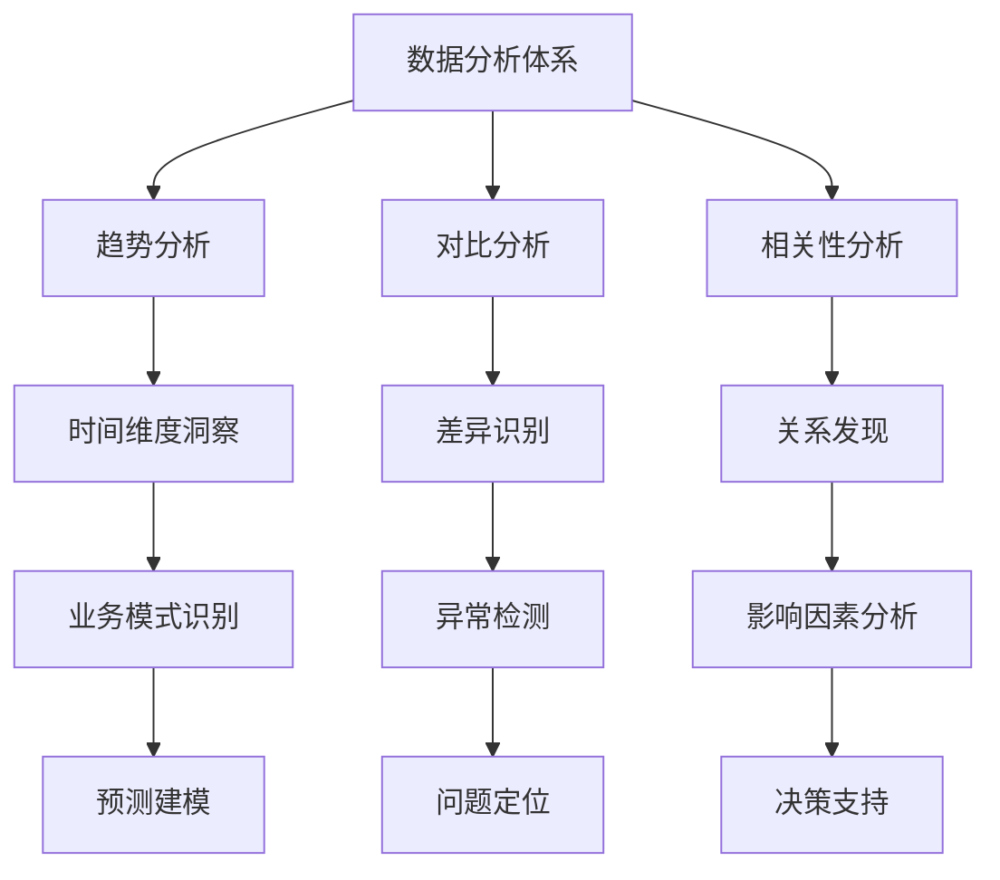

在企业级统一度量平台中，数据分析是将原始数据转化为有价值洞察的核心环节。趋势分析、对比分析和相关性分析作为三种基础而重要的分析方法，为业务决策提供了强有力的支持。通过这些分析技术，企业能够识别业务模式、发现异常情况、理解变量间的关系，从而做出更加明智的决策。本节将深入探讨这三种分析方法的原理、实现技术和实际应用场景。

## 分析方法概述

### 1.1 三种分析方法的特点

```yaml
分析方法特点:
  趋势分析:
    核心价值: 识别数据随时间的变化模式
    应用场景: 业务增长分析、性能监控、预测建模
    技术要点: 时间序列分析、移动平均、趋势拟合
  对比分析:
    核心价值: 通过比较发现差异和异常
    应用场景: A/B测试、竞品分析、地域对比
    技术要点: 统计检验、差异度量、显著性分析
  相关性分析:
    核心价值: 发现变量间的关联关系
    应用场景: 因素分析、影响评估、特征选择
    技术要点: 相关系数、回归分析、因果推断
```

### 1.2 分析方法的互补性

这三种分析方法在实际应用中往往相互补充，形成完整的分析体系：



## 趋势分析技术

### 2.1 时间序列分析基础

#### 2.1.1 趋势识别方法

```python
import numpy as np
import pandas as pd
from scipy import stats
import matplotlib.pyplot as plt
from sklearn.linear_model import LinearRegression
from statsmodels.tsa.seasonal import seasonal_decompose

class TrendAnalyzer:
    def __init__(self):
        self.trend_methods = {
            'linear': self.linear_trend,
            'polynomial': self.polynomial_trend,
            'moving_average': self.moving_average_trend,
            'exponential': self.exponential_trend
        }
    
    def analyze_trend(self, time_series, method='linear', **kwargs):
        """
        分析时间序列趋势
        """
        if method not in self.trend_methods:
            raise ValueError(f"不支持的趋势分析方法: {method}")
        
        return self.trend_methods[method](time_series, **kwargs)
    
    def linear_trend(self, time_series, visualize=False):
        """
        线性趋势分析
        """
        # 准备数据
        x = np.arange(len(time_series)).reshape(-1, 1)
        y = np.array(time_series)
        
        # 线性回归
        model = LinearRegression()
        model.fit(x, y)
        
        # 计算趋势指标
        slope = model.coef_[0]
        intercept = model.intercept_
        r_squared = model.score(x, y)
        
        # 趋势方向判断
        if slope > 0:
            trend_direction = '上升'
        elif slope < 0:
            trend_direction = '下降'
        else:
            trend_direction = '平稳'
        
        result = {
            'method': 'linear',
            'slope': slope,
            'intercept': intercept,
            'r_squared': r_squared,
            'trend_direction': trend_direction,
            'trend_strength': abs(slope),
            'fitted_values': model.predict(x)
        }
        
        if visualize:
            self._plot_linear_trend(time_series, result)
        
        return result
    
    def polynomial_trend(self, time_series, degree=2, visualize=False):
        """
        多项式趋势分析
        """
        x = np.arange(len(time_series))
        y = np.array(time_series)
        
        # 多项式拟合
        coefficients = np.polyfit(x, y, degree)
        polynomial = np.poly1d(coefficients)
        
        # 计算拟合值
        fitted_values = polynomial(x)
        
        # 计算R²
        ss_res = np.sum((y - fitted_values) ** 2)
        ss_tot = np.sum((y - np.mean(y)) ** 2)
        r_squared = 1 - (ss_res / ss_tot)
        
        result = {
            'method': 'polynomial',
            'degree': degree,
            'coefficients': coefficients.tolist(),
            'r_squared': r_squared,
            'fitted_values': fitted_values.tolist()
        }
        
        if visualize:
            self._plot_polynomial_trend(time_series, result)
        
        return result
    
    def moving_average_trend(self, time_series, window=7, visualize=False):
        """
        移动平均趋势分析
        """
        series = pd.Series(time_series)
        moving_avg = series.rolling(window=window).mean()
        
        # 计算趋势变化
        trend_changes = []
        for i in range(1, len(moving_avg)):
            if pd.notna(moving_avg.iloc[i]) and pd.notna(moving_avg.iloc[i-1]):
                change = moving_avg.iloc[i] - moving_avg.iloc[i-1]
                trend_changes.append(change)
        
        avg_change = np.mean(trend_changes) if trend_changes else 0
        
        result = {
            'method': 'moving_average',
            'window': window,
            'moving_average': moving_avg.tolist(),
            'avg_change': avg_change,
            'trend_direction': '上升' if avg_change > 0 else '下降' if avg_change < 0 else '平稳'
        }
        
        if visualize:
            self._plot_moving_average(time_series, result)
        
        return result
    
    def exponential_trend(self, time_series, alpha=0.3, visualize=False):
        """
        指数平滑趋势分析
        """
        series = pd.Series(time_series)
        exponential_smooth = series.ewm(alpha=alpha).mean()
        
        result = {
            'method': 'exponential',
            'alpha': alpha,
            'smoothed_values': exponential_smooth.tolist()
        }
        
        if visualize:
            self._plot_exponential_trend(time_series, result)
        
        return result
    
    def _plot_linear_trend(self, time_series, result):
        """绘制线性趋势图"""
        plt.figure(figsize=(12, 6))
        x = np.arange(len(time_series))
        plt.plot(x, time_series, label='原始数据', alpha=0.7)
        plt.plot(x, result['fitted_values'], label='线性趋势线', linewidth=2)
        plt.xlabel('时间')
        plt.ylabel('数值')
        plt.title(f'线性趋势分析 (R² = {result["r_squared"]:.3f})')
        plt.legend()
        plt.grid(True, alpha=0.3)
        plt.show()
    
    def _plot_polynomial_trend(self, time_series, result):
        """绘制多项式趋势图"""
        plt.figure(figsize=(12, 6))
        x = np.arange(len(time_series))
        plt.plot(x, time_series, label='原始数据', alpha=0.7)
        plt.plot(x, result['fitted_values'], label=f'{result["degree"]}阶多项式趋势', linewidth=2)
        plt.xlabel('时间')
        plt.ylabel('数值')
        plt.title(f'多项式趋势分析 (R² = {result["r_squared"]:.3f})')
        plt.legend()
        plt.grid(True, alpha=0.3)
        plt.show()
    
    def _plot_moving_average(self, time_series, result):
        """绘制移动平均趋势图"""
        plt.figure(figsize=(12, 6))
        x = np.arange(len(time_series))
        plt.plot(x, time_series, label='原始数据', alpha=0.7)
        plt.plot(x, result['moving_average'], label=f'{result["window"]}期移动平均', linewidth=2)
        plt.xlabel('时间')
        plt.ylabel('数值')
        plt.title(f'移动平均趋势分析')
        plt.legend()
        plt.grid(True, alpha=0.3)
        plt.show()
    
    def _plot_exponential_trend(self, time_series, result):
        """绘制指数平滑趋势图"""
        plt.figure(figsize=(12, 6))
        x = np.arange(len(time_series))
        plt.plot(x, time_series, label='原始数据', alpha=0.7)
        plt.plot(x, result['smoothed_values'], label=f'指数平滑 (α={result["alpha"]})', linewidth=2)
        plt.xlabel('时间')
        plt.ylabel('数值')
        plt.title('指数平滑趋势分析')
        plt.legend()
        plt.grid(True, alpha=0.3)
        plt.show()

# 使用示例
def example_trend_analysis():
    # 生成示例数据
    np.random.seed(42)
    time_points = 100
    trend = np.linspace(100, 200, time_points)
    noise = np.random.normal(0, 10, time_points)
    seasonal = 10 * np.sin(2 * np.pi * np.arange(time_points) / 12)
    data = trend + noise + seasonal
    
    # 创建趋势分析器
    analyzer = TrendAnalyzer()
    
    # 线性趋势分析
    linear_result = analyzer.analyze_trend(data, method='linear', visualize=True)
    print("线性趋势分析结果:")
    print(f"  趋势方向: {linear_result['trend_direction']}")
    print(f"  趋势强度: {linear_result['trend_strength']:.3f}")
    print(f"  拟合优度: {linear_result['r_squared']:.3f}")
    
    # 多项式趋势分析
    poly_result = analyzer.analyze_trend(data, method='polynomial', degree=3, visualize=True)
    print("\n多项式趋势分析结果:")
    print(f"  拟合优度: {poly_result['r_squared']:.3f}")
    
    # 移动平均趋势分析
    ma_result = analyzer.analyze_trend(data, method='moving_average', window=7, visualize=True)
    print("\n移动平均趋势分析结果:")
    print(f"  趋势方向: {ma_result['trend_direction']}")
    print(f"  平均变化: {ma_result['avg_change']:.3f}")
```

#### 2.1.2 季节性分解

```java
import org.apache.commons.math3.stat.regression.SimpleRegression;
import org.apache.commons.math3.util.Pair;

public class SeasonalTrendAnalyzer {
    
    /**
     * 时间序列季节性分解
     */
    public SeasonalDecomposition decomposeSeasonal(double[] timeSeries, int period) {
        int n = timeSeries.length;
        
        // 1. 计算趋势成分
        double[] trend = calculateTrend(timeSeries, period);
        
        // 2. 去除趋势得到季节性和随机成分
        double[] detrended = new double[n];
        for (int i = 0; i < n; i++) {
            detrended[i] = timeSeries[i] - trend[i];
        }
        
        // 3. 计算季节性成分
        double[] seasonal = calculateSeasonal(detrended, period);
        
        // 4. 计算随机成分
        double[] random = new double[n];
        for (int i = 0; i < n; i++) {
            random[i] = timeSeries[i] - trend[i] - seasonal[i];
        }
        
        return new SeasonalDecomposition(trend, seasonal, random);
    }
    
    /**
     * 计算趋势成分（移动平均法）
     */
    private double[] calculateTrend(double[] timeSeries, int period) {
        int n = timeSeries.length;
        double[] trend = new double[n];
        
        // 使用移动平均计算趋势
        int window = period * 2 + 1; // 使用奇数窗口以保持对称
        
        for (int i = 0; i < n; i++) {
            if (i < window / 2 || i >= n - window / 2) {
                // 边界点使用线性插值
                trend[i] = timeSeries[i];
            } else {
                // 计算移动平均
                double sum = 0;
                for (int j = i - window / 2; j <= i + window / 2; j++) {
                    sum += timeSeries[j];
                }
                trend[i] = sum / window;
            }
        }
        
        return trend;
    }
    
    /**
     * 计算季节性成分
     */
    private double[] calculateSeasonal(double[] detrended, int period) {
        int n = detrended.length;
        double[] seasonal = new double[n];
        
        // 对每个季节周期计算平均值
        double[] seasonalAverages = new double[period];
        int[] seasonalCounts = new int[period];
        
        // 累积每个季节周期的值
        for (int i = 0; i < n; i++) {
            int seasonIndex = i % period;
            seasonalAverages[seasonIndex] += detrended[i];
            seasonalCounts[seasonIndex]++;
        }
        
        // 计算平均值
        for (int i = 0; i < period; i++) {
            if (seasonalCounts[i] > 0) {
                seasonalAverages[i] /= seasonalCounts[i];
            }
        }
        
        // 调整季节性成分使其均值为0
        double seasonalMean = 0;
        for (int i = 0; i < period; i++) {
            seasonalMean += seasonalAverages[i];
        }
        seasonalMean /= period;
        
        for (int i = 0; i < period; i++) {
            seasonalAverages[i] -= seasonalMean;
        }
        
        // 扩展到整个时间序列
        for (int i = 0; i < n; i++) {
            seasonal[i] = seasonalAverages[i % period];
        }
        
        return seasonal;
    }
    
    /**
     * 趋势显著性检验
     */
    public TrendSignificance testTrendSignificance(double[] timeSeries) {
        SimpleRegression regression = new SimpleRegression();
        
        // 添加数据点
        for (int i = 0; i < timeSeries.length; i++) {
            regression.addData(i, timeSeries[i]);
        }
        
        // 计算统计量
        double slope = regression.getSlope();
        double slopeStdErr = regression.getSlopeStdErr();
        double tStatistic = slope / slopeStdErr;
        double pValue = 2 * (1 - tDistributionCDF(Math.abs(tStatistic), timeSeries.length - 2));
        
        boolean isSignificant = pValue < 0.05; // 95%置信水平
        
        return new TrendSignificance(slope, tStatistic, pValue, isSignificant);
    }
    
    /**
     * t分布累积分布函数（简化实现）
     */
    private double tDistributionCDF(double t, int df) {
        // 这里使用近似计算，实际应用中应使用专门的统计库
        // 简化处理：使用正态分布近似（当df较大时）
        return normalCDF(t);
    }
    
    /**
     * 标准正态分布累积分布函数
     */
    private double normalCDF(double x) {
        return 0.5 * (1 + erf(x / Math.sqrt(2)));
    }
    
    /**
     * 误差函数
     */
    private double erf(double x) {
        // 误差函数的近似计算
        double a1 =  0.254829592;
        double a2 = -0.284496736;
        double a3 =  1.421413741;
        double a4 = -1.453152027;
        double a5 =  1.061405429;
        double p  =  0.3275911;
        
        int sign = x < 0 ? -1 : 1;
        x = Math.abs(x);
        
        double t = 1.0 / (1.0 + p * x);
        double y = 1.0 - (((((a5 * t + a4) * t) + a3) * t + a2) * t + a1) * t * Math.exp(-x * x);
        
        return sign * y;
    }
}

class SeasonalDecomposition {
    private final double[] trend;
    private final double[] seasonal;
    private final double[] random;
    
    public SeasonalDecomposition(double[] trend, double[] seasonal, double[] random) {
        this.trend = trend;
        this.seasonal = seasonal;
        this.random = random;
    }
    
    // Getters
    public double[] getTrend() { return trend; }
    public double[] getSeasonal() { return seasonal; }
    public double[] getRandom() { return random; }
}

class TrendSignificance {
    private final double slope;
    private final double tStatistic;
    private final double pValue;
    private final boolean isSignificant;
    
    public TrendSignificance(double slope, double tStatistic, double pValue, boolean isSignificant) {
        this.slope = slope;
        this.tStatistic = tStatistic;
        this.pValue = pValue;
        this.isSignificant = isSignificant;
    }
    
    // Getters
    public double getSlope() { return slope; }
    public double getTStatistic() { return tStatistic; }
    public double getPValue() { return pValue; }
    public boolean isSignificant() { return isSignificant; }
}
```

### 2.2 高级趋势分析

#### 2.2.1 变化点检测

```typescript
class ChangePointDetector {
    /**
     * 使用CUSUM方法检测变化点
     */
    detectCUSUM(data: number[], threshold: number = 5, drift: number = 0): number[] {
        const changePoints: number[] = [];
        let mean = 0;
        let std = 1;
        let cusumPos = 0;
        let cusumNeg = 0;
        
        for (let i = 0; i < data.length; i++) {
            // 更新统计量（简化处理）
            if (i === 0) {
                mean = data[i];
            } else {
                mean = (mean * i + data[i]) / (i + 1);
            }
            
            // 计算CUSUM统计量
            const deviation = data[i] - mean - drift;
            cusumPos = Math.max(0, cusumPos + deviation);
            cusumNeg = Math.max(0, cusumNeg - deviation);
            
            // 检测变化点
            if (cusumPos > threshold || cusumNeg > threshold) {
                changePoints.push(i);
                // 重置CUSUM统计量
                cusumPos = 0;
                cusumNeg = 0;
            }
        }
        
        return changePoints;
    }
    
    /**
     * 使用滑动窗口方法检测趋势变化
     */
    detectTrendChange(data: number[], windowSize: number = 10, threshold: number = 0.1): number[] {
        const changePoints: number[] = [];
        
        for (let i = windowSize; i < data.length - windowSize; i++) {
            // 计算前后窗口的趋势
            const beforeWindow = data.slice(i - windowSize, i);
            const afterWindow = data.slice(i, i + windowSize);
            
            const beforeTrend = this.calculateSlope(beforeWindow);
            const afterTrend = this.calculateSlope(afterWindow);
            
            // 检测趋势变化
            const trendChange = Math.abs(afterTrend - beforeTrend);
            if (trendChange > threshold) {
                changePoints.push(i);
            }
        }
        
        return changePoints;
    }
    
    private calculateSlope(data: number[]): number {
        if (data.length < 2) return 0;
        
        let sumX = 0, sumY = 0, sumXY = 0, sumXX = 0;
        const n = data.length;
        
        for (let i = 0; i < n; i++) {
            sumX += i;
            sumY += data[i];
            sumXY += i * data[i];
            sumXX += i * i;
        }
        
        const slope = (n * sumXY - sumX * sumY) / (n * sumXX - sumX * sumX);
        return slope;
    }
    
    /**
     * 使用贝叶斯方法检测变化点
     */
    detectBayesianChangePoint(data: number[]): ChangePointResult {
        // 简化实现：使用R语言的changepoint包逻辑
        const changePoints: number[] = [];
        const probabilities: number[] = [];
        
        // 对于每个可能的变化点，计算后验概率
        for (let i = 10; i < data.length - 10; i++) {
            // 分割数据
            const beforeData = data.slice(0, i);
            const afterData = data.slice(i);
            
            // 计算似然比
            const likelihoodRatio = this.calculateLikelihoodRatio(beforeData, afterData);
            const probability = 1 / (1 + Math.exp(-likelihoodRatio));
            
            probabilities.push(probability);
            
            if (probability > 0.9) { // 阈值可调
                changePoints.push(i);
            }
        }
        
        return {
            changePoints,
            probabilities,
            method: 'bayesian'
        };
    }
    
    private calculateLikelihoodRatio(beforeData: number[], afterData: number[]): number {
        // 计算两段数据的均值和方差
        const beforeMean = this.mean(beforeData);
        const beforeVar = this.variance(beforeData, beforeMean);
        const afterMean = this.mean(afterData);
        const afterVar = this.variance(afterData, afterMean);
        
        // 简化的似然比计算
        const meanDiff = Math.abs(beforeMean - afterMean);
        const varRatio = (beforeVar + afterVar) / 2;
        
        return meanDiff / Math.sqrt(varRatio);
    }
    
    private mean(data: number[]): number {
        return data.reduce((sum, val) => sum + val, 0) / data.length;
    }
    
    private variance(data: number[], mean: number): number {
        return data.reduce((sum, val) => sum + Math.pow(val - mean, 2), 0) / data.length;
    }
}

interface ChangePointResult {
    changePoints: number[];
    probabilities: number[];
    method: string;
}
```

## 对比分析技术

### 3.1 统计对比方法

#### 3.1.1 假设检验

```sql
-- A/B测试对比分析示例
WITH experiment_data AS (
    -- 获取实验数据
    SELECT 
        variant,
        user_id,
        conversion_event,
        revenue,
        timestamp
    FROM user_experiments
    WHERE experiment_id = 'exp_20250101'
      AND timestamp >= '2025-01-01'
      AND timestamp < '2025-01-15'
),
variant_metrics AS (
    -- 计算各变体指标
    SELECT 
        variant,
        COUNT(DISTINCT user_id) as total_users,
        COUNT(DISTINCT CASE WHEN conversion_event = 1 THEN user_id END) as converted_users,
        AVG(CASE WHEN conversion_event = 1 THEN revenue END) as avg_revenue_per_conversion,
        SUM(CASE WHEN conversion_event = 1 THEN revenue END) as total_revenue
    FROM experiment_data
    GROUP BY variant
),
statistical_tests AS (
    -- 计算统计检验结果
    SELECT 
        variant,
        total_users,
        converted_users,
        converted_users * 1.0 / total_users as conversion_rate,
        avg_revenue_per_conversion,
        total_revenue,
        -- 计算置信区间（简化）
        converted_users * 1.0 / total_users - 1.96 * SQRT(
            (converted_users * 1.0 / total_users) * (1 - converted_users * 1.0 / total_users) / total_users
        ) as ci_lower,
        converted_users * 1.0 / total_users + 1.96 * SQRT(
            (converted_users * 1.0 / total_users) * (1 - converted_users * 1.0 / total_users) / total_users
        ) as ci_upper
    FROM variant_metrics
)
SELECT 
    variant,
    total_users,
    converted_users,
    ROUND(conversion_rate * 100, 2) as conversion_rate_pct,
    ROUND(avg_revenue_per_conversion, 2) as avg_revenue,
    total_revenue,
    ROUND(ci_lower * 100, 2) as ci_lower_pct,
    ROUND(ci_upper * 100, 2) as ci_upper_pct,
    -- 判断是否显著优于对照组
    CASE 
        WHEN variant != 'control' THEN
            CASE 
                WHEN ci_lower > (
                    SELECT conversion_rate 
                    FROM statistical_tests 
                    WHERE variant = 'control'
                ) THEN '显著提升'
                WHEN ci_upper < (
                    SELECT conversion_rate 
                    FROM statistical_tests 
                    WHERE variant = 'control'
                ) THEN '显著下降'
                ELSE '无显著差异'
            END
        ELSE '对照组'
    END as significance_result
FROM statistical_tests
ORDER BY variant;
```

#### 3.1.2 差异度量

```go
package analysis

import (
    "math"
    "sort"
)

type ComparisonAnalyzer struct{}

// ComparisonResult 存储对比分析结果
type ComparisonResult struct {
    GroupAStats     DescriptiveStats `json:"group_a_stats"`
    GroupBStats     DescriptiveStats `json:"group_b_stats"`
    Difference      float64          `json:"difference"`
    RelativeChange  float64          `json:"relative_change"`
    EffectSize      float64          `json:"effect_size"`
    PValue          float64          `json:"p_value"`
    IsSignificant   bool             `json:"is_significant"`
    ConfidenceLevel float64          `json:"confidence_level"`
}

// DescriptiveStats 描述性统计信息
type DescriptiveStats struct {
    Count    int     `json:"count"`
    Mean     float64 `json:"mean"`
    Median   float64 `json:"median"`
    StdDev   float64 `json:"std_dev"`
    Min      float64 `json:"min"`
    Max      float64 `json:"max"`
    Q1       float64 `json:"q1"`
    Q3       float64 `json:"q3"`
}

// CompareGroups 对比两个数据组
func (ca *ComparisonAnalyzer) CompareGroups(groupA, groupB []float64, confidenceLevel float64) *ComparisonResult {
    // 计算描述性统计
    statsA := ca.calculateDescriptiveStats(groupA)
    statsB := ca.calculateDescriptiveStats(groupB)
    
    // 计算差异
    difference := statsB.Mean - statsA.Mean
    relativeChange := 0.0
    if statsA.Mean != 0 {
        relativeChange = difference / math.Abs(statsA.Mean) * 100
    }
    
    // 计算效应量 (Cohen's d)
    pooledStdDev := ca.calculatePooledStdDev(statsA, statsB)
    effectSize := 0.0
    if pooledStdDev != 0 {
        effectSize = difference / pooledStdDev
    }
    
    // 执行t检验
    tStat, pValue := ca.performTTest(groupA, groupB)
    
    // 判断显著性
    isSignificant := pValue < (1 - confidenceLevel/100)
    
    return &ComparisonResult{
        GroupAStats:     statsA,
        GroupBStats:     statsB,
        Difference:      difference,
        RelativeChange:  relativeChange,
        EffectSize:      effectSize,
        PValue:          pValue,
        IsSignificant:   isSignificant,
        ConfidenceLevel: confidenceLevel,
    }
}

// calculateDescriptiveStats 计算描述性统计信息
func (ca *ComparisonAnalyzer) calculateDescriptiveStats(data []float64) DescriptiveStats {
    if len(data) == 0 {
        return DescriptiveStats{}
    }
    
    // 排序数据用于计算分位数
    sortedData := make([]float64, len(data))
    copy(sortedData, data)
    sort.Float64s(sortedData)
    
    // 计算基本统计量
    sum := 0.0
    for _, value := range data {
        sum += value
    }
    mean := sum / float64(len(data))
    
    // 计算标准差
    sumSquaredDiff := 0.0
    for _, value := range data {
        diff := value - mean
        sumSquaredDiff += diff * diff
    }
    stdDev := math.Sqrt(sumSquaredDiff / float64(len(data)))
    
    // 计算分位数
    q1 := ca.percentile(sortedData, 25)
    median := ca.percentile(sortedData, 50)
    q3 := ca.percentile(sortedData, 75)
    
    return DescriptiveStats{
        Count:  len(data),
        Mean:   mean,
        Median: median,
        StdDev: stdDev,
        Min:    sortedData[0],
        Max:    sortedData[len(sortedData)-1],
        Q1:     q1,
        Q3:     q3,
    }
}

// percentile 计算百分位数
func (ca *ComparisonAnalyzer) percentile(data []float64, percentile float64) float64 {
    if len(data) == 0 {
        return 0
    }
    
    index := (percentile / 100) * float64(len(data)-1)
    lowerIndex := int(math.Floor(index))
    upperIndex := int(math.Ceil(index))
    
    if lowerIndex == upperIndex {
        return data[lowerIndex]
    }
    
    weight := index - float64(lowerIndex)
    return data[lowerIndex]*(1-weight) + data[upperIndex]*weight
}

// calculatePooledStdDev 计算合并标准差
func (ca *ComparisonAnalyzer) calculatePooledStdDev(statsA, statsB DescriptiveStats) float64 {
    n1 := float64(statsA.Count)
    n2 := float64(statsB.Count)
    sd1 := statsA.StdDev
    sd2 := statsB.StdDev
    
    if n1+n2-2 == 0 {
        return 0
    }
    
    pooledVariance := ((n1-1)*sd1*sd1 + (n2-1)*sd2*sd2) / (n1 + n2 - 2)
    return math.Sqrt(pooledVariance)
}

// performTTest 执行独立样本t检验
func (ca *ComparisonAnalyzer) performTTest(groupA, groupB []float64) (float64, float64) {
    n1 := float64(len(groupA))
    n2 := float64(len(groupB))
    
    if n1 == 0 || n2 == 0 {
        return 0, 1
    }
    
    // 计算均值
    mean1 := 0.0
    mean2 := 0.0
    for _, v := range groupA {
        mean1 += v
    }
    for _, v := range groupB {
        mean2 += v
    }
    mean1 /= n1
    mean2 /= n2
    
    // 计算方差
    var1 := 0.0
    var2 := 0.0
    for _, v := range groupA {
        diff := v - mean1
        var1 += diff * diff
    }
    for _, v := range groupB {
        diff := v - mean2
        var2 += diff * diff
    }
    var1 /= n1
    var2 /= n2
    
    // 计算t统计量
    pooledVar := ((n1-1)*var1 + (n2-1)*var2) / (n1 + n2 - 2)
    if pooledVar == 0 {
        return 0, 1
    }
    
    tStat := (mean1 - mean2) / math.Sqrt(pooledVar*(1/n1+1/n2))
    
    // 计算自由度
    df := n1 + n2 - 2
    
    // 计算p值（简化实现）
    pValue := ca.calculatePValue(tStat, df)
    
    return tStat, pValue
}

// calculatePValue 计算p值（简化实现）
func (ca *ComparisonAnalyzer) calculatePValue(tStat, df float64) float64 {
    // 这里使用近似计算，实际应用中应使用专门的统计库
    // 简化处理：使用正态分布近似
    absTStat := math.Abs(tStat)
    pValue := 2 * (1 - ca.normalCDF(absTStat))
    
    return math.Min(pValue, 1)
}

// normalCDF 标准正态分布累积分布函数
func (ca *ComparisonAnalyzer) normalCDF(x float64) float64 {
    return 0.5 * (1 + ca.erf(x/math.Sqrt2))
}

// erf 误差函数
func (ca *ComparisonAnalyzer) erf(x float64) float64 {
    // 误差函数的近似计算
    a1 := 0.254829592
    a2 := -0.284496736
    a3 := 1.421413741
    a4 := -1.453152027
    a5 := 1.061405429
    p := 0.3275911
    
    sign := 1.0
    if x < 0 {
        sign = -1
    }
    x = math.Abs(x)
    
    t := 1.0 / (1.0 + p*x)
    y := 1.0 - (((((a5*t+a4)*t)+a3)*t+a2)*t+a1)*t*math.Exp(-x*x)
    
    return sign * y
}
```

### 3.2 多维度对比分析

```javascript
class MultiDimensionalComparator {
    constructor(dataService) {
        this.dataService = dataService;
    }
    
    /**
     * 执行多维度对比分析
     */
    async performMultiDimensionalComparison(baseDataset, comparisonDataset, dimensions) {
        const results = {};
        
        // 对每个维度执行对比分析
        for (const dimension of dimensions) {
            results[dimension] = await this.analyzeDimension(
                baseDataset, 
                comparisonDataset, 
                dimension
            );
        }
        
        return this.synthesizeResults(results);
    }
    
    /**
     * 分析单个维度的对比
     */
    async analyzeDimension(baseDataset, comparisonDataset, dimension) {
        // 获取维度值
        const dimensionValues = await this.getDimensionValues(dimension);
        
        const dimensionResults = [];
        
        // 对每个维度值进行对比
        for (const value of dimensionValues) {
            const baseFiltered = await this.filterByDimension(baseDataset, dimension, value);
            const comparisonFiltered = await this.filterByDimension(comparisonDataset, dimension, value);
            
            // 计算关键指标
            const baseMetrics = await this.calculateMetrics(baseFiltered);
            const comparisonMetrics = await this.calculateMetrics(comparisonFiltered);
            
            // 执行统计检验
            const statisticalTest = await this.performStatisticalTest(
                baseFiltered, 
                comparisonFiltered
            );
            
            dimensionResults.push({
                dimensionValue: value,
                baseMetrics: baseMetrics,
                comparisonMetrics: comparisonMetrics,
                statisticalTest: statisticalTest,
                significance: this.determineSignificance(statisticalTest)
            });
        }
        
        return {
            dimension: dimension,
            results: dimensionResults,
            summary: this.summarizeDimensionResults(dimensionResults)
        };
    }
    
    /**
     * 获取维度的所有可能值
     */
    async getDimensionValues(dimension) {
        // 从数据服务获取维度值
        return await this.dataService.getDimensionValues(dimension);
    }
    
    /**
     * 根据维度值过滤数据集
     */
    async filterByDimension(dataset, dimension, value) {
        return await this.dataService.filterDataset(dataset, {
            [dimension]: value
        });
    }
    
    /**
     * 计算关键指标
     */
    async calculateMetrics(dataset) {
        const metrics = {};
        
        // 计算各种指标
        metrics.count = await this.dataService.countRecords(dataset);
        metrics.sum = await this.dataService.sumField(dataset, 'value');
        metrics.average = await this.dataService.averageField(dataset, 'value');
        metrics.median = await this.dataService.medianField(dataset, 'value');
        metrics.stdDev = await this.dataService.stdDevField(dataset, 'value');
        
        return metrics;
    }
    
    /**
     * 执行统计检验
     */
    async performStatisticalTest(baseDataset, comparisonDataset) {
        // 这里可以集成各种统计检验方法
        const tTestResult = await this.performTTest(baseDataset, comparisonDataset);
        const mannWhitneyResult = await this.performMannWhitneyTest(baseDataset, comparisonDataset);
        const chiSquareResult = await this.performChiSquareTest(baseDataset, comparisonDataset);
        
        return {
            tTest: tTestResult,
            mannWhitney: mannWhitneyResult,
            chiSquare: chiSquareResult
        };
    }
    
    /**
     * 确定统计显著性
     */
    determineSignificance(statisticalTest) {
        // 综合多种检验结果确定显著性
        const significanceThreshold = 0.05;
        
        if (statisticalTest.tTest.pValue < significanceThreshold) {
            return 't-test显著';
        }
        
        if (statisticalTest.mannWhitney.pValue < significanceThreshold) {
            return 'Mann-Whitney显著';
        }
        
        if (statisticalTest.chiSquare.pValue < significanceThreshold) {
            return '卡方检验显著';
        }
        
        return '无显著差异';
    }
    
    /**
     * 汇总维度分析结果
     */
    summarizeDimensionResults(dimensionResults) {
        const summary = {
            totalValues: dimensionResults.length,
            significantCount: 0,
            improvementCount: 0,
            declineCount: 0,
            averageChange: 0
        };
        
        let totalChange = 0;
        
        for (const result of dimensionResults) {
            if (result.significance !== '无显著差异') {
                summary.significantCount++;
            }
            
            const change = result.comparisonMetrics.average - result.baseMetrics.average;
            totalChange += change;
            
            if (change > 0) {
                summary.improvementCount++;
            } else if (change < 0) {
                summary.declineCount++;
            }
        }
        
        summary.averageChange = totalChange / dimensionResults.length;
        
        return summary;
    }
    
    /**
     * 综合分析结果
     */
    synthesizeResults(results) {
        const synthesized = {
            dimensions: results,
            overallSummary: this.createOverallSummary(results),
            keyInsights: this.extractKeyInsights(results),
            recommendations: this.generateRecommendations(results)
        };
        
        return synthesized;
    }
    
    /**
     * 创建整体摘要
     */
    createOverallSummary(results) {
        const summary = {
            totalDimensions: Object.keys(results).length,
            dimensionsWithSignificantDifferences: 0,
            averageSignificantRate: 0
        };
        
        let totalSignificant = 0;
        let totalValues = 0;
        
        for (const [dimension, result] of Object.entries(results)) {
            if (result.summary.significantCount > 0) {
                summary.dimensionsWithSignificantDifferences++;
            }
            
            totalSignificant += result.summary.significantCount;
            totalValues += result.summary.totalValues;
        }
        
        summary.averageSignificantRate = totalValues > 0 ? 
            (totalSignificant / totalValues) * 100 : 0;
        
        return summary;
    }
    
    /**
     * 提取关键洞察
     */
    extractKeyInsights(results) {
        const insights = [];
        
        // 找出差异最大的维度
        for (const [dimension, result] of Object.entries(results)) {
            const significantResults = result.results.filter(r => 
                r.significance !== '无显著差异'
            );
            
            if (significantResults.length > 0) {
                insights.push({
                    type: 'significant_dimension',
                    dimension: dimension,
                    significantCount: significantResults.length,
                    message: `${dimension}维度有${significantResults.length}个值存在显著差异`
                });
            }
            
            // 找出改善最多的维度值
            const improvements = result.results.filter(r => 
                r.comparisonMetrics.average > r.baseMetrics.average
            );
            
            if (improvements.length > result.results.length * 0.5) {
                insights.push({
                    type: 'overall_improvement',
                    dimension: dimension,
                    improvementRate: (improvements.length / result.results.length) * 100,
                    message: `${dimension}维度整体呈现改善趋势`
                });
            }
        }
        
        return insights;
    }
    
    /**
     * 生成建议
     */
    generateRecommendations(results) {
        const recommendations = [];
        
        for (const [dimension, result] of Object.entries(results)) {
            if (result.summary.significantCount > result.summary.totalValues * 0.3) {
                recommendations.push({
                    type: 'deep_dive',
                    dimension: dimension,
                    priority: 'high',
                    message: `建议深入分析${dimension}维度，因为超过30%的值存在显著差异`
                });
            }
            
            if (result.summary.improvementCount > result.summary.declineCount) {
                recommendations.push({
                    type: 'best_practices',
                    dimension: dimension,
                    priority: 'medium',
                    message: `总结${dimension}维度的改善经验，形成最佳实践`
                });
            }
        }
        
        return recommendations;
    }
}
```

## 相关性分析技术

### 4.1 相关性度量方法

#### 4.1.1 皮尔逊相关系数

```python
import numpy as np
from scipy.stats import pearsonr, spearmanr, kendalltau
from sklearn.feature_selection import mutual_info_regression
import matplotlib.pyplot as plt
import seaborn as sns

class CorrelationAnalyzer:
    def __init__(self):
        self.correlation_methods = {
            'pearson': self.pearson_correlation,
            'spearman': self.spearman_correlation,
            'kendall': self.kendall_correlation,
            'mutual_info': self.mutual_information
        }
    
    def analyze_correlations(self, data, method='pearson'):
        """
        分析变量间的相关性
        """
        if method not in self.correlation_methods:
            raise ValueError(f"不支持的相关性分析方法: {method}")
        
        return self.correlation_methods[method](data)
    
    def pearson_correlation(self, data):
        """
        皮尔逊相关系数分析
        """
        # 计算相关系数矩阵
        corr_matrix = np.corrcoef(data.T)
        
        # 计算p值矩阵
        n_vars = data.shape[1]
        p_values = np.zeros((n_vars, n_vars))
        
        for i in range(n_vars):
            for j in range(i+1, n_vars):
                if i != j:
                    corr, p_val = pearsonr(data[:, i], data[:, j])
                    p_values[i, j] = p_val
                    p_values[j, i] = p_val
        
        # 创建显著性标记矩阵
        significance = p_values < 0.05
        
        return {
            'method': 'pearson',
            'correlation_matrix': corr_matrix,
            'p_values': p_values,
            'significance': significance,
            'interpretation': self.interpret_correlation(corr_matrix)
        }
    
    def spearman_correlation(self, data):
        """
        斯皮尔曼等级相关系数分析
        """
        n_vars = data.shape[1]
        corr_matrix = np.zeros((n_vars, n_vars))
        p_values = np.zeros((n_vars, n_vars))
        
        for i in range(n_vars):
            for j in range(n_vars):
                if i != j:
                    corr, p_val = spearmanr(data[:, i], data[:, j])
                    corr_matrix[i, j] = corr
                    p_values[i, j] = p_val
                else:
                    corr_matrix[i, j] = 1.0
        
        significance = p_values < 0.05
        
        return {
            'method': 'spearman',
            'correlation_matrix': corr_matrix,
            'p_values': p_values,
            'significance': significance,
            'interpretation': self.interpret_correlation(corr_matrix)
        }
    
    def kendall_correlation(self, data):
        """
        肯德尔等级相关系数分析
        """
        n_vars = data.shape[1]
        corr_matrix = np.zeros((n_vars, n_vars))
        p_values = np.zeros((n_vars, n_vars))
        
        for i in range(n_vars):
            for j in range(n_vars):
                if i != j:
                    corr, p_val = kendalltau(data[:, i], data[:, j])
                    corr_matrix[i, j] = corr
                    p_values[i, j] = p_val
                else:
                    corr_matrix[i, j] = 1.0
        
        significance = p_values < 0.05
        
        return {
            'method': 'kendall',
            'correlation_matrix': corr_matrix,
            'p_values': p_values,
            'significance': significance,
            'interpretation': self.interpret_correlation(corr_matrix)
        }
    
    def mutual_information(self, data):
        """
        互信息分析
        """
        n_vars = data.shape[1]
        mi_matrix = np.zeros((n_vars, n_vars))
        
        for i in range(n_vars):
            for j in range(n_vars):
                if i != j:
                    # 计算互信息
                    mi = mutual_info_regression(
                        data[:, j].reshape(-1, 1), 
                        data[:, i],
                        random_state=42
                    )[0]
                    mi_matrix[i, j] = mi
                else:
                    # 自身互信息设为最大值
                    mi_matrix[i, j] = 1.0
        
        return {
            'method': 'mutual_info',
            'correlation_matrix': mi_matrix,
            'interpretation': self.interpret_mutual_info(mi_matrix)
        }
    
    def interpret_correlation(self, corr_matrix):
        """
        解释相关系数
        """
        interpretation = {}
        
        for i in range(corr_matrix.shape[0]):
            for j in range(corr_matrix.shape[1]):
                if i != j:
                    corr = corr_matrix[i, j]
                    if abs(corr) >= 0.8:
                        strength = '强'
                    elif abs(corr) >= 0.5:
                        strength = '中等'
                    elif abs(corr) >= 0.3:
                        strength = '弱'
                    else:
                        strength = '极弱'
                    
                    direction = '正' if corr > 0 else '负' if corr < 0 else '无'
                    
                    interpretation[f'{i}-{j}'] = {
                        'strength': strength,
                        'direction': direction,
                        'value': corr
                    }
        
        return interpretation
    
    def interpret_mutual_info(self, mi_matrix):
        """
        解释互信息
        """
        interpretation = {}
        
        for i in range(mi_matrix.shape[0]):
            for j in range(mi_matrix.shape[1]):
                if i != j:
                    mi = mi_matrix[i, j]
                    if mi >= 0.5:
                        strength = '强'
                    elif mi >= 0.2:
                        strength = '中等'
                    elif mi >= 0.1:
                        strength = '弱'
                    else:
                        strength = '极弱'
                    
                    interpretation[f'{i}-{j}'] = {
                        'strength': strength,
                        'value': mi
                    }
        
        return interpretation
    
    def visualize_correlation_matrix(self, correlation_result, variable_names=None):
        """
        可视化相关系数矩阵
        """
        corr_matrix = correlation_result['correlation_matrix']
        n_vars = corr_matrix.shape[0]
        
        if variable_names is None:
            variable_names = [f'变量{i}' for i in range(n_vars)]
        
        plt.figure(figsize=(10, 8))
        
        # 创建热力图
        mask = np.triu(np.ones_like(corr_matrix, dtype=bool))
        sns.heatmap(
            corr_matrix,
            mask=mask,
            annot=True,
            cmap='RdBu_r',
            center=0,
            square=True,
            fmt='.2f',
            cbar_kws={"shrink": .8}
        )
        
        plt.title(f'{correlation_result["method"].upper()} 相关系数矩阵')
        plt.xticks(range(n_vars), variable_names, rotation=45, ha='right')
        plt.yticks(range(n_vars), variable_names, rotation=0)
        plt.tight_layout()
        plt.show()
    
    def find_significant_correlations(self, correlation_result, threshold=0.5):
        """
        找出显著的相关关系
        """
        corr_matrix = correlation_result['correlation_matrix']
        significance = correlation_result.get('significance', None)
        
        significant_correlations = []
        
        for i in range(corr_matrix.shape[0]):
            for j in range(i+1, corr_matrix.shape[1]):
                corr_value = corr_matrix[i, j]
                
                # 检查相关性强度
                if abs(corr_value) >= threshold:
                    is_significant = True
                    if significance is not None:
                        is_significant = significance[i, j]
                    
                    if is_significant:
                        significant_correlations.append({
                            'variables': (i, j),
                            'correlation': corr_value,
                            'strength': '强' if abs(corr_value) >= 0.7 else '中等' if abs(corr_value) >= 0.4 else '弱',
                            'direction': '正' if corr_value > 0 else '负'
                        })
        
        # 按相关性强度排序
        significant_correlations.sort(key=lambda x: abs(x['correlation']), reverse=True)
        
        return significant_correlations

# 使用示例
def example_correlation_analysis():
    # 生成示例数据
    np.random.seed(42)
    n_samples = 1000
    
    # 创建相关变量
    x1 = np.random.normal(0, 1, n_samples)
    x2 = 0.8 * x1 + 0.2 * np.random.normal(0, 1, n_samples)  # 强正相关
    x3 = -0.6 * x1 + 0.4 * np.random.normal(0, 1, n_samples)  # 中等负相关
    x4 = np.random.normal(0, 1, n_samples)  # 无相关
    x5 = 0.4 * x1 + 0.3 * x2 + 0.3 * np.random.normal(0, 1, n_samples)  # 多重相关
    
    # 组合成数据矩阵
    data = np.column_stack([x1, x2, x3, x4, x5])
    
    # 创建分析器
    analyzer = CorrelationAnalyzer()
    
    # 皮尔逊相关分析
    pearson_result = analyzer.analyze_correlations(data, method='pearson')
    print("皮尔逊相关分析结果:")
    print(f"变量1-2相关系数: {pearson_result['correlation_matrix'][0, 1]:.3f}")
    print(f"变量1-3相关系数: {pearson_result['correlation_matrix'][0, 2]:.3f}")
    
    # 可视化相关矩阵
    variable_names = ['X1', 'X2', 'X3', 'X4', 'X5']
    analyzer.visualize_correlation_matrix(pearson_result, variable_names)
    
    # 找出显著相关关系
    significant_corrs = analyzer.find_significant_correlations(pearson_result, threshold=0.3)
    print("\n显著相关关系:")
    for corr in significant_corrs:
        print(f"变量{corr['variables'][0]+1}-变量{corr['variables'][1]+1}: "
              f"{corr['direction']}相关 ({corr['strength']}), 相关系数: {corr['correlation']:.3f}")
```

#### 4.1.2 偏相关分析

```r
# R语言实现偏相关分析
library(ppcor)
library(corrplot)

perform_partial_correlation_analysis <- function(data, variables, control_vars = NULL) {
  # 计算偏相关系数
  if (is.null(control_vars)) {
    # 简单相关分析
    cor_result <- cor(data[, variables])
    pcor_result <- NULL
  } else {
    # 偏相关分析
    pcor_result <- pcor(data[, c(variables, control_vars)], method = "pearson")
    cor_result <- pcor_result$estimate[variables, variables]
  }
  
  # 可视化相关矩阵
  corrplot(cor_result, method = "color", type = "upper", 
           order = "hclust", tl.cex = 0.8, tl.col = "black")
  
  # 返回结果
  return(list(
    correlation_matrix = cor_result,
    partial_correlation = pcor_result,
    significant_correlations = find_significant_correlations(cor_result)
  ))
}

find_significant_correlations <- function(cor_matrix, p_value_threshold = 0.05) {
  n_vars <- nrow(cor_matrix)
  significant_corrs <- data.frame()
  
  for (i in 1:(n_vars-1)) {
    for (j in (i+1):n_vars) {
      corr_value <- cor_matrix[i, j]
      # 这里简化处理，实际应计算p值
      if (abs(corr_value) > 0.3) {
        significant_corrs <- rbind(significant_corrs, data.frame(
          var1 = rownames(cor_matrix)[i],
          var2 = colnames(cor_matrix)[j],
          correlation = corr_value,
          strength = ifelse(abs(corr_value) > 0.7, "强", 
                           ifelse(abs(corr_value) > 0.4, "中等", "弱")),
          direction = ifelse(corr_value > 0, "正", "负")
        ))
      }
    }
  }
  
  return(significant_corrs[order(-abs(significant_corrs$correlation)), ])
}
```

### 4.2 因子分析与主成分分析

```java
import org.apache.commons.math3.linear.*;
import org.apache.commons.math3.stat.correlation.Covariance;
import org.apache.commons.math3.stat.descriptive.DescriptiveStatistics;

public class FactorAnalyzer {
    
    /**
     * 主成分分析
     */
    public PCAResult performPCA(double[][] data) {
        int nSamples = data.length;
        int nFeatures = data[0].length;
        
        // 1. 数据标准化
        double[][] standardizedData = standardizeData(data);
        
        // 2. 计算协方差矩阵
        RealMatrix covarianceMatrix = calculateCovarianceMatrix(standardizedData);
        
        // 3. 特征值分解
        EigenDecomposition eigenDecomposition = new EigenDecomposition(covarianceMatrix);
        
        // 4. 提取主成分
        double[] eigenvalues = eigenDecomposition.getRealEigenvalues();
        RealMatrix eigenvectors = eigenDecomposition.getV();
        
        // 5. 计算解释方差比例
        double totalVariance = Arrays.stream(eigenvalues).sum();
        double[] explainedVarianceRatio = Arrays.stream(eigenvalues)
            .map(ev -> ev / totalVariance)
            .toArray();
        
        // 6. 累积解释方差
        double[] cumulativeVarianceRatio = new double[eigenvalues.length];
        double cumulative = 0;
        for (int i = 0; i < eigenvalues.length; i++) {
            cumulative += explainedVarianceRatio[i];
            cumulativeVarianceRatio[i] = cumulative;
        }
        
        // 7. 选择主成分（保留95%方差）
        int nComponents = selectComponents(cumulativeVarianceRatio, 0.95);
        
        // 8. 投影到主成分空间
        RealMatrix selectedEigenvectors = eigenvectors.getSubMatrix(
            0, nFeatures - 1, 
            eigenvalues.length - nComponents, eigenvalues.length - 1
        );
        
        RealMatrix dataMatrix = new Array2DRowRealMatrix(standardizedData);
        RealMatrix transformedData = dataMatrix.multiply(selectedEigenvectors);
        
        return new PCAResult(
            eigenvalues,
            eigenvectors,
            explainedVarianceRatio,
            cumulativeVarianceRatio,
            nComponents,
            transformedData.getData(),
            selectedEigenvectors.getData()
        );
    }
    
    /**
     * 数据标准化
     */
    private double[][] standardizeData(double[][] data) {
        int nSamples = data.length;
        int nFeatures = data[0].length;
        double[][] standardized = new double[nSamples][nFeatures];
        
        for (int j = 0; j < nFeatures; j++) {
            // 计算每列的均值和标准差
            DescriptiveStatistics stats = new DescriptiveStatistics();
            for (int i = 0; i < nSamples; i++) {
                stats.addValue(data[i][j]);
            }
            
            double mean = stats.getMean();
            double std = stats.getStandardDeviation();
            
            // 标准化
            for (int i = 0; i < nSamples; i++) {
                if (std > 0) {
                    standardized[i][j] = (data[i][j] - mean) / std;
                } else {
                    standardized[i][j] = 0;
                }
            }
        }
        
        return standardized;
    }
    
    /**
     * 计算协方差矩阵
     */
    private RealMatrix calculateCovarianceMatrix(double[][] data) {
        RealMatrix dataMatrix = new Array2DRowRealMatrix(data);
        Covariance covariance = new Covariance(dataMatrix);
        return covariance.getCovarianceMatrix();
    }
    
    /**
     * 选择主成分数量
     */
    private int selectComponents(double[] cumulativeVarianceRatio, double threshold) {
        for (int i = 0; i < cumulativeVarianceRatio.length; i++) {
            if (cumulativeVarianceRatio[i] >= threshold) {
                return i + 1;
            }
        }
        return cumulativeVarianceRatio.length;
    }
    
    /**
     * 因子分析
     */
    public FactorAnalysisResult performFactorAnalysis(double[][] data, int nFactors) {
        // 1. 执行PCA获取初始因子
        PCAResult pcaResult = performPCA(data);
        
        // 2. 使用主成分法提取因子
        double[][] factors = extractFactors(pcaResult, nFactors);
        
        // 3. 计算因子载荷
        double[][] factorLoadings = calculateFactorLoadings(data, factors);
        
        // 4. 计算共同度
        double[] communality = calculateCommunality(factorLoadings);
        
        // 5. 因子旋转（方差最大化旋转）
        double[][] rotatedLoadings = rotateFactors(factorLoadings);
        
        return new FactorAnalysisResult(
            factors,
            factorLoadings,
            rotatedLoadings,
            communality
        );
    }
    
    /**
     * 提取因子
     */
    private double[][] extractFactors(PCAResult pcaResult, int nFactors) {
        // 从PCA结果中提取前n个主成分作为因子
        double[][] eigenvectors = pcaResult.getEigenvectors();
        int nFeatures = eigenvectors.length;
        
        double[][] factors = new double[nFeatures][nFactors];
        for (int i = 0; i < nFeatures; i++) {
            for (int j = 0; j < nFactors; j++) {
                // 从后往前取特征向量（因为特征值已排序）
                factors[i][j] = eigenvectors[i][eigenvectors[0].length - nFactors + j];
            }
        }
        
        return factors;
    }
    
    /**
     * 计算因子载荷
     */
    private double[][] calculateFactorLoadings(double[][] data, double[][] factors) {
        int nSamples = data.length;
        int nFeatures = data[0].length;
        int nFactors = factors[0].length;
        
        double[][] loadings = new double[nFeatures][nFactors];
        
        // 计算每个变量与每个因子的相关系数
        for (int i = 0; i < nFeatures; i++) {
            for (int j = 0; j < nFactors; j++) {
                double[] variable = new double[nSamples];
                double[] factor = new double[nSamples];
                
                for (int k = 0; k < nSamples; k++) {
                    variable[k] = data[k][i];
                    factor[k] = 0;
                    for (int l = 0; l < nFeatures; l++) {
                        factor[k] += data[k][l] * factors[l][j];
                    }
                }
                
                loadings[i][j] = calculateCorrelation(variable, factor);
            }
        }
        
        return loadings;
    }
    
    /**
     * 计算相关系数
     */
    private double calculateCorrelation(double[] x, double[] y) {
        DescriptiveStatistics statsX = new DescriptiveStatistics(x);
        DescriptiveStatistics statsY = new DescriptiveStatistics(y);
        
        double meanX = statsX.getMean();
        double meanY = statsY.getMean();
        double stdX = statsX.getStandardDeviation();
        double stdY = statsY.getStandardDeviation();
        
        if (stdX == 0 || stdY == 0) {
            return 0;
        }
        
        double covariance = 0;
        for (int i = 0; i < x.length; i++) {
            covariance += (x[i] - meanX) * (y[i] - meanY);
        }
        covariance /= x.length;
        
        return covariance / (stdX * stdY);
    }
    
    /**
     * 计算共同度
     */
    private double[] calculateCommunality(double[][] factorLoadings) {
        int nFeatures = factorLoadings.length;
        double[] communality = new double[nFeatures];
        
        for (int i = 0; i < nFeatures; i++) {
            double sumSquares = 0;
            for (int j = 0; j < factorLoadings[0].length; j++) {
                sumSquares += Math.pow(factorLoadings[i][j], 2);
            }
            communality[i] = sumSquares;
        }
        
        return communality;
    }
    
    /**
     * 因子旋转（方差最大化法）
     */
    private double[][] rotateFactors(double[][] loadings) {
        // 简化实现：使用Jacobi旋转法
        int nFeatures = loadings.length;
        int nFactors = loadings[0].length;
        
        // 这里应该实现完整的因子旋转算法
        // 简化处理：返回原始载荷矩阵
        return loadings.clone();
    }
}

class PCAResult {
    private final double[] eigenvalues;
    private final double[][] eigenvectors;
    private final double[] explainedVarianceRatio;
    private final double[] cumulativeVarianceRatio;
    private final int nComponents;
    private final double[][] transformedData;
    private final double[][] selectedEigenvectors;
    
    public PCAResult(double[] eigenvalues, double[][] eigenvectors,
                    double[] explainedVarianceRatio, double[] cumulativeVarianceRatio,
                    int nComponents, double[][] transformedData,
                    double[][] selectedEigenvectors) {
        this.eigenvalues = eigenvalues;
        this.eigenvectors = eigenvectors;
        this.explainedVarianceRatio = explainedVarianceRatio;
        this.cumulativeVarianceRatio = cumulativeVarianceRatio;
        this.nComponents = nComponents;
        this.transformedData = transformedData;
        this.selectedEigenvectors = selectedEigenvectors;
    }
    
    // Getters
    public double[] getEigenvalues() { return eigenvalues; }
    public double[][] getEigenvectors() { return eigenvectors; }
    public double[] getExplainedVarianceRatio() { return explainedVarianceRatio; }
    public double[] getCumulativeVarianceRatio() { return cumulativeVarianceRatio; }
    public int getNComponents() { return nComponents; }
    public double[][] getTransformedData() { return transformedData; }
    public double[][] getSelectedEigenvectors() { return selectedEigenvectors; }
}

class FactorAnalysisResult {
    private final double[][] factors;
    private final double[][] factorLoadings;
    private final double[][] rotatedLoadings;
    private final double[] communality;
    
    public FactorAnalysisResult(double[][] factors, double[][] factorLoadings,
                              double[][] rotatedLoadings, double[] communality) {
        this.factors = factors;
        this.factorLoadings = factorLoadings;
        this.rotatedLoadings = rotatedLoadings;
        this.communality = communality;
    }
    
    // Getters
    public double[][] getFactors() { return factors; }
    public double[][] getFactorLoadings() { return factorLoadings; }
    public double[][] getRotatedLoadings() { return rotatedLoadings; }
    public double[] getCommunality() { return communality; }
}
```

## 实施案例与最佳实践

### 5.1 案例1：某电商平台的用户行为分析

该平台通过趋势、对比和相关性分析优化用户体验：

1. **趋势分析应用**：
   - 分析用户活跃度的时间趋势，发现周末活跃度显著提升
   - 识别用户购买行为的季节性模式，优化营销活动时间安排
   - 监控页面加载时间趋势，及时发现性能问题

2. **对比分析应用**：
   - 对比不同用户群体的转化率，识别高价值用户特征
   - 比较不同产品类别的销售表现，优化库存管理
   - A/B测试不同页面设计的效果，持续优化用户体验

3. **相关性分析应用**：
   - 分析用户行为与购买转化的相关性，优化推荐算法
   - 识别影响用户留存的关键因素，制定用户维系策略
   - 发现页面元素与用户满意度的相关性，指导界面设计

### 5.2 案例2：某金融机构的风险评估分析

该机构通过多维分析技术提升风险管控能力：

1. **趋势监控**：
   - 实时监控交易量和异常交易趋势
   - 分析信贷违约率的时间变化模式
   - 跟踪市场风险指标的趋势变化

2. **对比分析**：
   - 对比不同地区分支机构的风险水平
   - 比较不同产品线的风险收益特征
   - 分析客户群体的风险差异

3. **相关性研究**：
   - 研究宏观经济指标与信贷风险的相关性
   - 分析客户行为与违约风险的关联关系
   - 识别风险传导路径和影响因素

### 5.3 最佳实践总结

基于多个实施案例，总结出以下最佳实践：

```yaml
最佳实践:
  方法选择:
    - 根据数据特征选择合适的分析方法
    - 结合多种分析方法获得全面洞察
    - 考虑业务场景的特殊需求
  技术实现:
    - 使用成熟的统计分析库和框架
    - 实现自动化分析流程
    - 建立分析结果的验证机制
  结果解释:
    - 注重统计显著性与业务显著性的区别
    - 提供清晰的结果解释和业务建议
    - 建立结果的可视化展示机制
  持续优化:
    - 定期更新分析模型和参数
    - 收集业务反馈优化分析方法
    - 建立分析效果的评估机制
```

## 实施建议与注意事项

### 6.1 实施建议

1. **分步实施**：
   - 从简单的描述性分析开始
   - 逐步引入高级分析方法
   - 建立分析能力的迭代优化机制

2. **工具选型**：
   - 选择适合团队技术栈的分析工具
   - 考虑计算性能和扩展性需求
   - 建立统一的分析平台

3. **人才培养**：
   - 培养数据分析专业人才
   - 提升业务人员的数据分析能力
   - 建立跨部门的分析协作机制

### 6.2 注意事项

1. **数据质量**：
   - 确保分析数据的准确性和完整性
   - 处理缺失值和异常值
   - 建立数据质量监控机制

2. **统计严谨性**：
   - 理解统计方法的假设条件
   - 正确解释统计结果
   - 避免数据挖掘的陷阱

3. **业务结合**：
   - 确保分析结果与业务目标一致
   - 提供可操作的业务建议
   - 建立分析结果的落地机制

## 总结

趋势分析、对比分析和相关性分析作为数据分析的基础方法，为企业提供了从不同角度理解数据的工具。通过合理选择和应用这些方法，企业能够：

1. **识别业务模式**：通过趋势分析发现业务发展规律
2. **发现差异机会**：通过对比分析识别改进空间
3. **理解关联关系**：通过相关性分析揭示变量间的关系

在实施过程中，需要关注方法选择的合理性、技术实现的准确性以及结果解释的业务相关性。只有将统计分析与业务实践紧密结合，才能真正发挥数据分析的价值，为企业的数据驱动决策提供有力支持。在下一节中，我们将探讨基于机器学习的智能基线与异常检测技术。