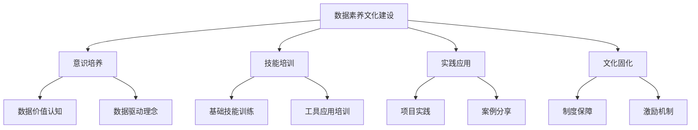

在数据驱动的时代，数据素养已成为每个职场人士必备的核心能力之一。数据素养不仅关乎个人能力提升，更是组织实现数字化转型和数据驱动决策的基础。本节将深入探讨数据素养的内涵、重要性以及如何在企业中建设数据素养文化。

## 数据素养的内涵与重要性

### 1.1 数据素养的定义

数据素养是指个人或组织有效地收集、分析、解释和应用数据以支持决策和解决问题的能力。它包括以下几个核心维度：

1. **数据意识**：认识到数据的价值和重要性
2. **数据技能**：掌握数据收集、处理、分析的基本技能
3. **数据思维**：运用数据进行思考和决策的思维方式
4. **数据伦理**：理解和遵守数据使用的道德规范

### 1.2 数据素养的重要性

#### 1.2.1 对个人的价值

1. **提升决策质量**：基于数据做出更准确的决策
2. **增强职场竞争力**：数据素养已成为现代职场的重要技能
3. **促进个人发展**：通过数据分析发现个人成长机会
4. **提高工作效率**：运用数据工具优化工作流程

#### 1.2.2 对组织的价值

1. **提升决策效率**：减少主观判断，提高决策的科学性
2. **优化业务流程**：通过数据分析发现流程优化点
3. **增强竞争优势**：更好地理解市场和客户，制定有效策略
4. **降低运营风险**：通过数据监控及时发现和预防风险

### 1.3 数据素养的现状与挑战

#### 1.3.1 现状分析

目前，大多数企业在数据素养方面面临以下现状：

1. **认知不足**：许多员工对数据的重要性认识不够
2. **技能缺乏**：缺乏数据分析和处理的基本技能
3. **工具不熟**：不熟悉数据分析工具的使用
4. **文化缺失**：缺乏数据驱动的组织文化

#### 1.3.2 主要挑战

1. **技能差距**：员工现有技能与数据驱动要求存在差距
2. **文化阻力**：传统经验驱动文化与数据驱动文化的冲突
3. **资源投入**：数据素养建设需要持续的资源投入
4. **效果评估**：数据素养建设效果难以量化评估

## 数据素养文化建设的框架

### 2.1 文化建设的目标

数据素养文化建设的目标是：

1. **全员参与**：让每个员工都具备基本的数据素养
2. **能力提升**：提升员工的数据分析和应用能力
3. **思维转变**：培养数据驱动的思维方式
4. **文化形成**：形成数据驱动的组织文化

### 2.2 文化建设的层次

#### 2.2.1 意识层面

1. **数据价值认知**：让员工认识到数据的价值和重要性
2. **数据驱动理念**：树立数据驱动决策的理念
3. **持续学习意识**：培养持续学习数据知识的意识

#### 2.2.2 技能层面

1. **基础技能**：掌握数据收集、处理、分析的基础技能
2. **工具应用**：熟练使用数据分析工具
3. **高级分析**：具备统计分析和预测分析能力

#### 2.2.3 应用层面

1. **决策支持**：能够运用数据支持日常工作决策
2. **问题解决**：能够运用数据分析解决工作中的问题
3. **创新推动**：能够运用数据发现创新机会

### 2.3 文化建设的路径



## 数据素养文化建设的具体措施

### 3.1 意识培养措施

#### 3.1.1 高层推动

1. **领导示范**：高层管理者率先垂范，使用数据进行决策
2. **战略宣贯**：将数据驱动纳入企业战略并广泛宣贯
3. **资源配置**：为数据素养建设提供必要的资源支持

#### 3.1.2 宣传推广

1. **主题活动**：定期举办数据素养主题活动
2. **案例分享**：分享数据驱动成功的案例
3. **内部宣传**：通过内部媒体宣传数据素养的重要性

#### 3.1.3 环境营造

1. **数据开放**：建立数据开放和共享机制
2. **透明决策**：提高决策过程的透明度，展示数据的作用
3. **学习氛围**：营造学习数据分析的良好氛围

### 3.2 技能培训措施

#### 3.2.1 分层培训体系

```yaml
# 数据素养分层培训体系
初级培训:
  - 目标人群: 全体员工
  - 培训内容: 
    - 数据基础概念
    - 常用指标理解
    - 基础图表解读
  - 培训方式: 在线课程 + 线下讲座

中级培训:
  - 目标人群: 管理人员、数据分析相关人员
  - 培训内容:
    - 数据分析方法
    - 常用分析工具使用
    - 数据可视化技巧
  - 培训方式: 专题培训 + 实操演练

高级培训:
  - 目标人群: 数据分析师、数据科学家
  - 培训内容:
    - 高级统计分析
    - 机器学习基础
    - 数据建模方法
  - 培训方式: 专业认证 + 项目实战
```

#### 3.2.2 培训内容设计

1. **基础理论**：数据概念、统计基础、概率论等
2. **工具技能**：Excel、SQL、Python、Tableau等工具使用
3. **分析方法**：描述性分析、诊断性分析、预测性分析等
4. **实践应用**：结合实际业务场景的案例分析

#### 3.2.3 培训方式创新

1. **在线学习**：建设在线学习平台，提供灵活学习方式
2. **微课程**：开发短小精悍的微课程，便于碎片化学习
3. **实战演练**：通过实际项目进行实战演练
4. **导师制度**：建立导师制度，提供个性化指导

### 3.3 实践应用措施

#### 3.3.1 项目驱动

1. **数据分析项目**：设立数据分析项目，让员工在实践中学习
2. **跨部门协作**：鼓励跨部门的数据分析协作项目
3. **创新竞赛**：举办数据分析创新竞赛，激发员工积极性

#### 3.3.2 工具支撑

1. **自助分析平台**：建设自助式数据分析平台，降低使用门槛
2. **模板库建设**：建立分析模板库，提供标准化分析方法
3. **最佳实践分享**：定期分享数据分析的最佳实践

#### 3.3.3 反馈机制

1. **成果展示**：定期展示数据分析成果
2. **经验交流**：组织数据分析经验交流会
3. **问题解决**：建立数据分析问题解决机制

### 3.4 文化固化措施

#### 3.4.1 制度保障

1. **数据治理制度**：建立完善的数据治理制度
2. **决策流程规范**：规范数据驱动的决策流程
3. **绩效考核机制**：将数据素养纳入绩效考核体系

#### 3.4.2 激励机制

1. **认证体系**：建立数据素养认证体系
2. **奖励制度**：设立数据分析创新奖励
3. **职业发展**：将数据素养作为职业发展的重要因素

#### 3.4.3 持续改进

1. **定期评估**：定期评估数据素养建设效果
2. **反馈收集**：收集员工对数据素养建设的反馈
3. **持续优化**：根据评估结果持续优化建设方案

## 实施案例

### 4.1 案例1：某互联网公司的数据素养文化建设

该公司通过以下措施成功建设了数据素养文化：

1. **高层推动**：
   - CEO亲自参与数据驱动决策
   - 将数据素养纳入公司战略
   - 设立专门的数据素养建设部门

2. **分层培训**：
   - 开发了完整的在线学习平台
   - 提供了从基础到高级的系列课程
   - 实施了导师制度，提供个性化指导

3. **实践应用**：
   - 设立了数据分析创新基金
   - 组织了跨部门的数据分析项目
   - 定期举办数据分析竞赛

4. **文化固化**：
   - 将数据素养纳入绩效考核
   - 建立了数据素养认证体系
   - 设立了年度数据分析奖

### 4.2 案例2：某制造企业的数据素养文化建设

该企业结合制造业特点，实施了以下措施：

1. **意识培养**：
   - 开展了"数据驱动制造"主题宣传活动
   - 分享了智能制造成功案例
   - 建立了生产数据可视化展示中心

2. **技能培训**：
   - 针对生产工人开展了设备数据分析培训
   - 为管理人员提供了质量管理数据分析培训
   - 为技术人员提供了工业大数据分析培训

3. **实践应用**：
   - 实施了基于数据的生产优化项目
   - 开展了质量改进数据分析项目
   - 建立了设备预测性维护分析体系

4. **文化固化**：
   - 将数据分析能力纳入岗位职责
   - 建立了数据分析成果分享机制
   - 设立了数据驱动改进奖

## 实施建议

### 5.1 实施原则

1. **循序渐进**：从基础做起，逐步提升数据素养水平
2. **全员参与**：确保所有员工都参与到数据素养建设中
3. **结合实际**：紧密结合企业实际业务需求
4. **持续改进**：建立持续改进的机制

### 5.2 实施步骤

1. **现状评估**：评估企业当前的数据素养水平
2. **规划制定**：制定数据素养建设规划
3. **试点实施**：选择部分部门或团队进行试点
4. **全面推广**：在试点成功基础上全面推广
5. **持续优化**：根据实施效果持续优化方案

### 5.3 关键成功因素

1. **高层支持**：获得高层管理者的支持和推动
2. **资源投入**：确保足够的资源投入
3. **激励机制**：建立有效的激励机制
4. **文化建设**：注重数据驱动文化的培育

## 总结

数据素养文化建设是一个系统性工程，需要从意识培养、技能培训、实践应用和文化固化等多个维度全面推进。通过建设数据素养文化，企业能够提升员工的数据分析能力，优化决策质量，增强竞争优势。

在下一章中，我们将探讨平台战略与顶层规划，包括现状评估、平台目标明确、技术选型和演进路线图等内容。