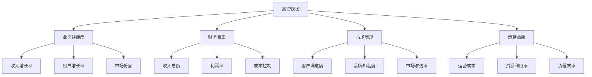

在企业级统一度量平台中，不同角色的用户对数据的需求和关注点存在显著差异。高管关注战略指标和业务全景，技术主管关注系统稳定性和技术效能，项目经理关注项目进度和资源分配，开发者关注代码质量和交付效率。因此，设计面向角色的视图成为提升数据使用价值的关键。本节将深入探讨如何为不同角色用户设计定制化的数据视图，满足其特定的信息需求。

## 角色视图设计的核心理念

### 1.1 用户角色分析

在设计角色视图之前，首先需要深入理解不同角色的职责和数据需求：

```yaml
用户角色分析:
  高管层:
    职责:
      - 制定企业战略
      - 监控业务表现
      - 做出重大决策
    数据需求:
      - 关键业务指标(KPI)
      - 趋势分析和预测
      - 对比分析(同比、环比)
      - 异常预警和风险提示
  技术管理层:
    职责:
      - 技术架构规划
      - 系统稳定性保障
      - 技术团队管理
    数据需求:
      - 系统性能指标
      - 可靠性指标
      - 技术效能度量
      - 资源利用率分析
  项目经理:
    职责:
      - 项目计划制定
      - 进度跟踪和控制
      - 资源协调和分配
    数据需求:
      - 项目进度指标
      - 资源使用情况
      - 风险和问题跟踪
      - 团队效能数据
  开发者:
    职责:
      - 代码开发和测试
      - 缺陷修复和优化
      - 技术方案实现
    数据需求:
      - 个人工作量统计
      - 代码质量指标
      - 交付效率数据
      - 学习和成长轨迹
```

### 1.2 视图设计原则

基于用户角色分析，制定视图设计的核心原则：

```yaml
视图设计原则:
  相关性原则:
    - 只展示与角色职责相关的信息
    - 突出显示关键指标
    - 隐藏无关或次要信息
  层次性原则:
    - 按重要性组织信息层次
    - 提供详细信息的下钻路径
    - 支持信息的逐步展开
  个性化原则:
    - 允许用户自定义视图布局
    - 支持个人偏好设置
    - 提供默认模板和自定义选项
  时效性原则:
    - 实时或近实时展示关键数据
    - 提供历史数据对比
    - 支持时间范围选择
```

## 高管层视图设计

### 2.1 关键指标展示

高管层关注的是企业整体的业务表现和战略执行情况，视图设计应突出关键业务指标：



### 2.2 战略洞察面板

```html
<!-- 高管战略洞察面板 -->
<div class="executive-dashboard">
    <div class="dashboard-header">
        <h1>企业战略执行仪表盘</h1>
        <div class="time-selector">
            <button class="time-btn active" data-range="30d">30天</button>
            <button class="time-btn" data-range="90d">90天</button>
            <button class="time-btn" data-range="1y">1年</button>
        </div>
    </div>
    
    <div class="kpi-summary">
        <div class="kpi-card">
            <div class="kpi-title">总收入</div>
            <div class="kpi-value">¥1.2B</div>
            <div class="kpi-trend positive">↑ 15.2%</div>
            <div class="kpi-desc">同比增长</div>
        </div>
        
        <div class="kpi-card">
            <div class="kpi-title">活跃用户数</div>
            <div class="kpi-value">2.5M</div>
            <div class="kpi-trend positive">↑ 8.7%</div>
            <div class="kpi-desc">月度增长</div>
        </div>
        
        <div class="kpi-card">
            <div class="kpi-title">客户满意度</div>
            <div class="kpi-value">4.7/5.0</div>
            <div class="kpi-trend negative">↓ 0.1</div>
            <div class="kpi-desc">本月下降</div>
        </div>
        
        <div class="kpi-card">
            <div class="kpi-title">运营利润率</div>
            <div class="kpi-value">22.5%</div>
            <div class="kpi-trend positive">↑ 2.3%</div>
            <div class="kpi-desc">环比提升</div>
        </div>
    </div>
    
    <div class="charts-section">
        <div class="chart-container">
            <h3>收入趋势分析</h3>
            <canvas id="revenue-trend-chart"></canvas>
        </div>
        
        <div class="chart-container">
            <h3>业务板块对比</h3>
            <canvas id="business-segment-chart"></canvas>
        </div>
    </div>
    
    <div class="alerts-section">
        <h3>关键预警</h3>
        <div class="alert-list">
            <div class="alert-item high">
                <span class="alert-icon">⚠️</span>
                <span class="alert-text">客户满意度连续两月下降</span>
                <span class="alert-time">2小时前</span>
            </div>
            <div class="alert-item medium">
                <span class="alert-icon">ℹ️</span>
                <span class="alert-text">新业务线收入占比达到15%</span>
                <span class="alert-time">1天前</span>
            </div>
        </div>
    </div>
</div>
```

### 2.3 决策支持功能

```java
@RestController
@RequestMapping("/api/v1/executive")
public class ExecutiveViewController {
    
    @Autowired
    private ExecutiveMetricsService metricsService;
    
    @Autowired
    private AlertService alertService;
    
    /**
     * 获取高管视图数据
     */
    @GetMapping("/dashboard")
    public ResponseEntity<ApiResponse<ExecutiveDashboardData>> getDashboardData(
            @RequestParam(required = false, defaultValue = "30d") String timeRange,
            @RequestParam(required = false) String businessUnit) {
        
        try {
            ExecutiveDashboardData dashboardData = new ExecutiveDashboardData();
            
            // 获取关键指标
            dashboardData.setKpiSummary(metricsService.getKpiSummary(timeRange, businessUnit));
            
            // 获取趋势数据
            dashboardData.setTrendData(metricsService.getTrendData(timeRange, businessUnit));
            
            // 获取对比分析
            dashboardData.setComparisonData(metricsService.getComparisonData(timeRange, businessUnit));
            
            // 获取预警信息
            dashboardData.setAlerts(alertService.getExecutiveAlerts(businessUnit));
            
            // 获取预测数据
            dashboardData.setForecastData(metricsService.getForecastData(timeRange, businessUnit));
            
            return ResponseEntity.ok(ApiResponse.success(dashboardData));
            
        } catch (Exception e) {
            log.error("获取高管视图数据失败", e);
            return ResponseEntity.internalServerError()
                .body(ApiResponse.error(500, "获取数据失败: " + e.getMessage()));
        }
    }
    
    /**
     * 获取战略指标详情
     */
    @GetMapping("/strategy-metrics/{metricId}")
    public ResponseEntity<ApiResponse<StrategyMetricDetail>> getStrategyMetricDetail(
            @PathVariable String metricId,
            @RequestParam(required = false, defaultValue = "30d") String timeRange) {
        
        StrategyMetricDetail detail = metricsService.getStrategyMetricDetail(metricId, timeRange);
        return ResponseEntity.ok(ApiResponse.success(detail));
    }
}
```

## 技术管理层视图设计

### 3.1 系统健康度监控

技术管理层关注系统的稳定性和性能表现，视图设计应突出系统健康度指标：

```yaml
系统健康度监控:
  可用性指标:
    - 系统可用率 (Availability)
    - 平均故障间隔时间 (MTBF)
    - 平均修复时间 (MTTR)
  性能指标:
    - 响应时间 (Response Time)
    - 吞吐量 (Throughput)
    - 错误率 (Error Rate)
  资源指标:
    - CPU使用率
    - 内存使用率
    - 磁盘使用率
    - 网络带宽使用率
```

### 3.2 技术效能度量

```typescript
class TechnicalManagementView {
    private metricsService: TechnicalMetricsService;
    private visualizationService: VisualizationService;
    
    constructor(metricsService: TechnicalMetricsService, visualizationService: VisualizationService) {
        this.metricsService = metricsService;
        this.visualizationService = visualizationService;
    }
    
    async renderSystemHealthView(container: HTMLElement, filters?: ViewFilters) {
        // 获取系统健康度数据
        const healthData = await this.metricsService.getSystemHealthData(filters);
        
        // 渲染健康度概览
        this.renderHealthOverview(container, healthData.overview);
        
        // 渲染详细指标
        this.renderDetailedMetrics(container, healthData.detailed);
        
        // 渲染趋势图表
        this.renderTrendCharts(container, healthData.trends);
        
        // 渲染预警信息
        this.renderAlerts(container, healthData.alerts);
    }
    
    private renderHealthOverview(container: HTMLElement, overview: SystemHealthOverview) {
        const overviewElement = document.createElement('div');
        overviewElement.className = 'system-health-overview';
        overviewElement.innerHTML = `
            <div class="health-score">
                <div class="score-value">${overview.healthScore}/100</div>
                <div class="score-label">系统健康度</div>
                <div class="score-status ${overview.status.toLowerCase()}">${overview.status}</div>
            </div>
            
            <div class="health-indicators">
                <div class="indicator">
                    <div class="indicator-name">可用性</div>
                    <div class="indicator-value">${overview.availability}%</div>
                    <div class="indicator-bar">
                        <div class="bar-fill" style="width: ${overview.availability}%"></div>
                    </div>
                </div>
                
                <div class="indicator">
                    <div class="indicator-name">性能</div>
                    <div class="indicator-value">${overview.performanceScore}/100</div>
                    <div class="indicator-bar">
                        <div class="bar-fill" style="width: ${overview.performanceScore}%"></div>
                    </div>
                </div>
                
                <div class="indicator">
                    <div class="indicator-name">稳定性</div>
                    <div class="indicator-value">${overview.stabilityScore}/100</div>
                    <div class="indicator-bar">
                        <div class="bar-fill" style="width: ${overview.stabilityScore}%"></div>
                    </div>
                </div>
            </div>
        `;
        
        container.appendChild(overviewElement);
    }
    
    private renderDetailedMetrics(container: HTMLElement, metrics: DetailedMetrics) {
        const metricsElement = document.createElement('div');
        metricsElement.className = 'detailed-metrics';
        metricsElement.innerHTML = `
            <h3>详细指标</h3>
            <div class="metrics-grid">
                <div class="metric-card">
                    <div class="metric-name">平均响应时间</div>
                    <div class="metric-value">${metrics.avgResponseTime}ms</div>
                    <div class="metric-trend ${metrics.responseTimeTrend}">${metrics.responseTimeChange}%</div>
                </div>
                
                <div class="metric-card">
                    <div class="metric-name">错误率</div>
                    <div class="metric-value">${metrics.errorRate}%</div>
                    <div class="metric-trend ${metrics.errorRateTrend}">${metrics.errorRateChange}%</div>
                </div>
                
                <div class="metric-card">
                    <div class="metric-name">吞吐量</div>
                    <div class="metric-value">${metrics.throughput} req/s</div>
                    <div class="metric-trend ${metrics.throughputTrend}">${metrics.throughputChange}%</div>
                </div>
                
                <div class="metric-card">
                    <div class="metric-name">MTBF</div>
                    <div class="metric-value">${metrics.mtbf} 小时</div>
                    <div class="metric-trend ${metrics.mtbfTrend}">${metrics.mtbfChange}%</div>
                </div>
            </div>
        `;
        
        container.appendChild(metricsElement);
    }
}
```

### 3.3 技术团队效能分析

```python
class TechnicalEfficiencyAnalyzer:
    def __init__(self, metrics_service):
        self.metrics_service = metrics_service
    
    def get_team_efficiency_report(self, team_id=None, time_range="30d"):
        """
        获取技术团队效能报告
        """
        report = {
            "team_id": team_id,
            "time_range": time_range,
            "efficiency_score": 0,
            "metrics": {},
            "insights": [],
            "recommendations": []
        }
        
        # 获取团队基础指标
        base_metrics = self.metrics_service.get_team_base_metrics(team_id, time_range)
        report["metrics"]["base"] = base_metrics
        
        # 计算效能得分
        report["efficiency_score"] = self.calculate_efficiency_score(base_metrics)
        
        # 获取研发效能指标
        dev_metrics = self.metrics_service.get_development_metrics(team_id, time_range)
        report["metrics"]["development"] = dev_metrics
        
        # 获取运维效能指标
        ops_metrics = self.metrics_service.get_operations_metrics(team_id, time_range)
        report["metrics"]["operations"] = ops_metrics
        
        # 生成洞察和建议
        report["insights"] = self.generate_insights(base_metrics, dev_metrics, ops_metrics)
        report["recommendations"] = self.generate_recommendations(report["insights"])
        
        return report
    
    def calculate_efficiency_score(self, metrics):
        """
        计算团队效能得分
        """
        # 权重定义
        weights = {
            "delivery_velocity": 0.3,      # 交付速度
            "quality_score": 0.25,         # 质量得分
            "stability_score": 0.25,       # 稳定性得分
            "innovation_score": 0.2        # 创新得分
        }
        
        # 计算各维度得分
        delivery_velocity = self.calculate_delivery_velocity(metrics)
        quality_score = self.calculate_quality_score(metrics)
        stability_score = self.calculate_stability_score(metrics)
        innovation_score = self.calculate_innovation_score(metrics)
        
        # 加权计算总分
        total_score = (
            delivery_velocity * weights["delivery_velocity"] +
            quality_score * weights["quality_score"] +
            stability_score * weights["stability_score"] +
            innovation_score * weights["innovation_score"]
        )
        
        return round(total_score, 2)
    
    def generate_insights(self, base_metrics, dev_metrics, ops_metrics):
        """
        生成效能洞察
        """
        insights = []
        
        # 交付速度洞察
        if base_metrics.get("delivery_frequency", 0) < 1.0:
            insights.append({
                "type": "warning",
                "category": "delivery",
                "message": "交付频率较低，建议优化开发流程",
                "priority": "high"
            })
        
        # 质量洞察
        if dev_metrics.get("defect_rate", 0) > 5.0:
            insights.append({
                "type": "warning",
                "category": "quality",
                "message": "缺陷率偏高，需要加强代码审查",
                "priority": "high"
            })
        
        # 稳定性洞察
        if ops_metrics.get("system_uptime", 0) < 99.5:
            insights.append({
                "type": "warning",
                "category": "stability",
                "message": "系统可用性未达标，需要优化稳定性",
                "priority": "high"
            })
        
        return insights
    
    def generate_recommendations(self, insights):
        """
        基于洞察生成建议
        """
        recommendations = []
        
        insight_categories = {}
        for insight in insights:
            category = insight["category"]
            if category not in insight_categories:
                insight_categories[category] = []
            insight_categories[category].append(insight)
        
        # 根据不同类别生成建议
        if "delivery" in insight_categories:
            recommendations.append({
                "category": "交付优化",
                "actions": [
                    "实施持续集成/持续部署(CI/CD)",
                    "优化代码审查流程",
                    "引入自动化测试"
                ]
            })
        
        if "quality" in insight_categories:
            recommendations.append({
                "category": "质量提升",
                "actions": [
                    "加强单元测试覆盖率",
                    "实施代码质量门禁",
                    "定期进行代码重构"
                ]
            })
        
        return recommendations
```

## 项目经理视图设计

### 4.1 项目进度跟踪

项目经理需要实时了解项目进度和资源使用情况，视图设计应突出项目管理相关指标：

```yaml
项目管理指标:
  进度指标:
    - 项目完成度百分比
    - 关键里程碑达成情况
    - 任务完成率
    - 延期任务数量
  资源指标:
    - 团队成员工作负载
    - 预算使用情况
    - 资源分配效率
  风险指标:
    - 项目风险数量和等级
    - 问题解决时效
    - 变更请求处理情况
```

### 4.2 项目组合视图

```go
type ProjectManagerView struct {
    projectService    *ProjectService
    resourceService   *ResourceService
    riskService       *RiskService
}

type ProjectPortfolioView struct {
    Projects     []ProjectSummary    `json:"projects"`
    Resources    ResourceSummary     `json:"resources"`
    Risks        []RiskSummary       `json:"risks"`
    Performance  PerformanceMetrics  `json:"performance"`
}

type ProjectSummary struct {
    ID              string    `json:"id"`
    Name            string    `json:"name"`
    Status          string    `json:"status"`
    Progress        float64   `json:"progress"`
    StartDate       time.Time `json:"start_date"`
    EndDate         time.Time `json:"end_date"`
    BudgetUsed      float64   `json:"budget_used"`
    BudgetTotal     float64   `json:"budget_total"`
    TeamSize        int       `json:"team_size"`
    HealthScore     int       `json:"health_score"`
    NextMilestone   string    `json:"next_milestone"`
    MilestoneDate   time.Time `json:"milestone_date"`
}

func (pmv *ProjectManagerView) GetProjectPortfolioView(userID string) (*ProjectPortfolioView, error) {
    view := &ProjectPortfolioView{}
    
    // 获取用户负责的项目列表
    projects, err := pmv.projectService.GetProjectsByManager(userID)
    if err != nil {
        return nil, fmt.Errorf("获取项目列表失败: %v", err)
    }
    
    // 构建项目摘要
    for _, project := range projects {
        summary := ProjectSummary{
            ID:           project.ID,
            Name:         project.Name,
            Status:       project.Status,
            Progress:     project.Progress,
            StartDate:    project.StartDate,
            EndDate:      project.EndDate,
            BudgetUsed:   project.BudgetUsed,
            BudgetTotal:  project.BudgetTotal,
            TeamSize:     len(project.TeamMembers),
            HealthScore:  pmv.calculateProjectHealth(project),
            NextMilestone: project.NextMilestone,
        }
        
        if project.NextMilestoneDate != nil {
            summary.MilestoneDate = *project.NextMilestoneDate
        }
        
        view.Projects = append(view.Projects, summary)
    }
    
    // 获取资源摘要
    resources, err := pmv.resourceService.GetResourceSummary(userID)
    if err != nil {
        return nil, fmt.Errorf("获取资源摘要失败: %v", err)
    }
    view.Resources = *resources
    
    // 获取风险摘要
    risks, err := pmv.riskService.GetProjectRisks(userID)
    if err != nil {
        return nil, fmt.Errorf("获取项目风险失败: %v", err)
    }
    view.Risks = risks
    
    // 计算绩效指标
    performance, err := pmv.calculatePerformanceMetrics(projects)
    if err != nil {
        return nil, fmt.Errorf("计算绩效指标失败: %v", err)
    }
    view.Performance = *performance
    
    return view, nil
}

func (pmv *ProjectManagerView) calculateProjectHealth(project *Project) int {
    score := 100
    
    // 进度偏差扣分
    if project.Progress < project.PlannedProgress {
        deviation := project.PlannedProgress - project.Progress
        score -= int(deviation * 20) // 每偏差1%扣20分
    }
    
    // 预算超支扣分
    if project.BudgetTotal > 0 {
        budgetUsage := project.BudgetUsed / project.BudgetTotal
        if budgetUsage > 1.0 {
            score -= int((budgetUsage - 1.0) * 30) // 超支每1%扣30分
        }
    }
    
    // 风险数量扣分
    riskCount := pmv.riskService.GetRiskCount(project.ID)
    score -= riskCount * 5 // 每个风险扣5分
    
    // 确保分数在0-100范围内
    if score < 0 {
        score = 0
    }
    if score > 100 {
        score = 100
    }
    
    return score
}
```

### 4.3 资源优化建议

```javascript
class ResourceOptimizer {
    constructor(resourceService, projectService) {
        this.resourceService = resourceService;
        this.projectService = projectService;
    }
    
    async getResourceOptimizationSuggestions(projectManagerId) {
        // 获取项目经理负责的所有项目
        const projects = await this.projectService.getProjectsByManager(projectManagerId);
        
        // 获取资源使用情况
        const resourceUsage = await this.resourceService.getResourceUsage(projects.map(p => p.id));
        
        // 分析资源瓶颈
        const bottlenecks = this.analyzeResourceBottlenecks(resourceUsage);
        
        // 生成优化建议
        const suggestions = this.generateOptimizationSuggestions(bottlenecks, resourceUsage);
        
        return {
            bottlenecks: bottlenecks,
            suggestions: suggestions,
            utilizationRate: this.calculateOverallUtilization(resourceUsage)
        };
    }
    
    analyzeResourceBottlenecks(resourceUsage) {
        const bottlenecks = [];
        
        // 分析人员瓶颈
        for (const [personId, usage] of Object.entries(resourceUsage.personnel)) {
            if (usage.utilization > 0.9) {
                bottlenecks.push({
                    type: 'personnel',
                    resourceId: personId,
                    resourceName: usage.name,
                    utilization: usage.utilization,
                    issue: '人员过载',
                    severity: 'high'
                });
            } else if (usage.utilization < 0.3) {
                bottlenecks.push({
                    type: 'personnel',
                    resourceId: personId,
                    resourceName: usage.name,
                    utilization: usage.utilization,
                    issue: '人员闲置',
                    severity: 'medium'
                });
            }
        }
        
        // 分析设备瓶颈
        for (const [equipmentId, usage] of Object.entries(resourceUsage.equipment)) {
            if (usage.utilization > 0.85) {
                bottlenecks.push({
                    type: 'equipment',
                    resourceId: equipmentId,
                    resourceName: usage.name,
                    utilization: usage.utilization,
                    issue: '设备过载',
                    severity: 'high'
                });
            }
        }
        
        return bottlenecks;
    }
    
    generateOptimizationSuggestions(bottlenecks, resourceUsage) {
        const suggestions = [];
        
        // 人员优化建议
        const overloadedPersonnel = bottlenecks.filter(b => b.type === 'personnel' && b.severity === 'high');
        if (overloadedPersonnel.length > 0) {
            suggestions.push({
                category: '人员调配',
                priority: 'high',
                actions: [
                    `重新分配${overloadedPersonnel.length}名过载人员的工作任务`,
                    '考虑临时增派人员支持',
                    '优化工作流程减少重复劳动'
                ]
            });
        }
        
        // 设备优化建议
        const overloadedEquipment = bottlenecks.filter(b => b.type === 'equipment' && b.severity === 'high');
        if (overloadedEquipment.length > 0) {
            suggestions.push({
                category: '设备优化',
                priority: 'medium',
                actions: [
                    `为${overloadedEquipment.length}台过载设备增加备用资源`,
                    '优化设备使用时间安排',
                    '考虑升级设备性能'
                ]
            });
        }
        
        // 资源平衡建议
        const overallUtilization = this.calculateOverallUtilization(resourceUsage);
        if (overallUtilization < 0.6) {
            suggestions.push({
                category: '资源平衡',
                priority: 'low',
                actions: [
                    '考虑将闲置资源调配到其他项目',
                    '优化资源分配策略',
                    '实施资源共享机制'
                ]
            });
        }
        
        return suggestions;
    }
    
    calculateOverallUtilization(resourceUsage) {
        let totalUtilization = 0;
        let totalCount = 0;
        
        // 计算人员平均利用率
        for (const usage of Object.values(resourceUsage.personnel)) {
            totalUtilization += usage.utilization;
            totalCount++;
        }
        
        // 计算设备平均利用率
        for (const usage of Object.values(resourceUsage.equipment)) {
            totalUtilization += usage.utilization;
            totalCount++;
        }
        
        return totalCount > 0 ? totalUtilization / totalCount : 0;
    }
}
```

## 开发者视图设计

### 5.1 个人效能仪表盘

开发者关注个人的工作效率和成长轨迹，视图设计应突出个人相关指标：

```yaml
开发者效能指标:
  交付指标:
    - 代码提交频率
    - 任务完成数量
    - PR合并时间
    - 代码审查参与度
  质量指标:
    - 代码缺陷率
    - 单元测试覆盖率
    - 代码复杂度
    - 技术债务比率
  学习成长:
    - 技能掌握度
    - 学习任务完成情况
    - 知识分享贡献
    - 技术影响力
```

### 5.2 开发工作流优化

```rust
use serde::{Deserialize, Serialize};
use std::collections::HashMap;

#[derive(Serialize, Deserialize, Debug)]
pub struct DeveloperDashboard {
    pub developer_id: String,
    pub name: String,
    pub team: String,
    pub metrics: DeveloperMetrics,
    pub insights: Vec<Insight>,
    pub recommendations: Vec<Recommendation>,
}

#[derive(Serialize, Deserialize, Debug)]
pub struct DeveloperMetrics {
    pub delivery: DeliveryMetrics,
    pub quality: QualityMetrics,
    pub collaboration: CollaborationMetrics,
    pub learning: LearningMetrics,
}

#[derive(Serialize, Deserialize, Debug)]
pub struct DeliveryMetrics {
    pub commits_count: u32,
    pub commits_frequency: f64, // 次/天
    pub tasks_completed: u32,
    pub prs_merged: u32,
    pub avg_merge_time: f64, // 小时
}

#[derive(Serialize, Deserialize, Debug)]
pub struct QualityMetrics {
    pub bug_rate: f64, // %
    pub test_coverage: f64, // %
    pub code_complexity: f64,
    pub technical_debt: f64, // 小时
}

#[derive(Serialize, Deserialize, Debug)]
pub struct CollaborationMetrics {
    pub prs_reviewed: u32,
    pub comments_made: u32,
    pub knowledge_shared: u32,
}

#[derive(Serialize, Deserialize, Debug)]
pub struct LearningMetrics {
    pub skills_progress: HashMap<String, f64>,
    pub learning_tasks: u32,
    pub learning_completion: f64, // %
}

#[derive(Serialize, Deserialize, Debug)]
pub struct Insight {
    pub category: String,
    pub message: String,
    pub priority: String,
    pub data: Option<serde_json::Value>,
}

#[derive(Serialize, Deserialize, Debug)]
pub struct Recommendation {
    pub category: String,
    pub actions: Vec<String>,
    pub impact: String,
}

pub struct DeveloperViewService {
    metrics_provider: Box<dyn MetricsProvider>,
    insight_generator: Box<dyn InsightGenerator>,
}

impl DeveloperViewService {
    pub fn new(
        metrics_provider: Box<dyn MetricsProvider>,
        insight_generator: Box<dyn InsightGenerator>,
    ) -> Self {
        Self {
            metrics_provider,
            insight_generator,
        }
    }
    
    pub async fn get_developer_dashboard(&self, developer_id: &str) -> Result<DeveloperDashboard, Box<dyn std::error::Error>> {
        // 获取开发者基本信息
        let developer_info = self.metrics_provider.get_developer_info(developer_id).await?;
        
        // 获取各项指标
        let delivery_metrics = self.metrics_provider.get_delivery_metrics(developer_id).await?;
        let quality_metrics = self.metrics_provider.get_quality_metrics(developer_id).await?;
        let collaboration_metrics = self.metrics_provider.get_collaboration_metrics(developer_id).await?;
        let learning_metrics = self.metrics_provider.get_learning_metrics(developer_id).await?;
        
        let metrics = DeveloperMetrics {
            delivery: delivery_metrics,
            quality: quality_metrics,
            collaboration: collaboration_metrics,
            learning: learning_metrics,
        };
        
        // 生成洞察和建议
        let insights = self.insight_generator.generate_insights(&metrics).await?;
        let recommendations = self.insight_generator.generate_recommendations(&insights).await?;
        
        Ok(DeveloperDashboard {
            developer_id: developer_id.to_string(),
            name: developer_info.name,
            team: developer_info.team,
            metrics,
            insights,
            recommendations,
        })
    }
}

#[async_trait::async_trait]
pub trait MetricsProvider {
    async fn get_developer_info(&self, developer_id: &str) -> Result<DeveloperInfo, Box<dyn std::error::Error>>;
    async fn get_delivery_metrics(&self, developer_id: &str) -> Result<DeliveryMetrics, Box<dyn std::error::Error>>;
    async fn get_quality_metrics(&self, developer_id: &str) -> Result<QualityMetrics, Box<dyn std::error::Error>>;
    async fn get_collaboration_metrics(&self, developer_id: &str) -> Result<CollaborationMetrics, Box<dyn std::error::Error>>;
    async fn get_learning_metrics(&self, developer_id: &str) -> Result<LearningMetrics, Box<dyn std::error::Error>>;
}

#[async_trait::async_trait]
pub trait InsightGenerator {
    async fn generate_insights(&self, metrics: &DeveloperMetrics) -> Result<Vec<Insight>, Box<dyn std::error::Error>>;
    async fn generate_recommendations(&self, insights: &[Insight]) -> Result<Vec<Recommendation>, Box<dyn std::error::Error>>;
}
```

### 5.3 技能成长路径

```sql
-- 开发者技能成长追踪
CREATE TABLE developer_skills (
    id BIGSERIAL PRIMARY KEY,
    developer_id VARCHAR(64) NOT NULL,
    skill_name VARCHAR(100) NOT NULL,
    current_level INTEGER NOT NULL, -- 1-5级
    target_level INTEGER NOT NULL,
    progress_percentage DECIMAL(5,2) NOT NULL,
    last_assessment_date TIMESTAMP,
    next_assessment_date TIMESTAMP,
    learning_resources JSONB,
    created_at TIMESTAMP DEFAULT CURRENT_TIMESTAMP,
    updated_at TIMESTAMP DEFAULT CURRENT_TIMESTAMP
);

-- 技能评估记录
CREATE TABLE skill_assessments (
    id BIGSERIAL PRIMARY KEY,
    developer_id VARCHAR(64) NOT NULL,
    skill_name VARCHAR(100) NOT NULL,
    assessment_date TIMESTAMP NOT NULL,
    assessor_id VARCHAR(64),
    score INTEGER NOT NULL, -- 1-100分
    feedback TEXT,
    evidence TEXT, -- 技能证明材料
    created_at TIMESTAMP DEFAULT CURRENT_TIMESTAMP
);

-- 学习任务跟踪
CREATE TABLE learning_tasks (
    id BIGSERIAL PRIMARY KEY,
    developer_id VARCHAR(64) NOT NULL,
    task_name VARCHAR(200) NOT NULL,
    description TEXT,
    skill_name VARCHAR(100) NOT NULL,
    estimated_hours DECIMAL(6,2),
    actual_hours DECIMAL(6,2),
    status VARCHAR(20) NOT NULL, -- pending, in_progress, completed, cancelled
    due_date TIMESTAMP,
    completion_date TIMESTAMP,
    created_at TIMESTAMP DEFAULT CURRENT_TIMESTAMP,
    updated_at TIMESTAMP DEFAULT CURRENT_TIMESTAMP
);

-- 获取开发者技能成长报告
SELECT 
    ds.skill_name,
    ds.current_level,
    ds.target_level,
    ds.progress_percentage,
    COUNT(lt.id) as completed_learning_tasks,
    AVG(sa.score) as average_assessment_score,
    ds.next_assessment_date
FROM developer_skills ds
LEFT JOIN learning_tasks lt ON ds.developer_id = lt.developer_id 
    AND ds.skill_name = lt.skill_name 
    AND lt.status = 'completed'
LEFT JOIN skill_assessments sa ON ds.developer_id = sa.developer_id 
    AND ds.skill_name = sa.skill_name
WHERE ds.developer_id = 'dev_12345'
GROUP BY ds.skill_name, ds.current_level, ds.target_level, 
         ds.progress_percentage, ds.next_assessment_date
ORDER BY ds.progress_percentage DESC;
```

## 角色视图的实现机制

### 6.1 权限与数据隔离

```java
@Component
public class RoleBasedViewService {
    
    @Autowired
    private UserService userService;
    
    @Autowired
    private DataPermissionService dataPermissionService;
    
    @Autowired
    private ViewTemplateService viewTemplateService;
    
    /**
     * 获取用户角色视图
     */
    public RoleViewData getRoleViewData(String userId, String viewType) {
        // 获取用户信息和角色
        User user = userService.getUserById(userId);
        UserRole userRole = user.getRole();
        
        // 验证视图访问权限
        if (!hasViewAccess(userRole, viewType)) {
            throw new PermissionDeniedException("无权限访问此视图");
        }
        
        // 获取数据权限
        DataPermission dataPermission = dataPermissionService.getUserDataPermission(userId);
        
        // 根据角色获取视图模板
        ViewTemplate template = viewTemplateService.getViewTemplate(userRole, viewType);
        
        // 获取视图数据
        RoleViewData viewData = new RoleViewData();
        viewData.setUserId(userId);
        viewData.setRole(userRole);
        viewData.setViewType(viewType);
        viewData.setTemplate(template);
        
        // 根据数据权限过滤数据
        viewData.setData(filterDataByPermission(template.getDataSources(), dataPermission));
        
        return viewData;
    }
    
    /**
     * 检查视图访问权限
     */
    private boolean hasViewAccess(UserRole userRole, String viewType) {
        // 定义角色视图访问权限
        Map<UserRole, Set<String>> roleViewPermissions = Map.of(
            UserRole.EXECUTIVE, Set.of("executive", "business", "financial"),
            UserRole.TECH_LEAD, Set.of("technical", "system", "team"),
            UserRole.PROJECT_MANAGER, Set.of("project", "resource", "schedule"),
            UserRole.DEVELOPER, Set.of("personal", "delivery", "quality")
        );
        
        Set<String> allowedViews = roleViewPermissions.getOrDefault(userRole, Set.of());
        return allowedViews.contains(viewType);
    }
    
    /**
     * 根据数据权限过滤数据
     */
    private Map<String, Object> filterDataByPermission(
            List<DataSource> dataSources, 
            DataPermission dataPermission) {
        
        Map<String, Object> filteredData = new HashMap<>();
        
        for (DataSource dataSource : dataSources) {
            // 检查数据源访问权限
            if (dataPermissionService.hasDataSourceAccess(dataPermission, dataSource.getId())) {
                // 应用数据过滤条件
                Object data = dataSource.fetchData(dataPermission.getFilters());
                filteredData.put(dataSource.getId(), data);
            }
        }
        
        return filteredData;
    }
}
```

### 6.2 视图模板管理

```python
class ViewTemplateManager:
    def __init__(self, template_repository):
        self.template_repository = template_repository
        self.template_cache = {}
    
    def get_view_template(self, user_role, view_type):
        """
        获取视图模板
        """
        cache_key = f"{user_role}_{view_type}"
        
        # 检查缓存
        if cache_key in self.template_cache:
            return self.template_cache[cache_key]
        
        # 从存储中获取模板
        template = self.template_repository.get_template(user_role, view_type)
        if not template:
            # 使用默认模板
            template = self.get_default_template(user_role, view_type)
        
        # 缓存模板
        self.template_cache[cache_key] = template
        
        return template
    
    def get_default_template(self, user_role, view_type):
        """
        获取默认视图模板
        """
        templates = {
            "EXECUTIVE": {
                "dashboard": {
                    "layout": "grid",
                    "components": [
                        {
                            "type": "kpi_summary",
                            "position": {"x": 0, "y": 0, "width": 12, "height": 2},
                            "config": {
                                "metrics": ["revenue", "users", "satisfaction", "profit_margin"]
                            }
                        },
                        {
                            "type": "trend_chart",
                            "position": {"x": 0, "y": 2, "width": 8, "height": 4},
                            "config": {
                                "metric": "revenue_trend",
                                "time_range": "1y"
                            }
                        },
                        {
                            "type": "alert_list",
                            "position": {"x": 8, "y": 2, "width": 4, "height": 4},
                            "config": {
                                "severity": ["high", "medium"]
                            }
                        }
                    ]
                }
            },
            "TECH_LEAD": {
                "dashboard": {
                    "layout": "grid",
                    "components": [
                        {
                            "type": "health_score",
                            "position": {"x": 0, "y": 0, "width": 4, "height": 2},
                            "config": {
                                "metrics": ["availability", "performance", "stability"]
                            }
                        },
                        {
                            "type": "team_efficiency",
                            "position": {"x": 4, "y": 0, "width": 8, "height": 2},
                            "config": {
                                "metrics": ["delivery_velocity", "quality_score", "innovation_score"]
                            }
                        },
                        {
                            "type": "system_metrics",
                            "position": {"x": 0, "y": 2, "width": 12, "height": 3},
                            "config": {
                                "charts": ["response_time", "error_rate", "throughput"]
                            }
                        }
                    ]
                }
            }
        }
        
        return templates.get(user_role, {}).get(view_type, self.get_fallback_template())
    
    def customize_template(self, user_id, template_id, customizations):
        """
        自定义视图模板
        """
        # 获取原始模板
        original_template = self.template_repository.get_by_id(template_id)
        
        # 应用自定义配置
        customized_template = self.apply_customizations(original_template, customizations)
        
        # 保存自定义模板
        customized_template_id = self.template_repository.save_customized(
            user_id, template_id, customized_template)
        
        # 更新缓存
        cache_key = f"custom_{user_id}_{template_id}"
        self.template_cache[cache_key] = customized_template
        
        return customized_template_id
```

## 实施案例与最佳实践

### 7.1 案例1：某科技公司的多角色视图平台

该公司为不同角色用户设计了专门的视图：

1. **高管视图**：
   - 突出显示KPI指标和业务趋势
   - 提供战略决策支持信息
   - 实现移动端适配

2. **技术主管视图**：
   - 集中展示系统健康度和团队效能
   - 提供技术债务和创新指标
   - 支持下钻到具体系统详情

3. **项目经理视图**：
   - 项目进度和资源使用一目了然
   - 提供风险预警和优化建议
   - 支持项目组合管理

4. **开发者视图**：
   - 个人效能和技能成长轨迹
   - 提供即时反馈和改进建议
   - 集成学习资源推荐

### 7.2 案例2：某金融机构的风险管理视图

该机构为风险管理团队设计了专业视图：

1. **风险总监视图**：
   - 全局风险态势感知
   - 关键风险指标监控
   - 监管报告自动生成

2. **风险分析师视图**：
   - 详细风险数据展示
   - 风险模型执行结果
   - 异常交易预警

3. **合规专员视图**：
   - 合规检查项跟踪
   - 违规事件记录
   - 整改措施追踪

### 7.3 最佳实践总结

基于多个实施案例，总结出以下最佳实践：

```yaml
最佳实践:
  用户研究:
    - 深入了解不同角色的工作流程
    - 识别关键信息需求和使用场景
    - 定期收集用户反馈并迭代优化
  模板设计:
    - 提供高质量的默认模板
    - 支持灵活的自定义配置
    - 实现模板的版本管理和共享
  数据安全:
    - 实施严格的数据权限控制
    - 确保敏感信息的适当脱敏
    - 建立完整的审计日志机制
  性能优化:
    - 针对不同角色优化数据加载
    - 实施智能缓存策略
    - 提供离线访问能力
```

## 实施建议与注意事项

### 8.1 实施建议

1. **用户参与**：
   - 邀请各角色用户参与设计过程
   - 建立用户反馈机制
   - 定期进行用户满意度调研

2. **渐进式实施**：
   - 从核心角色开始实施
   - 逐步扩展到更多角色
   - 边实施边优化体验

3. **技术架构**：
   - 采用微服务架构支持灵活扩展
   - 实现统一的数据权限控制
   - 建立可复用的组件库

### 8.2 注意事项

1. **数据一致性**：
   - 确保不同视图间数据的一致性
   - 建立数据血缘追踪机制
   - 实施数据质量监控

2. **权限管理**：
   - 实施最小权限原则
   - 定期审查权限配置
   - 建立权限申请审批流程

3. **用户体验**：
   - 关注不同角色的使用习惯
   - 提供个性化配置选项
   - 确保界面的一致性和易用性

## 总结

面向角色的视图设计是企业级统一度量平台成功的关键因素之一。通过深入理解不同角色用户的需求，设计定制化的数据视图，可以显著提升数据的使用价值和用户体验。在实施过程中，需要关注以下几个关键点：

1. **用户研究**：深入了解不同角色的工作流程和信息需求
2. **模板设计**：提供高质量的默认模板和灵活的自定义能力
3. **权限控制**：实施严格的数据权限管理确保信息安全
4. **性能优化**：针对不同角色优化数据加载和展示性能
5. **持续改进**：建立用户反馈机制，持续优化视图设计

通过系统性的方法和最佳实践，可以构建出满足不同角色需求的高效数据视图系统，为企业的数据驱动决策提供强有力的支持。在下一节中，我们将探讨下钻与切片分析功能，帮助用户从宏观趋势深入到微观细节。