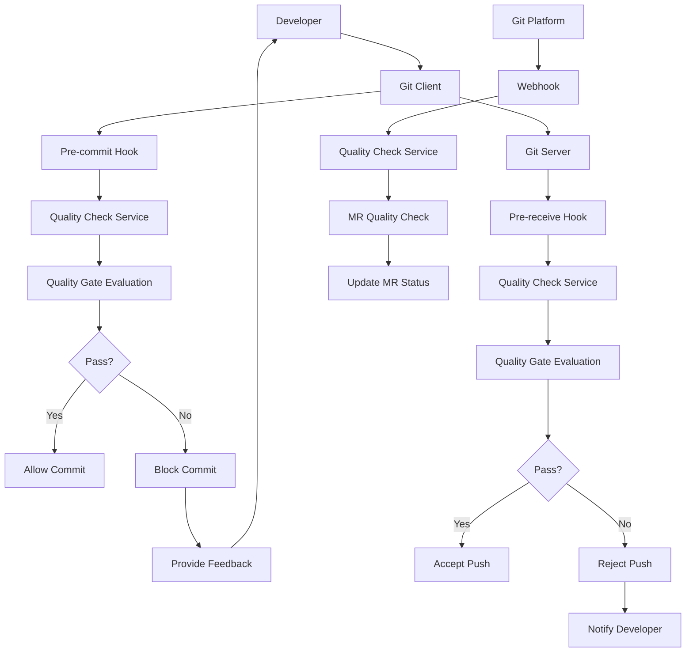

在现代软件开发流程中，Git作为版本控制系统的核心，与质量门禁的深度集成是确保代码质量的关键环节。通过在Commit和Merge Request阶段实施质量检查，可以在代码进入主分支之前及时发现并阻止质量问题。本章将深入探讨如何实现与Git的深度集成，包括Commit Check和Merge Request Check的具体实现方法。

## Git集成的架构设计

### 1. 集成点分析

Git集成主要涉及以下几个关键点：

#### 客户端集成点
- **pre-commit hook**：在代码提交前进行质量检查
- **commit-msg hook**：检查提交信息格式
- **pre-push hook**：在代码推送前进行检查

#### 服务端集成点
- **pre-receive hook**：在代码接收前进行检查
- **post-receive hook**：在代码接收后进行通知
- **Merge Request Hook**：在合并请求时进行检查

#### API集成点
- **Git平台API**：与GitHub、GitLab等平台集成
- **Webhook**：接收Git平台事件通知
- **Status API**：更新提交状态

### 2. 集成架构设计



## Commit Check机制实现

### 1. 客户端Hook实现

在开发者本地环境实现Commit Check，提供即时反馈。

#### pre-commit Hook实现
```bash
#!/bin/bash
# pre-commit hook实现

echo "Running pre-commit quality checks..."

# 获取将要提交的文件
STAGED_FILES=$(git diff --cached --name-only --diff-filter=ACMR)

if [ -z "$STAGED_FILES" ]; then
    echo "No files to check."
    exit 0
fi

# 运行代码静态分析
echo "Running static code analysis..."
mvn sonar:sonar -DskipTests=true -Dsonar.analysis.mode=preview

if [ $? -ne 0 ]; then
    echo "❌ Static code analysis failed. Please fix the issues before committing."
    exit 1
fi

# 检查代码格式
echo "Checking code formatting..."
./gradlew spotlessCheck

if [ $? -ne 0 ]; then
    echo "❌ Code formatting check failed. Please run './gradlew spotlessApply' to fix."
    exit 1
fi

# 检查提交信息格式
echo "Checking commit message format..."
COMMIT_MSG=$(git log --format=%B -n 1 HEAD)
if ! echo "$COMMIT_MSG" | grep -qE "^(feat|fix|docs|style|refactor|test|chore): .+"; then
    echo "❌ Commit message format invalid. Please use conventional commit format."
    echo "Example: feat: add user authentication"
    exit 1
fi

echo "✅ All pre-commit checks passed."
exit 0
```

#### commit-msg Hook实现
```bash
#!/bin/bash
# commit-msg hook实现

COMMIT_MSG_FILE=$1
COMMIT_MSG=$(cat $COMMIT_MSG_FILE)

# 检查提交信息长度
if [ ${#COMMIT_MSG} -gt 72 ]; then
    echo "❌ Commit message too long. Please keep it under 72 characters."
    exit 1
fi

# 检查提交信息格式
if ! echo "$COMMIT_MSG" | grep -qE "^(feat|fix|docs|style|refactor|test|chore)(\(.+\))?: .+"; then
    echo "❌ Invalid commit message format."
    echo "Please use conventional commits format:"
    echo "  feat: add new feature"
    echo "  fix: fix a bug"
    echo "  docs: update documentation"
    exit 1
fi

# 检查是否包含敏感信息
if echo "$COMMIT_MSG" | grep -qiE "(password|secret|key|token)"; then
    echo "❌ Commit message contains sensitive information."
    exit 1
fi

echo "✅ Commit message format valid."
exit 0
```

### 2. 服务端Hook实现

在Git服务器端实现更全面的检查机制。

#### pre-receive Hook实现
```bash
#!/bin/bash
# pre-receive hook实现

# 读取输入参数
while read oldrev newrev refname; do
    # 获取分支名称
    branch=$(echo $refname | sed 's/refs\/heads\///')
    
    # 只对主分支进行严格检查
    if [ "$branch" = "main" ] || [ "$branch" = "master" ]; then
        echo "Running quality checks for branch: $branch"
        
        # 调用质量检查服务
        RESPONSE=$(curl -s -X POST \
            -H "Content-Type: application/json" \
            -H "Authorization: Bearer ${QUALITY_GATE_TOKEN}" \
            -d "{\"oldRev\":\"$oldrev\",\"newRev\":\"$newrev\",\"refName\":\"$refname\"}" \
            http://quality-gate-service:8080/api/v1/git-hooks/pre-receive)
        
        # 解析响应
        STATUS=$(echo $RESPONSE | jq -r '.status')
        MESSAGE=$(echo $RESPONSE | jq -r '.message')
        
        if [ "$STATUS" = "FAILED" ]; then
            echo "❌ Quality gate failed: $MESSAGE"
            exit 1
        fi
        
        echo "✅ Quality gate passed: $MESSAGE"
    fi
done

exit 0
```

#### 服务端检查服务实现
```java
// Git服务端检查服务
@RestController
@RequestMapping("/api/v1/git-hooks")
public class GitHookController {
    
    @Autowired
    private QualityGateService qualityGateService;
    
    @Autowired
    private GitService gitService;
    
    @PostMapping("/pre-receive")
    public ResponseEntity<GitHookResponse> preReceiveHook(
            @RequestBody PreReceiveHookRequest request) {
        try {
            // 解析推送的变更
            List<ChangedFile> changedFiles = gitService.getChangedFiles(
                request.getOldRev(), request.getNewRev());
            
            // 运行质量门禁检查
            QualityGateResult result = qualityGateService.evaluatePreReceive(
                changedFiles, request.getRefName());
            
            // 构建响应
            GitHookResponse response = GitHookResponse.builder()
                .status(result.getStatus() == QualityGateStatus.FAILED ? "FAILED" : "PASSED")
                .message(result.getMessage())
                .details(result.getDetails())
                .build();
            
            if (result.getStatus() == QualityGateStatus.FAILED) {
                return ResponseEntity.status(HttpStatus.FORBIDDEN).body(response);
            }
            
            return ResponseEntity.ok(response);
            
        } catch (Exception e) {
            log.error("Error processing pre-receive hook", e);
            return ResponseEntity.status(HttpStatus.INTERNAL_SERVER_ERROR)
                .body(GitHookResponse.builder()
                    .status("ERROR")
                    .message("Internal server error: " + e.getMessage())
                    .build());
        }
    }
}
```

## Merge Request Check机制实现

### 1. Git平台集成

与主流Git平台（GitHub、GitLab等）集成，实现MR级别的质量检查。

#### GitLab集成实现
```java
// GitLab MR检查服务
@Service
public class GitLabMergeRequestChecker {
    
    @Autowired
    private GitLabApiClient gitLabClient;
    
    @Autowired
    private QualityGateService qualityGateService;
    
    @EventListener
    public void handleMergeRequestEvent(GitLabWebhookEvent event) {
        if (event.getObjectKind().equals("merge_request")) {
            processMergeRequestEvent(event);
        }
    }
    
    private void processMergeRequestEvent(GitLabWebhookEvent event) {
        try {
            String projectId = event.getProject().getId();
            String mergeRequestId = event.getObjectAttributes().getIid();
            
            // 获取MR信息
            MergeRequest mr = gitLabClient.getMergeRequest(projectId, mergeRequestId);
            
            // 更新MR状态为检查中
            updateMergeRequestStatus(projectId, mergeRequestId, "running", 
                                   "Running quality checks...");
            
            // 获取变更的文件
            List<ChangedFile> changedFiles = gitLabClient.getChangedFiles(
                projectId, mr.getDiffRefs().getBaseSha(), mr.getDiffRefs().getHeadSha());
            
            // 运行质量门禁检查
            QualityGateResult result = qualityGateService.evaluateMergeRequest(
                projectId, mr, changedFiles);
            
            // 更新MR状态
            updateMergeRequestStatus(projectId, mergeRequestId, result);
            
            // 添加评论
            addQualityGateComment(projectId, mergeRequestId, result);
            
        } catch (Exception e) {
            log.error("Error processing merge request event", e);
            // 更新MR状态为错误
            updateMergeRequestStatus(event.getProject().getId(), 
                                   event.getObjectAttributes().getIid(), 
                                   "failed", "Error processing quality checks");
        }
    }
    
    private void updateMergeRequestStatus(String projectId, String mergeRequestId, 
                                       QualityGateResult result) {
        String state = convertToGitLabState(result.getStatus());
        String description = result.getMessage();
        
        gitLabClient.updateMergeRequestStatus(projectId, mergeRequestId, 
                                            state, description);
    }
    
    private void addQualityGateComment(String projectId, String mergeRequestId, 
                                     QualityGateResult result) {
        String comment = generateQualityGateComment(result);
        gitLabClient.addMergeRequestComment(projectId, mergeRequestId, comment);
    }
    
    private String generateQualityGateComment(QualityGateResult result) {
        StringBuilder comment = new StringBuilder();
        comment.append("## Quality Gate Results\n\n");
        
        switch (result.getStatus()) {
            case PASSED:
                comment.append("✅ **PASSED** - All quality checks passed\n\n");
                break;
            case PASSED_WITH_WARNINGS:
                comment.append("⚠️ **PASSED WITH WARNINGS** - Some warnings detected\n\n");
                break;
            case FAILED:
                comment.append("❌ **FAILED** - Quality gate failed\n\n");
                break;
        }
        
        if (result.getScoreDetails() != null && !result.getScoreDetails().isEmpty()) {
            comment.append("### Score Details\n\n");
            comment.append("| Metric | Score | Weight |\n");
            comment.append("|--------|-------|--------|\n");
            
            for (ScoreDetail detail : result.getScoreDetails()) {
                comment.append(String.format("| %s | %d | %d |\n", 
                    detail.getMetric(), detail.getScore(), detail.getWeight()));
            }
            
            comment.append(String.format("\n**Total Score: %d/%d**\n\n", 
                result.getCurrentScore(), result.getMaxScore()));
        }
        
        if (result.getFailedConditions() != null && !result.getFailedConditions().isEmpty()) {
            comment.append("### Failed Conditions\n\n");
            for (String condition : result.getFailedConditions()) {
                comment.append("- ❌ ").append(condition).append("\n");
            }
            comment.append("\n");
        }
        
        if (result.getWarnings() != null && !result.getWarnings().isEmpty()) {
            comment.append("### Warnings\n\n");
            for (String warning : result.getWarnings()) {
                comment.append("- ⚠️ ").append(warning).append("\n");
            }
            comment.append("\n");
        }
        
        return comment.toString();
    }
}
```

### 2. GitHub集成实现

```java
// GitHub PR检查服务
@Service
public class GitHubPullRequestChecker {
    
    @Autowired
    private GitHubApiClient gitHubClient;
    
    @Autowired
    private QualityGateService qualityGateService;
    
    @EventListener
    public void handlePullRequestEvent(GitHubWebhookEvent event) {
        if (event.getAction().equals("opened") || event.getAction().equals("synchronize")) {
            processPullRequestEvent(event);
        }
    }
    
    private void processPullRequestEvent(GitHubWebhookEvent event) {
        try {
            String owner = event.getRepository().getOwner().getLogin();
            String repo = event.getRepository().getName();
            int pullNumber = event.getPullRequest().getNumber();
            
            // 创建检查运行
            String checkRunId = gitHubClient.createCheckRun(owner, repo, 
                CheckRunRequest.builder()
                    .name("Quality Gate")
                    .headSha(event.getPullRequest().getHead().getSha())
                    .status("in_progress")
                    .startedAt(Instant.now())
                    .build());
            
            // 获取变更的文件
            List<ChangedFile> changedFiles = gitHubClient.getChangedFiles(
                owner, repo, pullNumber);
            
            // 运行质量门禁检查
            QualityGateResult result = qualityGateService.evaluatePullRequest(
                owner + "/" + repo, event.getPullRequest(), changedFiles);
            
            // 更新检查运行状态
            updateCheckRunStatus(owner, repo, checkRunId, result);
            
        } catch (Exception e) {
            log.error("Error processing pull request event", e);
        }
    }
    
    private void updateCheckRunStatus(String owner, String repo, String checkRunId, 
                                   QualityGateResult result) {
        CheckRunUpdateRequest updateRequest = CheckRunUpdateRequest.builder()
            .status("completed")
            .conclusion(convertToGitHubConclusion(result.getStatus()))
            .completedAt(Instant.now())
            .output(CheckRunOutput.builder()
                .title("Quality Gate Results")
                .summary(generateSummary(result))
                .text(generateDetailedText(result))
                .build())
            .build();
        
        gitHubClient.updateCheckRun(owner, repo, checkRunId, updateRequest);
    }
    
    private String generateSummary(QualityGateResult result) {
        switch (result.getStatus()) {
            case PASSED:
                return "✅ All quality checks passed";
            case PASSED_WITH_WARNINGS:
                return "⚠️ Quality checks passed with warnings";
            case FAILED:
                return "❌ Quality gate failed";
            default:
                return "Quality gate completed";
        }
    }
    
    private String generateDetailedText(QualityGateResult result) {
        StringBuilder text = new StringBuilder();
        
        if (result.getCurrentScore() > 0) {
            text.append(String.format("## Score: %d/%d\n\n", 
                result.getCurrentScore(), result.getMaxScore()));
        }
        
        if (result.getFailedConditions() != null && !result.getFailedConditions().isEmpty()) {
            text.append("### ❌ Failed Conditions\n");
            for (String condition : result.getFailedConditions()) {
                text.append("- ").append(condition).append("\n");
            }
            text.append("\n");
        }
        
        if (result.getWarnings() != null && !result.getWarnings().isEmpty()) {
            text.append("### ⚠️ Warnings\n");
            for (String warning : result.getWarnings()) {
                text.append("- ").append(warning).append("\n");
            }
            text.append("\n");
        }
        
        return text.toString();
    }
}
```

## 差异化检查实现

### 1. 增量检查

只对变更的代码进行检查，提高检查效率。

#### 增量检查实现
```java
// 增量检查服务
@Service
public class IncrementalCheckService {
    
    @Autowired
    private GitService gitService;
    
    @Autowired
    private CodeAnalysisService codeAnalysisService;
    
    public QualityGateResult performIncrementalCheck(String projectId, 
                                                  String baseSha, 
                                                  String headSha) {
        // 获取变更的文件
        List<ChangedFile> changedFiles = gitService.getChangedFiles(baseSha, headSha);
        
        // 过滤出需要检查的文件
        List<ChangedFile> filesToCheck = filterFilesToCheck(changedFiles);
        
        if (filesToCheck.isEmpty()) {
            return QualityGateResult.builder()
                .status(QualityGateStatus.PASSED)
                .message("No files to check")
                .build();
        }
        
        // 只分析变更的代码行
        List<CodeChange> codeChanges = extractCodeChanges(filesToCheck);
        
        // 运行增量分析
        IncrementalAnalysisResult analysisResult = codeAnalysisService
            .performIncrementalAnalysis(codeChanges);
        
        // 评估质量门禁
        return evaluateQualityGate(analysisResult);
    }
    
    private List<ChangedFile> filterFilesToCheck(List<ChangedFile> changedFiles) {
        return changedFiles.stream()
            .filter(file -> file.getStatus() != FileStatus.DELETED)
            .filter(file -> isSupportedFileType(file.getFilename()))
            .filter(file -> !isExcludedFile(file.getFilename()))
            .collect(Collectors.toList());
    }
    
    private boolean isSupportedFileType(String filename) {
        return filename.endsWith(".java") || 
               filename.endsWith(".js") || 
               filename.endsWith(".py") || 
               filename.endsWith(".go");
    }
    
    private boolean isExcludedFile(String filename) {
        return filename.contains("/test/") || 
               filename.contains("/node_modules/") || 
               filename.endsWith(".md") || 
               filename.endsWith(".txt");
    }
    
    private List<CodeChange> extractCodeChanges(List<ChangedFile> files) {
        List<CodeChange> changes = new ArrayList<>();
        
        for (ChangedFile file : files) {
            List<CodeChange> fileChanges = extractChangesFromFile(file);
            changes.addAll(fileChanges);
        }
        
        return changes;
    }
}
```

### 2. 并行检查

对多个文件并行进行检查，提高检查效率。

#### 并行检查实现
```java
// 并行检查服务
@Service
public class ParallelCheckService {
    
    @Autowired
    private CodeAnalysisService codeAnalysisService;
    
    public QualityGateResult performParallelCheck(List<ChangedFile> files) {
        // 创建线程池
        ExecutorService executor = Executors.newFixedThreadPool(10);
        
        // 提交检查任务
        List<Future<AnalysisResult>> futures = new ArrayList<>();
        
        for (ChangedFile file : files) {
            Future<AnalysisResult> future = executor.submit(() -> {
                return codeAnalysisService.analyzeFile(file);
            });
            futures.add(future);
        }
        
        // 收集检查结果
        List<AnalysisResult> results = new ArrayList<>();
        
        for (Future<AnalysisResult> future : futures) {
            try {
                AnalysisResult result = future.get(30, TimeUnit.SECONDS);
                results.add(result);
            } catch (TimeoutException e) {
                log.warn("Analysis timeout for file");
            } catch (Exception e) {
                log.error("Analysis failed", e);
            }
        }
        
        // 关闭线程池
        executor.shutdown();
        
        // 合并结果
        return mergeAnalysisResults(results);
    }
    
    private QualityGateResult mergeAnalysisResults(List<AnalysisResult> results) {
        QualityGateResultBuilder builder = QualityGateResult.builder();
        
        int totalIssues = 0;
        int criticalIssues = 0;
        int highIssues = 0;
        
        for (AnalysisResult result : results) {
            totalIssues += result.getIssueCount();
            criticalIssues += result.getCriticalIssueCount();
            highIssues += result.getHighIssueCount();
        }
        
        // 根据合并结果评估质量门禁
        if (criticalIssues > 0) {
            builder.status(QualityGateStatus.FAILED)
                   .action(QualityGateAction.BLOCK)
                   .message("Critical issues found: " + criticalIssues);
        } else if (highIssues > 5) {
            builder.status(QualityGateStatus.FAILED)
                   .action(QualityGateAction.BLOCK)
                   .message("Too many high severity issues: " + highIssues);
        } else {
            builder.status(QualityGateStatus.PASSED)
                   .action(QualityGateAction.PROCEED)
                   .message("All checks passed");
        }
        
        return builder.build();
    }
}
```

## 集成效果监控与优化

### 1. 性能监控

监控Git集成的性能，确保不会对开发流程造成过大影响。

#### 性能监控实现
```java
// Git集成性能监控
@Component
public class GitIntegrationPerformanceMonitor {
    
    private static final Logger log = LoggerFactory.getLogger(GitIntegrationPerformanceMonitor.class);
    
    @Autowired
    private MeterRegistry meterRegistry;
    
    private Timer checkTimer;
    private Counter checkCounter;
    private Counter errorCounter;
    
    @PostConstruct
    public void initMetrics() {
        checkTimer = Timer.builder("git.quality.check.duration")
            .description("Duration of Git quality checks")
            .register(meterRegistry);
        
        checkCounter = Counter.builder("git.quality.check.count")
            .description("Number of Git quality checks")
            .register(meterRegistry);
        
        errorCounter = Counter.builder("git.quality.check.errors")
            .description("Number of Git quality check errors")
            .register(meterRegistry);
    }
    
    public <T> T monitorCheck(String checkType, Supplier<T> checkOperation) {
        checkCounter.increment(Tag.of("type", checkType));
        
        return checkTimer.record(() -> {
            try {
                T result = checkOperation.get();
                log.info("Quality check completed successfully: {}", checkType);
                return result;
            } catch (Exception e) {
                errorCounter.increment(Tag.of("type", checkType));
                log.error("Quality check failed: {}", checkType, e);
                throw e;
            }
        });
    }
}
```

### 2. 用户体验优化

优化开发者体验，提供清晰的反馈和指导。

#### 用户体验优化实现
```java
// 用户体验优化服务
@Service
public class DeveloperExperienceService {
    
    @Autowired
    private NotificationService notificationService;
    
    public void provideQualityFeedback(String developerId, QualityGateResult result) {
        // 生成个性化的反馈信息
        String feedback = generatePersonalizedFeedback(developerId, result);
        
        // 通过多种渠道发送反馈
        sendEmail(developerId, feedback);
        sendSlackMessage(developerId, feedback);
        addCommentToPullRequest(developerId, feedback);
        
        // 记录反馈历史
        recordFeedbackHistory(developerId, result, feedback);
    }
    
    private String generatePersonalizedFeedback(String developerId, QualityGateResult result) {
        DeveloperProfile profile = getDeveloperProfile(developerId);
        
        StringBuilder feedback = new StringBuilder();
        feedback.append("Hi ").append(profile.getName()).append(",\n\n");
        feedback.append("Your code change has been analyzed. ");
        feedback.append("Here are the quality gate results:\n\n");
        
        switch (result.getStatus()) {
            case PASSED:
                feedback.append("✅ **PASSED** - Great job! Your code meets all quality standards.\n\n");
                break;
            case PASSED_WITH_WARNINGS:
                feedback.append("⚠️ **PASSED WITH WARNINGS** - Good work, but consider these improvements:\n\n");
                for (String warning : result.getWarnings()) {
                    feedback.append("  • ").append(warning).append("\n");
                }
                feedback.append("\n");
                break;
            case FAILED:
                feedback.append("❌ **FAILED** - Please address the following issues:\n\n");
                for (String issue : result.getFailedConditions()) {
                    feedback.append("  • ").append(issue).append("\n");
                }
                feedback.append("\n");
                break;
        }
        
        // 提供改进建议
        if (result.getImprovementSuggestions() != null && 
            !result.getImprovementSuggestions().isEmpty()) {
            feedback.append("### Improvement Suggestions\n\n");
            for (String suggestion : result.getImprovementSuggestions()) {
                feedback.append("• ").append(suggestion).append("\n");
            }
            feedback.append("\n");
        }
        
        // 提供学习资源
        feedback.append("### Learning Resources\n\n");
        feedback.append("For more information, please check our [Quality Guidelines](https://company.com/quality-guidelines)\n");
        
        return feedback.toString();
    }
}
```

## 总结

与Git的深度集成是现代工程效能平台的重要组成部分。通过在Commit和Merge Request阶段实施质量检查，可以在代码进入主分支之前及时发现并阻止质量问题。

关键实现要点包括：

1. **客户端集成**：通过Git Hooks在开发者本地环境提供即时反馈
2. **服务端集成**：在Git服务器端实施更全面的检查机制
3. **平台集成**：与GitHub、GitLab等平台深度集成，提供丰富的反馈机制
4. **差异化检查**：实现增量检查和并行检查，提高检查效率
5. **用户体验优化**：提供清晰的反馈和改进建议，提升开发者体验

在实施Git集成时，需要平衡检查的严格性和开发效率，避免过度阻碍开发流程。通过合理的配置和优化，Git集成能够成为提升代码质量和开发效率的有效工具。

在下一节中，我们将探讨与CI/CD流水线的深度集成，包括如何将质量门禁作为流水线推进的必备关卡。