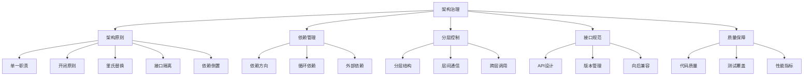

在企业级软件开发中，良好的架构设计是系统成功的关键因素之一。随着系统规模的扩大和复杂度的增加，架构腐化成为了一个普遍存在的问题。通过有效的架构治理和防腐层技术，可以确保系统架构的稳定性和可维护性。本章将深入探讨架构治理的核心原则、分层架构守护、包依赖关系管理、API兼容性保障以及防腐层的实现技术。

## 架构治理的核心理念

### 什么是架构治理？

架构治理是指通过一系列规则、流程和工具来确保软件系统遵循既定的架构原则和设计决策。它不仅关注架构的静态结构，还关注架构在系统演进过程中的动态维护。



### 架构治理的价值

#### 1. 降低系统复杂度

```java
// 良好的分层架构示例
// 表现层 (Presentation Layer)
@RestController
@RequestMapping("/api/users")
public class UserController {
    @Autowired
    private UserService userService; // 依赖业务层
    
    @GetMapping("/{id}")
    public ResponseEntity<UserDTO> getUser(@PathVariable Long id) {
        User user = userService.findById(id);
        return ResponseEntity.ok(UserMapper.toDTO(user));
    }
}

// 业务层 (Business Layer)
@Service
public class UserService {
    @Autowired
    private UserRepository userRepository; // 依赖持久层
    @Autowired
    private NotificationService notificationService; // 依赖集成层
    
    @Transactional
    public User createUser(CreateUserRequest request) {
        User user = new User(request.getName(), request.getEmail());
        User savedUser = userRepository.save(user);
        
        // 发送欢迎通知
        notificationService.sendWelcomeMessage(savedUser.getEmail());
        
        return savedUser;
    }
}

// 持久层 (Persistence Layer)
@Repository
public class UserRepository {
    @PersistenceContext
    private EntityManager entityManager;
    
    public User save(User user) {
        return entityManager.merge(user);
    }
    
    public User findById(Long id) {
        return entityManager.find(User.class, id);
    }
}

// 集成层 (Integration Layer)
@Service
public class NotificationService {
    @Autowired
    private EmailService emailService;
    
    public void sendWelcomeMessage(String email) {
        emailService.send(email, "Welcome!", "Welcome to our platform!");
    }
}
```

#### 2. 提高可维护性

```java
// 不良架构示例（违反分层原则）
@RestController
public class BadUserController {
    @PersistenceContext
    private EntityManager entityManager; // 直接依赖持久层
    
    @Autowired
    private EmailService emailService; // 直接依赖外部服务
    
    @PostMapping("/users")
    public ResponseEntity<User> createUser(@RequestBody CreateUserRequest request) {
        // 直接操作数据库
        User user = new User(request.getName(), request.getEmail());
        entityManager.persist(user);
        
        // 直接发送邮件
        emailService.send(user.getEmail(), "Welcome!", "Welcome to our platform!");
        
        return ResponseEntity.ok(user);
    }
}
```

## 分层架构守护

### 分层架构原则

分层架构通过将系统划分为不同的层次，每层都有明确的职责和边界，从而降低系统的复杂度并提高可维护性。

#### 1. 经典三层架构

```java
// 表现层接口定义
public interface UserController {
    ResponseEntity<UserDTO> getUser(Long id);
    ResponseEntity<UserDTO> createUser(CreateUserRequest request);
    ResponseEntity<UserDTO> updateUser(Long id, UpdateUserRequest request);
}

// 业务层接口定义
public interface UserService {
    User findById(Long id);
    User create(CreateUserRequest request);
    User update(Long id, UpdateUserRequest request);
    void delete(Long id);
}

// 持久层接口定义
public interface UserRepository {
    User save(User user);
    User findById(Long id);
    List<User> findAll();
    void delete(User user);
}

// 集成层接口定义
public interface NotificationService {
    void sendWelcomeMessage(String email);
    void sendPasswordReset(String email, String token);
    void sendOrderConfirmation(String email, Order order);
}
```

#### 2. 分层依赖规则

```java
// 使用注解定义层依赖关系
@Retention(RetentionPolicy.RUNTIME)
@Target(ElementType.PACKAGE)
public @interface Layer {
    LayerType value();
    LayerType[] allowedDependencies() default {};
}

// 定义层类型
public enum LayerType {
    PRESENTATION,    // 表现层
    BUSINESS,        // 业务层
    PERSISTENCE,     // 持久层
    INTEGRATION,     // 集成层
    COMMON           // 公共层
}

// 包级别分层定义
@Layer(value = LayerType.BUSINESS, 
       allowedDependencies = {LayerType.PERSISTENCE, LayerType.INTEGRATION, LayerType.COMMON})
package com.company.app.service;

// 架构规则检查器
@Component
public class LayerDependencyChecker {
    
    public List<ArchitectureViolation> checkLayerDependencies() {
        List<ArchitectureViolation> violations = new ArrayList<>();
        
        // 扫描所有包
        Set<Package> packages = PackageScanner.scanPackages("com.company.app");
        
        for (Package pkg : packages) {
            Layer layerAnnotation = pkg.getAnnotation(Layer.class);
            if (layerAnnotation != null) {
                // 检查该包的依赖关系
                List<Package> dependencies = DependencyAnalyzer.getDependencies(pkg);
                
                for (Package dependency : dependencies) {
                    Layer dependencyLayer = dependency.getAnnotation(Layer.class);
                    if (dependencyLayer != null) {
                        // 检查是否允许该依赖
                        if (!isAllowedDependency(layerAnnotation, dependencyLayer.value())) {
                            violations.add(new ArchitectureViolation(
                                pkg.getName(),
                                dependency.getName(),
                                "Layer dependency violation"
                            ));
                        }
                    }
                }
            }
        }
        
        return violations;
    }
    
    private boolean isAllowedDependency(Layer sourceLayer, LayerType targetLayer) {
        LayerType[] allowed = sourceLayer.allowedDependencies();
        if (allowed.length == 0) {
            return true; // 默认允许所有依赖
        }
        
        for (LayerType allowedLayer : allowed) {
            if (allowedLayer == targetLayer) {
                return true;
            }
        }
        
        return false;
    }
}
```

### 分层架构守护工具

```java
// 分层架构守护工具
@Component
public class ArchitectureGuardian {
    
    private static final Map<LayerType, Set<LayerType>> ALLOWED_DEPENDENCIES = 
        new HashMap<LayerType, Set<LayerType>>() {{
            put(LayerType.PRESENTATION, new HashSet<>(Arrays.asList(
                LayerType.BUSINESS, LayerType.COMMON
            )));
            put(LayerType.BUSINESS, new HashSet<>(Arrays.asList(
                LayerType.PERSISTENCE, LayerType.INTEGRATION, LayerType.COMMON
            )));
            put(LayerType.PERSISTENCE, new HashSet<>(Arrays.asList(
                LayerType.COMMON
            )));
            put(LayerType.INTEGRATION, new HashSet<>(Arrays.asList(
                LayerType.COMMON
            )));
        }};
    
    public ArchitectureReport validateArchitecture() {
        ArchitectureReport report = new ArchitectureReport();
        
        try {
            // 1. 检查分层依赖
            List<DependencyViolation> dependencyViolations = checkLayerDependencies();
            report.setDependencyViolations(dependencyViolations);
            
            // 2. 检查循环依赖
            List<CircularDependency> circularDependencies = checkCircularDependencies();
            report.setCircularDependencies(circularDependencies);
            
            // 3. 检查跨层调用
            List<CrossLayerCall> crossLayerCalls = checkCrossLayerCalls();
            report.setCrossLayerCalls(crossLayerCalls);
            
            // 4. 计算架构健康度
            report.setHealthScore(calculateHealthScore(report));
            
        } catch (Exception e) {
            report.setError("Failed to validate architecture: " + e.getMessage());
        }
        
        return report;
    }
    
    private List<DependencyViolation> checkLayerDependencies() {
        List<DependencyViolation> violations = new ArrayList<>();
        
        // 使用ASM或类似的字节码分析工具
        ClassGraph classGraph = new ClassGraph()
            .enableAllInfo()
            .acceptPackages("com.company.app");
        
        try (ScanResult scanResult = classGraph.scan()) {
            for (ClassInfo classInfo : scanResult.getAllClasses()) {
                // 获取类的层信息
                LayerType classLayer = getLayerFromClass(classInfo);
                if (classLayer == null) continue;
                
                // 检查该类的依赖
                for (ClassInfo dependency : classInfo.getClassDependencies()) {
                    LayerType dependencyLayer = getLayerFromClass(dependency);
                    if (dependencyLayer == null) continue;
                    
                    // 检查依赖是否被允许
                    if (!isDependencyAllowed(classLayer, dependencyLayer)) {
                        violations.add(new DependencyViolation(
                            classInfo.getName(),
                            dependency.getName(),
                            classLayer,
                            dependencyLayer
                        ));
                    }
                }
            }
        }
        
        return violations;
    }
    
    private boolean isDependencyAllowed(LayerType source, LayerType target) {
        Set<LayerType> allowed = ALLOWED_DEPENDENCIES.get(source);
        return allowed != null && allowed.contains(target);
    }
}
```

## 包依赖关系管理

### 依赖关系可视化

```java
// 包依赖关系分析器
@Component
public class PackageDependencyAnalyzer {
    
    public DependencyGraph analyzeDependencies() {
        DependencyGraph graph = new DependencyGraph();
        
        // 扫描项目中的所有包
        Set<PackageInfo> packages = scanProjectPackages();
        
        for (PackageInfo pkg : packages) {
            // 添加包节点
            graph.addNode(pkg.getName(), pkg.getLayer());
            
            // 分析包的依赖关系
            Set<PackageInfo> dependencies = analyzePackageDependencies(pkg);
            for (PackageInfo dependency : dependencies) {
                graph.addEdge(pkg.getName(), dependency.getName());
            }
        }
        
        return graph;
    }
    
    private Set<PackageInfo> scanProjectPackages() {
        Set<PackageInfo> packages = new HashSet<>();
        
        // 使用反射获取所有包
        Reflections reflections = new Reflections("com.company.app");
        Set<Class<?>> classes = reflections.getTypesAnnotatedWith(Component.class);
        
        for (Class<?> clazz : classes) {
            Package pkg = clazz.getPackage();
            Layer layer = pkg.getAnnotation(Layer.class);
            
            PackageInfo packageInfo = new PackageInfo();
            packageInfo.setName(pkg.getName());
            packageInfo.setLayer(layer != null ? layer.value() : LayerType.COMMON);
            packageInfo.setClasses(new HashSet<>(Arrays.asList(clazz)));
            
            packages.add(packageInfo);
        }
        
        return packages;
    }
    
    private Set<PackageInfo> analyzePackageDependencies(PackageInfo sourcePackage) {
        Set<PackageInfo> dependencies = new HashSet<>();
        
        for (Class<?> clazz : sourcePackage.getClasses()) {
            // 分析类的依赖
            Set<Class<?>> classDependencies = getClassDependencies(clazz);
            
            for (Class<?> dependency : classDependencies) {
                Package dependencyPackage = dependency.getPackage();
                if (!dependencyPackage.equals(sourcePackage.getPackage())) {
                    // 找到对应的包信息
                    PackageInfo packageInfo = findPackageInfo(dependencyPackage);
                    if (packageInfo != null) {
                        dependencies.add(packageInfo);
                    }
                }
            }
        }
        
        return dependencies;
    }
}
```

### 依赖关系监控

```javascript
// 包依赖关系监控仪表板
class DependencyGraphDashboard extends React.Component {
    constructor(props) {
        super(props);
        this.state = {
            graph: null,
            violations: [],
            loading: true
        };
    }
    
    componentDidMount() {
        this.loadDependencyGraph();
        this.loadDependencyViolations();
    }
    
    loadDependencyGraph() {
        fetch('/api/architecture/dependencies/graph')
            .then(response => response.json())
            .then(data => {
                this.setState({ graph: data, loading: false });
            });
    }
    
    loadDependencyViolations() {
        fetch('/api/architecture/dependencies/violations')
            .then(response => response.json())
            .then(data => {
                this.setState({ violations: data });
            });
    }
    
    render() {
        const { graph, violations, loading } = this.state;
        
        if (loading) {
            return <div>Loading...</div>;
        }
        
        return (
            <div className="dependency-dashboard">
                <h1>Package Dependency Dashboard</h1>
                
                <div className="dependency-graph">
                    <h2>Dependency Graph</h2>
                    <ForceGraph data={graph} />
                </div>
                
                <div className="dependency-violations">
                    <h2>Dependency Violations</h2>
                    {violations.length > 0 ? (
                        <ViolationTable violations={violations} />
                    ) : (
                        <p>No violations found. Architecture is healthy!</p>
                    )}
                </div>
                
                <div className="dependency-metrics">
                    <h2>Metrics</h2>
                    <MetricsPanel metrics={graph.metrics} />
                </div>
            </div>
        );
    }
}
```

## API兼容性保障

### API版本管理

```java
// API版本管理策略
@RestController
@RequestMapping("/api")
public class VersionedApiController {
    
    // V1版本API
    @GetMapping(value = "/users/{id}", produces = "application/vnd.company.user.v1+json")
    public ResponseEntity<UserV1> getUserV1(@PathVariable Long id) {
        User user = userService.findById(id);
        UserV1 userV1 = UserMapper.toV1(user);
        return ResponseEntity.ok(userV1);
    }
    
    // V2版本API
    @GetMapping(value = "/users/{id}", produces = "application/vnd.company.user.v2+json")
    public ResponseEntity<UserV2> getUserV2(@PathVariable Long id) {
        User user = userService.findById(id);
        UserV2 userV2 = UserMapper.toV2(user);
        return ResponseEntity.ok(userV2);
    }
    
    // 通过路径版本管理
    @RestController
    @RequestMapping("/api/v1/users")
    public class UserV1Controller {
        // V1实现
    }
    
    @RestController
    @RequestMapping("/api/v2/users")
    public class UserV2Controller {
        // V2实现
    }
}

// API兼容性检查器
@Component
public class ApiCompatibilityChecker {
    
    public CompatibilityReport checkCompatibility(String oldVersion, String newVersion) {
        CompatibilityReport report = new CompatibilityReport();
        
        try {
            // 解析API定义
            ApiDefinition oldApi = parseApiDefinition(oldVersion);
            ApiDefinition newApi = parseApiDefinition(newVersion);
            
            // 检查向后兼容性
            List<CompatibilityViolation> violations = new ArrayList<>();
            
            // 1. 检查删除的端点
            violations.addAll(checkRemovedEndpoints(oldApi, newApi));
            
            // 2. 检查参数变更
            violations.addAll(checkParameterChanges(oldApi, newApi));
            
            // 3. 检查返回值变更
            violations.addAll(checkResponseChanges(oldApi, newApi));
            
            // 4. 检查HTTP状态码变更
            violations.addAll(checkStatusChanges(oldApi, newApi));
            
            report.setViolations(violations);
            report.setCompatible(violations.isEmpty());
            
        } catch (Exception e) {
            report.setError("Failed to check compatibility: " + e.getMessage());
        }
        
        return report;
    }
    
    private List<CompatibilityViolation> checkRemovedEndpoints(ApiDefinition oldApi, 
                                                            ApiDefinition newApi) {
        List<CompatibilityViolation> violations = new ArrayList<>();
        
        Set<String> oldEndpoints = oldApi.getEndpoints().keySet();
        Set<String> newEndpoints = newApi.getEndpoints().keySet();
        
        // 找出被删除的端点
        Set<String> removed = new HashSet<>(oldEndpoints);
        removed.removeAll(newEndpoints);
        
        for (String endpoint : removed) {
            violations.add(new CompatibilityViolation(
                ViolationType.ENDPOINT_REMOVED,
                endpoint,
                "Endpoint removed in new version"
            ));
        }
        
        return violations;
    }
}
```

### API契约测试

```java
// API契约测试框架
@SpringBootTest
@AutoConfigureMockMvc
public class ApiContractTest {
    
    @Autowired
    private MockMvc mockMvc;
    
    @Test
    public void testUserApiContract() throws Exception {
        // 测试GET /api/users/{id}
        mockMvc.perform(get("/api/users/1")
                .accept("application/vnd.company.user.v1+json"))
                .andExpect(status().isOk())
                .andExpect(content().contentType("application/vnd.company.user.v1+json"))
                .andExpect(jsonPath("$.id").value(1))
                .andExpect(jsonPath("$.name").exists())
                .andExpect(jsonPath("$.email").exists())
                .andExpect(jsonPath("$.createdAt").exists());
        
        // 测试POST /api/users
        String userJson = "{\"name\":\"John Doe\",\"email\":\"john@example.com\"}";
        
        mockMvc.perform(post("/api/users")
                .contentType("application/vnd.company.user.v1+json")
                .content(userJson))
                .andExpect(status().isCreated())
                .andExpect(content().contentType("application/vnd.company.user.v1+json"))
                .andExpect(jsonPath("$.id").exists())
                .andExpect(jsonPath("$.name").value("John Doe"))
                .andExpect(jsonPath("$.email").value("john@example.com"));
    }
    
    @Test
    public void testApiBreakingChanges() throws Exception {
        // 确保没有破坏性变更
        ApiCompatibilityChecker checker = new ApiCompatibilityChecker();
        CompatibilityReport report = checker.checkCompatibility("v1.0.0", "v1.1.0");
        
        assertTrue("API should be backward compatible", report.isCompatible());
    }
}
```

## 防腐层实现

### 防腐层设计模式

防腐层（Anti-Corruption Layer, ACL）是一种设计模式，用于隔离系统的核心领域模型与外部系统或遗留系统的不良设计。

```java
// 外部系统接口（不良设计示例）
public class ExternalUserService {
    // 返回不规范的数据结构
    public Map<String, Object> getUserInfo(String userId) {
        // 外部系统的复杂数据结构
        Map<String, Object> userInfo = new HashMap<>();
        userInfo.put("user_id", userId);
        userInfo.put("user_name", "John Doe");
        userInfo.put("user_email", "john@example.com");
        userInfo.put("created_date", "2023-01-01T10:00:00Z");
        // ... 更多不规范的字段
        return userInfo;
    }
}

// 防腐层实现
@Component
public class UserAntiCorruptionLayer {
    
    @Autowired
    private ExternalUserService externalUserService;
    
    public User getUser(String userId) {
        // 调用外部系统
        Map<String, Object> externalUser = externalUserService.getUserInfo(userId);
        
        // 转换为内部标准模型
        User user = new User();
        user.setId(getStringValue(externalUser, "user_id"));
        user.setName(getStringValue(externalUser, "user_name"));
        user.setEmail(getStringValue(externalUser, "user_email"));
        user.setCreatedAt(parseDate(getStringValue(externalUser, "created_date")));
        
        return user;
    }
    
    public Map<String, Object> convertToExternal(User user) {
        // 将内部模型转换为外部系统格式
        Map<String, Object> externalUser = new HashMap<>();
        externalUser.put("user_id", user.getId());
        externalUser.put("user_name", user.getName());
        externalUser.put("user_email", user.getEmail());
        externalUser.put("created_date", formatDate(user.getCreatedAt()));
        
        return externalUser;
    }
    
    private String getStringValue(Map<String, Object> map, String key) {
        Object value = map.get(key);
        return value != null ? value.toString() : null;
    }
    
    private LocalDateTime parseDate(String dateString) {
        if (dateString == null) return null;
        return LocalDateTime.parse(dateString, DateTimeFormatter.ISO_DATE_TIME);
    }
    
    private String formatDate(LocalDateTime date) {
        if (date == null) return null;
        return date.format(DateTimeFormatter.ISO_DATE_TIME);
    }
}

// 使用防腐层的服务
@Service
public class UserService {
    
    @Autowired
    private UserAntiCorruptionLayer acl;
    
    public User getExternalUser(String userId) {
        // 通过防腐层获取外部用户信息
        return acl.getUser(userId);
    }
    
    public void updateExternalUser(User user) {
        // 通过防腐层更新外部用户信息
        Map<String, Object> externalUser = acl.convertToExternal(user);
        // 调用外部系统更新接口
    }
}
```

### 微服务间的防腐层

```java
// 微服务防腐层示例
@Component
public class OrderServiceAntiCorruptionLayer {
    
    @Autowired
    private UserServiceClient userServiceClient;
    
    @Autowired
    private InventoryServiceClient inventoryServiceClient;
    
    public Order createOrder(CreateOrderRequest request) {
        // 1. 验证用户
        UserDTO user = userServiceClient.getUser(request.getUserId());
        if (user == null) {
            throw new IllegalArgumentException("User not found");
        }
        
        // 2. 检查库存
        List<InventoryDTO> inventories = new ArrayList<>();
        for (OrderItem item : request.getItems()) {
            InventoryDTO inventory = inventoryServiceClient.getInventory(item.getProductId());
            if (inventory.getQuantity() < item.getQuantity()) {
                throw new IllegalStateException("Insufficient inventory for product: " + item.getProductId());
            }
            inventories.add(inventory);
        }
        
        // 3. 创建订单（内部标准模型）
        Order order = new Order();
        order.setUserId(request.getUserId());
        order.setItems(convertItems(request.getItems()));
        order.setStatus(OrderStatus.PENDING);
        order.setCreatedAt(LocalDateTime.now());
        
        return order;
    }
    
    private List<OrderItem> convertItems(List<CreateOrderItem> externalItems) {
        return externalItems.stream()
            .map(item -> {
                OrderItem orderItem = new OrderItem();
                orderItem.setProductId(item.getProductId());
                orderItem.setQuantity(item.getQuantity());
                orderItem.setPrice(item.getPrice());
                return orderItem;
            })
            .collect(Collectors.toList());
    }
}

// Feign客户端定义
@FeignClient(name = "user-service")
public interface UserServiceClient {
    @GetMapping("/users/{userId}")
    UserDTO getUser(@PathVariable("userId") Long userId);
}

@FeignClient(name = "inventory-service")
public interface InventoryServiceClient {
    @GetMapping("/inventory/{productId}")
    InventoryDTO getInventory(@PathVariable("productId") Long productId);
}

// DTO定义
public class UserDTO {
    private Long id;
    private String name;
    private String email;
    // getters and setters
}

public class InventoryDTO {
    private Long productId;
    private Integer quantity;
    private LocalDateTime lastUpdated;
    // getters and setters
}
```

## 架构治理工具集成

### 架构规则引擎

```java
// 架构规则定义
public class ArchitectureRule {
    private String name;
    private String description;
    private RuleType type;
    private String sourcePattern;
    private String targetPattern;
    private boolean allowed;
    
    // 构造函数、getter和setter
}

// 架构规则引擎
@Component
public class ArchitectureRuleEngine {
    
    @Autowired
    private List<ArchitectureRule> rules;
    
    public RuleValidationReport validateArchitecture() {
        RuleValidationReport report = new RuleValidationReport();
        
        for (ArchitectureRule rule : rules) {
            List<RuleViolation> violations = applyRule(rule);
            report.addViolations(violations);
        }
        
        return report;
    }
    
    private List<RuleViolation> applyRule(ArchitectureRule rule) {
        List<RuleViolation> violations = new ArrayList<>();
        
        // 根据规则类型应用不同的检查逻辑
        switch (rule.getType()) {
            case PACKAGE_DEPENDENCY:
                violations.addAll(checkPackageDependencyRule(rule));
                break;
            case LAYER_DEPENDENCY:
                violations.addAll(checkLayerDependencyRule(rule));
                break;
            case CLASS_NAMING:
                violations.addAll(checkClassNamingRule(rule));
                break;
            case METHOD_COMPLEXITY:
                violations.addAll(checkMethodComplexityRule(rule));
                break;
        }
        
        return violations;
    }
    
    private List<RuleViolation> checkPackageDependencyRule(ArchitectureRule rule) {
        List<RuleViolation> violations = new ArrayList<>();
        
        // 使用正则表达式匹配包名
        Pattern sourcePattern = Pattern.compile(rule.getSourcePattern());
        Pattern targetPattern = Pattern.compile(rule.getTargetPattern());
        
        // 扫描类依赖关系
        ClassGraph classGraph = new ClassGraph().enableAllInfo().acceptPackages("com.company");
        try (ScanResult scanResult = classGraph.scan()) {
            for (ClassInfo classInfo : scanResult.getAllClasses()) {
                if (sourcePattern.matcher(classInfo.getPackageName()).matches()) {
                    for (ClassInfo dependency : classInfo.getClassDependencies()) {
                        if (targetPattern.matcher(dependency.getPackageName()).matches()) {
                            if (!rule.isAllowed()) {
                                violations.add(new RuleViolation(
                                    rule.getName(),
                                    classInfo.getName(),
                                    dependency.getName(),
                                    "Package dependency violation"
                                ));
                            }
                        }
                    }
                }
            }
        }
        
        return violations;
    }
}
```

### CI/CD集成

```yaml
# CI/CD中的架构治理检查
name: Architecture Governance Check

on:
  push:
    branches: [ main, develop ]
  pull_request:
    branches: [ main ]

jobs:
  architecture-check:
    runs-on: ubuntu-latest
    
    steps:
    - name: Checkout code
      uses: actions/checkout@v3
    
    - name: Setup Java
      uses: actions/setup-java@v3
      with:
        java-version: '11'
        distribution: 'temurin'
    
    - name: Run architecture analysis
      run: |
        # 运行架构分析工具
        java -jar architecture-analyzer.jar --source src/main/java --rules rules/architecture-rules.json
        
        # 检查是否有违规
        if [ -f "architecture-violations.txt" ]; then
          echo "❌ Architecture violations found:"
          cat architecture-violations.txt
          exit 1
        else
          echo "✅ Architecture check passed"
        fi
    
    - name: Run dependency check
      run: |
        # 检查循环依赖
        jdeps --generate-dot-output target/classes > dependencies.dot
        
        # 分析依赖图
        python analyze-dependencies.py dependencies.dot
        
        # 检查是否有循环依赖
        if grep -q "cycle" dependency-analysis.txt; then
          echo "❌ Circular dependencies found"
          cat dependency-analysis.txt
          exit 1
        else
          echo "✅ No circular dependencies found"
        fi
    
    - name: Upload architecture report
      uses: actions/upload-artifact@v3
      with:
        name: architecture-report
        path: architecture-report.html
```

## 监控与度量

### 架构健康度指标

```java
// 架构健康度指标定义
public class ArchitectureMetrics {
    // 分层依赖合规率
    private double layerComplianceRate;
    
    // 循环依赖数量
    private int circularDependencyCount;
    
    // 包依赖复杂度
    private double packageDependencyComplexity;
    
    // API兼容性
    private double apiCompatibilityRate;
    
    // 防腐层使用率
    private double antiCorruptionLayerUsageRate;
    
    // 架构违规数量
    private int architectureViolationCount;
    
    // 趋势数据
    private List<HistoricalMetric> trendData;
    
    // getter和setter方法...
}
```

### 架构监控仪表板

```javascript
// 架构监控仪表板
class ArchitectureDashboard extends React.Component {
    constructor(props) {
        super(props);
        this.state = {
            metrics: null,
            violations: [],
            dependencies: null,
            loading: true
        };
    }
    
    componentDidMount() {
        this.loadMetrics();
        this.loadViolations();
        this.loadDependencies();
    }
    
    loadMetrics() {
        fetch('/api/architecture/metrics')
            .then(response => response.json())
            .then(data => {
                this.setState({ metrics: data, loading: false });
            });
    }
    
    loadViolations() {
        fetch('/api/architecture/violations')
            .then(response => response.json())
            .then(data => {
                this.setState({ violations: data });
            });
    }
    
    loadDependencies() {
        fetch('/api/architecture/dependencies')
            .then(response => response.json())
            .then(data => {
                this.setState({ dependencies: data });
            });
    }
    
    render() {
        const { metrics, violations, dependencies, loading } = this.state;
        
        if (loading) {
            return <div>Loading...</div>;
        }
        
        return (
            <div className="architecture-dashboard">
                <h1>Architecture Governance Dashboard</h1>
                
                <div className="metrics-grid">
                    <MetricCard 
                        title="Layer Compliance"
                        value={metrics.layerComplianceRate}
                        format="percentage"
                        trend={metrics.layerTrend}
                    />
                    <MetricCard 
                        title="Circular Dependencies"
                        value={metrics.circularDependencyCount}
                        format="number"
                        trend={metrics.dependencyTrend}
                    />
                    <MetricCard 
                        title="API Compatibility"
                        value={metrics.apiCompatibilityRate}
                        format="percentage"
                    />
                    <MetricCard 
                        title="Violations"
                        value={metrics.architectureViolationCount}
                        format="number"
                    />
                </div>
                
                <div className="architecture-graph">
                    <h2>Dependency Graph</h2>
                    <DependencyGraph data={dependencies} />
                </div>
                
                <div className="violations-table">
                    <h2>Recent Violations</h2>
                    <ViolationTable violations={violations} />
                </div>
            </div>
        );
    }
}
```

## 总结

架构治理与防腐层是确保企业级应用架构稳定性和可维护性的关键手段。通过建立完善的架构治理机制、实施分层架构守护、管理包依赖关系、保障API兼容性以及合理使用防腐层技术，可以有效防止架构腐化，提升系统质量。

关键要点包括：

1. **架构治理原则**：建立清晰的架构原则和治理流程
2. **分层架构守护**：通过规则引擎确保分层依赖的合规性
3. **包依赖管理**：可视化和监控包依赖关系
4. **API兼容性保障**：通过版本管理和契约测试确保API稳定性
5. **防腐层实现**：隔离外部系统的不良设计影响
6. **工具集成**：将架构治理集成到CI/CD流程中
7. **持续监控**：建立度量体系和监控仪表板

通过系统性地实施这些策略和技术，企业可以构建和维护高质量的软件架构，为业务的持续发展提供坚实的技术基础。

在下一节中，我们将探讨AI辅助的代码评审与缺陷预测技术，这是智能化工程效能平台的重要发展方向。