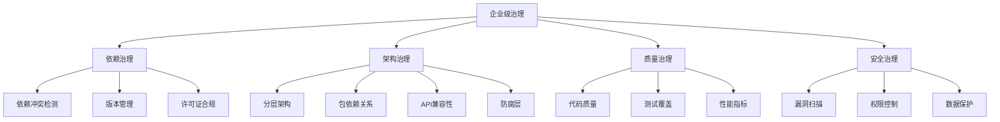

在现代企业级软件开发中，随着系统复杂度的不断增加和团队规模的持续扩大，传统的代码质量管理方式已难以满足日益增长的需求。智能分析与企业级治理成为工程效能平台建设的重要发展方向，通过自动化检测、智能识别和前瞻性治理，帮助企业构建更加健壮、可维护的软件系统。本章将深入探讨类冲突与依赖冲突检测、代码重复度与复制粘贴检测、架构治理与防腐层、以及AI辅助的代码评审与缺陷预测等核心技术。

## 智能分析的必要性

### 复杂性管理挑战

随着企业级应用的规模不断扩大，系统复杂性呈指数级增长。这种复杂性主要体现在以下几个方面：

1. **依赖关系复杂**：微服务架构下，服务间依赖关系错综复杂
2. **技术栈多样化**：多语言、多框架并存
3. **团队协作复杂**：跨团队、跨部门协作频繁
4. **演进路径复杂**：系统持续演进，历史包袱累积

```java
// 复杂依赖关系示例
public class OrderService {
    @Autowired
    private UserService userService; // 依赖用户服务
    
    @Autowired
    private PaymentService paymentService; // 依赖支付服务
    
    @Autowired
    private InventoryService inventoryService; // 依赖库存服务
    
    @Autowired
    private NotificationService notificationService; // 依赖通知服务
    
    @Autowired
    private AuditService auditService; // 依赖审计服务
    
    @Autowired
    private AnalyticsService analyticsService; // 依赖分析服务
    
    // ... 更多依赖
}
```

### 传统方法的局限性

传统的代码质量管理方法主要依赖人工审查和简单的静态分析工具，存在以下局限性：

1. **覆盖面有限**：难以全面检测复杂的依赖关系和架构问题
2. **时效性差**：问题发现滞后，修复成本高
3. **主观性强**：依赖个人经验和判断，标准不统一
4. **扩展性弱**：难以适应大规模、快速变化的系统

## 企业级治理的核心要素

### 治理范围

企业级治理涵盖了软件开发生命周期的各个环节：



### 治理原则

1. **自动化优先**：尽可能通过自动化手段实现治理
2. **预防为主**：在问题发生前就进行预防
3. **数据驱动**：基于数据分析制定治理策略
4. **持续改进**：建立持续优化的治理机制

## 技术实现框架

### 智能分析引擎

构建统一的智能分析引擎，集成多种分析能力：

```java
// 智能分析引擎架构示例
@Component
public class IntelligentAnalysisEngine {
    
    @Autowired
    private DependencyAnalyzer dependencyAnalyzer;
    
    @Autowired
    private DuplicationDetector duplicationDetector;
    
    @Autowired
    private ArchitectureGovernor architectureGovernor;
    
    @Autowired
    private AICodeReviewer aiCodeReviewer;
    
    public AnalysisReport analyzeProject(ProjectContext context) {
        AnalysisReport report = new AnalysisReport();
        
        // 1. 依赖分析
        DependencyAnalysisResult dependencyResult = 
            dependencyAnalyzer.analyze(context);
        report.setDependencyAnalysis(dependencyResult);
        
        // 2. 重复代码检测
        DuplicationAnalysisResult duplicationResult = 
            duplicationDetector.detect(context);
        report.setDuplicationAnalysis(duplicationResult);
        
        // 3. 架构治理检查
        ArchitectureAnalysisResult architectureResult = 
            architectureGovernor.govern(context);
        report.setArchitectureAnalysis(architectureResult);
        
        // 4. AI辅助分析
        AIAnalysisResult aiResult = aiCodeReviewer.review(context);
        report.setAiAnalysis(aiResult);
        
        // 5. 综合评估
        report.setOverallScore(calculateOverallScore(report));
        report.setRecommendations(generateRecommendations(report));
        
        return report;
    }
    
    private double calculateOverallScore(AnalysisReport report) {
        // 加权计算综合评分
        double dependencyScore = report.getDependencyAnalysis().getScore() * 0.3;
        double duplicationScore = report.getDuplicationAnalysis().getScore() * 0.2;
        double architectureScore = report.getArchitectureAnalysis().getScore() * 0.3;
        double aiScore = report.getAiAnalysis().getScore() * 0.2;
        
        return dependencyScore + duplicationScore + architectureScore + aiScore;
    }
}
```

### 治理策略管理

建立灵活的治理策略管理体系：

```yaml
# 治理策略配置示例
governancePolicies:
  dependency:
    conflictDetection:
      enabled: true
      severityThreshold: "HIGH"
      autoResolution: true
    versionManagement:
      strategy: "latest-patch"
      allowDowngrade: false
      updateFrequency: "weekly"
    licenseCompliance:
      allowedLicenses:
        - "Apache-2.0"
        - "MIT"
        - "BSD-3-Clause"
      prohibitedLicenses:
        - "GPL-2.0"
        - "GPL-3.0"
  
  architecture:
    layering:
      enforce: true
      allowedLayers:
        - "presentation"
        - "business"
        - "persistence"
        - "integration"
      forbiddenCalls:
        - "presentation -> persistence"
        - "business -> presentation"
    packageDependencies:
      enforce: true
      allowedPatterns:
        - "com.company.app.* -> com.company.common.*"
      forbiddenPatterns:
        - "com.company.featureA.* -> com.company.featureB.*"
    apiCompatibility:
      checkBreakingChanges: true
      versioningStrategy: "semver"
  
  quality:
    codeDuplication:
      threshold: 5 # 重复代码行数阈值
      severity: "WARNING"
    complexity:
      maxCyclomaticComplexity: 10
      maxCognitiveComplexity: 15
    maintainability:
      minMaintainabilityIndex: 20
  
  security:
    vulnerabilityScanning:
      enabled: true
      failOnSeverity: "HIGH"
      updateDatabase: "daily"
    permissionControl:
      enforcePrincipleOfLeastPrivilege: true
      auditAccessControl: true
```

## 实施路线图

### 阶段一：基础能力建设

1. **依赖冲突检测**：实现基础的类冲突和依赖冲突检测能力
2. **重复代码检测**：建立代码重复度检测机制
3. **架构规则定义**：制定企业级架构治理规则

### 阶段二：智能能力引入

1. **AI辅助评审**：集成AI代码评审能力
2. **预测性分析**：实现缺陷预测和风险评估
3. **自动化修复**：提供自动重构建议

### 阶段三：治理体系完善

1. **全链路治理**：实现从代码到部署的全链路治理
2. **动态调整**：基于数据分析动态优化治理策略
3. **生态集成**：与安全、运维等其他平台集成

## 价值与收益

### 业务价值

1. **降低维护成本**：通过预防性治理减少技术债累积
2. **提升系统稳定性**：提前发现和解决架构问题
3. **加速交付速度**：减少因质量问题导致的返工
4. **增强团队协作**：统一标准促进跨团队协作

### 技术价值

1. **提高代码质量**：通过自动化检测提升整体代码质量
2. **增强系统可维护性**：良好的架构设计提高系统可维护性
3. **降低技术风险**：及时发现和解决潜在技术风险
4. **促进技术创新**：为新技术引入提供安全保障

## 总结

智能分析与企业级治理是现代工程效能平台不可或缺的重要组成部分。通过构建智能化的分析引擎和完善的治理体系，企业可以有效应对系统复杂性带来的挑战，提升软件质量和开发效率。

关键要点包括：

1. **全面覆盖**：涵盖依赖治理、架构治理、质量治理和安全治理等多个维度
2. **智能驱动**：利用AI技术提升分析和决策能力
3. **自动化优先**：通过自动化手段实现高效治理
4. **持续优化**：建立持续改进的治理机制

在接下来的章节中，我们将深入探讨类冲突与依赖冲突检测、代码重复度与复制粘贴检测、架构治理与防腐层、以及AI辅助的代码评审与缺陷预测等具体技术实现。