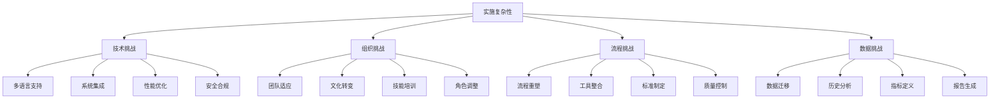

在企业级工程效能平台的建设过程中，一次性全面部署往往面临巨大的风险和挑战。通过分阶段实施策略，可以有效降低项目风险，确保平台建设的稳步推进和成功落地。本章将深入探讨工程效能平台的分阶段实施方法、各阶段的关键任务、推广策略以及最佳实践，帮助企业构建从基础扫描到效能提升闭环的完整体系。

## 分阶段实施的必要性

### 实施复杂性挑战

工程效能平台建设涉及多个技术领域和业务流程，其复杂性主要体现在以下几个方面：

1. **技术栈多样性**：需要支持多种编程语言和开发框架
2. **集成复杂性**：需要与现有的CI/CD、版本控制、项目管理等系统集成
3. **组织变革**：需要改变开发团队的工作流程和习惯
4. **数据迁移**：需要处理历史数据的迁移和整合



### 分阶段实施的优势

分阶段实施策略能够有效应对上述挑战，具有以下优势：

#### 1. 风险控制

```java
// 风险控制示例：分阶段实施计划
public class PhasedImplementationPlan {
    
    public List<ImplementationPhase> createPhasedPlan() {
        List<ImplementationPhase> phases = new ArrayList<>();
        
        // 第一阶段：基础能力建设
        ImplementationPhase phase1 = new ImplementationPhase();
        phase1.setName("基础扫描与门禁");
        phase1.setGoals(Arrays.asList(
            "搭建代码扫描基础设施",
            "集成基础质量门禁",
            "嵌入CI流水线"
        ));
        phase1.setRiskLevel(RiskLevel.LOW);
        phase1.setDuration(Weeks.of(4));
        phases.add(phase1);
        
        // 第二阶段：度量体系建立
        ImplementationPhase phase2 = new ImplementationPhase();
        phase2.setName("度量体系与可视化");
        phase2.setGoals(Arrays.asList(
            "建立核心度量指标",
            "构建数据可视化平台",
            "推动技术债管理"
        ));
        phase2.setRiskLevel(RiskLevel.MEDIUM);
        phase2.setDuration(Weeks.of(6));
        phases.add(phase2);
        
        // 第三阶段：智能分析与优化
        ImplementationPhase phase3 = new ImplementationPhase();
        phase3.setName("知识库与智能洞察");
        phase3.setGoals(Arrays.asList(
            "构建代码知识库",
            "实现智能分析能力",
            "形成效能提升闭环"
        ));
        phase3.setRiskLevel(RiskLevel.HIGH);
        phase3.setDuration(Weeks.of(8));
        phases.add(phase3);
        
        return phases;
    }
}
```

#### 2. 快速价值交付

分阶段实施能够确保每个阶段都能交付可见的价值，增强团队信心：

```yaml
# 分阶段价值交付示例
phasedValueDelivery:
  phase1:
    duration: "4 weeks"
    deliverables:
      - "代码扫描能力上线"
      - "基础质量门禁生效"
      - "CI流水线集成完成"
    businessValue:
      - "降低代码缺陷率20%"
      - "减少人工代码审查时间30%"
      - "提升构建成功率15%"
  
  phase2:
    duration: "6 weeks"
    deliverables:
      - "效能度量体系建立"
      - "数据可视化平台上线"
      - "技术债管理机制运行"
    businessValue:
      - "提升开发效率25%"
      - "降低维护成本30%"
      - "改善团队协作效率20%"
  
  phase3:
    duration: "8 weeks"
    deliverables:
      - "智能分析能力上线"
      - "个性化报告生成"
      - "效能优化建议系统"
    businessValue:
      - "预测性缺陷发现率提升40%"
      - "自动化重构建议采纳率35%"
      - "整体效能提升30%"
```

## 第一阶段：基础扫描与门禁

### 阶段目标

第一阶段的核心目标是搭建工程效能平台的基础能力，包括代码扫描、质量门禁和CI流水线集成。

### 关键任务

#### 1. 基础设施搭建

```bash
# 基础设施搭建脚本示例
#!/bin/bash

# 1. 安装代码扫描工具
echo "Installing code scanning tools..."
sudo apt-get update
sudo apt-get install -y sonar-scanner checkstyle pmd

# 2. 配置扫描规则
echo "Configuring scanning rules..."
cp /path/to/company-coding-standards.xml /etc/sonar/rules/
cp /path/to/checkstyle-config.xml /etc/checkstyle/

# 3. 启动扫描服务
echo "Starting scanning services..."
systemctl start sonarqube
systemctl enable sonarqube

# 4. 验证安装
echo "Verifying installation..."
sonar-scanner --version
checkstyle --version
```

#### 2. 质量门禁配置

```yaml
# 质量门禁配置示例
qualityGates:
  - name: "Basic Quality Gate"
    description: "基础质量门禁配置"
    conditions:
      - metric: "code_coverage"
        operator: "GREATER_THAN_OR_EQUALS"
        threshold: 80
        severity: "BLOCKER"
      
      - metric: "critical_issues"
        operator: "EQUALS"
        threshold: 0
        severity: "BLOCKER"
      
      - metric: "blocker_issues"
        operator: "EQUALS"
        threshold: 0
        severity: "BLOCKER"
      
      - metric: "code_smells"
        operator: "LESS_THAN"
        threshold: 1000
        severity: "WARNING"
      
      - metric: "duplicated_lines_density"
        operator: "LESS_THAN"
        threshold: 3
        severity: "WARNING"
```

#### 3. CI流水线集成

```groovy
// Jenkins Pipeline集成示例
pipeline {
    agent any
    
    stages {
        stage('Checkout') {
            steps {
                git branch: 'main', url: 'https://github.com/company/project.git'
            }
        }
        
        stage('Build') {
            steps {
                sh 'mvn clean compile'
            }
        }
        
        stage('Code Analysis') {
            steps {
                sh 'sonar-scanner'
            }
            post {
                always {
                    script {
                        def qualityGate = waitForQualityGate()
                        if (qualityGate.status != 'OK') {
                            error "Pipeline aborted due to quality gate failure: ${qualityGate.status}"
                        }
                    }
                }
            }
        }
        
        stage('Unit Test') {
            steps {
                sh 'mvn test'
            }
            post {
                always {
                    publishTestResults testResultsPattern: 'target/surefire-reports/*.xml'
                }
            }
        }
        
        stage('Package') {
            steps {
                sh 'mvn package'
            }
        }
    }
    
    post {
        success {
            echo 'Pipeline completed successfully!'
            slackSend channel: '#deployments', message: "SUCCESS: Pipeline for ${env.JOB_NAME} completed successfully"
        }
        failure {
            echo 'Pipeline failed!'
            slackSend channel: '#deployments', message: "FAILURE: Pipeline for ${env.JOB_NAME} failed"
        }
    }
}
```

### 实施要点

1. **选择试点项目**：选择技术栈相对简单、团队配合度高的项目作为试点
2. **制定配置标准**：建立统一的扫描规则和质量门禁标准
3. **培训团队成员**：确保团队成员了解新工具和流程
4. **监控实施效果**：建立监控机制，及时发现和解决问题

## 第二阶段：度量体系与可视化

### 阶段目标

第二阶段的核心目标是建立完善的效能度量体系，构建数据可视化平台，推动技术债管理。

### 关键任务

#### 1. 度量体系建立

```java
// 核心度量指标定义
public class CoreMetrics {
    
    // DORA指标
    public static class DORAMetrics {
        private double deploymentFrequency;      // 部署频率
        private double leadTimeForChanges;       // 变更前置时间
        private double meanTimeToRecovery;       // 平均恢复时间
        private double changeFailureRate;        // 变更失败率
    }
    
    // SPACE模型指标
    public static class SPACEMetrics {
        private double satisfaction;              // 满意度
        private double performance;               // 绩效
        private double activity;                  // 活动度
        private double communication;             // 协作沟通
        private double efficiency;                // 效率
    }
    
    // 代码质量指标
    public static class CodeQualityMetrics {
        private double codeCoverage;             // 代码覆盖率
        private int criticalIssues;              // 严重问题数
        private int blockerIssues;               // 阻塞性问题数
        private double duplicatedLinesDensity;   // 重复代码密度
        private double technicalDebtRatio;       // 技术债比率
        private double maintainabilityRating;    // 可维护性评级
    }
}
```

#### 2. 数据可视化平台

```javascript
// 数据可视化仪表板示例
class EngineeringMetricsDashboard extends React.Component {
    constructor(props) {
        super(props);
        this.state = {
            metrics: null,
            loading: true,
            selectedTimeRange: 'last30days'
        };
    }
    
    componentDidMount() {
        this.loadMetrics();
    }
    
    loadMetrics() {
        const { selectedTimeRange } = this.state;
        
        fetch(`/api/metrics?timeRange=${selectedTimeRange}`)
            .then(response => response.json())
            .then(data => {
                this.setState({ metrics: data, loading: false });
            });
    }
    
    render() {
        const { metrics, loading } = this.state;
        
        if (loading) {
            return <div>Loading...</div>;
        }
        
        return (
            <div className="metrics-dashboard">
                <h1>Engineering Metrics Dashboard</h1>
                
                <div className="metrics-grid">
                    <MetricCard 
                        title="Deployment Frequency"
                        value={metrics.dora.deploymentFrequency}
                        format="number"
                        unit="deployments/day"
                        trend={metrics.trends.deploymentFrequency}
                    />
                    <MetricCard 
                        title="Lead Time for Changes"
                        value={metrics.dora.leadTimeForChanges}
                        format="duration"
                        trend={metrics.trends.leadTimeForChanges}
                    />
                    <MetricCard 
                        title="Code Coverage"
                        value={metrics.quality.codeCoverage}
                        format="percentage"
                        trend={metrics.trends.codeCoverage}
                    />
                    <MetricCard 
                        title="Technical Debt"
                        value={metrics.quality.technicalDebtRatio}
                        format="percentage"
                        trend={metrics.trends.technicalDebtRatio}
                    />
                </div>
                
                <div className="charts">
                    <div className="chart-container">
                        <h2>Deployment Frequency Trend</h2>
                        <LineChart data={metrics.charts.deploymentFrequency} />
                    </div>
                    
                    <div className="chart-container">
                        <h2>Code Quality Trend</h2>
                        <BarChart data={metrics.charts.codeQuality} />
                    </div>
                </div>
            </div>
        );
    }
}
```

#### 3. 技术债管理

```java
// 技术债管理服务
@Service
public class TechnicalDebtManagementService {
    
    @Autowired
    private TechnicalDebtRepository debtRepository;
    
    @Autowired
    private ProjectService projectService;
    
    public TechnicalDebtReport generateDebtReport(String projectId) {
        TechnicalDebtReport report = new TechnicalDebtReport();
        
        // 获取项目技术债数据
        List<TechnicalDebt> debts = debtRepository.findByProjectId(projectId);
        
        // 计算技术债指标
        report.setTotalDebt(calculateTotalDebt(debts));
        report.setDebtPerLine(calculateDebtPerLine(debts, projectId));
        report.setDebtTrend(calculateDebtTrend(projectId));
        
        // 识别高优先级技术债
        report.setHighPriorityDebts(identifyHighPriorityDebts(debts));
        
        // 生成改进建议
        report.setRecommendations(generateRecommendations(debts));
        
        return report;
    }
    
    private List<TechnicalDebt> identifyHighPriorityDebts(List<TechnicalDebt> debts) {
        return debts.stream()
            .filter(debt -> debt.getSeverity() == Severity.CRITICAL || 
                          debt.getSeverity() == Severity.HIGH)
            .filter(debt -> debt.getAgeInDays() > 30) // 超过30天的债务
            .sorted(Comparator.comparing(TechnicalDebt::getEffort).reversed())
            .limit(10) // 取前10个
            .collect(Collectors.toList());
    }
}
```

### 实施要点

1. **指标标准化**：建立统一的度量指标定义和计算方法
2. **数据质量保证**：确保数据采集的准确性和完整性
3. **可视化设计**：设计直观易懂的可视化界面
4. **持续改进**：基于度量结果持续优化开发流程

## 第三阶段：知识库与智能洞察

### 阶段目标

第三阶段的核心目标是构建代码知识库，实现智能分析能力，形成效能提升闭环。

### 关键任务

#### 1. 代码知识库建设

```java
// 代码知识库服务
@Service
public class CodeKnowledgeBaseService {
    
    @Autowired
    private CodeRepository codeRepository;
    
    @Autowired
    private AnalysisService analysisService;
    
    public void buildKnowledgeBase() {
        // 1. 代码模式识别
        List<CodePattern> patterns = identifyCodePatterns();
        
        // 2. 最佳实践提取
        List<BestPractice> practices = extractBestPractices();
        
        // 3. 常见问题归类
        List<CommonIssue> issues = categorizeCommonIssues();
        
        // 4. 构建知识图谱
        KnowledgeGraph knowledgeGraph = buildKnowledgeGraph(patterns, practices, issues);
        
        // 5. 存储到知识库
        knowledgeBaseRepository.save(knowledgeGraph);
    }
    
    private List<CodePattern> identifyCodePatterns() {
        List<CodePattern> patterns = new ArrayList<>();
        
        // 使用机器学习识别代码模式
        List<CodeSample> samples = codeRepository.findAllCodeSamples();
        
        for (CodeSample sample : samples) {
            // 提取代码特征
            CodeFeatures features = extractFeatures(sample);
            
            // 识别模式
            CodePattern pattern = patternRecognitionService.recognizePattern(features);
            if (pattern != null) {
                patterns.add(pattern);
            }
        }
        
        return patterns;
    }
}
```

#### 2. 智能分析能力

```python
# 智能分析引擎示例
import pandas as pd
import numpy as np
from sklearn.cluster import KMeans
from sklearn.ensemble import RandomForestClassifier
import networkx as nx

class IntelligentAnalysisEngine:
    def __init__(self):
        self.clustering_model = KMeans(n_clusters=5)
        self.classification_model = RandomForestClassifier()
        self.knowledge_graph = nx.Graph()
    
    def analyze_codebase(self, codebase_data):
        """分析代码库"""
        results = {}
        
        # 1. 代码聚类分析
        clusters = self.perform_clustering(codebase_data)
        results['clusters'] = clusters
        
        # 2. 质量预测
        quality_predictions = self.predict_code_quality(codebase_data)
        results['quality_predictions'] = quality_predictions
        
        # 3. 风险评估
        risk_assessment = self.assess_risk(codebase_data)
        results['risk_assessment'] = risk_assessment
        
        # 4. 重构建议
        refactoring_suggestions = self.suggest_refactorings(codebase_data)
        results['refactoring_suggestions'] = refactoring_suggestions
        
        return results
    
    def perform_clustering(self, data):
        """执行代码聚类分析"""
        # 提取特征
        features = self.extract_features(data)
        
        # 执行聚类
        cluster_labels = self.clustering_model.fit_predict(features)
        
        # 分析聚类结果
        clusters = {}
        for i, label in enumerate(cluster_labels):
            if label not in clusters:
                clusters[label] = []
            clusters[label].append(data[i])
        
        return clusters
    
    def predict_code_quality(self, data):
        """预测代码质量"""
        features = self.extract_features(data)
        quality_scores = self.classification_model.predict_proba(features)
        
        return {
            'scores': quality_scores,
            'average_quality': np.mean(quality_scores[:, 1]),
            'high_risk_files': self.identify_high_risk_files(quality_scores)
        }
    
    def assess_risk(self, data):
        """评估风险"""
        # 计算各种风险指标
        complexity_risk = self.calculate_complexity_risk(data)
        dependency_risk = self.calculate_dependency_risk(data)
        change_risk = self.calculate_change_risk(data)
        
        # 综合风险评估
        overall_risk = (complexity_risk + dependency_risk + change_risk) / 3
        
        return {
            'complexity_risk': complexity_risk,
            'dependency_risk': dependency_risk,
            'change_risk': change_risk,
            'overall_risk': overall_risk,
            'risk_level': self.determine_risk_level(overall_risk)
        }
```

#### 3. 效能提升闭环

```java
// 效能提升闭环管理
@Component
public class EfficiencyImprovementLoop {
    
    @Autowired
    private MetricsService metricsService;
    
    @Autowired
    private AnalysisService analysisService;
    
    @Autowired
    private RecommendationService recommendationService;
    
    @Autowired
    private FeedbackService feedbackService;
    
    public void runImprovementCycle() {
        // 1. 收集当前效能数据
        EfficiencyMetrics currentMetrics = metricsService.getCurrentMetrics();
        
        // 2. 分析效能瓶颈
        List<Bottleneck> bottlenecks = analysisService.analyzeBottlenecks(currentMetrics);
        
        // 3. 生成改进建议
        List<ImprovementRecommendation> recommendations = 
            recommendationService.generateRecommendations(bottlenecks);
        
        // 4. 实施改进建议
        List<ImplementationResult> results = implementRecommendations(recommendations);
        
        // 5. 收集反馈
        List<Feedback> feedbacks = feedbackService.collectFeedback(results);
        
        // 6. 评估改进效果
        EfficiencyMetrics newMetrics = metricsService.getCurrentMetrics();
        ImprovementEffect effect = evaluateImprovementEffect(currentMetrics, newMetrics);
        
        // 7. 持续优化
        optimizeRecommendationEngine(effect, feedbacks);
    }
    
    private List<ImplementationResult> implementRecommendations(
            List<ImprovementRecommendation> recommendations) {
        List<ImplementationResult> results = new ArrayList<>();
        
        for (ImprovementRecommendation recommendation : recommendations) {
            try {
                // 执行改进建议
                ImplementationResult result = executeRecommendation(recommendation);
                results.add(result);
                
                // 记录实施日志
                logImplementation(recommendation, result);
                
            } catch (Exception e) {
                log.error("Failed to implement recommendation: " + recommendation.getId(), e);
            }
        }
        
        return results;
    }
}
```

### 实施要点

1. **知识积累**：持续积累代码模式和最佳实践
2. **智能算法**：采用先进的机器学习算法提升分析能力
3. **闭环管理**：建立完整的效能提升闭环机制
4. **持续优化**：基于反馈不断优化分析模型

## 推广策略与最佳实践

### 推广策略

#### 1. 试点项目选择

```markdown
# 试点项目选择标准

## 技术标准
- 技术栈相对简单，易于集成
- 代码规模适中，便于验证效果
- 团队成员技术水平较高，易于接受新工具

## 业务标准
- 业务重要性适中，风险可控
- 项目周期相对稳定，便于持续改进
- 团队配合度高，愿意参与试点

## 组织标准
- 团队领导支持，能够推动变革
- 有足够资源投入试点项目
- 能够提供及时反馈和建议
```

#### 2. 培训与支持

```java
// 培训与支持体系
@Service
public class TrainingAndSupportService {
    
    public void conductTrainingProgram() {
        // 1. 基础培训
        conductBasicTraining();
        
        // 2. 进阶培训
        conductAdvancedTraining();
        
        // 3. 专项培训
        conductSpecializedTraining();
        
        // 4. 持续支持
        provideOngoingSupport();
    }
    
    private void conductBasicTraining() {
        List<TrainingModule> modules = Arrays.asList(
            new TrainingModule("平台概述", "介绍工程效能平台的整体架构和功能"),
            new TrainingModule("基础使用", "演示平台的基础操作和配置方法"),
            new TrainingModule("质量门禁", "讲解质量门禁的配置和使用"),
            new TrainingModule("度量查看", "指导如何查看和分析效能度量")
        );
        
        for (TrainingModule module : modules) {
            deliverTrainingModule(module);
        }
    }
    
    private void provideOngoingSupport() {
        // 建立支持渠道
        SupportChannels channels = new SupportChannels();
        channels.setSlackChannel("#engineering-platform-support");
        channels.setEmail("platform-support@company.com");
        channels.setDocumentationUrl("https://docs.company.com/engineering-platform");
        
        // 定期收集反馈
        scheduleFeedbackCollection();
    }
}
```

#### 3. 激励机制

```yaml
# 激励机制设计
incentiveMechanisms:
  recognition:
    - "月度效能之星评选"
    - "最佳实践分享奖励"
    - "技术创新贡献奖"
  
  performance:
    - "效能提升与绩效考核挂钩"
    - "质量改进与晋升评估关联"
    - "技术创新与奖金分配结合"
  
  community:
    - "内部技术分享会"
    - "跨团队协作奖励"
    - "开源贡献支持"
```

### 最佳实践

#### 1. 渐进式改进

```java
// 渐进式改进策略
public class IncrementalImprovementStrategy {
    
    public void applyStrategy(ProjectContext context) {
        // 1. 评估当前状态
        CurrentState currentState = assessCurrentState(context);
        
        // 2. 制定改进计划
        ImprovementPlan plan = createImprovementPlan(currentState);
        
        // 3. 分阶段实施
        executeInPhases(plan);
        
        // 4. 持续监控
        monitorProgress();
        
        // 5. 调整优化
        adjustAndOptimize();
    }
    
    private ImprovementPlan createImprovementPlan(CurrentState currentState) {
        ImprovementPlan plan = new ImprovementPlan();
        
        // 根据当前状态制定合适的改进策略
        if (currentState.getMaturityLevel() == MaturityLevel.INITIAL) {
            // 初始阶段：重点关注基础能力建设
            plan.addPhase(new Phase(
                "基础能力建设",
                Arrays.asList(
                    "搭建代码扫描基础设施",
                    "配置基础质量门禁",
                    "集成CI流水线"
                ),
                Duration.ofWeeks(4)
            ));
        } else if (currentState.getMaturityLevel() == MaturityLevel.DEVELOPING) {
            // 发展阶段：重点关注度量体系完善
            plan.addPhase(new Phase(
                "度量体系完善",
                Arrays.asList(
                    "完善核心度量指标",
                    "优化数据可视化",
                    "加强技术债管理"
                ),
                Duration.ofWeeks(6)
            ));
        } else {
            // 成熟阶段：重点关注智能化提升
            plan.addPhase(new Phase(
                "智能化提升",
                Arrays.asList(
                    "构建代码知识库",
                    "实现智能分析能力",
                    "形成效能提升闭环"
                ),
                Duration.ofWeeks(8)
            ));
        }
        
        return plan;
    }
}
```

#### 2. 持续改进

```java
// 持续改进机制
@Component
public class ContinuousImprovementMechanism {
    
    @Scheduled(cron = "0 0 9 * * MON") // 每周一上午9点执行
    public void weeklyImprovementReview() {
        // 1. 收集反馈
        List<Feedback> feedbacks = collectWeeklyFeedback();
        
        // 2. 分析问题
        List<Issue> issues = analyzeFeedback(feedbacks);
        
        // 3. 制定改进措施
        List<ImprovementAction> actions = createImprovementActions(issues);
        
        // 4. 分配任务
        assignImprovementTasks(actions);
        
        // 5. 跟踪进度
        trackImprovementProgress(actions);
    }
    
    @Scheduled(cron = "0 0 10 1 * ?") // 每月1日上午10点执行
    public void monthlyEffectivenessReview() {
        // 1. 评估实施效果
        EffectivenessReport report = evaluateEffectiveness();
        
        // 2. 识别改进机会
        List<ImprovementOpportunity> opportunities = identifyOpportunities(report);
        
        // 3. 制定长期规划
        LongTermPlan plan = createLongTermPlan(opportunities);
        
        // 4. 调整策略
        adjustStrategies(plan);
        
        // 5. 分享最佳实践
        shareBestPractices(report);
    }
}
```

## 总结

分阶段实施与推广策略是工程效能平台成功建设的关键。通过将复杂的平台建设过程分解为可管理的阶段，每个阶段都有明确的目标、任务和价值交付，能够有效降低实施风险，确保项目的稳步推进。

关键要点包括：

1. **阶段划分**：合理划分实施阶段，每个阶段聚焦特定目标
2. **价值交付**：确保每个阶段都能交付可见的业务价值
3. **风险控制**：通过分阶段实施有效控制项目风险
4. **推广策略**：采用试点先行、培训支持、激励机制等推广策略
5. **持续改进**：建立持续改进机制，不断优化平台能力

通过系统性地实施这些策略和方法，企业可以成功构建从基础扫描到效能提升闭环的完整工程效能体系，显著提升软件开发效率和质量。

在接下来的章节中，我们将深入探讨平台运营与效能提升的具体实践，包括角色职责、运营SOP、数据驱动改进和反馈通道建设等内容。