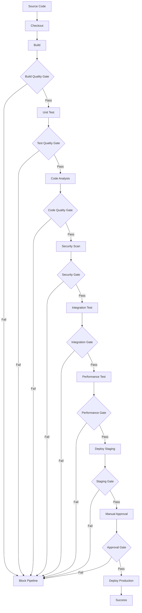

在现代软件交付流程中，CI/CD流水线是自动化构建、测试和部署的核心载体。将质量门禁深度集成到CI/CD流水线中，能够确保只有符合质量标准的代码变更才能进入生产环境。本章将深入探讨如何将质量门禁作为流水线推进的必备关卡，实现真正的质量内建。

## CI/CD流水线中的质量门禁架构

### 1. 流水线阶段设计

在CI/CD流水线中合理设计质量门禁阶段，确保每个关键节点都有相应的质量检查。

#### 流水线阶段架构


### 2. 质量门禁在流水线中的位置

根据不同类型的检查，将质量门禁放置在流水线的不同阶段。

#### 流水线阶段与门禁对应关系
```yaml
# CI/CD流水线配置示例
pipeline:
  stages:
    - name: checkout
      steps:
        - git-checkout
      quality-gate:
        name: source-quality-gate
        strategy: hard_block
        conditions:
          - metric: source_validity
            operator: EQUALS
            threshold: true
    
    - name: build
      steps:
        - compile-code
        - package-artifacts
      quality-gate:
        name: build-quality-gate
        strategy: hard_block
        conditions:
          - metric: build_success
            operator: EQUALS
            threshold: true
          - metric: compilation_warnings
            operator: LESS_THAN
            threshold: 10
    
    - name: unit-test
      steps:
        - run-unit-tests
      quality-gate:
        name: unit-test-gate
        strategy: scoring
        threshold: 80
        conditions:
          - metric: test_coverage
            operator: GREATER_THAN
            threshold: 80
            weight: 40
          - metric: test_success_rate
            operator: GREATER_THAN
            threshold: 95
            weight: 30
          - metric: critical_test_failures
            operator: EQUALS
            threshold: 0
            weight: 30
    
    - name: code-analysis
      steps:
        - sonarqube-analysis
      quality-gate:
        name: code-quality-gate
        strategy: hard_block
        conditions:
          - metric: critical_issues
            operator: EQUALS
            threshold: 0
          - metric: security_hotspots
            operator: LESS_THAN
            threshold: 5
    
    - name: security-scan
      steps:
        - dependency-check
        - owasp-zap-scan
      quality-gate:
        name: security-gate
        strategy: hard_block
        conditions:
          - metric: critical_vulnerabilities
            operator: EQUALS
            threshold: 0
          - metric: high_vulnerabilities
            operator: EQUALS
            threshold: 0
    
    - name: integration-test
      steps:
        - run-integration-tests
      quality-gate:
        name: integration-test-gate
        strategy: hard_block
        conditions:
          - metric: test_success_rate
            operator: GREATER_THAN
            threshold: 90
    
    - name: performance-test
      steps:
        - run-performance-tests
      quality-gate:
        name: performance-gate
        strategy: warning
        conditions:
          - metric: response_time
            operator: LESS_THAN
            threshold: 500
          - metric: throughput
            operator: GREATER_THAN
            threshold: 1000
    
    - name: deploy-staging
      steps:
        - deploy-to-staging
      quality-gate:
        name: staging-deploy-gate
        strategy: hard_block
        conditions:
          - metric: deployment_success
            operator: EQUALS
            threshold: true
    
    - name: deploy-production
      steps:
        - deploy-to-production
      quality-gate:
        name: production-deploy-gate
        strategy: hard_block
        conditions:
          - metric: staging_health
            operator: EQUALS
            threshold: true
          - metric: manual_approval
            operator: EQUALS
            threshold: true
```

## 主流CI/CD平台集成

### 1. Jenkins集成

Jenkins作为最流行的CI/CD平台之一，提供了丰富的插件支持质量门禁集成。

#### Jenkins Pipeline集成示例
```groovy
// Jenkins Pipeline脚本
pipeline {
    agent any
    
    stages {
        stage('Checkout') {
            steps {
                git branch: 'main', url: 'https://github.com/company/project.git'
            }
        }
        
        stage('Build') {
            steps {
                sh 'mvn clean compile'
            }
            post {
                always {
                    sh 'mvn sonar:sonar'
                }
            }
        }
        
        stage('Quality Gate') {
            steps {
                timeout(time: 1, unit: 'HOURS') {
                    waitForQualityGate abortPipeline: true
                }
            }
        }
        
        stage('Unit Test') {
            steps {
                sh 'mvn test'
            }
            post {
                always {
                    publishTestResults testResultsPattern: 'target/surefire-reports/*.xml'
                }
            }
        }
        
        stage('Code Analysis') {
            steps {
                sh 'mvn sonar:sonar'
            }
            post {
                success {
                    script {
                        def qualityGate = waitForQualityGate()
                        if (qualityGate.status != 'OK') {
                            error "Pipeline aborted due to quality gate failure: ${qualityGate.status}"
                        }
                    }
                }
            }
        }
        
        stage('Security Scan') {
            steps {
                sh 'dependency-check.sh --project "My Project" --scan .'
            }
            post {
                always {
                    dependencyCheckPublisher pattern: 'dependency-check-report.html'
                }
            }
        }
        
        stage('Integration Test') {
            steps {
                sh 'mvn verify -Dskip.surefire.tests'
            }
        }
        
        stage('Deploy to Staging') {
            steps {
                sh 'kubectl apply -f k8s/staging.yaml'
            }
        }
        
        stage('Performance Test') {
            steps {
                sh 'jmeter -n -t performance-test.jmx -l results.jtl'
            }
            post {
                always {
                    perfReport sourceDataFiles: 'results.jtl'
                }
            }
        }
        
        stage('Deploy to Production') {
            steps {
                input message: 'Deploy to production?', ok: 'Deploy'
                sh 'kubectl apply -f k8s/production.yaml'
            }
        }
    }
    
    post {
        success {
            echo 'Pipeline completed successfully!'
            slackSend channel: '#deployments', message: "SUCCESS: Pipeline for ${env.JOB_NAME} completed successfully"
        }
        failure {
            echo 'Pipeline failed!'
            slackSend channel: '#deployments', message: "FAILURE: Pipeline for ${env.JOB_NAME} failed"
        }
    }
}
```

### 2. GitLab CI/CD集成

GitLab CI/CD原生支持质量门禁集成，提供了更紧密的集成体验。

#### GitLab CI配置示例
```yaml
# .gitlab-ci.yml
stages:
  - build
  - test
  - quality
  - deploy

variables:
  SONAR_USER_HOME: "${CI_PROJECT_DIR}/.sonar"
  GIT_DEPTH: "0"

before_script:
  - export GRADLE_OPTS="-Dorg.gradle.daemon=false"

build-job:
  stage: build
  script:
    - ./gradlew build -x test
  artifacts:
    paths:
      - build/libs/
    expire_in: 1 hour

unit-test-job:
  stage: test
  script:
    - ./gradlew test
  artifacts:
    reports:
      junit: build/test-results/test/TEST-*.xml
    paths:
      - build/reports/tests/test/
    expire_in: 1 week
  coverage: '/Line coverage: \d+\.\d+/'

code-analysis-job:
  stage: quality
  script:
    - ./gradlew sonarqube
  allow_failure: false

quality-gate-job:
  stage: quality
  script:
    - |
      quality_data=$(curl -u "${SONAR_TOKEN}:" \
        "${SONAR_HOST_URL}/api/qualitygates/project_status?projectKey=${CI_PROJECT_KEY}")
      echo "$quality_data"
      
      if echo "$quality_data" | grep -q '"status":"ERROR"'; then
        echo "Quality gate failed"
        exit 1
      else
        echo "Quality gate passed"
      fi
  allow_failure: false
  needs:
    - job: code-analysis-job
      artifacts: false

security-scan-job:
  stage: quality
  script:
    - dependency-check.sh --project "$CI_PROJECT_NAME" --scan . --format ALL
  artifacts:
    reports:
      dependency_scanning: dependency-check-report.json
    paths:
      - dependency-check-report.html
  allow_failure: true

integration-test-job:
  stage: test
  script:
    - ./gradlew integrationTest
  artifacts:
    reports:
      junit: build/test-results/integrationTest/TEST-*.xml
    paths:
      - build/reports/tests/integrationTest/
    expire_in: 1 week

performance-test-job:
  stage: quality
  script:
    - jmeter -n -t performance-test.jmx -l results.jtl
  artifacts:
    reports:
      performance: results.jtl
    paths:
      - results.jtl
  allow_failure: true

deploy-staging-job:
  stage: deploy
  script:
    - kubectl apply -f k8s/staging.yaml
  environment:
    name: staging
    url: https://staging.example.com
  only:
    - develop

deploy-production-job:
  stage: deploy
  script:
    - kubectl apply -f k8s/production.yaml
  environment:
    name: production
    url: https://example.com
  when: manual
  only:
    - main
```

### 3. GitHub Actions集成

GitHub Actions提供了灵活的工作流定义方式，支持质量门禁集成。

#### GitHub Actions工作流示例
```yaml
# .github/workflows/ci-cd.yml
name: CI/CD Pipeline

on:
  push:
    branches: [ main, develop ]
  pull_request:
    branches: [ main ]

jobs:
  build:
    runs-on: ubuntu-latest
    steps:
    - uses: actions/checkout@v3
      with:
        fetch-depth: 0
    
    - name: Set up JDK 11
      uses: actions/setup-java@v3
      with:
        java-version: '11'
        distribution: 'temurin'
    
    - name: Cache SonarQube packages
      uses: actions/cache@v3
      with:
        path: ~/.sonar/cache
        key: ${{ runner.os }}-sonar
        restore-keys: ${{ runner.os }}-sonar
    
    - name: Cache Gradle packages
      uses: actions/cache@v3
      with:
        path: ~/.gradle/caches
        key: ${{ runner.os }}-gradle-${{ hashFiles('**/*.gradle') }}
        restore-keys: ${{ runner.os }}-gradle
    
    - name: Build with Gradle
      run: ./gradlew build -x test
    
    - name: Run Unit Tests
      run: ./gradlew test
    
    - name: Publish Test Results
      uses: EnricoMi/publish-unit-test-result-action@v2
      if: always()
      with:
        files: build/test-results/**/*.xml
    
    - name: Analyze with SonarQube
      env:
        GITHUB_TOKEN: ${{ secrets.GITHUB_TOKEN }}
        SONAR_TOKEN: ${{ secrets.SONAR_TOKEN }}
      run: ./gradlew sonarqube
    
    - name: Check Quality Gate
      uses: sonarqube-quality-gate-action@master
      env:
        SONAR_TOKEN: ${{ secrets.SONAR_TOKEN }}
        SONAR_HOST_URL: ${{ secrets.SONAR_HOST_URL }}
      with:
        timeout: 300
    
    - name: Security Scan
      uses: dependency-check/Dependency-Check_Action@main
      with:
        project: '${{ github.repository }}'
        path: '.'
        format: 'HTML'
        out: 'reports'
    
    - name: Upload Security Report
      uses: actions/upload-artifact@v3
      with:
        name: security-report
        path: reports
    
    - name: Run Integration Tests
      run: ./gradlew integrationTest
    
    - name: Run Performance Tests
      run: |
        jmeter -n -t performance-test.jmx -l results.jtl
        # Check performance metrics
        python check_performance.py results.jtl
    
    - name: Deploy to Staging
      if: github.ref == 'refs/heads/develop'
      run: |
        kubectl apply -f k8s/staging.yaml
        kubectl rollout status deployment/myapp-staging
    
    - name: Deploy to Production
      if: github.ref == 'refs/heads/main'
      run: |
        echo "Deploy to production requires manual approval"
        # This would typically be a separate job with manual approval
```

## 质量门禁作为流水线控制点

### 1. 流水线控制机制

将质量门禁作为流水线的控制点，决定流水线是否继续执行。

#### 流水线控制器实现
```java
// 流水线控制器
@Service
public class PipelineController {
    
    @Autowired
    private QualityGateService qualityGateService;
    
    @Autowired
    private PipelineExecutionService pipelineExecutionService;
    
    public void executePipelineStage(PipelineContext context, PipelineStage stage) {
        try {
            // 执行阶段步骤
            executeStageSteps(stage);
            
            // 检查质量门禁
            QualityGateResult result = checkQualityGate(context, stage);
            
            // 根据门禁结果决定是否继续
            if (result.getAction() == QualityGateAction.BLOCK) {
                handleBlockedPipeline(context, stage, result);
                return;
            }
            
            // 继续执行下一个阶段
            executeNextStage(context, stage);
            
        } catch (Exception e) {
            log.error("Error executing pipeline stage: " + stage.getName(), e);
            handlePipelineError(context, stage, e);
        }
    }
    
    private QualityGateResult checkQualityGate(PipelineContext context, PipelineStage stage) {
        QualityGate gate = stage.getQualityGate();
        if (gate == null || !gate.isEnabled()) {
            // 如果没有配置门禁或门禁被禁用，直接通过
            return QualityGateResult.builder()
                .status(QualityGateStatus.PASSED)
                .action(QualityGateAction.PROCEED)
                .message("No quality gate configured")
                .build();
        }
        
        // 获取当前阶段的指标数据
        QualityMetrics metrics = collectMetrics(context, stage);
        
        // 评估质量门禁
        return qualityGateService.evaluate(gate, metrics);
    }
    
    private void handleBlockedPipeline(PipelineContext context, PipelineStage stage, 
                                   QualityGateResult result) {
        // 记录阻断日志
        log.warn("Pipeline blocked at stage {} due to quality gate failure: {}", 
                stage.getName(), result.getMessage());
        
        // 更新流水线状态
        pipelineExecutionService.updatePipelineStatus(
            context.getPipelineId(), PipelineStatus.BLOCKED, result.getMessage());
        
        // 发送通知
        sendBlockNotification(context, stage, result);
        
        // 抛出异常中断流水线执行
        throw new PipelineBlockedException(
            "Pipeline blocked at stage " + stage.getName() + ": " + result.getMessage());
    }
}
```

### 2. 动态门禁调整

根据流水线执行情况动态调整质量门禁策略。

#### 动态调整实现
```java
// 动态门禁调整服务
@Service
public class DynamicQualityGateAdjuster {
    
    @Autowired
    private QualityGateRepository qualityGateRepository;
    
    @Autowired
    private PipelineExecutionRepository pipelineExecutionRepository;
    
    public void adjustQualityGateDynamically(String pipelineId, String stageName) {
        // 获取流水线历史执行数据
        List<PipelineExecution> executions = pipelineExecutionRepository
            .findRecentExecutions(pipelineId, 30); // 最近30次执行
        
        // 计算通过率
        double passRate = calculatePassRate(executions, stageName);
        
        // 获取当前质量门禁配置
        QualityGate currentGate = qualityGateRepository
            .findByPipelineAndStage(pipelineId, stageName);
        
        // 根据通过率调整门禁严格度
        QualityGate adjustedGate = adjustGateStrictness(currentGate, passRate);
        
        // 应用调整后的门禁配置
        qualityGateRepository.save(adjustedGate);
    }
    
    private double calculatePassRate(List<PipelineExecution> executions, String stageName) {
        if (executions.isEmpty()) {
            return 1.0; // 默认100%通过率
        }
        
        long passedCount = executions.stream()
            .filter(execution -> {
                PipelineStageExecution stageExecution = execution
                    .getStageExecution(stageName);
                return stageExecution != null && 
                       stageExecution.getStatus() == StageStatus.SUCCESS;
            })
            .count();
        
        return (double) passedCount / executions.size();
    }
    
    private QualityGate adjustGateStrictness(QualityGate gate, double passRate) {
        // 如果通过率过低（<50%），适当降低门禁严格度
        if (passRate < 0.5) {
            return loosenQualityGate(gate);
        }
        
        // 如果通过率很高（>90%），可以适当提高门禁严格度
        if (passRate > 0.9) {
            return tightenQualityGate(gate);
        }
        
        // 保持当前门禁配置
        return gate;
    }
    
    private QualityGate loosenQualityGate(QualityGate gate) {
        QualityGate loosenedGate = gate.clone();
        
        // 降低阈值要求
        for (QualityCondition condition : loosenedGate.getConditions()) {
            if (condition.getOperator() == Operator.GREATER_THAN) {
                condition.setThreshold(condition.getThreshold() * 0.9); // 降低10%
            } else if (condition.getOperator() == Operator.LESS_THAN) {
                condition.setThreshold(condition.getThreshold() * 1.1); // 提高10%
            }
        }
        
        return loosenedGate;
    }
    
    private QualityGate tightenQualityGate(QualityGate gate) {
        QualityGate tightenedGate = gate.clone();
        
        // 提高阈值要求
        for (QualityCondition condition : tightenedGate.getConditions()) {
            if (condition.getOperator() == Operator.GREATER_THAN) {
                condition.setThreshold(condition.getThreshold() * 1.05); // 提高5%
            } else if (condition.getOperator() == Operator.LESS_THAN) {
                condition.setThreshold(condition.getThreshold() * 0.95); // 降低5%
            }
        }
        
        return tightenedGate;
    }
}
```

## 流水线可视化与反馈

### 1. 流水线状态可视化

提供直观的流水线状态可视化界面，帮助团队了解质量门禁状态。

#### 流水线可视化实现
```javascript
// 流水线可视化组件
class PipelineVisualization extends React.Component {
    render() {
        const { pipeline } = this.props;
        
        return (
            <div className="pipeline-visualization">
                <h2>Pipeline Status: {pipeline.name}</h2>
                
                <div className="pipeline-stages">
                    {pipeline.stages.map((stage, index) => (
                        <PipelineStageComponent 
                            key={stage.id}
                            stage={stage}
                            index={index}
                            isCurrent={pipeline.currentStage === stage.id}
                        />
                    ))}
                </div>
                
                <div className="pipeline-controls">
                    <button onClick={this.handleRerun}>Rerun Pipeline</button>
                    <button onClick={this.handleCancel}>Cancel Pipeline</button>
                </div>
            </div>
        );
    }
}

// 流水线阶段组件
class PipelineStageComponent extends React.Component {
    render() {
        const { stage, index, isCurrent } = this.props;
        
        let statusClass = 'stage-' + stage.status.toLowerCase();
        if (isCurrent) {
            statusClass += ' stage-current';
        }
        
        return (
            <div className={`pipeline-stage ${statusClass}`}>
                <div className="stage-header">
                    <span className="stage-number">{index + 1}</span>
                    <span className="stage-name">{stage.name}</span>
                </div>
                
                {stage.qualityGate && (
                    <div className="quality-gate-status">
                        <QualityGateIndicator 
                            result={stage.qualityGate.result}
                            showDetails={true}
                        />
                    </div>
                )}
                
                <div className="stage-duration">
                    {stage.duration && `Duration: ${stage.duration}`}
                </div>
                
                {stage.logs && (
                    <div className="stage-logs">
                        <pre>{stage.logs}</pre>
                    </div>
                )}
            </div>
        );
    }
}

// 质量门禁指示器组件
class QualityGateIndicator extends React.Component {
    render() {
        const { result, showDetails } = this.props;
        
        if (!result) {
            return <div className="quality-gate-indicator">No Quality Gate</div>;
        }
        
        let statusClass = 'quality-gate-' + result.status.toLowerCase();
        let statusIcon = '';
        let statusText = '';
        
        switch (result.status) {
            case 'PASSED':
                statusClass += ' success';
                statusIcon = '✅';
                statusText = 'PASSED';
                break;
            case 'PASSED_WITH_WARNINGS':
                statusClass += ' warning';
                statusIcon = '⚠️';
                statusText = 'PASSED WITH WARNINGS';
                break;
            case 'FAILED':
                statusClass += ' failed';
                statusIcon = '❌';
                statusText = 'FAILED';
                break;
        }
        
        return (
            <div className={`quality-gate-indicator ${statusClass}`}>
                <span className="status-icon">{statusIcon}</span>
                <span className="status-text">{statusText}</span>
                
                {showDetails && result.scoreDetails && (
                    <div className="score-details">
                        Score: {result.currentScore}/{result.maxScore}
                    </div>
                )}
                
                {showDetails && result.failedConditions && (
                    <div className="failed-conditions">
                        {result.failedConditions.map((condition, index) => (
                            <div key={index} className="failed-condition">
                                ❌ {condition}
                            </div>
                        ))}
                    </div>
                )}
            </div>
        );
    }
}
```

### 2. 实时反馈机制

提供实时的流水线执行反馈，帮助开发者及时了解质量门禁状态。

#### 实时反馈实现
```java
// 实时反馈服务
@Service
public class RealTimeFeedbackService {
    
    @Autowired
    private WebSocketService webSocketService;
    
    @Autowired
    private NotificationService notificationService;
    
    public void sendPipelineUpdate(String pipelineId, PipelineUpdate update) {
        // 通过WebSocket发送实时更新
        webSocketService.sendToPipelineSubscribers(pipelineId, update);
        
        // 发送关键状态变更通知
        if (isCriticalUpdate(update)) {
            sendCriticalUpdateNotification(pipelineId, update);
        }
    }
    
    public void sendQualityGateResult(String pipelineId, String stageName, 
                                   QualityGateResult result) {
        PipelineUpdate update = PipelineUpdate.builder()
            .type(UpdateType.QUALITY_GATE_RESULT)
            .stageName(stageName)
            .qualityGateResult(result)
            .timestamp(Instant.now())
            .build();
        
        sendPipelineUpdate(pipelineId, update);
        
        // 如果门禁失败，发送紧急通知
        if (result.getAction() == QualityGateAction.BLOCK) {
            sendQualityGateFailureAlert(pipelineId, stageName, result);
        }
    }
    
    private void sendQualityGateFailureAlert(String pipelineId, String stageName, 
                                          QualityGateResult result) {
        String message = String.format(
            "Pipeline %s blocked at stage %s due to quality gate failure: %s", 
            pipelineId, stageName, result.getMessage());
        
        // 发送Slack通知
        notificationService.sendSlackAlert("#ci-cd-alerts", message);
        
        // 发送邮件通知
        notificationService.sendEmailAlert(
            "ci-cd-team@company.com", 
            "Pipeline Quality Gate Failure", 
            message);
        
        // 发送短信通知（紧急情况）
        if (isUrgentFailure(result)) {
            notificationService.sendSmsAlert(
                "+1234567890", 
                "Urgent: Pipeline blocked due to quality gate failure");
        }
    }
    
    private boolean isUrgentFailure(QualityGateResult result) {
        // 判断是否为紧急失败（如安全漏洞、严重缺陷等）
        return result.getFailedConditions().stream()
            .anyMatch(condition -> 
                condition.contains("security") || 
                condition.contains("critical") ||
                condition.contains("vulnerability"));
    }
}
```

## 流水线优化与最佳实践

### 1. 流水线性能优化

优化流水线执行性能，减少质量门禁检查对流水线执行时间的影响。

#### 性能优化策略
```java
// 流水线性能优化服务
@Service
public class PipelinePerformanceOptimizer {
    
    @Autowired
    private CacheManager cacheManager;
    
    @Autowired
    private ParallelExecutionService parallelExecutionService;
    
    public void optimizePipelineExecution(PipelineContext context) {
        // 1. 缓存优化：缓存频繁使用的分析结果
        setupCaching(context);
        
        // 2. 并行执行：并行执行不相关的检查
        setupParallelExecution(context);
        
        // 3. 增量检查：只检查变更的代码
        setupIncrementalAnalysis(context);
        
        // 4. 资源优化：合理分配计算资源
        optimizeResourceAllocation(context);
    }
    
    private void setupCaching(PipelineContext context) {
        // 配置分析结果缓存
        CacheConfiguration config = CacheConfiguration.builder()
            .name("analysis-results")
            .expireAfterWrite(Duration.ofHours(24))
            .maximumSize(1000)
            .build();
        
        cacheManager.createCache(config);
    }
    
    private void setupParallelExecution(PipelineContext context) {
        // 识别可以并行执行的任务
        List<PipelineTask> independentTasks = identifyIndependentTasks(context);
        
        // 配置并行执行
        parallelExecutionService.configureParallelExecution(
            context.getPipelineId(), independentTasks);
    }
    
    private void setupIncrementalAnalysis(PipelineContext context) {
        // 启用增量分析
        context.setIncrementalAnalysisEnabled(true);
        
        // 配置变更检测
        context.setChangeDetectionStrategy(ChangeDetectionStrategy.GIT_DIFF);
    }
    
    private void optimizeResourceAllocation(PipelineContext context) {
        // 根据任务类型分配资源
        Map<String, ResourceAllocation> allocations = new HashMap<>();
        
        allocations.put("code-analysis", ResourceAllocation.builder()
            .cpuCores(2)
            .memoryGB(4)
            .timeoutMinutes(30)
            .build());
        
        allocations.put("security-scan", ResourceAllocation.builder()
            .cpuCores(4)
            .memoryGB(8)
            .timeoutMinutes(60)
            .build());
        
        allocations.put("performance-test", ResourceAllocation.builder()
            .cpuCores(8)
            .memoryGB(16)
            .timeoutMinutes(120)
            .build());
        
        context.setResourceAllocations(allocations);
    }
}
```

### 2. 流水线可靠性保障

确保流水线在各种异常情况下都能稳定运行。

#### 可靠性保障措施
```java
// 流水线可靠性服务
@Service
public class PipelineReliabilityService {
    
    @Autowired
    private RetryTemplate retryTemplate;
    
    @Autowired
    private CircuitBreaker circuitBreaker;
    
    @Autowired
    private FallbackService fallbackService;
    
    public <T> T executeWithReliability(Supplier<T> operation, 
                                     String operationName) {
        return circuitBreaker.executeSupplier(() -> {
            return retryTemplate.execute(context -> {
                try {
                    return operation.get();
                } catch (Exception e) {
                    log.warn("Operation {} failed, attempt {}", 
                            operationName, context.getRetryCount(), e);
                    
                    // 如果是最后一次重试，尝试降级处理
                    if (context.getRetryCount() >= retryTemplate.getRetryAttempts()) {
                        return fallbackService.provideFallback(operationName, e);
                    }
                    
                    throw e; // 继续重试
                }
            });
        });
    }
    
    public void handlePipelineFailure(PipelineContext context, Exception error) {
        // 记录详细错误信息
        log.error("Pipeline {} failed", context.getPipelineId(), error);
        
        // 保存失败状态和错误信息
        saveFailureState(context, error);
        
        // 尝试自动恢复
        attemptAutoRecovery(context, error);
        
        // 发送失败通知
        sendFailureNotification(context, error);
        
        // 触发告警
        triggerAlert(context, error);
    }
    
    private void attemptAutoRecovery(PipelineContext context, Exception error) {
        // 根据错误类型尝试不同的恢复策略
        if (error instanceof TimeoutException) {
            // 超时错误，可能需要增加资源
            increaseResourceAllocation(context);
        } else if (error instanceof NetworkException) {
            // 网络错误，可能需要重试
            scheduleRetry(context);
        } else if (error instanceof ResourceExhaustedException) {
            // 资源耗尽，可能需要清理资源
            cleanupResources(context);
        }
    }
}
```

## 总结

将质量门禁深度集成到CI/CD流水线中，是实现质量内建和持续交付的关键实践。通过在流水线的每个关键阶段设置质量门禁，可以确保只有符合质量标准的代码变更才能进入生产环境。

关键实施要点包括：

1. **合理的流水线阶段设计**：在构建、测试、分析、部署等关键阶段设置相应的质量门禁
2. **主流平台集成**：与Jenkins、GitLab CI/CD、GitHub Actions等平台深度集成
3. **动态调整机制**：根据流水线执行情况动态调整质量门禁严格度
4. **可视化反馈**：提供直观的流水线状态可视化和实时反馈
5. **性能优化**：通过缓存、并行执行、增量分析等手段优化流水线性能
6. **可靠性保障**：通过重试、熔断、降级等机制确保流水线稳定运行

在实施过程中，需要平衡质量要求与交付速度，避免过度严格的门禁阻碍快速交付。通过持续优化和改进，质量门禁能够成为提升软件质量和交付效率的有效工具。

通过将质量门禁作为流水线推进的必备关卡，我们能够构建一个自动化的质量保障体系，在保证交付速度的同时，确保软件质量始终处于受控状态。