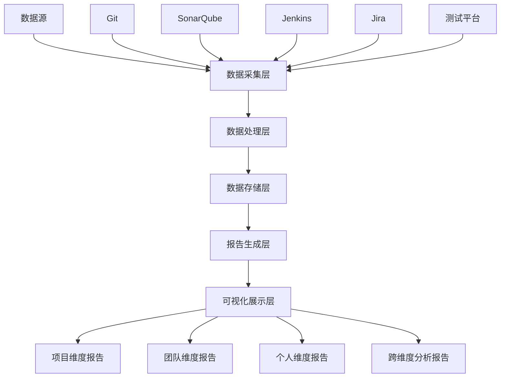

在工程效能平台中，集中化报告和历史趋势分析是帮助团队理解代码质量现状、识别问题模式、制定改进策略的重要工具。通过在项目、团队、个人等多个维度提供可视化的数据洞察，能够有效促进质量文化的建设。本章将深入探讨如何构建集中化报告系统，以及如何分析和展示历史趋势数据。

## 集中化报告系统的设计原则

### 1. 多维度数据整合

集中化报告系统需要整合来自不同工具和流程的数据，提供统一的视图。

#### 数据源整合架构


#### 数据整合实现
```java
// 数据整合服务
@Service
public class DataIntegrationService {
    
    @Autowired
    private GitDataService gitDataService;
    
    @Autowired
    private CodeQualityService codeQualityService;
    
    @Autowired
    private CiCdService ciCdService;
    
    @Autowired
    private IssueTrackingService issueTrackingService;
    
    public IntegratedReportData integrateAllData(ProjectContext context) {
        IntegratedReportData data = new IntegratedReportData();
        
        // 整合Git数据
        data.setGitData(gitDataService.getProjectData(context.getProjectId()));
        
        // 整合代码质量数据
        data.setCodeQualityData(codeQualityService.getProjectQualityData(
            context.getProjectId()));
        
        // 整合CI/CD数据
        data.setCiCdData(ciCdService.getProjectPipelineData(
            context.getProjectId()));
        
        // 整合问题跟踪数据
        data.setIssueData(issueTrackingService.getProjectIssues(
            context.getProjectId()));
        
        // 关联不同数据源
        correlateDataSources(data);
        
        return data;
    }
    
    private void correlateDataSources(IntegratedReportData data) {
        // 建立提交与质量问题的关联
        correlateCommitsWithIssues(data);
        
        // 建立构建与代码质量的关联
        correlateBuildsWithQuality(data);
        
        // 建立问题与团队成员的关联
        correlateIssuesWithTeamMembers(data);
    }
}
```

### 2. 实时与历史数据结合

报告系统需要同时提供实时数据和历史数据分析，满足不同场景的需求。

#### 实时数据处理
```java
// 实时数据处理服务
@Service
public class RealTimeDataService {
    
    @Autowired
    private WebSocketService webSocketService;
    
    @Autowired
    private CacheService cacheService;
    
    @EventListener
    public void handleCodeQualityEvent(CodeQualityEvent event) {
        // 更新缓存中的实时数据
        cacheService.updateRealTimeData(event.getProjectId(), event.getMetrics());
        
        // 通过WebSocket推送更新
        webSocketService.broadcastToProjectSubscribers(
            event.getProjectId(), 
            new RealTimeUpdate("code-quality", event.getMetrics()));
    }
    
    @EventListener
    public void handleCiCdEvent(CiCdEvent event) {
        // 更新构建状态
        cacheService.updateBuildStatus(event.getProjectId(), event.getBuildInfo());
        
        // 推送构建完成通知
        if (event.getBuildInfo().getStatus() == BuildStatus.COMPLETED) {
            webSocketService.broadcastToProjectSubscribers(
                event.getProjectId(), 
                new RealTimeUpdate("build-completed", event.getBuildInfo()));
        }
    }
    
    public RealTimeMetrics getRealTimeMetrics(String projectId) {
        return cacheService.getRealTimeData(projectId);
    }
}
```

## 项目维度报告

### 1. 项目健康度仪表板

为项目管理者提供全面的项目健康度视图。

#### 仪表板设计
```javascript
// 项目健康度仪表板组件
class ProjectHealthDashboard extends React.Component {
    constructor(props) {
        super(props);
        this.state = {
            projectData: null,
            loading: true,
            error: null
        };
    }
    
    componentDidMount() {
        this.loadProjectData();
        this.setupRealTimeUpdates();
    }
    
    loadProjectData() {
        fetch(`/api/projects/${this.props.projectId}/health`)
            .then(response => response.json())
            .then(data => {
                this.setState({ projectData: data, loading: false });
            })
            .catch(error => {
                this.setState({ error: error.message, loading: false });
            });
    }
    
    setupRealTimeUpdates() {
        const ws = new WebSocket(`ws://localhost:8080/ws/projects/${this.props.projectId}`);
        
        ws.onmessage = (event) => {
            const update = JSON.parse(event.data);
            this.handleRealTimeUpdate(update);
        };
        
        ws.onclose = () => {
            // 重新连接逻辑
            setTimeout(() => this.setupRealTimeUpdates(), 5000);
        };
    }
    
    render() {
        const { projectData, loading, error } = this.state;
        
        if (loading) return <div>Loading...</div>;
        if (error) return <div>Error: {error}</div>;
        if (!projectData) return <div>No data available</div>;
        
        return (
            <div className="project-health-dashboard">
                <h1>Project Health: {projectData.projectName}</h1>
                
                <div className="health-metrics">
                    <HealthMetricCard 
                        title="Code Quality"
                        value={projectData.codeQualityScore}
                        trend={projectData.codeQualityTrend}
                        status={this.getMetricStatus(projectData.codeQualityScore)}
                    />
                    
                    <HealthMetricCard 
                        title="Build Success Rate"
                        value={projectData.buildSuccessRate}
                        trend={projectData.buildSuccessTrend}
                        status={this.getMetricStatus(projectData.buildSuccessRate * 100)}
                    />
                    
                    <HealthMetricCard 
                        title="Test Coverage"
                        value={projectData.testCoverage}
                        trend={projectData.testCoverageTrend}
                        status={this.getMetricStatus(projectData.testCoverage)}
                    />
                    
                    <HealthMetricCard 
                        title="Security Issues"
                        value={projectData.securityIssues}
                        trend={projectData.securityIssuesTrend}
                        status={projectData.securityIssues > 0 ? 'critical' : 'good'}
                    />
                </div>
                
                <div className="detailed-charts">
                    <div className="chart-container">
                        <h3>Code Quality Trend</h3>
                        <LineChart data={projectData.qualityHistory} />
                    </div>
                    
                    <div className="chart-container">
                        <h3>Build Performance</h3>
                        <BarChart data={projectData.buildPerformance} />
                    </div>
                </div>
                
                <div className="recent-activity">
                    <h3>Recent Activity</h3>
                    <ActivityFeed activities={projectData.recentActivities} />
                </div>
            </div>
        );
    }
}
```

### 2. 项目质量趋势分析

分析项目质量指标的历史变化趋势，识别改进和退化模式。

#### 趋势分析实现
```java
// 项目质量趋势分析服务
@Service
public class ProjectTrendAnalysisService {
    
    @Autowired
    private QualityMetricsRepository metricsRepository;
    
    @Autowired
    private StatisticalAnalysisService statisticalAnalysisService;
    
    public ProjectTrendReport generateTrendReport(String projectId, 
                                               LocalDate startDate, 
                                               LocalDate endDate) {
        // 获取历史数据
        List<QualityMetric> historicalData = metricsRepository
            .findByProjectIdAndDateRange(projectId, startDate, endDate);
        
        ProjectTrendReport report = new ProjectTrendReport();
        report.setProjectId(projectId);
        report.setAnalysisPeriod(new DateRange(startDate, endDate));
        
        // 分析各指标趋势
        report.setCodeQualityTrend(analyzeCodeQualityTrend(historicalData));
        report.setTestCoverageTrend(analyzeTestCoverageTrend(historicalData));
        report.setSecurityIssuesTrend(analyzeSecurityIssuesTrend(historicalData));
        report.setTechnicalDebtTrend(analyzeTechnicalDebtTrend(historicalData));
        
        // 识别关键趋势点
        report.setKeyTrendPoints(identifyKeyTrendPoints(historicalData));
        
        // 生成趋势预测
        report.setTrendPredictions(generateTrendPredictions(historicalData));
        
        return report;
    }
    
    private TrendAnalysis analyzeCodeQualityTrend(List<QualityMetric> data) {
        List<QualityMetric> qualityMetrics = data.stream()
            .filter(metric -> metric.getMetricType() == MetricType.CODE_QUALITY_SCORE)
            .sorted(Comparator.comparing(QualityMetric::getTimestamp))
            .collect(Collectors.toList());
        
        if (qualityMetrics.isEmpty()) {
            return new TrendAnalysis(TrendDirection.FLAT, 0.0, 0.0);
        }
        
        // 计算趋势方向
        TrendDirection direction = calculateTrendDirection(qualityMetrics);
        
        // 计算趋势强度
        double strength = calculateTrendStrength(qualityMetrics);
        
        // 计算平均值变化
        double averageChange = calculateAverageChange(qualityMetrics);
        
        return new TrendAnalysis(direction, strength, averageChange);
    }
    
    private List<KeyTrendPoint> identifyKeyTrendPoints(List<QualityMetric> data) {
        List<KeyTrendPoint> keyPoints = new ArrayList<>();
        
        // 识别显著改善点
        List<QualityMetric> improvementPoints = identifySignificantImprovements(data);
        improvementPoints.forEach(metric -> 
            keyPoints.add(new KeyTrendPoint(
                metric.getTimestamp(), 
                TrendEventType.IMPROVEMENT, 
                metric.getMetricType(), 
                metric.getValue(),
                "Significant quality improvement detected")));
        
        // 识别显著退化点
        List<QualityMetric> degradationPoints = identifySignificantDegradations(data);
        degradationPoints.forEach(metric -> 
            keyPoints.add(new KeyTrendPoint(
                metric.getTimestamp(), 
                TrendEventType.DEGRADE, 
                metric.getMetricType(), 
                metric.getValue(),
                "Quality degradation detected")));
        
        return keyPoints;
    }
}
```

## 团队维度报告

### 1. 团队效能分析

从团队角度分析开发效能和质量表现。

#### 团队效能报告
```java
// 团队效能分析服务
@Service
public class TeamPerformanceAnalysisService {
    
    @Autowired
    private TeamRepository teamRepository;
    
    @Autowired
    private DeveloperMetricsService developerMetricsService;
    
    public TeamPerformanceReport generateTeamReport(String teamId, 
                                                 LocalDate startDate, 
                                                 LocalDate endDate) {
        Team team = teamRepository.findById(teamId);
        List<Developer> teamMembers = team.getMembers();
        
        TeamPerformanceReport report = new TeamPerformanceReport();
        report.setTeamId(teamId);
        report.setTeamName(team.getName());
        report.setAnalysisPeriod(new DateRange(startDate, endDate));
        
        // 收集团队成员个人数据
        List<DeveloperMetrics> memberMetrics = teamMembers.stream()
            .map(member -> developerMetricsService.getMetrics(
                member.getId(), startDate, endDate))
            .collect(Collectors.toList());
        
        // 计算团队整体指标
        report.setTeamCodeQualityScore(calculateTeamAverage(memberMetrics, 
            DeveloperMetrics::getCodeQualityScore));
        report.setTeamTestCoverage(calculateTeamAverage(memberMetrics, 
            DeveloperMetrics::getTestCoverage));
        report.setTeamCommitFrequency(calculateTeamAverage(memberMetrics, 
            DeveloperMetrics::getCommitFrequency));
        
        // 分析团队协作模式
        report.setCollaborationMetrics(analyzeTeamCollaboration(team, memberMetrics));
        
        // 识别团队优势和改进点
        report.setStrengths(identifyTeamStrengths(memberMetrics));
        report.setImprovementAreas(identifyTeamImprovementAreas(memberMetrics));
        
        // 生成团队排名
        report.setTeamRanking(generateTeamRanking(teamId));
        
        return report;
    }
    
    private double calculateTeamAverage(List<DeveloperMetrics> metrics, 
                                     ToDoubleFunction<DeveloperMetrics> extractor) {
        return metrics.stream()
            .mapToDouble(extractor)
            .average()
            .orElse(0.0);
    }
    
    private CollaborationMetrics analyzeTeamCollaboration(Team team, 
                                                       List<DeveloperMetrics> memberMetrics) {
        CollaborationMetrics collaboration = new CollaborationMetrics();
        
        // 分析代码评审参与度
        double avgReviewParticipation = memberMetrics.stream()
            .mapToDouble(DeveloperMetrics::getReviewParticipationRate)
            .average()
            .orElse(0.0);
        collaboration.setReviewParticipationRate(avgReviewParticipation);
        
        // 分析知识分享情况
        double knowledgeSharingScore = memberMetrics.stream()
            .mapToDouble(DeveloperMetrics::getKnowledgeSharingScore)
            .average()
            .orElse(0.0);
        collaboration.setKnowledgeSharingScore(knowledgeSharingScore);
        
        // 分析跨模块贡献
        Set<String> modules = memberMetrics.stream()
            .flatMap(metrics -> metrics.getContributedModules().stream())
            .collect(Collectors.toSet());
        collaboration.setModuleCoverage((double) modules.size() / team.getTotalModules());
        
        return collaboration;
    }
}
```

### 2. 团队对比分析

对比不同团队的表现，识别最佳实践和改进机会。

#### 团队对比实现
```java
// 团队对比分析服务
@Service
public class TeamComparisonService {
    
    @Autowired
    private TeamPerformanceAnalysisService performanceAnalysisService;
    
    public TeamComparisonReport compareTeams(List<String> teamIds, 
                                          LocalDate startDate, 
                                          LocalDate endDate) {
        TeamComparisonReport report = new TeamComparisonReport();
        report.setAnalysisPeriod(new DateRange(startDate, endDate));
        
        // 获取各团队报告
        List<TeamPerformanceReport> teamReports = teamIds.stream()
            .map(teamId -> performanceAnalysisService.generateTeamReport(
                teamId, startDate, endDate))
            .collect(Collectors.toList());
        
        report.setTeamReports(teamReports);
        
        // 计算各项指标的团队排名
        report.setCodeQualityRanking(rankTeamsByMetric(teamReports, 
            TeamPerformanceReport::getTeamCodeQualityScore));
        report.setTestCoverageRanking(rankTeamsByMetric(teamReports, 
            TeamPerformanceReport::getTeamTestCoverage));
        report.setDeliverySpeedRanking(rankTeamsByMetric(teamReports, 
            TeamPerformanceReport::getTeamDeliverySpeed));
        
        // 识别表现最佳的团队
        report.setTopPerformingTeams(identifyTopPerformingTeams(teamReports));
        
        // 识别需要关注的团队
        report.setTeamsNeedingAttention(identifyTeamsNeedingAttention(teamReports));
        
        // 提取最佳实践
        report.setBestPractices(extractBestPractices(teamReports));
        
        return report;
    }
    
    private List<TeamRanking> rankTeamsByMetric(List<TeamPerformanceReport> reports, 
                                             ToDoubleFunction<TeamPerformanceReport> metricExtractor) {
        return reports.stream()
            .sorted(Comparator.comparingDouble(metricExtractor).reversed())
            .map(report -> new TeamRanking(
                report.getTeamId(), 
                report.getTeamName(), 
                metricExtractor.applyAsDouble(report)))
            .collect(Collectors.toList());
    }
}
```

## 个人维度报告

### 1. 个人效能画像

为开发者提供个人效能和质量表现的详细分析。

#### 个人报告实现
```java
// 个人效能分析服务
@Service
public class PersonalPerformanceService {
    
    @Autowired
    private GitDataService gitDataService;
    
    @Autowired
    private CodeQualityService codeQualityService;
    
    @Autowired
    private PeerReviewService peerReviewService;
    
    public PersonalPerformanceReport generatePersonalReport(String developerId, 
                                                         LocalDate startDate, 
                                                         LocalDate endDate) {
        PersonalPerformanceReport report = new PersonalPerformanceReport();
        report.setDeveloperId(developerId);
        report.setAnalysisPeriod(new DateRange(startDate, endDate));
        
        // 获取开发者基本信息
        Developer developer = developerRepository.findById(developerId);
        report.setDeveloperName(developer.getName());
        report.setTeamId(developer.getTeamId());
        
        // 分析代码贡献
        CodeContributionMetrics contributionMetrics = gitDataService
            .getDeveloperContributionMetrics(developerId, startDate, endDate);
        report.setContributionMetrics(contributionMetrics);
        
        // 分析代码质量
        CodeQualityMetrics qualityMetrics = codeQualityService
            .getDeveloperQualityMetrics(developerId, startDate, endDate);
        report.setQualityMetrics(qualityMetrics);
        
        // 分析评审活动
        ReviewMetrics reviewMetrics = peerReviewService
            .getDeveloperReviewMetrics(developerId, startDate, endDate);
        report.setReviewMetrics(reviewMetrics);
        
        // 计算综合评分
        report.setOverallScore(calculateOverallScore(contributionMetrics, 
            qualityMetrics, reviewMetrics));
        
        // 生成成长建议
        report.setGrowthSuggestions(generateGrowthSuggestions(report));
        
        // 与团队平均水平对比
        report.setTeamComparison(compareWithTeamAverage(developerId, report));
        
        return report;
    }
    
    private double calculateOverallScore(CodeContributionMetrics contribution, 
                                      CodeQualityMetrics quality, 
                                      ReviewMetrics review) {
        // 加权计算综合评分
        double contributionScore = contribution.getCommitFrequency() * 0.3;
        double qualityScore = quality.getAverageQualityScore() * 0.4;
        double reviewScore = (review.getReviewParticipationRate() + 
            review.getReviewQualityScore()) / 2 * 0.3;
        
        return contributionScore + qualityScore + reviewScore;
    }
    
    private List<GrowthSuggestion> generateGrowthSuggestions(PersonalPerformanceReport report) {
        List<GrowthSuggestion> suggestions = new ArrayList<>();
        
        // 基于代码质量的建议
        if (report.getQualityMetrics().getAverageQualityScore() < 70) {
            suggestions.add(new GrowthSuggestion(
                "improve-code-quality",
                "Focus on improving code quality",
                "Consider reviewing coding standards and participating in code reviews",
                Priority.HIGH
            ));
        }
        
        // 基于测试覆盖率的建议
        if (report.getQualityMetrics().getAverageTestCoverage() < 80) {
            suggestions.add(new GrowthSuggestion(
                "increase-test-coverage",
                "Improve test coverage",
                "Write more unit tests and integration tests for your code",
                Priority.MEDIUM
            ));
        }
        
        // 基于评审参与度的建议
        if (report.getReviewMetrics().getReviewParticipationRate() < 0.5) {
            suggestions.add(new GrowthSuggestion(
                "increase-review-participation",
                "Participate more in code reviews",
                "Actively participate in code reviews to learn from peers",
                Priority.MEDIUM
            ));
        }
        
        return suggestions;
    }
}
```

### 2. 个人成长轨迹

跟踪开发者个人的成长历程和改进情况。

#### 成长轨迹实现
```java
// 个人成长轨迹服务
@Service
public class DeveloperGrowthTrackingService {
    
    @Autowired
    private PersonalPerformanceService performanceService;
    
    public DeveloperGrowthReport generateGrowthReport(String developerId, 
                                                   int months) {
        DeveloperGrowthReport report = new DeveloperGrowthReport();
        report.setDeveloperId(developerId);
        
        LocalDate endDate = LocalDate.now();
        LocalDate startDate = endDate.minusMonths(months);
        
        // 按月生成个人报告
        List<MonthlyPerformance> monthlyPerformances = new ArrayList<>();
        for (int i = 0; i < months; i++) {
            LocalDate monthStart = startDate.plusMonths(i);
            LocalDate monthEnd = monthStart.plusMonths(1).minusDays(1);
            
            PersonalPerformanceReport monthlyReport = performanceService
                .generatePersonalReport(developerId, monthStart, monthEnd);
            
            monthlyPerformances.add(new MonthlyPerformance(
                monthStart, 
                monthlyReport.getOverallScore(),
                monthlyReport.getQualityMetrics().getAverageQualityScore(),
                monthlyReport.getContributionMetrics().getCommitFrequency()
            ));
        }
        
        report.setMonthlyPerformances(monthlyPerformances);
        
        // 计算成长趋势
        report.setGrowthTrend(calculateGrowthTrend(monthlyPerformances));
        
        // 识别关键成长点
        report.setKeyGrowthPoints(identifyKeyGrowthPoints(monthlyPerformances));
        
        // 生成成长预测
        report.setGrowthProjection(projectGrowth(monthlyPerformances));
        
        return report;
    }
    
    private GrowthTrend calculateGrowthTrend(List<MonthlyPerformance> performances) {
        if (performances.size() < 2) {
            return new GrowthTrend(GrowthDirection.FLAT, 0.0);
        }
        
        double firstScore = performances.get(0).getOverallScore();
        double lastScore = performances.get(performances.size() - 1).getOverallScore();
        double growthRate = (lastScore - firstScore) / firstScore * 100;
        
        GrowthDirection direction = growthRate > 5 ? GrowthDirection.UP : 
                                  growthRate < -5 ? GrowthDirection.DOWN : 
                                  GrowthDirection.FLAT;
        
        return new GrowthTrend(direction, growthRate);
    }
}
```

## 报告可视化与交互

### 1. 交互式报告界面

提供交互式的报告界面，支持钻取和过滤操作。

#### 交互式界面实现
```javascript
// 交互式报告组件
class InteractiveReport extends React.Component {
    constructor(props) {
        super(props);
        this.state = {
            selectedDimension: 'project',
            selectedTimeRange: 'last30days',
            filters: {},
            reportData: null
        };
    }
    
    handleDimensionChange(dimension) {
        this.setState({ selectedDimension: dimension }, () => {
            this.loadReportData();
        });
    }
    
    handleTimeRangeChange(timeRange) {
        this.setState({ selectedTimeRange: timeRange }, () => {
            this.loadReportData();
        });
    }
    
    applyFilters(filters) {
        this.setState({ filters: filters }, () => {
            this.loadReportData();
        });
    }
    
    loadReportData() {
        const { selectedDimension, selectedTimeRange, filters } = this.state;
        
        const params = new URLSearchParams({
            dimension: selectedDimension,
            timeRange: selectedTimeRange,
            ...filters
        });
        
        fetch(`/api/reports?${params}`)
            .then(response => response.json())
            .then(data => {
                this.setState({ reportData: data });
            });
    }
    
    render() {
        const { selectedDimension, reportData } = this.state;
        
        return (
            <div className="interactive-report">
                <div className="report-controls">
                    <DimensionSelector 
                        selectedDimension={selectedDimension}
                        onChange={this.handleDimensionChange.bind(this)}
                    />
                    
                    <TimeRangeSelector 
                        onChange={this.handleTimeRangeChange.bind(this)}
                    />
                    
                    <FilterPanel 
                        dimension={selectedDimension}
                        onApply={this.applyFilters.bind(this)}
                    />
                </div>
                
                <div className="report-content">
                    {reportData && (
                        <ReportVisualization 
                            data={reportData}
                            dimension={selectedDimension}
                        />
                    )}
                </div>
            </div>
        );
    }
}
```

### 2. 自动化报告生成

实现定期自动生成和分发报告的机制。

#### 自动化报告实现
```java
// 自动化报告服务
@Service
public class AutomatedReportingService {
    
    @Autowired
    private ReportGenerationService reportGenerationService;
    
    @Autowired
    private NotificationService notificationService;
    
    @Scheduled(cron = "0 0 9 * * MON") // 每周一上午9点执行
    public void generateWeeklyReports() {
        List<Project> projects = projectRepository.findAllActive();
        
        for (Project project : projects) {
            try {
                // 生成项目周报
                ProjectReport report = reportGenerationService
                    .generateProjectWeeklyReport(project.getId());
                
                // 发送报告给项目团队
                sendProjectReport(project, report);
                
            } catch (Exception e) {
                log.error("Failed to generate weekly report for project: " + 
                         project.getId(), e);
            }
        }
    }
    
    @Scheduled(cron = "0 0 10 1 * ?") // 每月1日上午10点执行
    public void generateMonthlyReports() {
        List<Team> teams = teamRepository.findAll();
        
        for (Team team : teams) {
            try {
                // 生成团队月报
                TeamPerformanceReport report = reportGenerationService
                    .generateTeamMonthlyReport(team.getId());
                
                // 发送报告给团队负责人
                sendTeamReport(team, report);
                
            } catch (Exception e) {
                log.error("Failed to generate monthly report for team: " + 
                         team.getId(), e);
            }
        }
    }
    
    private void sendProjectReport(Project project, ProjectReport report) {
        List<String> recipientEmails = project.getTeamMembers().stream()
            .map(member -> member.getEmail())
            .collect(Collectors.toList());
        
        notificationService.sendEmail(
            recipientEmails,
            "Weekly Project Report: " + project.getName(),
            generateProjectReportContent(report),
            generateProjectReportAttachment(report)
        );
    }
}
```

## 历史趋势分析与预测

### 1. 趋势分析算法

实现专业的趋势分析算法，识别数据模式和异常点。

#### 趋势分析实现
```java
// 趋势分析服务
@Service
public class TrendAnalysisService {
    
    public TrendAnalysisResult analyzeTrend(List<TimeSeriesDataPoint> dataPoints) {
        TrendAnalysisResult result = new TrendAnalysisResult();
        
        // 计算基本统计信息
        result.setBasicStats(calculateBasicStats(dataPoints));
        
        // 识别趋势模式
        result.setTrendPattern(identifyTrendPattern(dataPoints));
        
        // 检测异常点
        result.setAnomalies(detectAnomalies(dataPoints));
        
        // 计算趋势强度
        result.setTrendStrength(calculateTrendStrength(dataPoints));
        
        return result;
    }
    
    private TrendPattern identifyTrendPattern(List<TimeSeriesDataPoint> dataPoints) {
        if (dataPoints.size() < 3) {
            return TrendPattern.UNKNOWN;
        }
        
        // 使用线性回归分析趋势
        double[] xValues = dataPoints.stream()
            .mapToDouble(point -> point.getTimestamp().toEpochMilli())
            .toArray();
        double[] yValues = dataPoints.stream()
            .mapToDouble(TimeSeriesDataPoint::getValue)
            .toArray();
        
        LinearRegressionResult regression = performLinearRegression(xValues, yValues);
        
        // 根据回归系数判断趋势
        if (Math.abs(regression.getSlope()) < 0.001) {
            return TrendPattern.FLAT;
        } else if (regression.getSlope() > 0) {
            return TrendPattern.UPWARD;
        } else {
            return TrendPattern.DOWNWARD;
        }
    }
    
    private List<Anomaly> detectAnomalies(List<TimeSeriesDataPoint> dataPoints) {
        List<Anomaly> anomalies = new ArrayList<>();
        
        // 计算均值和标准差
        DoubleSummaryStatistics stats = dataPoints.stream()
            .mapToDouble(TimeSeriesDataPoint::getValue)
            .summaryStatistics();
        
        double mean = stats.getAverage();
        double stdDev = calculateStandardDeviation(dataPoints, mean);
        
        // 识别超过2个标准差的异常点
        for (TimeSeriesDataPoint point : dataPoints) {
            double deviation = Math.abs(point.getValue() - mean);
            if (deviation > 2 * stdDev) {
                anomalies.add(new Anomaly(
                    point.getTimestamp(),
                    point.getValue(),
                    deviation / stdDev,
                    AnomalyType.STATISTICAL
                ));
            }
        }
        
        return anomalies;
    }
}
```

### 2. 趋势预测模型

基于历史数据预测未来趋势，为决策提供支持。

#### 预测模型实现
```java
// 趋势预测服务
@Service
public class TrendPredictionService {
    
    public PredictionResult predictFutureTrend(List<HistoricalDataPoint> historicalData, 
                                            int predictionPeriod) {
        PredictionResult result = new PredictionResult();
        
        // 选择合适的预测模型
        PredictionModel model = selectPredictionModel(historicalData);
        
        // 训练模型
        model.train(historicalData);
        
        // 生成预测
        List<PredictedDataPoint> predictions = model.predict(predictionPeriod);
        result.setPredictions(predictions);
        
        // 计算预测置信度
        result.setConfidenceLevel(calculateConfidenceLevel(model, historicalData));
        
        // 生成预测区间
        result.setPredictionIntervals(generatePredictionIntervals(predictions, 
            result.getConfidenceLevel()));
        
        return result;
    }
    
    private PredictionModel selectPredictionModel(List<HistoricalDataPoint> data) {
        // 根据数据特征选择模型
        DataCharacteristics characteristics = analyzeDataCharacteristics(data);
        
        if (characteristics.hasSeasonality()) {
            return new SeasonalARIMAModel();
        } else if (characteristics.hasTrend()) {
            return new LinearTrendModel();
        } else {
            return new MovingAverageModel();
        }
    }
    
    private double calculateConfidenceLevel(PredictionModel model, 
                                        List<HistoricalDataPoint> historicalData) {
        // 使用历史数据验证模型准确性
        List<HistoricalDataPoint> trainingData = historicalData.subList(
            0, (int) (historicalData.size() * 0.8));
        List<HistoricalDataPoint> validationData = historicalData.subList(
            (int) (historicalData.size() * 0.8), historicalData.size());
        
        model.train(trainingData);
        
        double totalError = 0;
        for (HistoricalDataPoint actual : validationData) {
            PredictedDataPoint predicted = model.predictSingle(actual.getTimestamp());
            double error = Math.abs(predicted.getValue() - actual.getValue());
            totalError += error;
        }
        
        double averageError = totalError / validationData.size();
        double confidence = 1.0 - (averageError / getAverageValue(historicalData));
        
        return Math.max(0.0, Math.min(1.0, confidence));
    }
}
```

## 总结

集中化报告与历史趋势分析是工程效能平台的重要组成部分，通过在项目、团队、个人等多个维度提供数据洞察，能够有效促进质量文化的建设。

关键要点包括：

1. **多维度数据整合**：整合来自不同工具和流程的数据，提供统一视图
2. **实时与历史结合**：同时提供实时数据和历史趋势分析
3. **项目维度报告**：为项目管理者提供全面的项目健康度视图
4. **团队维度报告**：分析团队效能和协作模式
5. **个人维度报告**：为开发者提供个人效能画像和成长建议
6. **交互式可视化**：提供交互式的报告界面，支持钻取和过滤
7. **自动化报告**：实现定期自动生成和分发报告
8. **趋势分析与预测**：识别数据模式并预测未来趋势

通过建立完善的集中化报告系统，团队能够更好地理解代码质量现状，识别改进机会，并基于数据做出明智的决策。

在下一节中，我们将探讨技术债管理与量化，包括如何评估、认领和跟踪技术债。