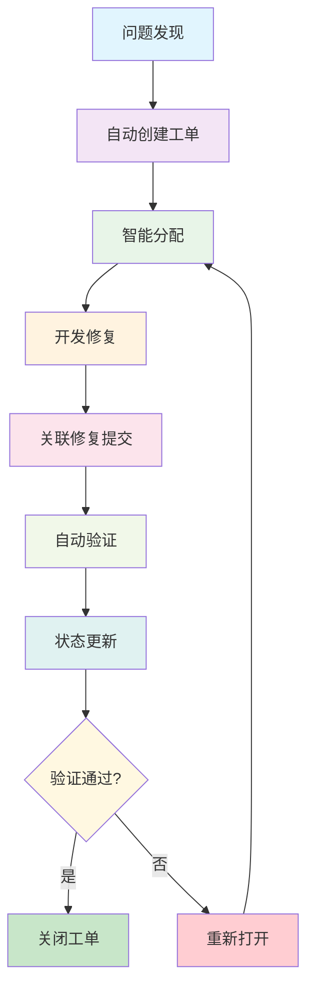

在现代软件开发中，缺陷和安全漏洞的管理是确保软件质量和安全性的关键环节。传统的缺陷管理方式往往存在效率低下、跟踪困难、闭环不完整等问题。通过建立自动化的闭环管理机制，能够显著提升缺陷和漏洞的处理效率，确保问题得到及时修复和验证。本章将深入探讨如何实现缺陷与漏洞的闭环管理，包括自动创建工单、关联修复提交等关键实践。

## 缺陷与漏洞闭环管理的核心概念

### 1. 闭环管理的定义与价值

闭环管理是指从缺陷或漏洞的发现、记录、分配、修复、验证到关闭的完整生命周期管理过程。每个环节都有明确的责任人和时间节点，确保问题得到彻底解决。

#### 闭环管理的价值


### 2. 闭环管理的关键要素

成功的闭环管理需要具备以下几个关键要素：

#### 状态流转机制
```java
// 缺陷状态枚举
public enum DefectStatus {
    // 新发现
    NEW("新建", "缺陷刚刚被发现和记录"),
    
    // 已确认
    CONFIRMED("已确认", "缺陷已被确认为有效问题"),
    
    // 已分配
    ASSIGNED("已分配", "缺陷已分配给具体的开发人员"),
    
    // 修复中
    IN_PROGRESS("修复中", "开发人员正在修复该缺陷"),
    
    // 已修复
    FIXED("已修复", "开发人员已完成修复工作"),
    
    // 已验证
    VERIFIED("已验证", "测试人员已验证修复结果"),
    
    // 已关闭
    CLOSED("已关闭", "缺陷已完全解决并关闭"),
    
    // 重新打开
    REOPENED("重新打开", "验证未通过，需要重新修复"),
    
    // 拒绝
    REJECTED("已拒绝", "确认不是有效缺陷或不修复");
    
    private final String displayName;
    private final String description;
    
    DefectStatus(String displayName, String description) {
        this.displayName = displayName;
        this.description = description;
    }
    
    public String getDisplayName() { return displayName; }
    public String getDescription() { return description; }
}
```

## 自动化工单创建机制

### 1. 多渠道缺陷发现

建立多渠道的缺陷发现机制，确保各类问题都能被及时捕获。

#### 缺陷发现服务
```java
// 缺陷发现与工单创建服务
@Service
public class DefectDiscoveryService {
    
    @Autowired
    private IssueTrackingService issueTrackingService;
    
    @Autowired
    private CodeAnalysisService codeAnalysisService;
    
    @Autowired
    private TestResultService testResultService;
    
    @Autowired
    private SecurityScanService securityScanService;
    
    public void discoverAndCreateDefects(String projectId) {
        // 1. 代码静态分析发现的缺陷
        List<CodeDefect> codeDefects = codeAnalysisService
            .findDefects(projectId);
        createDefectIssues(projectId, codeDefects, DefectSource.CODE_ANALYSIS);
        
        // 2. 自动化测试发现的缺陷
        List<TestDefect> testDefects = testResultService
            .findTestDefects(projectId);
        createDefectIssues(projectId, testDefects, DefectSource.AUTOMATED_TEST);
        
        // 3. 安全扫描发现的漏洞
        List<SecurityVulnerability> vulnerabilities = securityScanService
            .findVulnerabilities(projectId);
        createDefectIssues(projectId, vulnerabilities, DefectSource.SECURITY_SCAN);
        
        // 4. 生产环境监控发现的问题
        List<ProductionIssue> productionIssues = monitorProductionIssues(projectId);
        createDefectIssues(projectId, productionIssues, DefectSource.PRODUCTION_MONITORING);
    }
    
    private <T extends Defect> void createDefectIssues(String projectId, 
                                                    List<T> defects, 
                                                    DefectSource source) {
        for (T defect : defects) {
            // 检查是否已存在相同缺陷
            if (issueTrackingService.existsSimilarDefect(projectId, defect)) {
                continue;
            }
            
            // 创建工单
            Issue issue = Issue.builder()
                .projectId(projectId)
                .title(generateIssueTitle(defect))
                .description(generateIssueDescription(defect))
                .type(determineIssueType(defect))
                .priority(determinePriority(defect))
                .severity(determineSeverity(defect))
                .source(source)
                .detectedAt(Instant.now())
                .status(IssueStatus.NEW)
                .assignee(findAppropriateAssignee(defect))
                .labels(generateLabels(defect))
                .build();
            
            // 保存工单
            Issue savedIssue = issueTrackingService.createIssue(issue);
            
            // 关联原始缺陷数据
            linkDefectData(savedIssue.getId(), defect);
            
            // 发送通知
            notifyStakeholders(savedIssue);
        }
    }
    
    private String generateIssueTitle(Defect defect) {
        if (defect instanceof CodeDefect) {
            CodeDefect codeDefect = (CodeDefect) defect;
            return String.format("[%s] %s in %s:%d", 
                codeDefect.getRuleId(),
                codeDefect.getMessage(),
                codeDefect.getFileName(),
                codeDefect.getLineNumber());
        } else if (defect instanceof SecurityVulnerability) {
            SecurityVulnerability vuln = (SecurityVulnerability) defect;
            return String.format("[SECURITY] %s: %s", 
                vuln.getVulnerabilityId(),
                vuln.getDescription());
        }
        // ... 其他类型缺陷的标题生成
        return defect.getMessage();
    }
}
```

### 2. 智能工单分类与优先级设定

通过智能算法自动分类工单并设定合理的优先级。

#### 智能分类服务
```java
// 智能工单分类与优先级服务
@Service
public class IntelligentIssueClassificationService {
    
    @Autowired
    private MLModelService mlModelService;
    
    @Autowired
    private RuleBasedClassificationService ruleService;
    
    public ClassifiedIssue classifyAndPrioritize(Issue issue) {
        // 1. 基于规则的分类
        ClassifiedIssue ruleBasedClassification = ruleService.classify(issue);
        
        // 2. 基于机器学习的分类
        ClassifiedIssue mlClassification = mlModelService.classify(issue);
        
        // 3. 综合两种分类结果
        ClassifiedIssue finalClassification = combineClassifications(
            ruleBasedClassification, mlClassification);
        
        // 4. 设定优先级
        Priority priority = determinePriority(finalClassification);
        finalClassification.setPriority(priority);
        
        // 5. 设定严重程度
        Severity severity = determineSeverity(finalClassification);
        finalClassification.setSeverity(severity);
        
        return finalClassification;
    }
    
    private Priority determinePriority(ClassifiedIssue classifiedIssue) {
        // 基于多个因素综合判断优先级
        
        // 1. 严重程度权重 (40%)
        double severityScore = getSeverityScore(classifiedIssue.getSeverity()) * 0.4;
        
        // 2. 影响范围权重 (30%)
        double impactScore = getImpactScore(classifiedIssue.getImpact()) * 0.3;
        
        // 3. 业务价值权重 (20%)
        double businessValueScore = getBusinessValueScore(classifiedIssue.getBusinessValue()) * 0.2;
        
        // 4. 技术复杂度权重 (10%)
        double complexityScore = getComplexityScore(classifiedIssue.getComplexity()) * 0.1;
        
        double totalScore = severityScore + impactScore + businessValueScore + complexityScore;
        
        if (totalScore >= 8.0) {
            return Priority.CRITICAL;
        } else if (totalScore >= 6.0) {
            return Priority.HIGH;
        } else if (totalScore >= 4.0) {
            return Priority.MEDIUM;
        } else {
            return Priority.LOW;
        }
    }
    
    private double getSeverityScore(Severity severity) {
        switch (severity) {
            case BLOCKER: return 10.0;
            case CRITICAL: return 8.0;
            case MAJOR: return 6.0;
            case MINOR: return 4.0;
            case TRIVIAL: return 2.0;
            default: return 5.0;
        }
    }
    
    private double getImpactScore(Impact impact) {
        switch (impact) {
            case SYSTEM_WIDE: return 10.0;
            case MODULE: return 7.0;
            case COMPONENT: return 5.0;
            case INDIVIDUAL: return 2.0;
            default: return 5.0;
        }
    }
}
```

## 修复提交关联机制

### 1. 提交信息解析与关联

通过解析Git提交信息，自动关联修复提交与对应的工单。

#### 提交关联服务
```java
// 修复提交关联服务
@Service
public class FixCommitAssociationService {
    
    @Autowired
    private GitService gitService;
    
    @Autowired
    private IssueTrackingService issueTrackingService;
    
    @EventListener
    public void handleCommitEvent(CommitEvent event) {
        // 解析提交信息
        CommitMessage parsedMessage = parseCommitMessage(event.getCommitMessage());
        
        if (parsedMessage.getReferencedIssues().isEmpty()) {
            return;
        }
        
        // 关联提交与工单
        for (String issueKey : parsedMessage.getReferencedIssues()) {
            associateCommitWithIssue(event.getCommitId(), issueKey, event);
        }
    }
    
    private CommitMessage parseCommitMessage(String commitMessage) {
        CommitMessage message = new CommitMessage();
        message.setRawMessage(commitMessage);
        
        // 解析引用的工单号
        Pattern issuePattern = Pattern.compile("#([A-Z]+-\\d+)");
        Matcher matcher = issuePattern.matcher(commitMessage);
        
        List<String> referencedIssues = new ArrayList<>();
        while (matcher.find()) {
            referencedIssues.add(matcher.group(1));
        }
        message.setReferencedIssues(referencedIssues);
        
        // 解析提交类型
        if (commitMessage.toLowerCase().contains("fix")) {
            message.setType(CommitType.FIX);
        } else if (commitMessage.toLowerCase().contains("feat")) {
            message.setType(CommitType.FEATURE);
        } else {
            message.setType(CommitType.OTHER);
        }
        
        return message;
    }
    
    private void associateCommitWithIssue(String commitId, String issueKey, CommitEvent event) {
        try {
            // 获取工单信息
            Issue issue = issueTrackingService.getIssueByKey(issueKey);
            
            if (issue == null) {
                log.warn("Referenced issue {} not found for commit {}", issueKey, commitId);
                return;
            }
            
            // 创建关联记录
            CommitIssueAssociation association = CommitIssueAssociation.builder()
                .commitId(commitId)
                .issueId(issue.getId())
                .commitMessage(event.getCommitMessage())
                .author(event.getAuthor())
                .committedAt(event.getCommittedAt())
                .build();
            
            // 保存关联关系
            issueTrackingService.associateCommitWithIssue(association);
            
            // 更新工单状态
            updateIssueStatusForFix(issue, commitId);
            
            // 发送通知
            notifyIssueAssignee(issue, commitId);
            
        } catch (Exception e) {
            log.error("Failed to associate commit {} with issue {}", commitId, issueKey, e);
        }
    }
    
    private void updateIssueStatusForFix(Issue issue, String commitId) {
        // 如果工单状态是ASSIGNED或IN_PROGRESS，则更新为FIXED
        if (issue.getStatus() == IssueStatus.ASSIGNED || 
            issue.getStatus() == IssueStatus.IN_PROGRESS) {
            
            IssueStatusUpdate update = IssueStatusUpdate.builder()
                .issueId(issue.getId())
                .newStatus(IssueStatus.FIXED)
                .comment(String.format("Fixed in commit %s", commitId))
                .updatedBy("system")
                .build();
            
            issueTrackingService.updateIssueStatus(update);
        }
    }
}
```

### 2. 代码变更影响分析

分析代码变更的影响范围，自动识别可能引入的新缺陷。

#### 影响分析服务
```java
// 代码变更影响分析服务
@Service
public class CodeChangeImpactAnalysisService {
    
    @Autowired
    private GitService gitService;
    
    @Autowired
    private CodeAnalysisService codeAnalysisService;
    
    @Autowired
    private DependencyAnalysisService dependencyService;
    
    public ImpactAnalysisResult analyzeImpact(String commitId) {
        ImpactAnalysisResult result = new ImpactAnalysisResult();
        result.setCommitId(commitId);
        
        // 获取变更的文件
        List<ChangedFile> changedFiles = gitService.getChangedFiles(commitId);
        result.setChangedFiles(changedFiles);
        
        // 分析直接影响
        List<ImpactedComponent> directImpacts = analyzeDirectImpact(changedFiles);
        result.setDirectImpacts(directImpacts);
        
        // 分析间接影响（依赖关系）
        List<ImpactedComponent> indirectImpacts = analyzeIndirectImpact(changedFiles);
        result.setIndirectImpacts(indirectImpacts);
        
        // 分析潜在缺陷
        List<PotentialDefect> potentialDefects = identifyPotentialDefects(changedFiles);
        result.setPotentialDefects(potentialDefects);
        
        // 评估风险等级
        RiskLevel riskLevel = assessRiskLevel(directImpacts, indirectImpacts, potentialDefects);
        result.setRiskLevel(riskLevel);
        
        return result;
    }
    
    private List<ImpactedComponent> analyzeDirectImpact(List<ChangedFile> changedFiles) {
        List<ImpactedComponent> impacts = new ArrayList<>();
        
        for (ChangedFile file : changedFiles) {
            // 分析文件的业务功能
            Component component = identifyComponent(file.getFilePath());
            
            // 分析变更类型
            ChangeType changeType = analyzeChangeType(file);
            
            impacts.add(ImpactedComponent.builder()
                .componentId(component.getId())
                .componentName(component.getName())
                .filePath(file.getFilePath())
                .changeType(changeType)
                .linesChanged(file.getLinesAdded() + file.getLinesDeleted())
                .build());
        }
        
        return impacts;
    }
    
    private List<ImpactedComponent> analyzeIndirectImpact(List<ChangedFile> changedFiles) {
        List<ImpactedComponent> impacts = new ArrayList<>();
        
        // 获取变更文件的依赖关系
        Set<String> changedComponents = changedFiles.stream()
            .map(file -> identifyComponent(file.getFilePath()).getId())
            .collect(Collectors.toSet());
        
        // 查找依赖这些组件的其他组件
        for (String componentId : changedComponents) {
            List<Component> dependentComponents = dependencyService
                .findDependentComponents(componentId);
            
            for (Component dependent : dependentComponents) {
                impacts.add(ImpactedComponent.builder()
                    .componentId(dependent.getId())
                    .componentName(dependent.getName())
                    .dependencyOn(componentId)
                    .changeType(ChangeType.INDIRECT)
                    .build());
            }
        }
        
        return impacts;
    }
    
    private List<PotentialDefect> identifyPotentialDefects(List<ChangedFile> changedFiles) {
        List<PotentialDefect> potentialDefects = new ArrayList<>();
        
        for (ChangedFile file : changedFiles) {
            // 对变更的代码进行静态分析
            List<CodeIssue> issues = codeAnalysisService.analyzeFileChanges(
                file.getFilePath(), file.getDiff());
            
            for (CodeIssue issue : issues) {
                potentialDefects.add(PotentialDefect.builder()
                    .filePath(file.getFilePath())
                    .lineNumber(issue.getLineNumber())
                    .issueType(issue.getType())
                    .severity(issue.getSeverity())
                    .message(issue.getMessage())
                    .confidence(issue.getConfidence())
                    .build());
            }
        }
        
        return potentialDefects;
    }
}
```

## 自动验证与状态更新

### 1. 修复验证机制

建立自动化的修复验证机制，确保修复的有效性。

#### 自动验证服务
```java
// 修复自动验证服务
@Service
public class FixVerificationService {
    
    @Autowired
    private TestExecutionService testService;
    
    @Autowired
    private IssueTrackingService issueTrackingService;
    
    @Autowired
    private NotificationService notificationService;
    
    public VerificationResult verifyFix(String issueId) {
        Issue issue = issueTrackingService.getIssueById(issueId);
        
        if (issue.getStatus() != IssueStatus.FIXED) {
            throw new IllegalStateException("Issue is not in FIXED status");
        }
        
        VerificationResult result = new VerificationResult();
        result.setIssueId(issueId);
        result.setVerificationStartedAt(Instant.now());
        
        try {
            // 1. 执行回归测试
            TestExecutionResult regressionTestResult = executeRegressionTests(issue);
            result.setRegressionTestResult(regressionTestResult);
            
            // 2. 执行特定测试用例
            TestExecutionResult specificTestResult = executeSpecificTests(issue);
            result.setSpecificTestResult(specificTestResult);
            
            // 3. 执行安全扫描（如果是安全漏洞）
            if (isSecurityIssue(issue)) {
                SecurityScanResult securityScanResult = executeSecurityScan(issue);
                result.setSecurityScanResult(securityScanResult);
            }
            
            // 4. 检查代码质量
            CodeQualityResult codeQualityResult = checkCodeQuality(issue);
            result.setCodeQualityResult(codeQualityResult);
            
            // 5. 综合判断验证结果
            boolean isVerified = determineVerificationResult(result);
            result.setVerified(isVerified);
            result.setVerificationCompletedAt(Instant.now());
            
            // 6. 更新工单状态
            updateIssueStatusBasedOnVerification(issueId, isVerified, result);
            
            // 7. 发送通知
            notifyVerificationResult(issue, result);
            
        } catch (Exception e) {
            log.error("Error during fix verification for issue {}", issueId, e);
            result.setVerificationError(e.getMessage());
            result.setVerified(false);
        }
        
        return result;
    }
    
    private TestExecutionResult executeRegressionTests(Issue issue) {
        // 获取相关的测试套件
        List<TestSuite> relevantTestSuites = getRelevantTestSuites(issue);
        
        TestExecutionResult result = new TestExecutionResult();
        result.setTestSuitesExecuted(relevantTestSuites.size());
        
        int totalTests = 0;
        int passedTests = 0;
        List<FailedTest> failedTests = new ArrayList<>();
        
        for (TestSuite suite : relevantTestSuites) {
            TestSuiteExecutionResult suiteResult = testService.executeTestSuite(suite);
            totalTests += suiteResult.getTotalTests();
            passedTests += suiteResult.getPassedTests();
            failedTests.addAll(suiteResult.getFailedTests());
        }
        
        result.setTotalTests(totalTests);
        result.setPassedTests(passedTests);
        result.setFailedTests(failedTests);
        result.setSuccessRate((double) passedTests / totalTests * 100);
        
        return result;
    }
    
    private boolean determineVerificationResult(VerificationResult result) {
        // 1. 回归测试必须全部通过
        if (result.getRegressionTestResult().getSuccessRate() < 100) {
            return false;
        }
        
        // 2. 特定测试必须通过
        if (result.getSpecificTestResult().getSuccessRate() < 100) {
            return false;
        }
        
        // 3. 安全扫描必须通过（如果是安全问题）
        if (result.getSecurityScanResult() != null && 
            result.getSecurityScanResult().hasVulnerabilities()) {
            return false;
        }
        
        // 4. 代码质量必须达标
        if (result.getCodeQualityResult().hasCriticalIssues()) {
            return false;
        }
        
        return true;
    }
    
    private void updateIssueStatusBasedOnVerification(String issueId, boolean isVerified, 
                                                   VerificationResult result) {
        IssueStatusUpdate update = IssueStatusUpdate.builder()
            .issueId(issueId)
            .updatedBy("system")
            .timestamp(Instant.now())
            .build();
        
        if (isVerified) {
            update.setNewStatus(IssueStatus.VERIFIED);
            update.setComment("Fix verified successfully. All tests passed.");
        } else {
            update.setNewStatus(IssueStatus.REOPENED);
            update.setComment("Fix verification failed. " + generateFailureReason(result));
        }
        
        issueTrackingService.updateIssueStatus(update);
    }
}
```

### 2. 状态自动更新机制

实现工单状态的自动更新，减少人工干预。

#### 状态更新服务
```java
// 工单状态自动更新服务
@Service
public class IssueStatusAutoUpdateService {
    
    @Autowired
    private IssueTrackingService issueTrackingService;
    
    @Autowired
    private FixCommitAssociationService commitAssociationService;
    
    @Autowired
    private FixVerificationService verificationService;
    
    @Scheduled(fixedDelay = 300000) // 每5分钟检查一次
    public void autoUpdateIssueStatuses() {
        // 1. 检查长时间未更新的工单
        checkStaleIssues();
        
        // 2. 检查已修复但未验证的工单
        checkUnverifiedFixedIssues();
        
        // 3. 检查已验证但未关闭的工单
        checkVerifiedIssues();
        
        // 4. 检查超期工单
        checkOverdueIssues();
    }
    
    private void checkStaleIssues() {
        List<Issue> staleIssues = issueTrackingService.findStaleIssues(
            Instant.now().minus(Duration.ofDays(7)));
        
        for (Issue issue : staleIssues) {
            // 发送提醒通知
            sendStaleIssueReminder(issue);
            
            // 如果是关键问题且长时间未处理，升级处理
            if (isCriticalIssue(issue) && isLongUnresolved(issue)) {
                escalateIssue(issue);
            }
        }
    }
    
    private void checkUnverifiedFixedIssues() {
        List<Issue> fixedIssues = issueTrackingService.findIssuesByStatus(
            IssueStatus.FIXED);
        
        for (Issue issue : fixedIssues) {
            // 如果修复提交已经超过24小时仍未验证，自动触发验证
            if (isFixOlderThan(issue, Duration.ofHours(24))) {
                try {
                    verificationService.verifyFix(issue.getId());
                } catch (Exception e) {
                    log.error("Failed to auto-verify fix for issue {}", issue.getId(), e);
                }
            }
        }
    }
    
    private void checkVerifiedIssues() {
        List<Issue> verifiedIssues = issueTrackingService.findIssuesByStatus(
            IssueStatus.VERIFIED);
        
        for (Issue issue : verifiedIssues) {
            // 如果已验证超过1小时仍未关闭，自动关闭
            if (isVerifiedOlderThan(issue, Duration.ofHours(1))) {
                autoCloseVerifiedIssue(issue);
            }
        }
    }
    
    private void autoCloseVerifiedIssue(Issue issue) {
        IssueStatusUpdate update = IssueStatusUpdate.builder()
            .issueId(issue.getId())
            .newStatus(IssueStatus.CLOSED)
            .comment("Auto-closed after successful verification")
            .updatedBy("system")
            .timestamp(Instant.now())
            .build();
        
        issueTrackingService.updateIssueStatus(update);
        
        // 发送关闭通知
        sendIssueClosedNotification(issue);
    }
}
```

## 闭环管理的监控与报告

### 1. 实时监控面板

提供实时的缺陷和漏洞管理监控面板。

#### 监控面板实现
```javascript
// 缺陷管理监控面板组件
class DefectManagementDashboard extends React.Component {
    constructor(props) {
        super(props);
        this.state = {
            metrics: null,
            issues: [],
            loading: true,
            selectedFilter: 'ALL',
            selectedTimeRange: 'LAST_30_DAYS'
        };
    }
    
    componentDidMount() {
        this.loadDashboardData();
        this.setupRealTimeUpdates();
    }
    
    loadDashboardData() {
        const { selectedFilter, selectedTimeRange } = this.state;
        
        Promise.all([
            fetch(`/api/projects/${this.props.projectId}/defects/metrics?filter=${selectedFilter}&timeRange=${selectedTimeRange}`),
            fetch(`/api/projects/${this.props.projectId}/defects/list?filter=${selectedFilter}&timeRange=${selectedTimeRange}`)
        ])
        .then(responses => Promise.all(responses.map(r => r.json())))
        .then(([metrics, issues]) => {
            this.setState({
                metrics: metrics,
                issues: issues,
                loading: false
            });
        })
        .catch(error => {
            console.error('Error loading dashboard data:', error);
            this.setState({ loading: false });
        });
    }
    
    render() {
        const { metrics, issues, loading } = this.state;
        
        if (loading) return <div>Loading dashboard...</div>;
        if (!metrics) return <div>No data available</div>;
        
        return (
            <div className="defect-management-dashboard">
                <h1>Defect Management Dashboard</h1>
                
                <div className="dashboard-controls">
                    <FilterSelector 
                        onChange={this.handleFilterChange.bind(this)}
                    />
                    <TimeRangeSelector 
                        onChange={this.handleTimeRangeChange.bind(this)}
                    />
                </div>
                
                <div className="dashboard-metrics">
                    <MetricCard 
                        title="Total Issues"
                        value={metrics.totalIssues}
                        trend={metrics.totalIssuesTrend}
                    />
                    
                    <MetricCard 
                        title="Open Issues"
                        value={metrics.openIssues}
                        trend={metrics.openIssuesTrend}
                    />
                    
                    <MetricCard 
                        title="Avg Resolution Time"
                        value={`${Math.round(metrics.avgResolutionTime)}h`}
                        trend={metrics.resolutionTimeTrend}
                    />
                    
                    <MetricCard 
                        title="Fix Rate"
                        value={`${Math.round(metrics.fixRate * 100)}%`}
                        trend={metrics.fixRateTrend}
                    />
                </div>
                
                <div className="dashboard-charts">
                    <div className="chart-container">
                        <h3>Issues by Status</h3>
                        <PieChart data={this.prepareStatusData(metrics.issuesByStatus)} />
                    </div>
                    
                    <div className="chart-container">
                        <h3>Issues by Priority</h3>
                        <BarChart data={this.preparePriorityData(metrics.issuesByPriority)} />
                    </div>
                    
                    <div className="chart-container">
                        <h3>Resolution Time Trend</h3>
                        <LineChart data={metrics.resolutionTimeHistory} />
                    </div>
                </div>
                
                <div className="recent-issues">
                    <h3>Recent Issues</h3>
                    <IssueList issues={issues} />
                </div>
            </div>
        );
    }
}
```

### 2. 自动化报告生成

定期生成缺陷管理报告，为管理层提供决策支持。

#### 报告生成服务
```java
// 缺陷管理报告服务
@Service
public class DefectManagementReportingService {
    
    @Autowired
    private IssueTrackingService issueTrackingService;
    
    @Autowired
    private MetricsService metricsService;
    
    @Autowired
    private NotificationService notificationService;
    
    @Scheduled(cron = "0 0 9 * * MON") // 每周一上午9点生成周报
    public void generateWeeklyReport() {
        List<Project> projects = projectRepository.findAllActive();
        
        for (Project project : projects) {
            try {
                WeeklyDefectReport report = generateWeeklyDefectReport(project.getId());
                sendWeeklyReport(project, report);
            } catch (Exception e) {
                log.error("Failed to generate weekly report for project: " + project.getId(), e);
            }
        }
    }
    
    @Scheduled(cron = "0 0 10 1 * ?") // 每月1日上午10点生成月报
    public void generateMonthlyReport() {
        List<Project> projects = projectRepository.findAllActive();
        
        for (Project project : projects) {
            try {
                MonthlyDefectReport report = generateMonthlyDefectReport(project.getId());
                sendMonthlyReport(project, report);
            } catch (Exception e) {
                log.error("Failed to generate monthly report for project: " + project.getId(), e);
            }
        }
    }
    
    private WeeklyDefectReport generateWeeklyDefectReport(String projectId) {
        WeeklyDefectReport report = new WeeklyDefectReport();
        report.setProjectId(projectId);
        report.setReportPeriod(LocalDate.now().minusDays(7), LocalDate.now());
        
        // 获取本周数据
        List<Issue> weeklyIssues = issueTrackingService.findIssuesByDateRange(
            projectId, 
            report.getStartDate(), 
            report.getEndDate());
        
        // 计算关键指标
        report.setNewIssuesCount(countNewIssues(weeklyIssues));
        report.setFixedIssuesCount(countFixedIssues(weeklyIssues));
        report.setClosedIssuesCount(countClosedIssues(weeklyIssues));
        report.setReopenedIssuesCount(countReopenedIssues(weeklyIssues));
        
        // 计算趋势数据
        report.setTrendData(calculateWeeklyTrend(projectId));
        
        // 识别关键问题
        report.setCriticalIssues(identifyCriticalIssues(weeklyIssues));
        
        // 生成改进建议
        report.setRecommendations(generateRecommendations(report));
        
        return report;
    }
    
    private void sendWeeklyReport(Project project, WeeklyDefectReport report) {
        List<String> recipients = getReportRecipients(project);
        
        notificationService.sendEmail(
            recipients,
            "Weekly Defect Report: " + project.getName(),
            generateWeeklyReportContent(report),
            generateWeeklyReportAttachment(report)
        );
    }
}
```

## 闭环管理的最佳实践

### 1. 流程优化建议

持续优化闭环管理流程，提升管理效率。

#### 流程优化实现
```java
// 闭环管理流程优化服务
@Service
public class ClosedLoopProcessOptimizationService {
    
    @Autowired
    private ProcessMetricsService metricsService;
    
    @Autowired
    private IssueTrackingService issueTrackingService;
    
    public void conductProcessRetrospective(String projectId) {
        // 收集流程数据
        ProcessMetrics metrics = metricsService.getProcessMetrics(projectId);
        
        // 分析瓶颈
        List<ProcessBottleneck> bottlenecks = identifyBottlenecks(metrics);
        
        // 生成优化建议
        List<OptimizationSuggestion> suggestions = generateOptimizationSuggestions(bottlenecks);
        
        // 实施优化
        implementOptimizations(projectId, suggestions);
        
        // 跟踪效果
        trackOptimizationResults(projectId, suggestions);
    }
    
    private List<ProcessBottleneck> identifyBottlenecks(ProcessMetrics metrics) {
        List<ProcessBottleneck> bottlenecks = new ArrayList<>();
        
        // 1. 识别分配时间过长的问题
        if (metrics.getAvgAssignmentTime() > Duration.ofHours(24)) {
            bottlenecks.add(new ProcessBottleneck(
                "slow-assignment",
                "Slow issue assignment",
                "Average assignment time exceeds 24 hours",
                metrics.getAvgAssignmentTime()
            ));
        }
        
        // 2. 识别验证时间过长的问题
        if (metrics.getAvgVerificationTime() > Duration.ofHours(48)) {
            bottlenecks.add(new ProcessBottleneck(
                "slow-verification",
                "Slow fix verification",
                "Average verification time exceeds 48 hours",
                metrics.getAvgVerificationTime()
            ));
        }
        
        // 3. 识别沟通效率低的问题
        if (metrics.getAvgResponseTime() > Duration.ofHours(8)) {
            bottlenecks.add(new ProcessBottleneck(
                "slow-communication",
                "Slow communication",
                "Average response time exceeds 8 hours",
                metrics.getAvgResponseTime()
            ));
        }
        
        return bottlenecks;
    }
    
    private List<OptimizationSuggestion> generateOptimizationSuggestions(
            List<ProcessBottleneck> bottlenecks) {
        List<OptimizationSuggestion> suggestions = new ArrayList<>();
        
        for (ProcessBottleneck bottleneck : bottlenecks) {
            switch (bottleneck.getType()) {
                case "slow-assignment":
                    suggestions.add(new OptimizationSuggestion(
                        "improve-auto-assignment",
                        "Improve automatic issue assignment",
                        "Enhance auto-assignment algorithm based on developer skills and workload",
                        Priority.HIGH
                    ));
                    break;
                    
                case "slow-verification":
                    suggestions.add(new OptimizationSuggestion(
                        "optimize-test-execution",
                        "Optimize test execution for verification",
                        "Implement parallel test execution and test selection strategies",
                        Priority.HIGH
                    ));
                    break;
                    
                case "slow-communication":
                    suggestions.add(new OptimizationSuggestion(
                        "enhance-notification-system",
                        "Enhance notification system",
                        "Implement more targeted and timely notifications",
                        Priority.MEDIUM
                    ));
                    break;
            }
        }
        
        return suggestions;
    }
}
```

### 2. 质量文化建设

通过闭环管理促进质量文化建设。

#### 质量文化建设实现
```java
// 质量文化建设服务
@Service
public class QualityCultureBuildingService {
    
    @Autowired
    private DeveloperMetricsService developerMetricsService;
    
    @Autowired
    private RecognitionService recognitionService;
    
    @Autowired
    private TrainingService trainingService;
    
    public void promoteQualityCulture(String projectId) {
        // 1. 建立质量指标体系
        establishQualityMetrics(projectId);
        
        // 2. 实施激励机制
        implementIncentiveMechanisms(projectId);
        
        // 3. 提供培训支持
        provideTrainingSupport(projectId);
        
        // 4. 分享最佳实践
        shareBestPractices(projectId);
        
        // 5. 定期回顾改进
        conductRegularRetrospectives(projectId);
    }
    
    private void implementIncentiveMechanisms(String projectId) {
        List<Developer> developers = developerRepository.findByProjectId(projectId);
        
        for (Developer developer : developers) {
            DeveloperMetrics metrics = developerMetricsService.getMetrics(developer.getId());
            
            // 基于缺陷修复质量给予奖励
            if (metrics.getDefectFixQualityScore() > 90) {
                recognitionService.awardQualityAchievement(developer.getId(), "High Quality Fix");
            }
            
            // 基于修复速度给予奖励
            if (metrics.getAvgResolutionTime() < Duration.ofHours(24)) {
                recognitionService.awardSpeedAchievement(developer.getId(), "Fast Resolution");
            }
            
            // 基于预防性工作给予奖励
            if (metrics.getDefectPreventionScore() > 80) {
                recognitionService.awardPreventionAchievement(developer.getId(), "Defect Prevention");
            }
        }
    }
    
    private void provideTrainingSupport(String projectId) {
        // 识别需要培训的领域
        List<TrainingNeed> trainingNeeds = identifyTrainingNeeds(projectId);
        
        // 为每个需求安排培训
        for (TrainingNeed need : trainingNeeds) {
            trainingService.scheduleTraining(need);
        }
    }
}
```

## 总结

缺陷与漏洞的闭环管理是确保软件质量和安全性的关键实践。通过建立自动化的工单创建、修复提交关联、自动验证和状态更新机制，能够显著提升缺陷管理的效率和效果。

关键要点包括：

1. **自动化发现与创建**：通过多渠道自动发现缺陷并创建工单
2. **智能分类与优先级**：利用规则和机器学习进行智能分类和优先级设定
3. **修复提交关联**：自动关联修复提交与对应工单
4. **自动验证机制**：建立自动化的修复验证流程
5. **状态自动更新**：实现工单状态的自动更新和管理
6. **实时监控与报告**：提供实时监控面板和定期报告
7. **流程持续优化**：通过回顾和改进不断优化管理流程
8. **质量文化建设**：通过激励机制促进质量文化建设

在实施闭环管理时，需要注意平衡自动化程度和人工干预，确保系统既能高效运行又能灵活应对特殊情况。通过持续改进和优化，缺陷与漏洞的闭环管理能够成为提升软件质量和团队效率的重要工具。

在下一节中，我们将探讨代码可视化技术，包括hotspot分析、依赖关系分析和复杂度图谱等内容。