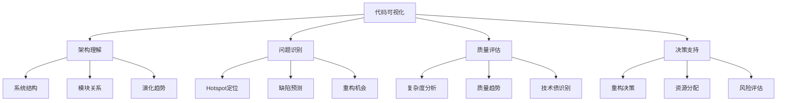

在现代软件开发中，随着系统规模的不断增长，代码库变得越来越复杂，理解和维护这些代码库成为了一项巨大挑战。代码可视化技术通过将抽象的代码结构和质量指标转化为直观的图形表示，帮助开发者更好地理解系统架构、识别问题区域、优化代码结构。本章将深入探讨代码可视化的关键技术，包括hotspot分析、依赖关系可视化和复杂度图谱等。

## 代码可视化的价值与原理

### 1. 代码可视化的核心价值

代码可视化通过图形化的方式展现代码的结构、质量和行为特征，为开发者提供直观的洞察。

#### 可视化价值体系


### 2. 可视化技术原理

代码可视化基于数据转换和图形映射原理，将代码特征转化为视觉元素。

#### 可视化处理流程
```java
// 代码可视化处理流程
@Service
public class CodeVisualizationService {
    
    @Autowired
    private CodeAnalysisService codeAnalysisService;
    
    @Autowired
    private VisualizationRenderer visualizationRenderer;
    
    public VisualizationResult generateCodeVisualization(String projectId, 
                                                      VisualizationType type) {
        // 1. 数据采集
        CodeAnalysisData rawData = collectCodeData(projectId);
        
        // 2. 数据处理
        ProcessedVisualizationData processedData = processData(rawData, type);
        
        // 3. 图形映射
        GraphModel graphModel = mapToGraph(processedData);
        
        // 4. 视觉编码
        VisualEncoding visualEncoding = applyVisualEncoding(graphModel, type);
        
        // 5. 渲染输出
        VisualizationResult result = renderVisualization(visualEncoding);
        
        return result;
    }
    
    private CodeAnalysisData collectCodeData(String projectId) {
        CodeAnalysisData data = new CodeAnalysisData();
        
        // 收集代码结构数据
        data.setFileStructure(codeAnalysisService.getFileStructure(projectId));
        
        // 收集依赖关系数据
        data.setDependencies(codeAnalysisService.getDependencies(projectId));
        
        // 收集质量指标数据
        data.setQualityMetrics(codeAnalysisService.getQualityMetrics(projectId));
        
        // 收集变更历史数据
        data.setChangeHistory(codeAnalysisService.getChangeHistory(projectId));
        
        // 收集测试覆盖数据
        data.setTestCoverage(codeAnalysisService.getTestCoverage(projectId));
        
        return data;
    }
    
    private ProcessedVisualizationData processData(CodeAnalysisData rawData, 
                                               VisualizationType type) {
        ProcessedVisualizationData processedData = new ProcessedVisualizationData();
        
        switch (type) {
            case HOTSPOT_MAP:
                processedData.setNodes(processHotspotNodes(rawData));
                processedData.setEdges(processHotspotEdges(rawData));
                break;
                
            case DEPENDENCY_GRAPH:
                processedData.setNodes(processDependencyNodes(rawData));
                processedData.setEdges(processDependencyEdges(rawData));
                break;
                
            case COMPLEXITY_MAP:
                processedData.setNodes(processComplexityNodes(rawData));
                processedData.setEdges(processComplexityEdges(rawData));
                break;
        }
        
        return processedData;
    }
}
```

## Hotspot分析可视化

### 1. Hotspot识别算法

Hotspot是指代码库中频繁出现问题或需要频繁修改的区域，是重构和质量改进的重点关注对象。

#### Hotspot识别实现
```java
// Hotspot识别服务
@Service
public class HotspotIdentificationService {
    
    @Autowired
    private GitDataService gitDataService;
    
    @Autowired
    private IssueTrackingService issueTrackingService;
    
    @Autowired
    private CodeQualityService codeQualityService;
    
    public List<Hotspot> identifyHotspots(String projectId, HotspotCriteria criteria) {
        List<Hotspot> hotspots = new ArrayList<>();
        
        // 1. 获取文件列表
        List<SourceFile> files = gitDataService.getProjectFiles(projectId);
        
        for (SourceFile file : files) {
            Hotspot hotspot = new Hotspot();
            hotspot.setFile(file);
            
            // 2. 计算变更频率
            int changeFrequency = gitDataService.getChangeFrequency(
                projectId, file.getPath(), criteria.getTimeRange());
            hotspot.setChangeFrequency(changeFrequency);
            
            // 3. 计算缺陷密度
            int defectCount = issueTrackingService.getDefectsInFile(
                projectId, file.getPath(), criteria.getTimeRange());
            double defectDensity = (double) defectCount / file.getLinesOfCode();
            hotspot.setDefectDensity(defectDensity);
            
            // 4. 计算复杂度
            CodeComplexity complexity = codeQualityService.getFileComplexity(
                projectId, file.getPath());
            hotspot.setComplexity(complexity);
            
            // 5. 计算团队贡献度
            int contributorCount = gitDataService.getContributors(
                projectId, file.getPath(), criteria.getTimeRange());
            hotspot.setContributorCount(contributorCount);
            
            // 6. 综合评分
            double hotspotScore = calculateHotspotScore(hotspot, criteria);
            hotspot.setHotspotScore(hotspotScore);
            
            // 7. 确定Hotspot等级
            HotspotLevel level = determineHotspotLevel(hotspotScore);
            hotspot.setLevel(level);
            
            hotspots.add(hotspot);
        }
        
        // 8. 排序并筛选
        return hotspots.stream()
            .filter(h -> h.getHotspotScore() >= criteria.getThreshold())
            .sorted(Comparator.comparing(Hotspot::getHotspotScore).reversed())
            .limit(criteria.getMaxResults())
            .collect(Collectors.toList());
    }
    
    private double calculateHotspotScore(Hotspot hotspot, HotspotCriteria criteria) {
        // 加权计算Hotspot评分
        double changeFrequencyScore = normalizeChangeFrequency(hotspot.getChangeFrequency()) 
            * criteria.getChangeFrequencyWeight();
        
        double defectDensityScore = hotspot.getDefectDensity() 
            * criteria.getDefectDensityWeight();
        
        double complexityScore = normalizeComplexity(hotspot.getComplexity()) 
            * criteria.getComplexityWeight();
        
        double contributorScore = normalizeContributors(hotspot.getContributorCount()) 
            * criteria.getContributorWeight();
        
        return changeFrequencyScore + defectDensityScore + complexityScore + contributorScore;
    }
    
    private double normalizeChangeFrequency(int frequency) {
        // 使用对数归一化处理
        return Math.log(frequency + 1) / Math.log(100);
    }
    
    private double normalizeComplexity(CodeComplexity complexity) {
        // 基于圈复杂度归一化
        return Math.min(1.0, complexity.getCyclomaticComplexity() / 50.0);
    }
    
    private double normalizeContributors(int contributorCount) {
        // 归一化贡献者数量
        return Math.min(1.0, contributorCount / 10.0);
    }
}
```

### 2. Hotspot地图可视化

将Hotspot分析结果以地图形式可视化展示，便于直观识别问题区域。

#### Hotspot地图实现
```javascript
// Hotspot地图可视化组件
class HotspotMapVisualization extends React.Component {
    constructor(props) {
        super(props);
        this.state = {
            hotspots: [],
            selectedHotspot: null,
            visualizationMode: 'HEATMAP',
            filterCriteria: {
                minScore: 0,
                maxComplexity: Infinity,
                timeRange: 'LAST_90_DAYS'
            }
        };
    }
    
    componentDidMount() {
        this.loadHotspotData();
    }
    
    loadHotspotData() {
        const { filterCriteria } = this.state;
        
        fetch(`/api/projects/${this.props.projectId}/hotspots?` + 
              new URLSearchParams(filterCriteria))
            .then(response => response.json())
            .then(hotspots => {
                this.setState({ hotspots });
            });
    }
    
    render() {
        const { hotspots, selectedHotspot, visualizationMode } = this.state;
        
        return (
            <div className="hotspot-map-visualization">
                <div className="visualization-controls">
                    <select 
                        value={visualizationMode}
                        onChange={(e) => this.setState({ visualizationMode: e.target.value })}
                    >
                        <option value="HEATMAP">Heatmap</option>
                        <option value="BUBBLE">Bubble Chart</option>
                        <option value="TREE_MAP">Tree Map</option>
                    </select>
                    
                    <FilterPanel 
                        onFilterChange={this.handleFilterChange.bind(this)}
                    />
                </div>
                
                <div className="hotspot-map-container">
                    {visualizationMode === 'HEATMAP' && (
                        <HeatmapVisualization 
                            hotspots={hotspots}
                            onHotspotSelect={this.handleHotspotSelect.bind(this)}
                        />
                    )}
                    
                    {visualizationMode === 'BUBBLE' && (
                        <BubbleChartVisualization 
                            hotspots={hotspots}
                            onHotspotSelect={this.handleHotspotSelect.bind(this)}
                        />
                    )}
                    
                    {visualizationMode === 'TREE_MAP' && (
                        <TreeMapVisualization 
                            hotspots={hotspots}
                            onHotspotSelect={this.handleHotspotSelect.bind(this)}
                        />
                    )}
                </div>
                
                {selectedHotspot && (
                    <HotspotDetailsPanel 
                        hotspot={selectedHotspot}
                        onClose={() => this.setState({ selectedHotspot: null })}
                    />
                )}
            </div>
        );
    }
}

// 热力图可视化组件
class HeatmapVisualization extends React.Component {
    render() {
        const { hotspots, onHotspotSelect } = this.props;
        
        // 将文件按目录结构组织
        const directoryStructure = this.buildDirectoryStructure(hotspots);
        
        return (
            <div className="heatmap-visualization">
                <svg width="100%" height="600">
                    {this.renderDirectoryRectangles(directoryStructure, onHotspotSelect)}
                </svg>
            </div>
        );
    }
    
    buildDirectoryStructure(hotspots) {
        const structure = {};
        
        hotspots.forEach(hotspot => {
            const pathParts = hotspot.file.path.split('/');
            let current = structure;
            
            pathParts.forEach((part, index) => {
                if (!current[part]) {
                    current[part] = {
                        name: part,
                        isFile: index === pathParts.length - 1,
                        children: {},
                        hotspot: index === pathParts.length - 1 ? hotspot : null
                    };
                }
                current = current[part].children;
            });
        });
        
        return structure;
    }
    
    renderDirectoryRectangles(structure, onHotspotSelect, x = 0, y = 0, width = 800, height = 600) {
        const rectangles = [];
        const entries = Object.entries(structure);
        const cellWidth = width / Math.ceil(Math.sqrt(entries.length));
        const cellHeight = height / Math.ceil(Math.sqrt(entries.length));
        
        entries.forEach(([name, item], index) => {
            const row = Math.floor(index / Math.ceil(Math.sqrt(entries.length)));
            const col = index % Math.ceil(Math.sqrt(entries.length));
            const rectX = x + col * cellWidth;
            const rectY = y + row * cellHeight;
            
            if (item.isFile && item.hotspot) {
                const hotspot = item.hotspot;
                const color = this.getHotspotColor(hotspot.hotspotScore);
                const size = Math.max(5, hotspot.hotspotScore * 20);
                
                rectangles.push(
                    <rect
                        key={item.file.path}
                        x={rectX + (cellWidth - size) / 2}
                        y={rectY + (cellHeight - size) / 2}
                        width={size}
                        height={size}
                        fill={color}
                        stroke="#333"
                        strokeWidth="1"
                        onClick={() => onHotspotSelect(hotspot)}
                        className="hotspot-rect"
                    >
                        <title>{`${item.file.path}\nScore: ${hotspot.hotspotScore.toFixed(2)}`}</title>
                    </rect>
                );
            } else {
                // 递归渲染子目录
                rectangles.push(
                    <g key={name}>
                        <rect
                            x={rectX}
                            y={rectY}
                            width={cellWidth}
                            height={cellHeight}
                            fill="#f0f0f0"
                            stroke="#ccc"
                        />
                        <text
                            x={rectX + 5}
                            y={rectY + 15}
                            fontSize="12"
                        >
                            {name}
                        </text>
                        {this.renderDirectoryRectangles(
                            item.children, 
                            onHotspotSelect, 
                            rectX, 
                            rectY, 
                            cellWidth, 
                            cellHeight
                        )}
                    </g>
                );
            }
        });
        
        return rectangles;
    }
    
    getHotspotColor(score) {
        // 根据评分返回颜色（从绿色到红色）
        if (score >= 0.8) return "#ff4444";      // 红色
        if (score >= 0.6) return "#ff8800";      // 橙色
        if (score >= 0.4) return "#ffbb00";      // 黄色
        if (score >= 0.2) return "#88cc00";      // 黄绿色
        return "#44cc44";                        // 绿色
    }
}
```

## 依赖关系可视化

### 1. 依赖关系分析

分析代码模块间的依赖关系，识别循环依赖和过度耦合问题。

#### 依赖分析实现
```java
// 依赖关系分析服务
@Service
public class DependencyAnalysisService {
    
    @Autowired
    private CodeParsingService codeParsingService;
    
    @Autowired
    private ArchitectureRulesService architectureRulesService;
    
    public DependencyAnalysisResult analyzeDependencies(String projectId) {
        DependencyAnalysisResult result = new DependencyAnalysisResult();
        result.setProjectId(projectId);
        
        // 1. 解析代码依赖
        List<CodeDependency> rawDependencies = parseCodeDependencies(projectId);
        
        // 2. 构建依赖图
        DependencyGraph dependencyGraph = buildDependencyGraph(rawDependencies);
        result.setDependencyGraph(dependencyGraph);
        
        // 3. 识别循环依赖
        List<CircularDependency> circularDependencies = findCircularDependencies(dependencyGraph);
        result.setCircularDependencies(circularDependencies);
        
        // 4. 检查架构违规
        List<ArchitectureViolation> violations = checkArchitectureViolations(
            dependencyGraph, projectId);
        result.setArchitectureViolations(violations);
        
        // 5. 计算耦合度指标
        CouplingMetrics couplingMetrics = calculateCouplingMetrics(dependencyGraph);
        result.setCouplingMetrics(couplingMetrics);
        
        // 6. 识别关键依赖
        List<CriticalDependency> criticalDependencies = identifyCriticalDependencies(dependencyGraph);
        result.setCriticalDependencies(criticalDependencies);
        
        return result;
    }
    
    private List<CodeDependency> parseCodeDependencies(String projectId) {
        List<CodeDependency> dependencies = new ArrayList<>();
        
        // 获取项目所有源文件
        List<SourceFile> sourceFiles = codeParsingService.getProjectSourceFiles(projectId);
        
        for (SourceFile file : sourceFiles) {
            // 解析文件中的导入语句
            List<ImportStatement> imports = codeParsingService.parseImports(file);
            
            for (ImportStatement importStmt : imports) {
                CodeDependency dependency = new CodeDependency();
                dependency.setSourceFile(file.getPath());
                dependency.setTargetFile(resolveImportPath(importStmt, file));
                dependency.setDependencyType(determineDependencyType(importStmt));
                dependency.setLineNumber(importStmt.getLineNumber());
                
                dependencies.add(dependency);
            }
        }
        
        return dependencies;
    }
    
    private DependencyGraph buildDependencyGraph(List<CodeDependency> dependencies) {
        DependencyGraph graph = new DependencyGraph();
        
        // 添加节点
        Set<String> uniqueFiles = dependencies.stream()
            .flatMap(dep -> Stream.of(dep.getSourceFile(), dep.getTargetFile()))
            .collect(Collectors.toSet());
        
        uniqueFiles.forEach(file -> graph.addNode(new DependencyNode(file)));
        
        // 添加边
        for (CodeDependency dependency : dependencies) {
            DependencyEdge edge = new DependencyEdge(
                dependency.getSourceFile(),
                dependency.getTargetFile(),
                dependency.getDependencyType()
            );
            graph.addEdge(edge);
        }
        
        return graph;
    }
    
    private List<CircularDependency> findCircularDependencies(DependencyGraph graph) {
        List<CircularDependency> circularDeps = new ArrayList<>();
        
        // 使用强连通分量算法检测循环依赖
        List<Set<DependencyNode>> stronglyConnectedComponents = 
            findStronglyConnectedComponents(graph);
        
        for (Set<DependencyNode> component : stronglyConnectedComponents) {
            if (component.size() > 1) {
                CircularDependency circularDep = new CircularDependency();
                circularDep.setNodes(new ArrayList<>(component));
                circularDep.setCycleLength(component.size());
                circularDep.setSeverity(determineCycleSeverity(component));
                
                circularDeps.add(circularDep);
            }
        }
        
        return circularDeps;
    }
    
    private List<ArchitectureViolation> checkArchitectureViolations(
            DependencyGraph graph, String projectId) {
        List<ArchitectureViolation> violations = new ArrayList<>();
        
        // 获取架构规则
        List<ArchitectureRule> rules = architectureRulesService.getProjectRules(projectId);
        
        for (ArchitectureRule rule : rules) {
            // 检查每条规则是否被违反
            List<RuleViolation> ruleViolations = checkRuleViolation(graph, rule);
            violations.addAll(ruleViolations);
        }
        
        return violations;
    }
}
```

### 2. 依赖图可视化

将复杂的依赖关系以图形化方式展示，支持交互式探索。

#### 依赖图可视化实现
```javascript
// 依赖图可视化组件
class DependencyGraphVisualization extends React.Component {
    constructor(props) {
        super(props);
        this.state = {
            graphData: null,
            selectedNode: null,
            filter: {
                showExternal: true,
                maxDepth: 3,
                highlightViolations: true
            }
        };
    }
    
    componentDidMount() {
        this.loadDependencyData();
    }
    
    loadDependencyData() {
        fetch(`/api/projects/${this.props.projectId}/dependencies`)
            .then(response => response.json())
            .then(data => {
                this.setState({ graphData: data });
            });
    }
    
    render() {
        const { graphData, selectedNode, filter } = this.state;
        
        if (!graphData) return <div>Loading dependency graph...</div>;
        
        return (
            <div className="dependency-graph-visualization">
                <div className="graph-controls">
                    <div className="filter-controls">
                        <label>
                            <input
                                type="checkbox"
                                checked={filter.showExternal}
                                onChange={(e) => this.updateFilter('showExternal', e.target.checked)}
                            />
                            Show External Dependencies
                        </label>
                        
                        <label>
                            Max Depth:
                            <select
                                value={filter.maxDepth}
                                onChange={(e) => this.updateFilter('maxDepth', parseInt(e.target.value))}
                            >
                                <option value={1}>1</option>
                                <option value={2}>2</option>
                                <option value={3}>3</option>
                                <option value={4}>4</option>
                                <option value={5}>5</option>
                            </select>
                        </label>
                    </div>
                    
                    <div className="layout-controls">
                        <button onClick={() => this.applyLayout('force')}>Force Layout</button>
                        <button onClick={() => this.applyLayout('hierarchical')}>Hierarchical Layout</button>
                        <button onClick={() => this.applyLayout('circular')}>Circular Layout</button>
                    </div>
                </div>
                
                <div className="graph-container">
                    <svg width="100%" height="700" ref={this.svgRef}>
                        {this.renderGraph(graphData, filter)}
                    </svg>
                </div>
                
                {selectedNode && (
                    <NodeDetailsPanel 
                        node={selectedNode}
                        onClose={() => this.setState({ selectedNode: null })}
                    />
                )}
            </div>
        );
    }
    
    renderGraph(graphData, filter) {
        const { nodes, edges } = this.filterGraphData(graphData, filter);
        const layout = this.calculateLayout(nodes, edges);
        
        return (
            <g>
                {/* 渲染边 */}
                {edges.map(edge => (
                    <DependencyEdge
                        key={`${edge.source}-${edge.target}`}
                        edge={edge}
                        layout={layout}
                        isViolation={edge.isViolation}
                    />
                ))}
                
                {/* 渲染节点 */}
                {nodes.map(node => (
                    <DependencyNode
                        key={node.id}
                        node={node}
                        position={layout.nodes[node.id]}
                        onClick={() => this.handleNodeClick(node)}
                        isCritical={node.isCritical}
                        hasViolations={node.hasViolations}
                    />
                ))}
            </g>
        );
    }
    
    filterGraphData(graphData, filter) {
        let { nodes, edges } = graphData;
        
        // 根据过滤条件筛选数据
        if (!filter.showExternal) {
            nodes = nodes.filter(node => !node.isExternal);
        }
        
        // 限制显示深度
        if (filter.maxDepth < 5) {
            const reachableNodes = this.findReachableNodes(nodes[0], edges, filter.maxDepth);
            nodes = nodes.filter(node => reachableNodes.has(node.id));
            edges = edges.filter(edge => 
                reachableNodes.has(edge.source) && reachableNodes.has(edge.target)
            );
        }
        
        return { nodes, edges };
    }
    
    calculateLayout(nodes, edges) {
        // 使用力导向布局算法
        const simulation = d3.forceSimulation(nodes)
            .force("link", d3.forceLink(edges).id(d => d.id).distance(100))
            .force("charge", d3.forceManyBody().strength(-300))
            .force("center", d3.forceCenter(400, 350))
            .force("collision", d3.forceCollide().radius(30));
        
        // 运行模拟
        for (let i = 0; i < 300; i++) {
            simulation.tick();
        }
        
        simulation.stop();
        
        // 构建位置映射
        const nodePositions = {};
        nodes.forEach(node => {
            nodePositions[node.id] = { x: node.x, y: node.y };
        });
        
        return { nodes: nodePositions, edges };
    }
}

// 依赖节点组件
class DependencyNode extends React.Component {
    render() {
        const { node, position, onClick, isCritical, hasViolations } = this.props;
        const { x, y } = position;
        
        // 根据节点类型确定样式
        const nodeStyle = this.getNodeStyle(node);
        const radius = nodeStyle.radius;
        
        return (
            <g transform={`translate(${x}, ${y})`} onClick={() => onClick(node)}>
                <circle
                    r={radius}
                    fill={nodeStyle.fill}
                    stroke={nodeStyle.stroke}
                    strokeWidth={nodeStyle.strokeWidth}
                    className={`dependency-node ${isCritical ? 'critical' : ''} ${hasViolations ? 'violation' : ''}`}
                />
                <text
                    y={5}
                    textAnchor="middle"
                    fontSize="10"
                    fill="#333"
                >
                    {this.getNodeLabel(node)}
                </text>
                {hasViolations && (
                    <circle
                        r={radius + 5}
                        fill="none"
                        stroke="red"
                        strokeWidth="2"
                        strokeDasharray="5,5"
                    />
                )}
            </g>
        );
    }
    
    getNodeStyle(node) {
        if (node.type === 'PACKAGE') {
            return { fill: '#4CAF50', stroke: '#388E3C', strokeWidth: 2, radius: 25 };
        } else if (node.type === 'CLASS') {
            return { fill: '#2196F3', stroke: '#1976D2', strokeWidth: 1, radius: 20 };
        } else if (node.type === 'INTERFACE') {
            return { fill: '#9C27B0', stroke: '#7B1FA2', strokeWidth: 1, radius: 20 };
        } else {
            return { fill: '#FF9800', stroke: '#F57C00', strokeWidth: 1, radius: 15 };
        }
    }
    
    getNodeLabel(node) {
        const parts = node.id.split('.');
        return parts[parts.length - 1]; // 显示简单名称
    }
}

// 依赖边组件
class DependencyEdge extends React.Component {
    render() {
        const { edge, layout, isViolation } = this.props;
        const sourcePos = layout.nodes[edge.source];
        const targetPos = layout.nodes[edge.target];
        
        if (!sourcePos || !targetPos) return null;
        
        // 计算边的路径
        const pathData = this.calculateEdgePath(sourcePos, targetPos);
        
        return (
            <g className={`dependency-edge ${isViolation ? 'violation' : ''}`}>
                <path
                    d={pathData}
                    fill="none"
                    stroke={isViolation ? "red" : "#999"}
                    strokeWidth={isViolation ? 2 : 1}
                    markerEnd={isViolation ? "url(#arrow-violation)" : "url(#arrow-normal)"}
                />
                {edge.type === 'INHERITANCE' && (
                    <text
                        x={(sourcePos.x + targetPos.x) / 2}
                        y={(sourcePos.y + targetPos.y) / 2 - 10}
                        textAnchor="middle"
                        fontSize="8"
                        fill="#666"
                    >
                        extends
                    </text>
                )}
            </g>
        );
    }
    
    calculateEdgePath(source, target) {
        const dx = target.x - source.x;
        const dy = target.y - source.y;
        const dr = Math.sqrt(dx * dx + dy * dy);
        
        // 使用贝塞尔曲线创建弯曲的边
        return `M${source.x},${source.y}A${dr},${dr} 0 0,1 ${target.x},${target.y}`;
    }
}
```

## 复杂度图谱可视化

### 1. 复杂度度量与分析

通过多种维度度量代码复杂度，构建全面的复杂度图谱。

#### 复杂度分析实现
```java
// 复杂度分析服务
@Service
public class ComplexityAnalysisService {
    
    @Autowired
    private CodeMetricsService codeMetricsService;
    
    @Autowired
    private GitHistoryService gitHistoryService;
    
    public ComplexityAnalysisResult analyzeComplexity(String projectId) {
        ComplexityAnalysisResult result = new ComplexityAnalysisResult();
        result.setProjectId(projectId);
        
        // 1. 收集代码度量数据
        List<CodeMetrics> metrics = codeMetricsService.getProjectMetrics(projectId);
        
        // 2. 计算各种复杂度指标
        result.setCyclomaticComplexity(calculateCyclomaticComplexity(metrics));
        result.setCognitiveComplexity(calculateCognitiveComplexity(metrics));
        result.setLineComplexity(calculateLineComplexity(metrics));
        result.setNestingComplexity(calculateNestingComplexity(metrics));
        
        // 3. 分析复杂度分布
        result.setComplexityDistribution(analyzeComplexityDistribution(metrics));
        
        // 4. 识别复杂度热点
        result.setComplexityHotspots(identifyComplexityHotspots(metrics));
        
        // 5. 分析复杂度趋势
        result.setComplexityTrend(analyzeComplexityTrend(projectId, metrics));
        
        // 6. 评估复杂度风险
        result.setComplexityRisk(assessComplexityRisk(metrics));
        
        return result;
    }
    
    private CyclomaticComplexity calculateCyclomaticComplexity(List<CodeMetrics> metrics) {
        CyclomaticComplexity complexity = new CyclomaticComplexity();
        
        // 计算各项统计指标
        IntSummaryStatistics stats = metrics.stream()
            .mapToInt(CodeMetrics::getCyclomaticComplexity)
            .summaryStatistics();
        
        complexity.setAverage(stats.getAverage());
        complexity.setMax(stats.getMax());
        complexity.setMin(stats.getMin());
        complexity.setTotal(stats.getSum());
        
        // 计算分布情况
        Map<ComplexityLevel, Long> distribution = metrics.stream()
            .collect(Collectors.groupingBy(
                this::classifyComplexityLevel,
                Collectors.counting()
            ));
        
        complexity.setDistribution(distribution);
        
        // 识别高复杂度方法
        List<HighComplexityMethod> highComplexityMethods = metrics.stream()
            .filter(metric -> metric.getCyclomaticComplexity() > 10)
            .map(this::toHighComplexityMethod)
            .sorted(Comparator.comparing(HighComplexityMethod::getComplexity).reversed())
            .collect(Collectors.toList());
        
        complexity.setHighComplexityMethods(highComplexityMethods);
        
        return complexity;
    }
    
    private CognitiveComplexity calculateCognitiveComplexity(List<CodeMetrics> metrics) {
        CognitiveComplexity complexity = new CognitiveComplexity();
        
        // 计算认知复杂度统计
        DoubleSummaryStatistics stats = metrics.stream()
            .mapToDouble(CodeMetrics::getCognitiveComplexity)
            .summaryStatistics();
        
        complexity.setAverage(stats.getAverage());
        complexity.setMax(stats.getMax());
        complexity.setMin(stats.getMin());
        complexity.setTotal(stats.getSum());
        
        // 分析认知复杂度与圈复杂度的关系
        List<ComplexityCorrelation> correlations = analyzeComplexityCorrelation(metrics);
        complexity.setCorrelations(correlations);
        
        return complexity;
    }
    
    private ComplexityLevel classifyComplexityLevel(CodeMetrics metrics) {
        int complexity = metrics.getCyclomaticComplexity();
        
        if (complexity <= 5) {
            return ComplexityLevel.LOW;
        } else if (complexity <= 10) {
            return ComplexityLevel.MEDIUM;
        } else if (complexity <= 20) {
            return ComplexityLevel.HIGH;
        } else {
            return ComplexityLevel.VERY_HIGH;
        }
    }
    
    private List<ComplexityHotspot> identifyComplexityHotspots(List<CodeMetrics> metrics) {
        return metrics.stream()
            .filter(metric -> metric.getCyclomaticComplexity() > 15)
            .map(this::toComplexityHotspot)
            .sorted(Comparator.comparing(ComplexityHotspot::getComplexityScore).reversed())
            .limit(50) // 限制返回前50个热点
            .collect(Collectors.toList());
    }
    
    private ComplexityTrend analyzeComplexityTrend(String projectId, List<CodeMetrics> metrics) {
        ComplexityTrend trend = new ComplexityTrend();
        
        // 获取历史复杂度数据
        List<HistoricalComplexity> historicalData = gitHistoryService
            .getHistoricalComplexity(projectId, LocalDate.now().minusMonths(12));
        
        // 计算趋势
        trend.setOverallTrend(calculateTrend(historicalData));
        trend.setMonthlyAverages(calculateMonthlyAverages(historicalData));
        trend.setGrowthRate(calculateGrowthRate(historicalData));
        
        return trend;
    }
}
```

### 2. 复杂度图谱可视化

将复杂度数据以多维度图谱形式展示，帮助识别复杂度模式。

#### 复杂度图谱实现
```javascript
// 复杂度图谱可视化组件
class ComplexityLandscapeVisualization extends React.Component {
    constructor(props) {
        super(props);
        this.state = {
            complexityData: null,
            viewMode: '3D_LANDSCAPE',
            selectedMetric: 'CYCLOMATIC',
            colorScheme: 'SPECTRUM'
        };
    }
    
    componentDidMount() {
        this.loadComplexityData();
    }
    
    loadComplexityData() {
        fetch(`/api/projects/${this.props.projectId}/complexity`)
            .then(response => response.json())
            .then(data => {
                this.setState({ complexityData: data });
            });
    }
    
    render() {
        const { complexityData, viewMode, selectedMetric, colorScheme } = this.state;
        
        if (!complexityData) return <div>Loading complexity data...</div>;
        
        return (
            <div className="complexity-landscape-visualization">
                <div className="visualization-controls">
                    <div className="mode-selector">
                        <label>View Mode:</label>
                        <select 
                            value={viewMode}
                            onChange={(e) => this.setState({ viewMode: e.target.value })}
                        >
                            <option value="3D_LANDSCAPE">3D Landscape</option>
                            <option value="2D_SCATTER">2D Scatter Plot</option>
                            <option value="HEATMAP">Complexity Heatmap</option>
                            <option value="TREE_MAP">Complexity Treemap</option>
                        </select>
                    </div>
                    
                    <div className="metric-selector">
                        <label>Metric:</label>
                        <select
                            value={selectedMetric}
                            onChange={(e) => this.setState({ selectedMetric: e.target.value })}
                        >
                            <option value="CYCLOMATIC">Cyclomatic Complexity</option>
                            <option value="COGNITIVE">Cognitive Complexity</option>
                            <option value="LINES">Lines of Code</option>
                            <option value="NESTING">Nesting Depth</option>
                        </select>
                    </div>
                    
                    <div className="color-scheme">
                        <label>Color Scheme:</label>
                        <select
                            value={colorScheme}
                            onChange={(e) => this.setState({ colorScheme: e.target.value })}
                        >
                            <option value="SPECTRUM">Spectrum</option>
                            <option value="RED_BLUE">Red-Blue</option>
                            <option value="GREEN_YELLOW">Green-Yellow</option>
                        </select>
                    </div>
                </div>
                
                <div className="visualization-container">
                    {viewMode === '3D_LANDSCAPE' && (
                        <Complexity3DLandscape
                            data={complexityData}
                            metric={selectedMetric}
                            colorScheme={colorScheme}
                        />
                    )}
                    
                    {viewMode === '2D_SCATTER' && (
                        <ComplexityScatterPlot
                            data={complexityData}
                            xMetric="LINES"
                            yMetric={selectedMetric}
                            colorScheme={colorScheme}
                        />
                    )}
                    
                    {viewMode === 'HEATMAP' && (
                        <ComplexityHeatmap
                            data={complexityData}
                            metric={selectedMetric}
                            colorScheme={colorScheme}
                        />
                    )}
                    
                    {viewMode === 'TREE_MAP' && (
                        <ComplexityTreemap
                            data={complexityData}
                            metric={selectedMetric}
                            colorScheme={colorScheme}
                        />
                    )}
                </div>
                
                <div className="complexity-insights">
                    <ComplexityInsightsPanel data={complexityData} metric={selectedMetric} />
                </div>
            </div>
        );
    }
}

// 3D复杂度景观组件
class Complexity3DLandscape extends React.Component {
    componentDidMount() {
        this.init3DScene();
    }
    
    init3DScene() {
        const { data, metric, colorScheme } = this.props;
        const scene = new THREE.Scene();
        const camera = new THREE.PerspectiveCamera(75, window.innerWidth / window.innerHeight, 0.1, 1000);
        const renderer = new THREE.WebGLRenderer({ antialias: true });
        
        renderer.setSize(window.innerWidth * 0.8, 600);
        this.mount.appendChild(renderer.domElement);
        
        // 创建复杂度地形
        const geometry = this.createComplexityTerrain(data, metric);
        const material = new THREE.MeshPhongMaterial({ 
            vertexColors: true,
            side: THREE.DoubleSide
        });
        
        const mesh = new THREE.Mesh(geometry, material);
        scene.add(mesh);
        
        // 添加光照
        const light = new THREE.DirectionalLight(0xffffff, 1);
        light.position.set(1, 1, 1);
        scene.add(light);
        
        camera.position.z = 5;
        
        // 动画循环
        const animate = () => {
            requestAnimationFrame(animate);
            mesh.rotation.x += 0.01;
            mesh.rotation.y += 0.01;
            renderer.render(scene, camera);
        };
        
        animate();
        
        // 处理窗口大小变化
        window.addEventListener('resize', () => {
            camera.aspect = window.innerWidth / window.innerHeight;
            camera.updateProjectionMatrix();
            renderer.setSize(window.innerWidth * 0.8, 600);
        });
    }
    
    createComplexityTerrain(data, metric) {
        const geometry = new THREE.PlaneGeometry(10, 10, 50, 50);
        const vertices = geometry.attributes.position.array;
        
        // 根据复杂度数据调整顶点高度
        for (let i = 0; i < vertices.length; i += 3) {
            const x = vertices[i];
            const y = vertices[i + 1];
            
            // 简化的复杂度映射
            const complexity = this.getComplexityForPosition(data, x, y, metric);
            vertices[i + 2] = complexity * 0.5; // Z轴表示复杂度
        }
        
        geometry.attributes.position.needsUpdate = true;
        geometry.computeVertexNormals();
        
        // 添加颜色
        const colors = [];
        for (let i = 0; i < vertices.length; i += 3) {
            const complexity = vertices[i + 2] * 2; // 恢复原始复杂度值
            const color = this.getComplexityColor(complexity);
            colors.push(color.r, color.g, color.b);
        }
        
        geometry.setAttribute('color', new THREE.Float32BufferAttribute(colors, 3));
        
        return geometry;
    }
    
    getComplexityForPosition(data, x, y, metric) {
        // 简化的复杂度查找逻辑
        const index = Math.floor((x + 5) * 5 + (y + 5) * 5) % data.hotspots.length;
        const hotspot = data.hotspots[index];
        
        switch (metric) {
            case 'CYCLOMATIC':
                return hotspot.cyclomaticComplexity || 1;
            case 'COGNITIVE':
                return hotspot.cognitiveComplexity || 1;
            case 'LINES':
                return (hotspot.linesOfCode || 100) / 100;
            case 'NESTING':
                return hotspot.maxNestingDepth || 1;
            default:
                return 1;
        }
    }
    
    getComplexityColor(complexity) {
        // 根据复杂度返回颜色
        if (complexity > 20) {
            return new THREE.Color(0xff0000); // 红色
        } else if (complexity > 10) {
            return new THREE.Color(0xff8800); // 橙色
        } else if (complexity > 5) {
            return new THREE.Color(0xffff00); // 黄色
        } else {
            return new THREE.Color(0x00ff00); // 绿色
        }
    }
    
    render() {
        return <div ref={ref => (this.mount = ref)} />;
    }
}

// 复杂度散点图组件
class ComplexityScatterPlot extends React.Component {
    render() {
        const { data, xMetric, yMetric, colorScheme } = this.props;
        
        // 准备散点图数据
        const scatterData = data.hotspots.map(hotspot => ({
            x: this.getMetricValue(hotspot, xMetric),
            y: this.getMetricValue(hotspot, yMetric),
            name: hotspot.fileName,
            complexity: hotspot.cyclomaticComplexity
        }));
        
        return (
            <div className="scatter-plot-container">
                <svg width="100%" height="600">
                    {this.renderAxes()}
                    {scatterData.map((point, index) => (
                        <circle
                            key={index}
                            cx={this.scaleX(point.x)}
                            cy={this.scaleY(point.y)}
                            r={this.calculateRadius(point.complexity)}
                            fill={this.getPointColor(point.complexity, colorScheme)}
                            stroke="#333"
                            strokeWidth="1"
                            className="scatter-point"
                        >
                            <title>{`${point.name}: (${point.x}, ${point.y})`}</title>
                        </circle>
                    ))}
                </svg>
            </div>
        );
    }
    
    getMetricValue(hotspot, metric) {
        switch (metric) {
            case 'CYCLOMATIC':
                return hotspot.cyclomaticComplexity || 0;
            case 'COGNITIVE':
                return hotspot.cognitiveComplexity || 0;
            case 'LINES':
                return hotspot.linesOfCode || 0;
            case 'NESTING':
                return hotspot.maxNestingDepth || 0;
            default:
                return 0;
        }
    }
    
    scaleX(value) {
        // 简单的线性缩放
        return 50 + (value / 1000) * 700;
    }
    
    scaleY(value) {
        // Y轴从上到下递减
        return 550 - (value / 50) * 500;
    }
    
    calculateRadius(complexity) {
        return Math.max(3, Math.min(15, complexity / 2));
    }
    
    getPointColor(complexity, scheme) {
        switch (scheme) {
            case 'RED_BLUE':
                return complexity > 10 ? '#ff0000' : '#0000ff';
            case 'GREEN_YELLOW':
                return complexity > 10 ? '#ffff00' : '#00ff00';
            default: // SPECTRUM
                if (complexity > 20) return '#ff0000';
                if (complexity > 15) return '#ff8800';
                if (complexity > 10) return '#ffff00';
                if (complexity > 5) return '#88ff00';
                return '#00ff00';
        }
    }
}
```

## 可视化集成与应用

### 1. 统一可视化平台

构建统一的代码可视化平台，集成各种可视化功能。

#### 可视化平台实现
```java
// 统一可视化平台服务
@RestController
@RequestMapping("/api/visualization")
public class VisualizationPlatformController {
    
    @Autowired
    private CodeVisualizationService visualizationService;
    
    @Autowired
    private HotspotIdentificationService hotspotService;
    
    @Autowired
    private DependencyAnalysisService dependencyService;
    
    @Autowired
    private ComplexityAnalysisService complexityService;
    
    @GetMapping("/{projectId}/overview")
    public VisualizationOverview getProjectOverview(@PathVariable String projectId) {
        VisualizationOverview overview = new VisualizationOverview();
        
        // 获取各种分析结果
        overview.setHotspotAnalysis(hotspotService.identifyHotspots(projectId, 
            HotspotCriteria.builder().timeRange(TimeRange.LAST_90_DAYS).build()));
        
        overview.setDependencyAnalysis(dependencyService.analyzeDependencies(projectId));
        
        overview.setComplexityAnalysis(complexityService.analyzeComplexity(projectId));
        
        // 计算综合健康度评分
        overview.setHealthScore(calculateHealthScore(overview));
        
        // 生成建议
        overview.setRecommendations(generateRecommendations(overview));
        
        return overview;
    }
    
    @PostMapping("/{projectId}/hotspots")
    public List<Hotspot> getHotspots(@PathVariable String projectId, 
                                   @RequestBody HotspotCriteria criteria) {
        return hotspotService.identifyHotspots(projectId, criteria);
    }
    
    @GetMapping("/{projectId}/dependencies")
    public DependencyAnalysisResult getDependencies(@PathVariable String projectId) {
        return dependencyService.analyzeDependencies(projectId);
    }
    
    @GetMapping("/{projectId}/complexity")
    public ComplexityAnalysisResult getComplexity(@PathVariable String projectId) {
        return complexityService.analyzeComplexity(projectId);
    }
    
    @GetMapping("/{projectId}/export/{format}")
    public ResponseEntity<byte[]> exportVisualization(@PathVariable String projectId,
                                                    @PathVariable String format) {
        VisualizationOverview overview = getProjectOverview(projectId);
        
        byte[] exportData = exportService.export(overview, format);
        
        HttpHeaders headers = new HttpHeaders();
        headers.setContentType(MediaType.APPLICATION_OCTET_STREAM);
        headers.setContentDispositionFormData("attachment", 
            "visualization." + format.toLowerCase());
        
        return new ResponseEntity<>(exportData, headers, HttpStatus.OK);
    }
}
```

### 2. 可视化最佳实践

总结代码可视化的最佳实践，指导实际应用。

#### 最佳实践指南
```java
// 可视化最佳实践服务
@Service
public class VisualizationBestPracticesService {
    
    public List<BestPractice> getBestPractices() {
        List<BestPractice> practices = new ArrayList<>();
        
        practices.add(new BestPractice(
            "选择合适的可视化类型",
            "根据数据特点和分析目标选择最合适的可视化类型。例如，关系数据适合用图表示，分布数据适合用直方图表示。",
            BestPracticeCategory.VISUALIZATION_TYPE,
            Priority.HIGH
        ));
        
        practices.add(new BestPractice(
            "保持视觉简洁",
            "避免过度装饰，保持图表简洁明了。使用适当的颜色、字体大小和间距来提高可读性。",
            BestPracticeCategory.DESIGN,
            Priority.HIGH
        ));
        
        practices.add(new BestPractice(
            "提供交互功能",
            "为可视化添加交互功能，如缩放、过滤、悬停提示等，让用户能够深入探索数据。",
            BestPracticeCategory.INTERACTION,
            Priority.MEDIUM
        ));
        
        practices.add(new BestPractice(
            "确保数据准确性",
            "确保可视化所用数据的准确性和时效性，定期更新数据源和验证数据质量。",
            BestPracticeCategory.DATA_QUALITY,
            Priority.HIGH
        ));
        
        practices.add(new BestPractice(
            "考虑用户需求",
            "了解目标用户的需求和背景，设计符合用户期望和使用习惯的可视化界面。",
            BestPracticeCategory.USER_EXPERIENCE,
            Priority.HIGH
        ));
        
        practices.add(new BestPractice(
            "性能优化",
            "对于大规模数据可视化，需要考虑性能优化，如数据采样、分层渲染、懒加载等技术。",
            BestPracticeCategory.PERFORMANCE,
            Priority.MEDIUM
        ));
        
        return practices;
    }
    
    public VisualizationGuidelines generateGuidelines(String projectId) {
        VisualizationGuidelines guidelines = new VisualizationGuidelines();
        
        // 基于项目特点生成定制化指南
        Project project = projectRepository.findById(projectId);
        
        if (project.getSize() > 100000) { // 大型项目
            guidelines.setPerformanceRecommendations(getLargeProjectRecommendations());
        }
        
        if (project.getTeamSize() > 20) { // 大团队
            guidelines.setCollaborationFeatures(getTeamCollaborationFeatures());
        }
        
        // 添加通用最佳实践
        guidelines.setBestPractices(getBestPractices());
        
        return guidelines;
    }
}
```

## 总结

代码可视化技术通过将抽象的代码特征转化为直观的图形表示，为开发者提供了强大的分析和决策支持工具。通过Hotspot分析、依赖关系可视化和复杂度图谱等技术，团队能够更好地理解代码结构、识别问题区域、优化系统架构。

关键要点包括：

1. **Hotspot分析可视化**：识别频繁变更和问题集中的代码区域
2. **依赖关系可视化**：展示模块间的关系，发现循环依赖和架构违规
3. **复杂度图谱可视化**：多维度展示代码复杂度分布和趋势
4. **统一可视化平台**：集成各种可视化功能，提供一站式分析体验
5. **最佳实践指导**：确保可视化效果和用户体验

在实施代码可视化时，需要注意：

- 选择合适的可视化类型和工具
- 保持视觉简洁和良好的用户体验
- 确保数据的准确性和时效性
- 考虑性能优化，特别是对于大型项目
- 提供足够的交互功能支持深入分析

通过持续改进和优化，代码可视化能够成为提升代码质量和开发效率的重要工具，帮助团队构建更加健壮和可维护的软件系统。