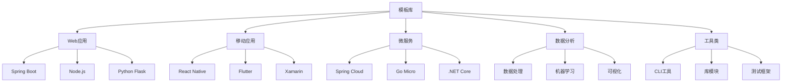

在软件开发过程中，重复性的代码结构和初始化工作占据了开发者大量的时间。通过代码模板和脚手架工具，我们可以将经过验证的最佳实践内置到项目初始化过程中，从源头上保证代码质量和一致性。本章将深入探讨代码模板与脚手架的设计原理、实现方式以及在工程效能平台中的应用。

## 代码模板的核心价值

### 什么是代码模板？

代码模板是预定义的代码结构和模式，包含了特定场景下的最佳实践和标准实现。通过模板，开发者可以快速生成符合规范的代码框架，避免重复劳动和潜在错误。

代码模板的核心特征包括：
1. **标准化**：遵循统一的编码规范和架构模式
2. **可复用**：适用于相似场景的多次使用
3. **可配置**：支持参数化定制以适应不同需求
4. **可维护**：集中管理，便于更新和改进

### 代码模板的价值体现

```java
// 传统方式 vs 模板方式的对比示例

// 传统方式：手动创建Controller
@RestController
@RequestMapping("/api/users")
public class UserController {
    
    @Autowired
    private UserService userService;
    
    @GetMapping("/{id}")
    public ResponseEntity<User> getUserById(@PathVariable Long id) {
        try {
            User user = userService.findById(id);
            if (user != null) {
                return ResponseEntity.ok(user);
            } else {
                return ResponseEntity.notFound().build();
            }
        } catch (Exception e) {
            return ResponseEntity.status(HttpStatus.INTERNAL_SERVER_ERROR).build();
        }
    }
    
    @PostMapping
    public ResponseEntity<User> createUser(@RequestBody User user) {
        try {
            User savedUser = userService.save(user);
            return ResponseEntity.status(HttpStatus.CREATED).body(savedUser);
        } catch (Exception e) {
            return ResponseEntity.status(HttpStatus.INTERNAL_SERVER_ERROR).build();
        }
    }
    
    // ... 其他方法
}

// 使用模板生成的Controller
@RestController
@RequestMapping("/api/${entityName}")
@Tag(name = "${entityName}", description = "${entityName}管理")
public class ${EntityName}Controller {
    
    @Autowired
    private ${EntityName}Service ${entityName}Service;
    
    @Operation(summary = "根据ID获取${entityName}")
    @GetMapping("/{id}")
    public ResponseEntity<ApiResponse<${EntityName}>> getById(
            @Parameter(description = "ID") @PathVariable Long id) {
        try {
            ${EntityName} entity = ${entityName}Service.findById(id);
            if (entity != null) {
                return ResponseEntity.ok(ApiResponse.success(entity));
            } else {
                return ResponseEntity.notFound().build();
            }
        } catch (BusinessException e) {
            return ResponseEntity.badRequest()
                .body(ApiResponse.error(e.getCode(), e.getMessage()));
        } catch (Exception e) {
            log.error("获取${entityName}失败", e);
            return ResponseEntity.status(HttpStatus.INTERNAL_SERVER_ERROR)
                .body(ApiResponse.error("INTERNAL_ERROR", "系统内部错误"));
        }
    }
    
    @Operation(summary = "创建${entityName}")
    @PostMapping
    public ResponseEntity<ApiResponse<${EntityName}>> create(
            @RequestBody @Valid ${EntityName} ${entityName}) {
        try {
            ${EntityName} savedEntity = ${entityName}Service.save(${entityName});
            return ResponseEntity.status(HttpStatus.CREATED)
                .body(ApiResponse.success(savedEntity));
        } catch (BusinessException e) {
            return ResponseEntity.badRequest()
                .body(ApiResponse.error(e.getCode(), e.getMessage()));
        } catch (Exception e) {
            log.error("创建${entityName}失败", e);
            return ResponseEntity.status(HttpStatus.INTERNAL_SERVER_ERROR)
                .body(ApiResponse.error("INTERNAL_ERROR", "系统内部错误"));
        }
    }
    
    // ... 其他方法由模板自动生成
}
```

## 脚手架工具的设计与实现

### 脚手架工具的核心组件

一个完整的脚手架工具通常包含以下核心组件：

#### 1. 模板引擎

模板引擎负责将模板文件与用户输入的参数进行合并，生成最终的代码文件。

```javascript
// 模板引擎示例
class TemplateEngine {
    constructor() {
        this.templateCache = new Map();
    }
    
    async render(templatePath, data) {
        // 从缓存或文件系统加载模板
        let template = this.templateCache.get(templatePath);
        if (!template) {
            template = await this.loadTemplate(templatePath);
            this.templateCache.set(templatePath, template);
        }
        
        // 渲染模板
        return this.processTemplate(template, data);
    }
    
    async loadTemplate(templatePath) {
        const templateContent = await fs.readFile(templatePath, 'utf8');
        return handlebars.compile(templateContent);
    }
    
    processTemplate(template, data) {
        // 处理特殊变量
        const processedData = this.processSpecialVariables(data);
        
        // 渲染模板
        return template(processedData);
    }
    
    processSpecialVariables(data) {
        // 处理特殊变量，如当前时间、用户名等
        return {
            ...data,
            currentTime: new Date().toISOString(),
            currentUser: process.env.USER || 'unknown',
            projectName: data.projectName || 'default-project'
        };
    }
}
```

#### 2. 配置管理器

配置管理器负责管理模板的配置信息和用户交互。

```yaml
# 脚手架配置文件示例
scaffolding:
  name: "Spring Boot Web Service"
  version: "1.0.0"
  description: "Spring Boot微服务基础模板"
  author: "Engineering Platform Team"
  
  prompts:
    - name: "projectName"
      type: "input"
      message: "项目名称:"
      default: "my-service"
      validate: "^[a-z0-9-]+$"
    
    - name: "packageName"
      type: "input"
      message: "包名:"
      default: "com.company.{{projectName}}"
      validate: "^[a-z][a-z0-9_]*(\.[a-z0-9_]+)*$"
    
    - name: "databaseType"
      type: "list"
      message: "数据库类型:"
      choices:
        - "MySQL"
        - "PostgreSQL"
        - "MongoDB"
      default: "MySQL"
    
    - name: "enableSecurity"
      type: "confirm"
      message: "是否启用安全框架?"
      default: true
    
    - name: "enableMonitoring"
      type: "confirm"
      message: "是否启用监控?"
      default: true
  
  fileMappings:
    - source: "src/main/java/__packagePath__/Application.java"
      target: "src/main/java/{{packagePath}}/Application.java"
    
    - source: "src/main/resources/application.yml"
      target: "src/main/resources/application.yml"
    
    - source: "pom.xml"
      target: "pom.xml"
  
  postActions:
    - command: "mvn clean compile"
      description: "编译项目"
      condition: "mavenProject"
    
    - command: "git init && git add . && git commit -m 'Initial commit'"
      description: "初始化Git仓库"
      condition: "gitEnabled"
```

#### 3. 文件生成器

文件生成器负责根据模板和配置生成具体的文件。

```typescript
// 文件生成器示例
export class FileGenerator {
    private templateEngine: TemplateEngine;
    private configManager: ConfigManager;
    
    constructor() {
        this.templateEngine = new TemplateEngine();
        this.configManager = new ConfigManager();
    }
    
    async generateProject(config: ProjectConfig): Promise<void> {
        // 1. 创建项目目录
        await this.createProjectDirectory(config.projectPath);
        
        // 2. 复制模板文件
        await this.copyTemplateFiles(config);
        
        // 3. 处理文件内容
        await this.processFileContents(config);
        
        // 4. 执行后置操作
        await this.executePostActions(config);
        
        console.log(`✅ 项目 ${config.projectName} 创建成功！`);
    }
    
    private async copyTemplateFiles(config: ProjectConfig): Promise<void> {
        const templateDir = path.join(__dirname, '../templates', config.templateName);
        const targetDir = config.projectPath;
        
        // 读取模板目录结构
        const fileMappings = await this.configManager.getFileMappings(config.templateName);
        
        // 处理每个文件映射
        for (const mapping of fileMappings) {
            const sourcePath = path.join(templateDir, mapping.source);
            const targetPath = path.join(
                targetDir, 
                this.renderTemplateString(mapping.target, config)
            );
            
            // 确保目标目录存在
            await fs.ensureDir(path.dirname(targetPath));
            
            // 复制文件
            if (await fs.pathExists(sourcePath)) {
                await fs.copy(sourcePath, targetPath);
            }
        }
    }
    
    private async processFileContents(config: ProjectConfig): Promise<void> {
        // 获取需要处理的文件列表
        const filesToProcess = await this.getFilesToProcess(config.projectPath);
        
        // 处理每个文件的内容
        for (const filePath of filesToProcess) {
            const content = await fs.readFile(filePath, 'utf8');
            const processedContent = await this.templateEngine.renderContent(content, config);
            await fs.writeFile(filePath, processedContent, 'utf8');
        }
    }
    
    private renderTemplateString(template: string, data: any): string {
        // 简单的模板字符串渲染
        return template.replace(/\{\{(\w+)\}\}/g, (match, key) => {
            return data[key] || match;
        });
    }
}
```

## 模板库的构建与管理

### 模板分类体系

建立清晰的模板分类体系，便于开发者快速找到合适的模板。



### 模板版本管理

实现模板的版本管理，确保模板的稳定性和可追溯性。

```json
{
  "template": {
    "name": "spring-boot-microservice",
    "version": "2.1.0",
    "displayName": "Spring Boot微服务模板",
    "description": "基于Spring Boot的微服务基础模板，包含常用组件和最佳实践",
    "tags": ["spring-boot", "microservice", "java"],
    "author": "Engineering Platform Team",
    "createdAt": "2023-01-15T10:30:00Z",
    "updatedAt": "2023-06-20T14:45:00Z",
    "compatibility": {
      "java": ">=11",
      "springBoot": "2.7.x",
      "maven": ">=3.6.0"
    },
    "dependencies": {
      "spring-boot-starter-web": "2.7.5",
      "spring-boot-starter-data-jpa": "2.7.5",
      "spring-boot-starter-security": "2.7.5",
      "spring-boot-starter-actuator": "2.7.5"
    },
    "changelog": [
      {
        "version": "2.1.0",
        "date": "2023-06-20",
        "changes": [
          "升级Spring Boot版本至2.7.5",
          "添加OpenAPI 3.0文档支持",
          "优化异常处理机制"
        ]
      },
      {
        "version": "2.0.0",
        "date": "2023-03-10",
        "changes": [
          "重构项目结构",
          "添加Docker支持",
          "集成Prometheus监控"
        ]
      }
    ]
  }
}
```

## 与工程效能平台的集成

### 平台化模板管理

通过工程效能平台实现模板的统一管理和分发。

```java
// 模板管理服务示例
@Service
public class TemplateManagementService {
    
    @Autowired
    private TemplateRepository templateRepository;
    
    @Autowired
    private TemplateValidationService validationService;
    
    public Template createTemplate(TemplateCreateRequest request) {
        // 验证模板数据
        ValidationResult validationResult = validationService.validateTemplate(request);
        if (!validationResult.isValid()) {
            throw new TemplateValidationException(validationResult.getErrors());
        }
        
        // 创建模板实体
        Template template = new Template();
        template.setName(request.getName());
        template.setDisplayName(request.getDisplayName());
        template.setDescription(request.getDescription());
        template.setCategory(request.getCategory());
        template.setTags(request.getTags());
        template.setAuthor(request.getAuthor());
        template.setCreatedAt(LocalDateTime.now());
        template.setVersion("1.0.0");
        template.setStatus(TemplateStatus.DRAFT);
        
        // 保存模板
        Template savedTemplate = templateRepository.save(template);
        
        // 上传模板文件
        uploadTemplateFiles(savedTemplate.getId(), request.getTemplateFiles());
        
        return savedTemplate;
    }
    
    public List<Template> searchTemplates(TemplateSearchRequest request) {
        Specification<Template> spec = TemplateSpecifications.builder()
            .category(request.getCategory())
            .tags(request.getTags())
            .keyword(request.getKeyword())
            .status(TemplateStatus.PUBLISHED)
            .build();
        
        return templateRepository.findAll(spec, request.getPageable());
    }
    
    public TemplateVersion publishTemplate(String templateId, String version) {
        Template template = templateRepository.findById(templateId)
            .orElseThrow(() -> new TemplateNotFoundException(templateId));
        
        // 验证模板是否可以发布
        if (!canPublishTemplate(template)) {
            throw new TemplatePublishException("Template validation failed");
        }
        
        // 创建新版本
        TemplateVersion templateVersion = new TemplateVersion();
        templateVersion.setTemplateId(templateId);
        templateVersion.setVersion(version);
        templateVersion.setPublishedAt(LocalDateTime.now());
        templateVersion.setStatus(VersionStatus.PUBLISHED);
        templateVersion.setFileHash(calculateFileHash(templateId));
        
        // 更新模板状态
        template.setVersion(version);
        template.setStatus(TemplateStatus.PUBLISHED);
        template.setUpdatedAt(LocalDateTime.now());
        templateRepository.save(template);
        
        return templateVersion;
    }
    
    private boolean canPublishTemplate(Template template) {
        // 检查模板是否包含必要的文件
        if (!hasRequiredFiles(template.getId())) {
            return false;
        }
        
        // 检查模板配置是否完整
        if (!isConfigurationComplete(template.getId())) {
            return false;
        }
        
        // 运行模板验证
        return validationService.runTemplateValidation(template.getId());
    }
}
```

### 智能模板推荐

基于项目特征和开发者偏好，智能推荐合适的模板。

```python
# 智能模板推荐系统示例
class TemplateRecommendationEngine:
    def __init__(self):
        self.template_repository = TemplateRepository()
        self.user_profile_service = UserProfileService()
        self.project_analyzer = ProjectAnalyzer()
    
    def recommend_templates(self, user_id, project_context=None):
        # 获取用户画像
        user_profile = self.user_profile_service.get_profile(user_id)
        
        # 分析项目上下文
        project_features = self.project_analyzer.analyze_context(project_context)
        
        # 获取所有可用模板
        all_templates = self.template_repository.get_published_templates()
        
        # 计算每个模板的推荐分数
        recommendations = []
        for template in all_templates:
            score = self.calculate_recommendation_score(
                template, user_profile, project_features
            )
            recommendations.append({
                'template': template,
                'score': score,
                'reasons': self.generate_recommendation_reasons(
                    template, user_profile, project_features
                )
            })
        
        # 按分数排序并返回前N个推荐
        recommendations.sort(key=lambda x: x['score'], reverse=True)
        return recommendations[:10]
    
    def calculate_recommendation_score(self, template, user_profile, project_features):
        score = 0.0
        
        # 基于技术栈匹配度评分 (权重: 0.4)
        tech_stack_score = self.calculate_tech_stack_match(
            template, project_features.get('tech_stack', [])
        )
        score += tech_stack_score * 0.4
        
        # 基于用户历史使用记录评分 (权重: 0.3)
        usage_history_score = self.calculate_usage_history_score(
            template, user_profile.get('template_usage_history', [])
        )
        score += usage_history_score * 0.3
        
        # 基于模板质量和流行度评分 (权重: 0.2)
        quality_score = self.calculate_quality_score(template)
        score += quality_score * 0.2
        
        # 基于项目复杂度匹配度评分 (权重: 0.1)
        complexity_score = self.calculate_complexity_match(
            template, project_features.get('complexity', 'medium')
        )
        score += complexity_score * 0.1
        
        return score
    
    def calculate_tech_stack_match(self, template, project_tech_stack):
        template_tags = set(template.tags)
        project_tags = set(project_tech_stack)
        
        if not project_tags:
            return 0.5  # 默认分数
        
        # 计算交集大小
        intersection = template_tags.intersection(project_tags)
        union = template_tags.union(project_tags)
        
        # 使用Jaccard相似度
        if len(union) == 0:
            return 0.0
        
        return len(intersection) / len(union)
```

## 模板最佳实践与质量保证

### 模板质量标准

建立模板质量评估标准，确保模板的实用性和可靠性。

```markdown
# 模板质量评估标准

## 1. 功能完整性 (30%)
- [ ] 包含完整的项目结构
- [ ] 提供必要的配置文件
- [ ] 包含示例代码和测试用例
- [ ] 文档齐全，说明清晰

## 2. 代码质量 (25%)
- [ ] 遵循编码规范
- [ ] 无明显代码异味
- [ ] 包含适当的错误处理
- [ ] 使用现代编程实践

## 3. 可维护性 (20%)
- [ ] 代码结构清晰
- [ ] 模块化设计良好
- [ ] 依赖关系合理
- [ ] 易于扩展和修改

## 4. 安全性 (15%)
- [ ] 无已知安全漏洞
- [ ] 包含安全最佳实践
- [ ] 依赖库版本较新
- [ ] 配置文件安全设置

## 5. 性能 (10%)
- [ ] 启动时间合理
- [ ] 资源使用效率高
- [ ] 包含性能优化配置
- [ ] 支持监控和诊断

总分: ____/100
评级: 
- 90-100: 优秀 (推荐)
- 75-89: 良好 (可用)
- 60-74: 一般 (需改进)
- <60: 不合格 (不推荐)
```

### 模板测试与验证

建立模板测试机制，确保模板的正确性和稳定性。

```java
// 模板测试框架示例
public class TemplateTestFramework {
    
    public TemplateTestResult testTemplate(String templateId) {
        TemplateTestResult result = new TemplateTestResult();
        result.setTemplateId(templateId);
        result.setStartTime(LocalDateTime.now());
        
        try {
            // 1. 模板完整性测试
            TemplateIntegrityTestResult integrityResult = testTemplateIntegrity(templateId);
            result.setIntegrityResult(integrityResult);
            
            // 2. 代码质量测试
            CodeQualityTestResult qualityResult = testCodeQuality(templateId);
            result.setQualityResult(qualityResult);
            
            // 3. 构建测试
            BuildTestResult buildResult = testBuild(templateId);
            result.setBuildResult(buildResult);
            
            // 4. 运行时测试
            RuntimeTestResult runtimeResult = testRuntime(templateId);
            result.setRuntimeResult(runtimeResult);
            
            // 5. 安全测试
            SecurityTestResult securityResult = testSecurity(templateId);
            result.setSecurityResult(securityResult);
            
            // 计算总分
            int totalScore = calculateTotalScore(result);
            result.setTotalScore(totalScore);
            result.setStatus(totalScore >= 80 ? TestStatus.PASS : TestStatus.FAIL);
            
        } catch (Exception e) {
            result.setStatus(TestStatus.ERROR);
            result.setErrorMessage(e.getMessage());
        } finally {
            result.setEndTime(LocalDateTime.now());
        }
        
        return result;
    }
    
    private TemplateIntegrityTestResult testTemplateIntegrity(String templateId) {
        TemplateIntegrityTestResult result = new TemplateIntegrityTestResult();
        
        // 检查必需文件是否存在
        List<String> requiredFiles = Arrays.asList(
            "README.md",
            "pom.xml",  // 或其他构建文件
            "src/main/resources/application.yml",
            "src/test/java/**/*Test.java"
        );
        
        for (String requiredFile : requiredFiles) {
            if (!fileExists(templateId, requiredFile)) {
                result.addMissingFile(requiredFile);
            }
        }
        
        // 检查配置文件格式
        result.setConfigFileValid(validateConfigFiles(templateId));
        
        // 检查文档完整性
        result.setDocumentationComplete(checkDocumentation(templateId));
        
        result.setScore(calculateIntegrityScore(result));
        return result;
    }
    
    private BuildTestResult testBuild(String templateId) {
        BuildTestResult result = new BuildTestResult();
        
        // 创建临时工作目录
        Path workDir = createTempDirectory();
        
        try {
            // 解压模板到工作目录
            extractTemplate(templateId, workDir);
            
            // 执行构建命令
            ProcessBuilder pb = new ProcessBuilder("mvn", "clean", "compile");
            pb.directory(workDir.toFile());
            
            Process process = pb.start();
            int exitCode = process.waitFor();
            
            result.setBuildSuccessful(exitCode == 0);
            result.setBuildOutput(readProcessOutput(process));
            
            if (exitCode == 0) {
                // 如果编译成功，继续测试打包
                ProcessBuilder packagePb = new ProcessBuilder("mvn", "package");
                packagePb.directory(workDir.toFile());
                
                Process packageProcess = packagePb.start();
                int packageExitCode = packageProcess.waitFor();
                
                result.setPackageSuccessful(packageExitCode == 0);
                result.setPackageOutput(readProcessOutput(packageProcess));
            }
            
        } catch (Exception e) {
            result.setBuildSuccessful(false);
            result.setErrorMessage(e.getMessage());
        } finally {
            // 清理临时目录
            deleteTempDirectory(workDir);
        }
        
        result.setScore(calculateBuildScore(result));
        return result;
    }
}
```

## 企业级模板应用案例

### 大型企业模板体系

大型企业通常需要建立完整的模板体系来支持不同业务场景。

```yaml
# 企业级模板体系示例
enterpriseTemplates:
  frontend:
    webApplications:
      react:
        - name: "react-admin-template"
          description: "React管理后台模板"
          version: "3.2.1"
          tags: ["react", "admin", "typescript", "antd"]
          
        - name: "react-landing-page"
          description: "React营销页面模板"
          version: "1.5.0"
          tags: ["react", "landing", "responsive", "seo"]
          
        - name: "react-mobile-app"
          description: "React移动端应用模板"
          version: "2.1.3"
          tags: ["react", "mobile", "pwa", "cordova"]
    
    mobileApplications:
      reactNative:
        - name: "rn-enterprise-app"
          description: "React Native企业级应用模板"
          version: "4.0.2"
          tags: ["react-native", "enterprise", "redux", "navigation"]
          
        - name: "rn-ecommerce"
          description: "React Native电商应用模板"
          version: "1.8.0"
          tags: ["react-native", "ecommerce", "payment", "cart"]
  
  backend:
    microservices:
      springBoot:
        - name: "spring-boot-base"
          description: "Spring Boot基础服务模板"
          version: "2.7.5"
          tags: ["spring-boot", "microservice", "java", "rest"]
          
        - name: "spring-boot-ddd"
          description: "Spring Boot领域驱动设计模板"
          version: "1.3.4"
          tags: ["spring-boot", "ddd", "cqrs", "event-sourcing"]
          
        - name: "spring-boot-kafka"
          description: "Spring Boot Kafka集成模板"
          version: "2.1.0"
          tags: ["spring-boot", "kafka", "streaming", "messaging"]
    
    dataProcessing:
      python:
        - name: "python-data-pipeline"
          description: "Python数据处理管道模板"
          version: "1.2.3"
          tags: ["python", "data", "pandas", "spark"]
          
        - name: "ml-model-service"
          description: "机器学习模型服务模板"
          version: "3.0.1"
          tags: ["python", "ml", "scikit-learn", "flask", "api"]
  
  infrastructure:
    kubernetes:
      - name: "k8s-deployment"
        description: "Kubernetes部署模板"
        version: "1.5.2"
        tags: ["kubernetes", "helm", "deployment", "monitoring"]
        
      - name: "k8s-operator"
        description: "Kubernetes Operator模板"
        version: "0.9.1"
        tags: ["kubernetes", "operator", "go", "controller"]
    
    cloud:
      aws:
        - name: "aws-lambda-function"
          description: "AWS Lambda函数模板"
          version: "2.4.0"
          tags: ["aws", "lambda", "serverless", "python"]
          
        - name: "aws-ecs-service"
          description: "AWS ECS服务模板"
          version: "1.7.3"
          tags: ["aws", "ecs", "docker", "microservice"]
```

### 模板使用统计与分析

通过数据分析优化模板设计和推广策略。

```sql
-- 模板使用统计查询示例
SELECT 
    t.name as template_name,
    t.category,
    COUNT(p.id) as project_count,
    AVG(p.completion_time) as avg_completion_time,
    AVG(p.code_quality_score) as avg_code_quality,
    COUNT(CASE WHEN p.status = 'SUCCESS' THEN 1 END) * 100.0 / COUNT(p.id) as success_rate
FROM templates t
JOIN projects p ON t.id = p.template_id
WHERE p.created_at >= DATE_SUB(NOW(), INTERVAL 6 MONTH)
GROUP BY t.id, t.name, t.category
ORDER BY project_count DESC;

-- 用户偏好分析查询
SELECT 
    u.department,
    t.category,
    COUNT(*) as usage_count,
    AVG(tr.score) as avg_recommendation_score
FROM user_templates ut
JOIN users u ON ut.user_id = u.id
JOIN templates t ON ut.template_id = t.id
LEFT JOIN template_recommendations tr ON ut.template_id = tr.template_id AND ut.user_id = tr.user_id
WHERE ut.used_at >= DATE_SUB(NOW(), INTERVAL 3 MONTH)
GROUP BY u.department, t.category
ORDER BY usage_count DESC;
```

## 模板生态建设

### 社区模板集成

整合开源社区的优质模板，丰富企业模板库。

```java
// 社区模板集成服务示例
@Service
public class CommunityTemplateIntegrationService {
    
    @Autowired
    private TemplateRepository templateRepository;
    
    @Autowired
    private ExternalTemplateSourceService externalSourceService;
    
    public void syncCommunityTemplates() {
        // 获取支持的外部模板源
        List<ExternalTemplateSource> sources = externalSourceService.getSupportedSources();
        
        for (ExternalTemplateSource source : sources) {
            try {
                // 从外部源获取模板列表
                List<ExternalTemplate> externalTemplates = externalSourceService
                    .getTemplates(source);
                
                // 处理每个外部模板
                for (ExternalTemplate extTemplate : externalTemplates) {
                    processExternalTemplate(extTemplate, source);
                }
                
            } catch (Exception e) {
                log.error("Failed to sync templates from source: " + source.getName(), e);
            }
        }
    }
    
    private void processExternalTemplate(ExternalTemplate extTemplate, 
                                      ExternalTemplateSource source) {
        // 检查模板是否已存在
        Optional<Template> existingTemplate = templateRepository
            .findByNameAndSource(extTemplate.getName(), source.getId());
        
        if (existingTemplate.isPresent()) {
            // 如果存在，检查是否需要更新
            Template template = existingTemplate.get();
            if (needsUpdate(template, extTemplate)) {
                updateTemplate(template, extTemplate, source);
            }
        } else {
            // 如果不存在，创建新模板
            createTemplateFromExternal(extTemplate, source);
        }
    }
    
    private boolean needsUpdate(Template existingTemplate, 
                              ExternalTemplate externalTemplate) {
        // 比较版本号
        return !existingTemplate.getExternalVersion()
            .equals(externalTemplate.getVersion());
    }
    
    private void updateTemplate(Template existingTemplate, 
                              ExternalTemplate externalTemplate,
                              ExternalTemplateSource source) {
        // 更新模板信息
        existingTemplate.setExternalVersion(externalTemplate.getVersion());
        existingTemplate.setDescription(externalTemplate.getDescription());
        existingTemplate.setTags(externalTemplate.getTags());
        existingTemplate.setUpdatedAt(LocalDateTime.now());
        
        // 更新模板文件
        downloadAndReplaceTemplateFiles(existingTemplate.getId(), externalTemplate);
        
        // 重新运行测试
        templateTestService.testTemplate(existingTemplate.getId());
        
        templateRepository.save(existingTemplate);
        
        log.info("Updated template: " + existingTemplate.getName());
    }
}
```

### 模板贡献与协作

建立模板贡献机制，鼓励开发者分享和改进模板。

```markdown
# 模板贡献指南

## 1. 贡献流程

1. **Fork模板仓库**
   - 在企业模板平台上Fork感兴趣的模板

2. **创建功能分支**
   ```bash
   git checkout -b feature/new-feature
   ```

3. **实现改进**
   - 添加新功能
   - 修复bug
   - 优化性能
   - 改进文档

4. **测试验证**
   - 确保所有测试通过
   - 添加必要的测试用例

5. **提交Pull Request**
   - 提供详细的变更说明
   - 关联相关的问题或需求

## 2. 贡献标准

### 代码质量要求
- 遵循项目编码规范
- 通过所有自动化测试
- 包含适当的文档更新
- 提供使用示例

### 文档要求
- 更新README文件
- 添加API文档（如适用）
- 提供配置说明
- 包含最佳实践指南

### 测试要求
- 单元测试覆盖率 >= 80%
- 集成测试覆盖核心功能
- 性能测试（如适用）
- 安全扫描通过

## 3. 模板维护者职责

- 审查Pull Request
- 回复社区问题
- 发布新版本
- 维护文档
- 监控模板使用情况

## 4. 贡献者权益

- 在贡献者列表中署名
- 获得模板使用积分
- 参与模板设计决策
- 优先获取新功能预览
```

## 总结

代码模板与脚手架是实现Day-0预防的重要手段，通过将最佳实践内置到项目初始化过程中，可以从源头上保证代码质量和一致性。一个完善的模板体系应该包括：

1. **标准化的模板设计**：遵循统一的编码规范和架构模式
2. **灵活的配置机制**：支持参数化定制以适应不同需求
3. **强大的脚手架工具**：提供友好的用户交互和高效的文件生成
4. **平台化管理**：通过工程效能平台实现模板的统一管理和分发
5. **质量保证体系**：建立模板质量标准和测试验证机制
6. **生态建设**：整合社区资源，鼓励贡献和协作

在实施过程中，需要注意以下要点：

1. **用户体验优先**：确保模板易于使用和定制
2. **持续改进**：基于使用反馈不断优化模板
3. **质量控制**：建立严格的模板质量评估标准
4. **安全考虑**：确保模板不包含安全漏洞
5. **版本管理**：实现模板的版本控制和兼容性管理

通过精心设计和管理的代码模板与脚手架体系，企业可以显著提升开发效率，降低项目启动成本，同时确保代码质量和一致性。这不仅有助于新项目的快速启动，也为现有项目的重构和优化提供了标准化的参考。

在下一节中，我们将探讨统一代码规范与格式化的实现，这是保证代码一致性和可维护性的另一项重要措施。