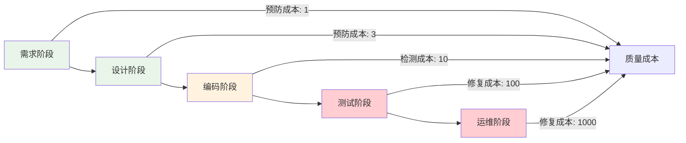

在现代软件开发实践中，质量问题的预防比事后的检测和修复更为重要且成本更低。Day-0预防理念强调在代码编写阶段就内置质量保障机制，通过IDE插件、代码模板、规范管控等手段，在开发者编写代码的第一时间就提供质量反馈和指导。本章将深入探讨如何通过技术手段提升开发者体验，实现从源头上保证代码质量的目标。

## Day-0预防的核心理念

### 1. 预防优于检测

传统的质量保障方式主要依赖于代码提交后的检测和审查，这种方式存在明显的滞后性。Day-0预防理念将质量保障的关口前移，在代码编写的最初阶段就开始质量控制。

#### 预防与检测的成本对比


### 2. 开发者体验的重要性

开发者体验直接影响开发效率和代码质量。良好的开发者体验能够：
- 提高开发效率
- 减少错误发生
- 增强团队凝聚力
- 促进最佳实践的采用

#### 开发者体验要素
```java
// 开发者体验评估模型
public class DeveloperExperienceModel {
    
    // 实时反馈能力
    private FeedbackCapability feedbackCapability;
    
    // 工具集成度
    private ToolIntegrationLevel toolIntegration;
    
    // 学习成本
    private LearningCost learningCost;
    
    // 自动化程度
    private AutomationLevel automationLevel;
    
    // 个性化支持
    private PersonalizationSupport personalization;
    
    // 协作便利性
    private CollaborationFacility collaboration;
    
    public double calculateExperienceScore() {
        return (feedbackCapability.getScore() * 0.3 +
                toolIntegration.getScore() * 0.2 +
                (10 - learningCost.getScore()) * 0.1 +
                automationLevel.getScore() * 0.2 +
                personalization.getScore() * 0.1 +
                collaboration.getScore() * 0.1);
    }
}
```

## IDE插件开发与集成

### 1. 本地编码实时反馈

在开发者编写代码的过程中提供实时的质量反馈，帮助开发者及时发现和修复问题。

#### IDE插件架构设计
```java
// IDE插件核心服务
public class IdePluginService {
    
    @Autowired
    private CodeAnalysisService codeAnalysisService;
    
    @Autowired
    private QualityRuleService ruleService;
    
    @Autowired
    private DeveloperPreferencesService preferencesService;
    
    public void onCodeChange(CodeChangeEvent event) {
        // 1. 获取当前文件内容
        String fileContent = event.getFileContent();
        String filePath = event.getFilePath();
        
        // 2. 获取开发者偏好设置
        DeveloperPreferences preferences = preferencesService
            .getPreferences(event.getDeveloperId());
        
        // 3. 执行实时代码分析
        List<CodeIssue> issues = codeAnalysisService.analyzeCode(
            fileContent, filePath, preferences.getEnabledRules());
        
        // 4. 过滤和优先级排序
        List<CodeIssue> filteredIssues = filterIssues(issues, preferences);
        
        // 5. 发送实时反馈到IDE
        sendRealTimeFeedback(event, filteredIssues);
    }
    
    private List<CodeIssue> filterIssues(List<CodeIssue> issues, 
                                      DeveloperPreferences preferences) {
        return issues.stream()
            .filter(issue -> issue.getSeverity().getLevel() >= 
                           preferences.getMinSeverityLevel())
            .filter(issue -> preferences.getEnabledRuleCategories()
                           .contains(issue.getCategory()))
            .sorted(Comparator.comparing(CodeIssue::getSeverity).reversed())
            .collect(Collectors.toList());
    }
    
    private void sendRealTimeFeedback(CodeChangeEvent event, List<CodeIssue> issues) {
        // 通过IDE插件API发送反馈
        IdeFeedback feedback = IdeFeedback.builder()
            .fileId(event.getFileId())
            .issues(issues)
            .timestamp(Instant.now())
            .build();
        
        idePluginApi.sendFeedback(feedback);
    }
}
```

### 2. 智能代码补全与建议

基于代码上下文和质量规则，提供智能的代码补全和改进建议。

#### 智能补全服务
```java
// 智能代码补全服务
@Service
public class SmartCodeCompletionService {
    
    @Autowired
    private CodeContextAnalyzer contextAnalyzer;
    
    @Autowired
    private BestPracticeRepository bestPracticeRepository;
    
    @Autowired
    private CodeTemplateService templateService;
    
    public List<CompletionSuggestion> getSuggestions(CodeCompletionContext context) {
        List<CompletionSuggestion> suggestions = new ArrayList<>();
        
        // 1. 分析代码上下文
        CodeContext codeContext = contextAnalyzer.analyze(context);
        
        // 2. 获取相关最佳实践
        List<BestPractice> bestPractices = bestPracticeRepository
            .findByContextAndLanguage(codeContext, context.getLanguage());
        
        // 3. 生成代码模板建议
        List<CodeTemplate> templates = templateService
            .getRelevantTemplates(codeContext, context.getLanguage());
        
        // 4. 生成智能建议
        suggestions.addAll(generateBestPracticeSuggestions(bestPractices, context));
        suggestions.addAll(generateTemplateSuggestions(templates, context));
        suggestions.addAll(generateRefactoringSuggestions(context));
        
        // 5. 排序建议
        return sortSuggestions(suggestions, context.getDeveloperId());
    }
    
    private List<CompletionSuggestion> generateBestPracticeSuggestions(
            List<BestPractice> bestPractices, CodeCompletionContext context) {
        List<CompletionSuggestion> suggestions = new ArrayList<>();
        
        for (BestPractice practice : bestPractices) {
            CompletionSuggestion suggestion = CompletionSuggestion.builder()
                .type(SuggestionType.BEST_PRACTICE)
                .title(practice.getTitle())
                .description(practice.getDescription())
                .codeSnippet(practice.getExampleCode())
                .relevanceScore(calculateRelevance(practice, context))
                .documentationUrl(practice.getDocumentationUrl())
                .build();
            
            suggestions.add(suggestion);
        }
        
        return suggestions;
    }
    
    private List<CompletionSuggestion> generateTemplateSuggestions(
            List<CodeTemplate> templates, CodeCompletionContext context) {
        List<CompletionSuggestion> suggestions = new ArrayList<>();
        
        for (CodeTemplate template : templates) {
            CompletionSuggestion suggestion = CompletionSuggestion.builder()
                .type(SuggestionType.TEMPLATE)
                .title(template.getName())
                .description(template.getDescription())
                .codeSnippet(template.getTemplateContent())
                .relevanceScore(calculateTemplateRelevance(template, context))
                .parameters(template.getParameters())
                .build();
            
            suggestions.add(suggestion);
        }
        
        return suggestions;
    }
}
```

## 代码模板与脚手架

### 1. 内置最佳实践的模板系统

通过预定义的代码模板，确保新创建的代码符合最佳实践和质量标准。

#### 模板管理系统
```java
// 代码模板管理服务
@Service
public class CodeTemplateService {
    
    @Autowired
    private TemplateRepository templateRepository;
    
    @Autowired
    private ProjectConfigurationService configService;
    
    public List<CodeTemplate> getAvailableTemplates(String projectId, String language) {
        // 1. 获取项目配置
        ProjectConfiguration config = configService.getConfiguration(projectId);
        
        // 2. 获取语言相关的模板
        List<CodeTemplate> languageTemplates = templateRepository
            .findByLanguage(language);
        
        // 3. 根据项目配置过滤模板
        return languageTemplates.stream()
            .filter(template -> isTemplateCompatible(template, config))
            .collect(Collectors.toList());
    }
    
    public GeneratedCode generateFromTemplate(String templateId, 
                                           Map<String, Object> parameters) {
        CodeTemplate template = templateRepository.findById(templateId);
        
        // 1. 验证参数
        validateParameters(template, parameters);
        
        // 2. 处理模板变量
        String processedContent = processTemplateVariables(
            template.getTemplateContent(), parameters);
        
        // 3. 应用代码格式化
        String formattedContent = formatCode(processedContent, template.getLanguage());
        
        // 4. 生成相关文件
        List<GeneratedFile> relatedFiles = generateRelatedFiles(template, parameters);
        
        return GeneratedCode.builder()
            .mainFile(GeneratedFile.builder()
                .name(template.getOutputFileName())
                .content(formattedContent)
                .build())
            .relatedFiles(relatedFiles)
            .build();
    }
    
    private String processTemplateVariables(String templateContent, 
                                         Map<String, Object> parameters) {
        String result = templateContent;
        
        // 处理简单的变量替换
        for (Map.Entry<String, Object> entry : parameters.entrySet()) {
            String placeholder = "${" + entry.getKey() + "}";
            String value = entry.getValue().toString();
            result = result.replace(placeholder, value);
        }
        
        // 处理条件逻辑
        result = processConditionalLogic(result, parameters);
        
        // 处理循环逻辑
        result = processLoopLogic(result, parameters);
        
        return result;
    }
    
    private List<GeneratedFile> generateRelatedFiles(CodeTemplate template, 
                                                   Map<String, Object> parameters) {
        List<GeneratedFile> files = new ArrayList<>();
        
        for (RelatedFileTemplate relatedTemplate : template.getRelatedFiles()) {
            String content = processTemplateVariables(
                relatedTemplate.getTemplateContent(), parameters);
            
            files.add(GeneratedFile.builder()
                .name(relatedTemplate.getOutputFileName())
                .content(content)
                .build());
        }
        
        return files;
    }
}
```

### 2. 项目脚手架工具

提供项目级别的脚手架工具，快速创建符合规范的项目结构。

#### 脚手架工具实现
```java
// 项目脚手架服务
@Service
public class ProjectScaffoldingService {
    
    @Autowired
    private ScaffoldTemplateRepository scaffoldRepository;
    
    @Autowired
    private FileGenerationService fileGenerationService;
    
    @Autowired
    private ConfigurationService configService;
    
    public void createProject(ProjectCreationRequest request) {
        // 1. 选择脚手架模板
        ScaffoldTemplate template = scaffoldRepository
            .findByNameAndVersion(request.getTemplateName(), request.getVersion());
        
        // 2. 创建项目目录
        Path projectPath = createProjectDirectory(request.getProjectName());
        
        // 3. 生成项目文件
        generateProjectFiles(template, request, projectPath);
        
        // 4. 应用项目配置
        applyProjectConfiguration(request, projectPath);
        
        // 5. 初始化版本控制
        initializeVersionControl(projectPath, request);
        
        // 6. 安装依赖
        installDependencies(projectPath, template);
    }
    
    private void generateProjectFiles(ScaffoldTemplate template, 
                                   ProjectCreationRequest request, 
                                   Path projectPath) {
        // 处理文件模板
        for (FileTemplate fileTemplate : template.getFileTemplates()) {
            // 处理模板变量
            Map<String, Object> variables = prepareVariables(request, template);
            
            String content = processFileTemplate(fileTemplate.getContent(), variables);
            String fileName = processFileName(fileTemplate.getName(), variables);
            
            // 创建文件
            Path filePath = projectPath.resolve(fileName);
            fileGenerationService.createFile(filePath, content);
        }
        
        // 处理目录结构
        for (DirectoryStructure dir : template.getDirectoryStructure()) {
            Path dirPath = projectPath.resolve(dir.getPath());
            try {
                Files.createDirectories(dirPath);
            } catch (IOException e) {
                throw new RuntimeException("Failed to create directory: " + dirPath, e);
            }
        }
    }
    
    private Map<String, Object> prepareVariables(ProjectCreationRequest request, 
                                              ScaffoldTemplate template) {
        Map<String, Object> variables = new HashMap<>();
        
        // 基本变量
        variables.put("projectName", request.getProjectName());
        variables.put("groupId", request.getGroupId());
        variables.put("artifactId", request.getArtifactId());
        variables.put("version", request.getVersion());
        variables.put("packageName", request.getPackageName());
        variables.put("author", request.getAuthor());
        variables.put("creationDate", LocalDate.now().toString());
        
        // 模板特定变量
        variables.putAll(request.getCustomParameters());
        
        // 配置变量
        ProjectConfiguration config = configService.getDefaultConfiguration();
        variables.put("defaultConfig", config);
        
        return variables;
    }
    
    private void applyProjectConfiguration(ProjectCreationRequest request, 
                                        Path projectPath) {
        // 生成配置文件
        ProjectConfiguration config = configService
            .createConfiguration(request.getConfiguration());
        
        // 写入配置文件
        Path configPath = projectPath.resolve("project-config.json");
        try {
            ObjectMapper mapper = new ObjectMapper();
            mapper.writeValue(configPath.toFile(), config);
        } catch (IOException e) {
            throw new RuntimeException("Failed to write configuration file", e);
        }
    }
}
```

## 统一代码规范与格式化

### 1. 规范管控平台

建立统一的代码规范管控平台，确保团队遵循一致的编码标准。

#### 规范管理服务
```java
// 代码规范管理服务
@Service
public class CodeStandardManagementService {
    
    @Autowired
    private StandardRepository standardRepository;
    
    @Autowired
    private RuleEngineService ruleEngineService;
    
    @Autowired
    private IntegrationService integrationService;
    
    public void enforceCodeStandards(String projectId) {
        // 1. 获取项目适用的规范
        List<CodeStandard> standards = standardRepository
            .findByProjectId(projectId);
        
        // 2. 配置规则引擎
        configureRuleEngine(standards);
        
        // 3. 集成到开发工具链
        integrateWithToolchain(projectId, standards);
        
        // 4. 设置检查点
        setupCheckpoints(projectId, standards);
    }
    
    private void configureRuleEngine(List<CodeStandard> standards) {
        for (CodeStandard standard : standards) {
            // 注册规范规则
            ruleEngineService.registerRules(standard.getRules());
            
            // 配置严重级别
            ruleEngineService.configureSeverity(standard.getRuleSeverities());
            
            // 设置例外规则
            ruleEngineService.configureExceptions(standard.getExceptions());
        }
    }
    
    private void integrateWithToolchain(String projectId, List<CodeStandard> standards) {
        // 集成到IDE
        integrationService.integrateWithIde(projectId, standards);
        
        // 集成到CI/CD
        integrationService.integrateWithCiCd(projectId, standards);
        
        // 集成到代码审查工具
        integrationService.integrateWithCodeReview(projectId, standards);
    }
    
    public StandardComplianceReport generateComplianceReport(String projectId) {
        // 1. 收集代码数据
        List<SourceFile> sourceFiles = getSourceFiles(projectId);
        
        // 2. 执行规范检查
        List<StandardViolation> violations = new ArrayList<>();
        for (SourceFile file : sourceFiles) {
            List<StandardViolation> fileViolations = ruleEngineService
                .checkFile(file);
            violations.addAll(fileViolations);
        }
        
        // 3. 生成报告
        StandardComplianceReport report = new StandardComplianceReport();
        report.setProjectId(projectId);
        report.setTotalFiles(sourceFiles.size());
        report.setTotalViolations(violations.size());
        report.setViolationsByCategory(groupViolationsByCategory(violations));
        report.setViolationsBySeverity(groupViolationsBySeverity(violations));
        report.setComplianceRate(calculateComplianceRate(violations, sourceFiles));
        report.setTrendAnalysis(analyzeTrend(projectId));
        
        return report;
    }
}
```

### 2. 自动格式化工具

通过自动格式化工具确保代码风格的一致性。

#### 自动格式化实现
```java
// 自动代码格式化服务
@Service
public class AutoFormattingService {
    
    @Autowired
    private FormatterConfigurationService configService;
    
    @Autowired
    private FileWatcherService fileWatcherService;
    
    @Autowired
    private VersionControlService versionControlService;
    
    public void formatCodeAutomatically(String filePath) {
        try {
            // 1. 读取文件内容
            String originalContent = readFile(filePath);
            
            // 2. 获取格式化配置
            FormatterConfiguration config = configService
                .getConfigurationForFile(filePath);
            
            // 3. 执行格式化
            String formattedContent = formatContent(originalContent, config);
            
            // 4. 如果内容有变化，保存文件
            if (!originalContent.equals(formattedContent)) {
                writeFile(filePath, formattedContent);
                
                // 5. 如果文件在版本控制中，自动提交格式化更改
                if (versionControlService.isFileTracked(filePath)) {
                    versionControlService.commitFormattedChange(filePath, 
                        "Auto-format code");
                }
            }
        } catch (Exception e) {
            log.error("Failed to format file: " + filePath, e);
        }
    }
    
    @EventListener
    public void onFileSave(FileSaveEvent event) {
        // 文件保存时自动格式化
        if (shouldFormatOnSave(event.getFilePath())) {
            formatCodeAutomatically(event.getFilePath());
        }
    }
    
    private String formatContent(String content, FormatterConfiguration config) {
        // 根据文件类型选择合适的格式化器
        CodeFormatter formatter = getFormatterForLanguage(config.getLanguage());
        
        // 应用格式化配置
        formatter.setConfiguration(config);
        
        // 执行格式化
        return formatter.format(content);
    }
    
    private CodeFormatter getFormatterForLanguage(String language) {
        switch (language.toLowerCase()) {
            case "java":
                return new JavaFormatter();
            case "javascript":
            case "typescript":
                return new JavaScriptFormatter();
            case "python":
                return new PythonFormatter();
            case "go":
                return new GoFormatter();
            default:
                throw new UnsupportedOperationException("Unsupported language: " + language);
        }
    }
    
    public void formatProject(String projectId) {
        // 获取项目所有源文件
        List<String> sourceFiles = getProjectSourceFiles(projectId);
        
        // 并行格式化文件
        sourceFiles.parallelStream().forEach(this::formatCodeAutomatically);
        
        // 提交所有格式化更改
        versionControlService.commitAllFormattedChanges(projectId, 
            "Auto-format entire project");
    }
}
```

## 开发者体验优化策略

### 1. 个性化配置支持

根据开发者个人偏好提供个性化的工具配置。

#### 个性化服务实现
```java
// 开发者个性化服务
@Service
public class DeveloperPersonalizationService {
    
    @Autowired
    private DeveloperProfileRepository profileRepository;
    
    @Autowired
    private PreferenceTemplateRepository templateRepository;
    
    public DeveloperPreferences getPersonalizedPreferences(String developerId) {
        // 1. 获取开发者档案
        DeveloperProfile profile = profileRepository.findByDeveloperId(developerId);
        
        // 2. 获取基础偏好设置
        DeveloperPreferences preferences = profile.getPreferences();
        
        // 3. 根据历史行为优化偏好
        optimizePreferences(preferences, profile.getBehaviorHistory());
        
        // 4. 应用团队标准
        applyTeamStandards(preferences, profile.getTeamId());
        
        return preferences;
    }
    
    private void optimizePreferences(DeveloperPreferences preferences, 
                                  List<BehaviorRecord> behaviorHistory) {
        // 分析开发者行为模式
        BehaviorPattern pattern = analyzeBehaviorPattern(behaviorHistory);
        
        // 根据行为模式调整偏好
        if (pattern.getPreferredFeedbackStyle() == FeedbackStyle.IMMEDIATE) {
            preferences.setRealTimeFeedbackEnabled(true);
        }
        
        if (pattern.getAttentionSpan() < 10) { // 注意力持续时间少于10分钟
            preferences.setNotificationFrequency(NotificationFrequency.LOW);
        }
        
        // 调整个性化建议
        preferences.setSuggestionLevel(calculateSuggestionLevel(pattern));
    }
    
    public void applyPreferenceTemplate(String developerId, String templateName) {
        PreferenceTemplate template = templateRepository.findByName(templateName);
        
        DeveloperProfile profile = profileRepository.findByDeveloperId(developerId);
        DeveloperPreferences preferences = profile.getPreferences();
        
        // 应用模板配置
        preferences.applyTemplate(template);
        
        // 保存更新后的偏好
        profileRepository.updatePreferences(developerId, preferences);
    }
}
```

### 2. 学习与成长支持

提供学习资源和成长路径，帮助开发者提升技能。

#### 学习支持服务
```java
// 开发者学习支持服务
@Service
public class DeveloperLearningSupportService {
    
    @Autowired
    private LearningResourceRepository resourceRepository;
    
    @Autowired
    private SkillAssessmentService assessmentService;
    
    @Autowired
    private RecommendationService recommendationService;
    
    public LearningPath generatePersonalizedLearningPath(String developerId) {
        // 1. 评估当前技能水平
        SkillAssessment assessment = assessmentService.assessSkills(developerId);
        
        // 2. 确定学习目标
        LearningGoals goals = determineLearningGoals(developerId, assessment);
        
        // 3. 推荐学习资源
        List<LearningResource> resources = recommendationService
            .recommendResources(developerId, goals, assessment);
        
        // 4. 构建学习路径
        LearningPath learningPath = buildLearningPath(resources, goals);
        
        // 5. 设置里程碑和评估点
        setupMilestones(learningPath);
        
        return learningPath;
    }
    
    private LearningGoals determineLearningGoals(String developerId, 
                                             SkillAssessment assessment) {
        LearningGoals goals = new LearningGoals();
        
        // 基于技能差距确定学习目标
        goals.setQualityImprovementGoals(determineQualityGoals(assessment));
        goals.setEfficiencyGoals(determineEfficiencyGoals(assessment));
        goals.setBestPracticeGoals(determineBestPracticeGoals(assessment));
        
        // 考虑职业发展路径
        goals.setCareerDevelopmentGoals(determineCareerGoals(developerId));
        
        return goals;
    }
    
    public void trackLearningProgress(String developerId, LearningActivity activity) {
        // 记录学习活动
        learningActivityRepository.save(activity);
        
        // 更新技能评估
        updateSkillAssessment(developerId, activity);
        
        // 调整学习路径
        adjustLearningPath(developerId, activity);
        
        // 发放成就奖励
        awardAchievements(developerId, activity);
    }
}
```

## 总结

Day-0预防与开发者体验优化是现代工程效能平台的重要组成部分。通过在代码编写的最初阶段就内置质量保障机制，能够显著降低质量问题的发生率和修复成本。

关键要点包括：

1. **IDE插件集成**：提供实时的代码质量反馈和智能建议
2. **代码模板系统**：通过预定义模板确保代码符合最佳实践
3. **项目脚手架工具**：快速创建标准化的项目结构
4. **统一规范管控**：建立一致的代码规范和自动格式化机制
5. **个性化体验**：根据开发者偏好提供定制化的工具配置
6. **学习支持**：提供学习资源和成长路径帮助开发者提升技能

在实施Day-0预防策略时，需要平衡质量要求与开发效率，避免过度限制影响开发体验。通过合理的工具支持和流程设计，Day-0预防能够成为提升代码质量和开发效率的有效手段。

在下一节中，我们将探讨IDE插件开发与集成的具体实现，包括本地编码实时反馈和预提交检查等关键技术。