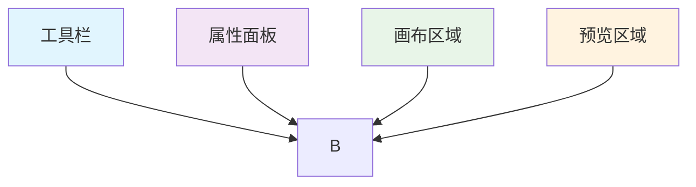
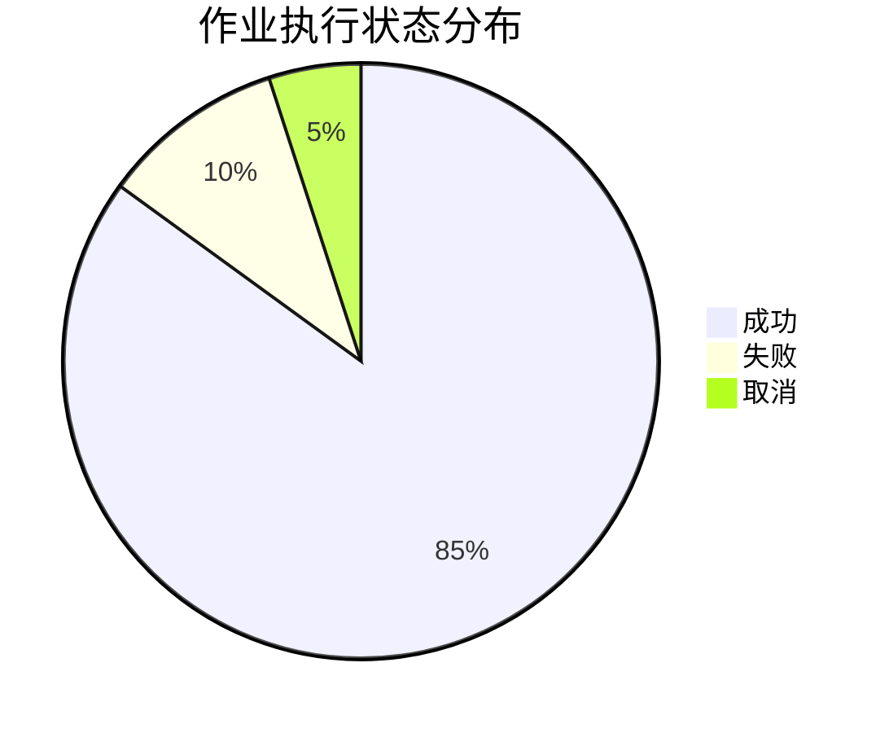
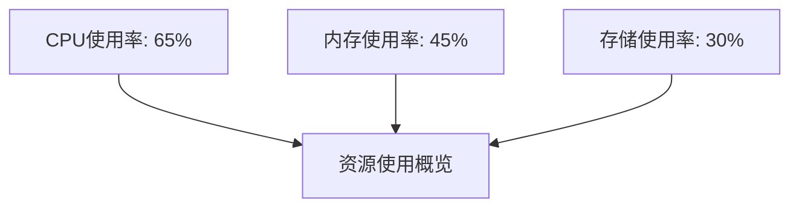

在企业级作业平台中，Web控制台是用户与系统交互的主要界面，其设计质量直接影响用户的使用体验和工作效率。一个优秀的Web控制台应该具备直观的界面设计、丰富的功能模块和流畅的交互体验。本章将深入探讨Web控制台设计的核心要素，包括作业设计器、执行详情页和仪表盘三个关键模块的设计与实现。

## 作业设计器：拖拽/表单式设计体验

作业设计器是Web控制台的核心功能模块，它允许用户通过可视化的方式设计和配置作业流程。一个好的作业设计器应该提供灵活的设计方式，满足不同用户的需求，同时保证设计的准确性和易用性。

### 拖拽式设计：直观的图形化流程构建

拖拽式设计通过直观的图形化界面，让用户能够轻松地构建复杂的作业流程。这种设计方式特别适合需要复杂逻辑和多步骤操作的作业设计。

#### 界面布局设计

拖拽式作业设计器的界面布局需要考虑用户的工作习惯和操作流程：

##### 主要区域划分


###### 工具栏设计
工具栏位于界面顶部或左侧，提供各种设计工具：
- **节点工具**：提供各种类型的节点图标，用户可以通过拖拽将节点添加到画布
- **连接工具**：提供连接线工具，用于连接不同的节点
- **操作工具**：提供撤销、重做、保存、导出等常用操作按钮
- **视图工具**：提供放大、缩小、适应屏幕等视图控制工具

###### 画布区域设计
画布区域是用户进行主要设计工作的区域：
- **无限画布**：支持无限扩展的画布，满足复杂流程设计需求
- **网格对齐**：提供网格线帮助用户对齐节点
- **缩放支持**：支持鼠标滚轮缩放和手势缩放
- **拖拽移动**：支持通过拖拽移动整个画布视图

###### 属性面板设计
属性面板显示和编辑选中节点或连接的属性信息：
- **动态显示**：根据选中元素类型动态显示相应的属性
- **分组展示**：将相关属性分组展示，提高可读性
- **实时预览**：属性修改后实时预览效果
- **验证反馈**：提供属性值的验证反馈

###### 预览区域设计
预览区域实时展示作业流程的执行效果：
- **流程图预览**：以简化的方式展示整体流程结构
- **执行路径**：高亮显示当前选中的执行路径
- **状态指示**：显示各节点的状态信息
- **数据流展示**：可视化展示数据在节点间的流动

#### 节点类型设计

支持多种类型的节点，满足不同场景的需求：

##### 基础任务节点
基础任务节点是作业流程的基本组成单元：
- **脚本执行节点**：执行Shell、Python等脚本
- **文件传输节点**：进行文件上传、下载操作
- **数据库操作节点**：执行SQL查询、更新等操作
- **API调用节点**：调用RESTful API或其他Web服务

##### 控制流节点
控制流节点用于控制作业流程的执行逻辑：
- **条件节点**：根据条件选择不同的执行路径
- **并行节点**：同时执行多个分支流程
- **循环节点**：重复执行特定的流程片段
- **等待节点**：暂停执行等待特定条件满足

##### 特殊功能节点
特殊功能节点提供额外的功能支持：
- **审批节点**：需要人工审批后才能继续执行
- **通知节点**：发送通知消息给相关人员
- **子流程节点**：调用其他已定义的作业流程
- **错误处理节点**：处理执行过程中的错误情况

##### 节点属性设计
每个节点都应该有丰富的属性配置：
```json
{
  "node": {
    "id": "node-001",
    "type": "script-execution",
    "name": "部署应用",
    "position": {"x": 100, "y": 200},
    "properties": {
      "script": "deploy.sh",
      "parameters": [
        {"name": "version", "value": "1.0.0"},
        {"name": "environment", "value": "production"}
      ],
      "timeout": 300,
      "retry": 3,
      "onError": "continue"
    },
    "input": ["previous-node"],
    "output": ["next-node"]
  }
}
```

#### 连接机制设计

提供灵活的连接机制，支持复杂的流程设计：

##### 连接类型
支持多种类型的连接：
- **顺序连接**：按顺序执行任务的连接
- **条件连接**：根据条件选择执行路径的连接
- **并行连接**：同时执行多个任务的连接
- **循环连接**：重复执行任务的连接

##### 连接属性
连接线也应该支持属性配置：
```json
{
  "connection": {
    "id": "conn-001",
    "source": "node-001",
    "target": "node-002",
    "type": "conditional",
    "condition": "${result.status} == 'success'",
    "properties": {
      "priority": 1,
      "timeout": 60
    }
  }
}
```

##### 连接验证
提供连接验证机制确保流程的正确性：
- **循环检测**：检测并防止无限循环
- **路径验证**：验证所有路径都能到达结束节点
- **条件检查**：检查条件表达式的语法正确性
- **类型匹配**：检查节点间的数据类型匹配

### 表单式设计：精确的参数配置界面

表单式设计通过结构化的表单界面，让用户能够精确地配置作业参数。这种设计方式适合需要详细参数配置的场景。

#### 参数配置表单

提供详细的参数配置表单，确保配置的完整性和准确性：

##### 基本信息配置
作业的基本信息配置包括：
- **作业名称**：作业的唯一标识名称
- **作业描述**：对作业功能的详细描述
- **作业分类**：作业的分类标签
- **作业标签**：用于标识作业特征的标签
- **创建信息**：创建人、创建时间等信息

##### 执行配置
执行相关的配置参数：
- **执行时间**：作业的执行时间设置
- **执行频率**：作业的执行频率配置
- **超时设置**：作业执行的超时时间
- **重试配置**：失败时的重试次数和策略
- **并发控制**：作业的并发执行控制

##### 目标配置
执行目标的相关配置：
- **目标类型**：执行目标的类型（服务器、数据库等）
- **目标筛选**：基于标签、属性等条件筛选目标
- **目标列表**：具体的目标列表
- **目标分组**：目标的分组配置

##### 参数配置
作业执行所需的参数信息：
- **静态参数**：在作业定义时固定的参数
- **动态参数**：在作业执行时动态生成的参数
- **密文参数**：需要加密存储的敏感参数
- **文件参数**：需要上传的文件参数

#### 验证机制设计

内置参数验证机制，确保配置的正确性：

##### 格式验证
验证参数格式是否正确：
- **文本格式**：验证文本参数的长度、字符集等
- **数值格式**：验证数值参数的范围、精度等
- **日期格式**：验证日期参数的格式和有效性
- **邮箱格式**：验证邮箱地址的格式正确性

##### 范围验证
验证参数值是否在合理范围内：
- **数值范围**：验证数值参数是否在指定范围内
- **选项验证**：验证参数值是否在预定义选项中
- **依赖验证**：验证参数间的依赖关系
- **业务验证**：验证参数是否符合业务规则

##### 实时验证
提供实时的参数验证反馈：
- **输入时验证**：在用户输入时实时验证
- **失焦验证**：在输入框失去焦点时验证
- **提交验证**：在表单提交时进行全面验证
- **批量验证**：支持批量验证多个参数

#### 模板支持机制

支持作业模板，提高配置效率：

##### 模板库管理
提供丰富的作业模板库：
- **官方模板**：平台提供的标准模板
- **用户模板**：用户创建的自定义模板
- **共享模板**：团队或组织共享的模板
- **行业模板**：针对特定行业的模板

##### 模板复用
支持基于模板快速创建作业：
- **模板选择**：提供模板选择界面
- **参数继承**：继承模板的参数配置
- **差异化配置**：支持对模板参数的修改
- **版本管理**：管理模板的不同版本

##### 模板定制
支持对模板进行定制修改：
- **参数调整**：调整模板中的参数配置
- **节点增删**：增加或删除模板中的节点
- **连接修改**：修改模板中的连接关系
- **样式定制**：定制模板的显示样式

## 执行详情页：全面的执行状态展示

执行详情页是用户查看作业执行情况的主要界面，需要提供全面、实时的执行状态信息，帮助用户了解作业的执行过程和结果。

### 实时状态展示

实时展示作业执行的详细状态，让用户能够及时了解执行进展：

#### 执行进度展示

清晰展示作业的整体执行进度：

##### 进度可视化


###### 进度条设计
- **整体进度**：显示作业的整体执行进度百分比
- **阶段进度**：显示当前阶段的执行进度
- **时间进度**：显示预计完成时间进度
- **资源进度**：显示资源使用情况进度

###### 时间节点展示
- **开始时间**：作业开始执行的时间
- **当前时间**：当前时间点
- **预计时间**：预计完成时间
- **关键节点**：重要节点的执行时间

###### 耗时统计
- **总耗时**：作业执行的总时间
- **各阶段耗时**：各执行阶段的耗时统计
- **平均耗时**：历史执行的平均耗时
- **耗时对比**：与历史执行的耗时对比

#### 节点状态展示

详细展示每个节点的执行状态：

##### 状态标识系统
使用颜色和图标标识不同的节点状态：
- **待执行**：灰色，表示节点尚未开始执行
- **执行中**：橙色，表示节点正在执行
- **成功**：绿色，表示节点执行成功
- **失败**：红色，表示节点执行失败
- **取消**：黄色，表示节点执行被取消
- **跳过**：蓝色，表示节点被跳过执行

##### 执行日志展示
实时显示节点执行日志：
- **标准输出**：显示节点的标准输出信息
- **错误输出**：显示节点的错误输出信息
- **调试信息**：显示节点的调试信息
- **时间戳记**：记录每条日志的时间戳

##### 性能指标展示
展示节点执行的性能数据：
- **CPU使用率**：节点执行期间的CPU使用情况
- **内存使用量**：节点执行期间的内存使用情况
- **网络流量**：节点执行期间的网络流量情况
- **磁盘IO**：节点执行期间的磁盘IO情况

##### 错误信息展示
显示节点执行的错误信息：
- **错误类型**：错误的分类信息
- **错误描述**：错误的详细描述
- **错误位置**：错误发生的位置信息
- **解决方案**：建议的错误解决方案

#### 资源监控展示

实时监控作业执行的资源使用情况：

##### 系统资源监控
- **CPU监控**：实时监控CPU使用率变化
- **内存监控**：实时监控内存使用情况
- **磁盘监控**：实时监控磁盘使用情况
- **网络监控**：实时监控网络流量情况

##### 应用资源监控
- **线程监控**：监控应用线程使用情况
- **连接监控**：监控数据库连接使用情况
- **缓存监控**：监控缓存使用情况
- **队列监控**：监控任务队列情况

##### 资源趋势分析
- **历史趋势**：展示资源使用的历史趋势
- **峰值分析**：分析资源使用的峰值情况
- **异常检测**：检测资源使用的异常情况
- **优化建议**：提供资源优化建议

### 历史记录查询

提供丰富的历史记录查询功能，帮助用户分析作业执行情况：

#### 查询条件设计

支持多种查询条件，满足不同的查询需求：

##### 时间范围查询
- **绝对时间**：指定具体的开始和结束时间
- **相对时间**：最近1小时、最近24小时等相对时间
- **日期选择**：通过日历选择具体的日期范围
- **快捷选项**：提供常用的日期范围快捷选项

##### 作业名称查询
- **精确匹配**：精确匹配作业名称
- **模糊匹配**：支持作业名称的模糊匹配
- **前缀匹配**：支持作业名称的前缀匹配
- **正则匹配**：支持正则表达式的匹配

##### 执行状态查询
- **状态筛选**：按执行状态筛选记录
- **状态组合**：支持多个状态的组合筛选
- **状态排除**：排除特定状态的记录
- **状态统计**：统计不同状态的记录数量

##### 执行用户查询
- **用户筛选**：按执行用户筛选记录
- **角色筛选**：按用户角色筛选记录
- **部门筛选**：按用户部门筛选记录
- **权限控制**：根据用户权限控制查询范围

#### 结果展示方式

提供多种结果展示方式，满足不同的使用场景：

##### 列表展示
以列表形式展示执行记录：
- **表格展示**：使用表格展示记录信息
- **分页处理**：支持大数据量的分页展示
- **排序功能**：支持按不同字段排序
- **筛选功能**：支持表格内的二次筛选

##### 图表展示
以图表形式展示执行统计：
- **柱状图**：展示执行次数的分布情况
- **折线图**：展示执行趋势的变化情况
- **饼图**：展示不同状态的比例分布
- **热力图**：展示执行时间的分布情况

##### 详情查看
查看单条执行记录的详细信息：
- **基本信息**：展示记录的基本信息
- **执行过程**：展示详细的执行过程
- **执行结果**：展示执行的最终结果
- **相关日志**：展示相关的执行日志

##### 导出功能
支持执行记录的导出：
- **格式支持**：支持CSV、Excel、PDF等格式
- **字段选择**：支持选择导出的字段
- **批量导出**：支持批量导出多条记录
- **导出模板**：支持自定义导出模板

#### 统计分析功能

提供执行情况的统计分析，帮助用户了解作业执行的整体情况：

##### 成功率统计
统计作业执行成功率：
- **总体成功率**：计算所有作业的总体成功率
- **分类成功率**：按分类统计成功率
- **用户成功率**：按用户统计成功率
- **时间成功率**：按时间统计成功率

##### 耗时分析
分析作业执行耗时分布：
- **平均耗时**：计算平均执行耗时
- **耗时分布**：分析耗时的分布情况
- **耗时趋势**：分析耗时的变化趋势
- **性能瓶颈**：识别性能瓶颈节点

##### 错误分析
分析作业执行错误类型：
- **错误分类**：对错误进行分类统计
- **错误趋势**：分析错误的发生趋势
- **错误热点**：识别错误的热点问题
- **根因分析**：分析错误的根本原因

##### 趋势分析
分析作业执行趋势变化：
- **执行量趋势**：分析作业执行量的变化趋势
- **成功率趋势**：分析成功率的变化趋势
- **性能趋势**：分析性能指标的变化趋势
- **用户趋势**：分析用户使用情况的变化趋势

## 仪表盘：关键指标的可视化展示

仪表盘通过可视化的方式展示平台的关键指标，帮助用户快速了解平台运行状态，做出及时的决策。

### 核心指标展示

展示平台的核心运行指标，提供全面的运行状态概览：

#### 作业执行指标

展示作业执行的核心指标：

##### 执行总量指标


###### 总量统计
- **执行总量**：展示作业执行的总次数
- **日均执行**：展示日均作业执行次数
- **峰值执行**：展示峰值时段的执行次数
- **增长趋势**：展示执行量的增长趋势

###### 成功指标
- **成功次数**：展示作业执行成功次数
- **成功率**：展示作业执行成功率
- **连续成功**：展示连续成功的执行次数
- **成功趋势**：展示成功率的变化趋势

###### 失败指标
- **失败次数**：展示作业执行失败次数
- **失败率**：展示作业执行失败率
- **失败类型**：展示失败的类型分布
- **失败趋势**：展示失败率的变化趋势

#### 资源使用指标

展示平台资源使用情况：

##### 系统资源监控


###### CPU使用率
- **实时监控**：实时监控CPU使用率
- **历史趋势**：展示CPU使用的历史趋势
- **峰值分析**：分析CPU使用的峰值情况
- **负载均衡**：展示负载均衡情况

###### 内存使用率
- **内存监控**：监控内存使用情况
- **内存趋势**：展示内存使用趋势
- **内存泄漏**：检测内存泄漏情况
- **优化建议**：提供内存优化建议

###### 存储使用率
- **存储监控**：监控存储使用情况
- **存储趋势**：展示存储使用趋势
- **空间预警**：提供存储空间预警
- **清理建议**：提供存储清理建议

###### 网络流量
- **流量监控**：监控网络流量情况
- **流量趋势**：展示网络流量趋势
- **带宽使用**：展示带宽使用情况
- **异常检测**：检测网络异常流量

#### 用户活跃指标

展示用户活跃情况：

##### 用户统计
- **活跃用户数**：展示平台活跃用户数量
- **新增用户数**：展示新增用户数量
- **用户分布**：展示用户地域分布情况
- **用户趋势**：展示用户增长趋势

##### 作业创建统计
- **创建总量**：展示用户创建作业总量
- **日均创建**：展示日均创建作业数量
- **用户排名**：展示用户创建作业排名
- **创建趋势**：展示作业创建趋势

##### 执行频率统计
- **执行频率**：展示作业执行频率统计
- **高频用户**：展示高频执行用户
- **热门作业**：展示热门作业统计
- **使用模式**：分析用户使用模式

### 自定义配置

支持用户自定义仪表盘配置，满足个性化需求：

#### 布局定制

提供灵活的布局定制功能：

##### 组件选择
- **组件库**：提供丰富的指标组件库
- **组件预览**：预览组件的显示效果
- **组件搜索**：支持组件的搜索功能
- **组件分类**：对组件进行分类管理

##### 布局调整
- **拖拽调整**：支持通过拖拽调整布局
- **网格对齐**：提供网格对齐功能
- **大小调整**：支持调整组件大小
- **位置保存**：保存布局调整结果

##### 大小设置
- **预设大小**：提供常用的大小预设
- **自定义大小**：支持自定义组件大小
- **比例调整**：支持按比例调整大小
- **适应屏幕**：支持自适应屏幕大小

##### 刷新频率
- **手动刷新**：支持手动刷新数据
- **自动刷新**：支持自动定时刷新
- **频率设置**：设置刷新频率间隔
- **实时更新**：支持实时数据更新

#### 样式定制

支持仪表盘样式的个性化定制：

##### 主题选择
- **预设主题**：提供多种预设主题
- **主题预览**：预览主题效果
- **主题切换**：支持主题快速切换
- **主题导出**：支持主题的导出和分享

##### 颜色配置
- **配色方案**：提供多种配色方案
- **自定义颜色**：支持自定义颜色配置
- **颜色预览**：预览颜色配置效果
- **色彩搭配**：提供色彩搭配建议

##### 字体设置
- **字体选择**：支持多种字体选择
- **字号设置**：设置不同元素的字号
- **字重调整**：调整字体的粗细程度
- **行距设置**：设置文字的行间距

##### 动画效果
- **过渡动画**：设置数据更新的过渡动画
- **加载动画**：设置数据加载的动画效果
- **交互动画**：设置用户交互的动画效果
- **动画速度**：调整动画的播放速度

#### 权限控制

提供完善的权限控制机制：

##### 访问权限
- **用户权限**：控制用户对仪表盘的访问权限
- **角色权限**：基于角色控制访问权限
- **部门权限**：基于部门控制访问权限
- **公开权限**：设置仪表盘的公开访问权限

##### 编辑权限
- **编辑控制**：控制用户对仪表盘的编辑权限
- **版本管理**：管理仪表盘的版本历史
- **修改记录**：记录仪表盘的修改历史
- **回滚支持**：支持仪表盘配置的回滚

##### 分享权限
- **分享控制**：控制用户对仪表盘的分享权限
- **链接分享**：支持通过链接分享仪表盘
- **权限设置**：设置分享链接的访问权限
- **有效期设置**：设置分享链接的有效期

##### 导出权限
- **导出控制**：控制用户对仪表盘的导出权限
- **格式支持**：支持多种导出格式
- **数据范围**：控制导出的数据范围
- **安全保护**：对导出数据进行安全保护

## 总结

Web控制台设计是企业级作业平台用户体验的关键组成部分。通过精心设计的作业设计器、执行详情页和仪表盘三个核心模块，可以为用户提供直观、全面、高效的操作界面。

作业设计器通过拖拽式和表单式两种设计方式，满足了不同用户的需求。拖拽式设计通过直观的图形化界面让用户能够轻松构建复杂的作业流程，而表单式设计则通过结构化的表单界面让用户能够精确配置作业参数。两种设计方式的结合，既保证了设计的灵活性，又确保了配置的准确性。

执行详情页通过实时状态展示、历史记录查询和统计分析功能，让用户能够全面了解作业的执行情况。实时的状态展示帮助用户及时了解执行进展，历史记录查询满足了用户对历史数据的分析需求，统计分析功能则为用户提供了数据驱动的决策支持。

仪表盘通过可视化的方式展示平台的关键指标，帮助用户快速了解平台运行状态。核心指标的全面展示让用户能够一目了然地掌握平台运行情况，自定义配置功能则满足了用户的个性化需求。

在实际实现过程中，需要根据企业的具体需求和用户特点，合理设计和实施各种Web控制台功能，确保平台能够满足用户的使用需求。同时，还需要建立完善的用户反馈机制和持续优化流程，不断提升平台的用户体验。

在后续章节中，我们将深入探讨克隆与调试、通知机制等其他用户体验相关功能，帮助您构建一个完整的企业级作业平台。