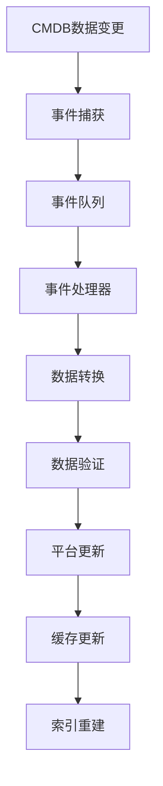
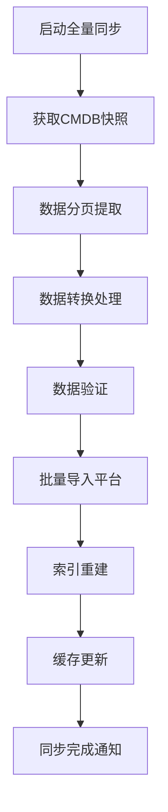

在企业级作业平台的建设过程中，与配置管理数据库(CMDB)的深度集成是确保平台能够发挥最大价值的关键因素之一。CMDB作为企业IT运维管理的核心组件，存储了所有IT资源的配置信息和关系数据。与CMDB的深度集成能够为作业平台提供准确、实时的目标资源信息，确保作业执行的精准性和有效性。本章将深入探讨作业平台与CMDB集成的各个方面，包括数据同步机制、目标资源自动发现、目标选择优化等核心内容，为企业构建一个高度集成的作业平台提供指导。

## CMDB数据同步机制：构建实时准确的资源配置视图

CMDB数据同步机制是实现深度集成的基础，它确保作业平台能够获得准确、实时的资源配置信息。一个高效的同步机制需要考虑数据的一致性、实时性和完整性等多个方面。

### 实时数据同步：事件驱动的高效同步

实时数据同步通过事件驱动机制确保作业平台与CMDB数据的实时一致性，这是实现精准目标选择的关键。

#### 变更事件捕获机制

建立高效的变更事件捕获机制是实现实时同步的前提：

##### 事件监听器设计
```python
class CMDBEventListener:
    def __init__(self, cmdb_client, job_platform_client):
        self.cmdb_client = cmdb_client
        self.job_platform_client = job_platform_client
        self.event_queue = Queue()
    
    async def start_listening(self):
        """启动事件监听"""
        while True:
            try:
                # 监听CMDB变更事件
                events = await self.cmdb_client.listen_changes()
                for event in events:
                    await self.process_event(event)
            except Exception as e:
                logger.error(f"事件监听异常: {e}")
                await asyncio.sleep(5)
    
    async def process_event(self, event):
        """处理变更事件"""
        event_type = event.get('type')
        resource_data = event.get('data')
        
        if event_type == 'CREATE':
            await self.handle_create_event(resource_data)
        elif event_type == 'UPDATE':
            await self.handle_update_event(resource_data)
        elif event_type == 'DELETE':
            await self.handle_delete_event(resource_data)
```

##### 事件类型定义
```json
{
  "event_types": [
    {
      "type": "CREATE",
      "description": "资源配置项创建事件",
      "payload": {
        "ci_id": "string",
        "ci_type": "string",
        "attributes": "object",
        "timestamp": "datetime"
      }
    },
    {
      "type": "UPDATE",
      "description": "资源配置项更新事件",
      "payload": {
        "ci_id": "string",
        "ci_type": "string",
        "old_attributes": "object",
        "new_attributes": "object",
        "changed_fields": "array",
        "timestamp": "datetime"
      }
    },
    {
      "type": "DELETE",
      "description": "资源配置项删除事件",
      "payload": {
        "ci_id": "string",
        "ci_type": "string",
        "attributes": "object",
        "timestamp": "datetime"
      }
    }
  ]
}
```

##### 事件处理流程


#### 增量数据同步策略

增量数据同步只同步发生变化的数据，显著提高同步效率：

##### 增量标识设计
```sql
-- CMDB变更日志表
CREATE TABLE cmdb_change_log (
    id BIGINT PRIMARY KEY AUTO_INCREMENT,
    ci_id VARCHAR(36) NOT NULL,
    ci_type VARCHAR(50) NOT NULL,
    change_type ENUM('CREATE', 'UPDATE', 'DELETE') NOT NULL,
    changed_fields JSON,
    old_values JSON,
    new_values JSON,
    timestamp TIMESTAMP DEFAULT CURRENT_TIMESTAMP,
    processed BOOLEAN DEFAULT FALSE,
    INDEX idx_ci_id (ci_id),
    INDEX idx_timestamp (timestamp),
    INDEX idx_processed (processed)
);
```

##### 增量同步实现
```python
class IncrementalSync:
    def __init__(self, cmdb_client, job_platform_client):
        self.cmdb_client = cmdb_client
        self.job_platform_client = job_platform_client
        self.last_sync_time = self.get_last_sync_time()
    
    async def sync_incremental_changes(self):
        """同步增量变更"""
        # 获取未处理的变更记录
        changes = await self.cmdb_client.get_unprocessed_changes(
            since=self.last_sync_time
        )
        
        # 批量处理变更
        batch_size = 100
        for i in range(0, len(changes), batch_size):
            batch = changes[i:i+batch_size]
            await self.process_batch(batch)
        
        # 更新同步时间戳
        self.last_sync_time = datetime.now()
        await self.update_last_sync_time()
    
    async def process_batch(self, batch):
        """批量处理变更"""
        tasks = []
        for change in batch:
            task = self.process_change(change)
            tasks.append(task)
        
        # 并发处理
        await asyncio.gather(*tasks)
```

#### 数据一致性保障机制

确保同步数据的质量和一致性是同步机制的核心要求：

##### 数据验证规则
```yaml
validation_rules:
  server:
    required_fields: ["hostname", "ip_address", "os_type"]
    field_validations:
      hostname:
        type: "string"
        pattern: "^[a-zA-Z0-9-_.]+$"
        max_length: 255
      ip_address:
        type: "string"
        pattern: "^((25[0-5]|2[0-4][0-9]|[01]?[0-9][0-9]?)\.){3}(25[0-5]|2[0-4][0-9]|[01]?[0-9][0-9]?)$"
      os_type:
        type: "string"
        enum: ["Linux", "Windows", "Unix", "macOS"]
  
  database:
    required_fields: ["instance_name", "db_type", "host", "port"]
    field_validations:
      instance_name:
        type: "string"
        max_length: 100
      db_type:
        type: "string"
        enum: ["MySQL", "PostgreSQL", "Oracle", "SQLServer"]
      port:
        type: "integer"
        min: 1
        max: 65535
```

##### 一致性检查机制
```python
class DataConsistencyChecker:
    def __init__(self, cmdb_client, job_platform_client):
        self.cmdb_client = cmdb_client
        self.job_platform_client = job_platform_client
    
    async def check_consistency(self):
        """检查数据一致性"""
        # 获取CMDB中的资源配置项数量
        cmdb_count = await self.cmdb_client.get_ci_count()
        
        # 获取作业平台中的目标资源数量
        platform_count = await self.job_platform_client.get_target_count()
        
        # 比较数量差异
        if abs(cmdb_count - platform_count) > 10:
            logger.warning(f"数据数量不一致: CMDB={cmdb_count}, Platform={platform_count}")
            await self.perform_full_sync()
        
        # 检查关键资源配置项
        await self.check_critical_cis()
    
    async def check_critical_cis(self):
        """检查关键资源配置项"""
        critical_cis = await self.cmdb_client.get_critical_cis()
        for ci in critical_cis:
            platform_ci = await self.job_platform_client.get_target_by_id(ci['id'])
            if not platform_ci:
                logger.warning(f"关键资源配置项缺失: {ci['id']}")
                await self.sync_single_ci(ci['id'])
```

### 定时数据同步：确保数据完整性的周期性保障

定时数据同步通过周期性的全量和增量同步，确保数据的完整性和准确性。

#### 全量同步机制

定期进行全量数据同步，确保数据完整性：

##### 同步策略设计
```python
class FullSyncScheduler:
    def __init__(self, sync_service):
        self.sync_service = sync_service
        self.schedule = {
            "daily": "0 2 * * *",  # 每天凌晨2点
            "weekly": "0 3 * * 0",  # 每周日凌晨3点
            "monthly": "0 4 1 * *"  # 每月1日凌晨4点
        }
    
    async def schedule_full_sync(self):
        """调度全量同步"""
        scheduler = AsyncIOScheduler()
        
        # 每日全量同步
        scheduler.add_job(
            self.sync_service.perform_full_sync,
            'cron',
            hour=2,
            minute=0,
            id='daily_full_sync'
        )
        
        # 每周全量同步
        scheduler.add_job(
            self.sync_service.perform_full_sync,
            'cron',
            day_of_week=0,
            hour=3,
            minute=0,
            id='weekly_full_sync'
        )
        
        scheduler.start()
```

##### 全量同步流程


##### 差异对比算法
```python
class DataDiffAnalyzer:
    def __init__(self, cmdb_client, job_platform_client):
        self.cmdb_client = cmdb_client
        self.job_platform_client = job_platform_client
    
    async def analyze_diff(self):
        """分析数据差异"""
        # 获取CMDB数据哈希
        cmdb_hashes = await self.cmdb_client.get_data_hashes()
        
        # 获取平台数据哈希
        platform_hashes = await self.job_platform_client.get_data_hashes()
        
        # 计算差异
        to_create = []
        to_update = []
        to_delete = []
        
        # 新增数据
        for ci_id, hash_value in cmdb_hashes.items():
            if ci_id not in platform_hashes:
                to_create.append(ci_id)
            elif platform_hashes[ci_id] != hash_value:
                to_update.append(ci_id)
        
        # 删除数据
        for ci_id in platform_hashes.keys():
            if ci_id not in cmdb_hashes:
                to_delete.append(ci_id)
        
        return {
            'create': to_create,
            'update': to_update,
            'delete': to_delete
        }
```

#### 增量同步优化

优化定时增量同步的效率和准确性：

##### 增量窗口管理
```python
class IncrementalWindowManager:
    def __init__(self):
        self.windows = {}
    
    def create_window(self, window_id, start_time, end_time):
        """创建增量同步窗口"""
        self.windows[window_id] = {
            'start_time': start_time,
            'end_time': end_time,
            'status': 'created',
            'processed_count': 0
        }
    
    def update_window(self, window_id, status, processed_count=None):
        """更新窗口状态"""
        if window_id in self.windows:
            self.windows[window_id]['status'] = status
            if processed_count is not None:
                self.windows[window_id]['processed_count'] = processed_count
    
    def get_active_windows(self):
        """获取活跃窗口"""
        return {k: v for k, v in self.windows.items() 
                if v['status'] in ['created', 'processing']}
```

##### 同步性能优化
```python
class SyncPerformanceOptimizer:
    def __init__(self, batch_size=100, concurrency=10):
        self.batch_size = batch_size
        self.concurrency = concurrency
        self.semaphore = asyncio.Semaphore(concurrency)
    
    async def optimized_sync(self, changes):
        """优化的同步处理"""
        # 分批处理
        batches = [changes[i:i+self.batch_size] 
                  for i in range(0, len(changes), self.batch_size)]
        
        # 并发处理批次
        async with self.semaphore:
            tasks = [self.process_batch(batch) for batch in batches]
            results = await asyncio.gather(*tasks, return_exceptions=True)
        
        return results
    
    async def process_batch(self, batch):
        """处理批次数据"""
        try:
            # 批量处理逻辑
            processed = await self.batch_processor.process(batch)
            return processed
        except Exception as e:
            logger.error(f"批次处理失败: {e}")
            return None
```

### 数据质量保障：确保同步数据的准确性和完整性

数据质量保障机制确保同步到作业平台的数据具有高质量和高准确性。

#### 数据验证机制

建立完善的数据验证机制，确保数据的正确性：

##### 验证规则引擎
```python
class DataValidationEngine:
    def __init__(self):
        self.rules = {}
        self.load_validation_rules()
    
    def load_validation_rules(self):
        """加载验证规则"""
        rules_config = load_yaml_config('validation_rules.yaml')
        for ci_type, rules in rules_config.items():
            self.rules[ci_type] = ValidationRuleSet(rules)
    
    async def validate_ci(self, ci_data):
        """验证配置项数据"""
        ci_type = ci_data.get('type')
        if ci_type not in self.rules:
            return True, "未知类型，跳过验证"
        
        rule_set = self.rules[ci_type]
        return await rule_set.validate(ci_data)
    
    async def batch_validate(self, ci_list):
        """批量验证"""
        results = []
        for ci_data in ci_list:
            is_valid, message = await self.validate_ci(ci_data)
            results.append({
                'ci_id': ci_data.get('id'),
                'valid': is_valid,
                'message': message
            })
        return results
```

##### 验证规则实现
```python
class ValidationRuleSet:
    def __init__(self, rules_config):
        self.required_fields = rules_config.get('required_fields', [])
        self.field_validations = rules_config.get('field_validations', {})
    
    async def validate(self, ci_data):
        """执行验证"""
        # 必填字段检查
        for field in self.required_fields:
            if field not in ci_data or not ci_data[field]:
                return False, f"缺少必填字段: {field}"
        
        # 字段格式验证
        for field, validation in self.field_validations.items():
            if field in ci_data:
                is_valid, message = await self.validate_field(
                    field, ci_data[field], validation
                )
                if not is_valid:
                    return False, f"字段 {field} 验证失败: {message}"
        
        return True, "验证通过"
    
    async def validate_field(self, field_name, field_value, validation):
        """验证单个字段"""
        field_type = validation.get('type')
        
        if field_type == 'string':
            return self.validate_string(field_value, validation)
        elif field_type == 'integer':
            return self.validate_integer(field_value, validation)
        elif field_type == 'enum':
            return self.validate_enum(field_value, validation)
        # 其他类型验证...
        
        return True, "验证通过"
```

#### 数据清洗处理

对同步数据进行清洗和处理，提高数据质量：

##### 清洗规则定义
```yaml
data_cleaning_rules:
  hostname:
    trim: true
    lowercase: true
    remove_special_chars: true
    max_length: 255
  
  ip_address:
    normalize: true
    validate_format: true
  
  tags:
    deduplicate: true
    lowercase: true
    remove_empty: true
  
  attributes:
    remove_null: true
    type_convert: true
    default_values:
      status: "unknown"
      environment: "default"
```

##### 清洗处理实现
```python
class DataCleaner:
    def __init__(self):
        self.cleaning_rules = load_yaml_config('data_cleaning_rules.yaml')
    
    async def clean_ci_data(self, ci_data):
        """清洗配置项数据"""
        cleaned_data = ci_data.copy()
        
        # 处理通用字段
        for field, rules in self.cleaning_rules.items():
            if field in cleaned_data:
                cleaned_data[field] = await self.clean_field(
                    cleaned_data[field], rules
                )
        
        # 特殊处理
        cleaned_data = await self.special_processing(cleaned_data)
        
        return cleaned_data
    
    async def clean_field(self, value, rules):
        """清洗单个字段"""
        if rules.get('trim') and isinstance(value, str):
            value = value.strip()
        
        if rules.get('lowercase') and isinstance(value, str):
            value = value.lower()
        
        if rules.get('remove_special_chars') and isinstance(value, str):
            value = re.sub(r'[^\w\s-]', '', value)
        
        if rules.get('max_length') and isinstance(value, str):
            max_length = rules['max_length']
            if len(value) > max_length:
                value = value[:max_length]
        
        return value
    
    async def special_processing(self, ci_data):
        """特殊处理逻辑"""
        # 标准化标签
        if 'tags' in ci_data:
            ci_data['tags'] = self.standardize_tags(ci_data['tags'])
        
        # 处理关系数据
        if 'relations' in ci_data:
            ci_data['relations'] = self.process_relations(ci_data['relations'])
        
        return ci_data
```

#### 质量监控告警

建立数据质量监控和告警机制：

##### 监控指标定义
```python
class DataQualityMetrics:
    def __init__(self):
        self.metrics = {
            'sync_success_rate': 0.0,
            'data_accuracy_rate': 0.0,
            'validation_failure_count': 0,
            'sync_latency': 0.0,
            'data_consistency_rate': 0.0
        }
    
    async def update_metrics(self, sync_result):
        """更新监控指标"""
        total_count = sync_result.get('total_count', 0)
        success_count = sync_result.get('success_count', 0)
        failure_count = sync_result.get('failure_count', 0)
        
        if total_count > 0:
            self.metrics['sync_success_rate'] = success_count / total_count
            self.metrics['validation_failure_count'] = failure_count
        
        # 更新其他指标...
        await self.publish_metrics()
    
    async def check_thresholds(self):
        """检查阈值告警"""
        thresholds = {
            'sync_success_rate': 0.95,
            'data_accuracy_rate': 0.98,
            'validation_failure_count': 10
        }
        
        alerts = []
        for metric, threshold in thresholds.items():
            current_value = self.metrics.get(metric, 0)
            if current_value < threshold:
                alerts.append({
                    'metric': metric,
                    'current_value': current_value,
                    'threshold': threshold,
                    'severity': 'HIGH'
                })
        
        if alerts:
            await self.send_alerts(alerts)
```

##### 告警通知机制
```python
class DataQualityAlerts:
    def __init__(self):
        self.notification_channels = ['email', 'slack', 'webhook']
    
    async def send_alerts(self, alerts):
        """发送告警通知"""
        for alert in alerts:
            message = self.format_alert_message(alert)
            
            # 多渠道通知
            for channel in self.notification_channels:
                try:
                    await self.send_notification(channel, message)
                except Exception as e:
                    logger.error(f"发送{channel}通知失败: {e}")
    
    def format_alert_message(self, alert):
        """格式化告警消息"""
        return f"""
        数据质量告警
        
        指标: {alert['metric']}
        当前值: {alert['current_value']}
        阈值: {alert['threshold']}
        严重程度: {alert['severity']}
        时间: {datetime.now()}
        """
```

## 目标资源自动发现：构建智能的目标识别和管理能力

目标资源自动发现是作业平台基于CMDB集成实现的重要功能，它能够自动识别和管理目标资源，提高作业执行的准确性和效率。

### 资源发现机制：自动识别和发现目标资源

资源发现机制通过分析CMDB数据，自动识别和发现可用的目标资源。

#### 标签匹配发现

基于标签自动识别目标资源：

##### 标签匹配算法
```python
class TagBasedDiscovery:
    def __init__(self, cmdb_client):
        self.cmdb_client = cmdb_client
    
    async def discover_by_tags(self, tag_conditions):
        """基于标签条件发现资源"""
        # 解析标签条件
        parsed_conditions = self.parse_tag_conditions(tag_conditions)
        
        # 查询匹配的资源配置项
        matching_cis = await self.cmdb_client.query_cis_by_tags(
            parsed_conditions
        )
        
        # 转换为作业平台目标格式
        targets = await self.convert_to_targets(matching_cis)
        
        return targets
    
    def parse_tag_conditions(self, tag_conditions):
        """解析标签条件"""
        # 支持的条件类型
        # AND: {"tags": ["web", "production"]}
        # OR: {"tags": {"$or": ["web", "database"]}}
        # NOT: {"tags": {"$not": "development"}}
        
        if isinstance(tag_conditions, list):
            return {"$and": tag_conditions}
        elif isinstance(tag_conditions, dict):
            return tag_conditions
        else:
            raise ValueError("无效的标签条件格式")
    
    async def convert_to_targets(self, cis):
        """转换为作业平台目标格式"""
        targets = []
        for ci in cis:
            target = {
                "id": ci["id"],
                "name": ci["attributes"].get("hostname", ci["id"]),
                "ip": ci["attributes"].get("ip_address"),
                "type": ci["type"],
                "tags": ci["tags"],
                "attributes": ci["attributes"],
                "status": ci["status"]
            }
            targets.append(target)
        
        return targets
```

##### 复杂条件匹配
```python
class ComplexTagMatcher:
    def __init__(self):
        self.operators = {
            '$and': self.match_and,
            '$or': self.match_or,
            '$not': self.match_not,
            '$in': self.match_in,
            '$nin': self.match_nin
        }
    
    async def match_targets(self, targets, conditions):
        """匹配目标资源"""
        if not conditions:
            return targets
        
        matched_targets = []
        for target in targets:
            if await self.evaluate_condition(target, conditions):
                matched_targets.append(target)
        
        return matched_targets
    
    async def evaluate_condition(self, target, condition):
        """评估匹配条件"""
        if isinstance(condition, dict):
            for operator, value in condition.items():
                if operator in self.operators:
                    return await self.operators[operator](target, value)
                else:
                    # 字段匹配
                    return self.match_field(target, operator, value)
        elif isinstance(condition, list):
            # 默认AND操作
            for sub_condition in condition:
                if not await self.evaluate_condition(target, sub_condition):
                    return False
            return True
        else:
            raise ValueError("无效的条件格式")
    
    async def match_and(self, target, conditions):
        """AND匹配"""
        for condition in conditions:
            if not await self.evaluate_condition(target, condition):
                return False
        return True
    
    async def match_or(self, target, conditions):
        """OR匹配"""
        for condition in conditions:
            if await self.evaluate_condition(target, condition):
                return True
        return False
    
    async def match_not(self, target, condition):
        """NOT匹配"""
        return not await self.evaluate_condition(target, condition)
```

#### 属性筛选发现

基于属性条件筛选目标资源：

##### 属性查询引擎
```python
class AttributeBasedDiscovery:
    def __init__(self, cmdb_client):
        self.cmdb_client = cmdb_client
        self.query_parser = QueryParser()
    
    async def discover_by_attributes(self, attribute_conditions):
        """基于属性条件发现资源"""
        # 解析查询条件
        query = self.query_parser.parse(attribute_conditions)
        
        # 执行查询
        cis = await self.cmdb_client.query_cis(query)
        
        # 转换为目标格式
        targets = await self.convert_to_targets(cis)
        
        return targets
    
    async def convert_to_targets(self, cis):
        """转换为作业平台目标格式"""
        targets = []
        for ci in cis:
            target = Target(
                id=ci["id"],
                name=ci["attributes"].get("hostname", ci["id"]),
                ip=ci["attributes"].get("ip_address"),
                type=ci["type"],
                tags=ci["tags"],
                attributes=ci["attributes"],
                status=ci["status"]
            )
            targets.append(target)
        
        return targets

class QueryParser:
    def parse(self, conditions):
        """解析查询条件"""
        # 支持的操作符
        operators = {
            '=': '$eq',
            '!=': '$ne',
            '>': '$gt',
            '>=': '$gte',
            '<': '$lt',
            '<=': '$lte',
            'in': '$in',
            'not_in': '$nin',
            'like': '$regex'
        }
        
        parsed_query = {}
        for field, condition in conditions.items():
            if isinstance(condition, dict):
                # 复杂条件
                parsed_query[field] = {}
                for op, value in condition.items():
                    mongo_op = operators.get(op, op)
                    parsed_query[field][mongo_op] = value
            else:
                # 简单相等条件
                parsed_query[field] = condition
        
        return parsed_query
```

##### 高级属性查询
```python
class AdvancedAttributeQuery:
    def __init__(self, cmdb_client):
        self.cmdb_client = cmdb_client
    
    async def complex_query(self, query_conditions):
        """复杂属性查询"""
        # 构建复合查询
        query = self.build_complex_query(query_conditions)
        
        # 执行查询
        results = await self.cmdb_client.execute_complex_query(query)
        
        return results
    
    def build_complex_query(self, conditions):
        """构建复杂查询"""
        query_parts = []
        
        for condition in conditions:
            if 'and' in condition:
                and_query = self.build_and_query(condition['and'])
                query_parts.append(and_query)
            elif 'or' in condition:
                or_query = self.build_or_query(condition['or'])
                query_parts.append(or_query)
            elif 'not' in condition:
                not_query = self.build_not_query(condition['not'])
                query_parts.append(not_query)
            else:
                # 简单条件
                simple_query = self.build_simple_query(condition)
                query_parts.append(simple_query)
        
        # 组合查询条件
        if len(query_parts) == 1:
            return query_parts[0]
        else:
            return {'$and': query_parts}
    
    def build_and_query(self, conditions):
        """构建AND查询"""
        sub_queries = []
        for condition in conditions:
            sub_query = self.build_simple_query(condition)
            sub_queries.append(sub_query)
        return {'$and': sub_queries}
    
    def build_or_query(self, conditions):
        """构建OR查询"""
        sub_queries = []
        for condition in conditions:
            sub_query = self.build_simple_query(condition)
            sub_queries.append(sub_query)
        return {'$or': sub_queries}
```

#### 关系分析发现

基于资源关系分析发现目标范围：

##### 关系图谱构建
```python
class RelationshipBasedDiscovery:
    def __init__(self, cmdb_client):
        self.cmdb_client = cmdb_client
        self.graph = nx.DiGraph()
    
    async def build_relationship_graph(self):
        """构建关系图谱"""
        # 获取所有关系数据
        relations = await self.cmdb_client.get_all_relations()
        
        # 构建图谱
        for relation in relations:
            source_id = relation['source_id']
            target_id = relation['target_id']
            relation_type = relation['type']
            
            self.graph.add_edge(source_id, target_id, type=relation_type)
    
    async def discover_by_relationship(self, seed_resources, relationship_types, depth=1):
        """基于关系发现资源"""
        discovered_resources = set()
        
        # 从种子资源开始
        current_level = set(seed_resources)
        
        for i in range(depth):
            next_level = set()
            
            for resource_id in current_level:
                # 获取相关资源
                related_resources = await self.get_related_resources(
                    resource_id, relationship_types
                )
                
                # 添加到发现集合
                discovered_resources.update(related_resources)
                next_level.update(related_resources)
            
            current_level = next_level
        
        # 获取详细资源信息
        resources = await self.cmdb_client.get_cis_by_ids(list(discovered_resources))
        
        return resources
    
    async def get_related_resources(self, resource_id, relationship_types):
        """获取相关资源"""
        related_resources = set()
        
        # 获取出边关系
        out_edges = self.graph.out_edges(resource_id, data=True)
        for source, target, data in out_edges:
            if data['type'] in relationship_types:
                related_resources.add(target)
        
        # 获取入边关系
        in_edges = self.graph.in_edges(resource_id, data=True)
        for source, target, data in in_edges:
            if data['type'] in relationship_types:
                related_resources.add(source)
        
        return list(related_resources)
```

##### 影响范围分析
```python
class ImpactAnalysis:
    def __init__(self, relationship_discovery):
        self.relationship_discovery = relationship_discovery
    
    async def analyze_impact_scope(self, affected_resource, max_depth=3):
        """分析影响范围"""
        # 定义影响关系类型
        impact_relations = ['depends_on', 'connects_to', 'part_of']
        
        # 分层分析影响范围
        impact_layers = {}
        
        current_resources = [affected_resource]
        for depth in range(1, max_depth + 1):
            # 获取当前层的关联资源
            related_resources = await self.relationship_discovery.discover_by_relationship(
                current_resources, impact_relations, depth=1
            )
            
            if not related_resources:
                break
            
            impact_layers[depth] = related_resources
            current_resources = [r['id'] for r in related_resources]
        
        return impact_layers
    
    async def generate_impact_report(self, affected_resource):
        """生成影响分析报告"""
        impact_layers = await self.analyze_impact_scope(affected_resource)
        
        report = {
            'affected_resource': affected_resource,
            'impact_layers': impact_layers,
            'total_impacted': sum(len(layer) for layer in impact_layers.values()),
            'critical_resources': await self.identify_critical_resources(impact_layers)
        }
        
        return report
    
    async def identify_critical_resources(self, impact_layers):
        """识别关键资源"""
        critical_resources = []
        
        for layer_resources in impact_layers.values():
            for resource in layer_resources:
                # 根据业务属性判断是否为关键资源
                if self.is_critical_resource(resource):
                    critical_resources.append(resource)
        
        return critical_resources
    
    def is_critical_resource(self, resource):
        """判断是否为关键资源"""
        critical_indicators = [
            'business_level' in resource.get('attributes', {}),
            'sla' in resource.get('attributes', {}),
            resource.get('type') in ['application', 'database', 'load_balancer']
        ]
        
        return sum(critical_indicators) >= 2
```

### 资源分组管理：智能的资源组织和分类

资源分组管理通过对发现的资源进行智能分组，提高资源管理的效率和准确性。

#### 自动分组机制

根据资源属性自动创建分组：

##### 分组策略定义
```python
class AutoGroupingStrategy:
    def __init__(self):
        self.strategies = {
            'by_environment': self.group_by_environment,
            'by_business_system': self.group_by_business_system,
            'by_location': self.group_by_location,
            'by_role': self.group_by_role,
            'by_owner': self.group_by_owner
        }
    
    async def apply_grouping_strategy(self, targets, strategy_name, **kwargs):
        """应用分组策略"""
        if strategy_name in self.strategies:
            return await self.strategies[strategy_name](targets, **kwargs)
        else:
            raise ValueError(f"未知的分组策略: {strategy_name}")
    
    async def group_by_environment(self, targets):
        """按环境分组"""
        groups = {}
        
        for target in targets:
            env = target.attributes.get('environment', 'unknown')
            if env not in groups:
                groups[env] = []
            groups[env].append(target)
        
        return groups
    
    async def group_by_business_system(self, targets):
        """按业务系统分组"""
        groups = {}
        
        for target in targets:
            system = target.attributes.get('business_system', 'unknown')
            if system not in groups:
                groups[system] = []
            groups[system].append(target)
        
        return groups
    
    async def group_by_location(self, targets):
        """按位置分组"""
        groups = {}
        
        for target in targets:
            location = target.attributes.get('location', 'unknown')
            if location not in groups:
                groups[location] = []
            groups[location].append(target)
        
        return groups
    
    async def group_by_role(self, targets):
        """按角色分组"""
        groups = {}
        
        for target in targets:
            role = target.attributes.get('role', 'unknown')
            if role not in groups:
                groups[role] = []
            groups[role].append(target)
        
        return groups
    
    async def group_by_owner(self, targets):
        """按所有者分组"""
        groups = {}
        
        for target in targets:
            owner = target.attributes.get('owner', 'unknown')
            if owner not in groups:
                groups[owner] = []
            groups[owner].append(target)
        
        return groups
```

##### 动态分组实现
```python
class DynamicGrouping:
    def __init__(self, target_manager):
        self.target_manager = target_manager
        self.group_cache = {}
        self.cache_ttl = 300  # 5分钟缓存
    
    async def get_dynamic_groups(self, grouping_rules):
        """获取动态分组"""
        cache_key = self.generate_cache_key(grouping_rules)
        
        # 检查缓存
        if cache_key in self.group_cache:
            cached_data, timestamp = self.group_cache[cache_key]
            if time.time() - timestamp < self.cache_ttl:
                return cached_data
        
        # 重新计算分组
        groups = await self.calculate_groups(grouping_rules)
        
        # 更新缓存
        self.group_cache[cache_key] = (groups, time.time())
        
        return groups
    
    async def calculate_groups(self, grouping_rules):
        """计算分组"""
        # 获取所有目标资源
        all_targets = await self.target_manager.get_all_targets()
        
        # 应用分组规则
        groups = {}
        for rule in grouping_rules:
            rule_groups = await self.apply_grouping_rule(all_targets, rule)
            groups.update(rule_groups)
        
        return groups
    
    async def apply_grouping_rule(self, targets, rule):
        """应用分组规则"""
        rule_type = rule.get('type')
        rule_config = rule.get('config', {})
        
        if rule_type == 'tag_based':
            return await self.tag_based_grouping(targets, rule_config)
        elif rule_type == 'attribute_based':
            return await self.attribute_based_grouping(targets, rule_config)
        elif rule_type == 'relationship_based':
            return await self.relationship_based_grouping(targets, rule_config)
        else:
            raise ValueError(f"未知的分组规则类型: {rule_type}")
    
    async def tag_based_grouping(self, targets, config):
        """基于标签的分组"""
        tag_key = config.get('tag_key')
        group_prefix = config.get('group_prefix', 'tag_')
        
        groups = {}
        for target in targets:
            if tag_key in target.tags:
                tag_value = target.tags[tag_key]
                group_name = f"{group_prefix}{tag_value}"
                if group_name not in groups:
                    groups[group_name] = []
                groups[group_name].append(target)
        
        return groups
    
    async def attribute_based_grouping(self, targets, config):
        """基于属性的分组"""
        attr_key = config.get('attribute_key')
        group_prefix = config.get('group_prefix', 'attr_')
        
        groups = {}
        for target in targets:
            attr_value = target.attributes.get(attr_key, 'unknown')
            group_name = f"{group_prefix}{attr_value}"
            if group_name not in groups:
                groups[group_name] = []
            groups[group_name].append(target)
        
        return groups
```

#### 分组策略管理

管理复杂的分组策略和规则：

##### 策略配置管理
```python
class GroupingStrategyManager:
    def __init__(self, config_store):
        self.config_store = config_store
        self.strategies = {}
    
    async def load_strategies(self):
        """加载分组策略"""
        strategy_configs = await self.config_store.get_grouping_strategies()
        
        for config in strategy_configs:
            strategy = await self.create_strategy(config)
            self.strategies[config['name']] = strategy
    
    async def create_strategy(self, config):
        """创建分组策略"""
        strategy_type = config.get('type')
        
        if strategy_type == 'simple':
            return SimpleGroupingStrategy(config)
        elif strategy_type == 'composite':
            return CompositeGroupingStrategy(config)
        elif strategy_type == 'conditional':
            return ConditionalGroupingStrategy(config)
        else:
            raise ValueError(f"未知的策略类型: {strategy_type}")
    
    async def apply_strategy(self, strategy_name, targets):
        """应用分组策略"""
        if strategy_name not in self.strategies:
            raise ValueError(f"策略不存在: {strategy_name}")
        
        strategy = self.strategies[strategy_name]
        return await strategy.apply(targets)
    
    async def update_strategy(self, strategy_name, config):
        """更新分组策略"""
        strategy = await self.create_strategy(config)
        self.strategies[strategy_name] = strategy
        
        # 保存配置
        await self.config_store.update_grouping_strategy(strategy_name, config)

class SimpleGroupingStrategy:
    def __init__(self, config):
        self.config = config
        self.group_by = config.get('group_by', 'environment')
    
    async def apply(self, targets):
        """应用简单分组策略"""
        groups = {}
        
        for target in targets:
            group_value = self.get_group_value(target)
            if group_value not in groups:
                groups[group_value] = []
            groups[group_value].append(target)
        
        return groups
    
    def get_group_value(self, target):
        """获取分组值"""
        if self.group_by.startswith('tag:'):
            tag_key = self.group_by[4:]
            return target.tags.get(tag_key, 'unknown')
        else:
            return target.attributes.get(self.group_by, 'unknown')

class CompositeGroupingStrategy:
    def __init__(self, config):
        self.config = config
        self.sub_strategies = config.get('sub_strategies', [])
    
    async def apply(self, targets):
        """应用复合分组策略"""
        final_groups = {}
        
        for strategy_config in self.sub_strategies:
            strategy = SimpleGroupingStrategy(strategy_config)
            groups = await strategy.apply(targets)
            
            # 合并分组
            for group_name, group_targets in groups.items():
                if group_name not in final_groups:
                    final_groups[group_name] = []
                final_groups[group_name].extend(group_targets)
        
        return final_groups

class ConditionalGroupingStrategy:
    def __init__(self, config):
        self.config = config
        self.conditions = config.get('conditions', [])
    
    async def apply(self, targets):
        """应用条件分组策略"""
        groups = {}
        
        for target in targets:
            group_name = await self.evaluate_conditions(target)
            if group_name:
                if group_name not in groups:
                    groups[group_name] = []
                groups[group_name].append(target)
        
        return groups
    
    async def evaluate_conditions(self, target):
        """评估条件"""
        for condition in self.conditions:
            if await self.match_condition(target, condition):
                return condition.get('group_name')
        
        return None
    
    async def match_condition(self, target, condition):
        """匹配条件"""
        condition_type = condition.get('type')
        
        if condition_type == 'tag_exists':
            return condition.get('tag') in target.tags
        elif condition_type == 'attribute_equals':
            attr_name = condition.get('attribute')
            expected_value = condition.get('value')
            return target.attributes.get(attr_name) == expected_value
        elif condition_type == 'tag_value_in':
            tag_name = condition.get('tag')
            allowed_values = condition.get('values', [])
            return target.tags.get(tag_name) in allowed_values
        else:
            return False
```

#### 嵌套分组支持

支持分组的嵌套和层级管理：

##### 嵌套分组实现
```python
class NestedGrouping:
    def __init__(self):
        self.groups = {}
    
    async def create_nested_group(self, group_name, parent_group=None):
        """创建嵌套分组"""
        group = {
            'name': group_name,
            'parent': parent_group,
            'children': [],
            'targets': [],
            'metadata': {}
        }
        
        self.groups[group_name] = group
        
        # 更新父分组
        if parent_group and parent_group in self.groups:
            self.groups[parent_group]['children'].append(group_name)
        
        return group
    
    async def add_target_to_group(self, target, group_name):
        """添加目标到分组"""
        if group_name not in self.groups:
            raise ValueError(f"分组不存在: {group_name}")
        
        self.groups[group_name]['targets'].append(target)
    
    async def get_group_hierarchy(self, group_name):
        """获取分组层级结构"""
        if group_name not in self.groups:
            return None
        
        group = self.groups[group_name]
        hierarchy = {
            'name': group['name'],
            'targets': group['targets'],
            'children': []
        }
        
        # 递归获取子分组
        for child_name in group['children']:
            child_hierarchy = await self.get_group_hierarchy(child_name)
            if child_hierarchy:
                hierarchy['children'].append(child_hierarchy)
        
        return hierarchy
    
    async def query_nested_groups(self, query_conditions):
        """查询嵌套分组"""
        results = []
        
        for group_name, group in self.groups.items():
            if await self.match_group_query(group, query_conditions):
                hierarchy = await self.get_group_hierarchy(group_name)
                results.append(hierarchy)
        
        return results
    
    async def match_group_query(self, group, conditions):
        """匹配分组查询条件"""
        for key, value in conditions.items():
            if key == 'name':
                if not self.match_pattern(group['name'], value):
                    return False
            elif key == 'has_targets':
                if value and not group['targets']:
                    return False
                elif not value and group['targets']:
                    return False
            elif key == 'has_children':
                if value and not group['children']:
                    return False
                elif not value and group['children']:
                    return False
            # 其他条件匹配...
        
        return True
    
    def match_pattern(self, text, pattern):
        """匹配模式"""
        if pattern.startswith('*') and pattern.endswith('*'):
            return pattern[1:-1] in text
        elif pattern.startswith('*'):
            return text.endswith(pattern[1:])
        elif pattern.endswith('*'):
            return text.startswith(pattern[:-1])
        else:
            return text == pattern
```

### 资源属性管理：全面的目标资源信息管理

资源属性管理确保目标资源的详细属性信息得到准确维护和及时更新。

#### 属性同步机制

同步和维护目标资源的属性信息：

##### 属性映射配置
```python
class AttributeMapping:
    def __init__(self):
        self.mappings = self.load_mappings()
    
    def load_mappings(self):
        """加载属性映射配置"""
        return {
            'server': {
                'cmdb_fields': {
                    'hostname': 'name',
                    'ip_address': 'ip',
                    'os_type': 'os',
                    'cpu_cores': 'cpu',
                    'memory_gb': 'memory',
                    'disk_gb': 'disk'
                },
                'derived_fields': {
                    'full_name': lambda attrs: f"{attrs.get('hostname', '')} ({attrs.get('ip_address', '')})",
                    'resource_type': lambda attrs: 'server'
                }
            },
            'database': {
                'cmdb_fields': {
                    'instance_name': 'name',
                    'db_type': 'type',
                    'host': 'host',
                    'port': 'port',
                    'version': 'version'
                },
                'derived_fields': {
                    'connection_string': lambda attrs: f"{attrs.get('db_type', '')}://{attrs.get('host', '')}:{attrs.get('port', '')}",
                    'resource_type': lambda attrs: 'database'
                }
            }
        }
    
    async def map_attributes(self, ci_type, cmdb_attributes):
        """映射属性"""
        if ci_type not in self.mappings:
            return cmdb_attributes
        
        mapping = self.mappings[ci_type]
        mapped_attributes = {}
        
        # 映射CMDB字段
        for cmdb_field, platform_field in mapping['cmdb_fields'].items():
            if cmdb_field in cmdb_attributes:
                mapped_attributes[platform_field] = cmdb_attributes[cmdb_field]
        
        # 计算派生字段
        for field_name, calculator in mapping['derived_fields'].items():
            try:
                mapped_attributes[field_name] = calculator(cmdb_attributes)
            except Exception as e:
                logger.warning(f"计算派生字段 {field_name} 失败: {e}")
        
        return mapped_attributes

class AttributeSync:
    def __init__(self, cmdb_client, attribute_mapping):
        self.cmdb_client = cmdb_client
        self.attribute_mapping = attribute_mapping
    
    async def sync_attributes(self, target_id):
        """同步目标属性"""
        # 获取CMDB中的最新属性
        cmdb_attributes = await self.cmdb_client.get_ci_attributes(target_id)
        
        # 获取目标类型
        target_type = await self.get_target_type(target_id)
        
        # 映射属性
        mapped_attributes = await self.attribute_mapping.map_attributes(
            target_type, cmdb_attributes
        )
        
        # 更新目标属性
        await self.update_target_attributes(target_id, mapped_attributes)
        
        return mapped_attributes
    
    async def batch_sync_attributes(self, target_ids):
        """批量同步属性"""
        results = {}
        
        # 分批处理
        batch_size = 50
        for i in range(0, len(target_ids), batch_size):
            batch = target_ids[i:i+batch_size]
            batch_results = await self.process_batch(batch)
            results.update(batch_results)
        
        return results
    
    async def process_batch(self, target_ids):
        """处理批次"""
        results = {}
        
        # 并发获取属性
        tasks = [self.sync_attributes(target_id) for target_id in target_ids]
        batch_results = await asyncio.gather(*tasks, return_exceptions=True)
        
        for i, result in enumerate(batch_results):
            target_id = target_ids[i]
            if isinstance(result, Exception):
                logger.error(f"同步目标 {target_id} 属性失败: {result}")
                results[target_id] = None
            else:
                results[target_id] = result
        
        return results
```

#### 属性扩展机制

扩展作业平台特有的属性信息：

##### 自定义属性管理
```python
class CustomAttributeManager:
    def __init__(self, attribute_store):
        self.attribute_store = attribute_store
        self.custom_attributes = {}
    
    async def add_custom_attribute(self, target_id, attr_name, attr_value, metadata=None):
        """添加自定义属性"""
        custom_attr = {
            'name': attr_name,
            'value': attr_value,
            'target_id': target_id,
            'created_at': datetime.now(),
            'updated_at': datetime.now(),
            'metadata': metadata or {}
        }
        
        # 存储自定义属性
        await self.attribute_store.save_custom_attribute(custom_attr)
        
        # 更新缓存
        if target_id not in self.custom_attributes:
            self.custom_attributes[target_id] = {}
        self.custom_attributes[target_id][attr_name] = custom_attr
    
    async def get_custom_attributes(self, target_id):
        """获取自定义属性"""
        # 检查缓存
        if target_id in self.custom_attributes:
            return self.custom_attributes[target_id]
        
        # 从存储获取
        custom_attrs = await self.attribute_store.get_custom_attributes(target_id)
        
        # 更新缓存
        self.custom_attributes[target_id] = {
            attr['name']: attr for attr in custom_attrs
        }
        
        return self.custom_attributes[target_id]
    
    async def update_custom_attribute(self, target_id, attr_name, attr_value):
        """更新自定义属性"""
        if target_id not in self.custom_attributes:
            await self.get_custom_attributes(target_id)
        
        if attr_name in self.custom_attributes[target_id]:
            # 更新现有属性
            custom_attr = self.custom_attributes[target_id][attr_name]
            custom_attr['value'] = attr_value
            custom_attr['updated_at'] = datetime.now()
            
            # 保存更新
            await self.attribute_store.update_custom_attribute(custom_attr)
        else:
            # 创建新属性
            await self.add_custom_attribute(target_id, attr_name, attr_value)
    
    async def delete_custom_attribute(self, target_id, attr_name):
        """删除自定义属性"""
        # 从存储删除
        await self.attribute_store.delete_custom_attribute(target_id, attr_name)
        
        # 更新缓存
        if target_id in self.custom_attributes:
            self.custom_attributes[target_id].pop(attr_name, None)

class AttributeStore:
    def __init__(self, db_client):
        self.db_client = db_client
    
    async def save_custom_attribute(self, custom_attr):
        """保存自定义属性"""
        query = """
        INSERT INTO custom_attributes 
        (target_id, name, value, metadata, created_at, updated_at)
        VALUES ($1, $2, $3, $4, $5, $6)
        ON CONFLICT (target_id, name) 
        DO UPDATE SET value = $3, metadata = $4, updated_at = $6
        """
        
        await self.db_client.execute(query, [
            custom_attr['target_id'],
            custom_attr['name'],
            json.dumps(custom_attr['value']),
            json.dumps(custom_attr['metadata']),
            custom_attr['created_at'],
            custom_attr['updated_at']
        ])
    
    async def get_custom_attributes(self, target_id):
        """获取自定义属性"""
        query = """
        SELECT name, value, metadata, created_at, updated_at
        FROM custom_attributes
        WHERE target_id = $1
        """
        
        rows = await self.db_client.fetch_all(query, [target_id])
        return [
            {
                'name': row['name'],
                'value': json.loads(row['value']),
                'metadata': json.loads(row['metadata']),
                'created_at': row['created_at'],
                'updated_at': row['updated_at']
            }
            for row in rows
        ]
```

#### 属性更新机制

实时更新资源属性变更：

##### 增量更新处理
```python
class AttributeUpdateHandler:
    def __init__(self, cmdb_client, custom_attribute_manager):
        self.cmdb_client = cmdb_client
        self.custom_attribute_manager = custom_attribute_manager
        self.update_queue = asyncio.Queue()
    
    async def handle_attribute_update(self, update_event):
        """处理属性更新事件"""
        # 将更新事件加入队列
        await self.update_queue.put(update_event)
    
    async def start_processing(self):
        """开始处理更新"""
        while True:
            try:
                # 从队列获取更新事件
                update_event = await self.update_queue.get()
                
                # 处理更新
                await self.process_update(update_event)
                
                # 标记任务完成
                self.update_queue.task_done()
            except Exception as e:
                logger.error(f"处理属性更新失败: {e}")
    
    async def process_update(self, update_event):
        """处理更新事件"""
        target_id = update_event['target_id']
        updated_fields = update_event['updated_fields']
        
        # 同步CMDB属性更新
        if 'cmdb_fields' in updated_fields:
            await self.sync_cmdb_updates(target_id, updated_fields['cmdb_fields'])
        
        # 处理自定义属性更新
        if 'custom_fields' in updated_fields:
            await self.handle_custom_updates(target_id, updated_fields['custom_fields'])
        
        # 通知相关组件
        await self.notify_listeners(target_id, updated_fields)
    
    async def sync_cmdb_updates(self, target_id, cmdb_updates):
        """同步CMDB更新"""
        # 获取完整属性
        full_attributes = await self.cmdb_client.get_ci_attributes(target_id)
        
        # 映射属性
        mapped_attributes = await self.attribute_mapping.map_attributes(
            full_attributes['type'], full_attributes
        )
        
        # 更新目标属性
        await self.target_manager.update_target_attributes(target_id, mapped_attributes)
    
    async def handle_custom_updates(self, target_id, custom_updates):
        """处理自定义属性更新"""
        for attr_name, attr_value in custom_updates.items():
            await self.custom_attribute_manager.update_custom_attribute(
                target_id, attr_name, attr_value
            )
    
    async def notify_listeners(self, target_id, updated_fields):
        """通知监听器"""
        notification = {
            'target_id': target_id,
            'updated_fields': updated_fields,
            'timestamp': datetime.now()
        }
        
        # 发送通知
        for listener in self.listeners:
            try:
                await listener.on_attribute_update(notification)
            except Exception as e:
                logger.error(f"通知监听器失败: {e}")
```

#### 属性查询优化

优化属性查询的性能和效率：

##### 索引优化策略
```python
class AttributeQueryOptimizer:
    def __init__(self, db_client):
        self.db_client = db_client
        self.query_cache = {}
        self.cache_ttl = 300
    
    async def optimized_query(self, query_conditions, limit=None, offset=None):
        """优化的属性查询"""
        # 生成查询键
        query_key = self.generate_query_key(query_conditions, limit, offset)
        
        # 检查缓存
        if query_key in self.query_cache:
            cached_result, timestamp = self.query_cache[query_key]
            if time.time() - timestamp < self.cache_ttl:
                return cached_result
        
        # 执行查询
        result = await self.execute_optimized_query(query_conditions, limit, offset)
        
        # 更新缓存
        self.query_cache[query_key] = (result, time.time())
        
        return result
    
    def generate_query_key(self, conditions, limit, offset):
        """生成查询键"""
        key_parts = [
            str(sorted(conditions.items())),
            str(limit),
            str(offset)
        ]
        return '|'.join(key_parts)
    
    async def execute_optimized_query(self, conditions, limit, offset):
        """执行优化查询"""
        # 构建查询语句
        where_clauses = []
        params = []
        
        for i, (field, value) in enumerate(conditions.items()):
            if isinstance(value, dict):
                # 复杂条件
                clause, clause_params = self.build_complex_condition(field, value, i)
            else:
                # 简单相等条件
                clause = f"attributes->>'{field}' = ${i+1}"
                clause_params = [str(value)]
            
            where_clauses.append(clause)
            params.extend(clause_params)
        
        # 构建完整查询
        query = f"""
        SELECT id, name, ip, type, tags, attributes, status
        FROM targets
        WHERE {' AND '.join(where_clauses)}
        """
        
        # 添加分页
        if limit:
            query += f" LIMIT {limit}"
        if offset:
            query += f" OFFSET {offset}"
        
        # 执行查询
        rows = await self.db_client.fetch_all(query, params)
        
        # 转换结果
        results = []
        for row in rows:
            target = Target(
                id=row['id'],
                name=row['name'],
                ip=row['ip'],
                type=row['type'],
                tags=json.loads(row['tags']),
                attributes=json.loads(row['attributes']),
                status=row['status']
            )
            results.append(target)
        
        return results
    
    def build_complex_condition(self, field, condition, param_index):
        """构建复杂条件"""
        operator = list(condition.keys())[0]
        value = condition[operator]
        
        if operator == '$in':
            placeholders = [f"${param_index + i + 1}" for i in range(len(value))]
            clause = f"attributes->>'{field}' IN ({','.join(placeholders)})"
            return clause, value
        elif operator == '$gt':
            clause = f"(attributes->>'{field}')::numeric > ${param_index + 1}"
            return clause, [value]
        elif operator == '$lt':
            clause = f"(attributes->>'{field}')::numeric < ${param_index + 1}"
            return clause, [value]
        # 其他操作符...
        
        return f"attributes->>'{field}' = ${param_index + 1}", [str(value)]
```

## 目标选择优化：提升目标识别的准确性和效率

目标选择优化通过改进查询算法和缓存机制，提升目标识别的准确性和效率。

### 智能查询优化：提高查询性能和准确性

智能查询优化通过多种技术手段提升查询性能和准确性。

#### 索引优化策略

为常用查询字段建立索引，提高查询效率：

##### 索引设计原则
```sql
-- 目标表索引设计
CREATE TABLE targets (
    id VARCHAR(36) PRIMARY KEY,
    name VARCHAR(255) NOT NULL,
    ip INET,
    type VARCHAR(50) NOT NULL,
    tags JSONB,
    attributes JSONB,
    status VARCHAR(20),
    created_at TIMESTAMP DEFAULT CURRENT_TIMESTAMP,
    updated_at TIMESTAMP DEFAULT CURRENT_TIMESTAMP
);

-- 核心索引
CREATE INDEX idx_targets_type ON targets(type);
CREATE INDEX idx_targets_status ON targets(status);
CREATE INDEX idx_targets_created_at ON targets(created_at);
CREATE INDEX idx_targets_updated_at ON targets(updated_at);

-- JSONB字段索引
CREATE INDEX idx_targets_tags ON targets USING GIN(tags);
CREATE INDEX idx_targets_attributes ON targets USING GIN(attributes);

-- 复合索引
CREATE INDEX idx_targets_type_status ON targets(type, status);
CREATE INDEX idx_targets_name_pattern ON targets(name text_pattern_ops);
```

##### 动态索引管理
```python
class IndexManager:
    def __init__(self, db_client):
        self.db_client = db_client
        self.index_stats = {}
    
    async def analyze_query_patterns(self):
        """分析查询模式"""
        # 获取慢查询日志
        slow_queries = await self.get_slow_queries()
        
        # 分析查询模式
        patterns = self.extract_query_patterns(slow_queries)
        
        # 识别需要索引的字段
        index_candidates = self.identify_index_candidates(patterns)
        
        return index_candidates
    
    async def optimize_indexes(self):
        """优化索引"""
        # 分析查询模式
        candidates = await self.analyze_query_patterns()
        
        # 评估现有索引
        existing_indexes = await self.get_existing_indexes()
        
        # 生成索引优化建议
        recommendations = self.generate_recommendations(
            candidates, existing_indexes
        )
        
        # 应用优化建议
        for recommendation in recommendations:
            await self.apply_recommendation(recommendation)
    
    async def apply_recommendation(self, recommendation):
        """应用优化建议"""
        action = recommendation['action']
        
        if action == 'create_index':
            await self.create_index(recommendation['index_definition'])
        elif action == 'drop_index':
            await self.drop_index(recommendation['index_name'])
        elif action == 'rebuild_index':
            await self.rebuild_index(recommendation['index_name'])
    
    async def create_index(self, index_definition):
        """创建索引"""
        try:
            await self.db_client.execute(index_definition['sql'])
            logger.info(f"创建索引成功: {index_definition['name']}")
        except Exception as e:
            logger.error(f"创建索引失败: {e}")
    
    async def drop_index(self, index_name):
        """删除索引"""
        try:
            await self.db_client.execute(f"DROP INDEX IF EXISTS {index_name}")
            logger.info(f"删除索引成功: {index_name}")
        except Exception as e:
            logger.error(f"删除索引失败: {e}")
```

#### 缓存机制优化

缓存常用查询结果，减少重复计算：

##### 多级缓存架构
```python
class MultiLevelCache:
    def __init__(self):
        self.l1_cache = {}  # 本地内存缓存
        self.l2_cache = RedisCache()  # Redis缓存
        self.cache_stats = {
            'l1_hits': 0,
            'l2_hits': 0,
            'misses': 0
        }
    
    async def get(self, key):
        """获取缓存值"""
        # L1缓存查找
        if key in self.l1_cache:
            value, timestamp = self.l1_cache[key]
            if time.time() - timestamp < self.get_ttl(key):
                self.cache_stats['l1_hits'] += 1
                return value
        
        # L2缓存查找
        value = await self.l2_cache.get(key)
        if value:
            # 更新L1缓存
            self.l1_cache[key] = (value, time.time())
            self.cache_stats['l2_hits'] += 1
            return value
        
        self.cache_stats['misses'] += 1
        return None
    
    async def set(self, key, value, ttl=None):
        """设置缓存值"""
        timestamp = time.time()
        
        # 设置L1缓存
        self.l1_cache[key] = (value, timestamp)
        
        # 设置L2缓存
        await self.l2_cache.set(key, value, ttl)
    
    async def invalidate(self, key):
        """使缓存失效"""
        # 清除L1缓存
        self.l1_cache.pop(key, None)
        
        # 清除L2缓存
        await self.l2_cache.delete(key)
    
    def get_ttl(self, key):
        """获取键的TTL"""
        # 根据键的类型设置不同的TTL
        if key.startswith('query:'):
            return 300  # 查询结果缓存5分钟
        elif key.startswith('target:'):
            return 600  # 目标信息缓存10分钟
        else:
            return 300  # 默认5分钟

class RedisCache:
    def __init__(self, redis_client):
        self.redis_client = redis_client
    
    async def get(self, key):
        """获取缓存值"""
        try:
            value = await self.redis_client.get(key)
            if value:
                return json.loads(value)
        except Exception as e:
            logger.error(f"Redis获取失败: {e}")
        return None
    
    async def set(self, key, value, ttl=None):
        """设置缓存值"""
        try:
            serialized_value = json.dumps(value)
            if ttl:
                await self.redis_client.setex(key, ttl, serialized_value)
            else:
                await self.redis_client.set(key, serialized_value)
        except Exception as e:
            logger.error(f"Redis设置失败: {e}")
    
    async def delete(self, key):
        """删除缓存值"""
        try:
            await self.redis_client.delete(key)
        except Exception as e:
            logger.error(f"Redis删除失败: {e}")
```

#### 查询计划优化

优化查询执行计划，提高查询效率：

##### 查询优化器
```python
class QueryOptimizer:
    def __init__(self, db_client):
        self.db_client = db_client
        self.query_stats = {}
    
    async def optimize_query(self, query, params=None):
        """优化查询"""
        # 分析查询结构
        query_analysis = self.analyze_query(query)
        
        # 生成优化建议
        optimization_suggestions = self.generate_optimization_suggestions(
            query_analysis
        )
        
        # 应用优化
        optimized_query = self.apply_optimizations(
            query, optimization_suggestions
        )
        
        return optimized_query
    
    def analyze_query(self, query):
        """分析查询结构"""
        analysis = {
            'tables': self.extract_tables(query),
            'joins': self.extract_joins(query),
            'filters': self.extract_filters(query),
            'aggregations': self.extract_aggregations(query),
            'sorting': self.extract_sorting(query)
        }
        
        return analysis
    
    def generate_optimization_suggestions(self, query_analysis):
        """生成优化建议"""
        suggestions = []
        
        # 检查是否有合适的索引
        for table in query_analysis['tables']:
            if not self.has_appropriate_indexes(table, query_analysis['filters']):
                suggestions.append({
                    'type': 'missing_index',
                    'table': table,
                    'columns': self.get_filter_columns(query_analysis['filters'])
                })
        
        # 检查JOIN顺序
        if len(query_analysis['joins']) > 3:
            suggestions.append({
                'type': 'join_order',
                'message': '考虑优化JOIN顺序'
            })
        
        # 检查LIMIT使用
        if not self.has_limit(query_analysis):
            suggestions.append({
                'type': 'missing_limit',
                'message': '考虑添加LIMIT子句'
            })
        
        return suggestions
    
    def apply_optimizations(self, query, suggestions):
        """应用优化"""
        optimized_query = query
        
        for suggestion in suggestions:
            if suggestion['type'] == 'missing_index':
                # 这里应该触发索引创建，而不是修改查询
                pass
            elif suggestion['type'] == 'join_order':
                optimized_query = self.optimize_join_order(optimized_query)
            elif suggestion['type'] == 'missing_limit':
                optimized_query = self.add_default_limit(optimized_query)
        
        return optimized_query
    
    def extract_tables(self, query):
        """提取查询中的表"""
        # 简化的表提取逻辑
        tables = []
        table_pattern = r'FROM\s+(\w+)'
        matches = re.findall(table_pattern, query, re.IGNORECASE)
        tables.extend(matches)
        
        join_pattern = r'(?:JOIN|INNER JOIN|LEFT JOIN|RIGHT JOIN)\s+(\w+)'
        matches = re.findall(join_pattern, query, re.IGNORECASE)
        tables.extend(matches)
        
        return list(set(tables))
```

### 查询条件扩展：丰富目标查询的维度和灵活性

扩展目标查询的条件和维度，提供更灵活的查询能力。

#### 多维度过滤

支持基于多个维度的过滤条件：

##### 维度过滤器
```python
class MultiDimensionFilter:
    def __init__(self):
        self.filters = {
            'basic': BasicFilter(),
            'network': NetworkFilter(),
            'business': BusinessFilter(),
            'performance': PerformanceFilter(),
            'security': SecurityFilter()
        }
    
    async def apply_filters(self, targets, filter_conditions):
        """应用多维度过滤"""
        filtered_targets = targets
        
        # 按维度应用过滤器
        for dimension, conditions in filter_conditions.items():
            if dimension in self.filters:
                filter_instance = self.filters[dimension]
                filtered_targets = await filter_instance.apply(
                    filtered_targets, conditions
                )
        
        return filtered_targets

class BasicFilter:
    async def apply(self, targets, conditions):
        """应用基础过滤"""
        filtered_targets = []
        
        for target in targets:
            if await self.match_conditions(target, conditions):
                filtered_targets.append(target)
        
        return filtered_targets
    
    async def match_conditions(self, target, conditions):
        """匹配条件"""
        for field, value in conditions.items():
            if field == 'name':
                if not self.match_name(target.name, value):
                    return False
            elif field == 'type':
                if target.type != value:
                    return False
            elif field == 'status':
                if target.status != value:
                    return False
            # 其他基础字段匹配...
        
        return True
    
    def match_name(self, target_name, pattern):
        """匹配名称模式"""
        if isinstance(pattern, str):
            if pattern.startswith('*') and pattern.endswith('*'):
                return pattern[1:-1] in target_name
            elif pattern.startswith('*'):
                return target_name.endswith(pattern[1:])
            elif pattern.endswith('*'):
                return target_name.startswith(pattern[:-1])
            else:
                return target_name == pattern
        return False

class NetworkFilter:
    async def apply(self, targets, conditions):
        """应用网络过滤"""
        filtered_targets = []
        
        for target in targets:
            if await self.match_network_conditions(target, conditions):
                filtered_targets.append(target)
        
        return filtered_targets
    
    async def match_network_conditions(self, target, conditions):
        """匹配网络条件"""
        for field, value in conditions.items():
            if field == 'ip_range':
                if not self.match_ip_range(target.ip, value):
                    return False
            elif field == 'subnet':
                if not self.match_subnet(target.ip, value):
                    return False
            elif field == 'port':
                if not await self.check_port_availability(target, value):
                    return False
        
        return True
    
    def match_ip_range(self, ip, ip_range):
        """匹配IP范围"""
        try:
            ip_obj = ipaddress.ip_address(ip)
            network = ipaddress.ip_network(ip_range, strict=False)
            return ip_obj in network
        except Exception:
            return False
    
    def match_subnet(self, ip, subnet):
        """匹配子网"""
        try:
            ip_obj = ipaddress.ip_address(ip)
            subnet_obj = ipaddress.ip_network(subnet, strict=False)
            return ip_obj in subnet_obj
        except Exception:
            return False

class BusinessFilter:
    async def apply(self, targets, conditions):
        """应用业务过滤"""
        filtered_targets = []
        
        for target in targets:
            if await self.match_business_conditions(target, conditions):
                filtered_targets.append(target)
        
        return filtered_targets
    
    async def match_business_conditions(self, target, conditions):
        """匹配业务条件"""
        for field, value in conditions.items():
            if field == 'system':
                system = target.attributes.get('business_system')
                if system != value:
                    return False
            elif field == 'module':
                module = target.attributes.get('business_module')
                if module != value:
                    return False
            elif field == 'level':
                level = target.attributes.get('business_level')
                if not self.match_business_level(level, value):
                    return False
            elif field == 'owner':
                owner = target.attributes.get('business_owner')
                if owner != value:
                    return False
        
        return True
    
    def match_business_level(self, target_level, required_level):
        """匹配业务等级"""
        level_hierarchy = {
            'critical': 4,
            'high': 3,
            'medium': 2,
            'low': 1
        }
        
        target_priority = level_hierarchy.get(target_level, 0)
        required_priority = level_hierarchy.get(required_level, 0)
        
        return target_priority >= required_priority
```

#### 复杂条件组合

支持复杂查询条件的组合：

##### 条件组合器
```python
class ComplexConditionCombiner:
    def __init__(self):
        self.operators = {
            'and': self.combine_and,
            'or': self.combine_or,
            'not': self.combine_not
        }
    
    async def combine_conditions(self, targets, conditions):
        """组合复杂条件"""
        if not conditions:
            return targets
        
        operator = conditions.get('operator', 'and')
        sub_conditions = conditions.get('conditions', [])
        
        if operator in self.operators:
            return await self.operators[operator](targets, sub_conditions)
        else:
            raise ValueError(f"未知的操作符: {operator}")
    
    async def combine_and(self, targets, conditions):
        """AND组合"""
        result_targets = targets
        
        for condition in conditions:
            filtered_targets = await self.apply_condition(result_targets, condition)
            result_targets = filtered_targets
            
            # 早期退出优化
            if not result_targets:
                break
        
        return result_targets
    
    async def combine_or(self, targets, conditions):
        """OR组合"""
        all_matched_targets = set()
        
        for condition in conditions:
            matched_targets = await self.apply_condition(targets, condition)
            all_matched_targets.update(matched_targets)
        
        return list(all_matched_targets)
    
    async def combine_not(self, targets, conditions):
        """NOT组合"""
        if len(conditions) != 1:
            raise ValueError("NOT操作符只能有一个子条件")
        
        condition = conditions[0]
        matched_targets = await self.apply_condition(targets, condition)
        
        # 返回不匹配的目标
        matched_ids = {t.id for t in matched_targets}
        return [t for t in targets if t.id not in matched_ids]
    
    async def apply_condition(self, targets, condition):
        """应用单个条件"""
        if 'operator' in condition:
            # 递归处理复合条件
            return await self.combine_conditions(targets, condition)
        else:
            # 处理简单条件
            return await self.apply_simple_condition(targets, condition)
    
    async def apply_simple_condition(self, targets, condition):
        """应用简单条件"""
        # 这里可以调用具体的过滤器
        filter_manager = MultiDimensionFilter()
        return await filter_manager.apply_filters(targets, {condition['dimension']: condition['conditions']})
```

#### 模糊匹配支持

支持属性值的模糊匹配查询：

##### 模糊匹配引擎
```python
class FuzzyMatcher:
    def __init__(self):
        self.algorithms = {
            'levenshtein': self.levenshtein_match,
            'jaro_winkler': self.jaro_winkler_match,
            'soundex': self.soundex_match,
            'regex': self.regex_match
        }
    
    async def fuzzy_match(self, targets, field, pattern, algorithm='levenshtein', threshold=0.8):
        """模糊匹配"""
        if algorithm not in self.algorithms:
            raise ValueError(f"未知的算法: {algorithm}")
        
        matcher = self.algorithms[algorithm]
        matched_targets = []
        
        for target in targets:
            field_value = self.get_field_value(target, field)
            if await matcher(field_value, pattern, threshold):
                matched_targets.append(target)
        
        return matched_targets
    
    def get_field_value(self, target, field):
        """获取字段值"""
        if hasattr(target, field):
            return getattr(target, field)
        elif field in target.attributes:
            return target.attributes[field]
        elif field in target.tags:
            return target.tags[field]
        else:
            return ''
    
    async def levenshtein_match(self, value, pattern, threshold):
        """莱文斯坦距离匹配"""
        if not value or not pattern:
            return False
        
        distance = self.levenshtein_distance(value.lower(), pattern.lower())
        max_len = max(len(value), len(pattern))
        
        if max_len == 0:
            return True
        
        similarity = 1 - (distance / max_len)
        return similarity >= threshold
    
    def levenshtein_distance(self, s1, s2):
        """计算莱文斯坦距离"""
        if len(s1) < len(s2):
            return self.levenshtein_distance(s2, s1)
        
        if len(s2) == 0:
            return len(s1)
        
        previous_row = list(range(len(s2) + 1))
        for i, c1 in enumerate(s1):
            current_row = [i + 1]
            for j, c2 in enumerate(s2):
                insertions = previous_row[j + 1] + 1
                deletions = current_row[j] + 1
                substitutions = previous_row[j] + (c1 != c2)
                current_row.append(min(insertions, deletions, substitutions))
            previous_row = current_row
        
        return previous_row[-1]
    
    async def jaro_winkler_match(self, value, pattern, threshold):
        """Jaro-Winkler匹配"""
        similarity = self.jaro_winkler_similarity(value.lower(), pattern.lower())
        return similarity >= threshold
    
    def jaro_winkler_similarity(self, s1, s2):
        """计算Jaro-Winkler相似度"""
        # 简化的实现
        if s1 == s2:
            return 1.0
        
        len1, len2 = len(s1), len(s2)
        if len1 == 0 or len2 == 0:
            return 0.0
        
        match_window = max(len1, len2) // 2 - 1
        match_window = max(0, match_window)
        
        s1_matches = [False] * len1
        s2_matches = [False] * len2
        
        matches = 0
        transpositions = 0
        
        # 找到匹配的字符
        for i in range(len1):
            start = max(0, i - match_window)
            end = min(i + match_window + 1, len2)
            
            for j in range(start, end):
                if s2_matches[j] or s1[i] != s2[j]:
                    continue
                s1_matches[i] = s2_matches[j] = True
                matches += 1
                break
        
        if matches == 0:
            return 0.0
        
        # 计算转置数
        k = 0
        for i in range(len1):
            if not s1_matches[i]:
                continue
            while not s2_matches[k]:
                k += 1
            if s1[i] != s2[k]:
                transpositions += 1
            k += 1
        
        jaro = (matches / len1 + matches / len2 + 
                (matches - transpositions / 2) / matches) / 3
        
        # Jaro-Winkler调整
        prefix = 0
        for i in range(min(len1, len2, 4)):
            if s1[i] == s2[i]:
                prefix += 1
            else:
                break
        
        return jaro + (prefix * 0.1 * (1 - jaro))
    
    async def regex_match(self, value, pattern, threshold):
        """正则表达式匹配"""
        try:
            return bool(re.search(pattern, value, re.IGNORECASE))
        except re.error:
            return False
```

### 关联查询支持：基于资源关系的查询能力

支持基于资源关系的关联查询，提供更丰富的查询能力。

#### 关系查询引擎

实现基于资源关系的查询功能：

##### 关系查询实现
```python
class RelationshipQueryEngine:
    def __init__(self, relationship_manager):
        self.relationship_manager = relationship_manager
    
    async def query_by_relationship(self, seed_targets, relationship_types, depth=1):
        """基于关系查询"""
        discovered_targets = set()
        current_level = set(seed_targets)
        
        # 分层查询
        for i in range(depth):
            next_level = set()
            
            for target in current_level:
                # 获取关联资源
                related_targets = await self.get_related_targets(
                    target, relationship_types
                )
                
                # 添加到发现集合
                for related_target in related_targets:
                    if related_target.id not in discovered_targets:
                        discovered_targets.add(related_target.id)
                        next_level.add(related_target)
            
            current_level = next_level
        
        return list(discovered_targets)
    
    async def get_related_targets(self, target, relationship_types):
        """获取关联目标"""
        related_targets = []
        
        # 获取出边关系
        outgoing_relations = await self.relationship_manager.get_outgoing_relations(
            target.id, relationship_types
        )
        
        for relation in outgoing_relations:
            related_target = await self.relationship_manager.get_target_by_id(
                relation.target_id
            )
            if related_target:
                related_targets.append(related_target)
        
        # 获取入边关系
        incoming_relations = await self.relationship_manager.get_incoming_relations(
            target.id, relationship_types
        )
        
        for relation in incoming_relations:
            related_target = await self.relationship_manager.get_target_by_id(
                relation.source_id
            )
            if related_target:
                related_targets.append(related_target)
        
        return related_targets
    
    async def query_relationship_path(self, source_target, target_target, max_depth=5):
        """查询关系路径"""
        # 使用广度优先搜索查找路径
        queue = [(source_target, [source_target], 0)]
        visited = {source_target.id}
        
        while queue:
            current_target, path, depth = queue.pop(0)
            
            if current_target.id == target_target.id:
                return path
            
            if depth >= max_depth:
                continue
            
            # 获取关联目标
            related_targets = await self.get_related_targets(
                current_target, None  # 获取所有类型的关系
            )
            
            for related_target in related_targets:
                if related_target.id not in visited:
                    visited.add(related_target.id)
                    new_path = path + [related_target]
                    queue.append((related_target, new_path, depth + 1))
        
        return None

class RelationshipManager:
    def __init__(self, db_client):
        self.db_client = db_client
        self.relation_cache = {}
    
    async def get_outgoing_relations(self, target_id, relation_types=None):
        """获取出边关系"""
        cache_key = f"outgoing:{target_id}:{str(relation_types)}"
        
        if cache_key in self.relation_cache:
            return self.relation_cache[cache_key]
        
        query = """
        SELECT source_id, target_id, type, attributes
        FROM target_relations
        WHERE source_id = $1
        """
        params = [target_id]
        
        if relation_types:
            placeholders = [f"${i+2}" for i in range(len(relation_types))]
            query += f" AND type IN ({','.join(placeholders)})"
            params.extend(relation_types)
        
        rows = await self.db_client.fetch_all(query, params)
        relations = [
            {
                'source_id': row['source_id'],
                'target_id': row['target_id'],
                'type': row['type'],
                'attributes': json.loads(row['attributes']) if row['attributes'] else {}
            }
            for row in rows
        ]
        
        self.relation_cache[cache_key] = relations
        return relations
    
    async def get_incoming_relations(self, target_id, relation_types=None):
        """获取入边关系"""
        cache_key = f"incoming:{target_id}:{str(relation_types)}"
        
        if cache_key in self.relation_cache:
            return self.relation_cache[cache_key]
        
        query = """
        SELECT source_id, target_id, type, attributes
        FROM target_relations
        WHERE target_id = $1
        """
        params = [target_id]
        
        if relation_types:
            placeholders = [f"${i+2}" for i in range(len(relation_types))]
            query += f" AND type IN ({','.join(placeholders)})"
            params.extend(relation_types)
        
        rows = await self.db_client.fetch_all(query, params)
        relations = [
            {
                'source_id': row['source_id'],
                'target_id': row['target_id'],
                'type': row['type'],
                'attributes': json.loads(row['attributes']) if row['attributes'] else {}
            }
            for row in rows
        ]
        
        self.relation_cache[cache_key] = relations
        return relations
    
    async def get_target_by_id(self, target_id):
        """根据ID获取目标"""
        # 这里应该调用目标管理器获取目标信息
        pass
```

#### 查询结果优化

优化查询结果的展示和使用：

##### 结果分页处理
```python
class ResultPaginator:
    def __init__(self, page_size=50):
        self.page_size = page_size
    
    async def paginate_results(self, targets, page=1, sort_by=None, sort_order='asc'):
        """分页处理结果"""
        # 排序
        if sort_by:
            targets = await self.sort_targets(targets, sort_by, sort_order)
        
        # 计算分页信息
        total_count = len(targets)
        total_pages = (total_count + self.page_size - 1) // self.page_size
        start_index = (page - 1) * self.page_size
        end_index = min(start_index + self.page_size, total_count)
        
        # 获取当前页数据
        page_data = targets[start_index:end_index]
        
        return {
            'data': page_data,
            'pagination': {
                'current_page': page,
                'page_size': self.page_size,
                'total_count': total_count,
                'total_pages': total_pages,
                'has_next': page < total_pages,
                'has_prev': page > 1
            }
        }
    
    async def sort_targets(self, targets, sort_by, sort_order):
        """排序目标"""
        reverse = sort_order.lower() == 'desc'
        
        if sort_by == 'name':
            return sorted(targets, key=lambda x: x.name, reverse=reverse)
        elif sort_by == 'type':
            return sorted(targets, key=lambda x: x.type, reverse=reverse)
        elif sort_by == 'status':
            return sorted(targets, key=lambda x: x.status, reverse=reverse)
        elif sort_by == 'created_at':
            return sorted(targets, key=lambda x: x.created_at, reverse=reverse)
        elif sort_by.startswith('attr:'):
            attr_name = sort_by[5:]
            return sorted(targets, key=lambda x: x.attributes.get(attr_name, ''), reverse=reverse)
        else:
            return targets

class ResultExporter:
    async def export_results(self, targets, format='json'):
        """导出结果"""
        if format == 'json':
            return await self.export_as_json(targets)
        elif format == 'csv':
            return await self.export_as_csv(targets)
        elif format == 'excel':
            return await self.export_as_excel(targets)
        else:
            raise ValueError(f"不支持的导出格式: {format}")
    
    async def export_as_json(self, targets):
        """导出为JSON"""
        data = []
        for target in targets:
            data.append({
                'id': target.id,
                'name': target.name,
                'ip': target.ip,
                'type': target.type,
                'tags': target.tags,
                'attributes': target.attributes,
                'status': target.status
            })
        
        return json.dumps(data, indent=2, ensure_ascii=False)
    
    async def export_as_csv(self, targets):
        """导出为CSV"""
        if not targets:
            return ""
        
        # 获取所有字段
        headers = ['id', 'name', 'ip', 'type', 'status']
        
        # 收集所有属性字段
        all_attributes = set()
        for target in targets:
            all_attributes.update(target.attributes.keys())
        headers.extend([f'attr_{attr}' for attr in sorted(all_attributes)])
        
        # 收集所有标签字段
        all_tags = set()
        for target in targets:
            all_tags.update(target.tags.keys())
        headers.extend([f'tag_{tag}' for tag in sorted(all_tags)])
        
        # 生成CSV数据
        output = io.StringIO()
        writer = csv.writer(output)
        writer.writerow(headers)
        
        for target in targets:
            row = [
                target.id,
                target.name,
                target.ip,
                target.type,
                target.status
            ]
            
            # 添加属性值
            for attr in sorted(all_attributes):
                row.append(target.attributes.get(attr, ''))
            
            # 添加标签值
            for tag in sorted(all_tags):
                row.append(target.tags.get(tag, ''))
            
            writer.writerow(row)
        
        return output.getvalue()
```

## 总结

与CMDB的深度集成是企业级作业平台发挥最大价值的关键。通过建立高效的CMDB数据同步机制、实现智能的目标资源自动发现、构建灵活的资源分组管理以及优化目标选择的准确性和效率，作业平台能够获得准确、实时的目标资源信息，确保作业执行的精准性和有效性。

CMDB数据同步机制通过实时数据同步和定时数据同步相结合的方式，确保了数据的一致性和完整性。实时同步通过事件驱动机制捕获CMDB变更，增量同步只处理变化的数据，显著提高了同步效率。定时同步通过周期性的全量和增量同步，确保了数据的完整性。数据质量保障机制通过数据验证、清洗和监控告警，确保了同步数据的高质量。

目标资源自动发现机制通过标签匹配、属性筛选和关系分析等多种方式，实现了智能化的目标识别。资源分组管理通过对发现的资源进行智能分组，提高了资源管理的效率和准确性。资源属性管理确保了目标资源的详细属性信息得到准确维护和及时更新。

目标选择优化通过索引优化、缓存机制、查询计划优化等技术手段，提升了查询性能和准确性。查询条件扩展通过多维度过滤、复杂条件组合和模糊匹配支持，提供了更灵活的查询能力。关联查询支持通过关系查询引擎，实现了基于资源关系的查询功能。

在实际实现过程中，需要根据企业的具体需求和CMDB系统特点，合理设计和实施各种集成机制，确保平台能够与CMDB无缝集成。同时，还需要建立完善的监控和管理机制，及时发现和处理集成过程中的问题，持续优化集成效果。

在后续章节中，我们将深入探讨与监控系统、CI/CD流水线、ITSM流程等其他系统的集成，帮助您构建一个完整的企业级作业平台。