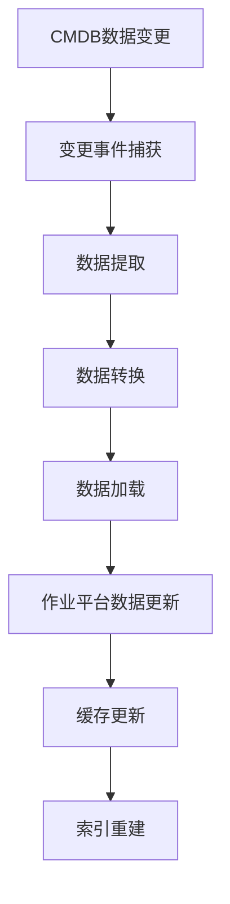
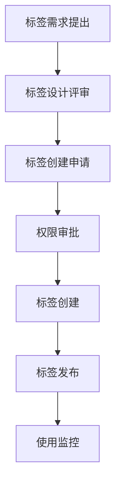
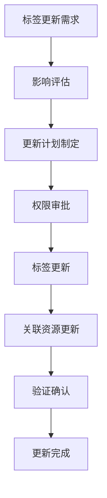
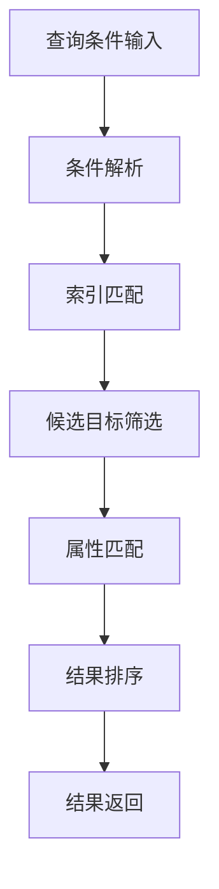
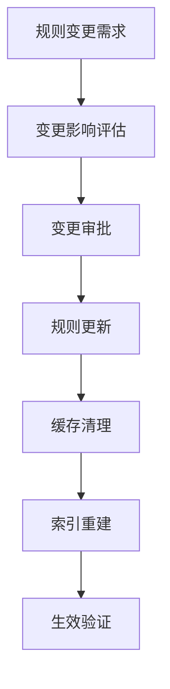

在企业级作业平台中，动态目标选择是实现高效批量操作的核心功能。随着企业IT环境规模的不断扩大和复杂性的增加，传统的静态目标配置方式已无法满足现代运维的需求。动态目标选择通过与配置管理数据库(CMDB)的深度集成，基于标签、业务属性等维度动态生成执行目标，实现了精准、灵活和智能的目标识别与选择。本章将深入探讨动态目标选择的实现机制和关键技术。

## CMDB集成基础：构建统一的资源配置视图

配置管理数据库(CMDB)是企业IT运维管理的核心组件，它存储了所有IT资源的配置信息和关系数据。与CMDB的深度集成是实现动态目标选择的基础，为作业平台提供了统一、准确和实时的资源配置视图。

### CMDB数据模型设计

CMDB的数据模型设计直接影响动态目标选择的效果和效率。一个合理的CMDB数据模型应该能够全面、准确地描述IT环境中的各种资源及其关系。

#### 配置项(CI)定义
配置项是CMDB中的基本单位，代表IT环境中的各种资源：

##### 核心配置项类型
```json
{
  "ci_types": [
    {
      "type": "server",
      "name": "服务器",
      "description": "物理服务器或虚拟机实例",
      "attributes": [
        {"name": "hostname", "type": "string", "required": true},
        {"name": "ip_address", "type": "string", "required": true},
        {"name": "os_type", "type": "string", "required": true},
        {"name": "cpu_cores", "type": "integer", "required": false},
        {"name": "memory_gb", "type": "integer", "required": false},
        {"name": "disk_gb", "type": "integer", "required": false}
      ]
    },
    {
      "type": "database",
      "name": "数据库",
      "description": "数据库实例",
      "attributes": [
        {"name": "instance_name", "type": "string", "required": true},
        {"name": "db_type", "type": "string", "required": true},
        {"name": "version", "type": "string", "required": false},
        {"name": "port", "type": "integer", "required": true}
      ]
    },
    {
      "type": "application",
      "name": "应用系统",
      "description": "业务应用系统",
      "attributes": [
        {"name": "app_name", "type": "string", "required": true},
        {"name": "version", "type": "string", "required": false},
        {"name": "owner", "type": "string", "required": false},
        {"name": "business_level", "type": "string", "required": false}
      ]
    }
  ]
}
```

#### 属性信息管理
每个配置项都包含丰富的属性信息，这些属性是动态目标选择的重要依据：

##### 基础属性
- **标识属性**：如主机名、IP地址等唯一标识信息
- **技术属性**：如操作系统、硬件配置、软件版本等技术信息
- **位置属性**：如数据中心、机架位置、地域信息等位置信息
- **状态属性**：如运行状态、维护状态、健康状态等状态信息

##### 业务属性
- **业务归属**：所属业务系统、业务模块等业务归属信息
- **服务等级**：SLA等级、重要性等级等服务等级信息
- **维护信息**：维护窗口、维护负责人等维护信息
- **成本信息**：采购成本、维护成本等成本信息

#### 关系数据建模
配置项之间的关系数据是理解IT环境架构的关键：

##### 关系类型定义
```json
{
  "relation_types": [
    {
      "type": "runs_on",
      "name": "运行于",
      "description": "应用运行于服务器关系",
      "source_type": "application",
      "target_type": "server"
    },
    {
      "type": "connects_to",
      "name": "连接至",
      "description": "数据库连接关系",
      "source_type": "application",
      "target_type": "database"
    },
    {
      "type": "part_of",
      "name": "属于",
      "description": "组件属于系统关系",
      "source_type": "component",
      "target_type": "system"
    }
  ]
}
```

##### 关系属性
- **依赖关系**：表示配置项间的依赖关系
- **连接关系**：表示配置项间的网络连接关系
- **包含关系**：表示配置项间的包含关系
- **影响关系**：表示配置项间的业务影响关系

### 集成架构设计

与CMDB的集成需要考虑数据同步、接口标准、缓存机制和安全控制等多个方面，确保集成的高效性和安全性。

#### 数据同步机制
建立高效的数据同步机制是确保数据一致性的关键：

##### 同步策略
- **实时同步**：通过事件驱动机制实现实时数据同步
- **定时同步**：通过定时任务实现周期性数据同步
- **增量同步**：只同步发生变化的数据，提高同步效率
- **全量同步**：定期进行全量数据同步，确保数据完整性

##### 同步流程


#### 接口标准设计
采用标准化的API接口进行数据交互，确保集成的兼容性和可扩展性：

##### RESTful API设计
```http
GET /api/v1/cis
Parameters:
- type: 配置项类型
- filters: 过滤条件
- page: 页码
- size: 每页大小

Response:
{
  "total": 1000,
  "page": 1,
  "size": 50,
  "cis": [
    {
      "id": "ci-001",
      "type": "server",
      "attributes": {
        "hostname": "web-server-01",
        "ip_address": "192.168.1.10",
        "os_type": "Linux"
      },
      "tags": ["web", "production", "beijing"],
      "business_attributes": {
        "system": "e-commerce",
        "module": "frontend",
        "level": "high"
      }
    }
  ]
}
```

##### GraphQL API设计
```graphql
query GetCIs($filters: CIFilterInput) {
  cis(filters: $filters) {
    id
    type
    attributes
    tags
    businessAttributes
    relations {
      type
      target {
        id
        type
        attributes
      }
    }
  }
}
```

#### 缓存机制实现
建立本地缓存提高查询效率，减少对CMDB的直接访问压力：

##### 多级缓存架构


##### 缓存策略
- **热点数据缓存**：缓存频繁访问的配置项数据
- **查询结果缓存**：缓存常用查询的结果
- **关系数据缓存**：缓存配置项间的关系数据
- **标签索引缓存**：缓存基于标签的索引数据

#### 安全控制机制
确保数据传输和访问的安全性：

##### 认证授权
- **API密钥**：使用API密钥进行身份认证
- **OAuth2.0**：支持OAuth2.0认证授权
- **JWT令牌**：使用JWT令牌进行会话管理
- **角色权限**：基于角色的访问控制

##### 数据加密
- **传输加密**：使用HTTPS/TLS加密数据传输
- **存储加密**：对敏感数据进行加密存储
- **字段加密**：对特定字段进行加密处理
- **密钥管理**：建立完善的密钥管理体系

### 数据映射策略

建立作业平台与CMDB的数据映射策略，确保数据的有效转换和利用：

#### 实体映射
将CMDB的配置项映射为作业平台的目标对象：

##### 映射规则定义
```yaml
entity_mapping:
  server:
    target_type: "machine"
    attribute_mapping:
      hostname: "name"
      ip_address: "ip"
      os_type: "os"
      cpu_cores: "cpu"
      memory_gb: "memory"
    status_mapping:
      "running": "online"
      "stopped": "offline"
      "maintenance": "maintenance"
```

##### 映射处理流程
1. **数据提取**：从CMDB提取配置项数据
2. **格式转换**：将CMDB数据格式转换为目标对象格式
3. **属性映射**：根据映射规则转换属性
4. **状态转换**：转换状态标识
5. **关系处理**：处理配置项间的关系
6. **数据验证**：验证转换后数据的完整性

#### 属性映射
将CMDB的属性信息映射为作业平台的标签和属性：

##### 标签映射
```yaml
tag_mapping:
  business_system: "system"
  business_module: "module"
  environment: "env"
  data_center: "dc"
  owner_team: "team"
  service_level: "sla"
```

##### 属性映射
```yaml
attribute_mapping:
  hostname: "name"
  ip_address: "ip"
  os_type: "os"
  cpu_cores: "cpu"
  memory_gb: "memory"
  disk_gb: "disk"
```

#### 关系映射
将CMDB的关系数据映射为作业平台的关联关系：

##### 关系映射规则
```yaml
relation_mapping:
  runs_on:
    source_type: "application"
    target_type: "machine"
    relation_type: "deployed_on"
  connects_to:
    source_type: "application"
    target_type: "database"
    relation_type: "connects_to"
  part_of:
    source_type: "component"
    target_type: "system"
    relation_type: "belongs_to"
```

## 标签化管理：实现灵活的目标分类和筛选

标签化管理是实现灵活目标选择的重要手段，通过为资源打上不同的标签，可以方便地进行分类和筛选，提高目标选择的效率和准确性。

### 标签设计原则

设计合理的标签体系需要遵循一系列原则，确保标签的有效性和可用性：

#### 语义清晰原则
标签名称应具有明确的业务含义，避免歧义和混淆：

##### 命名规范
- **简洁明了**：标签名称应简洁易懂
- **语义明确**：标签含义应清晰明确
- **避免缩写**：尽量避免使用不常见的缩写
- **统一规范**：建立统一的命名规范

##### 示例标签
```yaml
# 环境标签
env: [development, testing, staging, production]

# 业务标签
system: [e-commerce, payment, user-center, order-management]
module: [frontend, backend, database, cache]

# 技术标签
os: [linux, windows, unix]
middleware: [nginx, tomcat, redis, mysql]

# 地域标签
region: [beijing, shanghai, guangzhou, shenzhen]
datacenter: [dc1, dc2, dc3]
```

#### 层次分明原则
建立清晰的标签层次结构，便于管理和使用：

##### 标签分类体系
```yaml
tag_categories:
  environment:
    name: "环境"
    description: "部署环境分类"
    tags: ["development", "testing", "staging", "production"]
  
  business:
    name: "业务"
    description: "业务系统分类"
    tags: ["e-commerce", "payment", "user-center", "order-management"]
  
  technical:
    name: "技术"
    description: "技术栈分类"
    tags: ["linux", "windows", "nginx", "tomcat", "redis", "mysql"]
  
  location:
    name: "位置"
    description: "地理位置分类"
    tags: ["beijing", "shanghai", "guangzhou", "shenzhen"]
```

#### 可扩展性原则
支持标签体系的动态扩展，适应业务发展需要：

##### 扩展机制
- **动态添加**：支持运行时动态添加新标签
- **版本管理**：管理标签体系的版本变更
- **兼容性保证**：确保新旧标签的兼容性
- **迁移支持**：支持标签的迁移和转换

#### 一致性原则
确保标签使用的统一性和规范性：

##### 使用规范
- **统一管理**：建立统一的标签管理中心
- **权限控制**：控制标签的创建和修改权限
- **审核机制**：建立标签使用的审核机制
- **监控告警**：监控标签使用的合规性

### 标签分类体系

建立多维度的标签分类体系，满足不同场景的使用需求：

#### 环境标签
用于标识资源的部署环境：

##### 环境分类
```yaml
environment_tags:
  development:
    name: "开发环境"
    description: "用于开发和调试的环境"
    color: "#FFB3BA"
  
  testing:
    name: "测试环境"
    description: "用于功能测试的环境"
    color: "#BAFFC9"
  
  staging:
    name: "预发布环境"
    description: "用于预发布验证的环境"
    color: "#BAE1FF"
  
  production:
    name: "生产环境"
    description: "用于实际业务运行的环境"
    color: "#FFFFBA"
```

#### 业务标签
用于标识资源的业务归属：

##### 业务分类
```yaml
business_tags:
  e-commerce:
    name: "电商平台"
    description: "电商核心业务系统"
    owner: "ecommerce-team"
    sla: "99.9%"
  
  payment:
    name: "支付系统"
    description: "支付核心业务系统"
    owner: "payment-team"
    sla: "99.99%"
  
  user-center:
    name: "用户中心"
    description: "用户管理核心系统"
    owner: "user-team"
    sla: "99.9%"
  
  order-management:
    name: "订单管理"
    description: "订单处理核心系统"
    owner: "order-team"
    sla: "99.9%"
```

#### 技术标签
用于标识资源的技术特征：

##### 技术分类
```yaml
technical_tags:
  os:
    linux: 
      name: "Linux系统"
      versions: ["centos7", "ubuntu18", "redhat8"]
    windows:
      name: "Windows系统"
      versions: ["windows2016", "windows2019"]
  
  middleware:
    web_server:
      nginx: "Nginx"
      apache: "Apache"
    app_server:
      tomcat: "Tomcat"
      jetty: "Jetty"
    cache:
      redis: "Redis"
      memcached: "Memcached"
    database:
      mysql: "MySQL"
      postgresql: "PostgreSQL"
      oracle: "Oracle"
```

#### 地域标签
用于标识资源的地理位置：

##### 地域分类
```yaml
location_tags:
  region:
    beijing:
      name: "北京"
      datacenters: ["bj-dc1", "bj-dc2"]
    shanghai:
      name: "上海"
      datacenters: ["sh-dc1", "sh-dc2"]
    guangzhou:
      name: "广州"
      datacenters: ["gz-dc1"]
    shenzhen:
      name: "深圳"
      datacenters: ["sz-dc1"]
  
  datacenter:
    bj-dc1:
      name: "北京数据中心1"
      region: "beijing"
      address: "北京市朝阳区xxx"
    bj-dc2:
      name: "北京数据中心2"
      region: "beijing"
      address: "北京市海淀区xxx"
```

### 标签管理机制

建立完善的标签管理机制，确保标签的有效使用和维护：

#### 标签创建管理
提供标签创建和管理功能：

##### 创建流程


##### 管理功能
- **标签定义**：定义标签的名称、描述、分类等信息
- **标签属性**：设置标签的属性，如颜色、图标等
- **标签关系**：定义标签间的关系和约束
- **标签版本**：管理标签的版本历史

#### 标签分配机制
支持为资源分配标签：

##### 分配方式
- **手动分配**：通过界面手动为资源分配标签
- **自动分配**：根据规则自动为资源分配标签
- **批量分配**：支持批量为多个资源分配标签
- **模板分配**：通过模板为资源分配标签

##### 分配规则
```yaml
tag_assignment_rules:
  - name: "生产环境自动分配"
    condition: "environment == 'production'"
    tags: ["production", "high-priority"]
    auto_assign: true
  
  - name: "数据库服务器分配"
    condition: "role == 'database'"
    tags: ["database", "critical"]
    auto_assign: true
  
  - name: "北京地区分配"
    condition: "region == 'beijing'"
    tags: ["beijing", "north-china"]
    auto_assign: true
```

#### 标签查询机制
支持基于标签的资源查询：

##### 查询语法
```sql
-- 基于单个标签查询
SELECT * FROM targets WHERE tags CONTAINS 'production';

-- 基于多个标签查询
SELECT * FROM targets WHERE tags CONTAINS ALL ('production', 'web');

-- 基于标签组合查询
SELECT * FROM targets WHERE tags CONTAINS ANY ('beijing', 'shanghai') 
  AND tags CONTAINS 'production';
```

##### 查询优化
- **索引优化**：为标签字段建立索引
- **缓存机制**：缓存常用查询结果
- **分页处理**：支持大数据量的分页查询
- **结果排序**：支持查询结果的排序

#### 标签更新维护
支持标签的动态更新和维护：

##### 更新流程


##### 维护机制
- **定期审查**：定期审查标签的使用情况
- **清理机制**：清理不再使用的标签
- **迁移支持**：支持标签的迁移和转换
- **审计日志**：记录标签的变更历史

## 业务属性驱动：基于业务维度的智能目标选择

基于业务属性的动态目标选择能够更好地满足业务需求，提高操作的针对性和有效性。通过深入理解业务属性，可以实现更加精准和智能的目标选择。

### 业务属性定义

定义关键的业务属性，为智能目标选择提供数据基础：

#### 核心业务属性
```yaml
business_attributes:
  system:
    name: "业务系统"
    description: "资源所属的业务系统"
    type: "string"
    required: true
    values: ["e-commerce", "payment", "user-center", "order-management"]
  
  module:
    name: "业务模块"
    description: "资源所属的业务模块"
    type: "string"
    required: false
    values: ["frontend", "backend", "database", "cache", "mq"]
  
  level:
    name: "业务等级"
    description: "业务的重要程度等级"
    type: "string"
    required: true
    values: ["critical", "high", "medium", "low"]
  
  sla:
    name: "服务等级"
    description: "服务的SLA等级"
    type: "string"
    required: true
    values: ["99.99%", "99.9%", "99.5%", "99%"]
  
  maintenance_window:
    name: "维护窗口"
    description: "允许维护的时间窗口"
    type: "string"
    required: false
    format: "cron"
  
  owner:
    name: "负责人"
    description: "业务的负责人信息"
    type: "string"
    required: true
```

#### 业务属性管理
建立完善的业务属性管理体系：

##### 属性定义管理
- **属性创建**：支持业务属性的创建和定义
- **属性分类**：对业务属性进行分类管理
- **属性约束**：定义业务属性的约束条件
- **属性版本**：管理业务属性的版本历史

##### 属性分配机制
- **手动分配**：支持手动为资源分配业务属性
- **自动分配**：根据规则自动分配业务属性
- **批量分配**：支持批量分配业务属性
- **继承机制**：支持业务属性的继承关系

##### 属性查询接口
- **单属性查询**：支持单个业务属性的查询
- **多属性组合**：支持多个业务属性的组合查询
- **模糊匹配**：支持业务属性的模糊匹配查询
- **关联查询**：支持业务属性间的关联查询

### 属性查询机制

建立基于业务属性的查询机制，实现灵活的目标筛选：

#### 多条件组合查询
支持多个业务属性的组合查询：

##### 查询语法设计
```json
{
  "query": {
    "and": [
      {"system": "e-commerce"},
      {"level": "critical"},
      {"region": "beijing"},
      {
        "or": [
          {"module": "frontend"},
          {"module": "backend"}
        ]
      }
    ]
  }
}
```

##### 查询执行流程


#### 模糊匹配查询
支持业务属性的模糊匹配查询：

##### 匹配算法
- **前缀匹配**：支持属性值的前缀匹配
- **后缀匹配**：支持属性值的后缀匹配
- **包含匹配**：支持属性值的包含匹配
- **正则匹配**：支持正则表达式的匹配

##### 匹配示例
```sql
-- 前缀匹配
SELECT * FROM targets WHERE system LIKE 'e-com%';

-- 包含匹配
SELECT * FROM targets WHERE owner CONTAINS 'zhang';

-- 正则匹配
SELECT * FROM targets WHERE ip_address REGEXP '^192\.168\.[0-9]+\.[0-9]+$';
```

#### 关联查询机制
支持业务属性间的关联查询：

##### 关联关系定义
```yaml
attribute_relations:
  system_module:
    source: "system"
    target: "module"
    relation: "contains"
    mapping:
      e-commerce: ["frontend", "backend", "database"]
      payment: ["payment-gateway", "risk-control"]
      user-center: ["user-service", "auth-service"]
  
  level_sla:
    source: "level"
    target: "sla"
    relation: "implies"
    mapping:
      critical: "99.99%"
      high: "99.9%"
      medium: "99.5%"
      low: "99%"
```

##### 关联查询实现
```sql
-- 基于关联关系的查询
SELECT t.* FROM targets t 
JOIN system_module_mapping sm ON t.system = sm.system 
WHERE sm.module = 'frontend' AND t.level = 'critical';
```

### 业务影响评估

基于业务属性评估操作的影响，为决策提供支持：

#### 影响范围评估
评估操作影响的业务范围：

##### 评估维度
- **业务系统影响**：评估影响的业务系统数量和重要性
- **业务模块影响**：评估影响的业务模块范围
- **用户影响**：评估对最终用户的影响程度
- **数据影响**：评估对业务数据的影响程度

##### 评估算法
```python
def assess_impact_scope(targets):
    impact_score = 0
    
    # 业务系统重要性权重
    system_weights = {
        "e-commerce": 100,
        "payment": 200,
        "user-center": 80,
        "order-management": 90
    }
    
    # 业务等级权重
    level_weights = {
        "critical": 100,
        "high": 50,
        "medium": 20,
        "low": 5
    }
    
    for target in targets:
        system_weight = system_weights.get(target.system, 10)
        level_weight = level_weights.get(target.level, 1)
        impact_score += system_weight * level_weight
    
    return impact_score
```

#### 影响程度评估
评估操作对业务的影响程度：

##### 评估指标
- **服务中断时间**：预估服务中断的持续时间
- **数据丢失风险**：评估数据丢失的可能性和影响
- **性能下降程度**：评估性能下降的程度
- **用户体验影响**：评估对用户体验的影响

##### 评估模型
```python
def assess_impact_degree(operation, targets):
    # 基础影响因子
    base_factors = {
        "restart": 0.3,
        "update": 0.5,
        "maintenance": 0.2,
        "decommission": 1.0
    }
    
    # 目标数量因子
    target_factor = len(targets) / 1000
    
    # 业务等级因子
    level_factors = {
        "critical": 1.0,
        "high": 0.8,
        "medium": 0.5,
        "low": 0.2
    }
    
    base_impact = base_factors.get(operation, 0.5)
    level_impact = sum([level_factors.get(t.level, 0.3) for t in targets]) / len(targets)
    
    return base_impact * target_factor * level_impact
```

#### 风险等级评估
评估操作的风险等级：

##### 风险维度
- **技术风险**：操作的技术复杂度和失败概率
- **业务风险**：对业务的影响程度和恢复难度
- **安全风险**：对系统安全的影响和潜在威胁
- **合规风险**：对合规要求的影响和违规风险

##### 风险评估矩阵
```yaml
risk_matrix:
  technical_risk:
    low: "操作简单，失败概率<1%"
    medium: "操作中等复杂，失败概率1-5%"
    high: "操作复杂，失败概率5-20%"
    critical: "操作非常复杂，失败概率>20%"
  
  business_risk:
    low: "影响范围小，恢复时间<30分钟"
    medium: "影响范围中等，恢复时间30分钟-2小时"
    high: "影响范围大，恢复时间2-8小时"
    critical: "影响范围很大，恢复时间>8小时"
  
  security_risk:
    low: "无安全风险"
    medium: "存在轻微安全风险"
    high: "存在中等安全风险"
    critical: "存在严重安全风险"
```

#### 执行建议生成
基于评估结果生成操作执行建议：

##### 建议内容
- **执行时间建议**：建议的最佳执行时间窗口
- **资源准备建议**：建议需要准备的资源和支持
- **风险控制建议**：建议的风险控制措施
- **回滚方案建议**：建议的回滚和恢复方案

##### 建议生成算法
```python
def generate_execution_advice(impact_scope, impact_degree, risk_level):
    advice = {}
    
    # 执行时间建议
    if impact_scope > 1000 or impact_degree > 0.7:
        advice["execution_time"] = "建议在维护窗口执行"
    else:
        advice["execution_time"] = "可在业务低峰期执行"
    
    # 资源准备建议
    if risk_level == "critical":
        advice["resource_preparation"] = "需要准备完整的备份和回滚方案"
    elif risk_level == "high":
        advice["resource_preparation"] = "需要准备部分备份和回滚方案"
    else:
        advice["resource_preparation"] = "建议准备基本的备份方案"
    
    # 风险控制建议
    if risk_level in ["critical", "high"]:
        advice["risk_control"] = "需要双人复核和蓝屏审批"
    else:
        advice["risk_control"] = "建议进行操作前检查"
    
    return advice
```

## 动态生成机制：实现目标的实时识别和选择

动态生成执行目标是批量操作的核心能力，通过灵活的规则引擎实现目标的动态识别和选择，确保目标选择的实时性和准确性。

### 规则引擎设计

设计灵活的规则引擎，支持复杂的条件组合和动态目标生成：

#### 规则定义语法
设计简洁易用的规则定义语法：

##### 基础语法
```yaml
rules:
  - name: "生产环境Web服务器"
    description: "选择生产环境的所有Web服务器"
    condition: "env == 'production' && role == 'web'"
    priority: 100
    enabled: true
  
  - name: "北京地区数据库服务器"
    description: "选择北京地区的所有数据库服务器"
    condition: "region == 'beijing' && role == 'database'"
    priority: 90
    enabled: true
  
  - name: "高优先级业务系统"
    description: "选择所有高优先级业务系统的服务器"
    condition: "business_level in ['critical', 'high']"
    priority: 80
    enabled: true
```

##### 复杂条件语法
```yaml
complex_rules:
  - name: "维护窗口内的非关键系统"
    description: "选择当前在维护窗口内且非关键的系统"
    condition: |
      (maintenance_window.contains(now()) || maintenance_window == 'anytime') 
      && business_level not in ['critical']
    priority: 70
    enabled: true
  
  - name: "特定时间段的批量操作"
    description: "在特定时间段内选择特定类型的服务器"
    condition: |
      (now().hour >= 2 && now().hour <= 4) 
      && (role == 'batch' || role == 'etl')
    priority: 60
    enabled: true
```

#### 规则组合机制
支持多个规则的组合使用：

##### 组合方式
- **AND组合**：多个规则条件必须同时满足
- **OR组合**：多个规则条件满足其一即可
- **优先级组合**：按照优先级顺序应用规则
- **排除组合**：排除满足特定条件的目标

##### 组合示例
```yaml
rule_combinations:
  - name: "生产环境核心系统"
    description: "生产环境的核心业务系统服务器"
    rules:
      - "生产环境Web服务器"
      - "高优先级业务系统"
    combination: "AND"
  
  - name: "所有数据库服务器"
    description: "所有环境的数据库服务器"
    rules:
      - "北京地区数据库服务器"
      - "上海地区数据库服务器"
      - "广州地区数据库服务器"
    combination: "OR"
```

#### 优先级设置机制
支持规则优先级的设置：

##### 优先级定义
```yaml
priority_levels:
  critical: 1000
  high: 500
  medium: 100
  low: 10
  default: 50
```

##### 优先级应用
- **匹配顺序**：按照优先级从高到低匹配规则
- **冲突解决**：高优先级规则覆盖低优先级规则
- **默认规则**：设置默认规则处理未匹配情况
- **动态调整**：支持运行时动态调整优先级

#### 动态更新机制
支持规则的动态更新和维护：

##### 更新流程


##### 更新机制
- **热更新**：支持规则的热更新，无需重启服务
- **版本管理**：管理规则的版本历史
- **回滚支持**：支持规则更新的回滚
- **变更审计**：记录规则的变更历史

### 目标筛选算法

实现高效的目标筛选算法，确保目标选择的性能和准确性：

#### 索引优化策略
为常用查询字段建立索引，提高查询效率：

##### 索引设计
```sql
-- 为常用标签字段建立索引
CREATE INDEX idx_targets_tags ON targets USING GIN(tags);

-- 为业务属性建立复合索引
CREATE INDEX idx_targets_business ON targets(system, module, level);

-- 为地理位置建立索引
CREATE INDEX idx_targets_location ON targets(region, datacenter);

-- 为状态字段建立索引
CREATE INDEX idx_targets_status ON targets(status);
```

##### 索引维护
- **自动维护**：数据库自动维护索引统计信息
- **定期重建**：定期重建碎片化的索引
- **监控告警**：监控索引使用情况和性能
- **优化建议**：提供索引优化建议

#### 缓存机制实现
缓存常用查询结果，减少重复计算：

##### 缓存策略
```python
class TargetCache:
    def __init__(self):
        self.cache = {}
        self.ttl = 300  # 5分钟缓存时间
    
    def get_targets(self, query_key):
        if query_key in self.cache:
            cached_data, timestamp = self.cache[query_key]
            if time.time() - timestamp < self.ttl:
                return cached_data
            else:
                del self.cache[query_key]
        
        return None
    
    def set_targets(self, query_key, targets):
        self.cache[query_key] = (targets, time.time())
    
    def invalidate(self, query_key=None):
        if query_key:
            self.cache.pop(query_key, None)
        else:
            self.cache.clear()
```

##### 缓存更新
- **主动更新**：在数据变更时主动更新缓存
- **被动更新**：在缓存过期时重新查询数据
- **增量更新**：只更新变更部分的缓存
- **批量更新**：批量更新多个缓存项

#### 并行处理机制
支持查询的并行处理，提高处理效率：

##### 并行查询
```python
import asyncio
import concurrent.futures

async def parallel_target_query(queries):
    with concurrent.futures.ThreadPoolExecutor(max_workers=10) as executor:
        loop = asyncio.get_event_loop()
        tasks = [
            loop.run_in_executor(executor, query_single_target, query)
            for query in queries
        ]
        results = await asyncio.gather(*tasks)
    return results

def query_single_target(query):
    # 执行单个目标查询
    return execute_query(query)
```

##### 结果合并
```python
def merge_query_results(results, merge_strategy="union"):
    if merge_strategy == "union":
        # 并集合并
        merged_targets = set()
        for result in results:
            merged_targets.update(result)
        return list(merged_targets)
    
    elif merge_strategy == "intersection":
        # 交集合并
        if not results:
            return []
        merged_targets = set(results[0])
        for result in results[1:]:
            merged_targets.intersection_update(result)
        return list(merged_targets)
```

#### 结果排序机制
支持查询结果的排序，提高用户体验：

##### 排序字段
```yaml
sort_fields:
  - name: "主机名"
    field: "hostname"
    default_order: "asc"
  
  - name: "业务等级"
    field: "business_level"
    default_order: "desc"
  
  - name: "创建时间"
    field: "created_at"
    default_order: "desc"
  
  - name: "最后更新时间"
    field: "updated_at"
    default_order: "desc"
```

##### 排序实现
```sql
SELECT * FROM targets 
WHERE tags CONTAINS 'production' 
ORDER BY business_level DESC, hostname ASC 
LIMIT 100 OFFSET 0;
```

### 动态更新机制

建立目标的动态更新机制，确保目标信息的实时性和准确性：

#### 实时同步机制
与CMDB实时同步目标信息：

##### 同步方式
```python
class RealTimeSync:
    def __init__(self, cmdb_client):
        self.cmdb_client = cmdb_client
        self.last_sync_time = 0
    
    async def sync_targets(self):
        # 获取CMDB变更事件
        events = await self.cmdb_client.get_change_events(
            since=self.last_sync_time
        )
        
        # 处理变更事件
        for event in events:
            await self.process_change_event(event)
        
        self.last_sync_time = time.time()
    
    async def process_change_event(self, event):
        if event.type == "CREATE":
            await self.create_target(event.data)
        elif event.type == "UPDATE":
            await self.update_target(event.data)
        elif event.type == "DELETE":
            await self.delete_target(event.data)
```

##### 变更检测
```python
def detect_changes(current_data, previous_data):
    changes = {}
    
    # 检测属性变更
    for key, value in current_data.items():
        if key not in previous_data or previous_data[key] != value:
            changes[key] = {
                "old_value": previous_data.get(key),
                "new_value": value
            }
    
    # 检测新增属性
    for key in set(current_data.keys()) - set(previous_data.keys()):
        changes[key] = {
            "old_value": None,
            "new_value": current_data[key]
        }
    
    # 检测删除属性
    for key in set(previous_data.keys()) - set(current_data.keys()):
        changes[key] = {
            "old_value": previous_data[key],
            "new_value": None
        }
    
    return changes
```

#### 变更检测机制
检测目标信息的变更：

##### 检测策略
- **轮询检测**：定期轮询CMDB检测变更
- **事件驱动**：通过CMDB事件通知检测变更
- **增量检测**：只检测发生变化的部分
- **批量检测**：批量检测多个目标的变更

##### 检测算法
```python
class ChangeDetector:
    def __init__(self):
        self.checksum_cache = {}
    
    def calculate_checksum(self, data):
        # 计算数据校验和
        return hashlib.md5(str(sorted(data.items())).encode()).hexdigest()
    
    def detect_change(self, target_id, current_data):
        current_checksum = self.calculate_checksum(current_data)
        previous_checksum = self.checksum_cache.get(target_id)
        
        if previous_checksum != current_checksum:
            self.checksum_cache[target_id] = current_checksum
            return True
        return False
```

#### 增量更新机制
支持目标信息的增量更新：

##### 更新策略
```python
class IncrementalUpdater:
    def __init__(self, target_store):
        self.target_store = target_store
        self.pending_updates = []
    
    def add_update(self, target_id, updates):
        self.pending_updates.append({
            "target_id": target_id,
            "updates": updates,
            "timestamp": time.time()
        })
    
    async def apply_updates(self):
        # 批量应用更新
        batch_size = 100
        for i in range(0, len(self.pending_updates), batch_size):
            batch = self.pending_updates[i:i+batch_size]
            await self.target_store.batch_update(batch)
        
        self.pending_updates.clear()
```

##### 更新优化
- **批量更新**：批量处理多个更新操作
- **事务支持**：确保更新操作的原子性
- **冲突处理**：处理并发更新的冲突
- **回滚支持**：支持更新操作的回滚

#### 版本控制机制
支持目标信息的版本管理：

##### 版本设计
```yaml
target_version:
  id: "target-001"
  current_version: 5
  versions:
    - version: 1
      data: {...}
      timestamp: "2025-01-01T10:00:00Z"
      author: "admin"
    - version: 2
      data: {...}
      timestamp: "2025-01-02T11:00:00Z"
      author: "ops"
    - version: 3
      data: {...}
      timestamp: "2025-01-03T12:00:00Z"
      author: "admin"
```

##### 版本管理
- **版本创建**：在数据变更时自动创建新版本
- **版本查询**：支持查询历史版本信息
- **版本比较**：支持不同版本间的差异比较
- **版本回滚**：支持回滚到指定历史版本

## 总结

动态目标选择是企业级作业平台实现高效批量操作的核心功能。通过与CMDB的深度集成、标签化管理、业务属性驱动和动态生成机制，可以实现精准、灵活和智能的目标识别与选择。

CMDB集成为基础提供了统一、准确和实时的资源配置视图，通过合理的数据模型设计、集成架构和数据映射策略，确保了数据的有效转换和利用。标签化管理通过多维度的标签分类体系和完善的管理机制，实现了灵活的目标分类和筛选。业务属性驱动基于关键业务属性的定义和查询机制，结合业务影响评估，实现了基于业务维度的智能目标选择。动态生成机制通过灵活的规则引擎、高效的目标筛选算法和实时的动态更新机制，确保了目标选择的实时性和准确性。

在实际实现过程中，需要根据企业的具体需求和IT环境特点，合理设计和实施各种动态目标选择机制，确保平台能够满足大规模、高效率的运维需求。同时，还需要建立完善的监控和管理机制，及时发现和处理问题，持续优化动态目标选择的效果。

在后续章节中，我们将深入探讨执行策略、实时执行反馈等其他批量操作相关功能，帮助您构建一个完整的企业级作业平台。