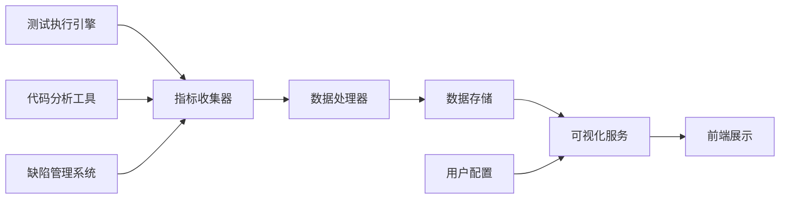

# 构建质量仪表盘（Dashboard）：用例覆盖率、通过率、缺陷分布

在现代软件测试实践中，质量仪表盘作为测试平台的核心组件，为团队提供了直观、实时的质量状况概览。通过将关键质量指标以可视化的方式呈现，质量仪表盘不仅帮助团队快速了解当前的测试状态，还能为决策制定提供数据支持。本文将深入探讨如何构建一个功能完善、信息丰富的质量仪表盘，重点关注用例覆盖率、通过率和缺陷分布等核心指标的展示与分析。

## 质量仪表盘的核心价值

质量仪表盘在测试平台中发挥着多重重要作用：

### 实时监控与反馈

1. **即时状态展示**：实时反映测试执行状态和质量状况
2. **异常预警**：及时发现质量异常和潜在风险
3. **进度跟踪**：跟踪测试执行进度和里程碑完成情况
4. **资源监控**：监控测试资源的使用情况

### 决策支持

1. **数据驱动决策**：基于客观数据支持测试策略调整
2. **优先级排序**：帮助识别需要优先关注的质量问题
3. **资源分配**：指导测试资源的合理分配
4. **风险评估**：评估项目质量和发布风险

### 团队协作促进

1. **信息透明**：提高测试信息的透明度和可访问性
2. **沟通效率**：减少团队间的信息沟通成本
3. **责任明确**：明确各团队成员的质量责任
4. **目标对齐**：确保团队对质量目标的理解一致

## 仪表盘架构设计

构建高质量的仪表盘需要合理的架构设计：

### 分层架构

采用分层架构设计，将仪表盘系统分为以下几个层次：

1. **数据层**：负责数据的收集、存储和处理
2. **服务层**：提供数据查询和分析服务
3. **展示层**：负责数据的可视化展示
4. **交互层**：处理用户交互和个性化配置

### 微服务架构

采用微服务架构提高系统的可扩展性和可维护性：

```yaml
# 质量仪表盘微服务架构
services:
  dashboard-api:
    description: "仪表盘API服务"
    endpoints:
      - "/api/dashboard/overview"
      - "/api/dashboard/metrics"
      - "/api/dashboard/charts"
  
  metrics-collector:
    description: "指标收集服务"
    responsibilities:
      - 收集测试执行数据
      - 收集代码覆盖率数据
      - 收集缺陷数据
  
  data-processor:
    description: "数据处理服务"
    responsibilities:
      - 计算质量指标
      - 生成统计报告
      - 数据聚合分析
  
  visualization-service:
    description: "可视化服务"
    responsibilities:
      - 图表生成
      - 仪表盘渲染
      - 导出功能
```

### 数据流设计

设计高效的数据流确保仪表盘的实时性：



## 核心指标设计与实现

质量仪表盘的核心是各种质量指标的展示，其中用例覆盖率、通过率和缺陷分布是最关键的三个指标。

### 用例覆盖率指标

用例覆盖率反映了测试用例对需求和代码的覆盖程度。

#### 指标定义

```java
public class TestCaseCoverage {
    private String projectId;
    private String version;
    private LocalDateTime timestamp;
    
    // 需求覆盖率
    private CoverageMetric requirementCoverage;
    
    // 代码覆盖率
    private CoverageMetric codeCoverage;
    
    // 功能覆盖率
    private CoverageMetric featureCoverage;
    
    // 用例执行率
    private CoverageMetric executionCoverage;
    
    // 获取综合覆盖率评分
    public double getOverallCoverageScore() {
        return (requirementCoverage.getPercentage() * 0.3 +
                codeCoverage.getPercentage() * 0.4 +
                featureCoverage.getPercentage() * 0.2 +
                executionCoverage.getPercentage() * 0.1);
    }
}

public class CoverageMetric {
    private int totalItems; // 总项目数
    private int coveredItems; // 覆盖项目数
    private double percentage; // 覆盖率百分比
    
    public CoverageLevel getCoverageLevel() {
        if (percentage >= 90) return CoverageLevel.EXCELLENT;
        if (percentage >= 80) return CoverageLevel.GOOD;
        if (percentage >= 70) return CoverageLevel.FAIR;
        return CoverageLevel.POOR;
    }
}
```

#### 数据收集实现

```java
@Component
public class CoverageDataCollector {
    
    // 收集需求覆盖率数据
    public RequirementCoverage collectRequirementCoverage(String projectId) {
        List<Requirement> requirements = requirementRepository.findByProjectId(projectId);
        List<TestCase> testCases = testCaseRepository.findByProjectId(projectId);
        
        int totalRequirements = requirements.size();
        int coveredRequirements = 0;
        
        for (Requirement requirement : requirements) {
            if (isRequirementCovered(requirement, testCases)) {
                coveredRequirements++;
            }
        }
        
        return new RequirementCoverage(totalRequirements, coveredRequirements);
    }
    
    // 收集代码覆盖率数据
    public CodeCoverage collectCodeCoverage(String projectId, String version) {
        // 从代码覆盖率工具获取数据
        CoverageReport report = coverageToolService.getCoverageReport(projectId, version);
        
        return new CodeCoverage(
            report.getTotalLines(),
            report.getCoveredLines(),
            report.getTotalBranches(),
            report.getCoveredBranches()
        );
    }
}
```

### 通过率指标

通过率是衡量测试执行质量的核心指标。

#### 指标计算

```java
public class TestPassRate {
    private String projectId;
    private String testSuiteId;
    private LocalDateTime periodStart;
    private LocalDateTime periodEnd;
    
    private int totalTests;
    private int passedTests;
    private int failedTests;
    private int skippedTests;
    
    private double passRate; // 通过率
    private double failureRate; // 失败率
    private double skipRate; // 跳过率
    
    // 趋势分析
    private List<PassRateTrend> trendData;
    
    // 分类通过率
    private Map<String, Double> categoryPassRates;
    
    public PassRateLevel getPassRateLevel() {
        if (passRate >= 95) return PassRateLevel.EXCELLENT;
        if (passRate >= 90) return PassRateLevel.GOOD;
        if (passRate >= 80) return PassRateLevel.ACCEPTABLE;
        return PassRateLevel.POOR;
    }
}

public enum PassRateLevel {
    EXCELLENT("优秀", "通过率≥95%"),
    GOOD("良好", "通过率90%-95%"),
    ACCEPTABLE("可接受", "通过率80%-90%"),
    POOR("较差", "通过率<80%");
    
    private String level;
    private String description;
    
    PassRateLevel(String level, String description) {
        this.level = level;
        this.description = description;
    }
}
```

#### 实时计算实现

```java
@Service
public class PassRateCalculator {
    
    public TestPassRate calculateRealTimePassRate(String testSuiteId) {
        // 获取实时测试结果
        List<TestResult> recentResults = testResultRepository
            .findRecentResults(testSuiteId, Duration.ofHours(1));
        
        TestPassRate passRate = new TestPassRate();
        passRate.setTestSuiteId(testSuiteId);
        passRate.setPeriodStart(LocalDateTime.now().minusHours(1));
        passRate.setPeriodEnd(LocalDateTime.now());
        
        // 计算通过率统计
        int total = recentResults.size();
        int passed = (int) recentResults.stream()
            .filter(result -> result.getStatus() == TestStatus.PASSED)
            .count();
        int failed = (int) recentResults.stream()
            .filter(result -> result.getStatus() == TestStatus.FAILED)
            .count();
        int skipped = (int) recentResults.stream()
            .filter(result -> result.getStatus() == TestStatus.SKIPPED)
            .count();
        
        passRate.setTotalTests(total);
        passRate.setPassedTests(passed);
        passRate.setFailedTests(failed);
        passRate.setSkippedTests(skipped);
        passRate.setPassRate(total > 0 ? (double) passed / total * 100 : 0);
        
        // 计算分类通过率
        passRate.setCategoryPassRates(calculateCategoryPassRates(recentResults));
        
        return passRate;
    }
}
```

### 缺陷分布指标

缺陷分布反映了产品质量状况和测试效果。

#### 指标设计

```java
public class DefectDistribution {
    private String projectId;
    private LocalDateTime periodStart;
    private LocalDateTime periodEnd;
    
    // 按严重程度分布
    private Map<Severity, Integer> severityDistribution;
    
    // 按状态分布
    private Map<DefectStatus, Integer> statusDistribution;
    
    // 按模块分布
    private Map<String, Integer> moduleDistribution;
    
    // 按发现阶段分布
    private Map<TestPhase, Integer> phaseDistribution;
    
    // 缺陷趋势
    private List<DefectTrend> defectTrends;
    
    // 缺陷密度
    private double defectDensity; // 每千行代码的缺陷数
    
    // 修复率
    private double fixRate;
    
    public DefectHotspot identifyHotspot() {
        String hotModule = moduleDistribution.entrySet().stream()
            .max(Map.Entry.comparingByValue())
            .map(Map.Entry::getKey)
            .orElse("Unknown");
            
        Severity hotSeverity = severityDistribution.entrySet().stream()
            .max(Map.Entry.comparingByValue())
            .map(Map.Entry::getKey)
            .orElse(Severity.LOW);
            
        return new DefectHotspot(hotModule, hotSeverity);
    }
}

public class DefectHotspot {
    private String moduleName;
    private Severity severity;
    private int defectCount;
    private double contributionRate; // 占总缺陷的比例
    
    // 热点分析建议
    private List<String> recommendations;
}
```

#### 数据分析实现

```java
@Service
public class DefectAnalyzer {
    
    public DefectDistribution analyzeDefects(String projectId, LocalDateTime startDate, LocalDateTime endDate) {
        List<Defect> defects = defectRepository.findByProjectAndPeriod(projectId, startDate, endDate);
        
        DefectDistribution distribution = new DefectDistribution();
        distribution.setProjectId(projectId);
        distribution.setPeriodStart(startDate);
        distribution.setPeriodEnd(endDate);
        
        // 计算严重程度分布
        distribution.setSeverityDistribution(calculateSeverityDistribution(defects));
        
        // 计算状态分布
        distribution.setStatusDistribution(calculateStatusDistribution(defects));
        
        // 计算模块分布
        distribution.setModuleDistribution(calculateModuleDistribution(defects));
        
        // 计算阶段分布
        distribution.setPhaseDistribution(calculatePhaseDistribution(defects));
        
        // 计算缺陷密度
        distribution.setDefectDensity(calculateDefectDensity(projectId, defects));
        
        // 计算修复率
        distribution.setFixRate(calculateFixRate(defects));
        
        // 识别热点
        DefectHotspot hotspot = distribution.identifyHotspot();
        distribution.setHotspot(hotspot);
        
        return distribution;
    }
    
    private Map<Severity, Integer> calculateSeverityDistribution(List<Defect> defects) {
        return defects.stream()
            .collect(Collectors.groupingBy(
                Defect::getSeverity,
                Collectors.collectingAndThen(Collectors.counting(), Math::toIntExact)
            ));
    }
}
```

## 可视化展示设计

优秀的可视化设计能够提升仪表盘的可用性和用户体验。

### 仪表盘布局

设计合理的仪表盘布局：

```javascript
// 仪表盘布局配置
const dashboardLayout = {
    sections: [
        {
            id: 'overview',
            title: '质量概览',
            widgets: [
                { type: 'kpi-card', metric: 'passRate', size: 'large' },
                { type: 'kpi-card', metric: 'coverage', size: 'large' },
                { type: 'kpi-card', metric: 'defects', size: 'large' }
            ]
        },
        {
            id: 'trends',
            title: '趋势分析',
            widgets: [
                { type: 'line-chart', metric: 'passRateTrend', size: 'full' },
                { type: 'bar-chart', metric: 'defectTrend', size: 'full' }
            ]
        },
        {
            id: 'distributions',
            title: '分布分析',
            widgets: [
                { type: 'pie-chart', metric: 'severityDistribution', size: 'half' },
                { type: 'bar-chart', metric: 'moduleDistribution', size: 'half' }
            ]
        }
    ]
};
```

### 交互功能

提供丰富的交互功能：

```javascript
class QualityDashboard extends React.Component {
    constructor(props) {
        super(props);
        this.state = {
            selectedPeriod: 'last7Days',
            selectedProject: 'all',
            dashboardData: null
        };
    }
    
    handlePeriodChange(period) {
        this.setState({ selectedPeriod: period }, () => {
            this.refreshDashboard();
        });
    }
    
    handleProjectChange(project) {
        this.setState({ selectedProject: project }, () => {
            this.refreshDashboard();
        });
    }
    
    refreshDashboard() {
        // 根据选择的条件刷新仪表盘数据
        const params = {
            period: this.state.selectedPeriod,
            project: this.state.selectedProject
        };
        
        dashboardService.getDashboardData(params)
            .then(data => {
                this.setState({ dashboardData: data });
            });
    }
    
    render() {
        return (
            <div className="quality-dashboard">
                <DashboardHeader 
                    onPeriodChange={this.handlePeriodChange}
                    onProjectChange={this.handleProjectChange}
                />
                <DashboardContent data={this.state.dashboardData} />
            </div>
        );
    }
}
```

### 响应式设计

确保仪表盘在不同设备上都能良好展示：

```css
/* 响应式仪表盘样式 */
.quality-dashboard {
    display: grid;
    grid-template-columns: repeat(auto-fit, minmax(300px, 1fr));
    gap: 1rem;
    padding: 1rem;
}

@media (max-width: 768px) {
    .quality-dashboard {
        grid-template-columns: 1fr;
    }
    
    .kpi-card.large {
        grid-column: span 1;
    }
}

@media (min-width: 769px) and (max-width: 1024px) {
    .quality-dashboard {
        grid-template-columns: repeat(2, 1fr);
    }
}

@media (min-width: 1025px) {
    .quality-dashboard {
        grid-template-columns: repeat(3, 1fr);
    }
}
```

## 个性化与定制化

支持用户根据需要定制仪表盘：

### 个性化配置

```java
@Entity
public class DashboardPreference {
    @Id
    private String userId;
    
    private List<DashboardWidget> widgets;
    private String layout;
    private Map<String, Object> settings;
    
    @ElementCollection
    private List<String> favoriteMetrics;
    
    @ElementCollection
    private Map<String, String> customLabels;
    
    // 默认仪表盘配置
    public static DashboardPreference getDefaultPreference(String userId) {
        DashboardPreference preference = new DashboardPreference();
        preference.setUserId(userId);
        preference.setWidgets(getDefaultWidgets());
        preference.setLayout("default");
        return preference;
    }
}
```

### 模板管理

```java
@Service
public class DashboardTemplateService {
    
    public DashboardTemplate createTemplate(String name, List<DashboardWidget> widgets) {
        DashboardTemplate template = new DashboardTemplate();
        template.setName(name);
        template.setWidgets(widgets);
        template.setCreatedAt(LocalDateTime.now());
        template.setCreatedBy(SecurityContext.getCurrentUser());
        
        return templateRepository.save(template);
    }
    
    public List<DashboardTemplate> getAvailableTemplates() {
        return templateRepository.findAll();
    }
    
    public Dashboard applyTemplate(String templateId, String userId) {
        DashboardTemplate template = templateRepository.findById(templateId);
        DashboardPreference preference = preferenceRepository.findByUserId(userId);
        
        // 应用模板到用户偏好
        preference.setWidgets(template.getWidgets());
        preferenceRepository.save(preference);
        
        // 生成新的仪表盘
        return generateDashboard(preference);
    }
}
```

## 性能优化

优化仪表盘性能确保良好的用户体验：

### 数据缓存

```java
@Component
public class DashboardCacheManager {
    private final Cache<String, DashboardData> dashboardCache = 
        Caffeine.newBuilder()
            .maximumSize(1000)
            .expireAfterWrite(5, TimeUnit.MINUTES)
            .build();
    
    public DashboardData getDashboardData(DashboardQuery query) {
        String cacheKey = generateCacheKey(query);
        
        return dashboardCache.get(cacheKey, key -> {
            // 缓存未命中，重新计算
            return calculateDashboardData(query);
        });
    }
    
    public void invalidateCache(String projectId) {
        // 清除相关缓存
        dashboardCache.asMap().keySet().removeIf(key -> key.contains(projectId));
    }
}
```

### 异步加载

```javascript
// 异步加载仪表盘数据
class DashboardDataLoader {
    async loadDashboardData(params) {
        try {
            // 显示加载状态
            this.setState({ loading: true });
            
            // 并行加载多个数据源
            const [overviewData, trendData, distributionData] = await Promise.all([
                dashboardService.getOverviewData(params),
                dashboardService.getTrendData(params),
                dashboardService.getDistributionData(params)
            ]);
            
            // 合并数据
            const dashboardData = {
                overview: overviewData,
                trends: trendData,
                distributions: distributionData
            };
            
            this.setState({ 
                dashboardData: dashboardData,
                loading: false 
            });
        } catch (error) {
            this.setState({ 
                error: error.message,
                loading: false 
            });
        }
    }
}
```

## 安全与权限控制

确保仪表盘的安全性和访问控制：

### 权限管理

```java
@Service
public class DashboardSecurityService {
    
    public boolean canAccessDashboard(String userId, String projectId) {
        // 检查用户是否有项目访问权限
        return projectService.hasAccess(userId, projectId);
    }
    
    public DashboardData filterDashboardData(DashboardData data, String userId) {
        // 根据用户权限过滤数据
        if (permissionService.hasPermission(userId, "VIEW_ALL_PROJECTS")) {
            return data; // 管理员可以看到所有数据
        }
        
        // 普通用户只能看到自己有权限的项目数据
        return filterByUserProjects(data, userId);
    }
}
```

### 数据脱敏

```java
@Component
public class DashboardDataSanitizer {
    
    public DashboardData sanitize(DashboardData data, String userId) {
        // 对敏感数据进行脱敏处理
        if (!permissionService.hasPermission(userId, "VIEW_DETAILED_DEFECTS")) {
            // 脱敏缺陷详情
            data.getDefects().forEach(defect -> {
                defect.setDescription("***敏感信息已隐藏***");
                defect.setAssignee("***");
            });
        }
        
        return data;
    }
}
```

## 总结

构建高质量的质量仪表盘是现代测试平台建设的重要环节。通过合理设计仪表盘架构，精心实现核心质量指标，提供优秀的可视化展示和个性化定制功能，我们能够为团队提供强大而直观的质量监控工具。在实际应用中，我们需要根据具体的业务需求和技术架构，不断优化仪表盘的功能和性能，确保其能够真正发挥价值，为软件质量保障提供有力支持。