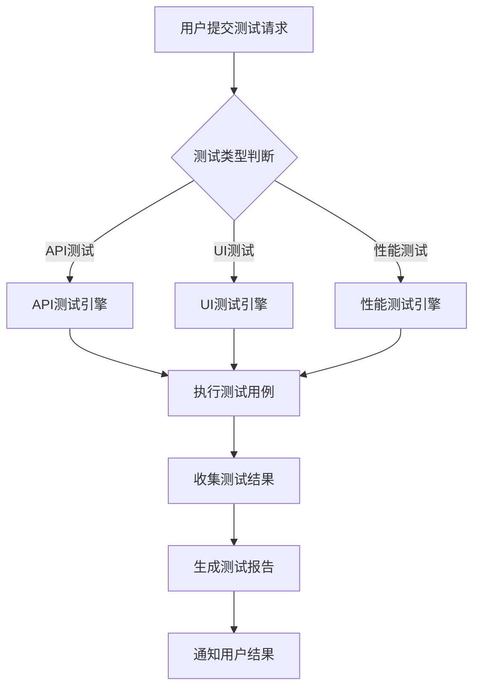

# 编写友好的用户文档与操作手册

在测试平台的推广和使用过程中，优质的用户文档和操作手册是确保用户能够快速上手并有效使用平台的关键因素。良好的文档不仅能够降低用户的学习成本，还能减少支持工作量，提升用户满意度。对于技术平台而言，文档的质量往往直接影响用户的使用体验和平台的 adoption 率。因此，编写友好、清晰、实用的用户文档和操作手册，是测试平台成功的重要保障。

## 文档的重要性

### 用户体验提升

优质的文档能够显著提升用户体验：

1. **降低学习门槛**：帮助用户快速理解和掌握平台功能
2. **减少挫败感**：清晰的指引减少用户在使用过程中的困惑
3. **提高效率**：帮助用户快速找到所需信息，提高工作效率
4. **增强信心**：完善的文档让用户对平台更有信心

### 支持成本降低

良好的文档能够有效降低支持成本：

1. **减少重复咨询**：用户可以通过文档自助解决问题
2. **提高支持效率**：支持人员可以引用文档快速解答问题
3. **标准化解答**：确保问题解答的一致性和准确性
4. **知识沉淀**：将经验教训转化为可复用的知识资产

## 文档类型与结构

### 文档分类体系

建立清晰的文档分类体系：

```java
public enum DocumentationType {
    GETTING_STARTED("快速入门", "帮助新用户快速上手"),
    USER_GUIDE("用户指南", "详细的功能使用说明"),
    API_REFERENCE("API参考", "接口文档和使用示例"),
    TROUBLESHOOTING("故障排除", "常见问题和解决方案"),
    BEST_PRACTICES("最佳实践", "推荐的使用方法和技巧"),
    RELEASE_NOTES("版本说明", "版本更新内容和变更说明");
    
    private final String displayName;
    private final String description;
    
    DocumentationType(String displayName, String description) {
        this.displayName = displayName;
        this.description = description;
    }
    
    public String getDisplayName() {
        return displayName;
    }
    
    public String getDescription() {
        return description;
    }
}
```

### 文档结构设计

设计统一的文档结构模板：

```markdown
# 文档标题

## 概述
简要介绍本文档的内容和目标读者

## 目标读者
说明本文档适合哪些用户阅读

## 前置条件
列出阅读本文档前需要了解的知识或准备的环境

## 主要内容
详细的内容说明，按逻辑顺序组织

## 相关链接
提供相关的文档链接和参考资料

## 反馈与支持
说明如何提供反馈和获取支持
```

## 内容编写原则

### 用户导向原则

始终以用户为中心编写文档：

```java
public class DocumentationWritingPrinciples {
    
    public static class UserCenteredWriting {
        
        // 1. 使用用户熟悉的语言
        public String useUserFriendlyLanguage(String technicalTerm) {
            Map<String, String> termMapping = Map.of(
                "API endpoint", "接口地址",
                "authentication token", "认证令牌",
                "configuration file", "配置文件",
                "deployment pipeline", "部署流水线"
            );
            
            return termMapping.getOrDefault(technicalTerm, technicalTerm);
        }
        
        // 2. 从用户目标出发
        public String writeFromUserGoal(String userGoal) {
            Map<String, String> goalBasedContent = Map.of(
                "我想快速创建一个API测试", 
                "1. 登录平台\n2. 点击'新建测试'按钮\n3. 选择'API测试'类型\n4. 填写接口信息\n5. 点击'保存并执行'",
                
                "我想查看测试报告", 
                "1. 在测试列表中找到目标测试\n2. 点击测试名称进入详情页\n3. 点击'查看报告'按钮\n4. 选择报告类型和时间范围"
            );
            
            return goalBasedContent.getOrDefault(userGoal, "请提供更多具体信息");
        }
        
        // 3. 提供上下文信息
        public String provideContext(String action) {
            Map<String, String> contextualHelp = Map.of(
                "配置数据库连接", 
                "在配置数据库连接之前，请确保：\n- 数据库服务正在运行\n- 网络连接正常\n- 具有相应的访问权限",
                
                "执行性能测试", 
                "执行性能测试前请注意：\n- 确保测试环境稳定\n- 准备足够的测试数据\n- 预估测试所需时间"
            );
            
            return contextualHelp.getOrDefault(action, "");
        }
    }
}
```

### 清晰性原则

确保文档内容清晰易懂：

```java
public class ClarityPrinciples {
    
    // 1. 使用简洁的句子
    public String simplifyComplexSentence(String complexSentence) {
        // 将复杂的句子分解为多个简单句子
        if (complexSentence.length() > 100) {
            // 示例：将一个长句分解
            return "平台支持多种测试类型。包括API测试、UI测试和性能测试。";
        }
        return complexSentence;
    }
    
    // 2. 使用具体的例子
    public String addConcreteExamples(String concept) {
        Map<String, String> examples = Map.of(
            "测试环境配置", 
            "例如：测试环境可以配置为包含MySQL数据库、Redis缓存和Nginx代理的完整环境",
            
            "测试数据管理", 
            "例如：可以创建包含用户信息、订单数据和产品目录的测试数据集"
        );
        
        return examples.getOrDefault(concept, concept);
    }
    
    // 3. 使用视觉辅助
    public String addVisualAids(String content) {
        // 在适当位置添加图片、表格或代码示例的提示
        return content + "\n\n<!-- 建议在此处添加相关截图或示意图 -->";
    }
}
```

## 文档组织与导航

### 信息架构设计

设计清晰的信息架构：

```java
public class InformationArchitecture {
    
    public static class DocumentationStructure {
        private List<DocumentationSection> mainSections;
        
        public DocumentationStructure() {
            this.mainSections = Arrays.asList(
                new DocumentationSection("入门指南", Arrays.asList(
                    "快速开始",
                    "平台概览",
                    "基本概念"
                )),
                new DocumentationSection("核心功能", Arrays.asList(
                    "测试用例管理",
                    "测试执行",
                    "测试报告",
                    "环境管理"
                )),
                new DocumentationSection("高级功能", Arrays.asList(
                    "性能测试",
                    "自动化调度",
                    "集成配置"
                )),
                new DocumentationSection("参考文档", Arrays.asList(
                    "API文档",
                    "配置说明",
                    "命令行工具"
                )),
                new DocumentationSection("支持资源", Arrays.asList(
                    "常见问题",
                    "故障排除",
                    "联系支持"
                ))
            );
        }
        
        public List<DocumentationSection> getMainSections() {
            return mainSections;
        }
    }
    
    public static class DocumentationSection {
        private String title;
        private List<String> subSections;
        
        public DocumentationSection(String title, List<String> subSections) {
            this.title = title;
            this.subSections = subSections;
        }
        
        // getters and setters
    }
}
```

### 搜索与导航优化

优化文档的搜索和导航体验：

```html
<!-- 文档导航示例 -->
<nav class="documentation-nav">
  <div class="search-box">
    <input type="text" placeholder="搜索文档..." id="doc-search">
    <button type="button" onclick="searchDocumentation()">搜索</button>
  </div>
  
  <div class="nav-tree">
    <ul>
      <li>
        <a href="#getting-started">入门指南</a>
        <ul>
          <li><a href="#quick-start">快速开始</a></li>
          <li><a href="#platform-overview">平台概览</a></li>
          <li><a href="#basic-concepts">基本概念</a></li>
        </ul>
      </li>
      <li>
        <a href="#core-features">核心功能</a>
        <ul>
          <li><a href="#test-case-management">测试用例管理</a></li>
          <li><a href="#test-execution">测试执行</a></li>
          <li><a href="#test-reporting">测试报告</a></li>
        </ul>
      </li>
    </ul>
  </div>
  
  <div class="table-of-contents">
    <h3>本页目录</h3>
    <ul id="page-toc">
      <!-- 动态生成当前页面的目录 -->
    </ul>
  </div>
</nav>
```

## 操作手册编写

### 步骤化指导

编写步骤化的操作指导：

```markdown
## 如何创建API测试用例

### 操作步骤

1. **登录平台**
   - 打开浏览器，访问测试平台地址
   - 输入用户名和密码
   - 点击"登录"按钮

2. **进入测试用例管理页面**
   - 在左侧导航栏中点击"测试管理"
   - 选择"测试用例"子菜单

3. **创建新的测试用例**
   - 点击页面右上角的"新建用例"按钮
   - 在弹出的对话框中选择"API测试"类型

4. **配置测试基本信息**
   - 输入用例名称：`用户登录接口测试`
   - 选择所属项目：`用户管理系统`
   - 添加标签：`登录`, `API`, `安全`

5. **配置API请求**
   - 请求方法：`POST`
   - 请求URL：`https://api.example.com/auth/login`
   - 请求头：
     ```
     Content-Type: application/json
     Accept: application/json
     ```
   - 请求体：
     ```json
     {
       "username": "testuser",
       "password": "testpass123"
     }
     ```

6. **添加断言验证**
   - 点击"添加断言"按钮
   - 选择断言类型：`状态码`
   - 预期值：`200`
   - 点击"保存断言"

7. **保存并执行测试**
   - 点击"保存"按钮保存用例
   - 点击"执行"按钮运行测试
   - 查看执行结果

### 注意事项

- 确保API服务正常运行
- 敏感信息如密码应使用环境变量或密钥管理
- 建议先在测试环境中验证用例
```

### 错误处理指导

提供常见错误的处理方法：

```markdown
## 常见问题与解决方案

### 1. 无法登录平台

**问题现象**：输入正确的用户名和密码后，仍然提示登录失败

**可能原因**：
- 密码输入错误
- 账户被锁定
- 网络连接问题
- 平台服务异常

**解决方案**：
1. 检查用户名和密码是否正确输入
2. 尝试重置密码
3. 检查网络连接是否正常
4. 联系管理员确认账户状态
5. 查看平台状态页面确认服务是否正常

### 2. 测试执行失败

**问题现象**：测试用例执行后显示失败状态

**可能原因**：
- API接口不可用
- 测试数据不正确
- 断言条件设置错误
- 环境配置问题

**解决方案**：
1. 检查API接口是否正常响应
2. 验证测试数据的正确性
3. 检查断言条件是否合理
4. 确认测试环境配置正确
5. 查看详细错误日志定位问题

### 3. 报告生成异常

**问题现象**：测试完成后无法生成报告或报告内容不完整

**可能原因**：
- 报告模板配置错误
- 数据存储异常
- 权限不足
- 系统资源不足

**解决方案**：
1. 检查报告模板配置
2. 确认数据存储服务正常
3. 验证用户权限设置
4. 检查系统资源使用情况
5. 联系技术支持获取帮助
```

## 视觉设计与用户体验

### 文档视觉设计

设计友好的文档视觉效果：

```css
/* 文档样式示例 */
.documentation {
  font-family: 'Segoe UI', Tahoma, Geneva, Verdana, sans-serif;
  line-height: 1.6;
  color: #333;
  max-width: 800px;
  margin: 0 auto;
  padding: 20px;
}

.documentation h1, .documentation h2, .documentation h3 {
  color: #2c3e50;
  margin-top: 1.5em;
  margin-bottom: 0.5em;
}

.documentation h1 {
  font-size: 2em;
  border-bottom: 2px solid #3498db;
  padding-bottom: 10px;
}

.documentation h2 {
  font-size: 1.5em;
  border-bottom: 1px solid #bdc3c7;
  padding-bottom: 5px;
}

.documentation code {
  background-color: #f8f9fa;
  padding: 2px 4px;
  border-radius: 3px;
  font-family: 'Consolas', 'Courier New', monospace;
}

.documentation pre {
  background-color: #f8f9fa;
  padding: 15px;
  border-radius: 5px;
  overflow-x: auto;
  border-left: 4px solid #3498db;
}

.documentation .note {
  background-color: #e8f4fd;
  border-left: 4px solid #3498db;
  padding: 15px;
  margin: 20px 0;
  border-radius: 0 5px 5px 0;
}

.documentation .warning {
  background-color: #fef5e7;
  border-left: 4px solid #f39c12;
  padding: 15px;
  margin: 20px 0;
  border-radius: 0 5px 5px 0;
}

.documentation .tip {
  background-color: #e8f8f5;
  border-left: 4px solid #27ae60;
  padding: 15px;
  margin: 20px 0;
  border-radius: 0 5px 5px 0;
}
```

### 交互式元素

添加交互式元素提升用户体验：

```html
<!-- 可折叠的内容块 -->
<div class="collapsible">
  <button type="button" class="collapsible-btn">点击查看详细配置说明</button>
  <div class="collapsible-content">
    <p>这里是详细的配置说明内容...</p>
    <pre><code>
# 配置文件示例
server:
  port: 8080
  context-path: /api
  
database:
  url: jdbc:mysql://localhost:3306/testdb
  username: testuser
  password: testpass
    </code></pre>
  </div>
</div>

<!-- 选项卡式内容 -->
<div class="tabs">
  <div class="tab-buttons">
    <button class="tab-btn active" onclick="openTab(event, 'tab1')">Windows</button>
    <button class="tab-btn" onclick="openTab(event, 'tab2')">MacOS</button>
    <button class="tab-btn" onclick="openTab(event, 'tab3')">Linux</button>
  </div>
  
  <div id="tab1" class="tab-content active">
    <p>Windows系统下的安装步骤...</p>
  </div>
  
  <div id="tab2" class="tab-content">
    <p>MacOS系统下的安装步骤...</p>
  </div>
  
  <div id="tab3" class="tab-content">
    <p>Linux系统下的安装步骤...</p>
  </div>
</div>
```

## 多媒体内容整合

### 视频教程制作

制作高质量的视频教程：

```java
public class VideoTutorialService {
    
    public VideoTutorial createVideoTutorial(String topic) {
        return VideoTutorial.builder()
                .title(getTutorialTitle(topic))
                .description(getTutorialDescription(topic))
                .duration(calculateVideoDuration(topic))
                .chapters(createVideoChapters(topic))
                .transcript(generateVideoTranscript(topic))
                .subtitles(generateSubtitles(topic))
                .thumbnail(generateThumbnail(topic))
                .build();
    }
    
    private List<VideoChapter> createVideoChapters(String topic) {
        switch (topic) {
            case "api-testing":
                return Arrays.asList(
                    new VideoChapter(0, 60, "介绍API测试功能"),
                    new VideoChapter(60, 180, "创建API测试用例"),
                    new VideoChapter(180, 300, "配置请求参数"),
                    new VideoChapter(300, 420, "添加断言验证"),
                    new VideoChapter(420, 480, "执行测试并查看结果")
                );
            case "performance-testing":
                return Arrays.asList(
                    new VideoChapter(0, 90, "性能测试概述"),
                    new VideoChapter(90, 210, "配置测试场景"),
                    new VideoChapter(210, 330, "设置负载参数"),
                    new VideoChapter(330, 450, "执行性能测试"),
                    new VideoChapter(450, 540, "分析测试结果")
                );
            default:
                return Collections.emptyList();
        }
    }
    
    private String getTutorialTitle(String topic) {
        Map<String, String> titles = Map.of(
            "api-testing", "如何使用测试平台进行API测试",
            "performance-testing", "性能测试完整指南",
            "ui-testing", "UI自动化测试实战"
        );
        return titles.getOrDefault(topic, "测试平台使用教程");
    }
}
```

### 图表与示意图

创建清晰的图表和示意图：

```markdown
## 测试执行流程图



## 文档维护与更新

### 版本管理

建立文档版本管理机制：

```java
public class DocumentationVersionManagement {
    
    public DocumentationVersion createNewVersion(DocumentationVersion currentVersion, 
                                               List<DocumentChange> changes) {
        DocumentationVersion newVersion = new DocumentationVersion();
        newVersion.setVersion(currentVersion.getVersion().getNextVersion(VersionBumpType.PATCH));
        newVersion.setReleaseDate(LocalDate.now());
        newVersion.setChanges(changes);
        newVersion.setBaseVersion(currentVersion.getVersion());
        
        // 更新变更日志
        updateChangeLog(newVersion);
        
        // 生成版本说明
        generateReleaseNotes(newVersion);
        
        return newVersion;
    }
    
    public void updateChangeLog(DocumentationVersion version) {
        ChangeLogEntry entry = ChangeLogEntry.builder()
                .version(version.getVersion())
                .date(version.getReleaseDate())
                .changes(version.getChanges())
                .author(getCurrentUser())
                .build();
        
        changeLogService.addEntry(entry);
    }
    
    public ReleaseNotes generateReleaseNotes(DocumentationVersion version) {
        List<DocumentChange> newFeatures = version.getChanges().stream()
                .filter(change -> change.getType() == ChangeType.NEW_FEATURE)
                .collect(Collectors.toList());
        
        List<DocumentChange> improvements = version.getChanges().stream()
                .filter(change -> change.getType() == ChangeType.IMPROVEMENT)
                .collect(Collectors.toList());
        
        List<DocumentChange> bugFixes = version.getChanges().stream()
                .filter(change -> change.getType() == ChangeType.BUG_FIX)
                .collect(Collectors.toList());
        
        return ReleaseNotes.builder()
                .version(version.getVersion())
                .releaseDate(version.getReleaseDate())
                .newFeatures(newFeatures)
                .improvements(improvements)
                .bugFixes(bugFixes)
                .build();
    }
}
```

### 质量保证

建立文档质量保证机制：

```java
public class DocumentationQualityAssurance {
    
    public DocumentationQualityReport assessQuality(DocumentationDocument document) {
        DocumentationQualityReport report = new DocumentationQualityReport();
        
        // 1. 内容完整性检查
        ContentCompletenessCheck completenessCheck = checkContentCompleteness(document);
        report.setCompletenessCheck(completenessCheck);
        
        // 2. 语言质量检查
        LanguageQualityCheck languageCheck = checkLanguageQuality(document);
        report.setLanguageCheck(languageCheck);
        
        // 3. 技术准确性检查
        TechnicalAccuracyCheck accuracyCheck = checkTechnicalAccuracy(document);
        report.setAccuracyCheck(accuracyCheck);
        
        // 4. 用户体验检查
        UserExperienceCheck uxCheck = checkUserExperience(document);
        report.setUxCheck(uxCheck);
        
        // 计算总体质量分数
        double qualityScore = calculateQualityScore(report);
        report.setQualityScore(qualityScore);
        
        return report;
    }
    
    private ContentCompletenessCheck checkContentCompleteness(DocumentationDocument document) {
        ContentCompletenessCheck check = new ContentCompletenessCheck();
        
        // 检查必要章节是否存在
        check.setHasOverview(document.hasSection("overview"));
        check.setHasPrerequisites(document.hasSection("prerequisites"));
        check.setHasSteps(document.hasSection("steps"));
        check.setHasExamples(document.hasSection("examples"));
        check.setHasTroubleshooting(document.hasSection("troubleshooting"));
        
        // 检查链接有效性
        check.setBrokenLinks(findBrokenLinks(document));
        
        return check;
    }
    
    private LanguageQualityCheck checkLanguageQuality(DocumentationDocument document) {
        LanguageQualityCheck check = new LanguageQualityCheck();
        
        // 检查语法错误
        check.setGrammarErrors(findGrammarErrors(document));
        
        // 检查拼写错误
        check.setSpellingErrors(findSpellingErrors(document));
        
        // 检查语言风格一致性
        check.setStyleConsistency(checkStyleConsistency(document));
        
        return check;
    }
}
```

## 用户反馈与改进

### 反馈收集机制

建立用户反馈收集机制：

```java
public class DocumentationFeedbackService {
    
    public void collectUserFeedback(DocumentationDocument document) {
        // 1. 页面级反馈按钮
        addPageFeedbackButton(document);
        
        // 2. 章节级反馈
        addSectionFeedbackOptions(document);
        
        // 3. 整体满意度调查
        scheduleSatisfactionSurvey();
        
        // 4. 使用行为分析
        trackUserBehavior(document);
    }
    
    public DocumentationImprovementPlan generateImprovementPlan(List<UserFeedback> feedbacks) {
        DocumentationImprovementPlan plan = new DocumentationImprovementPlan();
        
        // 1. 分类反馈
        Map<FeedbackCategory, List<UserFeedback>> categorizedFeedback = categorizeFeedback(feedbacks);
        
        // 2. 优先级排序
        List<ImprovementItem> improvementItems = prioritizeImprovements(categorizedFeedback);
        plan.setImprovementItems(improvementItems);
        
        // 3. 资源分配
        allocateResources(plan);
        
        // 4. 时间规划
        createTimeline(plan);
        
        return plan;
    }
    
    private Map<FeedbackCategory, List<UserFeedback>> categorizeFeedback(List<UserFeedback> feedbacks) {
        return feedbacks.stream()
                .collect(Collectors.groupingBy(UserFeedback::getCategory));
    }
    
    private List<ImprovementItem> prioritizeImprovements(Map<FeedbackCategory, List<UserFeedback>> categorizedFeedback) {
        List<ImprovementItem> items = new ArrayList<>();
        
        // 基于反馈频率和严重程度排序
        for (Map.Entry<FeedbackCategory, List<UserFeedback>> entry : categorizedFeedback.entrySet()) {
            FeedbackCategory category = entry.getKey();
            List<UserFeedback> feedbacks = entry.getValue();
            
            double priorityScore = calculatePriorityScore(category, feedbacks);
            
            ImprovementItem item = ImprovementItem.builder()
                    .category(category)
                    .feedbackCount(feedbacks.size())
                    .priorityScore(priorityScore)
                    .feedbacks(feedbacks)
                    .build();
            
            items.add(item);
        }
        
        return items.stream()
                .sorted(Comparator.comparing(ImprovementItem::getPriorityScore).reversed())
                .collect(Collectors.toList());
    }
}
```

### 持续改进流程

建立持续改进流程：

```java
@Service
public class ContinuousDocumentationImprovementService {
    
    @Autowired
    private DocumentationFeedbackService feedbackService;
    
    @Autowired
    private DocumentationVersionManagement versionManagement;
    
    @Scheduled(cron = "0 0 1 * * MON") // 每周一凌晨1点执行
    public void executeWeeklyImprovementCycle() {
        // 1. 收集上周反馈
        List<UserFeedback> recentFeedbacks = feedbackService.getRecentFeedback(Duration.ofDays(7));
        
        // 2. 分析反馈
        DocumentationImprovementPlan improvementPlan = feedbackService.generateImprovementPlan(recentFeedbacks);
        
        // 3. 执行改进
        executeImprovements(improvementPlan);
        
        // 4. 发布更新
        DocumentationVersion newVersion = versionManagement.createNewVersion(
                getCurrentVersion(), 
                improvementPlan.getChanges());
        
        // 5. 通知用户
        notifyUsersOfUpdates(newVersion);
    }
    
    private void executeImprovements(DocumentationImprovementPlan plan) {
        List<ImprovementItem> items = plan.getImprovementItems();
        
        for (ImprovementItem item : items) {
            switch (item.getCategory()) {
                case CONTENT_UPDATE:
                    updateContent(item);
                    break;
                case STRUCTURE_IMPROVEMENT:
                    improveStructure(item);
                    break;
                case VISUAL_ENHANCEMENT:
                    enhanceVisuals(item);
                    break;
                case SEARCH_OPTIMIZATION:
                    optimizeSearch(item);
                    break;
            }
        }
    }
}
```

## 最佳实践总结

### 文档编写规范

制定文档编写规范：

```markdown
## 文档编写规范

### 语言规范
- 使用简洁明了的表达
- 避免使用过于专业的术语
- 保持语调友好和专业
- 使用主动语态

### 格式规范
- 标题层级不超过四级
- 代码块使用适当的语法高亮
- 表格保持简洁易读
- 图片提供替代文本

### 结构规范
- 每页文档开头提供概述
- 使用清晰的编号和项目符号
- 重要内容使用提示框突出显示
- 提供相关链接和参考资料

### 更新规范
- 重要变更及时更新文档
- 版本变更记录在变更日志中
- 定期审查文档准确性
- 根据用户反馈持续优化
```

### 工具与技术

推荐使用的文档工具和技术：

1. **静态站点生成器**：Docsify、VuePress、Docusaurus
2. **文档协作平台**：Confluence、Notion、GitBook
3. **版本控制**：Git配合Markdown文档管理
4. **搜索功能**：Algolia、Elasticsearch文档搜索
5. **多媒体工具**：Loom（录屏）、Draw.io（图表）、Figma（设计）

## 总结

编写友好的用户文档和操作手册是测试平台成功的重要因素。通过遵循用户导向、清晰性、结构性等原则，我们可以创建出真正帮助用户解决问题的优质文档。关键要点包括：

1. **以用户为中心**：始终从用户需求和使用场景出发
2. **结构清晰**：建立合理的文档分类和导航体系
3. **内容实用**：提供具体、可操作的指导信息
4. **形式多样**：结合文字、图片、视频等多种形式
5. **持续改进**：建立反馈机制，不断优化文档质量

在实施过程中，需要注意以下几点：

1. **早期介入**：在产品设计阶段就开始考虑文档需求
2. **团队协作**：开发、测试、产品团队共同参与文档编写
3. **用户测试**：让真实用户参与文档的测试和反馈
4. **定期维护**：建立文档更新和维护的长效机制

通过持续投入和优化，我们可以打造出高质量的用户文档体系，为测试平台的推广应用提供有力支撑。