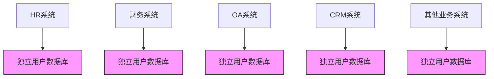

在企业数字化转型的过程中，身份管理成为了一个日益突出的痛点。传统的烟囱式系统架构、混乱的权限管理体系以及低下的运营效率，正在严重制约企业的发展。本文将深入分析这些痛点，并探讨其对业务的影响。

## 引言

随着企业业务的快速发展和数字化程度的不断提高，身份管理的复杂性也在急剧增加。许多企业在数字化转型过程中都面临着相似的挑战：系统越来越多，用户账户越来越分散，权限管理越来越混乱。这些问题不仅影响了用户体验，也给企业的安全和合规带来了巨大风险。

## 烟囱系统带来的身份管理困境

### 系统孤岛现象

在传统的企业IT架构中，各个业务系统往往独立建设，形成了一个个信息孤岛：



这种架构导致了以下问题：

1. **用户账户泛滥**：一个员工可能需要在5-10个甚至更多的系统中维护不同的账户
2. **密码管理困难**：用户需要记住多个不同的用户名和密码
3. **信息不一致**：同一用户在不同系统中的信息可能不一致
4. **管理成本高昂**：IT部门需要在多个系统中重复进行用户管理操作

### 技术债务累积

烟囱式系统架构还带来了技术债务的累积：

```java
// HR系统中的用户管理接口
public class HRUserManager {
    public void createUser(User user) {
        // HR系统特定的用户创建逻辑
        hrDatabase.save(user);
    }
    
    public void updateUser(User user) {
        // HR系统特定的用户更新逻辑
        hrDatabase.update(user);
    }
}

// 财务系统中的用户管理接口
public class FinanceUserManager {
    public void createUser(FinanceUser user) {
        // 财务系统特定的用户创建逻辑
        financeDatabase.save(user);
    }
    
    public void updateUser(FinanceUser user) {
        // 财务系统特定的用户更新逻辑
        financeDatabase.update(user);
    }
}

// 多个系统需要分别维护，增加了复杂性
```

## 权限管理混乱的现状

### 权限分散问题

在缺乏统一权限管理平台的情况下，权限管理呈现出以下特点：

1. **权限视图不统一**：无法全局查看某个用户在所有系统中的权限
2. **权限分配随意**：缺乏标准化的权限分配流程
3. **权限回收不及时**：员工离职或转岗后权限未能及时回收
4. **权限审计困难**：难以进行有效的权限合规性审计

### 权限膨胀现象

随着业务的发展，权限管理往往会出现"权限膨胀"现象：

```javascript
// 一个典型的权限膨胀示例
const userPermissions = {
  // 基础权限
  "read_profile": true,
  "edit_profile": true,
  
  // 系统特定权限
  "hr_read_salary": true,
  "finance_approve_expense": true,
  "crm_view_customer_data": true,
  "it_manage_servers": true,
  "marketing_send_emails": true,
  
  // 临时权限（未及时清理）
  "temp_project_x_access": true,
  "legacy_system_admin": true,
  "test_environment_full_access": true,
  
  // 过度授权
  "all_systems_read": true,
  "unrestricted_data_access": true
};

// 权限数量不断增长，但很多权限实际并不需要
```

## 运营效率低下的表现

### 用户体验问题

分散的身份管理严重影响了用户体验：

1. **登录繁琐**：用户需要记住多个系统的登录凭证
2. **密码疲劳**：频繁的密码重置和管理
3. **操作重复**：用户信息变更需要在多个系统中重复更新
4. **求助频繁**：用户经常需要联系IT部门解决登录问题

### 管理效率低下

IT管理部门也面临着效率低下的问题：

```python
# IT管理员的日常操作示例
class ITAdmin:
    def onboarding_new_employee(self, employee):
        # 在HR系统中创建账户
        hr_system.create_user(employee)
        
        # 在财务系统中创建账户
        finance_system.create_user(employee)
        
        # 在OA系统中创建账户
        oa_system.create_user(employee)
        
        # 在CRM系统中创建账户
        crm_system.create_user(employee)
        
        # 在其他5个系统中创建账户
        # ... 重复操作
        
        # 分配初始权限
        # ... 更多重复操作
    
    def employee_transfer(self, employee, new_department):
        # 更新HR系统中的信息
        hr_system.update_user(employee)
        
        # 更新财务系统中的权限
        finance_system.update_permissions(employee)
        
        # 更新OA系统中的信息
        oa_system.update_user(employee)
        
        # 在其他系统中进行相应更新
        # ... 更多重复操作
    
    def employee_offboarding(self, employee):
        # 在所有系统中禁用账户
        # ... 大量重复操作
        pass
```

### 成本持续增长

分散的身份管理导致了成本的持续增长：

1. **人力成本**：需要更多IT人员处理用户管理事务
2. **时间成本**：用户和管理员花费大量时间处理身份相关问题
3. **安全成本**：安全事件频发导致的损失和修复成本
4. **合规成本**：满足各种合规要求所需的额外投入

## 对业务的影响

### 安全风险增加

分散的身份管理增加了安全风险：

1. **密码泄露风险**：用户为了方便记忆，往往在多个系统中使用相同密码
2. **权限滥用风险**：过度授权和权限回收不及时导致的安全隐患
3. **内部威胁风险**：离职员工权限未及时回收可能造成的风险
4. **合规风险**：无法满足GDPR、等保2.0等法规的合规要求

### 业务效率下降

身份管理问题直接影响了业务效率：

1. **员工生产力下降**：频繁的登录问题和密码重置影响工作效率
2. **客户体验受损**：客户在使用多个相关服务时需要重复注册登录
3. **合作伙伴协作困难**：外部合作伙伴访问内部系统时面临复杂的认证流程
4. **创新受阻**：复杂的权限管理阻碍了新业务的快速上线

## 解决方案的方向

面对这些痛点，企业需要考虑以下解决方案：

1. **建立统一身份治理平台**：整合分散的用户管理系统
2. **实施单点登录(SSO)**：简化用户登录流程
3. **建立集中权限管理体系**：实现权限的统一管理和审计
4. **自动化用户生命周期管理**：通过与HR系统集成实现用户管理自动化
5. **引入多因子认证**：提高身份验证的安全性

## 总结

数字化转型过程中的身份管理痛点是企业普遍面临的问题。烟囱式系统架构、混乱的权限管理体系以及低下的运营效率不仅影响了用户体验，也给企业的安全和合规带来了巨大风险。只有通过建立统一身份治理平台，才能从根本上解决这些问题，为企业的数字化转型提供坚实的基础设施支撑。

在下一节中，我们将探讨统一身份治理平台的核心概念，包括IAM、4A、CIAM、SSO等关键术语的定义和区别。