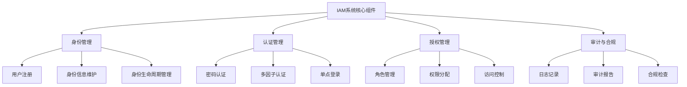
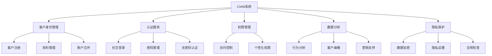
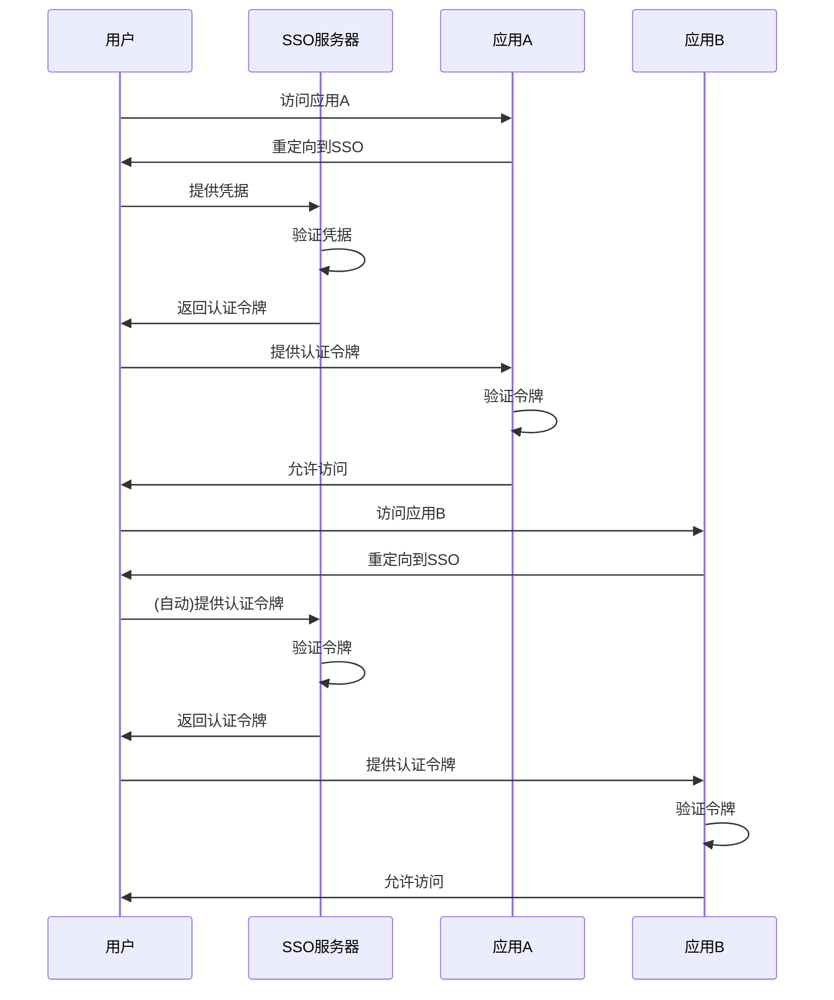

在深入探讨统一身份治理平台之前，我们需要明确一些核心概念的定义和区别。这些术语在业界经常被提及，但它们的含义和应用场景有所不同。本文将详细解释IAM、4A、CIAM、SSO和权限等核心概念，为后续章节的讨论奠定基础。

## 引言

身份与访问管理（Identity and Access Management, IAM）是现代企业IT架构中的重要组成部分。随着数字化转型的深入，相关概念和术语也越来越多，容易造成混淆。准确理解这些核心概念，有助于我们更好地设计和实施统一身份治理平台。

## IAM（Identity and Access Management）身份与访问管理

### 定义

IAM（Identity and Access Management，身份与访问管理）是一个综合性的概念，涵盖了数字身份的整个生命周期管理，包括身份的创建、维护、认证、授权和删除等过程。

### 核心功能

IAM系统通常包含以下核心功能：

1. **身份管理**：管理用户、设备、应用等数字身份的生命周期
2. **认证管理**：验证用户身份的真实性
3. **授权管理**：控制用户对资源的访问权限
4. **审计与合规**：记录和监控身份相关活动

### 架构示例



### 应用场景

IAM主要应用于企业内部员工的身份管理，典型场景包括：

1. 企业内部系统访问控制
2. 员工入职/离职流程自动化
3. 内部应用的单点登录
4. 员工权限的统一管理

## 4A（Account, Authentication, Authorization, Audit）账号、认证、授权、审计

### 定义

4A是中国信息化领域常用的概念，代表了身份管理的四个核心维度：

1. **Account（账号）**：统一账号管理
2. **Authentication（认证）**：统一认证管理
3. **Authorization（授权）**：统一授权管理
4. **Audit（审计）**：统一审计管理

### 4A架构详解

#### Account（账号管理）

账号管理是4A体系的基础，主要负责：

```java
public class AccountManagement {
    // 账号创建
    public Account createAccount(UserInfo userInfo) {
        Account account = new Account();
        account.setUsername(userInfo.getUsername());
        account.setEmail(userInfo.getEmail());
        account.setStatus(AccountStatus.ACTIVE);
        account.setCreateTime(new Date());
        
        // 存储账号信息
        accountRepository.save(account);
        
        // 记录审计日志
        auditLogger.log("ACCOUNT_CREATE", account.getId(), "Created new account");
        
        return account;
    }
    
    // 账号状态管理
    public void updateAccountStatus(String accountId, AccountStatus status) {
        Account account = accountRepository.findById(accountId);
        account.setStatus(status);
        account.setUpdateTime(new Date());
        
        accountRepository.update(account);
        
        // 记录审计日志
        auditLogger.log("ACCOUNT_STATUS_UPDATE", accountId, 
                       "Account status updated to " + status);
    }
}
```

#### Authentication（认证管理）

认证管理负责验证用户身份的真实性：

```javascript
class AuthenticationManager {
  // 多因子认证流程
  async authenticate(username, password, mfaToken) {
    try {
      // 1. 验证用户名密码
      const passwordValid = await this.verifyPassword(username, password);
      if (!passwordValid) {
        throw new AuthenticationError('Invalid credentials');
      }
      
      // 2. 检查是否需要MFA
      const requiresMFA = await this.checkMFARequirement(username);
      if (requiresMFA) {
        // 3. 验证MFA令牌
        const mfaValid = await this.verifyMFA(username, mfaToken);
        if (!mfaValid) {
          throw new AuthenticationError('Invalid MFA token');
        }
      }
      
      // 4. 创建会话
      const session = await this.createSession(username);
      
      // 5. 记录审计日志
      this.auditLogger.log({
        event: 'AUTHENTICATION_SUCCESS',
        user: username,
        timestamp: new Date(),
        ip: this.getClientIP()
      });
      
      return session;
    } catch (error) {
      // 记录失败日志
      this.auditLogger.log({
        event: 'AUTHENTICATION_FAILURE',
        user: username,
        error: error.message,
        timestamp: new Date(),
        ip: this.getClientIP()
      });
      
      throw error;
    }
  }
}
```

#### Authorization（授权管理）

授权管理控制用户对资源的访问权限：

```python
class AuthorizationManager:
    def check_permission(self, user_id, resource, action):
        """检查用户是否有指定资源的指定操作权限"""
        # 1. 获取用户角色
        user_roles = self.get_user_roles(user_id)
        
        # 2. 检查角色权限
        for role in user_roles:
            if self.role_has_permission(role, resource, action):
                return True
        
        # 3. 检查用户特殊权限
        if self.user_has_special_permission(user_id, resource, action):
            return True
        
        # 4. 检查基于属性的权限
        user_attributes = self.get_user_attributes(user_id)
        resource_attributes = self.get_resource_attributes(resource)
        
        if self.attribute_based_access_control(
            user_attributes, resource_attributes, action):
            return True
        
        return False
    
    def grant_permission(self, user_id, resource, action):
        """授予用户权限"""
        # 记录权限授予操作
        self.audit_log.log({
            'event': 'PERMISSION_GRANTED',
            'user_id': user_id,
            'resource': resource,
            'action': action,
            'timestamp': datetime.now()
        })
        
        # 实际授权逻辑
        self.permission_store.grant(user_id, resource, action)
```

#### Audit（审计管理）

审计管理记录和监控所有身份相关活动：

```sql
-- 审计日志表结构示例
CREATE TABLE audit_logs (
    id BIGINT PRIMARY KEY AUTO_INCREMENT,
    event_type VARCHAR(50) NOT NULL,
    user_id VARCHAR(50),
    resource VARCHAR(255),
    action VARCHAR(50),
    ip_address VARCHAR(45),
    user_agent TEXT,
    timestamp DATETIME DEFAULT CURRENT_TIMESTAMP,
    details JSON,
    
    INDEX idx_event_type (event_type),
    INDEX idx_user_id (user_id),
    INDEX idx_timestamp (timestamp)
);

-- 典型审计查询
SELECT * FROM audit_logs 
WHERE user_id = 'user123' 
  AND event_type IN ('LOGIN_SUCCESS', 'LOGIN_FAILURE')
  AND timestamp >= DATE_SUB(NOW(), INTERVAL 30 DAY)
ORDER BY timestamp DESC;
```

### 4A与IAM的关系

4A可以看作是IAM在中国信息化环境下的具体实现框架，两者在本质上是一致的，都关注身份管理的全生命周期。

## CIAM（Customer Identity and Access Management）客户身份与访问管理

### 定义

CIAM（Customer Identity and Access Management，客户身份与访问管理）专门针对外部客户的身份管理需求，与面向内部员工的IAM有所区别。

### 核心特征

CIAM系统具有以下核心特征：

1. **大规模用户支持**：需要支持数百万甚至数亿的客户用户
2. **社交登录集成**：支持微信、QQ、微博、Google、Facebook等社交账号登录
3. **个性化体验**：根据客户偏好提供个性化服务
4. **隐私保护**：严格遵守GDPR等隐私保护法规
5. **营销支持**：支持客户画像和精准营销

### CIAM架构示例



### CIAM与IAM的区别

| 特性 | IAM | CIAM |
|------|-----|------|
| 用户类型 | 内部员工 | 外部客户 |
| 用户规模 | 数千到数万 | 数百万到数亿 |
| 认证方式 | 企业账号、LDAP | 社交登录、手机号 |
| 权限模型 | 基于角色 | 基于属性、个性化 |
| 隐私要求 | 企业内部 | 严格隐私保护 |
| 主要目标 | 安全、合规 | 体验、转化 |

## SSO（Single Sign-On）单点登录

### 定义

SSO（Single Sign-On，单点登录）是一种身份验证服务，允许用户使用一组登录凭据访问多个相关但独立的软件系统。

### 工作原理

SSO的基本工作原理如下：



### SSO实现技术

常见的SSO实现技术包括：

1. **SAML 2.0**：基于XML的标准协议
2. **OAuth 2.0**：授权框架
3. **OpenID Connect**：基于OAuth 2.0的身份认证层

### SSO的优势

1. **用户体验提升**：一次登录访问所有应用
2. **安全管理**：集中化的身份验证和授权
3. **成本降低**：减少密码重置等支持成本
4. **合规支持**：统一的审计和合规管理

## 权限（Permission/Authorization）

### 定义

权限是指用户或系统实体执行特定操作或访问特定资源的能力。权限管理是访问控制的核心组成部分。

### 权限模型

#### RBAC（Role-Based Access Control）基于角色的访问控制

```java
public class RBACModel {
    // 角色实体
    public class Role {
        private String roleId;
        private String roleName;
        private Set<Permission> permissions;
    }
    
    // 权限实体
    public class Permission {
        private String permissionId;
        private String resource;
        private String action;
    }
    
    // 用户实体
    public class User {
        private String userId;
        private String username;
        private Set<Role> roles;
    }
    
    // 权限检查
    public boolean checkPermission(String userId, String resource, String action) {
        User user = getUserById(userId);
        
        // 检查用户所有角色的权限
        for (Role role : user.getRoles()) {
            for (Permission permission : role.getPermissions()) {
                if (permission.getResource().equals(resource) && 
                    permission.getAction().equals(action)) {
                    return true;
                }
            }
        }
        
        return false;
    }
}
```

#### ABAC（Attribute-Based Access Control）基于属性的访问控制

```python
class ABACModel:
    def evaluate_policy(self, user_attributes, resource_attributes, action, environment):
        """基于属性的策略评估"""
        # 示例策略：只有部门为"IT"且职级大于等于3的员工才能访问服务器资源
        if (user_attributes.get('department') == 'IT' and 
            user_attributes.get('level', 0) >= 3 and
            resource_attributes.get('type') == 'server'):
            return True
        
        # 示例策略：工作时间才能访问特定资源
        current_hour = datetime.now().hour
        if (resource_attributes.get('work_hours_only') and 
            (current_hour < 9 or current_hour > 18)):
            return False
        
        return False
```

### 权限管理的最佳实践

1. **最小权限原则**：只授予用户完成工作所需的最小权限
2. **权限分离**：敏感操作需要多人协作完成
3. **定期审查**：定期审查和清理不必要的权限
4. **自动化管理**：通过工作流自动化权限分配和回收

## 总结

理解这些核心概念对于设计和实施统一身份治理平台至关重要：

1. **IAM**是总体框架，涵盖了身份管理的各个方面
2. **4A**是IAM在中国环境下的具体实现模型
3. **CIAM**专注于外部客户的身份管理需求
4. **SSO**是实现统一认证的关键技术
5. **权限管理**是访问控制的核心机制

在实际应用中，这些概念往往相互关联，需要综合考虑。在后续章节中，我们将基于这些概念，深入探讨统一身份治理平台的设计和实现细节。

通过准确理解这些核心概念，我们可以更好地规划和实施符合企业需求的身份治理解决方案，为数字化转型提供坚实的基础。