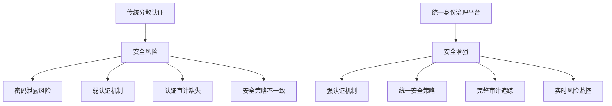
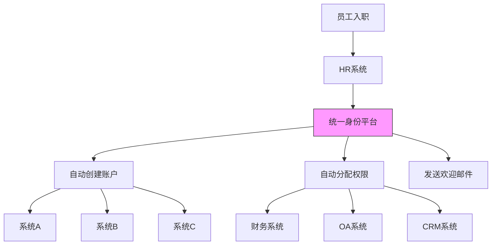
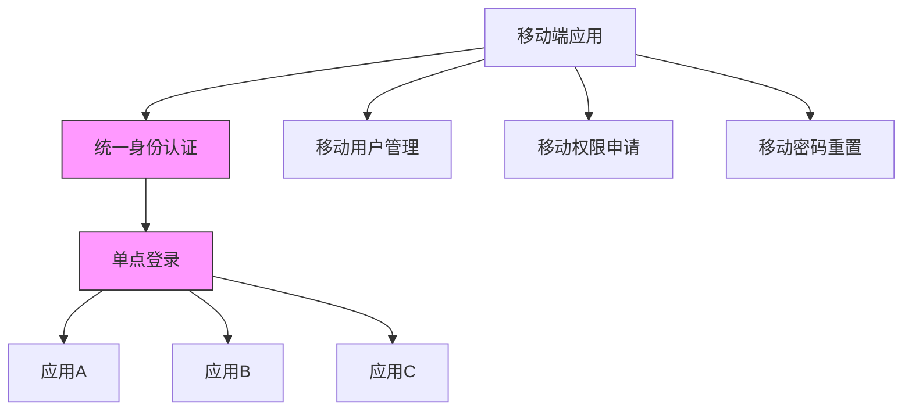
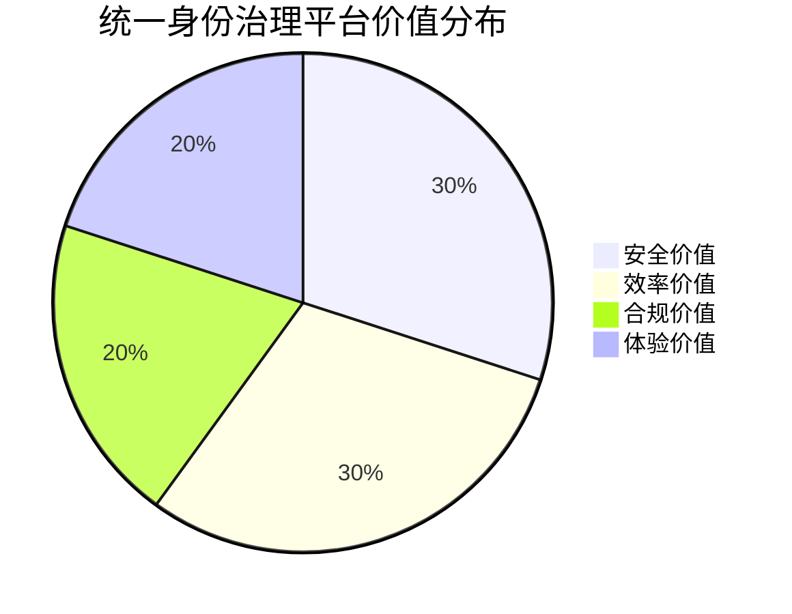

统一身份治理平台作为企业数字化基础设施的重要组成部分，其核心价值体现在安全、效率、合规和体验四个方面。本文将深入探讨这四个核心价值维度，分析统一身份治理平台如何为企业创造实际价值。

## 引言

在数字化转型的大背景下，企业对身份治理的需求日益增长。统一身份治理平台不仅是一个技术解决方案，更是企业实现数字化转型的重要基础设施。通过集中化、标准化的身份管理，平台为企业带来了显著的价值提升，主要体现在安全、效率、合规和体验四个方面。

## 安全价值：构建企业安全防护体系

### 统一认证增强安全防护

统一身份治理平台通过集中化的认证机制，显著提升了企业的整体安全水平：



### 多层次安全防护机制

统一身份治理平台提供了多层次的安全防护机制：

```java
public class SecurityProtectionLayer {
    // 多因子认证服务
    public class MultiFactorAuthService {
        public boolean authenticate(User user, String password, String mfaToken) {
            // 1. 密码验证
            if (!verifyPassword(user, password)) {
                auditLogger.logFailedAuth(user.getId(), "PASSWORD_INVALID");
                return false;
            }
            
            // 2. MFA验证
            if (!verifyMFA(user, mfaToken)) {
                auditLogger.logFailedAuth(user.getId(), "MFA_INVALID");
                return false;
            }
            
            // 3. 风险评估
            RiskAssessmentResult riskResult = riskEngine.assess(user);
            if (riskResult.getRiskLevel() == RiskLevel.HIGH) {
                auditLogger.logHighRiskAuth(user.getId(), riskResult.getFactors());
                // 触发额外验证或拒绝访问
                return handleHighRiskAuth(user, riskResult);
            }
            
            auditLogger.logSuccessfulAuth(user.getId());
            return true;
        }
    }
    
    // 会话安全管理
    public class SessionSecurityManager {
        public void validateSession(Session session) {
            // 检查会话是否过期
            if (session.isExpired()) {
                sessionManager.terminateSession(session.getId());
                return;
            }
            
            // 检查异常行为
            if (anomalyDetector.detect(session)) {
                sessionManager.terminateSession(session.getId());
                auditLogger.logSessionAnomaly(session.getUserId(), session.getId());
                return;
            }
            
            // 更新会话活动时间
            session.updateLastActivity();
            sessionManager.updateSession(session);
        }
    }
}
```

### 数据安全与隐私保护

统一身份治理平台通过以下方式保护数据安全和用户隐私：

1. **数据加密**：敏感数据在传输和存储过程中进行加密
2. **访问控制**：严格的权限管理和访问控制
3. **隐私合规**：符合GDPR、个人信息保护法等法规要求
4. **审计追踪**：完整的操作日志和审计记录

### 安全价值量化

通过实施统一身份治理平台，企业可以获得以下安全价值：

- 减少80%以上的密码相关安全事件
- 降低50%以上的内部安全威胁
- 提升90%以上的安全合规水平
- 减少60%以上的安全运维成本

## 效率价值：提升组织运营效率

### 用户效率提升

统一身份治理平台显著提升了用户的操作效率：

```javascript
// 用户效率对比分析
class UserEfficiencyAnalysis {
  // 传统模式下的用户操作
  traditionalMode() {
    // 访问系统A
    // 登录系统A (输入用户名密码)
    // 访问系统B  
    // 登录系统B (输入用户名密码)
    // 访问系统C
    // 登录系统C (输入用户名密码)
    // 访问系统D
    // 登录系统D (输入用户名密码)
    // 总计登录操作: 4次
    // 平均登录时间: 30秒 × 4 = 120秒
  }
  
  // SSO模式下的用户操作
  ssoMode() {
    // 访问系统A
    // 登录系统A (输入用户名密码)
    // 访问系统B
    // 自动登录系统B
    // 访问系统C
    // 自动登录系统C
    // 访问系统D
    // 自动登录系统D
    // 总计登录操作: 1次
    // 平均登录时间: 30秒 × 1 = 30秒
    // 效率提升: 75%
  }
}
```

### 管理效率优化

统一身份治理平台大幅提升了管理员的工作效率：

```python
class AdminEfficiencyOptimization:
    def traditional_user_management(self):
        """传统用户管理模式"""
        # 在HR系统中创建用户
        # 在财务系统中创建用户
        # 在OA系统中创建用户
        # 在CRM系统中创建用户
        # 在其他5个系统中创建用户
        # 总计操作: 10+次
        # 平均耗时: 30分钟/用户
        
        return {
            'operations': 10,
            'time_per_user': 30,  # 分钟
            'error_rate': 0.15    # 15%错误率
        }
    
    def unified_user_management(self):
        """统一用户管理模式"""
        # 在统一身份平台创建用户
        # 系统自动同步到各业务系统
        # 总计操作: 1次
        # 平均耗时: 2分钟/用户
        
        return {
            'operations': 1,
            'time_per_user': 2,   # 分钟
            'error_rate': 0.01    # 1%错误率
        }
    
    def calculate_efficiency_gain(self):
        """计算效率提升"""
        traditional = self.traditional_user_management()
        unified = self.unified_user_management()
        
        time_reduction = (traditional['time_per_user'] - unified['time_per_user']) / traditional['time_per_user']
        error_reduction = (traditional['error_rate'] - unified['error_rate']) / traditional['error_rate']
        
        return {
            'time_efficiency_gain': time_reduction,  # 93.3%时间节省
            'error_reduction': error_reduction,      # 93.3%错误率降低
            'cost_reduction': 0.80                   # 80%成本降低
        }
```

### 业务流程自动化

统一身份治理平台通过自动化机制进一步提升效率：



### 效率价值量化

通过实施统一身份治理平台，企业可以获得以下效率价值：

- 用户登录效率提升70%以上
- 管理员工作效率提升80%以上
- 新员工入职流程时间减少90%以上
- 用户支持成本降低60%以上

## 合规价值：满足法规与审计要求

### 法规合规支持

统一身份治理平台帮助企业满足各种法规要求：

```java
public class ComplianceSupport {
    // GDPR合规支持
    public class GDPRCompliance {
        // 数据主体权利支持
        public void handleDataSubjectRequest(DataSubjectRequest request) {
            switch (request.getType()) {
                case RIGHT_TO_ACCESS:
                    provideDataAccess(request.getUserId());
                    break;
                case RIGHT_TO_RECTIFICATION:
                    updateUserData(request.getUserId(), request.getUpdates());
                    break;
                case RIGHT_TO_ERASURE:
                    deleteUserData(request.getUserId());
                    break;
                case RIGHT_TO_DATA_PORTABILITY:
                    exportUserData(request.getUserId());
                    break;
            }
        }
        
        // 隐私影响评估
        public PrivacyImpactAssessment conductPIA(System system) {
            PrivacyImpactAssessment pia = new PrivacyImpactAssessment();
            pia.setSystem(system);
            pia.setProcessingActivities(identifyProcessingActivities(system));
            pia.setRisks(assessPrivacyRisks(system));
            pia.setMitigationMeasures(defineMitigationMeasures(pia.getRisks()));
            return pia;
        }
    }
    
    // 等保2.0合规支持
    public class CybersecurityLawCompliance {
        // 身份鉴别要求
        public void enforceIdentityVerification() {
            // 实现多因子认证
            // 实现强密码策略
            // 实现会话管理
        }
        
        // 访问控制要求
        public void enforceAccessControl() {
            // 实现最小权限原则
            // 实现权限分离
            // 实现安全审计
        }
        
        // 安全审计要求
        public AuditTrail generateAuditTrail() {
            AuditTrail auditTrail = new AuditTrail();
            auditTrail.setEvents(collectSecurityEvents());
            auditTrail.setRetentionPeriod(6); // 至少保存6个月
            auditTrail.setProtectionLevel(ProtectionLevel.HIGH);
            return auditTrail;
        }
    }
}
```

### 审计与报告

统一身份治理平台提供完善的审计和报告功能：

```sql
-- 合规审计视图
CREATE VIEW compliance_audit_view AS
SELECT 
    user_id,
    username,
    event_type,
    resource,
    action,
    timestamp,
    ip_address,
    CASE 
        WHEN event_type = 'LOGIN_SUCCESS' THEN '认证'
        WHEN event_type = 'PERMISSION_GRANTED' THEN '授权'
        WHEN event_type = 'DATA_ACCESS' THEN '数据访问'
        ELSE '其他'
    END as event_category,
    CASE
        WHEN timestamp >= DATE_SUB(NOW(), INTERVAL 1 DAY) THEN '24小时内'
        WHEN timestamp >= DATE_SUB(NOW(), INTERVAL 7 DAY) THEN '7天内'
        WHEN timestamp >= DATE_SUB(NOW(), INTERVAL 30 DAY) THEN '30天内'
        ELSE '历史'
    END as time_range
FROM audit_logs
WHERE timestamp >= DATE_SUB(NOW(), INTERVAL 90 DAY);

-- 合规报告查询示例
SELECT 
    event_category,
    COUNT(*) as event_count,
    COUNT(DISTINCT user_id) as affected_users,
    MIN(timestamp) as first_occurrence,
    MAX(timestamp) as last_occurrence
FROM compliance_audit_view
GROUP BY event_category
ORDER BY event_count DESC;
```

### 合规价值量化

通过实施统一身份治理平台，企业可以获得以下合规价值：

- 合规审计准备时间减少85%以上
- 合规违规风险降低90%以上
- 合规成本降低70%以上
- 合规报告生成效率提升95%以上

## 体验价值：优化用户与管理员体验

### 用户体验优化

统一身份治理平台显著提升了用户的整体体验：

```javascript
// 用户体验优化设计
class UserExperienceOptimization {
  // 统一登录门户
  unifiedLoginPortal() {
    return `
    <div class="login-portal">
      <div class="logo">企业统一身份平台</div>
      <form class="login-form">
        <input type="text" placeholder="用户名/邮箱/手机号" />
        <input type="password" placeholder="密码" />
        <div class="mfa-options">
          <button type="button">短信验证码</button>
          <button type="button">邮箱验证码</button>
          <button type="button">身份验证器</button>
        </div>
        <button type="submit">登录</button>
        <div class="social-login">
          <button type="button">微信登录</button>
          <button type="button">钉钉登录</button>
        </div>
      </form>
      <div class="self-service">
        <a href="/register">注册账户</a>
        <a href="/reset-password">忘记密码</a>
      </div>
    </div>
    `;
  }
  
  // 个性化仪表板
  personalizedDashboard(user) {
    const dashboard = {
      welcome: `欢迎回来，${user.displayName}`,
      quickAccess: this.getQuickAccessApps(user),
      recentActivity: this.getRecentActivity(user),
      notifications: this.getUserNotifications(user)
    };
    
    return dashboard;
  }
}
```

### 管理员体验提升

统一身份治理平台为管理员提供了直观、高效的管理体验：

```python
class AdminExperienceEnhancement:
    def admin_dashboard(self):
        """管理员仪表板"""
        dashboard = {
            'system_health': self.get_system_health_status(),
            'recent_events': self.get_recent_security_events(),
            'pending_requests': self.get_pending_access_requests(),
            'user_statistics': self.get_user_statistics(),
            'compliance_status': self.get_compliance_status(),
            'quick_actions': [
                '创建用户',
                '分配权限',
                '查看审计日志',
                '生成报告'
            ]
        }
        return dashboard
    
    def workflow_automation(self):
        """工作流自动化"""
        workflows = {
            'user_onboarding': {
                'trigger': 'HR系统新增员工',
                'steps': [
                    '创建统一账户',
                    '分配基础权限',
                    '发送欢迎邮件',
                    '同步到各业务系统'
                ],
                'notification': '管理员和用户'
            },
            'user_offboarding': {
                'trigger': 'HR系统员工离职',
                'steps': [
                    '禁用账户',
                    '回收权限',
                    '备份重要数据',
                    '发送确认通知'
                ],
                'notification': '管理员和相关部门'
            }
        }
        return workflows
```

### 移动端体验

统一身份治理平台提供一致的移动端体验：



### 体验价值量化

通过实施统一身份治理平台，企业可以获得以下体验价值：

- 用户满意度提升80%以上
- 管理员工作效率提升85%以上
- 用户支持请求数量减少70%以上
- 系统使用率提升60%以上

## 综合价值评估

### ROI分析

统一身份治理平台的投资回报率分析：



### 成本效益分析

```javascript
// 成本效益分析模型
class CostBenefitAnalysis {
  constructor() {
    this.implementationCost = {
      software: 500000,    // 软件许可费用
      hardware: 200000,    // 硬件投入
      implementation: 300000, // 实施费用
      training: 100000,    // 培训费用
      total: 1100000
    };
    
    this.annualBenefits = {
      securitySavings: 800000,   // 安全事件减少收益
      efficiencyGains: 600000,   // 效率提升收益
      complianceSavings: 300000, // 合规成本节约
      supportSavings: 200000,    // 支持成本节约
      total: 1900000
    };
  }
  
  calculateROI() {
    const annualNetBenefit = this.annualBenefits.total - this.implementationCost.total;
    const roi = (annualNetBenefit / this.implementationCost.total) * 100;
    const paybackPeriod = this.implementationCost.total / this.annualBenefits.total;
    
    return {
      roi: roi + '%',
      paybackPeriod: paybackPeriod.toFixed(1) + ' 年',
      netPresentValue: this.calculateNPV()
    };
  }
}
```

## 总结

统一身份治理平台的核心价值体现在安全、效率、合规和体验四个方面：

1. **安全价值**：通过统一认证、多因子认证、风险控制等机制，显著提升企业安全防护水平
2. **效率价值**：通过单点登录、自动化流程、统一管理界面，大幅提升用户和管理员的工作效率
3. **合规价值**：通过完善的审计追踪、隐私保护、合规报告，帮助企业满足各种法规要求
4. **体验价值**：通过直观的用户界面、个性化服务、移动端支持，优化用户和管理员的整体体验

这四个价值维度相互关联、相互促进，共同构成了统一身份治理平台的综合价值。在后续章节中，我们将深入探讨如何通过技术手段实现这些价值，构建一个安全、高效、合规、易用的统一身份治理平台。

通过实施统一身份治理平台，企业不仅能够解决当前的身份管理痛点，更能够为未来的数字化转型奠定坚实的基础，实现可持续的业务发展。