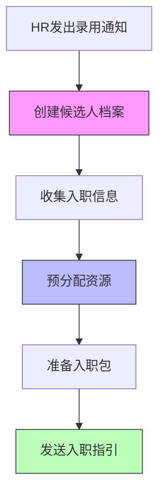
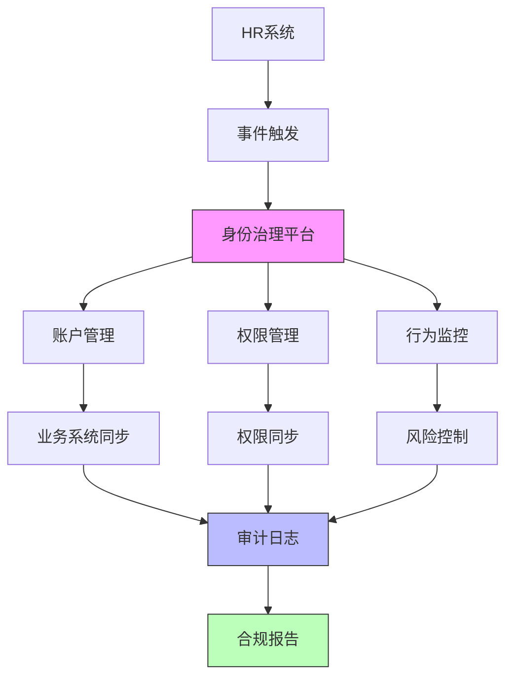

在统一身份治理平台中，"全生命周期"管理是一个核心概念，它涵盖了用户身份从创建到销毁的完整过程。本文将深入探讨用户身份的全生命周期管理，分析从账号创建、权限授予到离职回收的各个环节，以及如何构建一个完整的管理闭环。

## 引言

用户身份的全生命周期管理是统一身份治理平台的核心功能之一。它不仅仅是简单的账户管理，而是一个涵盖用户从进入组织到离开组织全过程的系统性管理。通过建立完善的全生命周期管理体系，企业可以确保身份管理的安全性、合规性和效率性。

## 全生命周期管理框架

### 生命周期阶段划分

用户身份的全生命周期可以划分为以下几个主要阶段：


### 生命周期管理架构

全生命周期管理需要一个完整的架构支撑：

```java
public class IdentityLifecycleManagement {
    // 生命周期状态枚举
    public enum LifecycleState {
        PRE_ONBOARDING,    // 入职前
        ONBOARDING,        // 入职中
        ACTIVE,            // 在职
        SUSPENDED,         // 暂停
        OFFBOARDING,       // 离职中
        TERMINATED         // 已离职
    }
    
    // 生命周期事件
    public enum LifecycleEvent {
        HIRED,             // 入职
        TRANSFERRED,       // 转岗
        PROMOTED,          // 晋升
        SUSPENDED,         // 暂停
        REINSTATED,        // 恢复
        TERMINATED         // 离职
    }
    
    // 生命周期管理器
    private final LifecycleManager lifecycleManager;
    private final EventPublisher eventPublisher;
    private final AuditLogger auditLogger;
}
```

## 入职前阶段（Pre-onboarding）

### 候选人信息管理

在正式入职前，企业需要对候选人信息进行管理：

```javascript
// 候选人信息管理系统
class CandidateManagement {
  // 创建候选人档案
  async createCandidateProfile(candidateData) {
    try {
      // 验证候选人信息
      const validation = await this.validateCandidateData(candidateData);
      if (!validation.isValid) {
        throw new Error('Invalid candidate data: ' + validation.errors.join(', '));
      }
      
      // 创建候选人档案
      const candidate = {
        id: this.generateCandidateId(),
        name: candidateData.name,
        email: candidateData.email,
        phone: candidateData.phone,
        position: candidateData.position,
        department: candidateData.department,
        hireDate: candidateData.hireDate,
        status: 'PENDING',
        createdAt: new Date(),
        createdBy: 'HR_SYSTEM'
      };
      
      // 存储候选人信息
      await this.candidateStore.save(candidate);
      
      // 记录审计日志
      this.auditLogger.log({
        event: 'CANDIDATE_CREATED',
        candidateId: candidate.id,
        timestamp: new Date(),
        details: { name: candidate.name, position: candidate.position }
      });
      
      return candidate;
    } catch (error) {
      this.auditLogger.log({
        event: 'CANDIDATE_CREATION_FAILED',
        error: error.message,
        timestamp: new Date(),
        details: candidateData
      });
      throw error;
    }
  }
  
  // 预分配资源
  async preAllocateResources(candidateId) {
    try {
      const candidate = await this.candidateStore.findById(candidateId);
      
      // 预分配邮箱账户
      const emailAccount = await this.emailService.provisionAccount({
        username: this.generateUsername(candidate.name),
        email: this.generateEmail(candidate.name),
        displayName: candidate.name
      });
      
      // 预分配基础权限
      const basePermissions = await this.permissionService.getBasePermissions(
        candidate.position, 
        candidate.department
      );
      
      // 记录预分配信息
      await this.resourceAllocationStore.save({
        candidateId: candidateId,
        emailAccount: emailAccount,
        basePermissions: basePermissions,
        status: 'PRE_ALLOCATED',
        allocatedAt: new Date()
      });
      
      return { emailAccount, basePermissions };
    } catch (error) {
      this.auditLogger.log({
        event: 'RESOURCE_PRE_ALLOCATION_FAILED',
        candidateId: candidateId,
        error: error.message,
        timestamp: new Date()
      });
      throw error;
    }
  }
}
```

### 入职准备流程



## 入职阶段（Onboarding）

### 自动化入职流程

入职阶段是全生命周期管理的关键起点，需要实现高度自动化：

```python
class OnboardingAutomation:
    def __init__(self):
        self.hr_system = HRSystem()
        self.identity_platform = IdentityPlatform()
        self.application_systems = ApplicationSystems()
        self.notification_service = NotificationService()
    
    def process_new_hire(self, employee_data):
        """处理新员工入职"""
        try:
            # 1. 验证员工数据
            self.validate_employee_data(employee_data)
            
            # 2. 在身份平台创建账户
            user_account = self.identity_platform.create_user(employee_data)
            
            # 3. 分配基础权限
            base_permissions = self.assign_base_permissions(
                user_account.id, 
                employee_data.position,
                employee_data.department
            )
            
            # 4. 同步到各业务系统
            self.sync_to_systems(user_account, employee_data)
            
            # 5. 发送欢迎信息
            self.send_welcome_package(user_account, employee_data)
            
            # 6. 记录审计日志
            self.audit_logger.log({
                'event': 'EMPLOYEE_ONBOARDED',
                'user_id': user_account.id,
                'employee_id': employee_data.employee_id,
                'timestamp': datetime.now(),
                'details': {
                    'name': employee_data.name,
                    'position': employee_data.position,
                    'department': employee_data.department
                }
            })
            
            return user_account
        except Exception as e:
            self.audit_logger.log({
                'event': 'ONBOARDING_FAILED',
                'employee_id': employee_data.employee_id,
                'error': str(e),
                'timestamp': datetime.now()
            })
            raise e
    
    def assign_base_permissions(self, user_id, position, department):
        """分配基础权限"""
        # 根据职位和部门确定基础权限
        role_mapping = self.get_role_mapping(position, department)
        permissions = []
        
        for role in role_mapping:
            # 分配角色
            self.identity_platform.assign_role(user_id, role)
            # 获取角色权限
            role_permissions = self.identity_platform.get_role_permissions(role)
            permissions.extend(role_permissions)
        
        return permissions
    
    def sync_to_systems(self, user_account, employee_data):
        """同步到各业务系统"""
        systems = [
            'email_system',
            'hr_system',
            'finance_system',
            'oa_system',
            'crm_system'
        ]
        
        for system in systems:
            try:
                self.application_systems.create_user(
                    system, 
                    user_account, 
                    employee_data
                )
            except Exception as e:
                self.audit_logger.log({
                    'event': 'SYSTEM_SYNC_FAILED',
                    'system': system,
                    'user_id': user_account.id,
                    'error': str(e),
                    'timestamp': datetime.now()
                })
```

### 入职流程监控

```sql
-- 入职流程监控视图
CREATE VIEW onboarding_process_monitor AS
SELECT 
    e.employee_id,
    e.name,
    e.hire_date,
    CASE 
        WHEN ia.account_created IS NOT NULL THEN '账户已创建'
        ELSE '待创建账户'
    END as account_status,
    CASE 
        WHEN ia.permissions_assigned IS NOT NULL THEN '权限已分配'
        ELSE '待分配权限'
    END as permission_status,
    CASE 
        WHEN ia.systems_synced = 5 THEN '系统同步完成'
        ELSE CONCAT('系统同步中(', ia.systems_synced, '/5)')
    END as sync_status,
    CASE 
        WHEN ia.welcome_sent IS NOT NULL THEN '已发送欢迎包'
        ELSE '待发送欢迎包'
    END as welcome_status,
    TIMESTAMPDIFF(HOUR, e.hire_date, NOW()) as hours_since_hire
FROM employees e
LEFT JOIN identity_accounts ia ON e.employee_id = ia.employee_id
WHERE e.status = 'ACTIVE' 
  AND e.hire_date >= DATE_SUB(NOW(), INTERVAL 30 DAY);
```

## 在职阶段（Active）

### 权限动态管理

在职阶段需要持续管理用户的权限变化：

```java
public class ActiveLifecycleManagement {
    private final PermissionManager permissionManager;
    private final RoleManager roleManager;
    private final AuditLogger auditLogger;
    
    // 处理员工转岗
    public void handleEmployeeTransfer(String userId, TransferRequest request) {
        try {
            // 1. 验证转岗请求
            validateTransferRequest(request);
            
            // 2. 记录转岗前状态
            User currentUser = userManager.getUserById(userId);
            Set<Role> oldRoles = currentUser.getRoles();
            
            // 3. 更新用户信息
            userManager.updateUserDepartment(userId, request.getNewDepartment());
            userManager.updateUserPosition(userId, request.getNewPosition());
            
            // 4. 回收旧权限
            for (Role oldRole : oldRoles) {
                roleManager.removeUserRole(userId, oldRole.getId());
            }
            
            // 5. 分配新权限
            List<Role> newRoles = determineNewRoles(request.getNewPosition(), 
                                                  request.getNewDepartment());
            for (Role newRole : newRoles) {
                roleManager.assignUserRole(userId, newRole.getId());
            }
            
            // 6. 同步到业务系统
            syncToSystems(userId, request);
            
            // 7. 记录审计日志
            auditLogger.logTransferEvent(userId, currentUser, request);
            
        } catch (Exception e) {
            auditLogger.logError("TRANSFER_FAILED", userId, e.getMessage());
            throw new LifecycleManagementException("Failed to handle employee transfer", e);
        }
    }
    
    // 定期权限审查
    public void conductPeriodicReview(String userId) {
        try {
            User user = userManager.getUserById(userId);
            Set<Permission> currentPermissions = permissionManager.getUserPermissions(userId);
            
            // 与职位要求权限对比
            Set<Permission> requiredPermissions = getRequiredPermissions(
                user.getPosition(), 
                user.getDepartment()
            );
            
            // 识别多余权限
            Set<Permission> excessPermissions = Sets.difference(
                currentPermissions, 
                requiredPermissions
            );
            
            // 识别缺失权限
            Set<Permission> missingPermissions = Sets.difference(
                requiredPermissions, 
                currentPermissions
            );
            
            // 记录审查结果
            auditLogger.logReviewResult(userId, excessPermissions, missingPermissions);
            
            // 自动处理（根据策略）
            if (excessPermissions.size() > 0) {
                permissionManager.revokeExcessPermissions(userId, excessPermissions);
            }
            
            if (missingPermissions.size() > 0) {
                permissionManager.grantMissingPermissions(userId, missingPermissions);
            }
            
        } catch (Exception e) {
            auditLogger.logError("PERIODIC_REVIEW_FAILED", userId, e.getMessage());
        }
    }
}
```

### 行为监控与风险控制

```javascript
// 在职期间行为监控
class BehaviorMonitoring {
  constructor() {
    this.riskEngine = new RiskEngine();
    this.anomalyDetector = new AnomalyDetector();
    this.notificationService = new NotificationService();
  }
  
  // 实时行为分析
  async analyzeUserBehavior(userId, action) {
    try {
      // 1. 记录用户行为
      const behaviorRecord = await this.recordUserBehavior(userId, action);
      
      // 2. 风险评估
      const riskScore = await this.riskEngine.assess(behaviorRecord);
      
      // 3. 异常检测
      const isAnomaly = await this.anomalyDetector.detect(behaviorRecord);
      
      // 4. 根据风险等级采取措施
      if (riskScore > 0.8 || isAnomaly) {
        await this.handleHighRiskBehavior(userId, behaviorRecord, riskScore);
      } else if (riskScore > 0.5) {
        await this.handleMediumRiskBehavior(userId, behaviorRecord, riskScore);
      }
      
      return { riskScore, isAnomaly };
    } catch (error) {
      this.auditLogger.log({
        event: 'BEHAVIOR_ANALYSIS_FAILED',
        userId: userId,
        error: error.message,
        timestamp: new Date()
      });
      throw error;
    }
  }
  
  // 处理高风险行为
  async handleHighRiskBehavior(userId, behavior, riskScore) {
    // 1. 立即通知安全团队
    await this.notificationService.notifySecurityTeam({
      userId: userId,
      behavior: behavior,
      riskScore: riskScore,
      priority: 'HIGH'
    });
    
    // 2. 临时限制账户权限
    await this.permissionManager.temporarilyRestrictAccess(userId);
    
    // 3. 要求重新认证
    await this.authManager.requestReAuthentication(userId);
    
    // 4. 记录安全事件
    this.auditLogger.log({
      event: 'HIGH_RISK_BEHAVIOR_DETECTED',
      userId: userId,
      behavior: behavior,
      riskScore: riskScore,
      actionTaken: 'ACCESS_RESTRICTED_AND_REAUTH_REQUIRED',
      timestamp: new Date()
    });
  }
}
```

## 离职阶段（Offboarding）

### 自动化离职流程

离职阶段需要确保及时回收所有权限和资源：

```python
class OffboardingAutomation:
    def __init__(self):
        self.hr_system = HRSystem()
        self.identity_platform = IdentityPlatform()
        self.application_systems = ApplicationSystems()
        self.audit_logger = AuditLogger()
    
    def process_employee_termination(self, employee_id, termination_data):
        """处理员工离职"""
        try:
            # 1. 验证离职数据
            self.validate_termination_data(termination_data)
            
            # 2. 获取用户信息
            user = self.identity_platform.get_user_by_employee_id(employee_id)
            
            # 3. 记录离职前状态
            pre_termination_state = self.record_pre_termination_state(user.id)
            
            # 4. 禁用账户
            self.identity_platform.disable_user_account(user.id)
            
            # 5. 回收所有权限
            self.revoke_all_permissions(user.id)
            
            # 6. 从各业务系统移除
            self.remove_from_systems(user.id, employee_id)
            
            # 7. 数据备份和归档
            self.backup_user_data(user.id, employee_id)
            
            # 8. 记录审计日志
            self.audit_logger.log({
                'event': 'EMPLOYEE_OFFBOARDED',
                'user_id': user.id,
                'employee_id': employee_id,
                'termination_date': termination_data.termination_date,
                'reason': termination_data.reason,
                'pre_termination_state': pre_termination_state,
                'timestamp': datetime.now()
            })
            
            return {
                'status': 'SUCCESS',
                'user_id': user.id,
                'actions_taken': [
                    'ACCOUNT_DISABLED',
                    'PERMISSIONS_REVOKED',
                    'SYSTEMS_REMOVED',
                    'DATA_BACKED_UP'
                ]
            }
        except Exception as e:
            self.audit_logger.log({
                'event': 'OFFBOARDING_FAILED',
                'employee_id': employee_id,
                'error': str(e),
                'timestamp': datetime.now()
            })
            raise e
    
    def revoke_all_permissions(self, user_id):
        """回收所有权限"""
        try:
            # 1. 获取用户所有角色
            user_roles = self.identity_platform.get_user_roles(user_id)
            
            # 2. 移除所有角色
            for role in user_roles:
                self.identity_platform.remove_user_role(user_id, role.id)
            
            # 3. 获取用户特殊权限
            special_permissions = self.identity_platform.get_user_special_permissions(user_id)
            
            # 4. 回收特殊权限
            for permission in special_permissions:
                self.identity_platform.revoke_permission(user_id, permission.id)
            
            # 5. 记录权限回收日志
            self.audit_logger.log({
                'event': 'PERMISSIONS_REVOKED',
                'user_id': user_id,
                'roles_revoked': len(user_roles),
                'special_permissions_revoked': len(special_permissions),
                'timestamp': datetime.now()
            })
        except Exception as e:
            self.audit_logger.log({
                'event': 'PERMISSION_REVOCATION_FAILED',
                'user_id': user_id,
                'error': str(e),
                'timestamp': datetime.now()
            })
            raise e
```

### 离职流程监控

```sql
-- 离职流程监控视图
CREATE VIEW offboarding_process_monitor AS
SELECT 
    e.employee_id,
    e.name,
    e.termination_date,
    CASE 
        WHEN oa.account_disabled IS NOT NULL THEN '账户已禁用'
        ELSE '待禁用账户'
    END as account_status,
    CASE 
        WHEN oa.permissions_revoked IS NOT NULL THEN '权限已回收'
        ELSE '待回收权限'
    END as permission_status,
    CASE 
        WHEN oa.systems_removed = 5 THEN '系统移除完成'
        ELSE CONCAT('系统移除中(', oa.systems_removed, '/5)')
    END as removal_status,
    CASE 
        WHEN oa.data_backed_up IS NOT NULL THEN '数据已备份'
        ELSE '待备份数据'
    END as backup_status,
    TIMESTAMPDIFF(HOUR, e.termination_date, NOW()) as hours_since_termination
FROM employees e
LEFT JOIN offboarding_actions oa ON e.employee_id = oa.employee_id
WHERE e.status = 'TERMINATED' 
  AND e.termination_date >= DATE_SUB(NOW(), INTERVAL 30 DAY);
```

## 离职后阶段（Post-termination）

### 数据保留与销毁

离职后阶段需要处理数据的保留和销毁：

```java
public class PostTerminationManagement {
    private final DataRetentionPolicy dataRetentionPolicy;
    private final DataDestructionService dataDestructionService;
    private final AuditLogger auditLogger;
    
    // 处理数据保留
    public void handleDataRetention(String userId, String employeeId) {
        try {
            // 1. 根据保留策略确定保留期限
            DataRetentionPeriod retentionPeriod = dataRetentionPolicy
                .getRetentionPeriod(employeeId);
            
            // 2. 标记需要保留的数据
            List<DataItem> dataToRetain = identifyDataToRetain(userId, retentionPeriod);
            
            // 3. 移动到归档存储
            for (DataItem dataItem : dataToRetain) {
                archiveData(dataItem, retentionPeriod);
            }
            
            // 4. 记录归档操作
            auditLogger.logDataArchival(userId, employeeId, dataToRetain.size(), 
                                      retentionPeriod);
            
        } catch (Exception e) {
            auditLogger.logError("DATA_RETENTION_FAILED", userId, e.getMessage());
        }
    }
    
    // 处理数据销毁
    public void handleDataDestruction(String userId, String employeeId) {
        try {
            // 1. 检查是否到达销毁时间
            if (!isDestructionTimeReached(employeeId)) {
                return;
            }
            
            // 2. 获取需要销毁的数据
            List<DataItem> dataToDestroy = identifyDataToDestroy(userId);
            
            // 3. 安全销毁数据
            for (DataItem dataItem : dataToDestroy) {
                dataDestructionService.securelyDestroy(dataItem);
            }
            
            // 4. 记录销毁操作
            auditLogger.logDataDestruction(userId, employeeId, dataToDestroy.size());
            
        } catch (Exception e) {
            auditLogger.logError("DATA_DESTRUCTION_FAILED", userId, e.getMessage());
        }
    }
}
```

## 全生命周期管理闭环

### 流程自动化与集成

构建完整的全生命周期管理闭环需要各系统的紧密集成：



### 监控与报告

全生命周期管理需要完善的监控和报告机制：

```javascript
// 全生命周期监控仪表板
class LifecycleMonitoringDashboard {
  constructor() {
    this.metricsCollector = new MetricsCollector();
    this.alertService = new AlertService();
  }
  
  // 生成生命周期报告
  async generateLifecycleReport(period = '30d') {
    const report = {
      // 入职统计
      onboarding: {
        total: await this.metricsCollector.count('onboarding.total', period),
        success: await this.metricsCollector.count('onboarding.success', period),
        failed: await this.metricsCollector.count('onboarding.failed', period),
        avgDuration: await this.metricsCollector.average('onboarding.duration', period)
      },
      
      // 在职统计
      active: {
        totalUsers: await this.metricsCollector.gauge('active.users.total'),
        permissionReviews: await this.metricsCollector.count('permission.reviews', period),
        anomaliesDetected: await this.metricsCollector.count('behavior.anomalies', period),
        riskIncidents: await this.metricsCollector.count('risk.incidents', period)
      },
      
      // 离职统计
      offboarding: {
        total: await this.metricsCollector.count('offboarding.total', period),
        success: await this.metricsCollector.count('offboarding.success', period),
        failed: await this.metricsCollector.count('offboarding.failed', period),
        avgDuration: await this.metricsCollector.average('offboarding.duration', period)
      },
      
      // 合规统计
      compliance: {
        auditLogs: await this.metricsCollector.count('audit.logs', period),
        policyViolations: await this.metricsCollector.count('policy.violations', period),
        remediationActions: await this.metricsCollector.count('remediation.actions', period)
      }
    };
    
    return report;
  }
  
  // 实时监控告警
  async setupRealTimeAlerts() {
    // 入职失败告警
    this.alertService.createAlert({
      name: 'Onboarding Failure Alert',
      metric: 'onboarding.failed',
      threshold: 1,
      severity: 'HIGH',
      notification: ['security-team@company.com', 'iam-admin@company.com']
    });
    
    // 权限异常告警
    this.alertService.createAlert({
      name: 'Permission Anomaly Alert',
      metric: 'permission.anomalies',
      threshold: 5,
      severity: 'MEDIUM',
      notification: ['iam-admin@company.com']
    });
    
    // 高风险行为告警
    this.alertService.createAlert({
      name: 'High Risk Behavior Alert',
      metric: 'risk.incidents',
      threshold: 1,
      severity: 'CRITICAL',
      notification: ['security-team@company.com', 'iam-admin@company.com']
    });
  }
}
```

## 最佳实践与挑战

### 实施最佳实践

1. **流程标准化**：建立标准化的生命周期管理流程
2. **自动化优先**：尽可能实现流程自动化
3. **集成设计**：确保与HR系统、业务系统的良好集成
4. **监控完善**：建立全面的监控和告警机制
5. **持续改进**：定期评估和优化流程

### 常见挑战

1. **系统集成复杂性**：需要与多个异构系统集成
2. **数据一致性**：确保各系统间数据的一致性
3. **流程异常处理**：处理各种异常情况
4. **合规要求变化**：适应不断变化的合规要求
5. **用户体验平衡**：在安全性和用户体验间找到平衡

## 总结

用户身份的全生命周期管理是统一身份治理平台的核心功能，它涵盖了从入职前、入职、在职、离职到离职后的完整过程。通过建立完善的全生命周期管理体系，企业可以实现：

1. **安全性提升**：及时的权限分配和回收，降低安全风险
2. **效率优化**：自动化的流程处理，减少人工操作
3. **合规保障**：完整的审计追踪，满足合规要求
4. **体验改善**：一致的用户体验，提升用户满意度

在实施全生命周期管理时，需要重点关注流程的标准化、自动化和系统集成，同时建立完善的监控和告警机制。只有构建一个完整的管理闭环，才能真正实现身份治理的价值。

在后续章节中，我们将深入探讨支撑全生命周期管理的技术实现细节，包括认证、授权、审计等核心技术，帮助企业构建一个安全、高效、合规的统一身份治理平台。