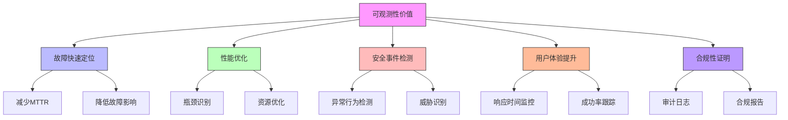

在企业级统一身份治理平台的建设和运营过程中，平台的可观测性与可靠性是确保系统稳定运行和服务质量的关键因素。随着企业对身份治理平台依赖程度的不断提高，如何构建一个具备高可观测性和高可靠性的平台已成为架构师和运维工程师必须面对的重要挑战。

## 引言

统一身份治理平台作为企业信息安全的核心基础设施，承担着认证、授权、用户管理等关键职能。一旦平台出现故障或性能问题，将直接影响企业业务的正常运行，甚至可能造成严重的安全风险。因此，建立完善的可观测性体系和可靠性保障机制，对于确保平台的稳定运行和用户体验至关重要。

## 可观测性的重要性

可观测性是指通过系统的外部输出（如日志、指标、链路追踪等）来理解和推断系统内部状态的能力。对于身份治理平台而言，良好的可观测性能够帮助我们：



### 监控告警体系

一个完善的监控告警体系应该覆盖平台的各个方面：

1. **认证监控**：登录成功率、认证延迟、MFA使用率等
2. **授权监控**：权限检查成功率、授权延迟等
3. **性能监控**：API响应时间、吞吐量、错误率等
4. **安全监控**：异常登录检测、风险行为识别等
5. **基础设施监控**：CPU、内存、磁盘、网络等资源使用情况

### 日志管理

日志作为系统行为的重要记录，需要具备以下特征：

```java
public class ObservabilityFramework {
    private final MonitoringService monitoringService;
    private final LoggingService loggingService;
    private final TracingService tracingService;
    
    // 结构化日志记录
    public void logStructuredEvent(String eventType, Map<String, Object> attributes) {
        LogEvent event = LogEvent.builder()
            .timestamp(Instant.now())
            .eventType(eventType)
            .attributes(attributes)
            .traceId(tracingService.getCurrentTraceId())
            .spanId(tracingService.getCurrentSpanId())
            .build();
        
        loggingService.logStructuredEvent(event);
        
        // 根据事件类型更新监控指标
        monitoringService.updateMetrics(eventType, attributes);
    }
    
    // 分布式追踪
    public <T> T traceOperation(String operationName, Supplier<T> operation) {
        Span span = tracingService.startSpan(operationName);
        try {
            T result = operation.get();
            span.setStatus(SpanStatus.SUCCESS);
            return result;
        } catch (Exception e) {
            span.setStatus(SpanStatus.ERROR, e.getMessage());
            span.addEvent("error", Map.of("exception", e.getClass().getName(), "message", e.getMessage()));
            throw e;
        } finally {
            span.end();
        }
    }
}
```

## 可靠性保障机制

可靠性是指系统在规定条件下和规定时间内完成规定功能的能力。对于身份治理平台，可靠性保障需要从多个维度考虑：

### 高可用架构

```python
class HighAvailabilityArchitecture:
    def __init__(self):
        self.load_balancer = LoadBalancer()
        self.database_cluster = DatabaseCluster()
        self.cache_cluster = CacheCluster()
        self.message_queue = MessageQueue()
    
    def setup_multi_region_deployment(self, regions):
        """设置多区域部署"""
        for region in regions:
            # 在每个区域部署服务实例
            self.deploy_services_in_region(region)
            
            # 配置区域间数据同步
            self.setup_cross_region_replication(region)
            
            # 设置故障转移机制
            self.configure_failover(region)
    
    def configure_load_balancing(self, strategy='round_robin'):
        """配置负载均衡"""
        self.load_balancer.set_strategy(strategy)
        self.load_balancer.enable_health_checks()
        self.load_balancer.setup_failure_detection()
        
        # 配置粘性会话（如果需要）
        if strategy == 'sticky_session':
            self.load_balancer.enable_sticky_sessions()
    
    def setup_database_replication(self):
        """设置数据库复制"""
        # 配置主从复制
        self.database_cluster.configure_master_slave_replication()
        
        # 设置读写分离
        self.database_cluster.enable_read_write_splitting()
        
        # 配置自动故障转移
        self.database_cluster.setup_auto_failover()
```

### 容错与恢复

```sql
-- 可靠性监控指标表
CREATE TABLE reliability_metrics (
    id VARCHAR(50) PRIMARY KEY,
    metric_name VARCHAR(100) NOT NULL,
    metric_type VARCHAR(50) NOT NULL,  -- AVAILABILITY, LATENCY, ERROR_RATE
    value DECIMAL(10,4) NOT NULL,
    threshold DECIMAL(10,4),
    status VARCHAR(20),  -- NORMAL, WARNING, CRITICAL
    recorded_at TIMESTAMP DEFAULT CURRENT_TIMESTAMP,
    service_name VARCHAR(100),
    region VARCHAR(50),
    
    INDEX idx_metric_name (metric_name),
    INDEX idx_recorded_at (recorded_at),
    INDEX idx_service_region (service_name, region)
);

-- 服务健康状态表
CREATE TABLE service_health (
    id VARCHAR(50) PRIMARY KEY,
    service_name VARCHAR(100) NOT NULL,
    instance_id VARCHAR(100) NOT NULL,
    status VARCHAR(20) NOT NULL,  -- HEALTHY, DEGRADED, UNHEALTHY
    last_check TIMESTAMP NOT NULL,
    last_healthy TIMESTAMP,
    failure_count INT DEFAULT 0,
    error_message TEXT,
    region VARCHAR(50),
    availability_zone VARCHAR(50),
    
    INDEX idx_service_status (service_name, status),
    INDEX idx_instance (instance_id),
    INDEX idx_last_check (last_check)
);

-- 创建服务可用性视图
CREATE VIEW service_availability_report AS
SELECT 
    service_name,
    region,
    COUNT(CASE WHEN status = 'HEALTHY' THEN 1 END) as healthy_instances,
    COUNT(*) as total_instances,
    ROUND(COUNT(CASE WHEN status = 'HEALTHY' THEN 1 END) * 100.0 / COUNT(*), 2) as availability_percentage,
    MAX(last_check) as last_updated
FROM service_health
WHERE last_check > DATE_SUB(NOW(), INTERVAL 1 HOUR)
GROUP BY service_name, region;
```

## 本章内容概览

在本章中，我们将深入探讨以下关键主题：

### 10.1 监控告警体系
- 身份治理平台关键监控指标的设计
- 实时监控和告警机制的实现
- 异常检测和根因分析
- 监控面板和可视化展示

### 10.2 高可用与灾难恢复架构
- 多活数据库架构设计
- 无状态服务的水平扩展
- 异地容灾和故障转移机制
- 数据备份和恢复策略

### 10.3 性能与扩展性
- 水平扩展架构设计
- 权限和用户信息缓存策略
- 数据库性能优化
- API性能调优

## 实施建议

在构建可观测性和可靠性体系时，建议遵循以下原则：

1. **全面覆盖**：监控指标应覆盖平台的所有关键组件和业务流程
2. **实时性**：监控数据应实时收集和处理，确保及时发现和响应问题
3. **自动化**：尽可能自动化故障检测、诊断和恢复过程
4. **可扩展性**：监控和可靠性机制应能够随着平台规模的增长而扩展
5. **用户体验导向**：重点关注影响用户体验的指标和问题

## 技术栈选择

在实现可观测性和可靠性时，可以选择以下技术栈：

```yaml
# 可观测性技术栈
observability:
  logging:
    framework: ELK Stack (Elasticsearch, Logstash, Kibana)
    structured_logging: JSON format
    log_retention: 90 days
  
  metrics:
    collection: Prometheus
    storage: Prometheus + Thanos for long-term storage
    visualization: Grafana
    alerting: AlertManager
  
  tracing:
    framework: OpenTelemetry
    backend: Jaeger or Zipkin
    sampling: Adaptive sampling based on traffic volume
  
  monitoring:
    infrastructure: Prometheus Node Exporter
    application: Custom metrics endpoints
    business_metrics: Key performance indicators

# 可靠性技术栈
reliability:
  load_balancing: HAProxy or NGINX Plus
  service_discovery: Consul or Kubernetes
  circuit_breaker: Hystrix or Resilience4j
  retry_mechanism: Exponential backoff with jitter
  rate_limiting: Redis-based rate limiting
  health_checks: Custom health check endpoints
```

## 总结

平台的可观测性与可靠性是企业级统一身份治理平台成功的关键因素。通过建立完善的监控告警体系、实施高可用架构设计、优化性能和扩展性，我们可以确保平台在面对各种挑战时仍能稳定运行，为用户提供可靠的身份服务。

在后续章节中，我们将详细探讨每个主题的具体实现方案和最佳实践，帮助企业构建一个既具备高度可观测性又具备强大可靠性的身份治理平台。