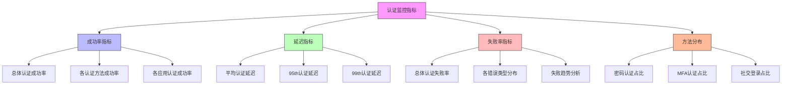

在企业级统一身份治理平台中，建立完善的监控告警体系是确保系统稳定运行和及时发现潜在问题的关键。通过实时监控认证成功率、延迟、MFA使用率以及异常行为等关键指标，运维团队可以快速响应系统异常，保障用户体验和系统安全。

## 引言

身份治理平台作为企业信息安全的核心基础设施，其稳定性和性能直接影响着企业业务的正常运行。一个完善的监控告警体系不仅能够帮助运维团队及时发现和解决问题，还能为业务决策提供数据支持。本文将深入探讨如何构建针对身份治理平台的监控告警体系。

## 关键监控指标设计

### 认证相关指标

认证是身份治理平台的核心功能，相关的监控指标包括：



### 授权相关指标

```java
public class AuthorizationMetricsCollector {
    private final MeterRegistry meterRegistry;
    private final Counter authorizationAttempts;
    private final Counter authorizationSuccesses;
    private final Counter authorizationFailures;
    private final Timer authorizationLatency;
    private final Gauge activeSessions;
    
    public AuthorizationMetricsCollector(MeterRegistry meterRegistry) {
        this.meterRegistry = meterRegistry;
        
        // 授权尝试计数器
        this.authorizationAttempts = Counter.builder("authorization.attempts")
            .description("Total authorization attempts")
            .register(meterRegistry);
        
        // 授权成功计数器
        this.authorizationSuccesses = Counter.builder("authorization.success")
            .description("Successful authorization attempts")
            .register(meterRegistry);
        
        // 授权失败计数器
        this.authorizationFailures = Counter.builder("authorization.failures")
            .description("Failed authorization attempts")
            .register(meterRegistry);
        
        // 授权延迟计时器
        this.authorizationLatency = Timer.builder("authorization.latency")
            .description("Authorization processing latency")
            .register(meterRegistry);
        
        // 活跃会话数
        this.activeSessions = Gauge.builder("sessions.active")
            .description("Number of active user sessions")
            .register(meterRegistry, this, AuthorizationMetricsCollector::getActiveSessionCount);
    }
    
    // 记录授权尝试
    public void recordAuthorizationAttempt(String userId, String resourceId, String action) {
        authorizationAttempts.increment(
            Tags.of(
                "user_id", userId,
                "resource_id", resourceId,
                "action", action
            )
        );
    }
    
    // 记录授权成功
    public void recordAuthorizationSuccess(String userId, String resourceId, String action, long durationMs) {
        authorizationSuccesses.increment(
            Tags.of(
                "user_id", userId,
                "resource_id", resourceId,
                "action", action
            )
        );
        
        authorizationLatency.record(durationMs, TimeUnit.MILLISECONDS);
    }
    
    // 记录授权失败
    public void recordAuthorizationFailure(String userId, String resourceId, String action, String failureReason) {
        authorizationFailures.increment(
            Tags.of(
                "user_id", userId,
                "resource_id", resourceId,
                "action", action,
                "failure_reason", failureReason
            )
        );
    }
}
```

### MFA使用率指标

```python
class MFAMetricsCollector:
    def __init__(self, metrics_client):
        self.metrics_client = metrics_client
        self.mfa_methods = ['TOTP', 'SMS', 'EMAIL', 'HARDWARE_TOKEN', 'BIOMETRIC']
    
    def collect_mfa_metrics(self):
        """收集MFA相关指标"""
        # 获取总认证次数
        total_authentications = self.metrics_client.get_counter('authentication.total')
        
        # 获取各MFA方法使用次数
        mfa_usage = {}
        for method in self.mfa_methods:
            mfa_usage[method] = self.metrics_client.get_counter(f'mfa.{method.lower()}.used')
        
        # 计算MFA总体使用率
        total_mfa_used = sum(mfa_usage.values())
        mfa_usage_rate = total_mfa_used / total_authentications if total_authentications > 0 else 0
        
        # 记录指标
        self.metrics_client.gauge('mfa.usage_rate', mfa_usage_rate)
        
        # 记录各方法使用率
        for method, count in mfa_usage.items():
            method_rate = count / total_authentications if total_authentications > 0 else 0
            self.metrics_client.gauge(f'mfa.{method.lower()}.usage_rate', method_rate)
        
        return {
            'total_authentications': total_authentications,
            'mfa_usage_rate': mfa_usage_rate,
            'mfa_method_usage': mfa_usage
        }
    
    def analyze_mfa_trends(self, time_window='24h'):
        """分析MFA使用趋势"""
        # 获取历史数据
        historical_data = self.metrics_client.get_time_series(
            'mfa.usage_rate', 
            time_window
        )
        
        # 计算趋势
        if len(historical_data) >= 2:
            current_rate = historical_data[-1]['value']
            previous_rate = historical_data[-2]['value']
            trend = (current_rate - previous_rate) / previous_rate if previous_rate > 0 else 0
            
            return {
                'current_rate': current_rate,
                'trend': trend,
                'trend_direction': 'increasing' if trend > 0 else 'decreasing' if trend < 0 else 'stable'
            }
        
        return {
            'current_rate': historical_data[-1]['value'] if historical_data else 0,
            'trend': 0,
            'trend_direction': 'unknown'
        }
```

### 异常行为检测指标

```sql
-- 异常行为检测规则表
CREATE TABLE anomaly_detection_rules (
    id VARCHAR(50) PRIMARY KEY,
    rule_name VARCHAR(100) NOT NULL,
    rule_type VARCHAR(50) NOT NULL,  -- LOGIN_PATTERN, PERMISSION_ACCESS, SESSION_BEHAVIOR
    description TEXT,
    enabled BOOLEAN DEFAULT TRUE,
    severity VARCHAR(20) NOT NULL,  -- LOW, MEDIUM, HIGH, CRITICAL
    detection_window INT NOT NULL,  -- 检测窗口（分钟）
    threshold_value DECIMAL(10,4),
    notification_channels JSON,
    created_at TIMESTAMP DEFAULT CURRENT_TIMESTAMP,
    updated_at TIMESTAMP DEFAULT CURRENT_TIMESTAMP ON UPDATE CURRENT_TIMESTAMP
);

-- 异常行为事件表
CREATE TABLE anomaly_events (
    id VARCHAR(50) PRIMARY KEY,
    rule_id VARCHAR(50) NOT NULL,
    event_type VARCHAR(100) NOT NULL,
    severity VARCHAR(20) NOT NULL,
    source_ip VARCHAR(45),
    user_id VARCHAR(100),
    details JSON,
    detected_at TIMESTAMP NOT NULL,
    resolved BOOLEAN DEFAULT FALSE,
    resolved_at TIMESTAMP NULL,
    resolution_notes TEXT,
    
    FOREIGN KEY (rule_id) REFERENCES anomaly_detection_rules(id),
    INDEX idx_detected_at (detected_at),
    INDEX idx_user_id (user_id),
    INDEX idx_severity (severity),
    INDEX idx_resolved (resolved)
);

-- 登录模式异常检测视图
CREATE VIEW login_pattern_anomalies AS
SELECT 
    user_id,
    source_ip,
    COUNT(*) as login_count,
    MIN(timestamp) as first_login,
    MAX(timestamp) as last_login,
    TIMESTAMPDIFF(MINUTE, MIN(timestamp), MAX(timestamp)) as time_span_minutes,
    CASE 
        WHEN COUNT(*) > 10 AND TIMESTAMPDIFF(MINUTE, MIN(timestamp), MAX(timestamp)) < 60 THEN 'HIGH_FREQUENCY_LOGIN'
        WHEN COUNT(DISTINCT source_ip) > 3 THEN 'MULTIPLE_IP_LOGIN'
        ELSE 'NORMAL'
    END as anomaly_type
FROM audit_logs 
WHERE event_type = 'LOGIN_ATTEMPT' 
  AND timestamp > DATE_SUB(NOW(), INTERVAL 1 HOUR)
  AND result = 'SUCCESS'
GROUP BY user_id, DATE(timestamp)
HAVING anomaly_type != 'NORMAL';
```

## 实时监控实现

### 监控数据收集

```javascript
// 实时监控数据收集服务
class RealTimeMonitoringService {
  constructor(metricsClient, alertService, loggingService) {
    this.metricsClient = metricsClient;
    this.alertService = alertService;
    this.loggingService = loggingService;
    this.collectors = new Map();
  }
  
  // 注册监控收集器
  registerCollector(collectorName, collectorFunction, intervalMs = 60000) {
    const collector = {
      name: collectorName,
      function: collectorFunction,
      interval: setInterval(() => {
        this.collectMetrics(collectorName, collectorFunction);
      }, intervalMs)
    };
    
    this.collectors.set(collectorName, collector);
  }
  
  // 收集指标
  async collectMetrics(collectorName, collectorFunction) {
    try {
      const metrics = await collectorFunction();
      await this.metricsClient.recordMetrics(collectorName, metrics);
      
      // 检查是否需要触发告警
      await this.checkAlerts(collectorName, metrics);
    } catch (error) {
      this.loggingService.error(`Failed to collect metrics for ${collectorName}`, error);
    }
  }
  
  // 检查告警条件
  async checkAlerts(collectorName, metrics) {
    const alertRules = await this.alertService.getAlertRulesForCollector(collectorName);
    
    for (const rule of alertRules) {
      if (this.evaluateAlertRule(rule, metrics)) {
        await this.triggerAlert(rule, metrics);
      }
    }
  }
  
  // 评估告警规则
  evaluateAlertRule(rule, metrics) {
    const metricValue = metrics[rule.metric];
    if (metricValue === undefined) {
      return false;
    }
    
    switch (rule.operator) {
      case '>':
        return metricValue > rule.threshold;
      case '<':
        return metricValue < rule.threshold;
      case '>=':
        return metricValue >= rule.threshold;
      case '<=':
        return metricValue <= rule.threshold;
      case '==':
        return metricValue === rule.threshold;
      case '!=':
        return metricValue !== rule.threshold;
      default:
        return false;
    }
  }
  
  // 触发告警
  async triggerAlert(rule, metrics) {
    const alert = {
      id: `ALERT-${Date.now()}-${Math.random().toString(36).substr(2, 9)}`,
      ruleId: rule.id,
      severity: rule.severity,
      metric: rule.metric,
      currentValue: metrics[rule.metric],
      threshold: rule.threshold,
      triggeredAt: new Date().toISOString(),
      details: {
        collector: rule.collector,
        operator: rule.operator,
        additionalContext: metrics
      }
    };
    
    await this.alertService.sendAlert(alert);
    this.loggingService.info(`Alert triggered: ${rule.name}`, alert);
  }
}
```

### 分布式追踪

```java
public class DistributedTracingService {
    private final Tracer tracer;
    private final MetricsService metricsService;
    
    // 认证流程追踪
    public Span startAuthenticationTrace(AuthenticationRequest request) {
        Span span = tracer.spanBuilder("authentication")
            .setAttribute("user.id", request.getUserId())
            .setAttribute("auth.method", request.getAuthMethod())
            .setAttribute("source.ip", request.getSourceIp())
            .startSpan();
        
        // 添加自定义标签
        span.setAttribute("user.agent", request.getUserAgent());
        span.setAttribute("tenant.id", request.getTenantId());
        
        return span;
    }
    
    // MFA验证追踪
    public Span startMFAVerificationTrace(String userId, String mfaMethod) {
        Span span = tracer.spanBuilder("mfa_verification")
            .setAttribute("user.id", userId)
            .setAttribute("mfa.method", mfaMethod)
            .startSpan();
        
        return span;
    }
    
    // 授权检查追踪
    public Span startAuthorizationTrace(String userId, String resourceId, String action) {
        Span span = tracer.spanBuilder("authorization")
            .setAttribute("user.id", userId)
            .setAttribute("resource.id", resourceId)
            .setAttribute("action", action)
            .startSpan();
        
        return span;
    }
    
    // 记录追踪指标
    public void recordTraceMetrics(Span span, String operation, long durationMs, boolean success) {
        // 记录延迟指标
        metricsService.recordTimer(
            "trace.duration", 
            durationMs, 
            TimeUnit.MILLISECONDS,
            Tags.of(
                "operation", operation,
                "success", String.valueOf(success)
            )
        );
        
        // 记录成功率指标
        metricsService.incrementCounter(
            success ? "trace.success" : "trace.failure",
            Tags.of("operation", operation)
        );
        
        // 如果是失败的操作，记录错误信息
        if (!success && span != null) {
            span.setStatus(StatusCode.ERROR, "Operation failed");
        }
    }
}
```

## 告警机制设计

### 多级告警策略

```python
class AlertingService:
    def __init__(self, notification_service, escalation_policy):
        self.notification_service = notification_service
        self.escalation_policy = escalation_policy
        self.alert_history = {}
    
    def process_alert(self, alert):
        """处理告警"""
        # 检查是否为重复告警
        if self.is_duplicate_alert(alert):
            self.update_alert_count(alert)
            return
        
        # 记录新告警
        self.record_new_alert(alert)
        
        # 根据严重程度确定通知策略
        notification_plan = self.determine_notification_plan(alert)
        
        # 发送通知
        self.send_notifications(alert, notification_plan)
        
        # 启动升级机制（如果需要）
        if alert.severity in ['HIGH', 'CRITICAL']:
            self.start_escalation(alert)
    
    def determine_notification_plan(self, alert):
        """确定通知计划"""
        plan = {
            'immediate_recipients': [],
            'delayed_recipients': [],
            'channels': []
        }
        
        # 根据严重程度确定通知对象
        if alert.severity == 'CRITICAL':
            plan['immediate_recipients'] = self.escalation_policy.get_critical_recipients()
            plan['channels'] = ['SMS', 'EMAIL', 'SLACK', 'PHONE']
        elif alert.severity == 'HIGH':
            plan['immediate_recipients'] = self.escalation_policy.get_high_recipients()
            plan['channels'] = ['SMS', 'EMAIL', 'SLACK']
        elif alert.severity == 'MEDIUM':
            plan['immediate_recipients'] = self.escalation_policy.get_medium_recipients()
            plan['channels'] = ['EMAIL', 'SLACK']
        else:  # LOW
            plan['delayed_recipients'] = self.escalation_policy.get_low_recipients()
            plan['channels'] = ['EMAIL']
        
        return plan
    
    def start_escalation(self, alert):
        """启动升级机制"""
        # 设置升级定时器
        escalation_time = self.escalation_policy.get_escalation_time(alert.severity)
        
        # 如果在指定时间内未解决，则升级告警
        threading.Timer(escalation_time, self.escalate_alert, [alert]).start()
    
    def escalate_alert(self, alert):
        """升级告警"""
        # 检查告警是否已解决
        if self.is_alert_resolved(alert.id):
            return
        
        # 获取升级通知对象
        escalation_recipients = self.escalation_policy.get_escalation_recipients(alert.severity)
        
        # 发送升级通知
        self.notification_service.send_escalation_notification(
            alert, 
            escalation_recipients
        )
```

### 告警抑制和去重

```sql
-- 告警抑制规则表
CREATE TABLE alert_suppression_rules (
    id VARCHAR(50) PRIMARY KEY,
    rule_name VARCHAR(100) NOT NULL,
    description TEXT,
    condition_expression TEXT NOT NULL,  -- 告警抑制条件表达式
    duration INT NOT NULL,  -- 抑制持续时间（秒）
    active BOOLEAN DEFAULT TRUE,
    created_at TIMESTAMP DEFAULT CURRENT_TIMESTAMP,
    updated_at TIMESTAMP DEFAULT CURRENT_TIMESTAMP ON UPDATE CURRENT_TIMESTAMP
);

-- 告警去重规则表
CREATE TABLE alert_deduplication_rules (
    id VARCHAR(50) PRIMARY KEY,
    rule_name VARCHAR(100) NOT NULL,
    description TEXT,
    grouping_keys JSON NOT NULL,  -- 用于去重的键
    time_window INT NOT NULL,  -- 时间窗口（秒）
    active BOOLEAN DEFAULT TRUE,
    created_at TIMESTAMP DEFAULT CURRENT_TIMESTAMP,
    updated_at TIMESTAMP DEFAULT CURRENT_TIMESTAMP ON UPDATE CURRENT_TIMESTAMP
);

-- 告警事件表（增强版）
CREATE TABLE alert_events (
    id VARCHAR(50) PRIMARY KEY,
    rule_id VARCHAR(50) NOT NULL,
    alert_name VARCHAR(200) NOT NULL,
    severity VARCHAR(20) NOT NULL,
    summary TEXT,
    description TEXT,
    details JSON,
    triggered_at TIMESTAMP NOT NULL,
    resolved BOOLEAN DEFAULT FALSE,
    resolved_at TIMESTAMP NULL,
    resolution_notes TEXT,
    suppression_rule_id VARCHAR(50) NULL,  -- 抑制规则ID
    deduplication_key VARCHAR(200) NULL,  -- 去重键
    
    FOREIGN KEY (rule_id) REFERENCES monitoring_rules(id),
    FOREIGN KEY (suppression_rule_id) REFERENCES alert_suppression_rules(id),
    INDEX idx_triggered_at (triggered_at),
    INDEX idx_severity (severity),
    INDEX idx_resolved (resolved),
    INDEX idx_deduplication_key (deduplication_key)
);
```

## 监控面板和可视化

### Grafana仪表板设计

```json
{
  "dashboard": {
    "title": "Identity Governance Platform Monitoring",
    "panels": [
      {
        "id": 1,
        "title": "Authentication Success Rate",
        "type": "graph",
        "datasource": "Prometheus",
        "targets": [
          {
            "expr": "rate(authentication_success_total[5m]) / rate(authentication_total[5m]) * 100",
            "legendFormat": "Success Rate"
          }
        ],
        "thresholds": [
          {
            "value": 99.5,
            "colorMode": "critical",
            "op": "lt"
          },
          {
            "value": 99.9,
            "colorMode": "warning",
            "op": "lt"
          }
        ]
      },
      {
        "id": 2,
        "title": "Authentication Latency",
        "type": "graph",
        "datasource": "Prometheus",
        "targets": [
          {
            "expr": "histogram_quantile(0.95, sum(rate(authentication_duration_seconds_bucket[5m])) by (le))",
            "legendFormat": "95th Percentile"
          },
          {
            "expr": "histogram_quantile(0.99, sum(rate(authentication_duration_seconds_bucket[5m])) by (le))",
            "legendFormat": "99th Percentile"
          }
        ],
        "thresholds": [
          {
            "value": 1000,
            "colorMode": "critical",
            "op": "gt"
          },
          {
            "value": 500,
            "colorMode": "warning",
            "op": "gt"
          }
        ]
      },
      {
        "id": 3,
        "title": "MFA Usage Rate",
        "type": "gauge",
        "datasource": "Prometheus",
        "targets": [
          {
            "expr": "rate(mfa_used_total[5m]) / rate(authentication_success_total[5m]) * 100",
            "legendFormat": "MFA Usage Rate"
          }
        ],
        "thresholds": [
          {
            "value": 80,
            "colorMode": "ok",
            "op": "gt"
          },
          {
            "value": 50,
            "colorMode": "warning",
            "op": "lt"
          }
        ]
      },
      {
        "id": 4,
        "title": "Active Sessions",
        "type": "stat",
        "datasource": "Prometheus",
        "targets": [
          {
            "expr": "sessions_active",
            "legendFormat": "Active Sessions"
          }
        ]
      }
    ]
  }
}
```

### 自定义监控面板

```java
public class CustomDashboardService {
    private final DashboardRepository dashboardRepository;
    private final MetricsService metricsService;
    
    // 创建自定义仪表板
    public Dashboard createCustomDashboard(DashboardDefinition definition) {
        Dashboard dashboard = new Dashboard();
        dashboard.setId(UUID.randomUUID().toString());
        dashboard.setName(definition.getName());
        dashboard.setDescription(definition.getDescription());
        dashboard.setOwnerId(definition.getOwnerId());
        dashboard.setCreatedAt(Instant.now());
        
        // 创建面板
        List<Panel> panels = new ArrayList<>();
        for (PanelDefinition panelDef : definition.getPanelDefinitions()) {
            Panel panel = createPanel(panelDef);
            panels.add(panel);
        }
        
        dashboard.setPanels(panels);
        
        // 保存仪表板
        dashboardRepository.save(dashboard);
        
        return dashboard;
    }
    
    // 创建面板
    private Panel createPanel(PanelDefinition definition) {
        Panel panel = new Panel();
        panel.setId(UUID.randomUUID().toString());
        panel.setTitle(definition.getTitle());
        panel.setType(definition.getType());
        panel.setDataSource(definition.getDataSource());
        panel.setQuery(definition.getQuery());
        panel.setVisualization(definition.getVisualization());
        
        // 设置阈值
        if (definition.getThresholds() != null) {
            panel.setThresholds(definition.getThresholds());
        }
        
        // 设置刷新间隔
        panel.setRefreshInterval(definition.getRefreshInterval());
        
        return panel;
    }
    
    // 获取仪表板数据
    public DashboardData getDashboardData(String dashboardId) {
        Dashboard dashboard = dashboardRepository.findById(dashboardId);
        DashboardData data = new DashboardData();
        data.setDashboardId(dashboardId);
        data.setGeneratedAt(Instant.now());
        
        // 收集各面板数据
        List<PanelData> panelDataList = new ArrayList<>();
        for (Panel panel : dashboard.getPanels()) {
            PanelData panelData = collectPanelData(panel);
            panelDataList.add(panelData);
        }
        
        data.setPanelData(panelDataList);
        
        return data;
    }
}
```

## 异常检测和根因分析

### 机器学习辅助异常检测

```javascript
// 异常检测服务
class AnomalyDetectionService {
  constructor(mlService, metricsService) {
    this.mlService = mlService;
    this.metricsService = metricsService;
    this.models = new Map();
  }
  
  // 训练异常检测模型
  async trainAnomalyModel(metricName, trainingData) {
    // 准备训练数据
    const features = this.prepareFeatures(trainingData);
    const labels = this.prepareLabels(trainingData);
    
    // 训练模型
    const model = await this.mlService.trainAnomalyDetectionModel(features, labels);
    
    // 保存模型
    this.models.set(metricName, model);
    
    return model;
  }
  
  // 检测异常
  async detectAnomalies(metricName, currentData) {
    const model = this.models.get(metricName);
    if (!model) {
      throw new Error(`No model found for metric: ${metricName}`);
    }
    
    // 准备特征数据
    const features = this.prepareFeatures([currentData]);
    
    // 预测异常
    const predictions = await model.predict(features);
    
    // 分析结果
    const anomalies = [];
    for (let i = 0; i < predictions.length; i++) {
      if (predictions[i].anomaly_score > 0.8) {  // 异常阈值
        anomalies.push({
          timestamp: currentData[i].timestamp,
          metric: metricName,
          value: currentData[i].value,
          anomaly_score: predictions[i].anomaly_score,
          confidence: predictions[i].confidence
        });
      }
    }
    
    return anomalies;
  }
  
  // 根因分析
  async performRootCauseAnalysis(anomaly) {
    // 收集相关指标数据
    const relatedMetrics = await this.metricsService.getRelatedMetrics(
      anomaly.metric, 
      anomaly.timestamp
    );
    
    // 使用关联分析找出可能的根因
    const rootCauses = await this.mlService.analyzeRootCauses(
      anomaly, 
      relatedMetrics
    );
    
    return rootCauses;
  }
}
```

### 日志关联分析

```sql
-- 日志关联分析视图
CREATE VIEW log_correlation_analysis AS
SELECT 
    al1.event_type as primary_event,
    al1.user_id,
    al1.source_ip,
    al1.timestamp as primary_timestamp,
    al2.event_type as related_event,
    al2.timestamp as related_timestamp,
    TIMESTAMPDIFF(SECOND, al1.timestamp, al2.timestamp) as time_difference,
    CASE 
        WHEN al2.event_type = 'AUTHENTICATION_FAILURE' AND 
             TIMESTAMPDIFF(SECOND, al1.timestamp, al2.timestamp) BETWEEN 0 AND 300 THEN 'SUSPICIOUS_LOGIN_PATTERN'
        WHEN al2.event_type = 'PERMISSION_DENIED' AND 
             TIMESTAMPDIFF(SECOND, al1.timestamp, al2.timestamp) BETWEEN 0 AND 60 THEN 'AUTHORIZATION_ANOMALY'
        ELSE 'NORMAL_CORRELATION'
    END as correlation_type
FROM audit_logs al1
JOIN audit_logs al2 ON al1.user_id = al2.user_id 
                   AND al1.source_ip = al2.source_ip
                   AND al1.timestamp < al2.timestamp
                   AND TIMESTAMPDIFF(MINUTE, al1.timestamp, al2.timestamp) <= 10
WHERE al1.timestamp > DATE_SUB(NOW(), INTERVAL 1 HOUR)
ORDER BY al1.timestamp;
```

## 总结

监控告警体系是企业级统一身份治理平台稳定运行的重要保障。通过建立全面的监控指标体系、实现实时监控和告警机制、构建直观的可视化面板，以及采用智能化的异常检测和根因分析技术，我们可以有效提升平台的可观测性和可靠性。

关键要点包括：

1. **指标设计**：针对认证、授权、MFA使用和异常行为设计全面的监控指标
2. **实时监控**：建立实时数据收集和处理机制
3. **智能告警**：实现多级告警策略和智能升级机制
4. **可视化展示**：构建直观的监控面板和仪表板
5. **异常检测**：运用机器学习等技术实现智能异常检测和根因分析

随着技术的不断发展，监控告警体系也在向更加智能化、自动化的方向演进。企业应当持续关注新技术发展，不断完善和优化监控告警体系，为身份治理平台的稳定运行提供坚实保障。