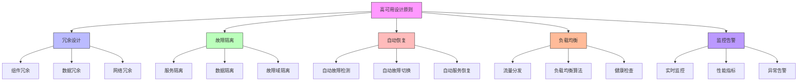

在企业级统一身份治理平台中，高可用性和灾难恢复能力是确保业务连续性和数据安全的关键要求。随着企业对身份服务依赖程度的不断提高，任何服务中断都可能导致严重的业务影响。本文将深入探讨如何设计和实现高可用与灾难恢复架构，包括数据库多活、无状态服务和异地容灾等关键技术。

## 引言

身份治理平台作为企业信息安全的核心基础设施，必须具备极高的可用性和强大的灾难恢复能力。在全球化和数字化转型的背景下，企业需要确保身份服务能够在各种故障场景下持续可用，包括硬件故障、网络中断、自然灾害等。通过实施科学的高可用架构和完善的灾难恢复策略，我们可以最大程度地降低服务中断风险，保障业务的连续性。

## 高可用架构设计原则

### 设计目标

高可用架构的设计需要遵循以下核心原则：



### 可用性指标

```java
public class AvailabilityMetrics {
    // 可用性计算公式
    public static double calculateAvailability(long uptimeSeconds, long downtimeSeconds) {
        long totalSeconds = uptimeSeconds + downtimeSeconds;
        if (totalSeconds == 0) {
            return 100.0;
        }
        return (double) uptimeSeconds / totalSeconds * 100;
    }
    
    // 常见可用性等级
    public enum AvailabilityLevel {
        TWO_NINES(99.0, "99%", 87.6, "小时/年"),
        THREE_NINES(99.9, "99.9%", 8.76, "小时/年"),
        FOUR_NINES(99.99, "99.99%", 52.6, "分钟/年"),
        FIVE_NINES(99.999, "99.999%", 5.26, "分钟/年"),
        SIX_NINES(99.9999, "99.9999%", 31.5, "秒/年");
        
        private final double percentage;
        private final String displayName;
        private final double downtime;
        private final String downtimeUnit;
        
        AvailabilityLevel(double percentage, String displayName, double downtime, String downtimeUnit) {
            this.percentage = percentage;
            this.displayName = displayName;
            this.downtime = downtime;
            this.downtimeUnit = downtimeUnit;
        }
        
        // getters...
    }
}
```

## 数据库多活架构

### 主从复制架构

```python
class DatabaseReplicationManager:
    def __init__(self, db_config):
        self.db_config = db_config
        self.master_db = None
        self.slave_dbs = []
        self.replication_status = {}
    
    def setup_master_slave_replication(self):
        """设置主从复制"""
        # 配置主数据库
        self.master_db = self._configure_master_database()
        
        # 配置从数据库
        for slave_config in self.db_config.slaves:
            slave_db = self._configure_slave_database(slave_config)
            self.slave_dbs.append(slave_db)
        
        # 启动复制
        self._start_replication()
        
        # 配置监控
        self._setup_replication_monitoring()
    
    def _configure_master_database(self):
        """配置主数据库"""
        master_config = {
            'server_id': self.db_config.master.server_id,
            'log_bin': 'mysql-bin',
            'binlog_format': 'ROW',
            'sync_binlog': 1,
            'innodb_flush_log_at_trx_commit': 1
        }
        
        # 应用配置
        db = MySQLDatabase(master_config)
        db.apply_configuration()
        
        return db
    
    def _configure_slave_database(self, slave_config):
        """配置从数据库"""
        slave_db_config = {
            'server_id': slave_config.server_id,
            'relay_log': 'relay-bin',
            'read_only': True,
            'slave_parallel_workers': 4,
            'slave_parallel_type': 'LOGICAL_CLOCK'
        }
        
        # 应用配置
        db = MySQLDatabase(slave_db_config)
        db.apply_configuration()
        
        # 配置主从关系
        db.configure_master(
            master_host=slave_config.master_host,
            master_port=slave_config.master_port,
            replication_user=slave_config.replication_user,
            replication_password=slave_config.replication_password
        )
        
        return db
    
    def monitor_replication_lag(self):
        """监控复制延迟"""
        for slave_db in self.slave_dbs:
            lag_info = slave_db.get_replication_lag()
            self.replication_status[slave_db.server_id] = lag_info
            
            # 检查延迟是否超过阈值
            if lag_info['seconds_behind_master'] > self.db_config.max_replication_lag:
                self._handle_replication_lag_alert(slave_db, lag_info)
    
    def failover_to_slave(self, failed_master_id):
        """故障切换到从库"""
        # 选择最佳从库作为新主库
        new_master = self._select_best_slave_for_promotion()
        
        # 停止复制
        new_master.stop_slave()
        
        # 提升为新主库
        new_master.promote_to_master()
        
        # 重新配置其他从库指向新主库
        for slave_db in self.slave_dbs:
            if slave_db.server_id != new_master.server_id:
                slave_db.change_master(
                    new_master.host,
                    new_master.port,
                    new_master.replication_user,
                    new_master.replication_password
                )
        
        # 更新应用配置
        self._update_application_config(new_master)
        
        return new_master
```

### 多主复制架构

```sql
-- 多主复制配置表
CREATE TABLE multi_master_replication_config (
    id VARCHAR(50) PRIMARY KEY,
    cluster_name VARCHAR(100) NOT NULL,
    node_id VARCHAR(50) NOT NULL,
    node_role VARCHAR(20) NOT NULL,  -- MASTER, SLAVE, ARBITER
    host VARCHAR(100) NOT NULL,
    port INT NOT NULL,
    status VARCHAR(20) NOT NULL,  -- ACTIVE, INACTIVE, MAINTENANCE
    replication_lag INT DEFAULT 0,  -- 延迟秒数
    last_heartbeat TIMESTAMP,
    weight INT DEFAULT 100,  -- 节点权重
    region VARCHAR(50),
    availability_zone VARCHAR(50),
    created_at TIMESTAMP DEFAULT CURRENT_TIMESTAMP,
    updated_at TIMESTAMP DEFAULT CURRENT_TIMESTAMP ON UPDATE CURRENT_TIMESTAMP,
    
    UNIQUE KEY unique_cluster_node (cluster_name, node_id),
    INDEX idx_cluster_status (cluster_name, status),
    INDEX idx_region (region)
);

-- 多主复制状态监控视图
CREATE VIEW multi_master_replication_status AS
SELECT 
    cluster_name,
    COUNT(CASE WHEN status = 'ACTIVE' THEN 1 END) as active_nodes,
    COUNT(*) as total_nodes,
    ROUND(COUNT(CASE WHEN status = 'ACTIVE' THEN 1 END) * 100.0 / COUNT(*), 2) as availability_percentage,
    MAX(replication_lag) as max_replication_lag,
    AVG(replication_lag) as avg_replication_lag,
    MAX(last_heartbeat) as last_updated
FROM multi_master_replication_config
GROUP BY cluster_name;

-- 数据冲突检测和解决表
CREATE TABLE replication_conflict_log (
    id VARCHAR(50) PRIMARY KEY,
    cluster_name VARCHAR(100) NOT NULL,
    table_name VARCHAR(100) NOT NULL,
    primary_key_value VARCHAR(200) NOT NULL,
    conflicting_nodes JSON,
    conflict_type VARCHAR(50) NOT NULL,  -- INSERT_CONFLICT, UPDATE_CONFLICT, DELETE_CONFLICT
    resolution_strategy VARCHAR(50),  -- TIMESTAMP_BASED, VERSION_BASED, CUSTOM
    resolved BOOLEAN DEFAULT FALSE,
    resolved_at TIMESTAMP NULL,
    resolution_details TEXT,
    detected_at TIMESTAMP DEFAULT CURRENT_TIMESTAMP,
    
    INDEX idx_cluster_table (cluster_name, table_name),
    INDEX idx_resolved (resolved),
    INDEX idx_detected_at (detected_at)
);
```

## 无状态服务设计

### 微服务架构

```java
public class StatelessServiceDesign {
    private final SessionManagementService sessionService;
    private final CacheService cacheService;
    private final LoadBalancer loadBalancer;
    
    // 无状态认证服务
    public class StatelessAuthenticationService {
        private final JwtTokenService jwtService;
        private final UserService userService;
        private final CacheService cacheService;
        
        public AuthenticationResponse authenticate(LoginRequest request) {
            // 验证用户凭证
            User user = userService.authenticateUser(
                request.getUsername(), 
                request.getPassword()
            );
            
            if (user == null) {
                throw new AuthenticationException("Invalid credentials");
            }
            
            // 生成JWT令牌
            String accessToken = jwtService.generateAccessToken(user);
            String refreshToken = jwtService.generateRefreshToken(user);
            
            // 缓存刷新令牌（可选）
            cacheService.set(
                "refresh_token:" + refreshToken, 
                user.getId(), 
                Duration.ofDays(30)
            );
            
            // 记录登录事件
            auditService.logLoginEvent(user.getId(), request.getSourceIp());
            
            return AuthenticationResponse.builder()
                .accessToken(accessToken)
                .refreshToken(refreshToken)
                .expiresIn(jwtService.getAccessTokenExpiry())
                .tokenType("Bearer")
                .user(user)
                .build();
        }
        
        public AuthenticationResponse refreshAccessToken(String refreshToken) {
            // 验证刷新令牌
            String userId = cacheService.get("refresh_token:" + refreshToken);
            if (userId == null) {
                throw new TokenValidationException("Invalid refresh token");
            }
            
            // 获取用户信息
            User user = userService.getUserById(userId);
            if (user == null) {
                throw new UserNotFoundException("User not found");
            }
            
            // 生成新的访问令牌
            String newAccessToken = jwtService.generateAccessToken(user);
            
            return AuthenticationResponse.builder()
                .accessToken(newAccessToken)
                .refreshToken(refreshToken)  // 刷新令牌保持不变
                .expiresIn(jwtService.getAccessTokenExpiry())
                .tokenType("Bearer")
                .user(user)
                .build();
        }
    }
    
    // 无状态授权服务
    public class StatelessAuthorizationService {
        private final PermissionService permissionService;
        private final CacheService cacheService;
        private final JwtTokenService jwtService;
        
        public boolean checkPermission(String accessToken, String resource, String action) {
            // 解析JWT令牌
            JwtClaims claims = jwtService.parseAccessToken(accessToken);
            
            // 获取用户ID
            String userId = claims.getUserId();
            
            // 构建缓存键
            String cacheKey = String.format("permission:%s:%s:%s", userId, resource, action);
            
            // 尝试从缓存获取结果
            Boolean cachedResult = cacheService.get(cacheKey, Boolean.class);
            if (cachedResult != null) {
                return cachedResult;
            }
            
            // 从数据库检查权限
            boolean hasPermission = permissionService.checkUserPermission(userId, resource, action);
            
            // 缓存结果（带过期时间）
            cacheService.set(cacheKey, hasPermission, Duration.ofMinutes(5));
            
            return hasPermission;
        }
    }
}
```

### 负载均衡和会话管理

```javascript
// 负载均衡器配置
class LoadBalancer {
  constructor(servers, algorithm = 'round_robin') {
    this.servers = servers;
    this.algorithm = algorithm;
    this.currentServerIndex = 0;
    this.healthChecks = new Map();
  }
  
  // 选择服务器
  selectServer(request) {
    // 过滤不健康的服务器
    const healthyServers = this.servers.filter(server => 
      this.isServerHealthy(server)
    );
    
    if (healthyServers.length === 0) {
      throw new Error('No healthy servers available');
    }
    
    // 根据算法选择服务器
    switch (this.algorithm) {
      case 'round_robin':
        return this.roundRobinSelect(healthyServers);
      case 'least_connections':
        return this.leastConnectionsSelect(healthyServers);
      case 'weighted_round_robin':
        return this.weightedRoundRobinSelect(healthyServers);
      case 'ip_hash':
        return this.ipHashSelect(request, healthyServers);
      default:
        return healthyServers[0];
    }
  }
  
  // 轮询选择
  roundRobinSelect(servers) {
    const server = servers[this.currentServerIndex % servers.length];
    this.currentServerIndex++;
    return server;
  }
  
  // 最少连接选择
  leastConnectionsSelect(servers) {
    return servers.reduce((min, server) => 
      (server.currentConnections < min.currentConnections) ? server : min
    );
  }
  
  // 加权轮询选择
  weightedRoundRobinSelect(servers) {
    // 实现加权轮询算法
    let totalWeight = servers.reduce((sum, server) => sum + (server.weight || 1), 0);
    let randomWeight = Math.random() * totalWeight;
    
    for (let server of servers) {
      randomWeight -= (server.weight || 1);
      if (randomWeight <= 0) {
        return server;
      }
    }
    
    return servers[0];
  }
  
  // IP哈希选择
  ipHashSelect(request, servers) {
    const ip = request.headers['x-forwarded-for'] || request.connection.remoteAddress;
    const hash = this.simpleHash(ip);
    return servers[hash % servers.length];
  }
  
  // 健康检查
  async healthCheck(server) {
    try {
      const response = await fetch(`http://${server.host}:${server.port}/health`, {
        timeout: 5000
      });
      
      const isHealthy = response.status === 200;
      this.healthChecks.set(server.id, {
        healthy: isHealthy,
        lastCheck: Date.now(),
        responseTime: response.headers.get('response-time') || 0
      });
      
      return isHealthy;
    } catch (error) {
      this.healthChecks.set(server.id, {
        healthy: false,
        lastCheck: Date.now(),
        error: error.message
      });
      
      return false;
    }
  }
  
  // 检查服务器是否健康
  isServerHealthy(server) {
    const healthInfo = this.healthChecks.get(server.id);
    if (!healthInfo) {
      return false;
    }
    
    // 检查上次健康检查是否在5分钟内
    if (Date.now() - healthInfo.lastCheck > 5 * 60 * 1000) {
      return false;
    }
    
    return healthInfo.healthy;
  }
  
  simpleHash(str) {
    let hash = 0;
    for (let i = 0; i < str.length; i++) {
      const char = str.charCodeAt(i);
      hash = ((hash << 5) - hash) + char;
      hash = hash & hash; // 转换为32位整数
    }
    return Math.abs(hash);
  }
}
```

## 异地容灾架构

### 多区域部署

```python
class MultiRegionDeploymentManager:
    def __init__(self, region_configs):
        self.region_configs = region_configs
        self.active_regions = {}
        self.failover_policies = {}
    
    def setup_multi_region_deployment(self):
        """设置多区域部署"""
        for region_name, config in self.region_configs.items():
            # 部署区域基础设施
            self._deploy_region_infrastructure(region_name, config)
            
            # 配置数据同步
            self._setup_cross_region_replication(region_name, config)
            
            # 设置故障转移策略
            self._configure_failover_policy(region_name, config)
            
            # 标记区域为活跃状态
            self.active_regions[region_name] = {
                'status': 'ACTIVE',
                'deployed_at': datetime.utcnow(),
                'health_score': 100
            }
    
    def _deploy_region_infrastructure(self, region_name, config):
        """部署区域基础设施"""
        # 部署计算资源
        self._deploy_compute_resources(region_name, config)
        
        # 部署存储资源
        self._deploy_storage_resources(region_name, config)
        
        # 部署网络资源
        self._deploy_network_resources(region_name, config)
        
        # 部署安全资源
        self._deploy_security_resources(region_name, config)
    
    def _setup_cross_region_replication(self, region_name, config):
        """设置跨区域复制"""
        # 配置数据库跨区域复制
        self._setup_database_replication(region_name, config)
        
        # 配置缓存跨区域同步
        self._setup_cache_synchronization(region_name, config)
        
        # 配置文件存储跨区域复制
        self._setup_file_replication(region_name, config)
    
    def monitor_region_health(self):
        """监控区域健康状态"""
        for region_name, config in self.region_configs.items():
            health_metrics = self._collect_region_health_metrics(region_name)
            
            # 更新区域健康分数
            health_score = self._calculate_region_health_score(health_metrics)
            self.active_regions[region_name]['health_score'] = health_score
            
            # 检查是否需要触发故障转移
            if health_score < config.failover_threshold:
                self._trigger_region_failover(region_name, health_score)
    
    def _trigger_region_failover(self, failed_region, health_score):
        """触发区域故障转移"""
        # 获取故障转移策略
        failover_policy = self.failover_policies[failed_region]
        
        # 确定目标区域
        target_region = self._select_failover_target(failed_region, failover_policy)
        
        # 执行流量切换
        self._switch_traffic(failed_region, target_region)
        
        # 通知相关方
        self._notify_failover_event(failed_region, target_region, health_score)
        
        # 启动恢复流程
        self._start_recovery_process(failed_region)
```

### 灾难恢复计划

```sql
-- 灾难恢复计划表
CREATE TABLE disaster_recovery_plans (
    id VARCHAR(50) PRIMARY KEY,
    plan_name VARCHAR(100) NOT NULL,
    description TEXT,
    recovery_time_objective INT NOT NULL,  -- RTO（分钟）
    recovery_point_objective INT NOT NULL,  -- RPO（分钟）
    plan_type VARCHAR(50) NOT NULL,  -- AUTOMATED, MANUAL, HYBRID
    activation_criteria JSON,  -- 激活条件
    steps JSON,  -- 恢复步骤
    responsible_teams JSON,  -- 负责团队
    contact_info JSON,  -- 联系信息
    testing_schedule VARCHAR(100),  -- 测试计划
    last_tested TIMESTAMP NULL,  -- 上次测试时间
    test_results TEXT,  -- 测试结果
    active BOOLEAN DEFAULT TRUE,
    created_at TIMESTAMP DEFAULT CURRENT_TIMESTAMP,
    updated_at TIMESTAMP DEFAULT CURRENT_TIMESTAMP ON UPDATE CURRENT_TIMESTAMP
);

-- 灾难恢复事件表
CREATE TABLE disaster_recovery_events (
    id VARCHAR(50) PRIMARY KEY,
    plan_id VARCHAR(50) NOT NULL,
    event_type VARCHAR(50) NOT NULL,  -- DISASTER, TEST, MAINTENANCE
    severity VARCHAR(20) NOT NULL,  -- LOW, MEDIUM, HIGH, CRITICAL
    start_time TIMESTAMP NOT NULL,
    end_time TIMESTAMP NULL,
    affected_regions JSON,
    recovery_steps_executed JSON,
    rto_achieved INT,  -- 实际RTO（分钟）
    rpo_achieved INT,  -- 实际RPO（分钟）
    status VARCHAR(20) NOT NULL,  -- STARTED, IN_PROGRESS, COMPLETED, FAILED
    notes TEXT,
    
    FOREIGN KEY (plan_id) REFERENCES disaster_recovery_plans(id),
    INDEX idx_event_type (event_type),
    INDEX idx_severity (severity),
    INDEX idx_status (status),
    INDEX idx_start_time (start_time)
);

-- 灾难恢复资源状态表
CREATE TABLE dr_resource_status (
    id VARCHAR(50) PRIMARY KEY,
    resource_type VARCHAR(50) NOT NULL,  -- DATABASE, SERVER, NETWORK, STORAGE
    resource_id VARCHAR(100) NOT NULL,
    region VARCHAR(50) NOT NULL,
    status VARCHAR(20) NOT NULL,  -- AVAILABLE, UNAVAILABLE, DEGRADED, MAINTENANCE
    last_checked TIMESTAMP NOT NULL,
    health_score INT,  -- 0-100
    details JSON,
    dr_plan_id VARCHAR(50),
    
    FOREIGN KEY (dr_plan_id) REFERENCES disaster_recovery_plans(id),
    INDEX idx_resource_type (resource_type),
    INDEX idx_region_status (region, status),
    INDEX idx_last_checked (last_checked)
);
```

## 自动故障检测和恢复

### 健康检查机制

```java
public class HealthCheckService {
    private final List<HealthCheck> healthChecks;
    private final AlertService alertService;
    private final FailoverService failoverService;
    private final ScheduledExecutorService scheduler;
    
    // 基础健康检查
    public abstract class HealthCheck {
        protected String name;
        protected int timeoutMs;
        protected int intervalMs;
        
        public abstract HealthCheckResult performCheck();
        
        public void schedule() {
            scheduler.scheduleAtFixedRate(
                this::performCheckAndNotify, 
                0, 
                intervalMs, 
                TimeUnit.MILLISECONDS
            );
        }
        
        private void performCheckAndNotify() {
            try {
                HealthCheckResult result = performCheck();
                if (!result.isHealthy()) {
                    notifyUnhealthy(result);
                }
            } catch (Exception e) {
                HealthCheckResult result = HealthCheckResult.unhealthy(name, e.getMessage());
                notifyUnhealthy(result);
            }
        }
        
        private void notifyUnhealthy(HealthCheckResult result) {
            alertService.sendAlert(Alert.builder()
                .type(AlertType.HEALTH_CHECK_FAILURE)
                .severity(AlertSeverity.HIGH)
                .message(String.format("Health check failed: %s - %s", name, result.getMessage()))
                .details(Map.of("check_name", name, "result", result.toString()))
                .timestamp(Instant.now())
                .build()
            );
        }
    }
    
    // 数据库健康检查
    public class DatabaseHealthCheck extends HealthCheck {
        private final DataSource dataSource;
        
        @Override
        public HealthCheckResult performCheck() {
            try (Connection conn = dataSource.getConnection()) {
                // 执行简单查询
                try (PreparedStatement stmt = conn.prepareStatement("SELECT 1")) {
                    ResultSet rs = stmt.executeQuery();
                    if (rs.next() && rs.getInt(1) == 1) {
                        return HealthCheckResult.healthy(name);
                    } else {
                        return HealthCheckResult.unhealthy(name, "Unexpected query result");
                    }
                }
            } catch (SQLException e) {
                return HealthCheckResult.unhealthy(name, e.getMessage());
            }
        }
    }
    
    // API健康检查
    public class ApiHealthCheck extends HealthCheck {
        private final String endpoint;
        private final HttpClient httpClient;
        
        @Override
        public HealthCheckResult performCheck() {
            try {
                HttpRequest request = HttpRequest.newBuilder()
                    .uri(URI.create(endpoint))
                    .timeout(Duration.ofMillis(timeoutMs))
                    .build();
                
                HttpResponse<String> response = httpClient.send(request, HttpResponse.BodyHandlers.ofString());
                
                if (response.statusCode() == 200) {
                    return HealthCheckResult.healthy(name);
                } else {
                    return HealthCheckResult.unhealthy(name, 
                        String.format("HTTP %d: %s", response.statusCode(), response.body()));
                }
            } catch (Exception e) {
                return HealthCheckResult.unhealthy(name, e.getMessage());
            }
        }
    }
}
```

### 自动故障切换

```javascript
// 自动故障切换服务
class AutoFailoverService {
  constructor(healthMonitor, notificationService) {
    this.healthMonitor = healthMonitor;
    this.notificationService = notificationService;
    this.failoverPolicies = new Map();
    this.failoverHistory = [];
  }
  
  // 注册故障切换策略
  registerFailoverPolicy(serviceName, policy) {
    this.failoverPolicies.set(serviceName, policy);
  }
  
  // 处理服务故障
  async handleServiceFailure(failedService, failureDetails) {
    // 获取故障切换策略
    const policy = this.failoverPolicies.get(failedService.name);
    if (!policy) {
      console.warn(`No failover policy found for service: ${failedService.name}`);
      return;
    }
    
    // 记录故障事件
    const failureEvent = {
      id: `FAIL-${Date.now()}-${Math.random().toString(36).substr(2, 9)}`,
      service: failedService.name,
      failureTime: new Date().toISOString(),
      failureDetails: failureDetails,
      status: 'DETECTED'
    };
    
    this.failoverHistory.push(failureEvent);
    
    // 评估是否需要故障切换
    if (await this.shouldFailover(failedService, policy, failureDetails)) {
      // 执行故障切换
      await this.executeFailover(failedService, policy, failureEvent);
    }
  }
  
  // 评估是否需要故障切换
  async shouldFailover(failedService, policy, failureDetails) {
    // 检查故障持续时间
    const failureDuration = Date.now() - failureDetails.detectedAt;
    if (failureDuration < policy.minFailureDuration) {
      return false;
    }
    
    // 检查故障频率
    const recentFailures = this.getRecentFailures(failedService.name, policy.failureWindow);
    if (recentFailures.length >= policy.maxFailures) {
      return false;
    }
    
    // 检查备用服务状态
    const backupService = await this.getBackupService(failedService, policy);
    if (!backupService || !await this.isServiceHealthy(backupService)) {
      return false;
    }
    
    return true;
  }
  
  // 执行故障切换
  async executeFailover(failedService, policy, failureEvent) {
    try {
      failureEvent.status = 'FAILOVER_IN_PROGRESS';
      
      // 通知相关人员
      await this.notificationService.sendFailoverNotification(
        failedService.name, 
        'STARTED'
      );
      
      // 获取备用服务
      const backupService = await this.getBackupService(failedService, policy);
      
      // 切换流量
      await this.switchTraffic(failedService, backupService);
      
      // 更新DNS记录（如果需要）
      if (policy.updateDNS) {
        await this.updateDNSRecords(failedService, backupService);
      }
      
      // 更新配置中心
      await this.updateConfiguration(failedService, backupService);
      
      // 标记故障切换完成
      failureEvent.status = 'FAILOVER_COMPLETED';
      failureEvent.completedAt = new Date().toISOString();
      failureEvent.backupService = backupService.name;
      
      // 发送完成通知
      await this.notificationService.sendFailoverNotification(
        failedService.name, 
        'COMPLETED',
        { backupService: backupService.name }
      );
      
    } catch (error) {
      failureEvent.status = 'FAILOVER_FAILED';
      failureEvent.error = error.message;
      failureEvent.failedAt = new Date().toISOString();
      
      // 发送失败通知
      await this.notificationService.sendFailoverNotification(
        failedService.name, 
        'FAILED',
        { error: error.message }
      );
      
      throw error;
    }
  }
  
  // 切换流量
  async switchTraffic(fromService, toService) {
    // 更新负载均衡器配置
    await this.updateLoadBalancer(fromService, toService);
    
    // 更新API网关路由
    await this.updateApiGatewayRoutes(fromService, toService);
    
    // 更新服务发现注册表
    await this.updateServiceRegistry(fromService, toService);
  }
}
```

## 总结

高可用与灾难恢复架构是企业级统一身份治理平台稳定运行的重要保障。通过实施数据库多活、无状态服务设计和异地容灾等关键技术，我们可以显著提升平台的可用性和容灾能力。

关键要点包括：

1. **数据库多活**：通过主从复制和多主复制架构实现数据的高可用性
2. **无状态服务**：设计无状态的微服务架构，便于水平扩展和故障恢复
3. **异地容灾**：建立多区域部署和完善的灾难恢复计划
4. **自动故障检测**：实现智能的健康检查和自动故障切换机制

在实际实施过程中，需要根据企业的具体需求和资源情况，选择合适的架构方案和技术组件。同时，定期进行灾难恢复演练和架构优化，确保高可用架构能够真正发挥作用，在关键时刻保障业务的连续性。