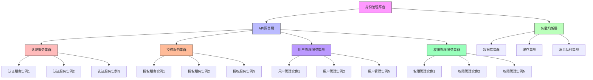

在企业级统一身份治理平台中，性能和扩展性是确保系统能够应对不断增长的用户规模和业务需求的关键因素。随着企业数字化转型的深入，身份治理平台需要处理海量的认证请求、权限检查和用户管理操作。本文将深入探讨如何通过水平扩展和智能缓存策略来提升平台的性能和扩展性。

## 引言

身份治理平台作为企业核心基础设施，其性能表现直接影响用户体验和业务效率。在面对数百万甚至数千万用户规模时，平台必须具备良好的扩展性以应对高并发访问和大数据量处理的挑战。通过合理的架构设计、水平扩展策略和高效的缓存机制，我们可以显著提升平台的响应速度和处理能力。

## 水平扩展架构设计

### 微服务架构与容器化



### 服务拆分策略

```java
public class ServiceDecompositionStrategy {
    
    // 认证服务
    public class AuthenticationService {
        private final UserRepository userRepository;
        private final PasswordEncoder passwordEncoder;
        private final JwtTokenService jwtTokenService;
        private final MfaService mfaService;
        private final SessionService sessionService;
        
        public AuthenticationResponse authenticate(AuthenticationRequest request) {
            // 1. 验证用户凭证
            User user = userRepository.findByUsername(request.getUsername());
            if (user == null || !passwordEncoder.matches(request.getPassword(), user.getPasswordHash())) {
                throw new AuthenticationException("Invalid credentials");
            }
            
            // 2. 执行MFA验证（如果启用）
            if (user.isMfaEnabled()) {
                if (!mfaService.verifyCode(user.getId(), request.getMfaCode())) {
                    throw new AuthenticationException("Invalid MFA code");
                }
            }
            
            // 3. 创建会话
            Session session = sessionService.createSession(user.getId(), request.getSourceIp());
            
            // 4. 生成访问令牌
            String accessToken = jwtTokenService.generateAccessToken(user, session.getId());
            String refreshToken = jwtTokenService.generateRefreshToken(user, session.getId());
            
            // 5. 记录审计日志
            auditService.logAuthentication(user.getId(), request.getSourceIp(), true);
            
            return AuthenticationResponse.builder()
                .accessToken(accessToken)
                .refreshToken(refreshToken)
                .sessionId(session.getId())
                .user(toUserDto(user))
                .build();
        }
    }
    
    // 授权服务
    public class AuthorizationService {
        private final PermissionRepository permissionRepository;
        private final RoleRepository roleRepository;
        private final CacheService cacheService;
        
        public boolean checkPermission(String userId, String resource, String action) {
            // 构建缓存键
            String cacheKey = String.format("permission:%s:%s:%s", userId, resource, action);
            
            // 尝试从缓存获取
            Boolean cachedResult = cacheService.get(cacheKey, Boolean.class);
            if (cachedResult != null) {
                return cachedResult;
            }
            
            // 从数据库检查权限
            boolean hasPermission = permissionRepository.checkUserPermission(userId, resource, action);
            
            // 缓存结果（设置合理的过期时间）
            cacheService.set(cacheKey, hasPermission, Duration.ofMinutes(5));
            
            return hasPermission;
        }
        
        public Set<Permission> getUserPermissions(String userId) {
            String cacheKey = String.format("user_permissions:%s", userId);
            
            // 尝试从缓存获取
            Set<Permission> cachedPermissions = cacheService.get(cacheKey, new TypeReference<Set<Permission>>() {});
            if (cachedPermissions != null) {
                return cachedPermissions;
            }
            
            // 从数据库获取用户权限
            Set<Permission> permissions = permissionRepository.getUserPermissions(userId);
            
            // 缓存结果
            cacheService.set(cacheKey, permissions, Duration.ofMinutes(10));
            
            return permissions;
        }
    }
    
    // 用户管理服务
    public class UserService {
        private final UserRepository userRepository;
        private final OrganizationRepository organizationRepository;
        private final CacheService cacheService;
        
        public User getUserById(String userId) {
            String cacheKey = String.format("user:%s", userId);
            
            // 尝试从缓存获取
            User cachedUser = cacheService.get(cacheKey, User.class);
            if (cachedUser != null) {
                return cachedUser;
            }
            
            // 从数据库获取用户
            User user = userRepository.findById(userId);
            if (user != null) {
                // 缓存用户信息
                cacheService.set(cacheKey, user, Duration.ofHours(1));
            }
            
            return user;
        }
        
        public List<User> searchUsers(UserSearchCriteria criteria) {
            // 对于搜索操作，使用较短的缓存时间或不缓存
            return userRepository.searchUsers(criteria);
        }
    }
}
```

### 容器编排与自动扩缩容

```yaml
# Kubernetes部署配置
apiVersion: apps/v1
kind: Deployment
metadata:
  name: authentication-service
spec:
  replicas: 3
  selector:
    matchLabels:
      app: authentication-service
  template:
    metadata:
      labels:
        app: authentication-service
    spec:
      containers:
      - name: auth-service
        image: identity-platform/auth-service:latest
        ports:
        - containerPort: 8080
        env:
        - name: DATABASE_URL
          valueFrom:
            secretKeyRef:
              name: database-secret
              key: url
        - name: REDIS_URL
          valueFrom:
            secretKeyRef:
              name: redis-secret
              key: url
        resources:
          requests:
            memory: "512Mi"
            cpu: "250m"
          limits:
            memory: "1Gi"
            cpu: "500m"
        readinessProbe:
          httpGet:
            path: /health
            port: 8080
          initialDelaySeconds: 30
          periodSeconds: 10
        livenessProbe:
          httpGet:
            path: /health
            port: 8080
          initialDelaySeconds: 60
          periodSeconds: 30

---
apiVersion: autoscaling/v2
kind: HorizontalPodAutoscaler
metadata:
  name: authentication-service-hpa
spec:
  scaleTargetRef:
    apiVersion: apps/v1
    kind: Deployment
    name: authentication-service
  minReplicas: 3
  maxReplicas: 20
  metrics:
  - type: Resource
    resource:
      name: cpu
      target:
        type: Utilization
        averageUtilization: 70
  - type: Resource
    resource:
      name: memory
      target:
        type: Utilization
        averageUtilization: 80
  behavior:
    scaleDown:
      stabilizationWindowSeconds: 300
      policies:
      - type: Percent
        value: 10
        periodSeconds: 60
    scaleUp:
      stabilizationWindowSeconds: 60
      policies:
      - type: Percent
        value: 50
        periodSeconds: 60
```

## 缓存策略设计

### 多级缓存架构

```python
class MultiLevelCacheStrategy:
    def __init__(self, config):
        self.config = config
        self.l1_cache = LocalCache(config.l1)
        self.l2_cache = DistributedCache(config.l2)
        self.l3_cache = PersistentCache(config.l3)
    
    def get(self, key):
        """多级缓存读取"""
        # L1缓存（本地内存）
        value = self.l1_cache.get(key)
        if value is not None:
            return value
        
        # L2缓存（分布式缓存）
        value = self.l2_cache.get(key)
        if value is not None:
            # 回填到L1缓存
            self.l1_cache.set(key, value, self.config.l1.ttl)
            return value
        
        # L3缓存（持久化存储）
        value = self.l3_cache.get(key)
        if value is not None:
            # 回填到L1和L2缓存
            self.l1_cache.set(key, value, self.config.l1.ttl)
            self.l2_cache.set(key, value, self.config.l2.ttl)
            return value
        
        return None
    
    def set(self, key, value, ttl=None):
        """多级缓存写入"""
        # 同时写入所有层级
        self.l1_cache.set(key, value, ttl or self.config.l1.ttl)
        self.l2_cache.set(key, value, ttl or self.config.l2.ttl)
        self.l3_cache.set(key, value, ttl or self.config.l3.ttl)
    
    def invalidate(self, key):
        """多级缓存失效"""
        self.l1_cache.invalidate(key)
        self.l2_cache.invalidate(key)
        self.l3_cache.invalidate(key)
```

### 权限缓存策略

```sql
-- 权限缓存策略配置表
CREATE TABLE permission_cache_policies (
    id VARCHAR(50) PRIMARY KEY,
    policy_name VARCHAR(100) NOT NULL,
    resource_type VARCHAR(50) NOT NULL,
    cache_strategy VARCHAR(50) NOT NULL,  -- USER_LEVEL, ROLE_LEVEL, RESOURCE_LEVEL
    ttl_seconds INT NOT NULL,  -- 缓存时间（秒）
    max_cache_size INT DEFAULT 10000,
    eviction_policy VARCHAR(50) DEFAULT 'LRU',  -- LRU, LFU, FIFO
    warm_up_enabled BOOLEAN DEFAULT FALSE,
    warm_up_cron VARCHAR(100),
    active BOOLEAN DEFAULT TRUE,
    created_at TIMESTAMP DEFAULT CURRENT_TIMESTAMP,
    updated_at TIMESTAMP DEFAULT CURRENT_TIMESTAMP ON UPDATE CURRENT_TIMESTAMP
);

-- 用户权限缓存表
CREATE TABLE user_permission_cache (
    user_id VARCHAR(50) NOT NULL,
    resource_id VARCHAR(50) NOT NULL,
    action VARCHAR(50) NOT NULL,
    has_permission BOOLEAN NOT NULL,
    cached_at TIMESTAMP NOT NULL,
    expires_at TIMESTAMP NOT NULL,
    cache_key VARCHAR(200) NOT NULL,
    
    PRIMARY KEY (user_id, resource_id, action),
    INDEX idx_user_id (user_id),
    INDEX idx_expires_at (expires_at),
    INDEX idx_cache_key (cache_key)
);

-- 角色权限缓存表
CREATE TABLE role_permission_cache (
    role_id VARCHAR(50) NOT NULL,
    resource_id VARCHAR(50) NOT NULL,
    action VARCHAR(50) NOT NULL,
    permission_type VARCHAR(20) NOT NULL,  -- ALLOW, DENY
    cached_at TIMESTAMP NOT NULL,
    expires_at TIMESTAMP NOT NULL,
    
    PRIMARY KEY (role_id, resource_id, action),
    INDEX idx_role_id (role_id),
    INDEX idx_expires_at (expires_at)
);

-- 缓存统计信息表
CREATE TABLE cache_statistics (
    id VARCHAR(50) PRIMARY KEY,
    cache_type VARCHAR(50) NOT NULL,  -- PERMISSION, USER, SESSION
    hit_count BIGINT DEFAULT 0,
    miss_count BIGINT DEFAULT 0,
    eviction_count BIGINT DEFAULT 0,
    average_hit_ratio DECIMAL(5,4),
    recorded_at TIMESTAMP DEFAULT CURRENT_TIMESTAMP,
    
    INDEX idx_cache_type (cache_type),
    INDEX idx_recorded_at (recorded_at)
);
```

### 智能缓存预热

```java
public class IntelligentCacheWarmingService {
    private final CacheService cacheService;
    private final UserService userService;
    private final PermissionService permissionService;
    private final ScheduledExecutorService scheduler;
    
    // 权限缓存预热
    public void warmUpPermissionCache() {
        // 获取活跃用户列表
        List<String> activeUsers = userService.getActiveUsers(Duration.ofDays(7));
        
        // 获取热门资源列表
        List<String> popularResources = getPopularResources();
        
        // 获取常用操作列表
        List<String> commonActions = getCommonActions();
        
        // 预热用户权限缓存
        for (String userId : activeUsers) {
            for (String resourceId : popularResources) {
                for (String action : commonActions) {
                    try {
                        // 异步预热缓存
                        CompletableFuture.runAsync(() -> {
                            boolean hasPermission = permissionService.checkUserPermission(userId, resourceId, action);
                            String cacheKey = String.format("permission:%s:%s:%s", userId, resourceId, action);
                            cacheService.set(cacheKey, hasPermission, Duration.ofMinutes(30));
                        });
                    } catch (Exception e) {
                        log.warn("Failed to warm up permission cache for user: {}, resource: {}, action: {}", 
                                userId, resourceId, action, e);
                    }
                }
            }
        }
    }
    
    // 用户信息缓存预热
    public void warmUpUserCache() {
        // 获取最近活跃的用户
        List<String> recentActiveUsers = userService.getRecentActiveUsers(Duration.ofHours(24));
        
        // 批量预热用户信息缓存
        List<List<String>> batches = partition(recentActiveUsers, 100);
        for (List<String> batch : batches) {
            try {
                // 批量获取用户信息
                Map<String, User> users = userService.getUsersByIds(batch);
                
                // 批量写入缓存
                for (Map.Entry<String, User> entry : users.entrySet()) {
                    String cacheKey = String.format("user:%s", entry.getKey());
                    cacheService.set(cacheKey, entry.getValue(), Duration.ofHours(2));
                }
            } catch (Exception e) {
                log.warn("Failed to warm up user cache for batch: {}", batch, e);
            }
        }
    }
    
    // 定时缓存预热
    public void scheduleCacheWarming() {
        // 权限缓存预热（每天凌晨2点）
        scheduler.scheduleAtFixedRate(
            this::warmUpPermissionCache,
            calculateInitialDelay(2, 0),  // 凌晨2点
            TimeUnit.DAYS.toSeconds(1),
            TimeUnit.SECONDS
        );
        
        // 用户缓存预热（每小时）
        scheduler.scheduleAtFixedRate(
            this::warmUpUserCache,
            0,
            TimeUnit.HOURS.toSeconds(1),
            TimeUnit.SECONDS
        );
    }
    
    // 动态调整缓存策略
    public void adjustCacheStrategyBasedOnUsage() {
        // 获取缓存使用统计
        CacheStatistics stats = cacheService.getStatistics();
        
        // 根据命中率调整TTL
        if (stats.getHitRatio() > 0.95) {
            // 高命中率，延长TTL
            cacheService.adjustDefaultTTL(Duration.ofMinutes(60));
        } else if (stats.getHitRatio() < 0.7) {
            // 低命中率，缩短TTL
            cacheService.adjustDefaultTTL(Duration.ofMinutes(10));
        }
        
        // 根据缓存大小调整最大缓存项数
        long currentSize = cacheService.getCurrentSize();
        long maxSize = cacheService.getMaxSize();
        
        if (currentSize > maxSize * 0.9) {
            // 缓存使用率高，增加最大缓存项数
            cacheService.setMaxSize((long)(maxSize * 1.2));
        } else if (currentSize < maxSize * 0.3) {
            // 缓存使用率低，减少最大缓存项数
            cacheService.setMaxSize((long)(maxSize * 0.8));
        }
    }
}
```

## 数据库性能优化

### 查询优化

```javascript
// 数据库查询优化服务
class DatabaseOptimizationService {
  constructor(dbClient, queryAnalyzer) {
    this.dbClient = dbClient;
    this.queryAnalyzer = queryAnalyzer;
  }
  
  // 优化权限查询
  async optimizePermissionQuery(userId, resource, action) {
    // 使用联合索引优化查询
    const optimizedQuery = `
      SELECT p.permission_id, p.allow_deny
      FROM user_permissions up
      JOIN permissions p ON up.permission_id = p.permission_id
      WHERE up.user_id = ? 
        AND p.resource_id = ? 
        AND p.action = ?
        AND up.expires_at > NOW()
      UNION
      SELECT p.permission_id, p.allow_deny
      FROM user_roles ur
      JOIN role_permissions rp ON ur.role_id = rp.role_id
      JOIN permissions p ON rp.permission_id = p.permission_id
      WHERE ur.user_id = ?
        AND p.resource_id = ?
        AND p.action = ?
        AND ur.expires_at > NOW()
        AND rp.expires_at > NOW()
    `;
    
    const params = [userId, resource, action, userId, resource, action];
    return await this.dbClient.query(optimizedQuery, params);
  }
  
  // 批量权限检查
  async batchPermissionCheck(userId, permissions) {
    // 构建批量查询
    const placeholders = permissions.map(() => '(?, ?, ?)').join(', ');
    const params = [];
    
    permissions.forEach(perm => {
      params.push(userId, perm.resource, perm.action);
    });
    
    const batchQuery = `
      SELECT 
        up.user_id,
        p.resource_id,
        p.action,
        CASE 
          WHEN COUNT(up.permission_id) > 0 THEN TRUE 
          ELSE FALSE 
        END as has_permission
      FROM (VALUES ${placeholders}) as requested(user_id, resource_id, action)
      LEFT JOIN user_permissions up ON up.user_id = requested.user_id
      LEFT JOIN permissions p ON up.permission_id = p.permission_id 
        AND p.resource_id = requested.resource_id 
        AND p.action = requested.action
      GROUP BY up.user_id, p.resource_id, p.action
    `;
    
    return await this.dbClient.query(batchQuery, params);
  }
  
  // 分页查询优化
  async optimizedPagination(query, params, page, pageSize) {
    // 使用游标分页替代OFFSET分页
    const paginatedQuery = `
      ${query}
      ORDER BY id
      LIMIT ? 
      ${params.cursor ? 'AND id > ?' : ''}
    `;
    
    const paginationParams = [...params.values];
    if (params.cursor) {
      paginationParams.push(pageSize, params.cursor);
    } else {
      paginationParams.push(pageSize);
    }
    
    return await this.dbClient.query(paginatedQuery, paginationParams);
  }
}
```

### 读写分离

```sql
-- 读写分离配置视图
CREATE VIEW read_write_separation_config AS
SELECT 
    service_name,
    master_db_host,
    master_db_port,
    slave_db_hosts,
    read_weight,
    write_weight,
    failover_strategy,
    connection_pool_size,
    max_idle_connections,
    connection_timeout,
    query_timeout
FROM database_config 
WHERE active = TRUE;

-- 查询性能监控视图
CREATE VIEW query_performance_monitor AS
SELECT 
    query_type,
    AVG(execution_time_ms) as avg_execution_time,
    MAX(execution_time_ms) as max_execution_time,
    MIN(execution_time_ms) as min_execution_time,
    COUNT(*) as execution_count,
    COUNT(CASE WHEN execution_time_ms > 1000 THEN 1 END) as slow_queries,
    ROUND(COUNT(CASE WHEN execution_time_ms > 1000 THEN 1 END) * 100.0 / COUNT(*), 2) as slow_query_percentage
FROM query_execution_log 
WHERE executed_at > DATE_SUB(NOW(), INTERVAL 1 HOUR)
GROUP BY query_type
ORDER BY avg_execution_time DESC;
```

## 负载测试和性能调优

### 性能基准测试

```java
public class PerformanceBenchmarkingService {
    private final LoadTestingService loadTestingService;
    private final MetricsService metricsService;
    
    // 认证性能测试
    public PerformanceTestResult benchmarkAuthentication(int concurrentUsers, int totalRequests) {
        PerformanceTestConfig config = PerformanceTestConfig.builder()
            .testName("Authentication Performance Test")
            .concurrentUsers(concurrentUsers)
            .totalRequests(totalRequests)
            .testDuration(Duration.ofMinutes(10))
            .rampUpPeriod(Duration.ofMinutes(2))
            .build();
        
        // 定义测试场景
        TestScenario authScenario = TestScenario.builder()
            .name("User Authentication")
            .steps(Arrays.asList(
                TestStep.builder()
                    .name("Login Request")
                    .action(() -> performLogin())
                    .expectedResponseTime(Duration.ofMillis(500))
                    .build(),
                TestStep.builder()
                    .name("Token Validation")
                    .action(() -> validateToken())
                    .expectedResponseTime(Duration.ofMillis(100))
                    .build()
            ))
            .build();
        
        // 执行性能测试
        PerformanceTestResult result = loadTestingService.executeTest(config, authScenario);
        
        // 记录测试结果
        metricsService.recordPerformanceTestResult(result);
        
        return result;
    }
    
    // 权限检查性能测试
    public PerformanceTestResult benchmarkAuthorization(int concurrentUsers, int totalRequests) {
        PerformanceTestConfig config = PerformanceTestConfig.builder()
            .testName("Authorization Performance Test")
            .concurrentUsers(concurrentUsers)
            .totalRequests(totalRequests)
            .testDuration(Duration.ofMinutes(10))
            .build();
        
        TestScenario authzScenario = TestScenario.builder()
            .name("Permission Check")
            .steps(Arrays.asList(
                TestStep.builder()
                    .name("Permission Verification")
                    .action(() -> checkPermission())
                    .expectedResponseTime(Duration.ofMillis(50))
                    .build()
            ))
            .build();
        
        return loadTestingService.executeTest(config, authzScenario);
    }
    
    // 压力测试
    public StressTestResult performStressTest() {
        StressTestConfig config = StressTestConfig.builder()
            .initialLoad(1000)
            .maxLoad(10000)
            .stepSize(1000)
            .durationPerStep(Duration.ofMinutes(5))
            .build();
        
        StressTestResult result = loadTestingService.executeStressTest(config);
        
        // 分析性能拐点
        PerformanceBreakpoint breakpoint = analyzePerformanceBreakpoint(result);
        
        return StressTestResult.builder()
            .stressTestResult(result)
            .breakpoint(breakpoint)
            .recommendations(generateOptimizationRecommendations(breakpoint))
            .build();
    }
    
    private PerformanceBreakpoint analyzePerformanceBreakpoint(StressTestResult result) {
        List<LoadTestSample> samples = result.getSamples();
        
        // 查找响应时间急剧增加的点
        for (int i = 1; i < samples.size(); i++) {
            LoadTestSample current = samples.get(i);
            LoadTestSample previous = samples.get(i - 1);
            
            double responseTimeIncrease = (current.getAvgResponseTime() - previous.getAvgResponseTime()) 
                                        / previous.getAvgResponseTime();
            
            if (responseTimeIncrease > 0.5) {  // 响应时间增加超过50%
                return PerformanceBreakpoint.builder()
                    .breakpointLoad(current.getConcurrentUsers())
                    .responseTimeAtBreakpoint(current.getAvgResponseTime())
                    .errorRateAtBreakpoint(current.getErrorRate())
                    .build();
            }
        }
        
        return null;
    }
}
```

### 性能监控和调优

```python
class PerformanceMonitoringService:
    def __init__(self, metrics_client, alert_service):
        self.metrics_client = metrics_client
        self.alert_service = alert_service
        self.performance_thresholds = {
            'authentication_latency': 500,  # ms
            'authorization_latency': 50,     # ms
            'user_lookup_latency': 100,      # ms
            'error_rate': 0.01,              # 1%
            'cpu_utilization': 0.8,          # 80%
            'memory_utilization': 0.85       # 85%
        }
    
    def monitor_performance_metrics(self):
        """监控性能指标"""
        metrics = self.collect_performance_metrics()
        
        # 检查各项指标是否超出阈值
        alerts = []
        
        if metrics['authentication_latency'] > self.performance_thresholds['authentication_latency']:
            alerts.append({
                'type': 'HIGH_AUTHENTICATION_LATENCY',
                'severity': 'WARNING',
                'message': f"Authentication latency is high: {metrics['authentication_latency']}ms",
                'current_value': metrics['authentication_latency'],
                'threshold': self.performance_thresholds['authentication_latency']
            })
        
        if metrics['authorization_latency'] > self.performance_thresholds['authorization_latency']:
            alerts.append({
                'type': 'HIGH_AUTHORIZATION_LATENCY',
                'severity': 'WARNING',
                'message': f"Authorization latency is high: {metrics['authorization_latency']}ms",
                'current_value': metrics['authorization_latency'],
                'threshold': self.performance_thresholds['authorization_latency']
            })
        
        if metrics['error_rate'] > self.performance_thresholds['error_rate']:
            alerts.append({
                'type': 'HIGH_ERROR_RATE',
                'severity': 'CRITICAL',
                'message': f"Error rate is high: {metrics['error_rate'] * 100}%",
                'current_value': metrics['error_rate'],
                'threshold': self.performance_thresholds['error_rate']
            })
        
        # 发送告警
        for alert in alerts:
            self.alert_service.send_alert(alert)
    
    def collect_performance_metrics(self):
        """收集性能指标"""
        return {
            'authentication_latency': self.metrics_client.get_gauge('authentication.latency'),
            'authorization_latency': self.metrics_client.get_gauge('authorization.latency'),
            'user_lookup_latency': self.metrics_client.get_gauge('user.lookup.latency'),
            'error_rate': self.metrics_client.get_gauge('error.rate'),
            'cpu_utilization': self.metrics_client.get_gauge('cpu.utilization'),
            'memory_utilization': self.metrics_client.get_gauge('memory.utilization'),
            'active_sessions': self.metrics_client.get_gauge('sessions.active'),
            'requests_per_second': self.metrics_client.get_gauge('requests.per_second')
        }
    
    def generate_performance_report(self, time_range='24h'):
        """生成性能报告"""
        metrics_history = self.metrics_client.get_metrics_history(time_range)
        
        report = {
            'report_period': time_range,
            'generated_at': datetime.utcnow(),
            'performance_summary': self._calculate_performance_summary(metrics_history),
            'trend_analysis': self._analyze_performance_trends(metrics_history),
            'bottleneck_identification': self._identify_performance_bottlenecks(metrics_history),
            'optimization_recommendations': self._generate_optimization_recommendations(metrics_history)
        }
        
        return report
    
    def _calculate_performance_summary(self, metrics_history):
        """计算性能摘要"""
        return {
            'avg_authentication_latency': self._calculate_average(metrics_history, 'authentication.latency'),
            'avg_authorization_latency': self._calculate_average(metrics_history, 'authorization.latency'),
            'peak_requests_per_second': self._calculate_peak(metrics_history, 'requests.per_second'),
            'avg_error_rate': self._calculate_average(metrics_history, 'error.rate'),
            'uptime_percentage': self._calculate_uptime_percentage(metrics_history)
        }
```

## 总结

性能与扩展性是企业级统一身份治理平台成功的关键因素。通过实施水平扩展架构、智能缓存策略和数据库性能优化，我们可以显著提升平台的处理能力和响应速度。

关键要点包括：

1. **水平扩展**：采用微服务架构和容器化技术，实现服务的水平扩展和自动扩缩容
2. **多级缓存**：设计L1、L2、L3多级缓存架构，优化权限和用户信息的访问性能
3. **数据库优化**：通过查询优化、读写分离和索引策略提升数据库性能
4. **性能监控**：建立完善的性能监控体系，及时发现和解决性能瓶颈

在实际实施过程中，需要根据业务特点和性能要求，选择合适的架构方案和技术组件。同时，定期进行性能测试和调优，确保平台能够持续满足业务发展的需求。