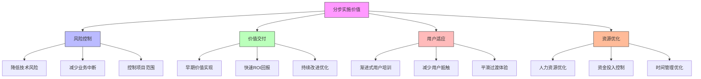

在企业级统一身份治理平台的建设过程中，分步实施与迁移策略是确保项目成功的关键因素。由于身份治理平台通常需要与企业现有的多个系统集成，并且涉及大量的用户数据和权限配置，一次性全面切换往往风险巨大。通过科学的分步实施和迁移策略，企业可以有效控制项目风险，确保业务连续性，并逐步实现身份治理的目标。

## 引言

统一身份治理平台的建设是一个复杂的系统工程，涉及技术架构、业务流程、组织变革等多个维度。对于大型企业而言，现有系统往往已经运行多年，积累了大量的用户数据和权限配置，直接进行系统替换可能导致业务中断和数据丢失。因此，制定科学合理的分步实施与迁移策略显得尤为重要。

## 分步实施的重要性

分步实施策略的核心价值在于风险控制和价值交付：



### 风险控制

分步实施能够有效控制以下风险：

1. **技术风险**：通过小范围试点验证技术方案的可行性
2. **业务风险**：避免大规模业务中断，确保业务连续性
3. **数据风险**：分阶段迁移数据，降低数据丢失风险
4. **组织风险**：减少组织变革阻力，提高用户接受度

### 价值交付

分步实施确保在项目早期就能交付业务价值：

```java
public class ImplementationValueDelivery {
    
    // 价值交付阶段
    public enum ValueDeliveryPhase {
        PHASE_1_PILOT(1, "试点项目", "快速赢得信任", 30),  // 30天内交付价值
        PHASE_2_ESSENTIAL(2, "核心功能", "满足基本需求", 90),  // 3个月内交付核心价值
        PHASE_3_ADVANCED(3, "高级特性", "提升用户体验", 180), // 6个月内交付完整价值
        PHASE_4_OPTIMIZATION(4, "优化完善", "持续改进", 365); // 1年内完成优化
        
        private final int phaseNumber;
        private final String phaseName;
        private final String objective;
        private final int targetDays;
        
        ValueDeliveryPhase(int phaseNumber, String phaseName, String objective, int targetDays) {
            this.phaseNumber = phaseNumber;
            this.phaseName = phaseName;
            this.objective = objective;
            this.targetDays = targetDays;
        }
        
        // getters...
    }
    
    // 价值评估模型
    public class ValueAssessmentModel {
        private final Map<String, Double> valueWeights;
        
        public ValueAssessmentModel() {
            this.valueWeights = Map.of(
                "businessImpact", 0.3,      // 业务影响权重
                "userExperience", 0.25,     // 用户体验权重
                "securityEnhancement", 0.2, // 安全性提升权重
                "operationalEfficiency", 0.15, // 运营效率权重
                "compliance", 0.1          // 合规性权重
            );
        }
        
        public double calculatePhaseValue(ImplementationPhase phase) {
            double totalValue = 0.0;
            
            for (Map.Entry<String, Double> entry : valueWeights.entrySet()) {
                String factor = entry.getKey();
                double weight = entry.getValue();
                double score = getFactorScore(phase, factor);
                totalValue += weight * score;
            }
            
            return totalValue;
        }
        
        private double getFactorScore(ImplementationPhase phase, String factor) {
            switch (factor) {
                case "businessImpact":
                    return phase.getBusinessImpactScore();
                case "userExperience":
                    return phase.getUserExperienceScore();
                case "securityEnhancement":
                    return phase.getSecurityEnhancementScore();
                case "operationalEfficiency":
                    return phase.getOperationalEfficiencyScore();
                case "compliance":
                    return phase.getComplianceScore();
                default:
                    return 0.0;
            }
        }
    }
}
```

## 迁移策略设计

### 迁移方法论

企业级身份治理平台的迁移通常采用以下几种方法：

```python
class MigrationStrategy:
    def __init__(self):
        self.strategies = {
            'big_bang': {
                'name': '大爆炸式迁移',
                'description': '一次性全面切换到新系统',
                'pros': ['统一性好', '实施周期短'],
                'cons': ['风险高', '业务中断大'],
                '适用场景': ['小型组织', '新业务系统']
            },
            'parallel_run': {
                'name': '并行运行',
                'description': '新旧系统并行运行一段时间',
                'pros': ['风险低', '可回退'],
                'cons': ['成本高', '维护复杂'],
                '适用场景': ['核心业务系统', '数据敏感场景']
            },
            'phased_approach': {
                'name': '分阶段迁移',
                'description': '按业务模块或用户群体分阶段迁移',
                'pros': ['风险可控', '价值逐步交付'],
                'cons': ['实施周期长', '集成复杂'],
                '适用场景': ['大型企业', '复杂系统环境']
            },
            'hybrid_migration': {
                'name': '混合迁移',
                'description': '结合多种方法的混合策略',
                'pros': ['灵活性高', '风险收益平衡'],
                'cons': ['策略复杂', '管理难度大'],
                '适用场景': ['超大型企业', '多业务线组织']
            }
        }
    
    def recommend_strategy(self, organization_profile):
        """根据组织特征推荐迁移策略"""
        org_size = organization_profile.get('size')
        business_criticality = organization_profile.get('business_criticality')
        it_maturity = organization_profile.get('it_maturity')
        budget_constraint = organization_profile.get('budget_constraint')
        
        # 基于特征评分推荐策略
        scores = {}
        for strategy_name, strategy in self.strategies.items():
            score = self._calculate_strategy_score(
                strategy_name, 
                org_size, 
                business_criticality, 
                it_maturity, 
                budget_constraint
            )
            scores[strategy_name] = score
        
        # 返回得分最高的策略
        recommended_strategy = max(scores, key=scores.get)
        return self.strategies[recommended_strategy]
    
    def _calculate_strategy_score(self, strategy_name, org_size, business_criticality, it_maturity, budget_constraint):
        """计算策略得分"""
        # 实现评分逻辑
        score = 0
        
        if strategy_name == 'phased_approach':
            if org_size == 'large':
                score += 30
            if business_criticality == 'high':
                score += 25
            if it_maturity == 'medium':
                score += 20
            if budget_constraint == 'moderate':
                score += 25
        # 其他策略的评分逻辑...
        
        return score
```

### 数据迁移策略

```sql
-- 数据迁移策略配置表
CREATE TABLE data_migration_strategies (
    id VARCHAR(50) PRIMARY KEY,
    strategy_name VARCHAR(100) NOT NULL,
    source_system VARCHAR(100) NOT NULL,
    target_system VARCHAR(100) NOT NULL,
    data_type VARCHAR(50) NOT NULL,  -- USER, PERMISSION, ROLE, AUDIT
    migration_method VARCHAR(50) NOT NULL,  -- BATCH, REALTIME, HYBRID
    batch_size INT DEFAULT 1000,
    parallel_threads INT DEFAULT 4,
    validation_required BOOLEAN DEFAULT TRUE,
    rollback_supported BOOLEAN DEFAULT TRUE,
    estimated_duration_hours INT,
    risk_level VARCHAR(20) NOT NULL,  -- LOW, MEDIUM, HIGH, CRITICAL
    created_at TIMESTAMP DEFAULT CURRENT_TIMESTAMP,
    updated_at TIMESTAMP DEFAULT CURRENT_TIMESTAMP ON UPDATE CURRENT_TIMESTAMP
);

-- 数据迁移任务表
CREATE TABLE data_migration_tasks (
    id VARCHAR(50) PRIMARY KEY,
    strategy_id VARCHAR(50) NOT NULL,
    task_name VARCHAR(200) NOT NULL,
    task_type VARCHAR(50) NOT NULL,  -- EXTRACT, TRANSFORM, LOAD, VALIDATE
    source_query TEXT,
    target_table VARCHAR(100),
    status VARCHAR(20) NOT NULL,  -- PENDING, IN_PROGRESS, COMPLETED, FAILED
    start_time TIMESTAMP NULL,
    end_time TIMESTAMP NULL,
    records_processed INT DEFAULT 0,
    records_failed INT DEFAULT 0,
    error_message TEXT,
    retry_count INT DEFAULT 0,
    max_retries INT DEFAULT 3,
    
    FOREIGN KEY (strategy_id) REFERENCES data_migration_strategies(id),
    INDEX idx_status (status),
    INDEX idx_strategy_id (strategy_id)
);

-- 数据迁移监控视图
CREATE VIEW migration_progress_monitor AS
SELECT 
    dms.strategy_name,
    dms.source_system,
    dms.target_system,
    COUNT(dmt.id) as total_tasks,
    COUNT(CASE WHEN dmt.status = 'COMPLETED' THEN 1 END) as completed_tasks,
    COUNT(CASE WHEN dmt.status = 'FAILED' THEN 1 END) as failed_tasks,
    ROUND(COUNT(CASE WHEN dmt.status = 'COMPLETED' THEN 1 END) * 100.0 / COUNT(dmt.id), 2) as completion_percentage,
    SUM(dmt.records_processed) as total_records_processed,
    SUM(dmt.records_failed) as total_records_failed,
    MAX(dmt.end_time) as last_updated
FROM data_migration_strategies dms
LEFT JOIN data_migration_tasks dmt ON dms.id = dmt.strategy_id
GROUP BY dms.id, dms.strategy_name, dms.source_system, dms.target_system;
```

## 本章内容概览

在本章中，我们将深入探讨以下关键主题：

### 11.1 试点项目选择与实施
- 试点项目的选择标准和评估方法
- 试点实施的范围界定和目标设定
- 试点项目的执行计划和风险控制
- 试点成果的评估和经验总结

### 11.2 老旧系统迁移策略
- 并行运行策略的设计和实施
- 灰度切流机制的实现
- 数据同步和一致性保障
- 回滚方案和应急处理

### 11.3 用户教育与变革管理
- 用户培训计划的制定和执行
- 变革管理框架和实施路径
- 用户接受度提升策略
- 持续支持和反馈机制

## 实施建议

在制定分步实施与迁移策略时，建议遵循以下原则：

1. **价值驱动**：优先实施能够快速交付业务价值的功能模块
2. **风险控制**：通过小范围试点验证方案可行性，逐步扩大实施范围
3. **用户中心**：充分考虑用户体验，减少对用户日常工作的影响
4. **技术可行**：确保技术方案的成熟度和稳定性
5. **资源平衡**：合理分配人力、财力和时间资源

## 成功关键因素

分步实施与迁移的成功依赖于以下关键因素：

```javascript
// 成功关键因素评估模型
class SuccessFactorAssessment {
  constructor() {
    this.successFactors = {
      'leadershipSupport': {
        'weight': 0.2,
        'description': '高层领导支持',
        'indicators': ['项目预算保障', '资源投入', '决策支持']
      },
      'stakeholderEngagement': {
        'weight': 0.15,
        'description': '利益相关者参与',
        'indicators': ['用户需求收集', '反馈机制', '沟通频率']
      },
      'technicalReadiness': {
        'weight': 0.2,
        'description': '技术准备度',
        'indicators': ['架构设计', '集成能力', '性能测试']
      },
      'changeManagement': {
        'weight': 0.15,
        'description': '变革管理',
        'indicators': ['培训计划', '用户接受度', '组织适应性']
      },
      'projectManagement': {
        'weight': 0.15,
        'description': '项目管理',
        'indicators': ['进度控制', '风险管理', '质量保证']
      },
      'vendorPartnership': {
        'weight': 0.1,
        'description': '供应商合作',
        'indicators': ['技术支持', '服务响应', '合作机制']
      },
      'measurementTracking': {
        'weight': 0.05,
        'description': '度量跟踪',
        'indicators': ['KPI设定', '进度监控', '效果评估']
      }
    };
  }
  
  assessProjectReadiness(project) {
    let totalScore = 0;
    let maxScore = 0;
    const factorScores = {};
    
    for (const [factorName, factor] of Object.entries(this.successFactors)) {
      const score = this.evaluateFactor(project, factorName);
      factorScores[factorName] = score;
      totalScore += score * factor.weight;
      maxScore += factor.weight;
    }
    
    const overallReadiness = totalScore / maxScore;
    
    return {
      overallReadiness: overallReadiness,
      factorScores: factorScores,
      recommendations: this.generateRecommendations(factorScores)
    };
  }
  
  generateRecommendations(factorScores) {
    const recommendations = [];
    
    for (const [factorName, score] of Object.entries(factorScores)) {
      if (score < 0.7) {  // 低于70%需要改进
        recommendations.push({
          factor: factorName,
          priority: 'HIGH',
          actions: this.getImprovementActions(factorName)
        });
      } else if (score < 0.85) {  // 70%-85%可以优化
        recommendations.push({
          factor: factorName,
          priority: 'MEDIUM',
          actions: this.getOptimizationActions(factorName)
        });
      }
    }
    
    return recommendations;
  }
}
```

## 总结

分步实施与迁移策略是企业级统一身份治理平台成功建设的重要保障。通过科学的策略设计、合理的阶段划分和有效的风险控制，企业可以在确保业务连续性的同时，逐步实现身份治理的目标。

在后续章节中，我们将详细探讨试点项目的选择与实施、老旧系统迁移的具体策略、用户教育与变革管理的最佳实践，为企业提供全面的实施指导。