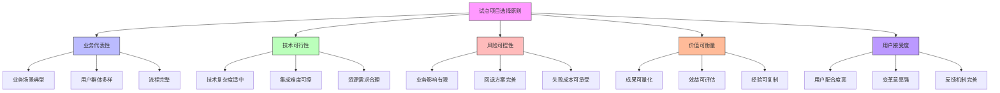

在企业级统一身份治理平台的建设过程中，试点项目是验证技术方案可行性、积累实施经验、赢得用户信任的关键步骤。通过精心选择和成功实施试点项目，企业可以有效降低全面推广的风险，为后续的大规模部署奠定坚实基础。

## 引言

试点项目作为身份治理平台建设的第一步，其成功与否直接影响整个项目的推进效果。一个成功的试点项目不仅能够验证技术方案的可行性，还能展示平台的价值，增强利益相关者的信心，为全面推广创造有利条件。因此，科学地选择试点项目并精心组织实施显得尤为重要。

## 试点项目选择标准

### 选择原则

试点项目的选择应遵循以下核心原则：



### 评估框架

```java
public class PilotProjectSelectionFramework {
    
    // 试点项目评估维度
    public enum EvaluationDimension {
        BUSINESS_REPRESENTATIVENESS(0.25, "业务代表性"),
        TECHNICAL_FEASIBILITY(0.20, "技术可行性"),
        RISK_CONTROLLABILITY(0.20, "风险可控性"),
        VALUE_MEASURABILITY(0.20, "价值可衡量"),
        USER_ACCEPTANCE(0.15, "用户接受度");
        
        private final double weight;
        private final String description;
        
        EvaluationDimension(double weight, String description) {
            this.weight = weight;
            this.description = description;
        }
        
        // getters...
    }
    
    // 试点项目评估模型
    public class PilotProjectEvaluationModel {
        private final Map<EvaluationDimension, ScoringCriteria> scoringCriteria;
        
        public PilotProjectEvaluationModel() {
            this.scoringCriteria = Map.of(
                EvaluationDimension.BUSINESS_REPRESENTATIVENESS, 
                new ScoringCriteria(1, 10, Map.of(
                    1, "业务场景过于简单，缺乏代表性",
                    5, "业务场景具有一定代表性",
                    10, "业务场景全面，具有典型性"
                )),
                
                EvaluationDimension.TECHNICAL_FEASIBILITY,
                new ScoringCriteria(1, 10, Map.of(
                    1, "技术实现难度极高，风险很大",
                    5, "技术实现难度适中，风险可控",
                    10, "技术实现简单，风险极低"
                )),
                
                EvaluationDimension.RISK_CONTROLLABILITY,
                new ScoringCriteria(1, 10, Map.of(
                    1, "风险极高，难以控制",
                    5, "风险中等，基本可控",
                    10, "风险极低，完全可控"
                )),
                
                EvaluationDimension.VALUE_MEASURABILITY,
                new ScoringCriteria(1, 10, Map.of(
                    1, "价值难以衡量，效果不明显",
                    5, "价值可以衡量，效果一般",
                    10, "价值易于衡量，效果显著"
                )),
                
                EvaluationDimension.USER_ACCEPTANCE,
                new ScoringCriteria(1, 10, Map.of(
                    1, "用户抵触情绪强烈，接受度极低",
                    5, "用户有一定抵触，接受度一般",
                    10, "用户积极配合，接受度极高"
                ))
            );
        }
        
        public double evaluateProject(PotentialPilotProject project) {
            double totalScore = 0.0;
            
            for (EvaluationDimension dimension : EvaluationDimension.values()) {
                double dimensionScore = scoreDimension(project, dimension);
                double weightedScore = dimensionScore * dimension.getWeight();
                totalScore += weightedScore;
            }
            
            return totalScore;
        }
        
        private double scoreDimension(PotentialPilotProject project, EvaluationDimension dimension) {
            ScoringCriteria criteria = scoringCriteria.get(dimension);
            // 根据项目特征进行评分
            return criteria.scoreProject(project, dimension);
        }
    }
    
    // 潜在试点项目
    public class PotentialPilotProject {
        private String projectName;
        private String businessUnit;
        private int userCount;
        private List<String> existingSystems;
        private String complexityLevel;
        private String userAcceptanceLevel;
        private ExpectedOutcomes expectedOutcomes;
        private ImplementationConstraints constraints;
        
        // 项目特征评估
        public ProjectCharacteristics assessCharacteristics() {
            return ProjectCharacteristics.builder()
                .businessRepresentativeness(calculateBusinessRepresentativeness())
                .technicalFeasibility(assessTechnicalFeasibility())
                .riskLevel(assessRiskLevel())
                .valuePotential(assessValuePotential())
                .userAcceptance(assessUserAcceptance())
                .build();
        }
        
        private int calculateBusinessRepresentativeness() {
            // 基于业务单元重要性、用户数量、系统集成复杂度等计算
            int score = 0;
            if (userCount > 1000) score += 3;
            if (existingSystems.size() > 3) score += 3;
            if (businessUnit.equals("核心业务")) score += 4;
            return Math.min(score, 10);
        }
        
        private int assessTechnicalFeasibility() {
            // 基于技术复杂度、集成难度、资源需求等评估
            int score = 10;
            if (complexityLevel.equals("HIGH")) score -= 4;
            if (existingSystems.size() > 5) score -= 3;
            return Math.max(score, 1);
        }
        
        // 其他评估方法...
    }
}
```

### 选择流程

```python
class PilotProjectSelectionProcess:
    def __init__(self, evaluation_framework):
        self.evaluation_framework = evaluation_framework
        self.potential_projects = []
        self.selected_projects = []
    
    def identify_potential_projects(self, organization_scope):
        """识别潜在试点项目"""
        # 收集候选项目
        candidate_projects = self._collect_candidate_projects(organization_scope)
        
        # 初步筛选
        qualified_projects = self._preliminary_screening(candidate_projects)
        
        # 详细评估
        evaluated_projects = self._detailed_evaluation(qualified_projects)
        
        self.potential_projects = evaluated_projects
        return evaluated_projects
    
    def _collect_candidate_projects(self, organization_scope):
        """收集候选项目"""
        candidates = []
        
        # 通过调研收集候选项目
        survey_results = self._conduct_survey(organization_scope)
        for result in survey_results:
            project = PotentialPilotProject(
                name=result['project_name'],
                business_unit=result['business_unit'],
                user_count=result['user_count'],
                existing_systems=result['existing_systems'],
                complexity=result['complexity'],
                stakeholders=result['stakeholders']
            )
            candidates.append(project)
        
        return candidates
    
    def _detailed_evaluation(self, projects):
        """详细评估项目"""
        evaluated_projects = []
        
        for project in projects:
            # 多维度评估
            evaluation_score = self.evaluation_framework.evaluate_project(project)
            
            # 专家评审
            expert_score = self._expert_review(project)
            
            # 综合得分
            final_score = (evaluation_score * 0.7) + (expert_score * 0.3)
            
            evaluated_project = {
                'project': project,
                'evaluation_score': evaluation_score,
                'expert_score': expert_score,
                'final_score': final_score,
                'recommendation': self._generate_recommendation(final_score)
            }
            
            evaluated_projects.append(evaluated_project)
        
        # 按得分排序
        evaluated_projects.sort(key=lambda x: x['final_score'], reverse=True)
        return evaluated_projects
    
    def select_pilot_projects(self, max_projects=3):
        """选择试点项目"""
        # 选择得分最高的项目
        selected = self.potential_projects[:max_projects]
        
        # 确保项目组合的多样性
        diversified_selection = self._ensure_diversification(selected)
        
        self.selected_projects = diversified_selection
        return diversified_selection
    
    def _ensure_diversification(self, selected_projects):
        """确保项目组合的多样性"""
        diversified = []
        business_units_covered = set()
        
        for project_info in selected_projects:
            project = project_info['project']
            business_unit = project.business_unit
            
            # 确保不同业务单元的代表性
            if business_unit not in business_units_covered:
                diversified.append(project_info)
                business_units_covered.add(business_unit)
            elif len(diversified) < len(selected_projects):
                # 如果业务单元已覆盖，选择其他高分项目
                diversified.append(project_info)
        
        return diversified
```

## 试点项目实施计划

### 范围界定

```sql
-- 试点项目配置表
CREATE TABLE pilot_project_config (
    id VARCHAR(50) PRIMARY KEY,
    project_name VARCHAR(100) NOT NULL,
    business_unit VARCHAR(100) NOT NULL,
    scope_description TEXT,
    user_count INT NOT NULL,
    target_systems JSON,
    integration_points JSON,
    success_criteria JSON,
    timeline_days INT NOT NULL,
    budget_amount DECIMAL(15,2),
    risk_assessment TEXT,
    stakeholders JSON,
    created_at TIMESTAMP DEFAULT CURRENT_TIMESTAMP,
    updated_at TIMESTAMP DEFAULT CURRENT_TIMESTAMP ON UPDATE CURRENT_TIMESTAMP
);

-- 试点项目里程碑表
CREATE TABLE pilot_project_milestones (
    id VARCHAR(50) PRIMARY KEY,
    project_id VARCHAR(50) NOT NULL,
    milestone_name VARCHAR(100) NOT NULL,
    description TEXT,
    planned_date DATE NOT NULL,
    actual_date DATE NULL,
    status VARCHAR(20) NOT NULL,  -- PLANNED, IN_PROGRESS, COMPLETED, DELAYED
    deliverables JSON,
    dependencies JSON,
    responsible_team VARCHAR(100),
    
    FOREIGN KEY (project_id) REFERENCES pilot_project_config(id),
    INDEX idx_project_status (project_id, status),
    INDEX idx_planned_date (planned_date)
);

-- 试点项目风险登记表
CREATE TABLE pilot_project_risks (
    id VARCHAR(50) PRIMARY KEY,
    project_id VARCHAR(50) NOT NULL,
    risk_category VARCHAR(50) NOT NULL,  -- TECHNICAL, BUSINESS, ORGANIZATIONAL
    risk_description TEXT NOT NULL,
    probability DECIMAL(3,2),  -- 0.00-1.00
    impact DECIMAL(3,2),  -- 0.00-1.00
    risk_score DECIMAL(3,2),  -- probability * impact
    mitigation_strategy TEXT,
    contingency_plan TEXT,
    owner VARCHAR(100),
    status VARCHAR(20) NOT NULL,  -- IDENTIFIED, MITIGATED, REALIZED, CLOSED
    
    FOREIGN KEY (project_id) REFERENCES pilot_project_config(id),
    INDEX idx_risk_score (risk_score),
    INDEX idx_status (status)
);
```

### 实施步骤

```java
public class PilotProjectImplementation {
    private final ProjectManagementService projectManagementService;
    private final TechnicalImplementationService technicalService;
    private final StakeholderManagementService stakeholderService;
    
    // 试点项目实施阶段
    public enum ImplementationPhase {
        PHASE_1_PLANNING("规划阶段", 1, 10),      // 10%工作量
        PHASE_2_PREPARATION("准备阶段", 2, 20),   // 20%工作量
        PHASE_3_IMPLEMENTATION("实施阶段", 3, 40), // 40%工作量
        PHASE_4_TESTING("测试阶段", 4, 20),       // 20%工作量
        PHASE_5_EVALUATION("评估阶段", 5, 10);    // 10%工作量
        
        private final String phaseName;
        private final int phaseOrder;
        private final int workloadPercentage;
        
        ImplementationPhase(String phaseName, int phaseOrder, int workloadPercentage) {
            this.phaseName = phaseName;
            this.phaseOrder = phaseOrder;
            this.workloadPercentage = workloadPercentage;
        }
        
        // getters...
    }
    
    // 规划阶段实施
    public void executePlanningPhase(PilotProjectConfig projectConfig) {
        // 1. 详细需求分析
        DetailedRequirements requirements = analyzeRequirements(projectConfig);
        
        // 2. 技术方案设计
        TechnicalDesign design = designTechnicalSolution(requirements);
        
        // 3. 项目计划制定
        ProjectPlan plan = createProjectPlan(projectConfig, design);
        
        // 4. 风险评估与应对
        RiskAssessment riskAssessment = assessRisks(projectConfig);
        
        // 5. 资源分配
        ResourceAllocation allocation = allocateResources(projectConfig);
        
        // 6. 沟通计划
        CommunicationPlan communicationPlan = createCommunicationPlan(projectConfig);
        
        // 记录规划阶段成果
        projectManagementService.recordPhaseCompletion(
            projectConfig.getId(), 
            ImplementationPhase.PHASE_1_PLANNING,
            Map.of(
                "requirements", requirements,
                "design", design,
                "plan", plan,
                "risks", riskAssessment,
                "resources", allocation,
                "communication", communicationPlan
            )
        );
    }
    
    // 实施阶段执行
    public void executeImplementationPhase(PilotProjectConfig projectConfig) {
        // 1. 环境准备
        setupEnvironments(projectConfig);
        
        // 2. 系统部署
        deploySystems(projectConfig);
        
        // 3. 数据迁移
        migrateData(projectConfig);
        
        // 4. 集成测试
        performIntegrationTesting(projectConfig);
        
        // 5. 用户培训
        conductUserTraining(projectConfig);
        
        // 6. 上线准备
        prepareGoLive(projectConfig);
        
        projectManagementService.recordPhaseCompletion(
            projectConfig.getId(), 
            ImplementationPhase.PHASE_3_IMPLEMENTATION,
            Map.of(
                "environments", "READY",
                "deployment", "COMPLETED",
                "data_migration", "COMPLETED",
                "integration_testing", "PASSED",
                "user_training", "COMPLETED",
                "go_live_preparation", "READY"
            )
        );
    }
    
    // 测试阶段执行
    public void executeTestingPhase(PilotProjectConfig projectConfig) {
        // 1. 功能测试
        TestResult functionalTest = performFunctionalTesting(projectConfig);
        
        // 2. 性能测试
        TestResult performanceTest = performPerformanceTesting(projectConfig);
        
        // 3. 安全测试
        TestResult securityTest = performSecurityTesting(projectConfig);
        
        // 4. 用户验收测试
        TestResult uatResult = performUserAcceptanceTesting(projectConfig);
        
        // 5. 缺陷修复
        List<Defect> defects = collectDefects(functionalTest, performanceTest, securityTest, uatResult);
        fixDefects(defects);
        
        projectManagementService.recordPhaseCompletion(
            projectConfig.getId(), 
            ImplementationPhase.PHASE_4_TESTING,
            Map.of(
                "functional_test", functionalTest,
                "performance_test", performanceTest,
                "security_test", securityTest,
                "uat_result", uatResult,
                "defects_fixed", defects.size()
            )
        );
    }
}
```

## 风险控制与应对

### 风险识别

```javascript
// 试点项目风险管理系统
class PilotProjectRiskManagement {
  constructor(riskDatabase) {
    this.riskDatabase = riskDatabase;
    this.activeRisks = new Map();
  }
  
  // 识别常见风险
  identifyCommonRisks(projectConfig) {
    const commonRisks = [
      {
        id: 'tech_integration',
        category: 'TECHNICAL',
        name: '技术集成风险',
        description: '与现有系统集成可能失败',
        probability: 0.6,
        impact: 0.8,
        mitigation: [
          '进行POC验证',
          '准备备用方案',
          '分阶段集成'
        ]
      },
      {
        id: 'user_adoption',
        category: 'ORGANIZATIONAL',
        name: '用户接受度风险',
        description: '用户可能抗拒新系统和流程',
        probability: 0.7,
        impact: 0.6,
        mitigation: [
          '用户需求调研',
          '用户体验设计',
          '培训计划制定'
        ]
      },
      {
        id: 'data_migration',
        category: 'TECHNICAL',
        name: '数据迁移风险',
        description: '用户和权限数据迁移可能出错',
        probability: 0.5,
        impact: 0.9,
        mitigation: [
          '数据清洗验证',
          '迁移脚本测试',
          '数据一致性检查'
        ]
      },
      {
        id: 'timeline_delay',
        category: 'PROJECT',
        name: '时间延期风险',
        description: '项目可能无法按时完成',
        probability: 0.4,
        impact: 0.7,
        mitigation: [
          '详细计划制定',
          '里程碑监控',
          '资源缓冲预留'
        ]
      }
    ];
    
    // 根据项目特征调整风险参数
    return commonRisks.map(risk => 
      this._adjustRiskForProject(risk, projectConfig)
    );
  }
  
  // 实时风险监控
  async monitorRisks(projectId) {
    const risks = await this.riskDatabase.getActiveRisks(projectId);
    
    for (const risk of risks) {
      // 检查风险状态变化
      const currentStatus = await this._checkRiskStatus(risk);
      
      if (currentStatus.score > risk.threshold) {
        // 触发风险预警
        await this._triggerRiskAlert(risk, currentStatus);
        
        // 执行应对措施
        await this._executeMitigationPlan(risk);
      }
      
      // 更新风险状态
      await this.riskDatabase.updateRiskStatus(risk.id, currentStatus);
    }
  }
  
  // 应急响应计划
  async executeContingencyPlan(riskId, projectId) {
    const risk = await this.riskDatabase.getRiskById(riskId);
    const contingencyPlan = risk.contingency_plan;
    
    if (!contingencyPlan) {
      throw new Error(`No contingency plan found for risk: ${riskId}`);
    }
    
    // 执行应急措施
    for (const action of contingencyPlan.actions) {
      await this._executeContingencyAction(action, projectId);
    }
    
    // 通知相关人员
    await this._notifyStakeholders(risk, 'CONTINGENCY_ACTIVATED');
    
    // 记录应急响应
    await this.riskDatabase.recordContingencyExecution(riskId, {
      executed_at: new Date().toISOString(),
      actions: contingencyPlan.actions,
      responsible: contingencyPlan.responsible
    });
  }
}
```

## 价值交付与成果评估

### 成功指标

```sql
-- 试点项目成功指标表
CREATE TABLE pilot_project_success_metrics (
    id VARCHAR(50) PRIMARY KEY,
    project_id VARCHAR(50) NOT NULL,
    metric_category VARCHAR(50) NOT NULL,  -- BUSINESS, TECHNICAL, USER, OPERATIONAL
    metric_name VARCHAR(100) NOT NULL,
    baseline_value DECIMAL(10,4),
    target_value DECIMAL(10,4),
    actual_value DECIMAL(10,4),
    unit VARCHAR(20),
    measurement_frequency VARCHAR(20),  -- DAILY, WEEKLY, MONTHLY
    measurement_method TEXT,
    weight DECIMAL(3,2) DEFAULT 1.0,
    
    FOREIGN KEY (project_id) REFERENCES pilot_project_config(id),
    INDEX idx_category (metric_category),
    INDEX idx_project_metric (project_id, metric_name)
);

-- 试点项目评估报告表
CREATE TABLE pilot_project_evaluation_reports (
    id VARCHAR(50) PRIMARY KEY,
    project_id VARCHAR(50) NOT NULL,
    report_type VARCHAR(50) NOT NULL,  -- INTERIM, FINAL
    generated_at TIMESTAMP NOT NULL,
    evaluator VARCHAR(100),
    executive_summary TEXT,
    detailed_findings JSON,
    success_score DECIMAL(5,2),  -- 0-100
    recommendations TEXT,
    lessons_learned TEXT,
    next_steps TEXT,
    
    FOREIGN KEY (project_id) REFERENCES pilot_project_config(id),
    INDEX idx_project_report (project_id, report_type),
    INDEX idx_generated_at (generated_at)
);

-- 创建试点项目价值评估视图
CREATE VIEW pilot_project_value_assessment AS
SELECT 
    ppc.project_name,
    ppc.business_unit,
    COUNT(ppsm.id) as total_metrics,
    AVG(ppsm.actual_value / ppsm.target_value * 100) as average_achievement_rate,
    COUNT(CASE WHEN ppsm.actual_value >= ppsm.target_value THEN 1 END) as met_targets,
    COUNT(CASE WHEN ppsm.actual_value < ppsm.target_value THEN 1 END) as missed_targets,
    MAX(ppe.success_score) as project_success_score,
    CASE 
        WHEN MAX(ppe.success_score) >= 80 THEN 'HIGHLY_SUCCESSFUL'
        WHEN MAX(ppe.success_score) >= 60 THEN 'SUCCESSFUL'
        WHEN MAX(ppe.success_score) >= 40 THEN 'PARTIALLY_SUCCESSFUL'
        ELSE 'NEEDS_IMPROVEMENT'
    END as success_level
FROM pilot_project_config ppc
LEFT JOIN pilot_project_success_metrics ppsm ON ppc.id = ppsm.project_id
LEFT JOIN pilot_project_evaluation_reports ppe ON ppc.id = ppe.project_id 
    AND ppe.report_type = 'FINAL'
GROUP BY ppc.id, ppc.project_name, ppc.business_unit;
```

### 经验总结与推广

```python
class PilotProjectKnowledgeManagement:
    def __init__(self, knowledge_repository):
        self.knowledge_repository = knowledge_repository
        self.lessons_learned = []
    
    def capture_lessons_learned(self, project_id):
        """捕获经验教训"""
        # 收集项目数据
        project_data = self._collect_project_data(project_id)
        
        # 分析成功因素
        success_factors = self._analyze_success_factors(project_data)
        
        # 识别问题和挑战
        challenges = self._identify_challenges(project_data)
        
        # 提取最佳实践
        best_practices = self._extract_best_practices(project_data)
        
        # 记录经验教训
        lesson = {
            'project_id': project_id,
            'success_factors': success_factors,
            'challenges': challenges,
            'best_practices': best_practices,
            'recommendations': self._generate_recommendations(challenges),
            'applicability': self._assess_applicability(best_practices),
            'captured_at': datetime.utcnow()
        }
        
        self.lessons_learned.append(lesson)
        self.knowledge_repository.save_lesson(lesson)
        
        return lesson
    
    def _analyze_success_factors(self, project_data):
        """分析成功因素"""
        success_factors = []
        
        # 技术成功因素
        if project_data['technical_metrics']['integration_success_rate'] > 0.95:
            success_factors.append({
                'category': 'TECHNICAL',
                'factor': '良好的系统集成设计',
                'impact': 'HIGH',
                'description': '通过充分的前期技术调研和POC验证，确保了系统集成的成功'
            })
        
        # 管理成功因素
        if project_data['project_metrics']['timeline_adherence'] > 0.9:
            success_factors.append({
                'category': 'MANAGEMENT',
                'factor': '严格的项目管理',
                'impact': 'HIGH',
                'description': '通过详细的项目计划和定期的进度监控，确保了项目按时交付'
            })
        
        # 用户成功因素
        if project_data['user_metrics']['adoption_rate'] > 0.8:
            success_factors.append({
                'category': 'USER',
                'factor': '有效的用户参与',
                'impact': 'HIGH',
                'description': '通过用户需求调研和培训计划，提高了用户接受度'
            })
        
        return success_factors
    
    def prepare_scaling_recommendations(self, lessons_learned):
        """准备扩展建议"""
        recommendations = {
            'technical': [],
            'organizational': [],
            'process': [],
            'risk': []
        }
        
        # 技术扩展建议
        tech_recommendations = self._generate_technical_recommendations(lessons_learned)
        recommendations['technical'].extend(tech_recommendations)
        
        # 组织扩展建议
        org_recommendations = self._generate_organizational_recommendations(lessons_learned)
        recommendations['organizational'].extend(org_recommendations)
        
        # 流程扩展建议
        process_recommendations = self._generate_process_recommendations(lessons_learned)
        recommendations['process'].extend(process_recommendations)
        
        # 风险管理建议
        risk_recommendations = self._generate_risk_recommendations(lessons_learned)
        recommendations['risk'].extend(risk_recommendations)
        
        return recommendations
    
    def create_pilot_success_story(self, project_id):
        """创建试点成功案例"""
        project_config = self.knowledge_repository.get_project_config(project_id)
        evaluation_report = self.knowledge_repository.get_final_evaluation(project_id)
        lessons_learned = self.knowledge_repository.get_lessons_learned(project_id)
        
        success_story = {
            'title': f"试点项目成功案例: {project_config['project_name']}",
            'organization': project_config['business_unit'],
            'duration': f"{project_config['timeline_days']} 天",
            'users_impacted': project_config['user_count'],
            'success_score': evaluation_report['success_score'],
            'key_achievements': self._extract_key_achievements(evaluation_report),
            'challenges_overcome': self._summarize_challenges_overcome(lessons_learned),
            'best_practices': lessons_learned['best_practices'],
            'roi_impact': self._calculate_roi_impact(project_config, evaluation_report),
            'recommendations': lessons_learned['recommendations']
        }
        
        # 保存成功案例
        self.knowledge_repository.save_success_story(success_story)
        
        return success_story
```

## 总结

试点项目选择与实施是企业级统一身份治理平台建设成功的关键第一步。通过科学的项目选择标准、精心的实施计划、有效的风险控制和全面的价值评估，企业可以快速赢得用户信任，为全面推广奠定坚实基础。

关键要点包括：

1. **科学选择**：基于业务代表性、技术可行性、风险可控性等维度选择试点项目
2. **精心实施**：制定详细的实施计划，分阶段推进项目执行
3. **风险控制**：建立完善的风险识别、监控和应对机制
4. **价值评估**：设定明确的成功指标，及时评估项目成果
5. **经验总结**：捕获经验教训，为后续推广提供指导

成功的试点项目不仅能够验证技术方案的可行性，更能展示平台的业务价值，增强利益相关者的信心，为身份治理平台的全面推广创造有利条件。