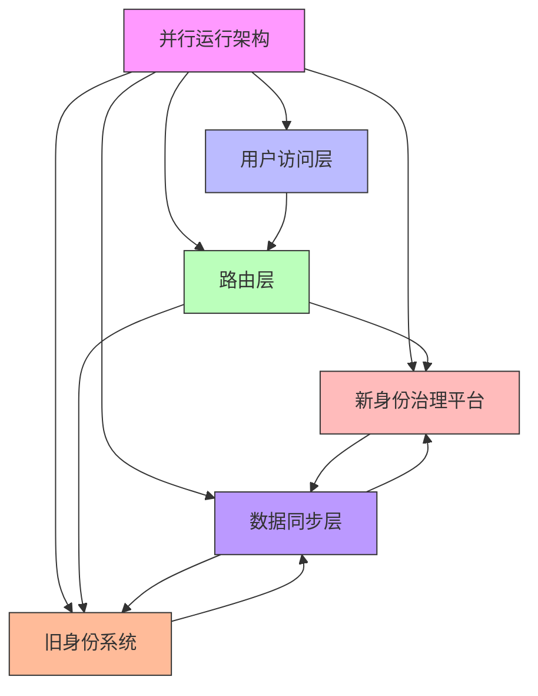

在企业级统一身份治理平台的建设过程中，老旧系统的迁移是一个复杂而关键的环节。由于这些系统往往承载着核心业务功能，并且积累了大量的用户数据和权限配置，直接进行系统替换可能导致严重的业务中断。通过并行运行和灰度切流等策略，企业可以在确保业务连续性的同时，逐步完成系统迁移。

## 引言

老旧系统迁移是身份治理平台实施过程中最具挑战性的任务之一。这些系统通常具有以下特征：技术架构陈旧、业务逻辑复杂、数据量庞大、用户依赖度高。直接替换这些系统不仅风险巨大，而且成本高昂。因此，采用科学的迁移策略，通过并行运行和灰度切流等方式，可以在控制风险的同时实现平稳过渡。

## 并行运行策略

### 设计原则

并行运行策略的核心是确保新旧系统同时运行，用户可以在两个系统之间无缝切换：



### 技术实现

```java
public class ParallelRunningStrategy {
    private final IdentityPlatformRouter router;
    private final DataService dataService;
    private final SyncService syncService;
    
    // 路由决策
    public class IdentityPlatformRouter {
        private final Map<String, RoutingRule> routingRules;
        private final LoadBalancer loadBalancer;
        
        public RoutingDecision routeRequest(HttpServletRequest request) {
            // 1. 基于用户特征路由
            String userId = extractUserId(request);
            RoutingRule userRule = getUserSpecificRule(userId);
            if (userRule != null) {
                return new RoutingDecision(userRule.getTargetPlatform(), userRule.getReason());
            }
            
            // 2. 基于业务系统路由
            String systemId = extractSystemId(request);
            RoutingRule systemRule = getSystemSpecificRule(systemId);
            if (systemRule != null) {
                return new RoutingDecision(systemRule.getTargetPlatform(), systemRule.getReason());
            }
            
            // 3. 基于时间窗口路由
            LocalDateTime now = LocalDateTime.now();
            RoutingRule timeRule = getTimeBasedRule(now);
            if (timeRule != null) {
                return new RoutingDecision(timeRule.getTargetPlatform(), timeRule.getReason());
            }
            
            // 4. 默认路由策略
            return new RoutingDecision(Platform.NEW, "DEFAULT_ROUTING");
        }
        
        // 用户特定路由规则
        private RoutingRule getUserSpecificRule(String userId) {
            // 从配置中获取用户路由规则
            return routingRules.get("USER_" + userId);
        }
        
        // 系统特定路由规则
        private RoutingRule getSystemSpecificRule(String systemId) {
            // 从配置中获取系统路由规则
            return routingRules.get("SYSTEM_" + systemId);
        }
        
        // 时间窗口路由规则
        private RoutingRule getTimeBasedRule(LocalDateTime time) {
            // 根据时间窗口确定路由规则
            for (Map.Entry<String, RoutingRule> entry : routingRules.entrySet()) {
                if (entry.getKey().startsWith("TIME_")) {
                    RoutingRule rule = entry.getValue();
                    if (isTimeInWindow(time, rule.getTimeWindow())) {
                        return rule;
                    }
                }
            }
            return null;
        }
    }
    
    // 数据双向同步
    public class DataService {
        private final NewPlatformClient newPlatformClient;
        private final LegacySystemClient legacySystemClient;
        private final SyncQueue syncQueue;
        
        // 用户数据同步
        public void syncUserData(String userId) {
            try {
                // 从新平台获取用户数据
                User newUser = newPlatformClient.getUser(userId);
                
                // 同步到旧系统
                legacySystemClient.updateUser(toLegacyUser(newUser));
                
                // 从旧系统获取用户数据
                LegacyUser legacyUser = legacySystemClient.getUser(userId);
                
                // 同步到新平台
                newPlatformClient.updateUser(toNewUser(legacyUser));
                
                // 记录同步日志
                logSyncSuccess(userId, "USER_DATA");
            } catch (Exception e) {
                logSyncFailure(userId, "USER_DATA", e);
                // 将失败的同步任务加入队列，稍后重试
                syncQueue.addFailedTask(new SyncTask(userId, "USER_DATA", SyncDirection.BOTH));
            }
        }
        
        // 权限数据同步
        public void syncPermissionData(String userId) {
            try {
                // 从新平台获取权限数据
                Set<Permission> newPermissions = newPlatformClient.getUserPermissions(userId);
                
                // 同步到旧系统
                legacySystemClient.updateUserPermissions(userId, toLegacyPermissions(newPermissions));
                
                // 从旧系统获取权限数据
                Set<LegacyPermission> legacyPermissions = legacySystemClient.getUserPermissions(userId);
                
                // 同步到新平台
                newPlatformClient.updateUserPermissions(userId, toNewPermissions(legacyPermissions));
                
                // 记录同步日志
                logSyncSuccess(userId, "PERMISSION_DATA");
            } catch (Exception e) {
                logSyncFailure(userId, "PERMISSION_DATA", e);
                syncQueue.addFailedTask(new SyncTask(userId, "PERMISSION_DATA", SyncDirection.BOTH));
            }
        }
    }
    
    // 同步队列管理
    public class SyncQueue {
        private final Queue<SyncTask> taskQueue;
        private final ScheduledExecutorService scheduler;
        
        public SyncQueue() {
            this.taskQueue = new ConcurrentLinkedQueue<>();
            this.scheduler = Executors.newScheduledThreadPool(5);
            
            // 启动定时同步任务
            scheduler.scheduleAtFixedRate(this::processFailedTasks, 0, 5, TimeUnit.MINUTES);
        }
        
        public void addFailedTask(SyncTask task) {
            taskQueue.offer(task);
        }
        
        private void processFailedTasks() {
            while (!taskQueue.isEmpty()) {
                SyncTask task = taskQueue.poll();
                if (task != null) {
                    try {
                        retrySyncTask(task);
                        logSyncRetrySuccess(task);
                    } catch (Exception e) {
                        logSyncRetryFailure(task, e);
                        // 如果重试次数未达到上限，重新加入队列
                        if (task.getRetryCount() < task.getMaxRetries()) {
                            task.incrementRetryCount();
                            taskQueue.offer(task);
                        } else {
                            // 达到最大重试次数，记录为永久失败
                            logPermanentSyncFailure(task);
                        }
                    }
                }
            }
        }
    }
}
```

### 配置管理

```sql
-- 并行运行配置表
CREATE TABLE parallel_running_config (
    id VARCHAR(50) PRIMARY KEY,
    config_name VARCHAR(100) NOT NULL,
    config_type VARCHAR(50) NOT NULL,  -- USER_BASED, SYSTEM_BASED, TIME_BASED
    target_entity VARCHAR(100),  -- 用户ID、系统ID等
    target_platform VARCHAR(20) NOT NULL,  -- NEW, LEGACY, BOTH
    start_time TIMESTAMP,
    end_time TIMESTAMP,
    priority INT DEFAULT 100,
    active BOOLEAN DEFAULT TRUE,
    created_at TIMESTAMP DEFAULT CURRENT_TIMESTAMP,
    updated_at TIMESTAMP DEFAULT CURRENT_TIMESTAMP ON UPDATE CURRENT_TIMESTAMP,
    
    INDEX idx_config_type (config_type),
    INDEX idx_target_entity (target_entity),
    INDEX idx_active (active),
    INDEX idx_priority (priority)
);

-- 数据同步配置表
CREATE TABLE data_sync_config (
    id VARCHAR(50) PRIMARY KEY,
    source_system VARCHAR(50) NOT NULL,
    target_system VARCHAR(50) NOT NULL,
    data_type VARCHAR(50) NOT NULL,  -- USER, PERMISSION, ROLE, AUDIT
    sync_direction VARCHAR(20) NOT NULL,  -- UNIDIRECTIONAL, BIDIRECTIONAL
    sync_frequency VARCHAR(20) NOT NULL,  -- REALTIME, BATCH, SCHEDULED
    batch_size INT DEFAULT 1000,
    error_handling VARCHAR(50) DEFAULT 'RETRY',  -- RETRY, SKIP, ALERT
    active BOOLEAN DEFAULT TRUE,
    created_at TIMESTAMP DEFAULT CURRENT_TIMESTAMP,
    updated_at TIMESTAMP DEFAULT CURRENT_TIMESTAMP ON UPDATE CURRENT_TIMESTAMP,
    
    UNIQUE KEY unique_sync (source_system, target_system, data_type),
    INDEX idx_active (active),
    INDEX idx_data_type (data_type)
);

-- 同步日志表
CREATE TABLE sync_logs (
    id VARCHAR(50) PRIMARY KEY,
    sync_task_id VARCHAR(50) NOT NULL,
    source_system VARCHAR(50) NOT NULL,
    target_system VARCHAR(50) NOT NULL,
    data_type VARCHAR(50) NOT NULL,
    entity_id VARCHAR(100),
    sync_status VARCHAR(20) NOT NULL,  -- SUCCESS, FAILED, RETRYING
    start_time TIMESTAMP NOT NULL,
    end_time TIMESTAMP,
    error_message TEXT,
    retry_count INT DEFAULT 0,
    
    INDEX idx_sync_task (sync_task_id),
    INDEX idx_status (sync_status),
    INDEX idx_entity (entity_id),
    INDEX idx_time_range (start_time, end_time)
);

-- 创建同步监控视图
CREATE VIEW sync_monitoring_dashboard AS
SELECT 
    dsc.data_type,
    dsc.source_system,
    dsc.target_system,
    COUNT(sl.id) as total_syncs,
    COUNT(CASE WHEN sl.sync_status = 'SUCCESS' THEN 1 END) as successful_syncs,
    COUNT(CASE WHEN sl.sync_status = 'FAILED' THEN 1 END) as failed_syncs,
    ROUND(COUNT(CASE WHEN sl.sync_status = 'SUCCESS' THEN 1 END) * 100.0 / COUNT(sl.id), 2) as success_rate,
    AVG(TIMESTAMPDIFF(SECOND, sl.start_time, sl.end_time)) as avg_duration_seconds,
    MAX(sl.start_time) as last_sync_time
FROM data_sync_config dsc
LEFT JOIN sync_logs sl ON dsc.source_system = sl.source_system 
    AND dsc.target_system = sl.target_system 
    AND dsc.data_type = sl.data_type
WHERE dsc.active = TRUE
GROUP BY dsc.data_type, dsc.source_system, dsc.target_system;
```

## 灰度切流机制

### 切流策略

```python
class GradualTrafficShift:
    def __init__(self, routing_service, monitoring_service):
        self.routing_service = routing_service
        self.monitoring_service = monitoring_service
        self.traffic_shift_policies = {}
    
    def define_shift_policy(self, policy_name, policy_config):
        """定义切流策略"""
        policy = {
            'name': policy_name,
            'target_system': policy_config['target_system'],
            'shift_percentage': 0,  # 初始切流比例
            'max_shift_percentage': policy_config.get('max_shift_percentage', 100),
            'shift_increment': policy_config.get('shift_increment', 5),
            'monitoring_metrics': policy_config.get('monitoring_metrics', []),
            'success_thresholds': policy_config.get('success_thresholds', {}),
            'rollback_conditions': policy_config.get('rollback_conditions', []),
            'schedule': policy_config.get('schedule', {})
        }
        
        self.traffic_shift_policies[policy_name] = policy
        return policy
    
    def execute_gradual_shift(self, policy_name, target_percentage=None):
        """执行渐进式切流"""
        policy = self.traffic_shift_policies.get(policy_name)
        if not policy:
            raise ValueError(f"Policy {policy_name} not found")
        
        current_percentage = policy['shift_percentage']
        target_percentage = target_percentage or policy['max_shift_percentage']
        
        # 如果目标比例小于当前比例，执行回退
        if target_percentage < current_percentage:
            return self._rollback_traffic(policy, target_percentage)
        
        # 逐步增加切流比例
        while current_percentage < target_percentage:
            next_percentage = min(
                current_percentage + policy['shift_increment'], 
                target_percentage
            )
            
            # 执行切流
            shift_result = self._shift_traffic(policy, next_percentage)
            
            # 监控关键指标
            metrics_status = self._monitor_key_metrics(policy, next_percentage)
            
            # 检查是否满足继续切流的条件
            if not self._should_continue_shift(policy, metrics_status):
                # 如果不满足条件，暂停切流并告警
                self._alert_on_shift_pause(policy, metrics_status)
                break
            
            # 更新策略状态
            policy['shift_percentage'] = next_percentage
            current_percentage = next_percentage
            
            # 记录切流日志
            self._log_traffic_shift(policy, next_percentage, shift_result)
            
            # 等待稳定期
            time.sleep(policy['schedule'].get('stabilization_period', 300))  # 默认5分钟
    
    def _shift_traffic(self, policy, percentage):
        """执行流量切换"""
        try:
            # 更新路由配置
            self.routing_service.update_routing_percentage(
                policy['target_system'], 
                percentage
            )
            
            return {
                'status': 'SUCCESS',
                'percentage': percentage,
                'timestamp': datetime.utcnow()
            }
        except Exception as e:
            return {
                'status': 'FAILED',
                'percentage': percentage,
                'error': str(e),
                'timestamp': datetime.utcnow()
            }
    
    def _monitor_key_metrics(self, policy, percentage):
        """监控关键指标"""
        metrics_status = {}
        
        for metric_name in policy['monitoring_metrics']:
            # 获取指标当前值
            current_value = self.monitoring_service.get_metric_value(metric_name)
            threshold = policy['success_thresholds'].get(metric_name, 0)
            
            # 判断指标是否正常
            is_normal = current_value >= threshold
            metrics_status[metric_name] = {
                'current_value': current_value,
                'threshold': threshold,
                'is_normal': is_normal
            }
        
        return metrics_status
    
    def _should_continue_shift(self, policy, metrics_status):
        """判断是否应该继续切流"""
        # 检查所有监控指标是否正常
        for metric_name, status in metrics_status.items():
            if not status['is_normal']:
                return False
        
        # 检查回滚条件
        for condition in policy['rollback_conditions']:
            if self._check_rollback_condition(condition):
                return False
        
        return True
    
    def _rollback_traffic(self, policy, target_percentage):
        """回滚流量"""
        current_percentage = policy['shift_percentage']
        
        while current_percentage > target_percentage:
            next_percentage = max(
                current_percentage - policy['shift_increment'], 
                target_percentage
            )
            
            # 执行回滚
            rollback_result = self._shift_traffic(policy, next_percentage)
            
            # 更新策略状态
            policy['shift_percentage'] = next_percentage
            current_percentage = next_percentage
            
            # 记录回滚日志
            self._log_traffic_rollback(policy, next_percentage, rollback_result)
```

### 用户分组策略

```javascript
// 用户分组切流策略
class UserGroupBasedTrafficShift {
  constructor(userSegmentationService, routingService) {
    this.userSegmentationService = userSegmentationService;
    this.routingService = routingService;
    this.userGroups = new Map();
  }
  
  // 定义用户分组
  defineUserGroups(groupDefinitions) {
    for (const [groupName, groupConfig] of Object.entries(groupDefinitions)) {
      const group = {
        name: groupName,
        criteria: groupConfig.criteria,
        size: groupConfig.size || 0,
        currentPlatform: groupConfig.initialPlatform || 'LEGACY',
        targetPlatform: groupConfig.targetPlatform || 'NEW',
        shiftSchedule: groupConfig.shiftSchedule || [],
        monitoringMetrics: groupConfig.monitoringMetrics || []
      };
      
      this.userGroups.set(groupName, group);
    }
  }
  
  // 基于用户分组执行切流
  async executeGroupBasedShift(groupName, shiftConfig) {
    const group = this.userGroups.get(groupName);
    if (!group) {
      throw new Error(`User group ${groupName} not found`);
    }
    
    // 获取符合条件的用户列表
    const users = await this.userSegmentationService.getUsersByCriteria(
      group.criteria
    );
    
    // 分批处理用户切流
    const batchSize = shiftConfig.batchSize || 100;
    const batchInterval = shiftConfig.batchInterval || 30000; // 30秒
    
    for (let i = 0; i < users.length; i += batchSize) {
      const batch = users.slice(i, i + batchSize);
      
      // 执行批次切流
      await this._shiftUserBatch(batch, group.targetPlatform);
      
      // 监控批次效果
      const batchMetrics = await this._monitorBatchMetrics(batch, group.monitoringMetrics);
      
      // 检查是否需要暂停或回滚
      if (!this._shouldContinueBatchShift(batchMetrics, shiftConfig.thresholds)) {
        await this._handleBatchShiftIssue(batch, batchMetrics);
        break;
      }
      
      // 等待下一批次
      if (i + batchSize < users.length) {
        await this._delay(batchInterval);
      }
    }
    
    // 更新分组状态
    group.currentPlatform = group.targetPlatform;
  }
  
  // 用户批次切流
  async _shiftUserBatch(users, targetPlatform) {
    const routingUpdates = users.map(user => ({
      userId: user.id,
      targetPlatform: targetPlatform
    }));
    
    // 批量更新路由配置
    await this.routingService.batchUpdateUserRouting(routingUpdates);
    
    // 记录切流日志
    await this._logBatchShift(users, targetPlatform);
  }
  
  // 监控批次指标
  async _monitorBatchMetrics(users, metrics) {
    const monitoringResults = {};
    
    for (const metric of metrics) {
      const result = await this._collectMetricForUsers(users, metric);
      monitoringResults[metric] = result;
    }
    
    return monitoringResults;
  }
  
  // 收集用户指标
  async _collectMetricForUsers(users, metric) {
    // 根据指标类型收集数据
    switch (metric) {
      case 'authentication_success_rate':
        return await this._getAuthenticationSuccessRate(users);
      case 'authorization_latency':
        return await this._getAuthorizationLatency(users);
      case 'user_satisfaction':
        return await this._getUserSatisfactionScore(users);
      default:
        return { value: 0, status: 'UNKNOWN' };
    }
  }
}
```

## 数据一致性保障

### 一致性检查机制

```java
public class DataConsistencyChecker {
    private final ConsistencyVerificationService verificationService;
    private final AlertService alertService;
    private final RepairService repairService;
    
    // 数据一致性验证
    public class ConsistencyVerificationService {
        
        // 用户数据一致性检查
        public ConsistencyReport verifyUserDataConsistency(String userId) {
            ConsistencyReport report = new ConsistencyReport();
            report.setUserId(userId);
            report.setCheckTime(Instant.now());
            
            try {
                // 获取新平台用户数据
                User newUser = newPlatformClient.getUser(userId);
                
                // 获取旧系统用户数据
                LegacyUser legacyUser = legacySystemClient.getUser(userId);
                
                // 比较关键字段
                List<FieldDifference> differences = compareUserFields(newUser, legacyUser);
                
                report.setDifferences(differences);
                report.setConsistent(differences.isEmpty());
                report.setStatus(ConsistencyStatus.CHECKED);
                
                // 如果存在差异，记录告警
                if (!differences.isEmpty()) {
                    alertService.sendAlert(Alert.builder()
                        .type(AlertType.DATA_INCONSISTENCY)
                        .severity(AlertSeverity.MEDIUM)
                        .message(String.format("User data inconsistency detected for user: %s", userId))
                        .details(Map.of("differences", differences))
                        .timestamp(Instant.now())
                        .build()
                    );
                }
                
            } catch (Exception e) {
                report.setStatus(ConsistencyStatus.ERROR);
                report.setErrorMessage(e.getMessage());
                
                alertService.sendAlert(Alert.builder()
                    .type(AlertType.DATA_CONSISTENCY_CHECK_FAILED)
                    .severity(AlertSeverity.HIGH)
                    .message(String.format("Failed to check user data consistency for user: %s", userId))
                    .details(Map.of("error", e.getMessage()))
                    .timestamp(Instant.now())
                    .build()
                );
            }
            
            return report;
        }
        
        // 权限数据一致性检查
        public ConsistencyReport verifyPermissionConsistency(String userId) {
            ConsistencyReport report = new ConsistencyReport();
            report.setUserId(userId);
            report.setCheckTime(Instant.now());
            
            try {
                // 获取新平台权限数据
                Set<Permission> newPermissions = newPlatformClient.getUserPermissions(userId);
                
                // 获取旧系统权限数据
                Set<LegacyPermission> legacyPermissions = legacySystemClient.getUserPermissions(userId);
                
                // 比较权限集合
                SetComparisonResult comparison = comparePermissionSets(newPermissions, legacyPermissions);
                
                report.setPermissionDifferences(comparison.getDifferences());
                report.setConsistent(comparison.isIdentical());
                report.setStatus(ConsistencyStatus.CHECKED);
                
                // 记录差异详情
                if (!comparison.isIdentical()) {
                    logPermissionDifferences(userId, comparison);
                }
                
            } catch (Exception e) {
                report.setStatus(ConsistencyStatus.ERROR);
                report.setErrorMessage(e.getMessage());
            }
            
            return report;
        }
        
        // 批量一致性检查
        public BatchConsistencyReport verifyBatchConsistency(List<String> userIds) {
            BatchConsistencyReport batchReport = new BatchConsistencyReport();
            batchReport.setTotalUsers(userIds.size());
            batchReport.setStartTime(Instant.now());
            
            List<ConsistencyReport> individualReports = new ArrayList<>();
            int consistentCount = 0;
            
            for (String userId : userIds) {
                ConsistencyReport report = verifyUserDataConsistency(userId);
                individualReports.add(report);
                
                if (report.isConsistent()) {
                    consistentCount++;
                }
            }
            
            batchReport.setIndividualReports(individualReports);
            batchReport.setConsistentUsers(consistentCount);
            batchReport.setInconsistentUsers(userIds.size() - consistentCount);
            batchReport.setConsistencyRate((double) consistentCount / userIds.size());
            batchReport.setEndTime(Instant.now());
            batchReport.setStatus(ConsistencyStatus.CHECKED);
            
            return batchReport;
        }
    }
    
    // 数据修复服务
    public class RepairService {
        
        // 自动修复数据不一致
        public RepairResult autoRepairInconsistency(String userId, List<FieldDifference> differences) {
            RepairResult result = new RepairResult();
            result.setUserId(userId);
            result.setStartTime(Instant.now());
            
            try {
                for (FieldDifference difference : differences) {
                    RepairAction action = determineRepairAction(difference);
                    executeRepairAction(userId, action);
                    result.addRepairedField(difference.getFieldName());
                }
                
                result.setStatus(RepairStatus.SUCCESS);
                result.setEndTime(Instant.now());
                
                // 验证修复结果
                ConsistencyReport verification = verificationService.verifyUserDataConsistency(userId);
                result.setVerificationPassed(verification.isConsistent());
                
            } catch (Exception e) {
                result.setStatus(RepairStatus.FAILED);
                result.setErrorMessage(e.getMessage());
                result.setEndTime(Instant.now());
            }
            
            return result;
        }
        
        // 手动修复流程
        public ManualRepairTask createManualRepairTask(String userId, List<FieldDifference> differences) {
            ManualRepairTask task = new ManualRepairTask();
            task.setId(UUID.randomUUID().toString());
            task.setUserId(userId);
            task.setDifferences(differences);
            task.setStatus(RepairTaskStatus.PENDING);
            task.setCreatedAt(Instant.now());
            task.setAssignedTo(getAppropriateAssignee(differences));
            
            // 保存修复任务
            saveManualRepairTask(task);
            
            // 发送通知
            notifyAssignee(task);
            
            return task;
        }
    }
}
```

### 一致性监控

```sql
-- 数据一致性检查配置表
CREATE TABLE consistency_check_config (
    id VARCHAR(50) PRIMARY KEY,
    check_name VARCHAR(100) NOT NULL,
    data_type VARCHAR(50) NOT NULL,  -- USER, PERMISSION, ROLE
    check_frequency VARCHAR(20) NOT NULL,  -- HOURLY, DAILY, WEEKLY
    sample_size INT DEFAULT 1000,
    threshold_percentage DECIMAL(5,2) DEFAULT 99.5,  -- 一致性阈值
    auto_repair_enabled BOOLEAN DEFAULT FALSE,
    notification_channels JSON,
    active BOOLEAN DEFAULT TRUE,
    created_at TIMESTAMP DEFAULT CURRENT_TIMESTAMP,
    updated_at TIMESTAMP DEFAULT CURRENT_TIMESTAMP ON UPDATE CURRENT_TIMESTAMP
);

-- 一致性检查结果表
CREATE TABLE consistency_check_results (
    id VARCHAR(50) PRIMARY KEY,
    config_id VARCHAR(50) NOT NULL,
    check_time TIMESTAMP NOT NULL,
    total_records INT NOT NULL,
    consistent_records INT NOT NULL,
    inconsistent_records INT NOT NULL,
    consistency_percentage DECIMAL(5,2) NOT NULL,
    check_duration_seconds INT,
    status VARCHAR(20) NOT NULL,  -- SUCCESS, FAILED, PARTIAL
    error_message TEXT,
    
    FOREIGN KEY (config_id) REFERENCES consistency_check_config(id),
    INDEX idx_check_time (check_time),
    INDEX idx_config_status (config_id, status)
);

-- 数据差异详情表
CREATE TABLE data_differences (
    id VARCHAR(50) PRIMARY KEY,
    check_result_id VARCHAR(50) NOT NULL,
    entity_type VARCHAR(50) NOT NULL,  -- USER, PERMISSION, ROLE
    entity_id VARCHAR(100) NOT NULL,
    field_name VARCHAR(100) NOT NULL,
    old_value TEXT,
    new_value TEXT,
    difference_type VARCHAR(50) NOT NULL,  -- MISSING, EXTRA, DIFFERENT
    resolved BOOLEAN DEFAULT FALSE,
    resolved_at TIMESTAMP NULL,
    resolution_notes TEXT,
    
    FOREIGN KEY (check_result_id) REFERENCES consistency_check_results(id),
    INDEX idx_entity (entity_type, entity_id),
    INDEX idx_resolved (resolved)
);

-- 创建一致性监控仪表板视图
CREATE VIEW consistency_monitoring_dashboard AS
SELECT 
    ccc.check_name,
    ccc.data_type,
    COUNT(ccr.id) as total_checks,
    AVG(ccr.consistency_percentage) as avg_consistency_rate,
    MIN(ccr.consistency_percentage) as min_consistency_rate,
    MAX(ccr.consistency_percentage) as max_consistency_rate,
    COUNT(CASE WHEN ccr.consistency_percentage < ccc.threshold_percentage THEN 1 END) as below_threshold_count,
    AVG(ccr.check_duration_seconds) as avg_check_duration,
    MAX(ccr.check_time) as last_check_time
FROM consistency_check_config ccc
LEFT JOIN consistency_check_results ccr ON ccc.id = ccr.config_id
WHERE ccc.active = TRUE 
  AND ccr.check_time > DATE_SUB(NOW(), INTERVAL 7 DAY)
GROUP BY ccc.id, ccc.check_name, ccc.data_type;
```

## 总结

老旧系统迁移策略是企业级统一身份治理平台成功实施的关键环节。通过并行运行和灰度切流等策略，企业可以在确保业务连续性的同时，逐步完成系统迁移。

关键要点包括：

1. **并行运行**：通过新旧系统同时运行，确保业务不中断
2. **灰度切流**：采用渐进式流量切换，降低迁移风险
3. **数据同步**：建立完善的数据双向同步机制，保证数据一致性
4. **监控告警**：实施全面的监控和告警机制，及时发现和处理问题

在实际实施过程中，需要根据企业的具体情况和业务特点，制定合适的迁移策略，并在实施过程中不断优化和调整，确保迁移工作的顺利进行。