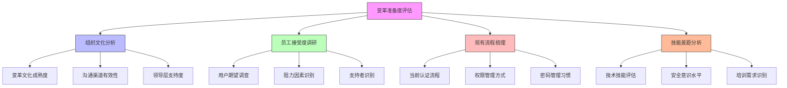

在统一身份治理平台的实施过程中，技术实现只是成功的一部分。用户教育和变革管理同样重要，甚至更为关键。即使平台功能再强大，如果用户不理解、不接受或不会使用，项目也难以取得预期效果。本文将深入探讨如何通过有效的用户教育和变革管理策略，确保平台的成功推广和用户习惯的顺利转变。

## 引言

任何技术变革都会带来组织和人员的挑战。统一身份治理平台的实施不仅是技术升级，更是工作流程和习惯的重塑。成功的平台推广需要系统性的用户教育和变革管理策略，帮助用户理解平台价值、掌握使用方法，并逐步改变原有工作习惯。

## 变革管理框架

### 变革准备度评估

在实施变革之前，首先需要评估组织的变革准备度：



### 变革管理策略

```java
public class ChangeManagementStrategy {
    private final StakeholderAnalysis stakeholderAnalysis;
    private final CommunicationPlan communicationPlan;
    private final TrainingProgram trainingProgram;
    
    // 变革管理计划
    public class ChangeManagementPlan {
        private String vision;
        private List<Stakeholder> stakeholders;
        private CommunicationStrategy communicationStrategy;
        private TrainingApproach trainingApproach;
        private Timeline timeline;
        private SuccessMetrics successMetrics;
    }
    
    // 制定变革管理计划
    public ChangeManagementPlan developChangeManagementPlan() {
        ChangeManagementPlan plan = new ChangeManagementPlan();
        
        // 明确变革愿景
        plan.setVision("通过统一身份治理平台提升组织安全性和工作效率");
        
        // 识别利益相关者
        plan.setStakeholders(identifyStakeholders());
        
        // 制定沟通策略
        plan.setCommunicationStrategy(developCommunicationStrategy());
        
        // 设计培训方法
        plan.setTrainingApproach(developTrainingApproach());
        
        // 制定时间计划
        plan.setTimeline(createTimeline());
        
        // 定义成功指标
        plan.setSuccessMetrics(defineSuccessMetrics());
        
        return plan;
    }
    
    // 识别利益相关者
    private List<Stakeholder> identifyStakeholders() {
        List<Stakeholder> stakeholders = new ArrayList<>();
        
        // 高层管理者
        stakeholders.add(new Stakeholder(
            "ExecutiveLeaders", 
            StakeholderType.SPONSOR,
            InfluenceLevel.HIGH,
            InterestLevel.HIGH,
            "需要持续汇报项目进展和价值"
        ));
        
        // IT部门
        stakeholders.add(new Stakeholder(
            "ITDepartment",
            StakeholderType.DRIVER,
            InfluenceLevel.HIGH,
            InterestLevel.HIGH,
            "负责平台实施和日常运维"
        ));
        
        // 业务部门用户
        stakeholders.add(new Stakeholder(
            "BusinessUsers",
            StakeholderType.IMPACTED,
            InfluenceLevel.MEDIUM,
            InterestLevel.HIGH,
            "平台的直接使用者，需要充分培训和支持"
        ));
        
        // 安全团队
        stakeholders.add(new Stakeholder(
            "SecurityTeam",
            StakeholderType.ADVISOR,
            InfluenceLevel.HIGH,
            InterestLevel.HIGH,
            "关注平台的安全性和合规性"
        ));
        
        return stakeholders;
    }
    
    // 制定沟通策略
    private CommunicationStrategy developCommunicationStrategy() {
        CommunicationStrategy strategy = new CommunicationStrategy();
        
        // 高层管理者沟通
        strategy.addChannel(new CommunicationChannel(
            "ExecutiveLeaders",
            CommunicationMethod.EXECUTIVE_REPORT,
            Frequency.MONTHLY,
            "项目进展报告、ROI分析、风险评估"
        ));
        
        // IT部门沟通
        strategy.addChannel(new CommunicationChannel(
            "ITDepartment",
            CommunicationMethod.TEAM_MEETING,
            Frequency.WEEKLY,
            "技术细节讨论、实施进度同步、问题解决"
        ));
        
        // 业务用户沟通
        strategy.addChannel(new CommunicationChannel(
            "BusinessUsers",
            CommunicationMethod.NEWSLETTER,
            Frequency.BI_WEEKLY,
            "功能介绍、使用技巧、常见问题解答"
        ));
        
        // 安全团队沟通
        strategy.addChannel(new CommunicationChannel(
            "SecurityTeam",
            CommunicationMethod.SECURITY_REVIEW,
            Frequency.WEEKLY,
            "安全评估、合规检查、风险分析"
        ));
        
        return strategy;
    }
}
```

## 用户教育体系

### 分层培训设计

针对不同用户群体设计差异化的培训内容和方式：

```python
class UserEducationSystem:
    def __init__(self, training_service, content_service):
        self.training_service = training_service
        self.content_service = content_service
    
    # 设计分层培训体系
    def design_tiered_training(self):
        """设计分层培训体系"""
        training_tiers = {
            'executive': self._create_executive_training(),
            'it_staff': self._create_it_staff_training(),
            'business_users': self._create_business_user_training(),
            'security_team': self._create_security_team_training()
        }
        
        return training_tiers
    
    # 高层管理者培训
    def _create_executive_training(self):
        """创建高层管理者培训"""
        return {
            'target_audience': '高层管理者',
            'training_goals': [
                '理解身份治理的战略价值',
                '了解项目投资回报率',
                '掌握关键风险和控制措施'
            ],
            'content_outline': [
                '身份治理的商业价值',
                '安全风险与合规要求',
                '项目实施路线图',
                '关键成功指标'
            ],
            'delivery_method': '高管研讨会',
            'duration': '2小时',
            'format': '线下研讨会 + 案例分析'
        }
    
    # IT技术人员培训
    def _create_it_staff_training(self):
        """创建IT技术人员培训"""
        return {
            'target_audience': 'IT技术人员',
            'training_goals': [
                '掌握平台架构和功能',
                '学会系统配置和管理',
                '具备故障排查能力'
            ],
            'content_outline': [
                '平台架构概述',
                '用户管理操作',
                '权限配置实践',
                '系统监控和维护',
                '故障排查指南'
            ],
            'delivery_method': '技术培训 + 实操演练',
            'duration': '2天',
            'format': '线上课程 + 线下实验室'
        }
    
    # 业务用户培训
    def _create_business_user_training(self):
        """创建业务用户培训"""
        return {
            'target_audience': '业务用户',
            'training_goals': [
                '掌握日常使用方法',
                '了解安全最佳实践',
                '能够自助解决问题'
            ],
            'content_outline': [
                '登录和认证流程',
                '密码和MFA管理',
                '权限申请和使用',
                '常见问题处理'
            ],
            'delivery_method': '在线学习 + 微培训',
            'duration': '1小时',
            'format': '在线视频 + 互动测验'
        }
    
    # 安全团队培训
    def _create_security_team_training(self):
        """创建安全团队培训"""
        return {
            'target_audience': '安全团队',
            'training_goals': [
                '深入理解平台安全机制',
                '掌握审计和合规功能',
                '具备安全事件响应能力'
            ],
            'content_outline': [
                '平台安全架构',
                '认证和授权机制',
                '审计日志分析',
                '合规性检查',
                '安全事件响应'
            ],
            'delivery_method': '专业培训 + 实战演练',
            'duration': '1天',
            'format': '线下培训 + 模拟演练'
        }
```

### 培训内容开发

```sql
-- 用户教育内容数据库设计
CREATE TABLE training_content (
    id VARCHAR(50) PRIMARY KEY,
    title VARCHAR(200) NOT NULL,
    description TEXT,
    content_type VARCHAR(50) NOT NULL,  -- VIDEO, DOCUMENT, INTERACTIVE, QUIZ
    target_audience VARCHAR(100) NOT NULL,  -- EXECUTIVE, IT_STAFF, BUSINESS_USER, SECURITY_TEAM
    difficulty_level VARCHAR(20) DEFAULT 'BEGINNER',  -- BEGINNER, INTERMEDIATE, ADVANCED
    duration_minutes INT,
    content_url VARCHAR(500),
    prerequisites JSON,
    learning_objectives JSON,
    assessment_method VARCHAR(50),  -- QUIZ, PRACTICAL, NONE
    assessment_criteria TEXT,
    created_at TIMESTAMP DEFAULT CURRENT_TIMESTAMP,
    updated_at TIMESTAMP DEFAULT CURRENT_TIMESTAMP ON UPDATE CURRENT_TIMESTAMP,
    
    INDEX idx_content_type (content_type),
    INDEX idx_target_audience (target_audience),
    INDEX idx_difficulty (difficulty_level)
);

-- 培训计划表
CREATE TABLE training_programs (
    id VARCHAR(50) PRIMARY KEY,
    program_name VARCHAR(200) NOT NULL,
    description TEXT,
    target_audience VARCHAR(100) NOT NULL,
    start_date DATE,
    end_date DATE,
    delivery_method VARCHAR(100),  -- ONLINE, OFFLINE, HYBRID
    max_participants INT,
    instructor_id VARCHAR(50),
    materials JSON,
    evaluation_criteria TEXT,
    created_at TIMESTAMP DEFAULT CURRENT_TIMESTAMP,
    updated_at TIMESTAMP DEFAULT CURRENT_TIMESTAMP ON UPDATE CURRENT_TIMESTAMP,
    
    INDEX idx_target_audience (target_audience),
    INDEX idx_delivery_method (delivery_method),
    INDEX idx_date_range (start_date, end_date)
);

-- 用户培训记录表
CREATE TABLE user_training_records (
    id VARCHAR(50) PRIMARY KEY,
    user_id VARCHAR(50) NOT NULL,
    training_program_id VARCHAR(50) NOT NULL,
    enrollment_date TIMESTAMP DEFAULT CURRENT_TIMESTAMP,
    completion_date TIMESTAMP NULL,
    status VARCHAR(20) DEFAULT 'ENROLLED',  -- ENROLLED, IN_PROGRESS, COMPLETED, FAILED
    score DECIMAL(5,2),
    feedback TEXT,
    certificate_url VARCHAR(500),
    
    FOREIGN KEY (user_id) REFERENCES users(id),
    FOREIGN KEY (training_program_id) REFERENCES training_programs(id),
    INDEX idx_user_id (user_id),
    INDEX idx_program_id (training_program_id),
    INDEX idx_status (status),
    INDEX idx_completion_date (completion_date)
);

-- 创建培训效果统计视图
CREATE VIEW training_effectiveness AS
SELECT 
    tp.program_name,
    tp.target_audience,
    COUNT(utr.id) as total_participants,
    COUNT(CASE WHEN utr.status = 'COMPLETED' THEN 1 END) as completed_count,
    ROUND(COUNT(CASE WHEN utr.status = 'COMPLETED' THEN 1 END) * 100.0 / COUNT(utr.id), 2) as completion_rate,
    AVG(utr.score) as average_score,
    COUNT(CASE WHEN utr.feedback IS NOT NULL THEN 1 END) as feedback_count,
    AVG(LENGTH(utr.feedback)) as avg_feedback_length
FROM training_programs tp
LEFT JOIN user_training_records utr ON tp.id = utr.training_program_id
GROUP BY tp.id, tp.program_name, tp.target_audience;
```

## 推广策略实施

### 分阶段推广计划

```javascript
// 推广策略实施系统
class PromotionStrategy {
  constructor(platformService, communicationService, analyticsService) {
    this.platformService = platformService;
    this.communicationService = communicationService;
    this.analyticsService = analyticsService;
    this.promotionPhases = [];
  }
  
  // 制定分阶段推广计划
  createPhasedPromotionPlan() {
    this.promotionPhases = [
      {
        phase: 'AWARENESS',
        name: '认知阶段',
        duration: '2周',
        objectives: [
          '让所有用户了解新平台的存在',
          '传达平台的主要功能和优势',
          '建立初步的兴趣和期待'
        ],
        tactics: [
          '全员邮件通知',
          '内部网站公告',
          '宣传视频发布',
          'FAQ文档准备'
        ],
        targetAudience: 'ALL_USERS',
        successMetrics: [
          '邮件打开率 > 80%',
          '内部网站访问量增长50%',
          'FAQ文档下载量 > 1000'
        ]
      },
      {
        phase: 'UNDERSTANDING',
        name: '理解阶段',
        duration: '3周',
        objectives: [
          '帮助用户深入理解平台功能',
          '展示平台如何改善日常工作',
          '解答用户疑问和顾虑'
        ],
        tactics: [
          '部门宣讲会',
          '在线培训课程',
          '一对一咨询',
          '使用案例分享'
        ],
        targetAudience: 'ALL_USERS',
        successMetrics: [
          '培训参与率 > 70%',
          '咨询请求数量增长',
          '正面反馈比例 > 80%'
        ]
      },
      {
        phase: 'TRIAL',
        name: '试用阶段',
        duration: '4周',
        objectives: [
          '让用户实际体验平台功能',
          '收集用户反馈和建议',
          '优化用户体验'
        ],
        tactics: [
          '试点用户招募',
          '功能试用活动',
          '用户体验调研',
          '快速迭代改进'
        ],
        targetAudience: 'PILOT_USERS',
        successMetrics: [
          '试点用户满意度 > 85%',
          '功能使用频率 > 50%',
          '问题解决时间 < 24小时'
        ]
      },
      {
        phase: 'ADOPTION',
        name: '采用阶段',
        duration: '6周',
        objectives: [
          '推动全员正式使用平台',
          '建立持续使用习惯',
          '提供持续支持'
        ],
        tactics: [
          '正式上线通知',
          '强制迁移计划',
          '持续支持服务',
          '激励机制实施'
        ],
        targetAudience: 'ALL_USERS',
        successMetrics: [
          '平台使用率 > 90%',
          '支持请求数量下降',
          '用户满意度 > 80%'
        ]
      }
    ];
    
    return this.promotionPhases;
  }
  
  // 执行推广活动
  async executePromotionPhase(phase) {
    console.log(`开始执行推广阶段: ${phase.name}`);
    
    // 根据阶段执行相应策略
    switch (phase.phase) {
      case 'AWARENESS':
        await this._executeAwarenessPhase(phase);
        break;
      case 'UNDERSTANDING':
        await this._executeUnderstandingPhase(phase);
        break;
      case 'TRIAL':
        await this._executeTrialPhase(phase);
        break;
      case 'ADOPTION':
        await this._executeAdoptionPhase(phase);
        break;
    }
    
    // 监控阶段效果
    await this._monitorPhaseEffectiveness(phase);
  }
  
  // 认知阶段执行
  async _executeAwarenessPhase(phase) {
    // 发送全员邮件
    await this.communicationService.sendMassEmail({
      subject: '全新统一身份治理平台即将上线',
      content: this._generateAwarenessContent(),
      targetAudience: 'ALL_USERS'
    });
    
    // 发布内部网站公告
    await this.communicationService.publishInternalAnnouncement({
      title: '统一身份治理平台介绍',
      content: this._generateAnnouncementContent(),
      priority: 'HIGH'
    });
    
    // 发布宣传视频
    await this.communicationService.publishVideo({
      title: '统一身份治理平台宣传片',
      url: '/videos/identity-platform-promo.mp4',
      description: '了解新平台如何提升工作效率和安全性'
    });
  }
  
  // 理解阶段执行
  async _executeUnderstandingPhase(phase) {
    // 组织部门宣讲会
    await this._organizeDepartmentMeetings();
    
    // 发布在线培训课程
    await this._publishOnlineTraining();
    
    // 提供一对一咨询服务
    await this._setupConsultationService();
  }
  
  // 试用阶段执行
  async _executeTrialPhase(phase) {
    // 招募试点用户
    const pilotUsers = await this._recruitPilotUsers();
    
    // 启动试用活动
    await this._launchTrialProgram(pilotUsers);
    
    // 收集用户反馈
    await this._collectUserFeedback();
  }
  
  // 采用阶段执行
  async _executeAdoptionPhase(phase) {
    // 正式上线通知
    await this._sendGoLiveAnnouncement();
    
    // 实施强制迁移
    await this._implementMandatoryMigration();
    
    // 提供持续支持
    await this._provideOngoingSupport();
  }
  
  // 监控阶段效果
  async _monitorPhaseEffectiveness(phase) {
    // 收集关键指标
    const metrics = await this.analyticsService.getMetrics(phase.successMetrics);
    
    // 生成阶段报告
    const report = await this._generatePhaseReport(phase, metrics);
    
    // 发送报告给相关方
    await this.communicationService.sendReport(report);
    
    return report;
  }
}
```

### 用户反馈机制

```java
public class UserFeedbackSystem {
    private final FeedbackService feedbackService;
    private final AnalyticsService analyticsService;
    private final NotificationService notificationService;
    
    // 用户反馈收集
    public class FeedbackCollection {
        
        // 多渠道反馈收集
        public void setupFeedbackChannels() {
            // 应用内反馈按钮
            setupInAppFeedback();
            
            // 邮件反馈
            setupEmailFeedback();
            
            // 在线调查
            setupOnlineSurvey();
            
            // 用户访谈
            setupUserInterviews();
        }
        
        // 应用内反馈
        private void setupInAppFeedback() {
            // 在平台界面添加反馈按钮
            FeedbackButton feedbackButton = new FeedbackButton();
            feedbackButton.setPosition("BOTTOM_RIGHT");
            feedbackButton.setTriggerEvent("CLICK");
            
            // 配置反馈表单
            FeedbackForm form = new FeedbackForm();
            form.setFields(Arrays.asList(
                new FeedbackField("satisfaction", "满意度", FieldType.RATING),
                new FeedbackField("usability", "易用性", FieldType.RATING),
                new FeedbackField("features", "功能评价", FieldType.TEXT),
                new FeedbackField("improvements", "改进建议", FieldType.TEXT),
                new FeedbackField("contact", "联系方式", FieldType.EMAIL)
            ));
            
            feedbackButton.setForm(form);
        }
        
        // 在线调查
        public Survey createAdoptionSurvey() {
            Survey survey = new Survey();
            survey.setTitle("统一身份治理平台使用体验调查");
            survey.setDescription("帮助我们了解您的使用体验，持续改进平台");
            
            survey.setQuestions(Arrays.asList(
                new SurveyQuestion(
                    "overall_satisfaction",
                    "您对统一身份治理平台的整体满意度如何？",
                    QuestionType.RATING,
                    true
                ),
                new SurveyQuestion(
                    "ease_of_use",
                    "您认为平台的易用性如何？",
                    QuestionType.RATING,
                    true
                ),
                new SurveyQuestion(
                    "time_saving",
                    "使用平台后，您在身份管理上节省的时间如何？",
                    QuestionType.RATING,
                    true
                ),
                new SurveyQuestion(
                    "security_improvement",
                    "您认为平台对安全性提升的效果如何？",
                    QuestionType.RATING,
                    true
                ),
                new SurveyQuestion(
                    "most_valuable_feature",
                    "您认为最有价值的功能是什么？",
                    QuestionType.MULTIPLE_CHOICE,
                    true,
                    Arrays.asList(
                        "统一登录", "多因子认证", "权限管理", "自助服务", "其他"
                    )
                ),
                new SurveyQuestion(
                    "improvement_suggestions",
                    "您对平台有哪些改进建议？",
                    QuestionType.LONG_TEXT,
                    false
                )
            ));
            
            return survey;
        }
    }
    
    // 反馈分析与响应
    public class FeedbackAnalysis {
        
        // 分析反馈数据
        public FeedbackAnalysisReport analyzeFeedback(List<Feedback> feedbacks) {
            FeedbackAnalysisReport report = new FeedbackAnalysisReport();
            
            // 计算满意度指标
            report.setSatisfactionScore(calculateAverageRating(feedbacks, "satisfaction"));
            report.setUsabilityScore(calculateAverageRating(feedbacks, "usability"));
            
            // 识别主要问题
            report.setTopIssues(identifyTopIssues(feedbacks));
            
            // 提取改进建议
            report.setImprovementSuggestions(extractSuggestions(feedbacks));
            
            // 分析用户群体差异
            report.setUserSegmentAnalysis(analyzeByUserSegments(feedbacks));
            
            return report;
        }
        
        // 生成改进行动计划
        public ImprovementActionPlan generateActionPlan(FeedbackAnalysisReport report) {
            ImprovementActionPlan plan = new ImprovementActionPlan();
            plan.setCreatedAt(Instant.now());
            plan.setStatus(ActionPlanStatus.PLANNED);
            
            // 基于反馈生成改进项
            List<ImprovementItem> items = new ArrayList<>();
            
            // 处理低分项
            if (report.getSatisfactionScore() < 4.0) {
                items.add(new ImprovementItem(
                    "提升整体用户满意度",
                    Priority.HIGH,
                    "根据用户反馈优化界面设计和操作流程",
                    Arrays.asList("UI/UX团队", "产品经理"),
                    LocalDate.now().plusWeeks(2)
                ));
            }
            
            // 处理易用性问题
            if (report.getUsabilityScore() < 4.0) {
                items.add(new ImprovementItem(
                    "改善平台易用性",
                    Priority.HIGH,
                    "简化复杂操作流程，提供更多使用指导",
                    Arrays.asList("UI/UX团队", "技术文档团队"),
                    LocalDate.now().plusWeeks(3)
                ));
            }
            
            // 处理具体建议
            for (String suggestion : report.getImprovementSuggestions()) {
                items.add(new ImprovementItem(
                    "实现用户建议功能",
                    Priority.MEDIUM,
                    suggestion,
                    Arrays.asList("产品经理", "开发团队"),
                    LocalDate.now().plusWeeks(4)
                ));
            }
            
            plan.setItems(items);
            return plan;
        }
        
        // 跟踪改进效果
        public ImprovementTracking trackImprovements(ImprovementActionPlan plan) {
            ImprovementTracking tracking = new ImprovementTracking();
            
            // 设置跟踪指标
            tracking.setMetrics(Arrays.asList(
                new TrackingMetric("user_satisfaction", "用户满意度"),
                new TrackingMetric("feature_adoption", "功能采用率"),
                new TrackingMetric("support_tickets", "支持请求数量")
            ));
            
            // 定期收集数据
            scheduleRegularCheckins(plan, tracking);
            
            return tracking;
        }
    }
}
```

## 持续改进机制

### 使用数据分析

```python
class UsageAnalytics:
    def __init__(self, analytics_service, feedback_service):
        self.analytics_service = analytics_service
        self.feedback_service = feedback_service
    
    def analyze_user_adoption(self):
        """分析用户采用情况"""
        adoption_data = {
            'adoption_rate': self._calculate_adoption_rate(),
            'usage_patterns': self._analyze_usage_patterns(),
            'user_segments': self._segment_users_by_adoption(),
            'barriers': self._identify_adoption_barriers()
        }
        
        return adoption_data
    
    def _calculate_adoption_rate(self):
        """计算采用率"""
        total_users = self.analytics_service.get_total_users()
        active_users = self.analytics_service.get_active_users(days=30)
        return {
            'overall_rate': active_users / total_users,
            'trend': self._calculate_adoption_trend(),
            'by_department': self._calculate_department_adoption_rates()
        }
    
    def _analyze_usage_patterns(self):
        """分析使用模式"""
        return {
            'peak_usage_times': self.analytics_service.get_peak_usage_times(),
            'most_used_features': self.analytics_service.get_feature_usage_ranking(),
            'user_journeys': self.analytics_service.get_common_user_journeys(),
            'drop_off_points': self.analytics_service.get_user_drop_off_points()
        }
    
    def generate_adoption_insights(self):
        """生成采用洞察"""
        adoption_data = self.analyze_user_adoption()
        
        insights = {
            'quick_wins': self._identify_quick_wins(adoption_data),
            'major_challenges': self._identify_major_challenges(adoption_data),
            'opportunity_areas': self._identify_opportunity_areas(adoption_data)
        }
        
        return insights
    
    def _identify_quick_wins(self, adoption_data):
        """识别快速胜利点"""
        quick_wins = []
        
        # 高使用率但低满意度的功能
        high_usage_features = adoption_data['usage_patterns']['most_used_features']
        for feature in high_usage_features[:5]:  # 前5个最常用功能
            satisfaction = self.feedback_service.get_feature_satisfaction(feature['name'])
            if satisfaction < 4.0:  # 满意度低于4分
                quick_wins.append({
                    'type': 'IMPROVE_EXISTING_FEATURE',
                    'feature': feature['name'],
                    'impact': 'HIGH',  # 高影响，因为使用频繁
                    'effort': 'LOW',   # 低努力，因为是改进而非新建
                    'description': f"改善{feature['name']}功能的用户体验"
                })
        
        return quick_wins
    
    def create_continuous_improvement_loop(self):
        """创建持续改进循环"""
        return {
            'measure': self._setup_measurement(),
            'analyze': self._setup_analysis(),
            'improve': self._setup_improvement(),
            'monitor': self._setup_monitoring()
        }
    
    def _setup_measurement(self):
        """设置测量机制"""
        return {
            'kpi_dashboard': self._create_kpi_dashboard(),
            'user_surveys': self._schedule_regular_surveys(),
            'usage_analytics': self._implement_usage_tracking(),
            'feedback_collection': self._setup_feedback_channels()
        }
    
    def _setup_analysis(self):
        """设置分析机制"""
        return {
            'monthly_reviews': '每月进行数据回顾',
            'quarterly_deep_dive': '每季度深入分析',
            'annual_assessment': '年度全面评估',
            'ad_hoc_analysis': '根据需要进行特别分析'
        }
```

## 总结

用户教育与变革管理是统一身份治理平台成功实施的关键因素。通过系统性的变革管理框架、分层的用户教育体系、分阶段的推广策略以及持续的反馈改进机制，可以有效推动用户接受新平台并改变使用习惯。

关键要点包括：

1. **变革管理**：通过准备度评估、利益相关者分析和沟通策略确保变革顺利推进
2. **用户教育**：针对不同用户群体制定差异化的培训内容和方式
3. **推广策略**：采用分阶段推广计划，从认知到采用逐步推进
4. **反馈机制**：建立多渠道反馈收集和分析体系，持续改进平台体验
5. **持续改进**：通过数据分析和定期评估，形成持续优化的闭环

成功的用户教育和变革管理不仅能够确保平台的顺利实施，还能为组织培养良好的安全意识和使用习惯，为长期的数字化转型奠定坚实基础。