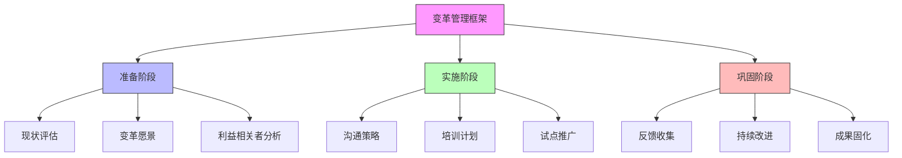

在企业级统一身份治理平台的实施过程中，技术实现只是成功的一部分。如何让用户接受新平台、改变使用习惯、积极参与到新系统中来，是决定项目成败的关键因素。本文将深入探讨用户教育与变革管理的策略和实践方法。

## 引言

技术变革往往伴随着组织变革，统一身份治理平台的实施不仅仅是技术系统的更新，更是一次深刻的组织变革。用户教育和变革管理是确保项目成功的关键环节，需要系统性的规划和执行。

## 变革管理框架

### 变革管理模型



### 利益相关者分析

```java
public class StakeholderAnalysis {
    private final List<Stakeholder> stakeholders;
    private final ChangeManagementStrategy strategy;
    
    // 利益相关者分类
    public enum StakeholderType {
        END_USER("终端用户"),
        ADMINISTRATOR("管理员"),
        EXECUTIVE("高管"),
        IT_STAFF("IT人员"),
        COMPLIANCE_OFFICER("合规官");
        
        private final String description;
        
        StakeholderType(String description) {
            this.description = description;
        }
        
        public String getDescription() {
            return description;
        }
    }
    
    // 利益相关者影响和兴趣矩阵
    public class StakeholderMatrix {
        private final Map<Stakeholder, InfluenceInterest> matrix;
        
        public void categorizeStakeholders() {
            for (Stakeholder stakeholder : stakeholders) {
                InfluenceInterest position = determinePosition(stakeholder);
                matrix.put(stakeholder, position);
            }
        }
        
        private InfluenceInterest determinePosition(Stakeholder stakeholder) {
            int influence = stakeholder.getInfluence();
            int interest = stakeholder.getInterest();
            
            if (influence >= 7 && interest >= 7) {
                return InfluenceInterest.MANAGE_CLOSELY;
            } else if (influence >= 7 && interest < 7) {
                return InfluenceInterest.KEEP_SATISFIED;
            } else if (influence < 7 && interest >= 7) {
                return InfluenceInterest.KEEP_INFORMED;
            } else {
                return InfluenceInterest.MONITOR;
            }
        }
    }
    
    // 制定沟通策略
    public CommunicationStrategy developCommunicationStrategy() {
        CommunicationStrategy strategy = new CommunicationStrategy();
        
        // 高影响力高兴趣群体 - 密切管理
        strategy.addTargetGroup(StakeholderType.EXECUTIVE, CommunicationChannel.EXECUTIVE_BRIEFING, Frequency.WEEKLY);
        strategy.addTargetGroup(StakeholderType.ADMINISTRATOR, CommunicationChannel.WORKSHOP, Frequency.BI_WEEKLY);
        
        // 高影响力低兴趣群体 - 保持满意
        strategy.addTargetGroup(StakeholderType.IT_STAFF, CommunicationChannel.TECHNICAL_DOCUMENTATION, Frequency.ON_DEMAND);
        
        // 低影响力高兴趣群体 - 及时告知
        strategy.addTargetGroup(StakeholderType.END_USER, CommunicationChannel.EMAIL_NEWSLETTER, Frequency.WEEKLY);
        strategy.addTargetGroup(StakeholderType.END_USER, CommunicationChannel.INTRANET_PORTAL, Frequency.DAILY);
        
        // 低影响力低兴趣群体 - 监控
        strategy.addTargetGroup(StakeholderType.COMPLIANCE_OFFICER, CommunicationChannel.REPORTING_DASHBOARD, Frequency.MONTHLY);
        
        return strategy;
    }
}
```

## 用户教育策略

### 分层培训体系

```python
class UserEducationProgram:
    def __init__(self, target_audience):
        self.target_audience = target_audience
        self.training_modules = self._design_training_modules()
    
    def _design_training_modules(self):
        """设计分层培训模块"""
        return {
            'executive_level': {
                'name': '高管层培训',
                'duration': '2小时',
                'format': '高层研讨会',
                'content': [
                    '身份治理的战略价值',
                    'ROI分析和业务影响',
                    '风险管理与合规要求',
                    '变革管理要点'
                ],
                'delivery_method': '面对面研讨会'
            },
            'administrator_level': {
                'name': '管理员培训',
                'duration': '2天',
                'format': '深度工作坊',
                'content': [
                    '平台架构和核心功能',
                    '用户和权限管理',
                    '审计和合规功能',
                    '故障排除和日常运维'
                ],
                'delivery_method': '现场培训+实操演练'
            },
            'end_user_level': {
                'name': '终端用户培训',
                'duration': '1小时',
                'format': '在线微学习',
                'content': [
                    '新登录流程',
                    '密码和MFA设置',
                    '自助服务功能',
                    '常见问题解答'
                ],
                'delivery_method': '在线学习平台+即时帮助'
            }
        }
    
    def create_training_materials(self):
        """创建培训材料"""
        materials = {}
        
        for level, module in self.training_modules.items():
            materials[level] = {
                'presentation_slides': self._create_presentation(level, module),
                'hands_on_exercises': self._create_exercises(level, module),
                'quick_reference_guides': self._create_quick_guides(level, module),
                'video_tutorials': self._create_videos(level, module)
            }
        
        return materials
    
    def _create_presentation(self, level, module):
        """创建演示文稿"""
        return f"{module['name']}演示文稿 - 包含{len(module['content'])}个主题"
    
    def _create_exercises(self, level, module):
        """创建实操练习"""
        return f"{module['name']}实操练习 - 基于真实场景的动手实验"
    
    def _create_quick_guides(self, level, module):
        """创建快速参考指南"""
        return f"{module['name']}快速参考卡 - 一页纸的要点总结"
    
    def _create_videos(self, level, module):
        """创建视频教程"""
        return f"{module['name']}视频系列 - 分步骤操作演示"
```

### 互动式学习体验

```javascript
// 互动式学习平台
class InteractiveLearningPlatform {
  constructor() {
    this.courses = new Map();
    this.users = new Map();
    this.progressTracking = new Map();
  }
  
  // 创建互动课程
  createInteractiveCourse(courseConfig) {
    const course = {
      id: this.generateCourseId(),
      title: courseConfig.title,
      description: courseConfig.description,
      modules: this.createLearningModules(courseConfig.modules),
      assessments: this.createAssessments(courseConfig.assessments),
      interactiveElements: this.createInteractiveElements(courseConfig.interactiveElements)
    };
    
    this.courses.set(course.id, course);
    return course;
  }
  
  // 创建学习模块
  createLearningModules(modulesConfig) {
    return modulesConfig.map(module => ({
      id: this.generateModuleId(),
      title: module.title,
      content: module.content,
      interactiveDemo: module.interactiveDemo,
      simulation: module.simulation,
      knowledgeCheck: module.knowledgeCheck
    }));
  }
  
  // 创建互动演示
  createInteractiveDemo(demoConfig) {
    return {
      type: 'interactive-demo',
      title: demoConfig.title,
      steps: demoConfig.steps.map(step => ({
        instruction: step.instruction,
        expectedAction: step.expectedAction,
        feedback: step.feedback,
        hint: step.hint
      })),
      completionCriteria: demoConfig.completionCriteria
    };
  }
  
  // 创建模拟环境
  createSimulation(simulationConfig) {
    return {
      type: 'simulation',
      title: simulationConfig.title,
      scenario: simulationConfig.scenario,
      tasks: simulationConfig.tasks.map(task => ({
        description: task.description,
        steps: task.steps,
        validation: task.validation
      })),
      scoring: simulationConfig.scoring
    };
  }
  
  // 跟踪学习进度
  trackUserProgress(userId, courseId, progress) {
    const userProgress = {
      userId: userId,
      courseId: courseId,
      progress: progress,
      lastAccessed: new Date(),
      completedModules: progress.completedModules || [],
      assessmentScores: progress.assessmentScores || {}
    };
    
    this.progressTracking.set(`${userId}-${courseId}`, userProgress);
    return userProgress;
  }
  
  // 个性化学习路径
  createPersonalizedLearningPath(userProfile, course) {
    // 根据用户角色和经验水平定制学习路径
    const path = {
      recommendedModules: this.recommendModules(userProfile, course),
      adaptiveContent: this.adaptContentDifficulty(userProfile, course),
      additionalResources: this.suggestAdditionalResources(userProfile)
    };
    
    return path;
  }
}
```

## 推广策略与执行

### 内部营销活动

```sql
-- 内部营销活动数据库设计
CREATE TABLE internal_marketing_campaigns (
    id VARCHAR(50) PRIMARY KEY,
    campaign_name VARCHAR(200) NOT NULL,
    campaign_type VARCHAR(50) NOT NULL,  -- AWARENESS, ADOPTION, ADVOCACY
    target_audience JSON NOT NULL,
    start_date TIMESTAMP NOT NULL,
    end_date TIMESTAMP NOT NULL,
    budget DECIMAL(10,2),
    status VARCHAR(20) DEFAULT 'PLANNED',
    created_at TIMESTAMP DEFAULT CURRENT_TIMESTAMP,
    updated_at TIMESTAMP DEFAULT CURRENT_TIMESTAMP ON UPDATE CURRENT_TIMESTAMP,
    
    INDEX idx_campaign_type (campaign_type),
    INDEX idx_status (status),
    INDEX idx_date_range (start_date, end_date)
);

-- 营销活动内容表
CREATE TABLE campaign_content (
    id VARCHAR(50) PRIMARY KEY,
    campaign_id VARCHAR(50) NOT NULL,
    content_type VARCHAR(50) NOT NULL,  -- EMAIL, BANNER, VIDEO, ARTICLE
    title VARCHAR(200) NOT NULL,
    content TEXT,
    channel VARCHAR(50) NOT NULL,  -- EMAIL, INTRANET, MOBILE_APP
    scheduled_time TIMESTAMP,
    sent BOOLEAN DEFAULT FALSE,
    
    FOREIGN KEY (campaign_id) REFERENCES internal_marketing_campaigns(id),
    INDEX idx_content_type (content_type),
    INDEX idx_channel (channel),
    INDEX idx_scheduled_time (scheduled_time)
);

-- 用户参与度跟踪表
CREATE TABLE user_engagement_metrics (
    id VARCHAR(50) PRIMARY KEY,
    campaign_id VARCHAR(50) NOT NULL,
    user_id VARCHAR(50),
    content_id VARCHAR(50),
    engagement_type VARCHAR(50) NOT NULL,  -- VIEW, CLICK, SHARE, COMPLETE
    engagement_time TIMESTAMP NOT NULL,
    additional_data JSON,
    
    FOREIGN KEY (campaign_id) REFERENCES internal_marketing_campaigns(id),
    FOREIGN KEY (content_id) REFERENCES campaign_content(id),
    INDEX idx_user_engagement (user_id, engagement_type),
    INDEX idx_content_engagement (content_id, engagement_type),
    INDEX idx_time_range (engagement_time)
);

-- 创建营销效果分析视图
CREATE VIEW campaign_effectiveness_analysis AS
SELECT 
    imc.campaign_name,
    imc.campaign_type,
    COUNT(DISTINCT ue.user_id) as unique_engaged_users,
    COUNT(ue.id) as total_engagements,
    COUNT(CASE WHEN ue.engagement_type = 'CLICK' THEN 1 END) as clicks,
    COUNT(CASE WHEN ue.engagement_type = 'SHARE' THEN 1 END) as shares,
    COUNT(CASE WHEN ue.engagement_type = 'COMPLETE' THEN 1 END) as completions,
    ROUND(COUNT(CASE WHEN ue.engagement_type = 'CLICK' THEN 1 END) * 100.0 / 
          NULLIF(COUNT(DISTINCT ue.user_id), 0), 2) as click_through_rate,
    imc.start_date,
    imc.end_date
FROM internal_marketing_campaigns imc
LEFT JOIN user_engagement_metrics ue ON imc.id = ue.campaign_id
WHERE imc.status = 'COMPLETED'
GROUP BY imc.id, imc.campaign_name, imc.campaign_type, imc.start_date, imc.end_date;
```

### 激励机制设计

```java
public class UserAdoptionIncentiveProgram {
    private final IncentiveService incentiveService;
    private final UserService userService;
    private final AchievementService achievementService;
    
    // 激励类型枚举
    public enum IncentiveType {
        RECOGNITION("表彰奖励"),
        TANGIBLE("实物奖励"),
        GAMIFICATION("游戏化激励"),
        PEER_COMPETITION("同行竞争");
        
        private final String description;
        
        IncentiveType(String description) {
            this.description = description;
        }
        
        public String getDescription() {
            return description;
        }
    }
    
    // 用户成就系统
    public class AchievementSystem {
        private final Map<String, Achievement> achievements;
        
        // 定义核心成就
        public void defineCoreAchievements() {
            achievements.put("FIRST_LOGIN", new Achievement(
                "首次登录", 
                "完成平台首次登录", 
                10, 
                AchievementType.MILESTONE
            ));
            
            achievements.put("MFA_SETUP", new Achievement(
                "安全专家", 
                "成功设置多因子认证", 
                25, 
                AchievementType.SECURITY
            ));
            
            achievements.put("PROFILE_COMPLETE", new Achievement(
                "个人信息达人", 
                "完善个人资料信息", 
                15, 
                AchievementType.ENGAGEMENT
            ));
            
            achievements.put("PASSWORD_RESET", new Achievement(
                "自助能手", 
                "使用自助密码重置功能", 
                20, 
                AchievementType.SELF_SERVICE
            ));
        }
        
        // 检查并授予成就
        public List<Achievement> checkAndGrantAchievements(String userId, UserAction action) {
            List<Achievement> granted = new ArrayList<>();
            
            for (Achievement achievement : achievements.values()) {
                if (achievement.isEligible(userId, action) && 
                    !achievementService.hasAchievement(userId, achievement.getId())) {
                    achievementService.grantAchievement(userId, achievement);
                    granted.add(achievement);
                }
            }
            
            return granted;
        }
    }
    
    // 积分奖励机制
    public class PointBasedRewardSystem {
        private final Map<String, RewardTier> rewardTiers;
        
        // 定义奖励层级
        public void defineRewardTiers() {
            rewardTiers.put("BRONZE", new RewardTier(
                "青铜级", 
                0, 
                100, 
                Arrays.asList("电子徽章", "平台感谢信")
            ));
            
            rewardTiers.put("SILVER", new RewardTier(
                "白银级", 
                101, 
                500, 
                Arrays.asList("电子徽章", "平台感谢信", "优先技术支持")
            ));
            
            rewardTiers.put("GOLD", new RewardTier(
                "黄金级", 
                501, 
                1000, 
                Arrays.asList("电子徽章", "平台感谢信", "优先技术支持", "纪念品")
            ));
            
            rewardTiers.put("PLATINUM", new RewardTier(
                "铂金级", 
                1001, 
                Integer.MAX_VALUE, 
                Arrays.asList("电子徽章", "平台感谢信", "优先技术支持", "纪念品", "额外假期")
            ));
        }
        
        // 计算用户积分
        public int calculateUserPoints(String userId) {
            int basePoints = achievementService.getTotalAchievementPoints(userId);
            int engagementPoints = calculateEngagementPoints(userId);
            int referralPoints = calculateReferralPoints(userId);
            
            return basePoints + engagementPoints + referralPoints;
        }
        
        // 基于参与度计算积分
        private int calculateEngagementPoints(String userId) {
            // 根据登录频率、功能使用情况等计算
            int loginPoints = userService.getLoginCount(userId) * 2;
            int featurePoints = userService.getFeatureUsageCount(userId) * 5;
            int helpPoints = userService.getHelpDeskInteractions(userId) * 3;
            
            return loginPoints + featurePoints + helpPoints;
        }
    }
}
```

## 变革阻力应对

### 抵制变革的识别与处理

```python
class ChangeResistanceManagement:
    def __init__(self, change_management_service):
        self.change_management_service = change_management_service
        self.resistance_patterns = self._define_resistance_patterns()
    
    def _define_resistance_patterns(self):
        """定义变革抵制模式"""
        return {
            'fear_of_job_loss': {
                'indicators': ['频繁询问工作安全性', '消极参与培训', '传播负面言论'],
                'handling_strategy': '沟通保障就业安全，提供技能转型支持'
            },
            'comfort_with_old_system': {
                'indicators': ['抱怨新系统复杂', '继续使用旧流程', '请求回到旧系统'],
                'handling_strategy': '强调新系统优势，提供一对一辅导'
            },
            'lack_of_trust': {
                'indicators': ['质疑项目价值', '不配合数据迁移', '隐瞒问题'],
                'handling_strategy': '增加透明度，邀请参与决策过程'
            },
            'technical_incompetence': {
                'indicators': ['反复询问相同问题', '操作错误频繁', '回避使用新功能'],
                'handling_strategy': '提供额外培训，安排伙伴支持'
            }
        }
    
    def identify_resistance(self, user_feedback, behavior_data):
        """识别变革抵制"""
        resistance_signals = []
        
        # 分析用户反馈
        for feedback in user_feedback:
            signals = self._analyze_feedback(feedback)
            resistance_signals.extend(signals)
        
        # 分析行为数据
        for behavior in behavior_data:
            signals = self._analyze_behavior(behavior)
            resistance_signals.extend(signals)
        
        # 聚合和分类抵制信号
        categorized_resistance = self._categorize_resistance(resistance_signals)
        
        return categorized_resistance
    
    def _analyze_feedback(self, feedback):
        """分析反馈中的抵制信号"""
        signals = []
        
        for pattern_name, pattern in self.resistance_patterns.items():
            for indicator in pattern['indicators']:
                if indicator in feedback['content']:
                    signals.append({
                        'type': pattern_name,
                        'confidence': self._calculate_confidence(feedback),
                        'evidence': feedback
                    })
        
        return signals
    
    def develop_intervention_strategy(self, resistance_analysis):
        """制定干预策略"""
        interventions = []
        
        for resistance_type, cases in resistance_analysis.items():
            pattern = self.resistance_patterns[resistance_type]
            intervention = {
                'type': resistance_type,
                'strategy': pattern['handling_strategy'],
                'target_users': [case['user_id'] for case in cases],
                'resources_needed': self._estimate_resources(resistance_type),
                'timeline': self._estimate_timeline(resistance_type)
            }
            interventions.append(intervention)
        
        return interventions
    
    def implement_interventions(self, interventions):
        """实施干预措施"""
        results = []
        
        for intervention in interventions:
            result = {
                'intervention': intervention,
                'status': 'IN_PROGRESS',
                'start_date': datetime.utcnow(),
                'progress_updates': []
            }
            
            # 执行具体的干预措施
            if intervention['type'] == 'fear_of_job_loss':
                self._address_job_security_concerns(intervention)
            elif intervention['type'] == 'comfort_with_old_system':
                self._provide_additional_training(intervention)
            elif intervention['type'] == 'lack_of_trust':
                self._increase_transparency(intervention)
            elif intervention['type'] == 'technical_incompetence':
                self._offer_peer_support(intervention)
            
            results.append(result)
        
        return results
```

### 沟通策略优化

```javascript
// 多渠道沟通策略
class MultiChannelCommunicationStrategy {
  constructor(communicationService) {
    this.communicationService = communicationService;
    this.channels = new Map();
    this.audienceSegments = new Map();
  }
  
  // 定义沟通渠道
  defineCommunicationChannels() {
    this.channels.set('executive_briefing', {
      name: '高管简报',
      audience: '高管层',
      frequency: '月度',
      format: '面对面会议',
      key_messages: [
        '项目ROI和业务价值',
        '风险管理与合规进展',
        '组织变革影响'
      ]
    });
    
    this.channels.set('town_hall_meeting', {
      name: '全员大会',
      audience: '全体员工',
      frequency: '季度',
      format: '现场/在线会议',
      key_messages: [
        '项目进展和里程碑',
        '用户收益和便利性',
        '成功案例分享'
      ]
    });
    
    this.channels.set('department_workshop', {
      name: '部门工作坊',
      audience: '各部门用户',
      frequency: '按需',
      format: '小组讨论',
      key_messages: [
        '部门特定功能介绍',
        '工作流程优化',
        '问题解答和反馈收集'
      ]
    });
    
    this.channels.set('digital_newsletter', {
      name: '数字通讯',
      audience: '所有用户',
      frequency: '双周',
      format: '电子邮件',
      key_messages: [
        '最新功能更新',
        '使用技巧和最佳实践',
        '用户故事和成就'
      ]
    });
  }
  
  // 个性化消息推送
  async sendPersonalizedMessage(userProfile, messageTemplate) {
    // 根据用户画像定制消息内容
    const personalizedMessage = {
      subject: this.customizeSubject(messageTemplate.subject, userProfile),
      content: this.customizeContent(messageTemplate.content, userProfile),
      callToAction: this.customizeCTA(messageTemplate.cta, userProfile),
      channel: messageTemplate.preferredChannel || userProfile.preferredChannel
    };
    
    // 发送消息
    await this.communicationService.sendMessage(userProfile.userId, personalizedMessage);
    
    // 跟踪消息效果
    this.trackMessageEngagement(userProfile.userId, personalizedMessage);
    
    return personalizedMessage;
  }
  
  // 实时反馈机制
  setupRealTimeFeedback() {
    // 设置即时反馈收集点
    const feedbackPoints = [
      '登录页面',
      '帮助中心',
      '培训完成后',
      '功能使用后'
    ];
    
    // 配置反馈收集机制
    const feedbackConfig = {
      collectionMethod: '弹出式调查',
      timing: '基于用户行为触发',
      incentive: '积分奖励',
      analysis: '实时情感分析'
    };
    
    return {
      feedbackPoints,
      feedbackConfig
    };
  }
}
```

## 持续改进与优化

### 用户体验优化

```sql
-- 用户体验反馈数据库设计
CREATE TABLE user_experience_feedback (
    id VARCHAR(50) PRIMARY KEY,
    user_id VARCHAR(50) NOT NULL,
    feedback_type VARCHAR(50) NOT NULL,  -- BUG, SUGGESTION, COMPLIMENT
    category VARCHAR(100),  -- LOGIN, PERMISSION, PROFILE, etc.
    priority VARCHAR(20) DEFAULT 'MEDIUM',  -- LOW, MEDIUM, HIGH, CRITICAL
    description TEXT NOT NULL,
    steps_to_reproduce TEXT,
    screenshot_url VARCHAR(500),
    status VARCHAR(20) DEFAULT 'NEW',  -- NEW, IN_REVIEW, IN_PROGRESS, RESOLVED, CLOSED
    assigned_to VARCHAR(50),
    created_at TIMESTAMP DEFAULT CURRENT_TIMESTAMP,
    updated_at TIMESTAMP DEFAULT CURRENT_TIMESTAMP ON UPDATE CURRENT_TIMESTAMP,
    
    INDEX idx_feedback_type (feedback_type),
    INDEX idx_category (category),
    INDEX idx_priority (priority),
    INDEX idx_status (status),
    INDEX idx_user_id (user_id)
);

-- 用户满意度调查表
CREATE TABLE user_satisfaction_surveys (
    id VARCHAR(50) PRIMARY KEY,
    survey_name VARCHAR(200) NOT NULL,
    survey_type VARCHAR(50) NOT NULL,  -- GENERAL, FEATURE_SPECIFIC, POST_TRAINING
    target_audience JSON,
    questions JSON NOT NULL,
    start_date TIMESTAMP NOT NULL,
    end_date TIMESTAMP NOT NULL,
    response_rate_target DECIMAL(5,2) DEFAULT 80.00,
    status VARCHAR(20) DEFAULT 'ACTIVE',
    
    INDEX idx_survey_type (survey_type),
    INDEX idx_status (status)
);

-- 调查响应表
CREATE TABLE survey_responses (
    id VARCHAR(50) PRIMARY KEY,
    survey_id VARCHAR(50) NOT NULL,
    user_id VARCHAR(50) NOT NULL,
    responses JSON NOT NULL,
    submission_time TIMESTAMP DEFAULT CURRENT_TIMESTAMP,
    
    FOREIGN KEY (survey_id) REFERENCES user_satisfaction_surveys(id),
    UNIQUE KEY unique_response (survey_id, user_id),
    INDEX idx_submission_time (submission_time)
);

-- 创建用户体验仪表板视图
CREATE VIEW user_experience_dashboard AS
SELECT 
    uxf.category,
    COUNT(uxf.id) as total_feedback,
    COUNT(CASE WHEN uxf.feedback_type = 'BUG' THEN 1 END) as bug_reports,
    COUNT(CASE WHEN uxf.feedback_type = 'SUGGESTION' THEN 1 END) as suggestions,
    COUNT(CASE WHEN uxf.feedback_type = 'COMPLIMENT' THEN 1 END) as compliments,
    ROUND(AVG(CASE WHEN uxf.feedback_type = 'BUG' THEN 1 ELSE 0 END) * 100, 2) as bug_percentage,
    MAX(uxf.created_at) as latest_feedback
FROM user_experience_feedback uxf
WHERE uxf.created_at > DATE_SUB(NOW(), INTERVAL 30 DAY)
GROUP BY uxf.category;
```

### 成功度量与评估

```java
public class ChangeSuccessMetrics {
    private final AnalyticsService analyticsService;
    private final UserService userService;
    private final SystemService systemService;
    
    // 关键成功指标
    public enum SuccessMetric {
        USER_ADOPTION_RATE("用户采用率"),
        LOGIN_SUCCESS_RATE("登录成功率"),
        MFA_ENROLLMENT_RATE("MFA注册率"),
        SELF_SERVICE_USAGE("自助服务使用率"),
        SUPPORT_TICKET_REDUCTION("支持工单减少率"),
        TRAINING_COMPLETION_RATE("培训完成率");
        
        private final String description;
        
        SuccessMetric(String description) {
            this.description = description;
        }
        
        public String getDescription() {
            return description;
        }
    }
    
    // 计算用户采用率
    public double calculateUserAdoptionRate() {
        long totalUsers = userService.getTotalUserCount();
        long activeUsers = userService.getActiveUserCount(30); // 30天内活跃用户
        
        return (double) activeUsers / totalUsers;
    }
    
    // 计算登录成功率
    public double calculateLoginSuccessRate() {
        long totalLoginAttempts = systemService.getTotalLoginAttempts(7); // 7天内
        long successfulLogins = systemService.getSuccessfulLogins(7);
        
        return (double) successfulLogins / totalLoginAttempts;
    }
    
    // 生成变革管理报告
    public ChangeManagementReport generateReport(Date periodStart, Date periodEnd) {
        ChangeManagementReport report = new ChangeManagementReport();
        report.setPeriodStart(periodStart);
        report.setPeriodEnd(periodEnd);
        
        // 收集各项指标
        report.setMetrics(collectMetrics(periodStart, periodEnd));
        
        // 分析趋势
        report.setTrends(analyzeTrends(report.getMetrics()));
        
        // 识别改进机会
        report.setImprovementOpportunities(identifyOpportunities(report.getMetrics()));
        
        // 计算ROI
        report.setRoi(calculateROI(report.getMetrics()));
        
        return report;
    }
    
    // 收集指标数据
    private Map<SuccessMetric, Double> collectMetrics(Date start, Date end) {
        Map<SuccessMetric, Double> metrics = new HashMap<>();
        
        metrics.put(SuccessMetric.USER_ADOPTION_RATE, calculateUserAdoptionRate());
        metrics.put(SuccessMetric.LOGIN_SUCCESS_RATE, calculateLoginSuccessRate());
        metrics.put(SuccessMetric.MFA_ENROLLMENT_RATE, calculateMFAEnrollmentRate());
        metrics.put(SuccessMetric.SELF_SERVICE_USAGE, calculateSelfServiceUsageRate());
        metrics.put(SuccessMetric.SUPPORT_TICKET_REDUCTION, calculateSupportTicketReduction());
        metrics.put(SuccessMetric.TRAINING_COMPLETION_RATE, calculateTrainingCompletionRate());
        
        return metrics;
    }
    
    // ROI计算
    private ROI calculateROI(Map<SuccessMetric, Double> metrics) {
        // 计算收益
        double securityImprovement = metrics.get(SuccessMetric.LOGIN_SUCCESS_RATE) * 0.1; // 假设安全提升10%
        double productivityGain = metrics.get(SuccessMetric.SELF_SERVICE_USAGE) * 0.05; // 假设生产力提升5%
        double supportCostReduction = metrics.get(SuccessMetric.SUPPORT_TICKET_REDUCTION) * 1000; // 假设每个工单节省1000元
        
        double totalBenefits = securityImprovement + productivityGain + supportCostReduction;
        
        // 计算投资成本
        double projectCost = 500000; // 假设项目总成本50万
        
        ROI roi = new ROI();
        roi.setInvestment(projectCost);
        roi.setBenefits(totalBenefits);
        roi.setNetReturn(totalBenefits - projectCost);
        roi.setPercentage((totalBenefits - projectCost) / projectCost * 100);
        
        return roi;
    }
}
```

## 总结

用户教育与变革管理是统一身份治理平台成功实施的关键因素。通过系统性的变革管理框架、分层的用户教育策略、创新的推广手段、有效的抵制应对机制以及持续的改进优化，可以显著提高用户接受度和平台采用率。

关键成功要素包括：

1. **领导层支持**：获得高管层的明确支持和积极参与
2. **分层培训**：针对不同用户群体设计差异化的培训内容
3. **互动体验**：通过游戏化和模拟环境提高学习效果
4. **激励机制**：建立有效的奖励和认可体系
5. **持续沟通**：保持与所有利益相关者的有效沟通
6. **反馈循环**：建立快速响应用户反馈的机制
7. **度量评估**：通过数据驱动的方式评估和优化变革效果

只有将技术实施与组织变革有机结合，才能确保统一身份治理平台真正发挥其价值，为企业数字化转型提供坚实的基础。