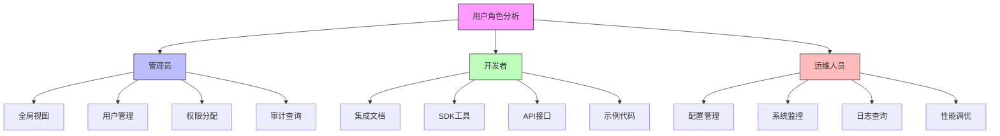

在企业级统一身份治理平台中，管理控制台和开发者体验是确保平台成功运营和广泛采用的关键组成部分。一个设计良好的管理控制台能够为管理员提供直观、高效的管理界面，而优秀的开发者体验则能够降低集成门槛，促进平台的快速采用和扩展。

## 本章概要

第12章将深入探讨统一身份治理平台中管理控制台和开发者体验的设计与实现：

* **管理员视角**：设计全局视图、用户管理、权限分配和审计查询功能，提供直观高效的管理界面
* **开发者视角**：提供清晰的集成文档、SDK和API，降低集成门槛，促进快速采用
* **运维视角**：构建配置管理、系统监控和日志查询功能，确保平台稳定运行

通过本章的学习，读者将了解如何设计和实现满足不同用户角色需求的管理控制台和开发者体验，从而提升平台的整体可用性和可维护性。

## 核心设计理念

### 用户角色驱动设计

统一身份治理平台涉及多个不同的用户角色，每个角色都有其特定的需求和使用场景：



### 一致性与可扩展性

管理控制台和开发者体验的设计需要在一致性和可扩展性之间找到平衡：

1. **一致性原则**：
   - 统一的设计语言和交互模式
   - 一致的API设计规范
   - 标准化的文档格式

2. **可扩展性考虑**：
   - 模块化架构设计
   - 插件化功能扩展
   - 开放的API生态系统

## 管理控制台的核心功能

### 全局视图设计

全局视图为管理员提供平台整体运行状态的概览：

```java
public class GlobalDashboard {
    private final SystemMetricsService metricsService;
    private final AlertService alertService;
    private final UserService userService;
    
    // 获取全局仪表板数据
    public DashboardData getDashboardData() {
        DashboardData data = new DashboardData();
        
        // 系统指标
        data.setSystemMetrics(metricsService.getSystemMetrics());
        
        // 用户统计
        data.setUserStatistics(userService.getUserStatistics());
        
        // 实时告警
        data.setActiveAlerts(alertService.getActiveAlerts());
        
        // 最近活动
        data.setRecentActivities(getRecentActivities());
        
        return data;
    }
    
    // 实时监控面板
    public class RealTimeMonitoringPanel {
        private final WebSocketService webSocketService;
        
        // 推送实时数据
        public void pushRealTimeData(String sessionId, RealTimeData data) {
            webSocketService.sendMessage(sessionId, data);
        }
        
        // 订阅监控指标
        public void subscribeToMetrics(String sessionId, List<String> metrics) {
            // 建立订阅关系
            metricSubscriptionService.subscribe(sessionId, metrics);
            
            // 开始推送数据
            startDataPush(sessionId);
        }
    }
}
```

### 用户管理功能

用户管理功能提供完整的用户生命周期管理能力：

```python
class UserManagementConsole:
    def __init__(self, user_service, organization_service):
        self.user_service = user_service
        self.organization_service = organization_service
    
    def search_users(self, criteria):
        """用户搜索功能"""
        return self.user_service.search_users(criteria)
    
    def bulk_operations(self, operation_type, user_ids, operation_data):
        """批量操作功能"""
        results = []
        
        for user_id in user_ids:
            try:
                if operation_type == 'ENABLE':
                    result = self.user_service.enable_user(user_id)
                elif operation_type == 'DISABLE':
                    result = self.user_service.disable_user(user_id)
                elif operation_type == 'RESET_PASSWORD':
                    result = self.user_service.reset_password(user_id)
                elif operation_type == 'UPDATE_ROLE':
                    result = self.user_service.update_user_role(user_id, operation_data['role_id'])
                
                results.append({'user_id': user_id, 'status': 'SUCCESS', 'result': result})
            except Exception as e:
                results.append({'user_id': user_id, 'status': 'FAILED', 'error': str(e)})
        
        return results
    
    def user_detail_view(self, user_id):
        """用户详情视图"""
        user = self.user_service.get_user(user_id)
        organization_info = self.organization_service.get_user_organization(user_id)
        permissions = self.user_service.get_user_permissions(user_id)
        recent_activities = self.user_service.get_user_activities(user_id, days=30)
        
        return {
            'user': user,
            'organization': organization_info,
            'permissions': permissions,
            'recent_activities': recent_activities
        }
```

## 开发者体验的关键要素

### API设计最佳实践

良好的API设计是开发者体验的基础：

```javascript
// RESTful API设计示例
class IdentityAPI {
  constructor(config) {
    this.config = config;
    this.baseURL = config.baseURL;
  }
  
  // 用户管理API
  async users() {
    return {
      // 创建用户
      create: async (userData) => {
        const response = await this._makeRequest('POST', '/api/v1/users', userData);
        return response.data;
      },
      
      // 获取用户信息
      get: async (userId) => {
        const response = await this._makeRequest('GET', `/api/v1/users/${userId}`);
        return response.data;
      },
      
      // 更新用户信息
      update: async (userId, userData) => {
        const response = await this._makeRequest('PUT', `/api/v1/users/${userId}`, userData);
        return response.data;
      },
      
      // 删除用户
      delete: async (userId) => {
        const response = await this._makeRequest('DELETE', `/api/v1/users/${userId}`);
        return response.data;
      },
      
      // 批量操作
      bulk: async (operation, userDataList) => {
        const response = await this._makeRequest('POST', `/api/v1/users/bulk/${operation}`, userDataList);
        return response.data;
      }
    };
  }
  
  // 权限管理API
  async permissions() {
    return {
      // 分配权限
      assign: async (userId, permissionIds) => {
        const response = await this._makeRequest('POST', `/api/v1/users/${userId}/permissions`, {permissionIds});
        return response.data;
      },
      
      // 撤销权限
      revoke: async (userId, permissionIds) => {
        const response = await this._makeRequest('DELETE', `/api/v1/users/${userId}/permissions`, {permissionIds});
        return response.data;
      },
      
      // 获取用户权限
      get: async (userId) => {
        const response = await this._makeRequest('GET', `/api/v1/users/${userId}/permissions`);
        return response.data;
      }
    };
  }
  
  // 内部请求方法
  async _makeRequest(method, url, data) {
    const headers = {
      'Authorization': `Bearer ${this.config.accessToken}`,
      'Content-Type': 'application/json',
      'X-API-Version': this.config.apiVersion
    };
    
    const options = {
      method,
      headers,
      body: data ? JSON.stringify(data) : undefined
    };
    
    const response = await fetch(`${this.baseURL}${url}`, options);
    
    if (!response.ok) {
      throw new APIError(`API request failed: ${response.status} ${response.statusText}`);
    }
    
    return response.json();
  }
}
```

### SDK和工具链

提供丰富的SDK和工具能够显著提升开发者体验：

```sql
-- 开发者工具链数据库设计
CREATE TABLE developer_tools (
    id VARCHAR(50) PRIMARY KEY,
    tool_name VARCHAR(100) NOT NULL,
    tool_type VARCHAR(50) NOT NULL,  -- SDK, CLI, PLUGIN, TEMPLATE
    programming_language VARCHAR(50),
    version VARCHAR(20) NOT NULL,
    description TEXT,
    documentation_url VARCHAR(500),
    download_url VARCHAR(500),
    installation_command VARCHAR(200),
    supported_platforms JSON,
    last_updated TIMESTAMP DEFAULT CURRENT_TIMESTAMP,
    download_count INT DEFAULT 0,
    
    INDEX idx_tool_type (tool_type),
    INDEX idx_language (programming_language),
    INDEX idx_version (version)
);

-- API文档版本管理
CREATE TABLE api_documentation (
    id VARCHAR(50) PRIMARY KEY,
    api_version VARCHAR(20) NOT NULL,
    title VARCHAR(200) NOT NULL,
    description TEXT,
    endpoints JSON,
    examples JSON,
    changelog TEXT,
    published BOOLEAN DEFAULT FALSE,
    created_at TIMESTAMP DEFAULT CURRENT_TIMESTAMP,
    updated_at TIMESTAMP DEFAULT CURRENT_TIMESTAMP ON UPDATE CURRENT_TIMESTAMP,
    
    INDEX idx_api_version (api_version),
    INDEX idx_published (published)
);

-- 代码示例库
CREATE TABLE code_samples (
    id VARCHAR(50) PRIMARY KEY,
    language VARCHAR(50) NOT NULL,
    framework VARCHAR(100),
    use_case VARCHAR(200) NOT NULL,
    code TEXT NOT NULL,
    description TEXT,
    related_api_endpoints JSON,
    difficulty_level VARCHAR(20) DEFAULT 'BEGINNER',  -- BEGINNER, INTERMEDIATE, ADVANCED
    tags JSON,
    created_at TIMESTAMP DEFAULT CURRENT_TIMESTAMP,
    updated_at TIMESTAMP DEFAULT CURRENT_TIMESTAMP ON UPDATE CURRENT_TIMESTAMP,
    
    INDEX idx_language (language),
    INDEX idx_use_case (use_case),
    INDEX idx_difficulty (difficulty_level)
);

-- 创建开发者资源聚合视图
CREATE VIEW developer_resources_overview AS
SELECT 
    dt.tool_type,
    COUNT(dt.id) as tool_count,
    GROUP_CONCAT(dt.tool_name) as available_tools,
    MAX(dt.last_updated) as latest_update,
    SUM(dt.download_count) as total_downloads,
    COUNT(ad.id) as api_versions,
    COUNT(cs.id) as code_samples
FROM developer_tools dt
LEFT JOIN api_documentation ad ON ad.published = TRUE
LEFT JOIN code_samples cs ON cs.language IS NOT NULL
GROUP BY dt.tool_type;
```

## 运维支持功能

### 配置管理

配置管理功能确保平台的可维护性和可配置性：

```java
public class ConfigurationManagement {
    private final ConfigService configService;
    private final AuditService auditService;
    
    // 配置项管理
    public class ConfigItemManager {
        
        // 获取配置项
        public ConfigItem getConfigItem(String key) {
            return configService.getConfigItem(key);
        }
        
        // 更新配置项
        public ConfigItem updateConfigItem(String key, Object value, String updatedBy) {
            // 记录变更前的值
            ConfigItem oldItem = configService.getConfigItem(key);
            
            // 更新配置
            ConfigItem newItem = configService.updateConfigItem(key, value);
            
            // 记录审计日志
            auditService.logConfigChange(oldItem, newItem, updatedBy);
            
            return newItem;
        }
        
        // 批量更新配置
        public List<ConfigItem> bulkUpdateConfig(Map<String, Object> configUpdates, String updatedBy) {
            List<ConfigItem> updatedItems = new ArrayList<>();
            
            for (Map.Entry<String, Object> entry : configUpdates.entrySet()) {
                ConfigItem item = updateConfigItem(entry.getKey(), entry.getValue(), updatedBy);
                updatedItems.add(item);
            }
            
            return updatedItems;
        }
    }
    
    // 配置模板管理
    public class ConfigTemplateManager {
        
        // 创建配置模板
        public ConfigTemplate createConfigTemplate(String name, Map<String, Object> templateData) {
            ConfigTemplate template = new ConfigTemplate();
            template.setName(name);
            template.setTemplateData(templateData);
            template.setCreatedAt(Instant.now());
            
            return configService.saveConfigTemplate(template);
        }
        
        // 应用配置模板
        public List<ConfigItem> applyConfigTemplate(String templateId, String environment) {
            ConfigTemplate template = configService.getConfigTemplate(templateId);
            Map<String, Object> templateData = template.getTemplateData();
            
            List<ConfigItem> appliedConfigs = new ArrayList<>();
            
            for (Map.Entry<String, Object> entry : templateData.entrySet()) {
                String configKey = environment + "." + entry.getKey();
                ConfigItem item = configService.updateConfigItem(configKey, entry.getValue(), "TEMPLATE_APPLY");
                appliedConfigs.add(item);
            }
            
            return appliedConfigs;
        }
    }
}
```

### 系统监控与告警

系统监控功能确保平台的稳定运行：

```python
class SystemMonitoring:
    def __init__(self, metrics_service, alert_service):
        self.metrics_service = metrics_service
        self.alert_service = alert_service
        self.monitors = {}
    
    def setup_performance_monitors(self):
        """设置性能监控器"""
        self.monitors['authentication_latency'] = self.create_monitor(
            'authentication_latency',
            '认证延迟监控',
            self.metrics_service.get_auth_latency,
            threshold=2000,  # 2秒阈值
            alert_level='HIGH'
        )
        
        self.monitors['authorization_success_rate'] = self.create_monitor(
            'authorization_success_rate',
            '授权成功率监控',
            self.metrics_service.get_authz_success_rate,
            threshold=0.99,  # 99%阈值
            alert_level='MEDIUM'
        )
        
        self.monitors['active_sessions'] = self.create_monitor(
            'active_sessions',
            '活跃会话数监控',
            self.metrics_service.get_active_sessions,
            threshold=10000,  # 1万会话阈值
            alert_level='LOW'
        )
    
    def create_monitor(self, name, description, metric_function, threshold, alert_level):
        """创建监控器"""
        monitor = {
            'name': name,
            'description': description,
            'metric_function': metric_function,
            'threshold': threshold,
            'alert_level': alert_level,
            'enabled': True,
            'last_check': None,
            'last_value': None
        }
        
        # 启动定时检查
        self.schedule_monitoring(monitor)
        
        return monitor
    
    def check_monitor(self, monitor):
        """检查监控指标"""
        try:
            current_value = monitor['metric_function']()
            monitor['last_check'] = datetime.utcnow()
            monitor['last_value'] = current_value
            
            # 检查是否超过阈值
            if self.is_threshold_exceeded(current_value, monitor['threshold']):
                self.trigger_alert(monitor, current_value)
                
        except Exception as e:
            logger.error(f"监控检查失败 {monitor['name']}: {e}")
    
    def trigger_alert(self, monitor, current_value):
        """触发告警"""
        alert = {
            'monitor_name': monitor['name'],
            'description': monitor['description'],
            'current_value': current_value,
            'threshold': monitor['threshold'],
            'level': monitor['alert_level'],
            'timestamp': datetime.utcnow()
        }
        
        self.alert_service.send_alert(alert)
```

## 总结

管理控制台与开发者体验是统一身份治理平台成功的关键因素。通过为不同用户角色提供专门设计的功能和工具，可以显著提升平台的可用性和采用率。

在接下来的章节中，我们将深入探讨管理员视角的全局视图、用户管理、权限分配和审计查询功能，以及开发者视角的集成文档、SDK和API设计，还有运维视角的配置管理、系统监控和日志查询功能。

这些内容将帮助读者全面了解如何设计和实现一个既强大又易用的管理控制台和开发者体验体系。