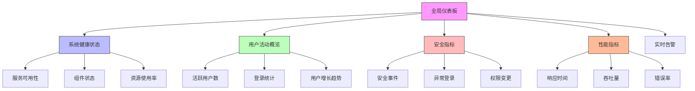

在企业级统一身份治理平台中，管理员是系统的核心使用者之一。一个设计良好的管理控制台能够为管理员提供直观、高效的管理界面，帮助他们快速了解系统状态、管理用户和权限、以及进行安全审计。本文将深入探讨管理员视角下的核心功能设计与实现。

## 引言

管理员在统一身份治理平台中承担着至关重要的角色，他们需要对系统的各个方面进行监控和管理。一个优秀的管理控制台应该能够提供全面的系统视图、高效的用户管理工具、灵活的权限分配机制以及详尽的审计查询功能。

## 全局视图设计

### 仪表板架构

全局视图为管理员提供平台整体运行状态的概览，帮助他们快速识别潜在问题和趋势：



### 实时监控实现

```java
public class GlobalDashboardService {
    private final SystemMetricsService metricsService;
    private final AlertService alertService;
    private final UserService userService;
    private final WebSocketService webSocketService;
    
    // 仪表板数据模型
    public class DashboardData {
        private SystemHealth health;
        private UserActivityOverview userActivity;
        private SecurityMetrics securityMetrics;
        private PerformanceMetrics performanceMetrics;
        private List<Alert> activeAlerts;
        private List<RecentActivity> recentActivities;
    }
    
    // 获取实时仪表板数据
    public DashboardData getRealTimeDashboardData() {
        DashboardData data = new DashboardData();
        
        // 并行获取各项数据
        CompletableFuture<SystemHealth> healthFuture = CompletableFuture.supplyAsync(
            () -> metricsService.getSystemHealth());
        
        CompletableFuture<UserActivityOverview> userActivityFuture = CompletableFuture.supplyAsync(
            () -> userService.getUserActivityOverview());
        
        CompletableFuture<SecurityMetrics> securityMetricsFuture = CompletableFuture.supplyAsync(
            () -> securityService.getSecurityMetrics());
        
        CompletableFuture<PerformanceMetrics> performanceMetricsFuture = CompletableFuture.supplyAsync(
            () -> metricsService.getPerformanceMetrics());
        
        CompletableFuture<List<Alert>> alertsFuture = CompletableFuture.supplyAsync(
            () -> alertService.getActiveAlerts());
        
        // 等待所有数据获取完成
        CompletableFuture.allOf(
            healthFuture, userActivityFuture, securityMetricsFuture, 
            performanceMetricsFuture, alertsFuture
        ).join();
        
        // 组装数据
        data.setHealth(healthFuture.join());
        data.setUserActivity(userActivityFuture.join());
        data.setSecurityMetrics(securityMetricsFuture.join());
        data.setPerformanceMetrics(performanceMetricsFuture.join());
        data.setActiveAlerts(alertsFuture.join());
        data.setRecentActivities(getRecentActivities());
        
        return data;
    }
    
    // 实时数据推送
    public class RealTimeDataPusher {
        
        // 订阅实时数据
        public void subscribeToRealTimeData(String sessionId, List<String> metrics) {
            // 建立WebSocket连接
            webSocketService.registerSession(sessionId, this::handleDataPush);
            
            // 订阅指定指标
            metricsService.subscribeToMetrics(sessionId, metrics);
        }
        
        // 处理数据推送
        private void handleDataPush(String sessionId, MetricData data) {
            // 构造推送消息
            PushMessage message = new PushMessage();
            message.setType("METRIC_UPDATE");
            message.setPayload(data);
            message.setTimestamp(Instant.now());
            
            // 推送数据
            webSocketService.sendMessage(sessionId, message);
        }
        
        // 取消订阅
        public void unsubscribeFromRealTimeData(String sessionId) {
            metricsService.unsubscribeFromMetrics(sessionId);
            webSocketService.unregisterSession(sessionId);
        }
    }
}
```

### 可视化组件设计

```javascript
// 仪表板可视化组件
class DashboardVisualization {
  constructor(containerId) {
    this.container = document.getElementById(containerId);
    this.charts = new Map();
  }
  
  // 创建健康状态卡片
  createHealthStatusCard(healthData) {
    const card = document.createElement('div');
    card.className = 'health-status-card';
    
    const statusIndicator = document.createElement('div');
    statusIndicator.className = `status-indicator ${healthData.status.toLowerCase()}`;
    statusIndicator.textContent = healthData.status;
    
    const servicesList = document.createElement('ul');
    servicesList.className = 'services-list';
    
    healthData.services.forEach(service => {
      const serviceItem = document.createElement('li');
      serviceItem.className = `service-item ${service.status.toLowerCase()}`;
      serviceItem.innerHTML = `
        <span class="service-name">${service.name}</span>
        <span class="service-status">${service.status}</span>
        <span class="response-time">${service.responseTime}ms</span>
      `;
      servicesList.appendChild(serviceItem);
    });
    
    card.appendChild(statusIndicator);
    card.appendChild(servicesList);
    
    return card;
  }
  
  // 创建趋势图表
  createTrendChart(chartId, chartData) {
    const canvas = document.createElement('canvas');
    canvas.id = chartId;
    
    // 使用Chart.js创建趋势图
    const ctx = canvas.getContext('2d');
    const chart = new Chart(ctx, {
      type: 'line',
      data: {
        labels: chartData.labels,
        datasets: [{
          label: chartData.label,
          data: chartData.values,
          borderColor: '#4CAF50',
          backgroundColor: 'rgba(76, 175, 80, 0.1)',
          tension: 0.4
        }]
      },
      options: {
        responsive: true,
        plugins: {
          title: {
            display: true,
            text: chartData.title
          }
        },
        scales: {
          y: {
            beginAtZero: true
          }
        }
      }
    });
    
    this.charts.set(chartId, chart);
    return canvas;
  }
  
  // 创建告警面板
  createAlertPanel(alerts) {
    const panel = document.createElement('div');
    panel.className = 'alert-panel';
    
    const header = document.createElement('div');
    header.className = 'panel-header';
    header.innerHTML = `<h3>实时告警 (${alerts.length})</h3>`;
    
    const alertList = document.createElement('div');
    alertList.className = 'alert-list';
    
    alerts.forEach(alert => {
      const alertItem = document.createElement('div');
      alertItem.className = `alert-item ${alert.level.toLowerCase()}`;
      alertItem.innerHTML = `
        <div class="alert-title">${alert.title}</div>
        <div class="alert-description">${alert.description}</div>
        <div class="alert-time">${this.formatTime(alert.timestamp)}</div>
      `;
      alertList.appendChild(alertItem);
    });
    
    panel.appendChild(header);
    panel.appendChild(alertList);
    
    return panel;
  }
  
  formatTime(timestamp) {
    return new Date(timestamp).toLocaleString();
  }
}
```

## 用户管理功能

### 用户搜索与筛选

```sql
-- 用户管理数据库设计
CREATE TABLE user_management_dashboard (
    id VARCHAR(50) PRIMARY KEY,
    user_id VARCHAR(50) NOT NULL,
    username VARCHAR(100) NOT NULL,
    email VARCHAR(200),
    full_name VARCHAR(200),
    department VARCHAR(100),
    status VARCHAR(20) DEFAULT 'ACTIVE',  -- ACTIVE, INACTIVE, LOCKED
    user_type VARCHAR(50) DEFAULT 'EMPLOYEE',  -- EMPLOYEE, CONTRACTOR, SYSTEM
    last_login TIMESTAMP NULL,
    created_at TIMESTAMP DEFAULT CURRENT_TIMESTAMP,
    updated_at TIMESTAMP DEFAULT CURRENT_TIMESTAMP ON UPDATE CURRENT_TIMESTAMP,
    
    INDEX idx_username (username),
    INDEX idx_email (email),
    INDEX idx_department (department),
    INDEX idx_status (status),
    INDEX idx_user_type (user_type),
    INDEX idx_last_login (last_login)
);

-- 用户搜索索引表
CREATE TABLE user_search_index (
    id VARCHAR(50) PRIMARY KEY,
    user_id VARCHAR(50) NOT NULL,
    search_terms TEXT NOT NULL,  -- 包含用户名、邮箱、全名等的全文索引
    indexed_at TIMESTAMP DEFAULT CURRENT_TIMESTAMP,
    
    FULLTEXT(search_terms),
    FOREIGN KEY (user_id) REFERENCES user_management_dashboard(id)
);

-- 批量操作日志表
CREATE TABLE bulk_operation_log (
    id VARCHAR(50) PRIMARY KEY,
    operation_type VARCHAR(50) NOT NULL,  -- ENABLE, DISABLE, DELETE, UPDATE_ROLE
    operator_id VARCHAR(50) NOT NULL,
    target_user_ids JSON NOT NULL,
    operation_data JSON,
    start_time TIMESTAMP NOT NULL,
    end_time TIMESTAMP,
    status VARCHAR(20) DEFAULT 'IN_PROGRESS',  -- IN_PROGRESS, COMPLETED, FAILED
    success_count INT DEFAULT 0,
    failure_count INT DEFAULT 0,
    error_details JSON,
    
    INDEX idx_operation_type (operation_type),
    INDEX idx_operator (operator_id),
    INDEX idx_status (status),
    INDEX idx_time_range (start_time, end_time)
);

-- 创建用户管理统计视图
CREATE VIEW user_management_statistics AS
SELECT 
    COUNT(*) as total_users,
    COUNT(CASE WHEN status = 'ACTIVE' THEN 1 END) as active_users,
    COUNT(CASE WHEN status = 'INACTIVE' THEN 1 END) as inactive_users,
    COUNT(CASE WHEN status = 'LOCKED' THEN 1 END) as locked_users,
    COUNT(CASE WHEN user_type = 'EMPLOYEE' THEN 1 END) as employee_users,
    COUNT(CASE WHEN user_type = 'CONTRACTOR' THEN 1 END) as contractor_users,
    COUNT(CASE WHEN user_type = 'SYSTEM' THEN 1 END) as system_users,
    AVG(TIMESTAMPDIFF(DAY, created_at, NOW())) as avg_account_age_days,
    department,
    COUNT(*) as department_user_count
FROM user_management_dashboard
GROUP BY department
WITH ROLLUP;
```

### 用户详情管理

```python
class UserDetailManager:
    def __init__(self, user_service, audit_service, notification_service):
        self.user_service = user_service
        self.audit_service = audit_service
        self.notification_service = notification_service
    
    def get_user_detail(self, user_id):
        """获取用户详细信息"""
        # 并行获取用户相关信息
        user_future = self._get_user_basic_info(user_id)
        permissions_future = self._get_user_permissions(user_id)
        activities_future = self._get_user_activities(user_id)
        audit_logs_future = self._get_user_audit_logs(user_id)
        
        # 等待所有数据获取完成
        user = user_future.result()
        permissions = permissions_future.result()
        activities = activities_future.result()
        audit_logs = audit_logs_future.result()
        
        return {
            'basic_info': user,
            'permissions': permissions,
            'recent_activities': activities,
            'audit_logs': audit_logs
        }
    
    def _get_user_basic_info(self, user_id):
        """获取用户基本信息"""
        return self.user_service.get_user(user_id)
    
    def _get_user_permissions(self, user_id):
        """获取用户权限信息"""
        return self.user_service.get_user_permissions_with_inheritance(user_id)
    
    def _get_user_activities(self, user_id):
        """获取用户活动信息"""
        return self.user_service.get_user_activities(user_id, days=30)
    
    def _get_user_audit_logs(self, user_id):
        """获取用户审计日志"""
        return self.audit_service.get_user_audit_logs(user_id, days=90)
    
    def update_user_profile(self, user_id, profile_data, updated_by):
        """更新用户档案"""
        # 获取更新前的数据
        old_profile = self.user_service.get_user(user_id)
        
        # 执行更新
        updated_profile = self.user_service.update_user_profile(user_id, profile_data)
        
        # 记录审计日志
        self.audit_service.log_user_profile_update(
            user_id=user_id,
            updated_by=updated_by,
            old_data=old_profile,
            new_data=updated_profile
        )
        
        # 发送通知
        self.notification_service.send_profile_update_notification(user_id, updated_by)
        
        return updated_profile
    
    def reset_user_password(self, user_id, reset_by):
        """重置用户密码"""
        # 生成临时密码
        temp_password = self._generate_temp_password()
        
        # 更新密码
        self.user_service.update_user_password(user_id, temp_password, temporary=True)
        
        # 记录审计日志
        self.audit_service.log_password_reset(user_id, reset_by)
        
        # 发送密码重置通知
        user = self.user_service.get_user(user_id)
        self.notification_service.send_password_reset_notification(user, temp_password)
        
        return temp_password
    
    def _generate_temp_password(self):
        """生成临时密码"""
        import secrets
        import string
        
        alphabet = string.ascii_letters + string.digits
        return ''.join(secrets.choice(alphabet) for _ in range(12))
```

## 权限分配管理

### 权限模型可视化

```java
public class PermissionAssignmentManager {
    private final PermissionService permissionService;
    private final RoleService roleService;
    private final AuditService auditService;
    
    // 权限分配视图
    public class PermissionAssignmentView {
        private User user;
        private List<Role> assignedRoles;
        private List<Permission> directPermissions;
        private List<Permission> inheritedPermissions;
        private PermissionInheritanceTree inheritanceTree;
    }
    
    // 获取权限分配视图
    public PermissionAssignmentView getPermissionAssignmentView(String userId) {
        PermissionAssignmentView view = new PermissionAssignmentView();
        
        // 获取用户信息
        view.setUser(userService.getUser(userId));
        
        // 获取直接分配的角色
        view.setAssignedRoles(roleService.getUserRoles(userId));
        
        // 获取直接分配的权限
        view.setDirectPermissions(permissionService.getUserDirectPermissions(userId));
        
        // 获取继承的权限
        view.setInheritedPermissions(permissionService.getUserInheritedPermissions(userId));
        
        // 构建权限继承树
        view.setInheritanceTree(buildPermissionInheritanceTree(userId));
        
        return view;
    }
    
    // 构建权限继承树
    private PermissionInheritanceTree buildPermissionInheritanceTree(String userId) {
        PermissionInheritanceTree tree = new PermissionInheritanceTree();
        
        // 添加直接权限节点
        List<Permission> directPermissions = permissionService.getUserDirectPermissions(userId);
        for (Permission permission : directPermissions) {
            tree.addDirectPermissionNode(permission);
        }
        
        // 添加角色继承权限节点
        List<Role> userRoles = roleService.getUserRoles(userId);
        for (Role role : userRoles) {
            List<Permission> rolePermissions = permissionService.getRolePermissions(role.getId());
            tree.addRolePermissionNode(role, rolePermissions);
            
            // 添加角色继承关系
            List<Role> parentRoles = roleService.getParentRoles(role.getId());
            for (Role parentRole : parentRoles) {
                tree.addRoleInheritance(role, parentRole);
            }
        }
        
        return tree;
    }
    
    // 分配角色给用户
    public AssignmentResult assignRoleToUser(String userId, String roleId, String assignedBy) {
        try {
            // 执行角色分配
            roleService.assignRoleToUser(userId, roleId);
            
            // 记录审计日志
            auditService.logRoleAssignment(userId, roleId, assignedBy);
            
            // 发送通知
            notificationService.sendRoleAssignmentNotification(userId, roleId, assignedBy);
            
            return new AssignmentResult(true, "角色分配成功");
        } catch (Exception e) {
            auditService.logRoleAssignmentFailure(userId, roleId, assignedBy, e.getMessage());
            return new AssignmentResult(false, "角色分配失败: " + e.getMessage());
        }
    }
    
    // 撤销用户角色
    public AssignmentResult revokeRoleFromUser(String userId, String roleId, String revokedBy) {
        try {
            // 执行角色撤销
            roleService.revokeRoleFromUser(userId, roleId);
            
            // 记录审计日志
            auditService.logRoleRevocation(userId, roleId, revokedBy);
            
            // 发送通知
            notificationService.sendRoleRevocationNotification(userId, roleId, revokedBy);
            
            return new AssignmentResult(true, "角色撤销成功");
        } catch (Exception e) {
            auditService.logRoleRevocationFailure(userId, roleId, revokedBy, e.getMessage());
            return new AssignmentResult(false, "角色撤销失败: " + e.getMessage());
        }
    }
}
```

### 批量权限操作

```javascript
// 批量权限管理界面
class BulkPermissionManager {
  constructor(permissionService, auditService) {
    this.permissionService = permissionService;
    this.auditService = auditService;
    this.operationQueue = [];
  }
  
  // 批量分配权限
  async bulkAssignPermissions(userIds, permissionIds, assignedBy) {
    const operationId = this.generateOperationId();
    
    // 创建操作记录
    const operation = {
      id: operationId,
      type: 'BULK_ASSIGN',
      userIds: userIds,
      permissionIds: permissionIds,
      assignedBy: assignedBy,
      status: 'STARTED',
      startTime: new Date(),
      progress: 0
    };
    
    // 添加到操作队列
    this.operationQueue.push(operation);
    
    // 执行批量操作
    const results = [];
    const totalUsers = userIds.length;
    
    for (let i = 0; i < totalUsers; i++) {
      const userId = userIds[i];
      try {
        // 分配权限
        await this.permissionService.assignPermissionsToUser(userId, permissionIds);
        
        // 记录成功
        results.push({
          userId: userId,
          status: 'SUCCESS'
        });
        
        // 更新进度
        operation.progress = ((i + 1) / totalUsers) * 100;
      } catch (error) {
        // 记录失败
        results.push({
          userId: userId,
          status: 'FAILED',
          error: error.message
        });
        
        // 记录审计日志
        this.auditService.logBulkPermissionFailure(
          userId, permissionIds, assignedBy, error.message
        );
      }
    }
    
    // 更新操作状态
    operation.status = 'COMPLETED';
    operation.endTime = new Date();
    operation.results = results;
    
    // 发送操作完成通知
    this.sendBulkOperationNotification(operation);
    
    return operation;
  }
  
  // 权限继承可视化
  renderPermissionInheritanceTree(userId) {
    // 获取权限继承数据
    const inheritanceData = this.permissionService.getPermissionInheritanceTree(userId);
    
    // 创建树形结构图
    const treeContainer = document.createElement('div');
    treeContainer.className = 'permission-inheritance-tree';
    
    // 使用D3.js或其他库渲染树形图
    this.renderTreeVisualization(treeContainer, inheritanceData);
    
    return treeContainer;
  }
  
  // 渲染树形可视化
  renderTreeVisualization(container, data) {
    // 这里使用简单的DOM渲染，实际项目中可以使用专业的可视化库
    const renderNode = (node, parentElement) => {
      const nodeElement = document.createElement('div');
      nodeElement.className = `tree-node ${node.type.toLowerCase()}`;
      
      const nodeContent = document.createElement('div');
      nodeContent.className = 'node-content';
      nodeContent.innerHTML = `
        <span class="node-type">${node.type}</span>
        <span class="node-name">${node.name}</span>
        <span class="node-description">${node.description || ''}</span>
      `;
      
      nodeElement.appendChild(nodeContent);
      
      if (node.children && node.children.length > 0) {
        const childrenContainer = document.createElement('div');
        childrenContainer.className = 'node-children';
        
        node.children.forEach(child => {
          renderNode(child, childrenContainer);
        });
        
        nodeElement.appendChild(childrenContainer);
      }
      
      parentElement.appendChild(nodeElement);
    };
    
    renderNode(data, container);
  }
}
```

## 审计查询功能

### 审计日志架构

```sql
-- 审计日志数据库设计
CREATE TABLE audit_logs (
    id VARCHAR(50) PRIMARY KEY,
    timestamp TIMESTAMP NOT NULL,
    user_id VARCHAR(50),
    user_name VARCHAR(200),
    action_type VARCHAR(100) NOT NULL,
    resource_type VARCHAR(100),
    resource_id VARCHAR(50),
    resource_name VARCHAR(200),
    ip_address VARCHAR(45),
    user_agent TEXT,
    before_state JSON,
    after_state JSON,
    additional_data JSON,
    severity VARCHAR(20) DEFAULT 'INFO',  -- INFO, WARNING, ERROR, CRITICAL
    category VARCHAR(50),  -- AUTHENTICATION, AUTHORIZATION, USER_MANAGEMENT, etc.
    
    INDEX idx_timestamp (timestamp),
    INDEX idx_user_id (user_id),
    INDEX idx_action_type (action_type),
    INDEX idx_resource_type (resource_type),
    INDEX idx_severity (severity),
    INDEX idx_category (category),
    INDEX idx_ip_address (ip_address)
);

-- 审计日志聚合表
CREATE TABLE audit_log_aggregations (
    id VARCHAR(50) PRIMARY KEY,
    aggregation_type VARCHAR(50) NOT NULL,  -- DAILY, HOURLY, WEEKLY
    date_key DATE NOT NULL,
    action_type VARCHAR(100) NOT NULL,
    resource_type VARCHAR(100),
    user_id VARCHAR(50),
    count INT NOT NULL DEFAULT 0,
    last_updated TIMESTAMP DEFAULT CURRENT_TIMESTAMP ON UPDATE CURRENT_TIMESTAMP,
    
    UNIQUE KEY unique_aggregation (aggregation_type, date_key, action_type, resource_type, user_id),
    INDEX idx_date_key (date_key),
    INDEX idx_action_type (action_type)
);

-- 审计配置表
CREATE TABLE audit_config (
    id VARCHAR(50) PRIMARY KEY,
    config_key VARCHAR(100) NOT NULL UNIQUE,
    config_value TEXT NOT NULL,
    description VARCHAR(500),
    enabled BOOLEAN DEFAULT TRUE,
    created_at TIMESTAMP DEFAULT CURRENT_TIMESTAMP,
    updated_at TIMESTAMP DEFAULT CURRENT_TIMESTAMP ON UPDATE CURRENT_TIMESTAMP,
    
    INDEX idx_config_key (config_key),
    INDEX idx_enabled (enabled)
);

-- 创建审计日志分析视图
CREATE VIEW audit_log_analysis AS
SELECT 
    DATE(timestamp) as log_date,
    action_type,
    resource_type,
    severity,
    COUNT(*) as event_count,
    COUNT(DISTINCT user_id) as unique_users,
    GROUP_CONCAT(DISTINCT ip_address) as involved_ips,
    MIN(timestamp) as first_event,
    MAX(timestamp) as last_event
FROM audit_logs
WHERE timestamp > DATE_SUB(NOW(), INTERVAL 30 DAY)
GROUP BY DATE(timestamp), action_type, resource_type, severity
ORDER BY log_date DESC, event_count DESC;
```

### 审计查询界面

```python
class AuditQueryManager:
    def __init__(self, audit_service, user_service):
        self.audit_service = audit_service
        self.user_service = user_service
    
    def search_audit_logs(self, criteria):
        """搜索审计日志"""
        # 构建查询条件
        query_conditions = self._build_query_conditions(criteria)
        
        # 执行查询
        logs = self.audit_service.search_audit_logs(query_conditions)
        
        # 补充用户信息
        enriched_logs = self._enrich_log_data(logs)
        
        return enriched_logs
    
    def _build_query_conditions(self, criteria):
        """构建查询条件"""
        conditions = {}
        
        # 时间范围
        if 'start_time' in criteria and 'end_time' in criteria:
            conditions['timestamp_range'] = (criteria['start_time'], criteria['end_time'])
        
        # 用户筛选
        if 'user_id' in criteria:
            conditions['user_id'] = criteria['user_id']
        
        # 操作类型筛选
        if 'action_types' in criteria:
            conditions['action_types'] = criteria['action_types']
        
        # 资源类型筛选
        if 'resource_types' in criteria:
            conditions['resource_types'] = criteria['resource_types']
        
        # 严重程度筛选
        if 'severities' in criteria:
            conditions['severities'] = criteria['severities']
        
        # IP地址筛选
        if 'ip_address' in criteria:
            conditions['ip_address'] = criteria['ip_address']
        
        return conditions
    
    def _enrich_log_data(self, logs):
        """丰富日志数据"""
        # 获取相关的用户信息
        user_ids = list(set(log['user_id'] for log in logs if log['user_id']))
        users = self.user_service.get_users_by_ids(user_ids)
        user_map = {user['id']: user for user in users}
        
        # 补充用户详细信息
        enriched_logs = []
        for log in logs:
            enriched_log = log.copy()
            if log['user_id'] in user_map:
                user = user_map[log['user_id']]
                enriched_log['user_full_name'] = user.get('full_name', '')
                enriched_log['user_department'] = user.get('department', '')
            enriched_logs.append(enriched_log)
        
        return enriched_logs
    
    def get_audit_statistics(self, period_start, period_end):
        """获取审计统计信息"""
        statistics = {
            'total_events': 0,
            'events_by_type': {},
            'events_by_severity': {},
            'unique_users': 0,
            'top_activities': [],
            'suspicious_activities': []
        }
        
        # 获取基础统计
        basic_stats = self.audit_service.get_basic_statistics(period_start, period_end)
        statistics['total_events'] = basic_stats['total_events']
        statistics['events_by_type'] = basic_stats['events_by_type']
        statistics['events_by_severity'] = basic_stats['events_by_severity']
        statistics['unique_users'] = basic_stats['unique_users']
        
        # 获取热门活动
        statistics['top_activities'] = self.audit_service.get_top_activities(
            period_start, period_end, limit=10
        )
        
        # 识别可疑活动
        statistics['suspicious_activities'] = self._identify_suspicious_activities(
            period_start, period_end
        )
        
        return statistics
    
    def _identify_suspicious_activities(self, period_start, period_end):
        """识别可疑活动"""
        suspicious_patterns = [
            # 异常登录时间
            {'pattern': 'unusual_login_time', 'description': '非工作时间登录'},
            # 频繁失败的认证尝试
            {'pattern': 'frequent_auth_failures', 'description': '频繁认证失败'},
            # 权限批量变更
            {'pattern': 'bulk_permission_changes', 'description': '批量权限变更'},
            # 异常IP访问
            {'pattern': 'unusual_ip_access', 'description': '异常IP地址访问'}
        ]
        
        suspicious_activities = []
        
        for pattern in suspicious_patterns:
            activities = self.audit_service.find_suspicious_activities(
                pattern['pattern'], period_start, period_end
            )
            
            if activities:
                suspicious_activities.append({
                    'pattern': pattern['pattern'],
                    'description': pattern['description'],
                    'activities': activities,
                    'count': len(activities)
                })
        
        return suspicious_activities
    
    def export_audit_logs(self, criteria, format='csv'):
        """导出审计日志"""
        # 搜索日志
        logs = self.search_audit_logs(criteria)
        
        # 格式化数据
        if format.lower() == 'csv':
            return self._format_as_csv(logs)
        elif format.lower() == 'json':
            return self._format_as_json(logs)
        else:
            raise ValueError(f"Unsupported export format: {format}")
    
    def _format_as_csv(self, logs):
        """格式化为CSV"""
        import csv
        import io
        
        output = io.StringIO()
        writer = csv.writer(output)
        
        # 写入表头
        writer.writerow([
            'Timestamp', 'User', 'Action', 'Resource', 'IP Address', 
            'Severity', 'Description'
        ])
        
        # 写入数据
        for log in logs:
            writer.writerow([
                log['timestamp'],
                log.get('user_full_name', log.get('user_name', log.get('user_id', 'N/A'))),
                log['action_type'],
                f"{log.get('resource_type', '')}:{log.get('resource_name', log.get('resource_id', ''))}",
                log.get('ip_address', ''),
                log.get('severity', ''),
                log.get('description', '')
            ])
        
        return output.getvalue()
```

## 总结

管理员视角的管理控制台是统一身份治理平台的核心组成部分。通过精心设计的全局视图、高效的用户管理功能、灵活的权限分配机制以及详尽的审计查询功能，管理员能够有效地监控和管理整个身份治理系统。

关键要点包括：

1. **全局视图**：提供实时的系统健康状态、用户活动概览、安全指标和性能数据
2. **用户管理**：支持高效的用户搜索、筛选、详情查看和批量操作
3. **权限分配**：提供直观的权限模型可视化和灵活的权限分配机制
4. **审计查询**：实现全面的日志记录、统计分析和可疑活动识别

在后续章节中，我们将继续探讨开发者视角的集成体验和运维视角的系统管理功能，为构建完整的企业级身份治理平台提供全面指导。