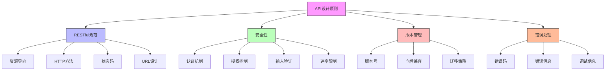

在企业级统一身份治理平台中，开发者是推动平台采用和扩展的关键力量。提供清晰的集成文档、功能丰富的SDK和设计良好的API，能够显著降低集成门槛，提升开发效率，促进平台的广泛采用。本文将深入探讨如何为开发者打造优秀的开发体验。

## 引言

开发者体验是统一身份治理平台成功的关键因素之一。一个优秀的开发者体验不仅包括功能强大的API，还需要完善的文档、易用的SDK和丰富的示例代码。通过为开发者提供全面的支持，可以加速集成过程，减少开发错误，提高整体开发效率。

## API设计最佳实践

### RESTful API设计原则

良好的API设计是开发者体验的基础，遵循RESTful设计原则能够提供一致且直观的接口：



### API端点设计

```java
@RestController
@RequestMapping("/api/v1")
@CrossOrigin(origins = "*")
public class IdentityManagementAPI {
    
    private final UserService userService;
    private final PermissionService permissionService;
    private final AuthenticationService authService;
    
    // 用户管理端点
    @GetMapping("/users")
    @Operation(summary = "搜索用户", description = "根据条件搜索用户列表")
    @ApiResponses(value = {
        @ApiResponse(responseCode = "200", description = "成功返回用户列表", 
                    content = @Content(array = @ArraySchema(schema = @Schema(implementation = User.class)))),
        @ApiResponse(responseCode = "400", description = "请求参数错误"),
        @ApiResponse(responseCode = "401", description = "未授权"),
        @ApiResponse(responseCode = "500", description = "服务器内部错误")
    })
    public ResponseEntity<PagedResult<User>> searchUsers(
            @RequestParam(required = false) String keyword,
            @RequestParam(required = false) String status,
            @RequestParam(defaultValue = "0") int page,
            @RequestParam(defaultValue = "20") int size) {
        
        SearchCriteria criteria = SearchCriteria.builder()
                .keyword(keyword)
                .status(status)
                .page(page)
                .size(size)
                .build();
        
        PagedResult<User> result = userService.searchUsers(criteria);
        return ResponseEntity.ok(result);
    }
    
    @PostMapping("/users")
    @Operation(summary = "创建用户", description = "创建一个新的用户账户")
    @ApiResponses(value = {
        @ApiResponse(responseCode = "201", description = "用户创建成功", 
                    content = @Content(schema = @Schema(implementation = User.class))),
        @ApiResponse(responseCode = "400", description = "请求参数错误"),
        @ApiResponse(responseCode = "401", description = "未授权"),
        @ApiResponse(responseCode = "409", description = "用户已存在"),
        @ApiResponse(responseCode = "500", description = "服务器内部错误")
    })
    public ResponseEntity<User> createUser(@Valid @RequestBody CreateUserRequest request) {
        // 验证请求参数
        validateCreateUserRequest(request);
        
        // 创建用户
        User user = userService.createUser(request);
        
        // 记录审计日志
        auditService.logUserCreation(user.getId(), getCurrentUserId());
        
        return ResponseEntity.status(HttpStatus.CREATED).body(user);
    }
    
    @GetMapping("/users/{userId}")
    @Operation(summary = "获取用户详情", description = "根据用户ID获取用户详细信息")
    @ApiResponses(value = {
        @ApiResponse(responseCode = "200", description = "成功返回用户信息", 
                    content = @Content(schema = @Schema(implementation = User.class))),
        @ApiResponse(responseCode = "404", description = "用户不存在"),
        @ApiResponse(responseCode = "401", description = "未授权"),
        @ApiResponse(responseCode = "500", description = "服务器内部错误")
    })
    public ResponseEntity<UserDetail> getUserDetail(@PathVariable String userId) {
        UserDetail userDetail = userService.getUserDetail(userId);
        return ResponseEntity.ok(userDetail);
    }
    
    // 权限管理端点
    @GetMapping("/users/{userId}/permissions")
    @Operation(summary = "获取用户权限", description = "获取指定用户的所有权限信息")
    @ApiResponses(value = {
        @ApiResponse(responseCode = "200", description = "成功返回权限列表", 
                    content = @Content(array = @ArraySchema(schema = @Schema(implementation = Permission.class)))),
        @ApiResponse(responseCode = "404", description = "用户不存在"),
        @ApiResponse(responseCode = "401", description = "未授权"),
        @ApiResponse(responseCode = "500", description = "服务器内部错误")
    })
    public ResponseEntity<List<Permission>> getUserPermissions(@PathVariable String userId) {
        List<Permission> permissions = permissionService.getUserPermissions(userId);
        return ResponseEntity.ok(permissions);
    }
    
    @PostMapping("/users/{userId}/permissions")
    @Operation(summary = "分配权限", description = "为指定用户分配权限")
    @ApiResponses(value = {
        @ApiResponse(responseCode = "200", description = "权限分配成功"),
        @ApiResponse(responseCode = "400", description = "请求参数错误"),
        @ApiResponse(responseCode = "404", description = "用户不存在"),
        @ApiResponse(responseCode = "401", description = "未授权"),
        @ApiResponse(responseCode = "500", description = "服务器内部错误")
    })
    public ResponseEntity<Void> assignPermissions(
            @PathVariable String userId,
            @Valid @RequestBody AssignPermissionsRequest request) {
        
        permissionService.assignPermissionsToUser(userId, request.getPermissionIds());
        auditService.logPermissionAssignment(userId, request.getPermissionIds(), getCurrentUserId());
        
        return ResponseEntity.ok().build();
    }
    
    // 认证端点
    @PostMapping("/auth/login")
    @Operation(summary = "用户登录", description = "用户凭据认证并获取访问令牌")
    @ApiResponses(value = {
        @ApiResponse(responseCode = "200", description = "登录成功", 
                    content = @Content(schema = @Schema(implementation = LoginResponse.class))),
        @ApiResponse(responseCode = "400", description = "请求参数错误"),
        @ApiResponse(responseCode = "401", description = "认证失败"),
        @ApiResponse(responseCode = "429", description = "请求过于频繁"),
        @ApiResponse(responseCode = "500", description = "服务器内部错误")
    })
    public ResponseEntity<LoginResponse> login(@Valid @RequestBody LoginRequest request) {
        // 执行认证
        AuthenticationResult result = authService.authenticate(request);
        
        if (result.isSuccess()) {
            // 生成访问令牌
            String accessToken = tokenService.generateAccessToken(result.getUser());
            String refreshToken = tokenService.generateRefreshToken(result.getUser());
            
            LoginResponse response = LoginResponse.builder()
                    .accessToken(accessToken)
                    .refreshToken(refreshToken)
                    .expiresIn(tokenService.getAccessTokenExpiration())
                    .user(result.getUser())
                    .build();
            
            // 记录登录日志
            auditService.logUserLogin(result.getUser().getId(), request.getIpAddress());
            
            return ResponseEntity.ok(response);
        } else {
            // 记录失败日志
            auditService.logFailedLogin(request.getUsername(), request.getIpAddress());
            
            return ResponseEntity.status(HttpStatus.UNAUTHORIZED).build();
        }
    }
}
```

### API安全机制

```python
class APISecurityManager:
    def __init__(self, auth_service, rate_limit_service):
        self.auth_service = auth_service
        self.rate_limit_service = rate_limit_service
    
    def authenticate_request(self, request):
        """认证API请求"""
        # 检查API密钥
        api_key = request.headers.get('X-API-Key')
        if api_key:
            return self._authenticate_with_api_key(api_key)
        
        # 检查Bearer令牌
        auth_header = request.headers.get('Authorization')
        if auth_header and auth_header.startswith('Bearer '):
            token = auth_header[7:]  # 移除"Bearer "前缀
            return self._authenticate_with_token(token)
        
        # 未提供认证信息
        raise AuthenticationError("Missing authentication credentials")
    
    def _authenticate_with_api_key(self, api_key):
        """使用API密钥认证"""
        # 验证API密钥
        client = self.auth_service.validate_api_key(api_key)
        if not client:
            raise AuthenticationError("Invalid API key")
        
        # 检查客户端权限
        if not client.is_active:
            raise AuthenticationError("API key is inactive")
        
        return client
    
    def _authenticate_with_token(self, token):
        """使用JWT令牌认证"""
        try:
            # 验证并解析JWT令牌
            payload = self.auth_service.validate_jwt_token(token)
            
            # 检查令牌是否过期
            if payload['exp'] < time.time():
                raise AuthenticationError("Token has expired")
            
            # 获取用户信息
            user = self.auth_service.get_user_by_id(payload['sub'])
            if not user or not user.is_active:
                raise AuthenticationError("User account is inactive")
            
            return user
        except jwt.InvalidTokenError:
            raise AuthenticationError("Invalid token")
    
    def authorize_request(self, request, user, required_permissions):
        """授权API请求"""
        # 检查用户是否具有所需权限
        if not self.auth_service.check_user_permissions(user.id, required_permissions):
            raise AuthorizationError("Insufficient permissions")
        
        return True
    
    def apply_rate_limiting(self, request, client_id):
        """应用速率限制"""
        # 获取客户端的速率限制配置
        rate_limit_config = self.rate_limit_service.get_client_config(client_id)
        
        # 检查是否超出限制
        if self.rate_limit_service.is_rate_limited(client_id, rate_limit_config):
            raise RateLimitError("Rate limit exceeded")
        
        # 记录请求
        self.rate_limit_service.record_request(client_id)
        
        return True
    
    def validate_input(self, data, schema):
        """验证输入数据"""
        try:
            # 使用JSON Schema验证数据
            jsonschema.validate(instance=data, schema=schema)
            return True
        except jsonschema.ValidationError as e:
            raise ValidationError(f"Invalid input data: {e.message}")
```

## SDK设计与实现

### 多语言SDK支持

```javascript
// JavaScript SDK示例
class IdentityManagementSDK {
  constructor(config) {
    this.config = {
      baseURL: config.baseURL || 'https://api.identity-platform.com',
      version: config.version || 'v1',
      apiKey: config.apiKey,
      accessToken: config.accessToken,
      ...config
    };
    
    this.httpClient = new HttpClient(this.config);
  }
  
  // 用户管理模块
  users() {
    return {
      // 搜索用户
      search: async (params = {}) => {
        const response = await this.httpClient.get('/users', { params });
        return response.data;
      },
      
      // 创建用户
      create: async (userData) => {
        const response = await this.httpClient.post('/users', userData);
        return response.data;
      },
      
      // 获取用户详情
      get: async (userId) => {
        const response = await this.httpClient.get(`/users/${userId}`);
        return response.data;
      },
      
      // 更新用户
      update: async (userId, userData) => {
        const response = await this.httpClient.put(`/users/${userId}`, userData);
        return response.data;
      },
      
      // 删除用户
      delete: async (userId) => {
        const response = await this.httpClient.delete(`/users/${userId}`);
        return response.data;
      }
    };
  }
  
  // 权限管理模块
  permissions() {
    return {
      // 获取用户权限
      getUserPermissions: async (userId) => {
        const response = await this.httpClient.get(`/users/${userId}/permissions`);
        return response.data;
      },
      
      // 分配权限
      assignToUser: async (userId, permissionIds) => {
        const response = await this.httpClient.post(`/users/${userId}/permissions`, {
          permissionIds: permissionIds
        });
        return response.data;
      },
      
      // 撤销权限
      revokeFromUser: async (userId, permissionIds) => {
        const response = await this.httpClient.delete(`/users/${userId}/permissions`, {
          data: { permissionIds: permissionIds }
        });
        return response.data;
      }
    };
  }
  
  // 认证模块
  auth() {
    return {
      // 用户登录
      login: async (credentials) => {
        const response = await this.httpClient.post('/auth/login', credentials);
        // 自动设置访问令牌
        if (response.data.accessToken) {
          this.config.accessToken = response.data.accessToken;
        }
        return response.data;
      },
      
      // 刷新令牌
      refreshToken: async (refreshToken) => {
        const response = await this.httpClient.post('/auth/refresh', {
          refreshToken: refreshToken
        });
        // 更新访问令牌
        if (response.data.accessToken) {
          this.config.accessToken = response.data.accessToken;
        }
        return response.data;
      }
    };
  }
}

// HTTP客户端实现
class HttpClient {
  constructor(config) {
    this.baseURL = config.baseURL;
    this.version = config.version;
    this.apiKey = config.apiKey;
    this.accessToken = config.accessToken;
  }
  
  async request(method, url, options = {}) {
    const fullURL = `${this.baseURL}/api/${this.version}${url}`;
    
    const headers = {
      'Content-Type': 'application/json',
      ...options.headers
    };
    
    // 添加认证头
    if (this.apiKey) {
      headers['X-API-Key'] = this.apiKey;
    }
    
    if (this.accessToken) {
      headers['Authorization'] = `Bearer ${this.accessToken}`;
    }
    
    const config = {
      method: method,
      headers: headers,
      ...options
    };
    
    // 添加请求体
    if (options.data) {
      config.body = JSON.stringify(options.data);
    }
    
    try {
      const response = await fetch(fullURL, config);
      
      if (!response.ok) {
        throw new APIError(`HTTP ${response.status}: ${response.statusText}`);
      }
      
      const contentType = response.headers.get('content-type');
      if (contentType && contentType.includes('application/json')) {
        const data = await response.json();
        return { data, response };
      } else {
        const text = await response.text();
        return { data: text, response };
      }
    } catch (error) {
      throw new APIError(`Request failed: ${error.message}`);
    }
  }
  
  get(url, options = {}) {
    return this.request('GET', url, options);
  }
  
  post(url, data, options = {}) {
    return this.request('POST', url, { ...options, data });
  }
  
  put(url, data, options = {}) {
    return this.request('PUT', url, { ...options, data });
  }
  
  delete(url, options = {}) {
    return this.request('DELETE', url, options);
  }
}
```

### SDK使用示例

```sql
-- SDK使用示例数据库设计
CREATE TABLE sdk_usage_examples (
    id VARCHAR(50) PRIMARY KEY,
    language VARCHAR(50) NOT NULL,
    framework VARCHAR(100),
    use_case VARCHAR(200) NOT NULL,
    title VARCHAR(200) NOT NULL,
    description TEXT,
    code_example TEXT NOT NULL,
    explanation TEXT,
    related_api_endpoints JSON,
    difficulty_level VARCHAR(20) DEFAULT 'BEGINNER',  -- BEGINNER, INTERMEDIATE, ADVANCED
    tags JSON,
    created_at TIMESTAMP DEFAULT CURRENT_TIMESTAMP,
    updated_at TIMESTAMP DEFAULT CURRENT_TIMESTAMP ON UPDATE CURRENT_TIMESTAMP,
    
    INDEX idx_language (language),
    INDEX idx_use_case (use_case),
    INDEX idx_difficulty (difficulty_level),
    FULLTEXT(title, description, code_example)
);

-- SDK版本管理
CREATE TABLE sdk_versions (
    id VARCHAR(50) PRIMARY KEY,
    sdk_name VARCHAR(100) NOT NULL,
    language VARCHAR(50) NOT NULL,
    version VARCHAR(20) NOT NULL,
    release_date TIMESTAMP NOT NULL,
    changelog TEXT,
    download_url VARCHAR(500),
    documentation_url VARCHAR(500),
    installation_command VARCHAR(200),
    supported_platforms JSON,
    dependencies JSON,
    deprecation_notice TEXT,
    is_latest BOOLEAN DEFAULT FALSE,
    
    UNIQUE KEY unique_sdk_version (sdk_name, language, version),
    INDEX idx_language (language),
    INDEX idx_version (version),
    INDEX idx_is_latest (is_latest)
);

-- 创建SDK使用统计视图
CREATE VIEW sdk_usage_statistics AS
SELECT 
    language,
    COUNT(*) as total_examples,
    COUNT(DISTINCT use_case) as unique_use_cases,
    AVG(CASE WHEN difficulty_level = 'BEGINNER' THEN 1 ELSE 0 END) as beginner_ratio,
    AVG(CASE WHEN difficulty_level = 'INTERMEDIATE' THEN 1 ELSE 0 END) as intermediate_ratio,
    AVG(CASE WHEN difficulty_level = 'ADVANCED' THEN 1 ELSE 0 END) as advanced_ratio,
    GROUP_CONCAT(DISTINCT framework) as supported_frameworks
FROM sdk_usage_examples
GROUP BY language;
```

## 集成文档体系

### 文档结构设计

```java
public class DocumentationManager {
    private final ContentService contentService;
    private final SearchService searchService;
    
    // 文档结构定义
    public class DocumentationStructure {
        private String title;
        private String description;
        private List<DocumentationSection> sections;
        private List<DocumentationGuide> guides;
        private List<APIDocumentation> apiDocs;
        private List<CodeExample> codeExamples;
    }
    
    // 文档章节
    public class DocumentationSection {
        private String id;
        private String title;
        private String description;
        private List<DocumentationPage> pages;
        private int order;
    }
    
    // 文档页面
    public class DocumentationPage {
        private String id;
        private String title;
        private String content;
        private String format; // markdown, html, etc.
        private List<String> relatedPages;
        private List<String> tags;
        private LocalDateTime lastUpdated;
    }
    
    // 快速入门指南
    public class QuickStartGuide {
        private String id;
        private String title;
        private String description;
        private List<GuideStep> steps;
        private String estimatedTime;
        private String difficulty;
        private List<Prerequisite> prerequisites;
    }
    
    // 获取文档结构
    public DocumentationStructure getDocumentationStructure() {
        DocumentationStructure structure = new DocumentationStructure();
        structure.setTitle("统一身份治理平台开发者文档");
        structure.setDescription("全面的开发者指南，帮助您快速集成和使用平台功能");
        
        // 添加主要章节
        structure.setSections(Arrays.asList(
            createGettingStartedSection(),
            createAuthenticationSection(),
            createUserManagementSection(),
            createPermissionManagementSection(),
            createAdvancedTopicsSection()
        ));
        
        // 添加指南
        structure.setGuides(Arrays.asList(
            createQuickStartGuide(),
            createIntegrationGuide(),
            createMigrationGuide()
        ));
        
        // 添加API文档
        structure.setApiDocs(getAPIDocumentation());
        
        // 添加代码示例
        structure.setCodeExamples(getCodeExamples());
        
        return structure;
    }
    
    private DocumentationSection createGettingStartedSection() {
        DocumentationSection section = new DocumentationSection();
        section.setId("getting-started");
        section.setTitle("快速入门");
        section.setDescription("帮助开发者快速开始使用平台的指南");
        section.setOrder(1);
        
        section.setPages(Arrays.asList(
            createDocumentationPage("introduction", "平台介绍", "introduction.md"),
            createDocumentationPage("installation", "SDK安装", "installation.md"),
            createDocumentationPage("first-api-call", "第一个API调用", "first-api-call.md"),
            createDocumentationPage("authentication", "认证与授权", "authentication.md")
        ));
        
        return section;
    }
    
    private DocumentationPage createDocumentationPage(String id, String title, String contentFile) {
        DocumentationPage page = new DocumentationPage();
        page.setId(id);
        page.setTitle(title);
        page.setContent(contentService.loadContent(contentFile));
        page.setFormat("markdown");
        page.setLastUpdated(LocalDateTime.now());
        return page;
    }
    
    // 搜索文档
    public List<SearchResult> searchDocumentation(String query) {
        return searchService.searchDocumentation(query);
    }
    
    // 获取API文档
    private List<APIDocumentation> getAPIDocumentation() {
        // 从API定义文件生成文档
        return apiDocumentationGenerator.generateFromOpenAPI("api-spec.yaml");
    }
    
    // 获取代码示例
    private List<CodeExample> getCodeExamples() {
        // 从数据库获取代码示例
        return codeExampleRepository.findAll();
    }
}
```

### 交互式文档

```javascript
// 交互式文档组件
class InteractiveDocumentation {
  constructor(containerId) {
    this.container = document.getElementById(containerId);
    this.currentSection = null;
    this.toc = []; // 目录
  }
  
  // 初始化文档
  init() {
    this.renderTableOfContents();
    this.renderContent();
    this.setupNavigation();
    this.setupSearch();
  }
  
  // 渲染目录
  renderTableOfContents() {
    const tocContainer = document.createElement('div');
    tocContainer.className = 'documentation-toc';
    
    const tocTitle = document.createElement('h2');
    tocTitle.textContent = '目录';
    tocContainer.appendChild(tocTitle);
    
    // 生成目录项
    this.toc.forEach(item => {
      const tocItem = document.createElement('div');
      tocItem.className = 'toc-item';
      tocItem.innerHTML = `
        <a href="#${item.id}" class="toc-link">${item.title}</a>
        ${item.children ? this.renderChildTOC(item.children) : ''}
      `;
      tocContainer.appendChild(tocItem);
    });
    
    this.container.appendChild(tocContainer);
  }
  
  // 渲染子目录
  renderChildTOC(children) {
    let html = '<div class="toc-children">';
    children.forEach(child => {
      html += `<div class="toc-child"><a href="#${child.id}">${child.title}</a></div>`;
    });
    html += '</div>';
    return html;
  }
  
  // 渲染内容
  renderContent() {
    const contentContainer = document.createElement('div');
    contentContainer.className = 'documentation-content';
    
    // 渲染当前章节内容
    if (this.currentSection) {
      contentContainer.innerHTML = this.renderSectionContent(this.currentSection);
    }
    
    this.container.appendChild(contentContainer);
  }
  
  // 渲染章节内容
  renderSectionContent(section) {
    let html = `
      <h1>${section.title}</h1>
      <div class="section-description">${section.description}</div>
    `;
    
    // 渲染页面内容
    section.pages.forEach(page => {
      html += `
        <div class="documentation-page" id="${page.id}">
          <h2>${page.title}</h2>
          <div class="page-content">${this.renderMarkdown(page.content)}</div>
          
          ${page.codeExamples ? this.renderCodeExamples(page.codeExamples) : ''}
          
          ${page.apiReferences ? this.renderAPIReferences(page.apiReferences) : ''}
        </div>
      `;
    });
    
    return html;
  }
  
  // 渲染代码示例
  renderCodeExamples(examples) {
    let html = '<div class="code-examples">';
    html += '<h3>代码示例</h3>';
    
    examples.forEach(example => {
      html += `
        <div class="code-example">
          <div class="example-header">
            <span class="example-title">${example.title}</span>
            <span class="example-language">${example.language}</span>
          </div>
          <pre><code class="language-${example.language.toLowerCase()}">${this.escapeHtml(example.code)}</code></pre>
          <div class="example-description">${example.description}</div>
          ${example.tryItOut ? `<button class="try-it-button" data-example="${example.id}">在线尝试</button>` : ''}
        </div>
      `;
    });
    
    html += '</div>';
    return html;
  }
  
  // 渲染API引用
  renderAPIReferences(references) {
    let html = '<div class="api-references">';
    html += '<h3>API参考</h3>';
    
    references.forEach(ref => {
      html += `
        <div class="api-reference">
          <div class="api-endpoint">
            <span class="method ${ref.method.toLowerCase()}">${ref.method}</span>
            <span class="path">${ref.path}</span>
          </div>
          <div class="api-description">${ref.description}</div>
          ${ref.parameters ? this.renderAPIParameters(ref.parameters) : ''}
          ${ref.responses ? this.renderAPIResponses(ref.responses) : ''}
        </div>
      `;
    });
    
    html += '</div>';
    return html;
  }
  
  // 渲染API参数
  renderAPIParameters(parameters) {
    let html = '<div class="api-parameters"><h4>参数</h4><table>';
    html += '<thead><tr><th>名称</th><th>类型</th><th>必需</th><th>描述</th></tr></thead>';
    html += '<tbody>';
    
    parameters.forEach(param => {
      html += `
        <tr>
          <td>${param.name}</td>
          <td>${param.type}</td>
          <td>${param.required ? '是' : '否'}</td>
          <td>${param.description}</td>
        </tr>
      `;
    });
    
    html += '</tbody></table></div>';
    return html;
  }
  
  // 渲染API响应
  renderAPIResponses(responses) {
    let html = '<div class="api-responses"><h4>响应</h4>';
    
    responses.forEach(response => {
      html += `
        <div class="response">
          <div class="response-header">
            <span class="status-code">${response.statusCode}</span>
            <span class="description">${response.description}</span>
          </div>
          ${response.example ? `<pre><code>${this.escapeHtml(JSON.stringify(response.example, null, 2))}</code></pre>` : ''}
        </div>
      `;
    });
    
    html += '</div>';
    return html;
  }
  
  // Markdown渲染
  renderMarkdown(markdown) {
    // 这里可以使用marked.js或其他Markdown渲染库
    return marked(markdown);
  }
  
  escapeHtml(text) {
    const div = document.createElement('div');
    div.textContent = text;
    return div.innerHTML;
  }
}
```

## 开发者支持体系

### 示例项目与模板

```sql
-- 示例项目数据库设计
CREATE TABLE sample_projects (
    id VARCHAR(50) PRIMARY KEY,
    name VARCHAR(200) NOT NULL,
    description TEXT,
    language VARCHAR(50) NOT NULL,
    framework VARCHAR(100),
    category VARCHAR(100),  -- WEB, MOBILE, API, etc.
    difficulty VARCHAR(20) DEFAULT 'BEGINNER',  -- BEGINNER, INTERMEDIATE, ADVANCED
    github_url VARCHAR(500),
    documentation_url VARCHAR(500),
    download_url VARCHAR(500),
    tags JSON,
    features JSON,
    dependencies JSON,
    setup_instructions TEXT,
    last_updated TIMESTAMP DEFAULT CURRENT_TIMESTAMP ON UPDATE CURRENT_TIMESTAMP,
    download_count INT DEFAULT 0,
    
    INDEX idx_language (language),
    INDEX idx_category (category),
    INDEX idx_difficulty (difficulty),
    FULLTEXT(name, description)
);

-- 项目模板表
CREATE TABLE project_templates (
    id VARCHAR(50) PRIMARY KEY,
    name VARCHAR(200) NOT NULL,
    description TEXT,
    language VARCHAR(50) NOT NULL,
    framework VARCHAR(100),
    template_type VARCHAR(50) NOT NULL,  -- STARTER, BOILERPLATE, FULL_APPLICATION
    github_url VARCHAR(500),
    download_url VARCHAR(500),
    preview_url VARCHAR(500),
    tags JSON,
    required_dependencies JSON,
    setup_script VARCHAR(200),
    customization_options JSON,
    created_at TIMESTAMP DEFAULT CURRENT_TIMESTAMP,
    updated_at TIMESTAMP DEFAULT CURRENT_TIMESTAMP ON UPDATE CURRENT_TIMESTAMP,
    download_count INT DEFAULT 0,
    
    INDEX idx_language (language),
    INDEX idx_template_type (template_type)
);

-- 创建开发者资源聚合视图
CREATE VIEW developer_resources_overview AS
SELECT 
    'SDK' as resource_type,
    language,
    COUNT(*) as resource_count,
    MAX(last_updated) as latest_update,
    SUM(download_count) as total_downloads
FROM sdk_versions
GROUP BY language

UNION ALL

SELECT 
    'SAMPLE_PROJECT' as resource_type,
    language,
    COUNT(*) as resource_count,
    MAX(last_updated) as latest_update,
    SUM(download_count) as total_downloads
FROM sample_projects
GROUP BY language

UNION ALL

SELECT 
    'TEMPLATE' as resource_type,
    language,
    COUNT(*) as resource_count,
    MAX(updated_at) as latest_update,
    SUM(download_count) as total_downloads
FROM project_templates
GROUP BY language;
```

### 开发者社区与支持

```python
class DeveloperCommunityManager:
    def __init__(self, forum_service, support_service, knowledge_base_service):
        self.forum_service = forum_service
        self.support_service = support_service
        self.knowledge_base_service = knowledge_base_service
    
    def create_forum_post(self, user_id, title, content, tags):
        """创建论坛帖子"""
        post = {
            'id': self.generate_post_id(),
            'user_id': user_id,
            'title': title,
            'content': content,
            'tags': tags,
            'created_at': datetime.utcnow(),
            'updated_at': datetime.utcnow(),
            'views': 0,
            'likes': 0,
            'replies': 0,
            'status': 'ACTIVE'
        }
        
        # 保存帖子
        self.forum_service.save_post(post)
        
        # 索引内容用于搜索
        self.forum_service.index_post_content(post)
        
        return post
    
    def get_forum_posts(self, criteria):
        """获取论坛帖子"""
        return self.forum_service.search_posts(criteria)
    
    def submit_support_ticket(self, user_id, subject, description, priority='MEDIUM'):
        """提交支持工单"""
        ticket = {
            'id': self.generate_ticket_id(),
            'user_id': user_id,
            'subject': subject,
            'description': description,
            'priority': priority,
            'status': 'OPEN',
            'created_at': datetime.utcnow(),
            'updated_at': datetime.utcnow(),
            'assigned_to': None,
            'resolution': None
        }
        
        # 保存工单
        self.support_service.save_ticket(ticket)
        
        # 发送通知
        self.support_service.send_ticket_notification(ticket)
        
        return ticket
    
    def search_knowledge_base(self, query):
        """搜索知识库"""
        return self.knowledge_base_service.search_articles(query)
    
    def get_popular_topics(self, limit=10):
        """获取热门话题"""
        return self.forum_service.get_popular_topics(limit)
    
    def get_recent_activity(self, limit=20):
        """获取最近活动"""
        recent_posts = self.forum_service.get_recent_posts(limit)
        recent_knowledge_articles = self.knowledge_base_service.get_recent_articles(limit)
        
        # 合并并排序
        all_activities = recent_posts + recent_knowledge_articles
        all_activities.sort(key=lambda x: x['created_at'], reverse=True)
        
        return all_activities[:limit]
    
    def setup_developer_onboarding(self, user_id):
        """设置开发者入职流程"""
        onboarding_tasks = [
            {
                'id': 'welcome_email',
                'title': '欢迎邮件',
                'description': '发送欢迎邮件和入门指南',
                'type': 'AUTOMATED',
                'status': 'PENDING'
            },
            {
                'id': 'api_key_setup',
                'title': 'API密钥设置',
                'description': '生成和配置API密钥',
                'type': 'AUTOMATED',
                'status': 'PENDING'
            },
            {
                'id': 'first_api_call',
                'title': '首次API调用',
                'description': '指导完成首次API调用',
                'type': 'INTERACTIVE',
                'status': 'PENDING'
            },
            {
                'id': 'sample_project',
                'title': '示例项目',
                'description': '下载和运行示例项目',
                'type': 'INTERACTIVE',
                'status': 'PENDING'
            }
        ]
        
        # 为用户创建入职任务
        for task in onboarding_tasks:
            task['user_id'] = user_id
            task['created_at'] = datetime.utcnow()
            self.support_service.save_onboarding_task(task)
        
        # 发送欢迎邮件
        self.send_welcome_email(user_id)
        
        return onboarding_tasks
```

## 总结

为开发者提供优秀的开发体验是统一身份治理平台成功的关键因素。通过遵循API设计最佳实践、提供功能丰富的SDK、构建完善的文档体系以及建立活跃的开发者社区，可以显著降低集成门槛，提升开发效率，促进平台的广泛采用。

关键要点包括：

1. **API设计**：遵循RESTful规范，提供一致且直观的接口
2. **SDK支持**：提供多语言SDK，简化集成过程
3. **文档体系**：构建结构化的文档，包含丰富的代码示例
4. **开发者支持**：建立社区和支撑体系，提供及时帮助

在后续章节中，我们将继续探讨运维视角的配置管理、系统监控和日志查询功能，为构建完整的企业级身份治理平台提供全面指导。