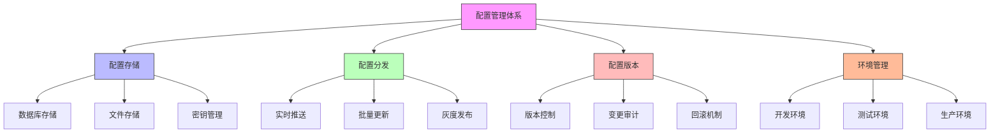

在企业级统一身份治理平台中，运维人员负责确保系统的稳定运行、性能优化和故障排查。一个完善的运维支持体系需要提供强大的配置管理、实时的系统监控和详尽的日志查询功能。本文将深入探讨运维视角下的核心功能设计与实现。

## 引言

运维视角是统一身份治理平台中不可或缺的重要组成部分。随着系统规模的扩大和复杂性的增加，运维人员需要更加精细化的工具来管理配置、监控系统状态和分析日志信息。通过构建完善的运维支持体系，可以显著提升系统的可靠性、可维护性和故障响应速度。

## 配置管理体系

### 配置管理架构

配置管理是运维工作的基础，需要支持灵活的配置项管理、版本控制和环境隔离：



### 配置项管理实现

```java
public class ConfigurationManagementService {
    private final ConfigRepository configRepository;
    private final AuditService auditService;
    private final NotificationService notificationService;
    private final ConfigCacheService configCacheService;
    
    // 配置项模型
    public class ConfigItem {
        private String id;
        private String key;
        private String value;
        private String description;
        private String category;
        private String environment;
        private ConfigValueType valueType;
        private boolean encrypted;
        private boolean sensitive;
        private LocalDateTime createdAt;
        private LocalDateTime updatedAt;
        private String createdBy;
        private String updatedBy;
    }
    
    // 配置项类型枚举
    public enum ConfigValueType {
        STRING, INTEGER, BOOLEAN, JSON, YAML
    }
    
    // 获取配置项
    public ConfigItem getConfigItem(String key, String environment) {
        // 首先从缓存获取
        ConfigItem cachedItem = configCacheService.get(key, environment);
        if (cachedItem != null) {
            return cachedItem;
        }
        
        // 从数据库获取
        ConfigItem item = configRepository.findByKeyAndEnvironment(key, environment);
        if (item != null) {
            // 放入缓存
            configCacheService.put(key, environment, item);
        }
        
        return item;
    }
    
    // 更新配置项
    public ConfigItem updateConfigItem(String key, String environment, Object value, String updatedBy) {
        // 获取旧配置项
        ConfigItem oldItem = getConfigItem(key, environment);
        
        // 创建新配置项
        ConfigItem newItem = new ConfigItem();
        if (oldItem != null) {
            newItem.setId(oldItem.getId());
            newItem.setCreatedAt(oldItem.getCreatedAt());
            newItem.setCreatedBy(oldItem.getCreatedBy());
        } else {
            newItem.setId(UUID.randomUUID().toString());
            newItem.setCreatedAt(LocalDateTime.now());
            newItem.setCreatedBy(updatedBy);
        }
        
        newItem.setKey(key);
        newItem.setEnvironment(environment);
        newItem.setValue(convertValueToString(value, oldItem != null ? oldItem.getValueType() : ConfigValueType.STRING));
        newItem.setDescription(oldItem != null ? oldItem.getDescription() : "");
        newItem.setCategory(oldItem != null ? oldItem.getCategory() : "DEFAULT");
        newItem.setValueType(oldItem != null ? oldItem.getValueType() : ConfigValueType.STRING);
        newItem.setEncrypted(oldItem != null ? oldItem.isEncrypted() : false);
        newItem.setSensitive(oldItem != null ? oldItem.isSensitive() : false);
        newItem.setUpdatedAt(LocalDateTime.now());
        newItem.setUpdatedBy(updatedBy);
        
        // 保存配置项
        ConfigItem savedItem = configRepository.save(newItem);
        
        // 更新缓存
        configCacheService.put(key, environment, savedItem);
        
        // 记录审计日志
        auditService.logConfigChange(oldItem, savedItem, updatedBy);
        
        // 发送变更通知
        notificationService.sendConfigChangeNotification(savedItem);
        
        return savedItem;
    }
    
    // 批量更新配置
    public List<ConfigItem> bulkUpdateConfig(Map<String, Object> configUpdates, String environment, String updatedBy) {
        List<ConfigItem> updatedItems = new ArrayList<>();
        
        for (Map.Entry<String, Object> entry : configUpdates.entrySet()) {
            ConfigItem item = updateConfigItem(entry.getKey(), environment, entry.getValue(), updatedBy);
            updatedItems.add(item);
        }
        
        return updatedItems;
    }
    
    // 配置项加密处理
    private String encryptConfigValue(String value) {
        // 使用AES加密
        return encryptionService.encrypt(value);
    }
    
    // 配置项解密处理
    private String decryptConfigValue(String encryptedValue) {
        // 使用AES解密
        return encryptionService.decrypt(encryptedValue);
    }
}
```

### 配置模板与环境管理

```sql
-- 配置管理数据库设计
CREATE TABLE config_items (
    id VARCHAR(50) PRIMARY KEY,
    config_key VARCHAR(200) NOT NULL,
    config_value TEXT,
    description TEXT,
    category VARCHAR(100),
    environment VARCHAR(50) NOT NULL,  -- DEV, TEST, PROD
    value_type VARCHAR(20) DEFAULT 'STRING',  -- STRING, INTEGER, BOOLEAN, JSON, YAML
    is_encrypted BOOLEAN DEFAULT FALSE,
    is_sensitive BOOLEAN DEFAULT FALSE,
    created_at TIMESTAMP DEFAULT CURRENT_TIMESTAMP,
    updated_at TIMESTAMP DEFAULT CURRENT_TIMESTAMP ON UPDATE CURRENT_TIMESTAMP,
    created_by VARCHAR(100),
    updated_by VARCHAR(100),
    
    UNIQUE KEY unique_config (config_key, environment),
    INDEX idx_environment (environment),
    INDEX idx_category (category),
    INDEX idx_created_at (created_at)
);

-- 配置模板表
CREATE TABLE config_templates (
    id VARCHAR(50) PRIMARY KEY,
    template_name VARCHAR(200) NOT NULL,
    description TEXT,
    template_data JSON NOT NULL,
    version VARCHAR(20) NOT NULL,
    is_active BOOLEAN DEFAULT TRUE,
    created_at TIMESTAMP DEFAULT CURRENT_TIMESTAMP,
    updated_at TIMESTAMP DEFAULT CURRENT_TIMESTAMP ON UPDATE CURRENT_TIMESTAMP,
    created_by VARCHAR(100),
    
    INDEX idx_template_name (template_name),
    INDEX idx_version (version),
    INDEX idx_is_active (is_active)
);

-- 配置变更历史表
CREATE TABLE config_change_history (
    id VARCHAR(50) PRIMARY KEY,
    config_item_id VARCHAR(50) NOT NULL,
    old_value TEXT,
    new_value TEXT,
    change_type VARCHAR(20) NOT NULL,  -- CREATE, UPDATE, DELETE
    changed_at TIMESTAMP DEFAULT CURRENT_TIMESTAMP,
    changed_by VARCHAR(100),
    change_reason VARCHAR(500),
    
    FOREIGN KEY (config_item_id) REFERENCES config_items(id),
    INDEX idx_config_item (config_item_id),
    INDEX idx_changed_at (changed_at),
    INDEX idx_changed_by (changed_by)
);

-- 环境配置映射表
CREATE TABLE environment_config_mapping (
    id VARCHAR(50) PRIMARY KEY,
    environment VARCHAR(50) NOT NULL,
    config_key VARCHAR(200) NOT NULL,
    template_id VARCHAR(50),
    override_value TEXT,
    is_overridden BOOLEAN DEFAULT FALSE,
    
    FOREIGN KEY (template_id) REFERENCES config_templates(id),
    UNIQUE KEY unique_env_config (environment, config_key)
);

-- 创建配置统计视图
CREATE VIEW config_statistics AS
SELECT 
    environment,
    COUNT(*) as total_configs,
    COUNT(CASE WHEN is_encrypted = TRUE THEN 1 END) as encrypted_configs,
    COUNT(CASE WHEN is_sensitive = TRUE THEN 1 END) as sensitive_configs,
    COUNT(CASE WHEN category = 'SECURITY' THEN 1 END) as security_configs,
    COUNT(CASE WHEN category = 'PERFORMANCE' THEN 1 END) as performance_configs,
    MAX(updated_at) as last_updated
FROM config_items
GROUP BY environment;
```

### 配置分发与同步

```python
class ConfigDistributionManager:
    def __init__(self, config_service, message_queue_service, cache_service):
        self.config_service = config_service
        self.message_queue_service = message_queue_service
        self.cache_service = cache_service
        self.subscribers = {}
    
    def subscribe_to_config_changes(self, service_id, config_keys, callback):
        """订阅配置变更"""
        if service_id not in self.subscribers:
            self.subscribers[service_id] = {
                'config_keys': set(),
                'callbacks': []
            }
        
        self.subscribers[service_id]['config_keys'].update(config_keys)
        self.subscribers[service_id]['callbacks'].append(callback)
        
        # 注册到消息队列
        for key in config_keys:
            self.message_queue_service.subscribe(f"config.{key}", self._handle_config_change)
    
    def _handle_config_change(self, message):
        """处理配置变更消息"""
        config_key = message['config_key']
        new_value = message['new_value']
        environment = message['environment']
        
        # 更新本地缓存
        self.cache_service.set(f"config.{environment}.{config_key}", new_value)
        
        # 通知订阅者
        for service_id, subscriber in self.subscribers.items():
            if config_key in subscriber['config_keys']:
                for callback in subscriber['callbacks']:
                    try:
                        callback(config_key, new_value, environment)
                    except Exception as e:
                        logger.error(f"配置变更回调失败: {e}")
    
    def push_config_to_service(self, service_id, config_data):
        """推送配置到服务"""
        # 通过消息队列推送配置
        self.message_queue_service.send_message(
            f"service.{service_id}.config",
            {
                'type': 'CONFIG_PUSH',
                'config_data': config_data,
                'timestamp': datetime.utcnow().isoformat()
            }
        )
    
    def sync_config_across_instances(self, config_key, environment):
        """在实例间同步配置"""
        # 获取最新配置
        config_item = self.config_service.get_config_item(config_key, environment)
        
        # 构造变更消息
        message = {
            'config_key': config_key,
            'new_value': config_item.value if config_item else None,
            'environment': environment,
            'timestamp': datetime.utcnow().isoformat()
        }
        
        # 发布到所有实例
        self.message_queue_service.publish("config.change", message)
    
    def get_service_config(self, service_id, environment):
        """获取服务配置"""
        # 从缓存获取
        cached_config = self.cache_service.get(f"service.{service_id}.config.{environment}")
        if cached_config:
            return cached_config
        
        # 从数据库获取服务相关配置
        service_configs = self.config_service.get_service_configs(service_id, environment)
        
        # 放入缓存
        self.cache_service.set(f"service.{service_id}.config.{environment}", service_configs, ttl=300)
        
        return service_configs
```

## 系统监控体系

### 监控指标设计

```javascript
// 系统监控服务
class SystemMonitoringService {
  constructor(metricsService, alertService, visualizationService) {
    this.metricsService = metricsService;
    this.alertService = alertService;
    this.visualizationService = visualizationService;
    this.monitors = new Map();
  }
  
  // 初始化监控指标
  initializeMetrics() {
    // 认证相关指标
    this.metricsService.registerCounter('auth.login_attempts', '登录尝试次数');
    this.metricsService.registerCounter('auth.login_success', '登录成功次数');
    this.metricsService.registerCounter('auth.login_failure', '登录失败次数');
    this.metricsService.registerHistogram('auth.login_duration', '登录耗时分布');
    
    // 授权相关指标
    this.metricsService.registerCounter('authz.permission_checks', '权限检查次数');
    this.metricsService.registerCounter('authz.permission_granted', '权限授予次数');
    this.metricsService.registerCounter('authz.permission_denied', '权限拒绝次数');
    this.metricsService.registerHistogram('authz.check_duration', '权限检查耗时');
    
    // 用户管理指标
    this.metricsService.registerCounter('user.operations', '用户操作次数');
    this.metricsService.registerGauge('user.active_count', '活跃用户数');
    this.metricsService.registerGauge('user.total_count', '总用户数');
    
    // 系统性能指标
    this.metricsService.registerGauge('system.cpu_usage', 'CPU使用率');
    this.metricsService.registerGauge('system.memory_usage', '内存使用率');
    this.metricsService.registerGauge('system.disk_usage', '磁盘使用率');
    this.metricsService.registerHistogram('system.response_time', '系统响应时间');
  }
  
  // 设置监控器
  setupMonitors() {
    // 认证成功率监控
    this.createMonitor('auth_success_rate', {
      metric: 'auth.login_success_rate',
      checkFunction: this.checkAuthSuccessRate.bind(this),
      threshold: 0.95,  // 95%成功率阈值
      alertLevel: 'HIGH',
      checkInterval: 60000  // 1分钟检查一次
    });
    
    // 系统响应时间监控
    this.createMonitor('response_time', {
      metric: 'system.response_time_95th',
      checkFunction: this.checkResponseTime.bind(this),
      threshold: 2000,  // 2秒阈值
      alertLevel: 'MEDIUM',
      checkInterval: 30000  // 30秒检查一次
    });
    
    // CPU使用率监控
    this.createMonitor('cpu_usage', {
      metric: 'system.cpu_usage',
      checkFunction: this.checkCPUUsage.bind(this),
      threshold: 0.8,  // 80%使用率阈值
      alertLevel: 'LOW',
      checkInterval: 10000  // 10秒检查一次
    });
  }
  
  // 创建监控器
  createMonitor(name, config) {
    const monitor = {
      name: name,
      config: config,
      lastCheck: null,
      lastValue: null,
      isEnabled: true
    };
    
    this.monitors.set(name, monitor);
    
    // 启动定时检查
    if (config.checkInterval) {
      monitor.timer = setInterval(() => {
        this.checkMonitor(monitor);
      }, config.checkInterval);
    }
    
    return monitor;
  }
  
  // 检查监控器
  async checkMonitor(monitor) {
    if (!monitor.isEnabled) return;
    
    try {
      const currentValue = await monitor.config.checkFunction();
      monitor.lastCheck = new Date();
      monitor.lastValue = currentValue;
      
      // 检查是否超过阈值
      if (this.isThresholdExceeded(currentValue, monitor.config.threshold)) {
        this.triggerAlert(monitor, currentValue);
      }
    } catch (error) {
      console.error(`监控检查失败 ${monitor.name}:`, error);
    }
  }
  
  // 检查认证成功率
  async checkAuthSuccessRate() {
    const attempts = await this.metricsService.getCounterValue('auth.login_attempts');
    const successes = await this.metricsService.getCounterValue('auth.login_success');
    
    if (attempts === 0) return 1.0;
    return successes / attempts;
  }
  
  // 检查响应时间
  async checkResponseTime() {
    const responseTime95th = await this.metricsService.getHistogramQuantile('system.response_time', 0.95);
    return responseTime95th;
  }
  
  // 检查CPU使用率
  async checkCPUUsage() {
    const cpuUsage = await this.metricsService.getGaugeValue('system.cpu_usage');
    return cpuUsage;
  }
  
  // 触发告警
  triggerAlert(monitor, currentValue) {
    const alert = {
      monitorName: monitor.name,
      metric: monitor.config.metric,
      currentValue: currentValue,
      threshold: monitor.config.threshold,
      level: monitor.config.alertLevel,
      timestamp: new Date()
    };
    
    this.alertService.sendAlert(alert);
  }
  
  // 判断是否超过阈值
  isThresholdExceeded(currentValue, threshold) {
    // 对于成功率等比率指标，低于阈值才告警
    if (monitor.config.metric.includes('rate') || monitor.config.metric.includes('success')) {
      return currentValue < threshold;
    }
    // 对于其他指标，超过阈值才告警
    return currentValue > threshold;
  }
}
```

### 监控面板实现

```java
public class MonitoringDashboardService {
    private final MetricsService metricsService;
    private final AlertService alertService;
    private final VisualizationService visualizationService;
    
    // 监控面板数据
    public class MonitoringDashboard {
        private SystemHealth health;
        private PerformanceMetrics performance;
        private SecurityMetrics security;
        private BusinessMetrics business;
        private List<Alert> activeAlerts;
        private List<MetricChart> charts;
    }
    
    // 系统健康状态
    public class SystemHealth {
        private OverallStatus status;
        private List<ComponentStatus> components;
        private double uptimePercentage;
        private LocalDateTime lastCheck;
    }
    
    // 性能指标
    public class PerformanceMetrics {
        private double avgResponseTime;
        private double p95ResponseTime;
        private double p99ResponseTime;
        private int requestsPerSecond;
        private double errorRate;
    }
    
    // 安全指标
    public class SecurityMetrics {
        private int failedLoginAttempts;
        private int securityViolations;
        private int permissionDenied;
        private List<SuspiciousActivity> suspiciousActivities;
    }
    
    // 获取监控面板数据
    public MonitoringDashboard getMonitoringDashboard() {
        MonitoringDashboard dashboard = new MonitoringDashboard();
        
        // 并行获取各项数据
        CompletableFuture<SystemHealth> healthFuture = CompletableFuture.supplyAsync(
            () -> getSystemHealth());
        
        CompletableFuture<PerformanceMetrics> performanceFuture = CompletableFuture.supplyAsync(
            () -> getPerformanceMetrics());
        
        CompletableFuture<SecurityMetrics> securityFuture = CompletableFuture.supplyAsync(
            () -> getSecurityMetrics());
        
        CompletableFuture<BusinessMetrics> businessFuture = CompletableFuture.supplyAsync(
            () -> getBusinessMetrics());
        
        CompletableFuture<List<Alert>> alertsFuture = CompletableFuture.supplyAsync(
            () -> alertService.getActiveAlerts());
        
        // 等待所有数据获取完成
        CompletableFuture.allOf(
            healthFuture, performanceFuture, securityFuture, businessFuture, alertsFuture
        ).join();
        
        // 组装数据
        dashboard.setHealth(healthFuture.join());
        dashboard.setPerformance(performanceFuture.join());
        dashboard.setSecurity(securityFuture.join());
        dashboard.setBusiness(businessFuture.join());
        dashboard.setActiveAlerts(alertsFuture.join());
        dashboard.setCharts(generateMetricCharts());
        
        return dashboard;
    }
    
    // 获取系统健康状态
    private SystemHealth getSystemHealth() {
        SystemHealth health = new SystemHealth();
        
        // 获取各组件状态
        List<ComponentStatus> components = new ArrayList<>();
        components.add(checkDatabaseStatus());
        components.add(checkCacheStatus());
        components.add(checkMessageQueueStatus());
        components.add(checkExternalServiceStatus());
        
        health.setComponents(components);
        
        // 计算整体状态
        health.setStatus(calculateOverallStatus(components));
        
        // 计算运行时间
        health.setUptimePercentage(calculateUptimePercentage());
        health.setLastCheck(LocalDateTime.now());
        
        return health;
    }
    
    // 生成指标图表
    private List<MetricChart> generateMetricCharts() {
        List<MetricChart> charts = new ArrayList<>();
        
        // 响应时间趋势图
        MetricChart responseTimeChart = new MetricChart();
        responseTimeChart.setTitle("响应时间趋势");
        responseTimeChart.setType("LINE");
        responseTimeChart.setData(metricsService.getResponseTimeTrend(24)); // 24小时数据
        charts.add(responseTimeChart);
        
        // 请求量趋势图
        MetricChart requestVolumeChart = new MetricChart();
        requestVolumeChart.setTitle("请求量趋势");
        requestVolumeChart.setType("BAR");
        requestVolumeChart.setData(metricsService.getRequestVolumeTrend(24));
        charts.add(requestVolumeChart);
        
        // 错误率趋势图
        MetricChart errorRateChart = new MetricChart();
        errorRateChart.setTitle("错误率趋势");
        errorRateChart.setType("LINE");
        errorRateChart.setData(metricsService.getErrorRateTrend(24));
        charts.add(errorRateChart);
        
        return charts;
    }
}
```

## 日志查询体系

### 日志架构设计

```sql
-- 日志管理数据库设计
CREATE TABLE system_logs (
    id VARCHAR(50) PRIMARY KEY,
    timestamp TIMESTAMP NOT NULL,
    level VARCHAR(20) NOT NULL,  -- DEBUG, INFO, WARN, ERROR, FATAL
    service_name VARCHAR(100) NOT NULL,
    component VARCHAR(100),
    message TEXT NOT NULL,
    stack_trace TEXT,
    user_id VARCHAR(50),
    ip_address VARCHAR(45),
    session_id VARCHAR(100),
    correlation_id VARCHAR(100),
    additional_data JSON,
    tags JSON,
    
    INDEX idx_timestamp (timestamp),
    INDEX idx_level (level),
    INDEX idx_service (service_name),
    INDEX idx_component (component),
    INDEX idx_user_id (user_id),
    INDEX idx_ip_address (ip_address),
    INDEX idx_correlation_id (correlation_id),
    FULLTEXT(message)
);

-- 日志聚合表
CREATE TABLE log_aggregations (
    id VARCHAR(50) PRIMARY KEY,
    aggregation_type VARCHAR(50) NOT NULL,  -- HOURLY, DAILY, WEEKLY
    time_bucket TIMESTAMP NOT NULL,
    service_name VARCHAR(100) NOT NULL,
    level VARCHAR(20) NOT NULL,
    count INT NOT NULL DEFAULT 0,
    error_count INT NOT NULL DEFAULT 0,
    last_updated TIMESTAMP DEFAULT CURRENT_TIMESTAMP ON UPDATE CURRENT_TIMESTAMP,
    
    UNIQUE KEY unique_aggregation (aggregation_type, time_bucket, service_name, level),
    INDEX idx_time_bucket (time_bucket),
    INDEX idx_service (service_name)
);

-- 日志配置表
CREATE TABLE log_config (
    id VARCHAR(50) PRIMARY KEY,
    service_name VARCHAR(100) NOT NULL,
    log_level VARCHAR(20) NOT NULL DEFAULT 'INFO',
    retention_days INT NOT NULL DEFAULT 30,
    max_file_size BIGINT NOT NULL DEFAULT 1073741824,  -- 1GB
    enable_rotation BOOLEAN DEFAULT TRUE,
    enable_compression BOOLEAN DEFAULT TRUE,
    output_format VARCHAR(20) DEFAULT 'JSON',  -- JSON, TEXT
    created_at TIMESTAMP DEFAULT CURRENT_TIMESTAMP,
    updated_at TIMESTAMP DEFAULT CURRENT_TIMESTAMP ON UPDATE CURRENT_TIMESTAMP,
    
    UNIQUE KEY unique_service_config (service_name)
);

-- 创建日志分析视图
CREATE VIEW log_analysis_dashboard AS
SELECT 
    DATE(timestamp) as log_date,
    service_name,
    level,
    COUNT(*) as log_count,
    COUNT(CASE WHEN level IN ('ERROR', 'FATAL') THEN 1 END) as error_count,
    COUNT(DISTINCT user_id) as unique_users,
    GROUP_CONCAT(DISTINCT ip_address) as involved_ips,
    MIN(timestamp) as first_log,
    MAX(timestamp) as last_log
FROM system_logs
WHERE timestamp > DATE_SUB(NOW(), INTERVAL 7 DAY)
GROUP BY DATE(timestamp), service_name, level
ORDER BY log_date DESC, log_count DESC;
```

### 日志查询服务

```python
class LogQueryService:
    def __init__(self, log_repository, search_service):
        self.log_repository = log_repository
        self.search_service = search_service
    
    def search_logs(self, criteria):
        """搜索日志"""
        # 构建查询条件
        query_conditions = self._build_query_conditions(criteria)
        
        # 执行查询
        logs = self.log_repository.search_logs(query_conditions)
        
        # 格式化结果
        formatted_logs = self._format_logs(logs)
        
        return formatted_logs
    
    def _build_query_conditions(self, criteria):
        """构建查询条件"""
        conditions = {}
        
        # 时间范围
        if 'start_time' in criteria and 'end_time' in criteria:
            conditions['timestamp_range'] = (criteria['start_time'], criteria['end_time'])
        
        # 日志级别
        if 'levels' in criteria:
            conditions['levels'] = criteria['levels']
        
        # 服务名称
        if 'service_names' in criteria:
            conditions['service_names'] = criteria['service_names']
        
        # 组件名称
        if 'components' in criteria:
            conditions['components'] = criteria['components']
        
        # 用户ID
        if 'user_id' in criteria:
            conditions['user_id'] = criteria['user_id']
        
        # IP地址
        if 'ip_address' in criteria:
            conditions['ip_address'] = criteria['ip_address']
        
        # 关键词搜索
        if 'keywords' in criteria:
            conditions['keywords'] = criteria['keywords']
        
        # 标签过滤
        if 'tags' in criteria:
            conditions['tags'] = criteria['tags']
        
        return conditions
    
    def _format_logs(self, logs):
        """格式化日志"""
        formatted_logs = []
        
        for log in logs:
            formatted_log = {
                'id': log['id'],
                'timestamp': log['timestamp'].isoformat(),
                'level': log['level'],
                'service': log['service_name'],
                'component': log['component'],
                'message': log['message'],
                'user_id': log.get('user_id'),
                'ip_address': log.get('ip_address'),
                'correlation_id': log.get('correlation_id'),
                'formatted_message': self._format_log_message(log)
            }
            
            # 如果有堆栈跟踪，添加到格式化消息中
            if log.get('stack_trace'):
                formatted_log['formatted_message'] += f"\nStack Trace:\n{log['stack_trace']}"
            
            formatted_logs.append(formatted_log)
        
        return formatted_logs
    
    def _format_log_message(self, log):
        """格式化日志消息"""
        timestamp = log['timestamp'].strftime('%Y-%m-%d %H:%M:%S.%f')[:-3]
        return f"[{timestamp}] {log['level']} [{log['service_name']}] {log['message']}"
    
    def get_log_statistics(self, period_start, period_end):
        """获取日志统计信息"""
        statistics = {
            'total_logs': 0,
            'logs_by_level': {},
            'logs_by_service': {},
            'error_rate': 0,
            'top_error_services': [],
            'unique_users': 0,
            'peak_hours': []
        }
        
        # 获取基础统计
        basic_stats = self.log_repository.get_basic_statistics(period_start, period_end)
        statistics['total_logs'] = basic_stats['total_logs']
        statistics['logs_by_level'] = basic_stats['logs_by_level']
        statistics['logs_by_service'] = basic_stats['logs_by_service']
        statistics['unique_users'] = basic_stats['unique_users']
        
        # 计算错误率
        total_logs = statistics['total_logs']
        error_logs = statistics['logs_by_level'].get('ERROR', 0) + statistics['logs_by_level'].get('FATAL', 0)
        statistics['error_rate'] = error_logs / total_logs if total_logs > 0 else 0
        
        # 获取错误率最高的服务
        statistics['top_error_services'] = self._get_top_error_services(statistics['logs_by_service'])
        
        # 获取高峰时段
        statistics['peak_hours'] = self.log_repository.get_peak_hours(period_start, period_end)
        
        return statistics
    
    def _get_top_error_services(self, logs_by_service):
        """获取错误率最高的服务"""
        error_services = []
        
        for service, log_count in logs_by_service.items():
            error_count = self.log_repository.get_error_count_by_service(service)
            error_rate = error_count / log_count if log_count > 0 else 0
            error_services.append({
                'service': service,
                'log_count': log_count,
                'error_count': error_count,
                'error_rate': error_rate
            })
        
        # 按错误率排序
        error_services.sort(key=lambda x: x['error_rate'], reverse=True)
        
        return error_services[:10]  # 返回前10个
    
    def export_logs(self, criteria, format='json'):
        """导出日志"""
        # 搜索日志
        logs = self.search_logs(criteria)
        
        # 格式化数据
        if format.lower() == 'json':
            return self._format_as_json(logs)
        elif format.lower() == 'csv':
            return self._format_as_csv(logs)
        elif format.lower() == 'text':
            return self._format_as_text(logs)
        else:
            raise ValueError(f"Unsupported export format: {format}")
    
    def _format_as_json(self, logs):
        """格式化为JSON"""
        import json
        return json.dumps(logs, indent=2, ensure_ascii=False)
    
    def _format_as_csv(self, logs):
        """格式化为CSV"""
        import csv
        import io
        
        output = io.StringIO()
        writer = csv.writer(output)
        
        # 写入表头
        writer.writerow([
            'Timestamp', 'Level', 'Service', 'Component', 'Message', 
            'User ID', 'IP Address', 'Correlation ID'
        ])
        
        # 写入数据
        for log in logs:
            writer.writerow([
                log['timestamp'],
                log['level'],
                log['service'],
                log['component'],
                log['message'],
                log.get('user_id', ''),
                log.get('ip_address', ''),
                log.get('correlation_id', '')
            ])
        
        return output.getvalue()
    
    def _format_as_text(self, logs):
        """格式化为文本"""
        lines = []
        for log in logs:
            lines.append(log['formatted_message'])
        return '\n'.join(lines)
```

### 日志分析与告警

```javascript
// 日志分析服务
class LogAnalysisService {
  constructor(logService, alertService, mlService) {
    this.logService = logService;
    this.alertService = alertService;
    this.mlService = mlService;
    this.analyzers = new Map();
  }
  
  // 初始化分析器
  initializeAnalyzers() {
    // 异常模式检测分析器
    this.createAnalyzer('anomaly_detection', {
      name: '异常模式检测',
      description: '检测日志中的异常模式',
      analyzeFunction: this.detectAnomalies.bind(this),
      schedule: '*/5 * * * *'  // 每5分钟执行一次
    });
    
    // 错误率分析器
    this.createAnalyzer('error_rate', {
      name: '错误率分析',
      description: '分析系统错误率趋势',
      analyzeFunction: this.analyzeErrorRate.bind(this),
      schedule: '*/10 * * * *'  // 每10分钟执行一次
    });
    
    // 安全威胁检测分析器
    this.createAnalyzer('security_threat', {
      name: '安全威胁检测',
      description: '检测潜在的安全威胁',
      analyzeFunction: this.detectSecurityThreats.bind(this),
      schedule: '*/15 * * * *'  // 每15分钟执行一次
    });
  }
  
  // 创建分析器
  createAnalyzer(name, config) {
    const analyzer = {
      name: name,
      config: config,
      isEnabled: true,
      lastRun: null,
      lastResult: null
    };
    
    this.analyzers.set(name, analyzer);
    
    // 设置定时执行
    if (config.schedule) {
      analyzer.cronJob = this.scheduleJob(config.schedule, () => {
        this.runAnalyzer(analyzer);
      });
    }
    
    return analyzer;
  }
  
  // 运行分析器
  async runAnalyzer(analyzer) {
    if (!analyzer.isEnabled) return;
    
    try {
      const result = await analyzer.config.analyzeFunction();
      analyzer.lastRun = new Date();
      analyzer.lastResult = result;
      
      // 如果发现异常，触发告警
      if (result.alerts && result.alerts.length > 0) {
        for (const alert of result.alerts) {
          this.alertService.sendAlert(alert);
        }
      }
      
      return result;
    } catch (error) {
      console.error(`日志分析失败 ${analyzer.name}:`, error);
      throw error;
    }
  }
  
  // 检测异常模式
  async detectAnomalies() {
    const result = {
      analyzer: 'anomaly_detection',
      timestamp: new Date(),
      alerts: []
    };
    
    // 获取最近的日志数据
    const recentLogs = await this.logService.getRecentLogs(60); // 最近1小时
    
    // 使用机器学习模型检测异常
    const anomalies = await this.mlService.detectLogAnomalies(recentLogs);
    
    if (anomalies.length > 0) {
      result.alerts.push({
        type: 'LOG_ANOMALY',
        level: 'HIGH',
        title: '检测到日志异常模式',
        description: `发现 ${anomalies.length} 个异常日志模式`,
        details: anomalies,
        timestamp: new Date()
      });
    }
    
    return result;
  }
  
  // 分析错误率
  async analyzeErrorRate() {
    const result = {
      analyzer: 'error_rate',
      timestamp: new Date(),
      alerts: []
    };
    
    // 获取错误率统计
    const errorStats = await this.logService.getErrorRateStats(24); // 24小时
    
    // 检查错误率是否异常
    if (errorStats.currentRate > errorStats.baselineRate * 1.5) {  // 超过基线50%
      result.alerts.push({
        type: 'HIGH_ERROR_RATE',
        level: 'MEDIUM',
        title: '系统错误率异常升高',
        description: `当前错误率 ${errorStats.currentRate.toFixed(2)}%，基线 ${errorStats.baselineRate.toFixed(2)}%`,
        details: errorStats,
        timestamp: new Date()
      });
    }
    
    return result;
  }
  
  // 检测安全威胁
  async detectSecurityThreats() {
    const result = {
      analyzer: 'security_threat',
      timestamp: new Date(),
      alerts: []
    };
    
    // 搜索安全相关日志
    const securityLogs = await this.logService.searchSecurityLogs(60); // 最近1小时
    
    // 检测潜在威胁模式
    const threats = this.detectThreatPatterns(securityLogs);
    
    if (threats.length > 0) {
      result.alerts.push({
        type: 'SECURITY_THREAT',
        level: 'HIGH',
        title: '检测到潜在安全威胁',
        description: `发现 ${threats.length} 个潜在安全威胁`,
        details: threats,
        timestamp: new Date()
      });
    }
    
    return result;
  }
  
  // 检测威胁模式
  detectThreatPatterns(logs) {
    const threats = [];
    
    // 检测频繁失败的认证尝试
    const failedAuthAttempts = logs.filter(log => 
      log.message.includes('Authentication failed') || 
      log.message.includes('登录失败')
    );
    
    if (failedAuthAttempts.length > 10) {
      threats.push({
        type: 'BRUTE_FORCE_ATTEMPT',
        description: '检测到可能的暴力破解尝试',
        count: failedAuthAttempts.length,
        timeframe: '1小时内'
      });
    }
    
    // 检测异常的权限访问
    const permissionDeniedLogs = logs.filter(log => 
      log.message.includes('Permission denied') || 
      log.message.includes('权限拒绝')
    );
    
    if (permissionDeniedLogs.length > 20) {
      threats.push({
        type: 'UNAUTHORIZED_ACCESS',
        description: '检测到大量未授权访问尝试',
        count: permissionDeniedLogs.length,
        timeframe: '1小时内'
      });
    }
    
    return threats;
  }
}
```

## 总结

运维视角的配置管理、系统监控和日志查询是统一身份治理平台稳定运行的重要保障。通过构建完善的配置管理体系、实时的监控体系和强大的日志查询分析体系，运维人员可以更好地管理和维护系统。

关键要点包括：

1. **配置管理**：提供灵活的配置项管理、版本控制和环境隔离功能
2. **系统监控**：建立全面的监控指标体系和实时告警机制
3. **日志查询**：实现高效的日志存储、查询和分析功能

在后续章节中，我们将继续探讨平台运营与持续迭代、面向未来的身份治理等主题，为构建完整的企业级身份治理平台提供全面指导。