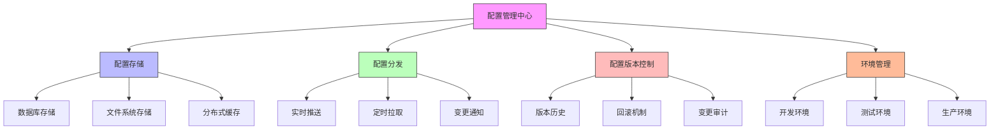

在企业级统一身份治理平台中，运维团队负责确保系统的稳定性、安全性和高性能。一个优秀的运维体验需要完善的配置管理、实时的系统监控和高效的日志查询能力。本文将深入探讨如何为运维人员提供强大的工具和功能，确保平台的可靠运行。

## 引言

运维视角是统一身份治理平台不可或缺的一部分。随着系统规模的扩大和复杂性的增加，运维团队需要能够快速诊断问题、调整配置参数、监控系统性能并分析日志数据。通过提供专业的运维工具和功能，可以显著提高系统的可维护性和可靠性。

## 配置管理

### 配置中心设计

配置管理是运维工作的核心，需要支持动态配置、版本控制和环境隔离：



### 配置管理实现

```java
public class ConfigurationManagement {
    private final ConfigService configService;
    private final AuditService auditService;
    private final NotificationService notificationService;
    
    // 配置项管理
    public class ConfigItemManager {
        
        // 获取配置项
        public ConfigItem getConfigItem(String key) {
            return configService.getConfigItem(key);
        }
        
        // 更新配置项
        public ConfigItem updateConfigItem(String key, Object value, String updatedBy) {
            // 记录变更前的值
            ConfigItem oldItem = configService.getConfigItem(key);
            
            // 更新配置
            ConfigItem newItem = configService.updateConfigItem(key, value);
            
            // 记录审计日志
            auditService.logConfigChange(oldItem, newItem, updatedBy);
            
            // 发送变更通知
            notificationService.sendConfigChangeNotification(key, oldItem, newItem);
            
            return newItem;
        }
        
        // 批量更新配置
        public List<ConfigItem> bulkUpdateConfig(Map<String, Object> configUpdates, String updatedBy) {
            List<ConfigItem> updatedItems = new ArrayList<>();
            
            for (Map.Entry<String, Object> entry : configUpdates.entrySet()) {
                ConfigItem item = updateConfigItem(entry.getKey(), entry.getValue(), updatedBy);
                updatedItems.add(item);
            }
            
            return updatedItems;
        }
        
        // 回滚配置项
        public ConfigItem rollbackConfigItem(String key, String version, String updatedBy) {
            ConfigItem rolledBackItem = configService.rollbackConfigItem(key, version);
            
            // 记录审计日志
            auditService.logConfigRollback(key, version, updatedBy);
            
            return rolledBackItem;
        }
    }
    
    // 配置模板管理
    public class ConfigTemplateManager {
        
        // 创建配置模板
        public ConfigTemplate createConfigTemplate(String name, Map<String, Object> templateData) {
            ConfigTemplate template = new ConfigTemplate();
            template.setName(name);
            template.setTemplateData(templateData);
            template.setCreatedAt(Instant.now());
            
            return configService.saveConfigTemplate(template);
        }
        
        // 应用配置模板
        public List<ConfigItem> applyConfigTemplate(String templateId, String environment) {
            ConfigTemplate template = configService.getConfigTemplate(templateId);
            Map<String, Object> templateData = template.getTemplateData();
            
            List<ConfigItem> appliedConfigs = new ArrayList<>();
            
            for (Map.Entry<String, Object> entry : templateData.entrySet()) {
                String configKey = environment + "." + entry.getKey();
                ConfigItem item = configService.updateConfigItem(configKey, entry.getValue(), "TEMPLATE_APPLY");
                appliedConfigs.add(item);
            }
            
            return appliedConfigs;
        }
        
        // 导出配置模板
        public String exportConfigTemplate(String templateId) {
            ConfigTemplate template = configService.getConfigTemplate(templateId);
            return configService.exportTemplateAsJson(template);
        }
        
        // 导入配置模板
        public ConfigTemplate importConfigTemplate(String templateJson) {
            ConfigTemplate template = configService.importTemplateFromJson(templateJson);
            return configService.saveConfigTemplate(template);
        }
    }
    
    // 配置验证
    public class ConfigValidation {
        
        // 验证配置项
        public ValidationResult validateConfigItem(String key, Object value) {
            ConfigSchema schema = configService.getConfigSchema(key);
            if (schema == null) {
                return ValidationResult.invalid("未找到配置项的验证规则: " + key);
            }
            
            try {
                schema.validate(value);
                return ValidationResult.valid();
            } catch (ValidationException e) {
                return ValidationResult.invalid(e.getMessage());
            }
        }
        
        // 批量验证配置
        public Map<String, ValidationResult> validateConfigBatch(Map<String, Object> configItems) {
            Map<String, ValidationResult> results = new HashMap<>();
            
            for (Map.Entry<String, Object> entry : configItems.entrySet()) {
                ValidationResult result = validateConfigItem(entry.getKey(), entry.getValue());
                results.put(entry.getKey(), result);
            }
            
            return results;
        }
    }
}
```

### 配置存储设计

```sql
-- 配置管理数据库设计
CREATE TABLE config_items (
    id VARCHAR(50) PRIMARY KEY,
    config_key VARCHAR(200) NOT NULL UNIQUE,
    config_value JSON NOT NULL,
    config_type VARCHAR(50) NOT NULL,  -- STRING, NUMBER, BOOLEAN, JSON, etc.
    description TEXT,
    environment VARCHAR(50),  -- DEV, TEST, PROD
    is_sensitive BOOLEAN DEFAULT FALSE,
    version INT DEFAULT 1,
    created_at TIMESTAMP DEFAULT CURRENT_TIMESTAMP,
    updated_at TIMESTAMP DEFAULT CURRENT_TIMESTAMP ON UPDATE CURRENT_TIMESTAMP,
    updated_by VARCHAR(50),
    
    INDEX idx_config_key (config_key),
    INDEX idx_environment (environment),
    INDEX idx_config_type (config_type),
    INDEX idx_updated_at (updated_at)
);

-- 配置历史表
CREATE TABLE config_history (
    id VARCHAR(50) PRIMARY KEY,
    config_item_id VARCHAR(50) NOT NULL,
    config_value JSON NOT NULL,
    version INT NOT NULL,
    changed_at TIMESTAMP DEFAULT CURRENT_TIMESTAMP,
    changed_by VARCHAR(50),
    change_reason TEXT,
    
    FOREIGN KEY (config_item_id) REFERENCES config_items(id),
    INDEX idx_config_item_id (config_item_id),
    INDEX idx_version (version),
    INDEX idx_changed_at (changed_at)
);

-- 配置模板表
CREATE TABLE config_templates (
    id VARCHAR(50) PRIMARY KEY,
    template_name VARCHAR(200) NOT NULL,
    template_data JSON NOT NULL,
    description TEXT,
    tags JSON,
    created_at TIMESTAMP DEFAULT CURRENT_TIMESTAMP,
    updated_at TIMESTAMP DEFAULT CURRENT_TIMESTAMP ON UPDATE CURRENT_TIMESTAMP,
    created_by VARCHAR(50),
    
    INDEX idx_template_name (template_name),
    INDEX idx_created_at (created_at)
);

-- 配置变更日志表
CREATE TABLE config_change_logs (
    id VARCHAR(50) PRIMARY KEY,
    config_key VARCHAR(200) NOT NULL,
    old_value JSON,
    new_value JSON,
    changed_at TIMESTAMP DEFAULT CURRENT_TIMESTAMP,
    changed_by VARCHAR(50),
    change_type VARCHAR(50),  -- UPDATE, DELETE, ROLLBACK
    affected_services JSON,
    
    INDEX idx_config_key (config_key),
    INDEX idx_changed_at (changed_at),
    INDEX idx_changed_by (changed_by)
);

-- 创建配置统计视图
CREATE VIEW config_statistics AS
SELECT 
    environment,
    COUNT(*) as total_configs,
    COUNT(CASE WHEN is_sensitive = TRUE THEN 1 END) as sensitive_configs,
    COUNT(CASE WHEN config_type = 'JSON' THEN 1 END) as json_configs,
    MAX(updated_at) as last_updated,
    COUNT(DISTINCT updated_by) as unique_updaters
FROM config_items
GROUP BY environment;
```

## 系统监控

### 监控指标体系

```python
class SystemMonitoring:
    def __init__(self, metrics_service, alert_service, notification_service):
        self.metrics_service = metrics_service
        self.alert_service = alert_service
        self.notification_service = notification_service
        self.monitors = {}
    
    def setup_performance_monitors(self):
        """设置性能监控器"""
        self.monitors['authentication_latency'] = self.create_monitor(
            'authentication_latency',
            '认证延迟监控',
            self.metrics_service.get_auth_latency,
            threshold=2000,  # 2秒阈值
            alert_level='HIGH'
        )
        
        self.monitors['authorization_success_rate'] = self.create_monitor(
            'authorization_success_rate',
            '授权成功率监控',
            self.metrics_service.get_authz_success_rate,
            threshold=0.99,  # 99%阈值
            alert_level='MEDIUM'
        )
        
        self.monitors['active_sessions'] = self.create_monitor(
            'active_sessions',
            '活跃会话数监控',
            self.metrics_service.get_active_sessions,
            threshold=10000,  # 1万会话阈值
            alert_level='LOW'
        )
        
        self.monitors['database_connection_pool'] = self.create_monitor(
            'database_connection_pool',
            '数据库连接池监控',
            self.metrics_service.get_db_connection_usage,
            threshold=0.8,  # 80%阈值
            alert_level='MEDIUM'
        )
        
        self.monitors['cache_hit_rate'] = self.create_monitor(
            'cache_hit_rate',
            '缓存命中率监控',
            self.metrics_service.get_cache_hit_rate,
            threshold=0.95,  # 95%阈值
            alert_level='LOW'
        )
    
    def create_monitor(self, name, description, metric_function, threshold, alert_level):
        """创建监控器"""
        monitor = {
            'name': name,
            'description': description,
            'metric_function': metric_function,
            'threshold': threshold,
            'alert_level': alert_level,
            'enabled': True,
            'last_check': None,
            'last_value': None
        }
        
        # 启动定时检查
        self.schedule_monitoring(monitor)
        
        return monitor
    
    def check_monitor(self, monitor):
        """检查监控指标"""
        try:
            current_value = monitor['metric_function']()
            monitor['last_check'] = datetime.utcnow()
            monitor['last_value'] = current_value
            
            # 检查是否超过阈值
            if self.is_threshold_exceeded(current_value, monitor['threshold']):
                self.trigger_alert(monitor, current_value)
                
        except Exception as e:
            logger.error(f"监控检查失败 {monitor['name']}: {e}")
    
    def trigger_alert(self, monitor, current_value):
        """触发告警"""
        alert = {
            'monitor_name': monitor['name'],
            'description': monitor['description'],
            'current_value': current_value,
            'threshold': monitor['threshold'],
            'level': monitor['alert_level'],
            'timestamp': datetime.utcnow()
        }
        
        self.alert_service.send_alert(alert)
        
        # 发送通知
        self.notification_service.send_alert_notification(alert)
    
    def get_system_health_report(self):
        """获取系统健康报告"""
        report = {
            'timestamp': datetime.utcnow(),
            'overall_status': 'HEALTHY',
            'metrics': {},
            'alerts': [],
            'recommendations': []
        }
        
        # 收集各项指标
        report['metrics'] = self.collect_all_metrics()
        
        # 检查活跃告警
        active_alerts = self.alert_service.get_active_alerts()
        report['alerts'] = active_alerts
        
        # 生成建议
        report['recommendations'] = self.generate_recommendations(report)
        
        # 确定整体状态
        report['overall_status'] = self.determine_system_status(active_alerts)
        
        return report
    
    def collect_all_metrics(self):
        """收集所有指标"""
        metrics = {
            'authentication': {
                'latency': self.metrics_service.get_auth_latency(),
                'success_rate': self.metrics_service.get_auth_success_rate(),
                'failure_rate': self.metrics_service.get_auth_failure_rate(),
                'requests_per_second': self.metrics_service.get_auth_rps()
            },
            'authorization': {
                'latency': self.metrics_service.get_authz_latency(),
                'success_rate': self.metrics_service.get_authz_success_rate(),
                'failure_rate': self.metrics_service.get_authz_failure_rate(),
                'requests_per_second': self.metrics_service.get_authz_rps()
            },
            'system': {
                'cpu_usage': self.metrics_service.get_cpu_usage(),
                'memory_usage': self.metrics_service.get_memory_usage(),
                'disk_usage': self.metrics_service.get_disk_usage(),
                'network_io': self.metrics_service.get_network_io()
            }
        }
        
        return metrics
```

### 监控面板设计

```javascript
// 系统监控面板
class SystemMonitoringDashboard {
  constructor(monitoringService, visualizationService) {
    this.monitoringService = monitoringService;
    this.visualizationService = visualizationService;
    this.dashboardContainer = null;
    this.charts = new Map();
  }
  
  // 初始化监控面板
  init(containerId) {
    this.dashboardContainer = document.getElementById(containerId);
    this.renderDashboard();
    this.setupRealTimeUpdates();
  }
  
  // 渲染监控面板
  renderDashboard() {
    // 创建仪表板布局
    const layout = this.createDashboardLayout();
    this.dashboardContainer.appendChild(layout);
    
    // 渲染各个监控组件
    this.renderSystemMetrics();
    this.renderPerformanceCharts();
    this.renderAlertPanel();
    this.renderHealthStatus();
  }
  
  // 创建仪表板布局
  createDashboardLayout() {
    const dashboard = document.createElement('div');
    dashboard.className = 'monitoring-dashboard';
    
    dashboard.innerHTML = `
      <div class="dashboard-header">
        <h1>系统监控面板</h1>
        <div class="refresh-controls">
          <button id="refresh-btn">刷新</button>
          <select id="time-range">
            <option value="1h">最近1小时</option>
            <option value="6h">最近6小时</option>
            <option value="24h" selected>最近24小时</option>
            <option value="7d">最近7天</option>
          </select>
        </div>
      </div>
      
      <div class="dashboard-grid">
        <div class="grid-item health-status">
          <div class="panel-header">
            <h2>系统健康状态</h2>
          </div>
          <div id="health-status-content"></div>
        </div>
        
        <div class="grid-item system-metrics">
          <div class="panel-header">
            <h2>系统指标</h2>
          </div>
          <div id="system-metrics-content"></div>
        </div>
        
        <div class="grid-item performance-charts">
          <div class="panel-header">
            <h2>性能图表</h2>
          </div>
          <div id="performance-charts-content"></div>
        </div>
        
        <div class="grid-item alert-panel">
          <div class="panel-header">
            <h2>实时告警</h2>
          </div>
          <div id="alert-panel-content"></div>
        </div>
      </div>
    `;
    
    return dashboard;
  }
  
  // 渲染系统指标
  async renderSystemMetrics() {
    const metrics = await this.monitoringService.getSystemMetrics();
    const container = document.getElementById('system-metrics-content');
    
    container.innerHTML = `
      <div class="metrics-grid">
        <div class="metric-card">
          <div class="metric-value">${metrics.cpu.usage}%</div>
          <div class="metric-label">CPU使用率</div>
          <div class="metric-trend ${metrics.cpu.trend > 0 ? 'up' : 'down'}">
            ${metrics.cpu.trend > 0 ? '↑' : '↓'} ${Math.abs(metrics.cpu.trend)}%
          </div>
        </div>
        
        <div class="metric-card">
          <div class="metric-value">${metrics.memory.usage}%</div>
          <div class="metric-label">内存使用率</div>
          <div class="metric-trend ${metrics.memory.trend > 0 ? 'up' : 'down'}">
            ${metrics.memory.trend > 0 ? '↑' : '↓'} ${Math.abs(metrics.memory.trend)}%
          </div>
        </div>
        
        <div class="metric-card">
          <div class="metric-value">${metrics.disk.usage}%</div>
          <div class="metric-label">磁盘使用率</div>
          <div class="metric-trend ${metrics.disk.trend > 0 ? 'up' : 'down'}">
            ${metrics.disk.trend > 0 ? '↑' : '↓'} ${Math.abs(metrics.disk.trend)}%
          </div>
        </div>
        
        <div class="metric-card">
          <div class="metric-value">${metrics.network.inbound} Mbps</div>
          <div class="metric-label">网络流入</div>
          <div class="metric-trend ${metrics.network.inboundTrend > 0 ? 'up' : 'down'}">
            ${metrics.network.inboundTrend > 0 ? '↑' : '↓'} ${Math.abs(metrics.network.inboundTrend)}%
          </div>
        </div>
      </div>
    `;
  }
  
  // 渲染性能图表
  async renderPerformanceCharts() {
    const performanceData = await this.monitoringService.getPerformanceData();
    const container = document.getElementById('performance-charts-content');
    
    // 渲染认证延迟图表
    const authLatencyChart = this.visualizationService.createLineChart(
      'auth-latency-chart',
      performanceData.authLatency,
      {
        title: '认证延迟 (ms)',
        yAxisLabel: '延迟 (ms)',
        threshold: 2000
      }
    );
    
    // 渲染授权成功率图表
    const authzSuccessRateChart = this.visualizationService.createLineChart(
      'authz-success-rate-chart',
      performanceData.authzSuccessRate,
      {
        title: '授权成功率 (%)',
        yAxisLabel: '成功率 (%)',
        threshold: 99,
        isPercentage: true
      }
    );
    
    container.innerHTML = `
      <div class="charts-container">
        <div class="chart-wrapper">
          ${authLatencyChart.outerHTML}
        </div>
        <div class="chart-wrapper">
          ${authzSuccessRateChart.outerHTML}
        </div>
      </div>
    `;
  }
  
  // 渲染告警面板
  async renderAlertPanel() {
    const alerts = await this.monitoringService.getActiveAlerts();
    const container = document.getElementById('alert-panel-content');
    
    if (alerts.length === 0) {
      container.innerHTML = '<div class="no-alerts">当前无活跃告警</div>';
      return;
    }
    
    const alertList = document.createElement('div');
    alertList.className = 'alert-list';
    
    alerts.forEach(alert => {
      const alertElement = document.createElement('div');
      alertElement.className = `alert-item level-${alert.level.toLowerCase()}`;
      alertElement.innerHTML = `
        <div class="alert-header">
          <span class="alert-level ${alert.level.toLowerCase()}">${alert.level}</span>
          <span class="alert-time">${this.formatTime(alert.timestamp)}</span>
        </div>
        <div class="alert-content">
          <div class="alert-title">${alert.title}</div>
          <div class="alert-description">${alert.description}</div>
          <div class="alert-details">
            <span>当前值: ${alert.currentValue}</span>
            <span>阈值: ${alert.threshold}</span>
          </div>
        </div>
      `;
      alertList.appendChild(alertElement);
    });
    
    container.appendChild(alertList);
  }
  
  formatTime(timestamp) {
    return new Date(timestamp).toLocaleString();
  }
}
```

## 日志查询与分析

### 日志架构设计

```sql
-- 日志管理数据库设计
CREATE TABLE system_logs (
    id VARCHAR(50) PRIMARY KEY,
    timestamp TIMESTAMP NOT NULL,
    log_level VARCHAR(20) NOT NULL,  -- DEBUG, INFO, WARN, ERROR, FATAL
    service_name VARCHAR(100) NOT NULL,
    module_name VARCHAR(100),
    message TEXT NOT NULL,
    stack_trace TEXT,
    user_id VARCHAR(50),
    session_id VARCHAR(50),
    ip_address VARCHAR(45),
    request_id VARCHAR(50),
    additional_data JSON,
    
    INDEX idx_timestamp (timestamp),
    INDEX idx_log_level (log_level),
    INDEX idx_service_name (service_name),
    INDEX idx_user_id (user_id),
    INDEX idx_session_id (session_id),
    INDEX idx_request_id (request_id),
    FULLTEXT(message)
);

-- 日志聚合表
CREATE TABLE log_aggregations (
    id VARCHAR(50) PRIMARY KEY,
    aggregation_type VARCHAR(50) NOT NULL,  -- HOURLY, DAILY, WEEKLY
    date_key DATE NOT NULL,
    service_name VARCHAR(100) NOT NULL,
    log_level VARCHAR(20) NOT NULL,
    count INT NOT NULL DEFAULT 0,
    last_updated TIMESTAMP DEFAULT CURRENT_TIMESTAMP ON UPDATE CURRENT_TIMESTAMP,
    
    UNIQUE KEY unique_aggregation (aggregation_type, date_key, service_name, log_level),
    INDEX idx_date_key (date_key),
    INDEX idx_service_name (service_name),
    INDEX idx_log_level (log_level)
);

-- 日志查询模板表
CREATE TABLE log_query_templates (
    id VARCHAR(50) PRIMARY KEY,
    template_name VARCHAR(200) NOT NULL,
    query_conditions JSON NOT NULL,
    description TEXT,
    created_by VARCHAR(50),
    created_at TIMESTAMP DEFAULT CURRENT_TIMESTAMP,
    updated_at TIMESTAMP DEFAULT CURRENT_TIMESTAMP ON UPDATE CURRENT_TIMESTAMP,
    
    INDEX idx_template_name (template_name),
    INDEX idx_created_by (created_by)
);

-- 创建日志分析视图
CREATE VIEW log_analysis_view AS
SELECT 
    DATE(timestamp) as log_date,
    service_name,
    log_level,
    COUNT(*) as log_count,
    COUNT(CASE WHEN log_level = 'ERROR' THEN 1 END) as error_count,
    COUNT(CASE WHEN log_level = 'WARN' THEN 1 END) as warning_count,
    GROUP_CONCAT(DISTINCT user_id) as affected_users,
    MIN(timestamp) as first_log,
    MAX(timestamp) as last_log
FROM system_logs
WHERE timestamp > DATE_SUB(NOW(), INTERVAL 7 DAY)
GROUP BY DATE(timestamp), service_name, log_level
ORDER BY log_date DESC, log_count DESC;
```

### 日志查询系统

```java
public class LogQuerySystem {
    private final LogService logService;
    private final SearchService searchService;
    private final ExportService exportService;
    
    // 日志查询条件
    public class LogQueryCriteria {
        private LocalDateTime startTime;
        private LocalDateTime endTime;
        private List<String> logLevels;
        private List<String> serviceNames;
        private String userId;
        private String sessionId;
        private String keyword;
        private Map<String, Object> additionalFilters;
        private int page = 0;
        private int size = 50;
        private String sortBy = "timestamp";
        private String sortOrder = "DESC";
    }
    
    // 执行日志查询
    public LogQueryResult queryLogs(LogQueryCriteria criteria) {
        LogQueryResult result = new LogQueryResult();
        
        // 构建查询条件
        QueryBuilder queryBuilder = new QueryBuilder();
        queryBuilder.addTimeRangeFilter(criteria.getStartTime(), criteria.getEndTime());
        queryBuilder.addLogLevelFilter(criteria.getLogLevels());
        queryBuilder.addServiceFilter(criteria.getServiceNames());
        queryBuilder.addUserFilter(criteria.getUserId());
        queryBuilder.addSessionFilter(criteria.getSessionId());
        queryBuilder.addKeywordFilter(criteria.getKeyword());
        queryBuilder.addCustomFilters(criteria.getAdditionalFilters());
        
        // 执行查询
        List<LogEntry> logs = logService.queryLogs(queryBuilder.build(), criteria.getPage(), criteria.getSize());
        long total = logService.countLogs(queryBuilder.build());
        
        // 处理查询结果
        result.setLogs(logs);
        result.setTotal(total);
        result.setPage(criteria.getPage());
        result.setSize(criteria.getSize());
        result.setHasMore(total > (criteria.getPage() + 1) * criteria.getSize());
        
        return result;
    }
    
    // 高级日志分析
    public LogAnalysisReport analyzeLogs(LogAnalysisCriteria criteria) {
        LogAnalysisReport report = new LogAnalysisReport();
        
        // 时间范围分析
        report.setTimeRangeAnalysis(analyzeTimeRange(criteria));
        
        // 服务分布分析
        report.setServiceDistribution(analyzeServiceDistribution(criteria));
        
        // 错误模式分析
        report.setErrorPatterns(analyzeErrorPatterns(criteria));
        
        // 用户行为分析
        report.setUserBehavior(analyzeUserBehavior(criteria));
        
        return report;
    }
    
    // 日志导出功能
    public ExportResult exportLogs(LogQueryCriteria criteria, ExportFormat format) {
        try {
            // 执行查询
            List<LogEntry> logs = logService.queryLogs(convertToQuery(criteria));
            
            // 格式化数据
            String exportedData = formatLogs(logs, format);
            
            // 生成导出文件
            String fileName = generateExportFileName(criteria, format);
            String filePath = exportService.saveExportFile(fileName, exportedData);
            
            return new ExportResult(true, filePath, logs.size());
        } catch (Exception e) {
            return new ExportResult(false, null, 0, e.getMessage());
        }
    }
    
    // 实时日志流
    public class RealTimeLogStream {
        private final WebSocketService webSocketService;
        private final LogService logService;
        
        // 订阅实时日志
        public void subscribeToRealTimeLogs(String sessionId, LogQueryCriteria criteria) {
            // 注册WebSocket会话
            webSocketService.registerSession(sessionId, this::handleLogEvent);
            
            // 设置日志监听器
            logService.addLogListener(criteria, this::onLogEvent);
        }
        
        // 处理日志事件
        private void onLogEvent(LogEntry logEntry) {
            // 构造推送消息
            LogEventMessage message = new LogEventMessage();
            message.setType("LOG_EVENT");
            message.setLogEntry(logEntry);
            message.setTimestamp(Instant.now());
            
            // 推送消息到所有订阅者
            webSocketService.broadcastMessage(message);
        }
        
        // 处理WebSocket消息
        private void handleLogEvent(String sessionId, WebSocketMessage message) {
            // 处理客户端发送的消息
            if ("SUBSCRIBE".equals(message.getType())) {
                // 处理订阅请求
                handleSubscribeRequest(sessionId, message);
            } else if ("UNSUBSCRIBE".equals(message.getType())) {
                // 处理取消订阅请求
                handleUnsubscribeRequest(sessionId);
            }
        }
    }
}
```

### 日志查询界面

```javascript
// 日志查询界面
class LogQueryInterface {
  constructor(logService, visualizationService) {
    this.logService = logService;
    this.visualizationService = visualizationService;
    this.currentQuery = {};
  }
  
  // 初始化查询界面
  init(containerId) {
    this.container = document.getElementById(containerId);
    this.renderQueryForm();
    this.renderResultsPanel();
    this.bindEvents();
  }
  
  // 渲染查询表单
  renderQueryForm() {
    const formContainer = document.createElement('div');
    formContainer.className = 'log-query-form';
    
    formContainer.innerHTML = `
      <div class="form-section">
        <h3>时间范围</h3>
        <div class="form-row">
          <div class="form-group">
            <label>开始时间</label>
            <input type="datetime-local" id="start-time" value="${this.getDefaultStartTime()}">
          </div>
          <div class="form-group">
            <label>结束时间</label>
            <input type="datetime-local" id="end-time" value="${this.getDefaultEndTime()}">
          </div>
        </div>
      </div>
      
      <div class="form-section">
        <h3>过滤条件</h3>
        <div class="form-row">
          <div class="form-group">
            <label>日志级别</label>
            <select id="log-level" multiple>
              <option value="DEBUG">DEBUG</option>
              <option value="INFO" selected>INFO</option>
              <option value="WARN" selected>WARN</option>
              <option value="ERROR" selected>ERROR</option>
              <option value="FATAL">FATAL</option>
            </select>
          </div>
          <div class="form-group">
            <label>服务名称</label>
            <input type="text" id="service-name" placeholder="支持模糊搜索">
          </div>
        </div>
        
        <div class="form-row">
          <div class="form-group">
            <label>用户ID</label>
            <input type="text" id="user-id" placeholder="精确匹配">
          </div>
          <div class="form-group">
            <label>关键字</label>
            <input type="text" id="keyword" placeholder="支持全文搜索">
          </div>
        </div>
      </div>
      
      <div class="form-actions">
        <button id="query-btn" class="primary">查询</button>
        <button id="export-btn">导出</button>
        <button id="save-template-btn">保存为模板</button>
        <button id="clear-btn">清空</button>
      </div>
    `;
    
    this.container.appendChild(formContainer);
  }
  
  // 渲染结果面板
  renderResultsPanel() {
    const resultsContainer = document.createElement('div');
    resultsContainer.className = 'log-results-panel';
    
    resultsContainer.innerHTML = `
      <div class="results-header">
        <h3>查询结果</h3>
        <div class="results-info">
          <span id="total-count">共 0 条记录</span>
          <span id="page-info">第 1 页</span>
        </div>
      </div>
      
      <div class="results-table-container">
        <table class="results-table">
          <thead>
            <tr>
              <th>时间</th>
              <th>级别</th>
              <th>服务</th>
              <th>消息</th>
              <th>用户</th>
              <th>操作</th>
            </tr>
          </thead>
          <tbody id="results-body">
            <tr>
              <td colspan="6" class="no-data">请输入查询条件并点击查询按钮</td>
            </tr>
          </tbody>
        </table>
      </div>
      
      <div class="pagination" id="pagination">
        <!-- 分页控件将在这里渲染 -->
      </div>
    `;
    
    this.container.appendChild(resultsContainer);
  }
  
  // 绑定事件
  bindEvents() {
    // 查询按钮
    document.getElementById('query-btn').addEventListener('click', () => {
      this.executeQuery();
    });
    
    // 导出按钮
    document.getElementById('export-btn').addEventListener('click', () => {
      this.exportResults();
    });
    
    // 保存模板按钮
    document.getElementById('save-template-btn').addEventListener('click', () => {
      this.saveQueryTemplate();
    });
    
    // 清空按钮
    document.getElementById('clear-btn').addEventListener('click', () => {
      this.clearForm();
    });
    
    // 回车查询
    this.container.addEventListener('keypress', (e) => {
      if (e.key === 'Enter') {
        this.executeQuery();
      }
    });
  }
  
  // 执行查询
  async executeQuery() {
    // 收集查询条件
    const criteria = this.collectQueryCriteria();
    
    // 显示加载状态
    this.showLoading();
    
    try {
      // 执行查询
      const result = await this.logService.queryLogs(criteria);
      
      // 显示结果
      this.displayResults(result);
      
      // 更新分页
      this.updatePagination(result);
    } catch (error) {
      this.showError(error.message);
    } finally {
      this.hideLoading();
    }
  }
  
  // 收集查询条件
  collectQueryCriteria() {
    return {
      startTime: document.getElementById('start-time').value,
      endTime: document.getElementById('end-time').value,
      logLevels: Array.from(document.getElementById('log-level').selectedOptions).map(opt => opt.value),
      serviceName: document.getElementById('service-name').value,
      userId: document.getElementById('user-id').value,
      keyword: document.getElementById('keyword').value,
      page: 0,
      size: 50
    };
  }
  
  // 显示结果
  displayResults(result) {
    const tbody = document.getElementById('results-body');
    
    if (result.logs.length === 0) {
      tbody.innerHTML = '<tr><td colspan="6" class="no-data">未找到匹配的日志记录</td></tr>';
      return;
    }
    
    tbody.innerHTML = result.logs.map(log => `
      <tr class="log-level-${log.level.toLowerCase()}">
        <td>${this.formatDateTime(log.timestamp)}</td>
        <td><span class="level-badge ${log.level.toLowerCase()}">${log.level}</span></td>
        <td>${log.serviceName}</td>
        <td class="log-message">${this.truncateMessage(log.message)}</td>
        <td>${log.userId || '-'}</td>
        <td>
          <button class="view-details-btn" data-log-id="${log.id}">详情</button>
        </td>
      </tr>
    `).join('');
    
    // 绑定详情按钮事件
    document.querySelectorAll('.view-details-btn').forEach(btn => {
      btn.addEventListener('click', (e) => {
        const logId = e.target.dataset.logId;
        this.showLogDetails(logId);
      });
    });
    
    // 更新总数
    document.getElementById('total-count').textContent = `共 ${result.total} 条记录`;
  }
  
  // 显示日志详情
  async showLogDetails(logId) {
    try {
      const log = await this.logService.getLogById(logId);
      
      // 创建模态框显示详情
      const modal = this.createModal('日志详情', `
        <div class="log-details">
          <div class="detail-row">
            <label>时间:</label>
            <span>${this.formatDateTime(log.timestamp)}</span>
          </div>
          <div class="detail-row">
            <label>级别:</label>
            <span><span class="level-badge ${log.level.toLowerCase()}">${log.level}</span></span>
          </div>
          <div class="detail-row">
            <label>服务:</label>
            <span>${log.serviceName}</span>
          </div>
          <div class="detail-row">
            <label>用户:</label>
            <span>${log.userId || '-'}</span>
          </div>
          <div class="detail-row">
            <label>会话:</label>
            <span>${log.sessionId || '-'}</span>
          </div>
          <div class="detail-row">
            <label>IP地址:</label>
            <span>${log.ipAddress || '-'}</span>
          </div>
          <div class="detail-row full-width">
            <label>消息:</label>
            <pre class="message-content">${log.message}</pre>
          </div>
          ${log.stackTrace ? `
          <div class="detail-row full-width">
            <label>堆栈跟踪:</label>
            <pre class="stack-trace">${log.stackTrace}</pre>
          </div>
          ` : ''}
          ${log.additionalData ? `
          <div class="detail-row full-width">
            <label>附加数据:</label>
            <pre class="additional-data">${JSON.stringify(log.additionalData, null, 2)}</pre>
          </div>
          ` : ''}
        </div>
      `);
      
      document.body.appendChild(modal);
    } catch (error) {
      this.showError('获取日志详情失败: ' + error.message);
    }
  }
  
  formatDateTime(timestamp) {
    return new Date(timestamp).toLocaleString();
  }
  
  truncateMessage(message) {
    if (message.length > 100) {
      return message.substring(0, 100) + '...';
    }
    return message;
  }
}
```

## 总结

运维视角的配置管理、系统监控和日志查询功能是统一身份治理平台稳定运行的重要保障。通过完善的配置管理体系、实时的监控告警机制和强大的日志分析能力，运维团队能够及时发现和解决问题，确保系统的高可用性和高性能。

关键要点包括：

1. **配置管理**：支持动态配置、版本控制、模板管理和配置验证
2. **系统监控**：建立全面的监控指标体系，实现实时告警和健康状态展示
3. **日志查询**：提供灵活的日志查询接口和可视化分析工具

这些功能的实现不仅提升了运维效率，也为平台的持续优化和故障排查提供了有力支持。在后续章节中，我们将继续探讨平台运营、未来发展方向等重要内容，为构建完整的企业级身份治理解决方案提供全面指导。