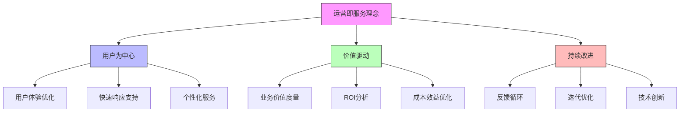

在企业级统一身份治理平台的生命周期中，上线只是开始而非终点。平台的成功不仅取决于初始的设计和实现，更依赖于持续的运营优化和迭代改进。一个成熟的运营体系能够确保平台稳定运行、持续满足业务需求，并在不断变化的技术环境中保持竞争力。

## 本章概要

第13章将深入探讨统一身份治理平台的运营与持续迭代策略：

* **日常运维SOP**：建立标准化的运维流程，包括用户支持和故障处理机制
* **反馈收集与度量**：构建有效的反馈收集体系，定义关键成功指标
* **版本管理与迭代规划**：制定科学的版本管理策略和迭代规划流程

通过本章的学习，读者将了解如何建立高效的平台运营体系，实现持续改进和优化。

## 核心运营理念

### 运营即服务

统一身份治理平台的运营应该以服务为导向，将用户满意度和业务价值作为核心目标：



### 数据驱动决策

运营决策应该基于数据和指标，而非主观判断：

1. **关键指标监控**：建立全面的KPI体系
2. **趋势分析**：识别业务和技术趋势
3. **根因分析**：深入分析问题根本原因
4. **预测性维护**：基于数据分析预测潜在问题

## 日常运维体系

### 标准化操作流程

建立标准化的运维操作流程(SOP)是确保服务质量的基础：

```java
public class OperationsSOP {
    private final UserService userService;
    private final SupportService supportService;
    private final MonitoringService monitoringService;
    
    // 用户支持流程
    public class UserSupportProcess {
        
        // 用户问题处理流程
        public SupportTicket handleUserIssue(UserIssue issue) {
            SupportTicket ticket = new SupportTicket();
            ticket.setId(generateTicketId());
            ticket.setIssue(issue);
            ticket.setStatus(TicketStatus.OPEN);
            ticket.setPriority(determinePriority(issue));
            ticket.setCreatedAt(Instant.now());
            
            // 分类问题类型
            IssueType issueType = classifyIssue(issue);
            ticket.setIssueType(issueType);
            
            // 分配处理人员
            String assignee = assignSupportStaff(issueType);
            ticket.setAssignee(assignee);
            
            // 记录到支持系统
            supportService.createTicket(ticket);
            
            // 发送确认通知
            notificationService.sendTicketConfirmation(ticket);
            
            return ticket;
        }
        
        // 问题优先级判定
        private TicketPriority determinePriority(UserIssue issue) {
            // 基于影响范围和紧急程度判定优先级
            if (issue.isSystemDown() || issue.affectsAllUsers()) {
                return TicketPriority.CRITICAL;
            } else if (issue.affectsBusinessCriticalFunction()) {
                return TicketPriority.HIGH;
            } else if (issue.isUserExperienceIssue()) {
                return TicketPriority.MEDIUM;
            } else {
                return TicketPriority.LOW;
            }
        }
    }
    
    // 故障处理流程
    public class IncidentResponseProcess {
        
        // 故障响应流程
        public Incident handleIncident(IncidentReport report) {
            Incident incident = new Incident();
            incident.setId(generateIncidentId());
            incident.setReport(report);
            incident.setStatus(IncidentStatus.INVESTIGATING);
            incident.setSeverity(determineSeverity(report));
            incident.setReportedAt(Instant.now());
            
            // 通知相关人员
            notifyIncidentTeam(incident);
            
            // 启动调查
            Investigation investigation = startInvestigation(incident);
            incident.setInvestigation(investigation);
            
            // 记录到事件管理系统
            incidentManagementService.createIncident(incident);
            
            return incident;
        }
        
        // 故障严重程度判定
        private IncidentSeverity determineSeverity(IncidentReport report) {
            // 基于影响用户数、业务影响和持续时间判定严重程度
            if (report.affectsMoreThan(50) && report.businessImpact() == BusinessImpact.CRITICAL) {
                return IncidentSeverity.CRITICAL;
            } else if (report.affectsMoreThan(10) && report.businessImpact() == BusinessImpact.HIGH) {
                return IncidentSeverity.HIGH;
            } else if (report.affectsAnyUsers() && report.businessImpact() == BusinessImpact.MEDIUM) {
                return IncidentSeverity.MEDIUM;
            } else {
                return IncidentSeverity.LOW;
            }
        }
    }
}
```

### 自动化运维

```python
class AutomatedOperations:
    def __init__(self, monitoring_service, automation_service):
        self.monitoring_service = monitoring_service
        self.automation_service = automation_service
        self.automated_processes = {}
    
    def setup_automated_processes(self):
        """设置自动化运维流程"""
        # 自动扩容
        self.automated_processes['auto_scaling'] = self.setup_auto_scaling()
        
        # 自动故障恢复
        self.automated_processes['auto_recovery'] = self.setup_auto_recovery()
        
        # 自动备份
        self.automated_processes['auto_backup'] = self.setup_auto_backup()
        
        # 自动安全扫描
        self.automated_processes['security_scan'] = self.setup_security_scanning()
    
    def setup_auto_scaling(self):
        """设置自动扩容"""
        scaling_policy = {
            'metric': 'cpu_utilization',
            'threshold': 0.75,
            'scale_up_factor': 1.5,
            'scale_down_factor': 0.8,
            'cooldown_period': 300,  # 5分钟冷却期
            'max_instances': 20,
            'min_instances': 3
        }
        
        # 注册监控回调
        self.monitoring_service.register_callback(
            'system.cpu_utilization', 
            lambda value: self.handle_scaling_trigger(value, scaling_policy)
        )
        
        return scaling_policy
    
    def handle_scaling_trigger(self, current_value, policy):
        """处理扩容触发"""
        if current_value > policy['threshold']:
            # 执行扩容
            self.automation_service.scale_up(policy['scale_up_factor'])
        elif current_value < policy['threshold'] * 0.6:  # 降低阈值以避免频繁缩容
            # 执行缩容
            self.automation_service.scale_down(policy['scale_down_factor'])
    
    def setup_auto_recovery(self):
        """设置自动故障恢复"""
        recovery_policy = {
            'health_check_interval': 30,  # 30秒检查一次
            'failure_threshold': 3,  # 连续3次失败触发恢复
            'recovery_actions': ['restart_service', 'clear_cache', 'reconnect_database'],
            'notification_targets': ['ops_team', 'system_admins']
        }
        
        # 启动健康检查任务
        self.automation_service.schedule_task(
            'health_check', 
            self.perform_health_check, 
            interval=recovery_policy['health_check_interval']
        )
        
        return recovery_policy
    
    def perform_health_check(self):
        """执行健康检查"""
        health_status = self.monitoring_service.get_system_health()
        
        if not health_status.is_healthy():
            # 记录故障
            incident = self.incident_management.create_incident(health_status)
            
            # 尝试自动恢复
            recovery_result = self.attempt_auto_recovery(health_status)
            
            if not recovery_result.success:
                # 通知人工干预
                self.notification_service.send_alert(
                    'AUTOMATED_RECOVERY_FAILED',
                    f'自动恢复失败: {recovery_result.error}',
                    targets=recovery_policy['notification_targets']
                )
```

## 反馈收集与度量体系

### 用户反馈机制

```sql
-- 用户反馈数据库设计
CREATE TABLE user_feedback (
    id VARCHAR(50) PRIMARY KEY,
    user_id VARCHAR(50),
    feedback_type VARCHAR(50) NOT NULL,  -- BUG, SUGGESTION, COMPLIMENT, COMPLAINT
    category VARCHAR(100),  -- LOGIN, PERMISSION, PROFILE, PERFORMANCE, etc.
    priority VARCHAR(20) DEFAULT 'MEDIUM',  -- LOW, MEDIUM, HIGH, CRITICAL
    title VARCHAR(200) NOT NULL,
    description TEXT NOT NULL,
    steps_to_reproduce TEXT,
    screenshot_url VARCHAR(500),
    browser_info VARCHAR(200),
    device_info VARCHAR(200),
    status VARCHAR(20) DEFAULT 'NEW',  -- NEW, IN_REVIEW, IN_PROGRESS, RESOLVED, CLOSED
    assigned_to VARCHAR(50),
    created_at TIMESTAMP DEFAULT CURRENT_TIMESTAMP,
    updated_at TIMESTAMP DEFAULT CURRENT_TIMESTAMP ON UPDATE CURRENT_TIMESTAMP,
    
    INDEX idx_feedback_type (feedback_type),
    INDEX idx_category (category),
    INDEX idx_priority (priority),
    INDEX idx_status (status),
    INDEX idx_user_id (user_id),
    FULLTEXT(title, description)
);

-- 用户满意度调查表
CREATE TABLE user_satisfaction_surveys (
    id VARCHAR(50) PRIMARY KEY,
    survey_name VARCHAR(200) NOT NULL,
    survey_type VARCHAR(50) NOT NULL,  -- GENERAL, FEATURE_SPECIFIC, POST_RELEASE
    target_audience JSON,
    questions JSON NOT NULL,
    start_date TIMESTAMP NOT NULL,
    end_date TIMESTAMP NOT NULL,
    response_rate_target DECIMAL(5,2) DEFAULT 80.00,
    status VARCHAR(20) DEFAULT 'ACTIVE',
    
    INDEX idx_survey_type (survey_type),
    INDEX idx_status (status)
);

-- 调查响应表
CREATE TABLE survey_responses (
    id VARCHAR(50) PRIMARY KEY,
    survey_id VARCHAR(50) NOT NULL,
    user_id VARCHAR(50) NOT NULL,
    responses JSON NOT NULL,
    submission_time TIMESTAMP DEFAULT CURRENT_TIMESTAMP,
    
    FOREIGN KEY (survey_id) REFERENCES user_satisfaction_surveys(id),
    UNIQUE KEY unique_response (survey_id, user_id),
    INDEX idx_submission_time (submission_time)
);

-- 创建反馈统计视图
CREATE VIEW feedback_statistics AS
SELECT 
    category,
    COUNT(*) as total_feedback,
    COUNT(CASE WHEN feedback_type = 'BUG' THEN 1 END) as bug_reports,
    COUNT(CASE WHEN feedback_type = 'SUGGESTION' THEN 1 END) as suggestions,
    COUNT(CASE WHEN feedback_type = 'COMPLIMENT' THEN 1 END) as compliments,
    COUNT(CASE WHEN feedback_type = 'COMPLAINT' THEN 1 END) as complaints,
    ROUND(AVG(CASE WHEN feedback_type = 'BUG' THEN 1 ELSE 0 END) * 100, 2) as bug_percentage,
    MAX(created_at) as latest_feedback
FROM user_feedback
WHERE created_at > DATE_SUB(NOW(), INTERVAL 30 DAY)
GROUP BY category;
```

### 关键成功指标

```javascript
// 关键成功指标体系
class SuccessMetricsSystem {
  constructor(analyticsService, businessService) {
    this.analyticsService = analyticsService;
    this.businessService = businessService;
    this.metrics = new Map();
  }
  
  // 初始化关键指标
  initializeMetrics() {
    // 用户采用指标
    this.metrics.set('user_adoption', {
      name: '用户采用率',
      description: '活跃用户占总用户的比例',
      category: 'user_engagement',
      calculation: this.calculateUserAdoption.bind(this),
      target: 0.95,  // 95%目标
      frequency: 'daily'
    });
    
    // 系统性能指标
    this.metrics.set('system_performance', {
      name: '系统性能',
      description: '平均响应时间',
      category: 'performance',
      calculation: this.calculateSystemPerformance.bind(this),
      target: 1000,  // 1秒目标
      frequency: 'hourly'
    });
    
    // 安全指标
    this.metrics.set('security_posture', {
      name: '安全态势',
      description: '安全事件数量',
      category: 'security',
      calculation: this.calculateSecurityPosture.bind(this),
      target: 0,  // 0事件目标
      frequency: 'daily'
    });
    
    // 业务价值指标
    this.metrics.set('business_value', {
      name: '业务价值',
      description: '通过平台节省的成本',
      category: 'business',
      calculation: this.calculateBusinessValue.bind(this),
      target: 1000000,  // 100万年度节省目标
      frequency: 'monthly'
    });
  }
  
  // 计算用户采用率
  async calculateUserAdoption() {
    const totalUsers = await this.analyticsService.getTotalUsers();
    const activeUsers = await this.analyticsService.getActiveUsers(30); // 30天内活跃
    
    return {
      value: activeUsers / totalUsers,
      totalUsers: totalUsers,
      activeUsers: activeUsers,
      unit: 'percentage'
    };
  }
  
  // 计算系统性能
  async calculateSystemPerformance() {
    const avgResponseTime = await this.analyticsService.getAverageResponseTime();
    const p95ResponseTime = await this.analyticsService.get95thPercentileResponseTime();
    const p99ResponseTime = await this.analyticsService.get99thPercentileResponseTime();
    
    return {
      value: avgResponseTime,
      avgResponseTime: avgResponseTime,
      p95ResponseTime: p95ResponseTime,
      p99ResponseTime: p99ResponseTime,
      unit: 'milliseconds'
    };
  }
  
  // 计算安全态势
  async calculateSecurityPosture() {
    const securityEvents = await this.analyticsService.getSecurityEvents(30); // 30天内
    const highSeverityEvents = securityEvents.filter(event => event.severity === 'HIGH' || event.severity === 'CRITICAL');
    
    return {
      value: securityEvents.length,
      totalEvents: securityEvents.length,
      highSeverityEvents: highSeverityEvents.length,
      unit: 'count'
    };
  }
  
  // 计算业务价值
  async calculateBusinessValue() {
    // 计算通过自助服务节省的支持成本
    const selfServiceSavings = await this.businessService.getSelfServiceSavings();
    
    // 计算通过自动化节省的运维成本
    const automationSavings = await this.businessService.getAutomationSavings();
    
    // 计算通过减少安全事件节省的成本
    const securitySavings = await this.businessService.getSecuritySavings();
    
    const totalSavings = selfServiceSavings + automationSavings + securitySavings;
    
    return {
      value: totalSavings,
      selfServiceSavings: selfServiceSavings,
      automationSavings: automationSavings,
      securitySavings: securitySavings,
      unit: 'currency'
    };
  }
  
  // 获取所有指标的当前状态
  async getAllMetricsStatus() {
    const metricsStatus = [];
    
    for (const [key, metric] of this.metrics.entries()) {
      try {
        const value = await metric.calculation();
        const status = this.determineMetricStatus(value.value, metric.target);
        
        metricsStatus.push({
          key: key,
          name: metric.name,
          category: metric.category,
          currentValue: value,
          targetValue: metric.target,
          status: status,
          lastUpdated: new Date()
        });
      } catch (error) {
        console.error(`计算指标失败 ${metric.name}:`, error);
      }
    }
    
    return metricsStatus;
  }
  
  // 判定指标状态
  determineMetricStatus(currentValue, targetValue) {
    const ratio = currentValue / targetValue;
    
    if (ratio >= 0.95) {
      return 'EXCELLENT';
    } else if (ratio >= 0.8) {
      return 'GOOD';
    } else if (ratio >= 0.6) {
      return 'FAIR';
    } else {
      return 'POOR';
    }
  }
}
```

## 版本管理与迭代规划

### 版本控制策略

```java
public class VersionManagement {
    private final ReleaseService releaseService;
    private final ChangeManagementService changeManagementService;
    
    // 版本号规范
    public class VersionNumber {
        private int major;
        private int minor;
        private int patch;
        private String preRelease;
        private String buildMetadata;
        
        // 遵循语义化版本规范 (SemVer)
        public String toString() {
            StringBuilder version = new StringBuilder();
            version.append(major).append(".").append(minor).append(".").append(patch);
            
            if (preRelease != null && !preRelease.isEmpty()) {
                version.append("-").append(preRelease);
            }
            
            if (buildMetadata != null && !buildMetadata.isEmpty()) {
                version.append("+").append(buildMetadata);
            }
            
            return version.toString();
        }
    }
    
    // 发布计划
    public class ReleasePlan {
        private String version;
        private ReleaseType type;
        private List<Feature> features;
        private List<BugFix> bugFixes;
        private List<Improvement> improvements;
        private LocalDateTime plannedReleaseDate;
        private LocalDateTime actualReleaseDate;
        private ReleaseStatus status;
        private List<Risk> risks;
        private List<Milestone> milestones;
    }
    
    // 创建发布计划
    public ReleasePlan createReleasePlan(VersionNumber version, ReleaseType type) {
        ReleasePlan plan = new ReleasePlan();
        plan.setVersion(version.toString());
        plan.setType(type);
        plan.setPlannedReleaseDate(calculatePlannedReleaseDate(version, type));
        plan.setStatus(ReleaseStatus.PLANNING);
        plan.setFeatures(new ArrayList<>());
        plan.setBugFixes(new ArrayList<>());
        plan.setImprovements(new ArrayList<>());
        plan.setRisks(new ArrayList<>());
        plan.setMilestones(new ArrayList<>());
        
        // 保存发布计划
        releaseService.saveReleasePlan(plan);
        
        return plan;
    }
    
    // 计算计划发布日期
    private LocalDateTime calculatePlannedReleaseDate(VersionNumber version, ReleaseType type) {
        LocalDateTime now = LocalDateTime.now();
        
        switch (type) {
            case MAJOR:
                // 主版本每季度发布
                return now.plusMonths(3);
            case MINOR:
                // 次版本每月发布
                return now.plusMonths(1);
            case PATCH:
                // 补丁版本每周发布
                return now.plusWeeks(1);
            default:
                return now.plusWeeks(2);
        }
    }
    
    // 版本发布流程
    public class ReleaseProcess {
        
        // 执行发布
        public ReleaseResult executeRelease(ReleasePlan plan) {
            try {
                // 1. 代码冻结
                codeFreeze(plan);
                
                // 2. 构建发布版本
                BuildResult buildResult = buildReleaseVersion(plan);
                if (!buildResult.isSuccess()) {
                    return ReleaseResult.failure("构建失败: " + buildResult.getErrorMessage());
                }
                
                // 3. 执行测试
                TestResult testResult = executeReleaseTesting(plan);
                if (!testResult.isPassed()) {
                    return ReleaseResult.failure("测试失败: " + testResult.getFailureReason());
                }
                
                // 4. 部署到预发布环境
                DeploymentResult preReleaseResult = deployToPreRelease(plan);
                if (!preReleaseResult.isSuccess()) {
                    return ReleaseResult.failure("预发布部署失败: " + preReleaseResult.getErrorMessage());
                }
                
                // 5. 预发布验证
                ValidationResult validationResult = validatePreRelease(plan);
                if (!validationResult.isValid()) {
                    return ReleaseResult.failure("预发布验证失败: " + validationResult.getValidationError());
                }
                
                // 6. 部署到生产环境
                DeploymentResult productionResult = deployToProduction(plan);
                if (!productionResult.isSuccess()) {
                    return ReleaseResult.failure("生产环境部署失败: " + productionResult.getErrorMessage());
                }
                
                // 7. 发布后验证
                PostReleaseValidationResult postValidationResult = validatePostRelease(plan);
                if (!postValidationResult.isValid()) {
                    return ReleaseResult.failure("发布后验证失败: " + postValidationResult.getValidationError());
                }
                
                // 8. 更新发布状态
                plan.setActualReleaseDate(LocalDateTime.now());
                plan.setStatus(ReleaseStatus.RELEASED);
                releaseService.updateReleasePlan(plan);
                
                // 9. 发送发布通知
                notificationService.sendReleaseNotification(plan);
                
                return ReleaseResult.success("版本发布成功", plan.getVersion());
                
            } catch (Exception e) {
                // 记录错误并回滚
                logReleaseError(plan, e);
                rollbackRelease(plan);
                
                return ReleaseResult.failure("发布过程中发生错误: " + e.getMessage());
            }
        }
    }
}
```

### 迭代规划流程

```sql
-- 版本管理数据库设计
CREATE TABLE release_plans (
    id VARCHAR(50) PRIMARY KEY,
    version VARCHAR(20) NOT NULL,
    release_type VARCHAR(20) NOT NULL,  -- MAJOR, MINOR, PATCH
    title VARCHAR(200) NOT NULL,
    description TEXT,
    planned_release_date TIMESTAMP NOT NULL,
    actual_release_date TIMESTAMP NULL,
    status VARCHAR(20) DEFAULT 'PLANNING',  -- PLANNING, DEVELOPING, TESTING, RELEASED, CANCELLED
    created_at TIMESTAMP DEFAULT CURRENT_TIMESTAMP,
    updated_at TIMESTAMP DEFAULT CURRENT_TIMESTAMP ON UPDATE CURRENT_TIMESTAMP,
    
    INDEX idx_version (version),
    INDEX idx_release_type (release_type),
    INDEX idx_status (status),
    INDEX idx_planned_date (planned_release_date)
);

-- 发布特性表
CREATE TABLE release_features (
    id VARCHAR(50) PRIMARY KEY,
    release_plan_id VARCHAR(50) NOT NULL,
    feature_name VARCHAR(200) NOT NULL,
    description TEXT,
    priority VARCHAR(20) DEFAULT 'MEDIUM',  -- LOW, MEDIUM, HIGH, CRITICAL
    estimated_effort INT,  -- 估算工作量（人天）
    status VARCHAR(20) DEFAULT 'PLANNED',  -- PLANNED, IN_PROGRESS, COMPLETED, CANCELLED
    assigned_to VARCHAR(50),
    created_at TIMESTAMP DEFAULT CURRENT_TIMESTAMP,
    updated_at TIMESTAMP DEFAULT CURRENT_TIMESTAMP ON UPDATE CURRENT_TIMESTAMP,
    
    FOREIGN KEY (release_plan_id) REFERENCES release_plans(id),
    INDEX idx_release_plan (release_plan_id),
    INDEX idx_priority (priority),
    INDEX idx_status (status)
);

-- 迭代计划表
CREATE TABLE iteration_plans (
    id VARCHAR(50) PRIMARY KEY,
    release_plan_id VARCHAR(50) NOT NULL,
    iteration_name VARCHAR(100) NOT NULL,
    start_date TIMESTAMP NOT NULL,
    end_date TIMESTAMP NOT NULL,
    goals TEXT,
    status VARCHAR(20) DEFAULT 'PLANNED',  -- PLANNED, IN_PROGRESS, COMPLETED
    created_at TIMESTAMP DEFAULT CURRENT_TIMESTAMP,
    updated_at TIMESTAMP DEFAULT CURRENT_TIMESTAMP ON UPDATE CURRENT_TIMESTAMP,
    
    FOREIGN KEY (release_plan_id) REFERENCES release_plans(id),
    INDEX idx_release_plan (release_plan_id),
    INDEX idx_status (status),
    INDEX idx_date_range (start_date, end_date)
);

-- 创建版本统计视图
CREATE VIEW release_statistics AS
SELECT 
    rp.release_type,
    COUNT(*) as total_releases,
    COUNT(CASE WHEN rp.status = 'RELEASED' THEN 1 END) as successful_releases,
    AVG(TIMESTAMPDIFF(DAY, rp.planned_release_date, rp.actual_release_date)) as avg_release_delay_days,
    MAX(rp.actual_release_date) as last_release_date,
    COUNT(rf.id) as total_features,
    COUNT(CASE WHEN rf.status = 'COMPLETED' THEN 1 END) as completed_features
FROM release_plans rp
LEFT JOIN release_features rf ON rp.id = rf.release_plan_id
WHERE rp.created_at > DATE_SUB(NOW(), INTERVAL 12 MONTH)
GROUP BY rp.release_type;
```

## 总结

平台运营与持续迭代是统一身份治理平台长期成功的关键。通过建立标准化的运维流程、完善的数据驱动决策体系、科学的版本管理策略和持续的迭代规划，可以确保平台始终满足业务需求并保持技术领先。

在接下来的章节中，我们将深入探讨日常运维的具体SOP、反馈收集与度量的实践方法，以及版本管理与迭代规划的详细流程，为构建高效、可持续的平台运营体系提供全面指导。