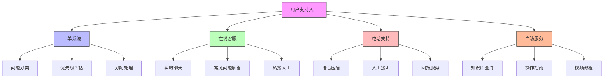

在企业级统一身份治理平台的日常运维中，标准化的操作流程（SOP）是确保服务质量、提高运维效率和降低人为错误的关键。本文将详细介绍用户支持和故障处理的标准操作流程，帮助运维团队建立规范化的服务体系。

## 引言

统一身份治理平台作为企业核心基础设施，其稳定性和可用性直接影响业务运营。建立完善的日常运维SOP，不仅能够提升用户满意度，还能在问题发生时快速响应和解决，最大程度减少业务中断时间。

## 用户支持流程

### 支持渠道管理

建立多元化的用户支持渠道，确保用户能够及时获得帮助：



### 工单处理流程

```java
public class TicketManagementSystem {
    private final TicketService ticketService;
    private final UserService userService;
    private final NotificationService notificationService;
    private final KnowledgeBaseService knowledgeBaseService;
    
    // 工单处理流程
    public class TicketWorkflow {
        
        // 创建工单
        public Ticket createTicket(TicketRequest request) {
            Ticket ticket = new Ticket();
            ticket.setId(generateTicketId());
            ticket.setTitle(request.getTitle());
            ticket.setDescription(request.getDescription());
            ticket.setRequesterId(request.getRequesterId());
            ticket.setCategory(request.getCategory());
            ticket.setPriority(determinePriority(request));
            ticket.setStatus(TicketStatus.OPEN);
            ticket.setCreatedAt(Instant.now());
            
            // 保存工单
            ticketService.saveTicket(ticket);
            
            // 发送确认通知
            notificationService.sendTicketConfirmation(ticket);
            
            // 自动分类和分配
            autoCategorizeAndAssign(ticket);
            
            return ticket;
        }
        
        // 确定工单优先级
        private TicketPriority determinePriority(TicketRequest request) {
            // 基于关键词和影响范围确定优先级
            if (containsKeywords(request.getDescription(), "紧急", "critical", "urgent")) {
                return TicketPriority.CRITICAL;
            } else if (containsKeywords(request.getDescription(), "重要", "high", "important")) {
                return TicketPriority.HIGH;
            } else if (containsKeywords(request.getDescription(), "一般", "medium", "normal")) {
                return TicketPriority.MEDIUM;
            } else {
                return TicketPriority.LOW;
            }
        }
        
        // 自动分类和分配
        private void autoCategorizeAndAssign(Ticket ticket) {
            // 使用AI进行智能分类
            String category = aiService.classifyTicket(ticket.getDescription());
            ticket.setCategory(category);
            
            // 根据分类和技能匹配分配处理人员
            String assignee = skillMatchingService.findBestAssignee(category);
            if (assignee != null) {
                ticket.setAssigneeId(assignee);
                ticket.setStatus(TicketStatus.ASSIGNED);
                
                // 发送分配通知
                notificationService.sendTicketAssignmentNotification(ticket);
            }
            
            // 更新工单
            ticketService.updateTicket(ticket);
        }
        
        // 处理工单
        public TicketProcessResult processTicket(String ticketId, TicketAction action) {
            Ticket ticket = ticketService.getTicket(ticketId);
            
            switch (action.getType()) {
                case RESPOND:
                    return addResponse(ticket, action);
                case ESCALATE:
                    return escalateTicket(ticket, action);
                case RESOLVE:
                    return resolveTicket(ticket, action);
                case CLOSE:
                    return closeTicket(ticket, action);
                default:
                    throw new IllegalArgumentException("不支持的操作类型: " + action.getType());
            }
        }
        
        // 添加响应
        private TicketProcessResult addResponse(Ticket ticket, TicketAction action) {
            TicketResponse response = new TicketResponse();
            response.setId(generateResponseId());
            response.setTicketId(ticket.getId());
            response.setResponderId(action.getUserId());
            response.setContent(action.getContent());
            response.setCreatedAt(Instant.now());
            
            // 保存响应
            ticketService.saveResponse(response);
            
            // 更新工单状态
            ticket.setStatus(TicketStatus.IN_PROGRESS);
            ticket.setUpdatedAt(Instant.now());
            ticketService.updateTicket(ticket);
            
            // 发送响应通知
            notificationService.sendTicketResponseNotification(ticket, response);
            
            return TicketProcessResult.success("响应已添加");
        }
        
        // 升级工单
        private TicketProcessResult escalateTicket(Ticket ticket, TicketAction action) {
            // 记录升级原因
            ticket.setEscalationReason(action.getContent());
            ticket.setEscalatedAt(Instant.now());
            ticket.setEscalatedBy(action.getUserId());
            
            // 根据升级级别重新分配
            String newAssignee = getEscalationAssignee(ticket, action.getEscalationLevel());
            ticket.setAssigneeId(newAssignee);
            
            // 更新状态
            ticket.setStatus(TicketStatus.ESCALATED);
            ticket.setUpdatedAt(Instant.now());
            ticketService.updateTicket(ticket);
            
            // 发送升级通知
            notificationService.sendTicketEscalationNotification(ticket);
            
            return TicketProcessResult.success("工单已升级");
        }
    }
}
```

### 用户支持SOP

```sql
-- 用户支持流程数据库设计
CREATE TABLE support_tickets (
    id VARCHAR(50) PRIMARY KEY,
    ticket_number VARCHAR(20) NOT NULL UNIQUE,
    title VARCHAR(200) NOT NULL,
    description TEXT,
    requester_id VARCHAR(50) NOT NULL,
    assignee_id VARCHAR(50),
    category VARCHAR(100),
    subcategory VARCHAR(100),
    priority VARCHAR(20) DEFAULT 'MEDIUM',  -- LOW, MEDIUM, HIGH, CRITICAL
    status VARCHAR(20) DEFAULT 'OPEN',  -- OPEN, ASSIGNED, IN_PROGRESS, RESOLVED, CLOSED, ESCALATED
    source VARCHAR(50),  -- EMAIL, WEB, PHONE, CHAT
    created_at TIMESTAMP DEFAULT CURRENT_TIMESTAMP,
    updated_at TIMESTAMP DEFAULT CURRENT_TIMESTAMP ON UPDATE CURRENT_TIMESTAMP,
    resolved_at TIMESTAMP NULL,
    closed_at TIMESTAMP NULL,
    sla_deadline TIMESTAMP,
    response_time_minutes INT,
    resolution_time_minutes INT,
    
    INDEX idx_ticket_number (ticket_number),
    INDEX idx_requester (requester_id),
    INDEX idx_assignee (assignee_id),
    INDEX idx_category (category),
    INDEX idx_priority (priority),
    INDEX idx_status (status),
    INDEX idx_created_at (created_at),
    INDEX idx_sla_deadline (sla_deadline)
);

-- 工单响应表
CREATE TABLE ticket_responses (
    id VARCHAR(50) PRIMARY KEY,
    ticket_id VARCHAR(50) NOT NULL,
    responder_id VARCHAR(50) NOT NULL,
    content TEXT NOT NULL,
    response_type VARCHAR(20) DEFAULT 'INTERNAL',  -- INTERNAL, EXTERNAL
    is_private BOOLEAN DEFAULT FALSE,
    created_at TIMESTAMP DEFAULT CURRENT_TIMESTAMP,
    
    FOREIGN KEY (ticket_id) REFERENCES support_tickets(id),
    INDEX idx_ticket_id (ticket_id),
    INDEX idx_responder (responder_id),
    INDEX idx_created_at (created_at)
);

-- 工单升级记录表
CREATE TABLE ticket_escalations (
    id VARCHAR(50) PRIMARY KEY,
    ticket_id VARCHAR(50) NOT NULL,
    escalated_by VARCHAR(50) NOT NULL,
    escalation_level VARCHAR(20) NOT NULL,  -- LEVEL_1, LEVEL_2, LEVEL_3
    reason TEXT,
    previous_assignee VARCHAR(50),
    new_assignee VARCHAR(50),
    escalated_at TIMESTAMP DEFAULT CURRENT_TIMESTAMP,
    
    FOREIGN KEY (ticket_id) REFERENCES support_tickets(id),
    INDEX idx_ticket_id (ticket_id),
    INDEX idx_escalated_by (escalated_by),
    INDEX idx_escalation_level (escalation_level)
);

-- 创建支持统计视图
CREATE VIEW support_statistics AS
SELECT 
    DATE(created_at) as date,
    category,
    priority,
    COUNT(*) as total_tickets,
    COUNT(CASE WHEN status = 'CLOSED' THEN 1 END) as closed_tickets,
    COUNT(CASE WHEN status = 'RESOLVED' THEN 1 END) as resolved_tickets,
    AVG(response_time_minutes) as avg_response_time,
    AVG(resolution_time_minutes) as avg_resolution_time,
    COUNT(CASE WHEN resolution_time_minutes > 240 THEN 1 END) as overdue_tickets
FROM support_tickets
WHERE created_at > DATE_SUB(NOW(), INTERVAL 30 DAY)
GROUP BY DATE(created_at), category, priority
ORDER BY date DESC;
```

## 故障处理流程

### 故障分类与响应

建立清晰的故障分类体系和响应机制：

```python
class IncidentManagementSystem:
    def __init__(self, incident_service, monitoring_service, notification_service):
        self.incident_service = incident_service
        self.monitoring_service = monitoring_service
        self.notification_service = notification_service
        self.incident_handlers = {}
    
    # 故障分类
    def classify_incident(self, incident_data):
        """故障分类"""
        classification = {
            'type': self._determine_incident_type(incident_data),
            'severity': self._determine_severity(incident_data),
            'impact': self._determine_impact(incident_data),
            'urgency': self._determine_urgency(incident_data),
            'category': self._determine_category(incident_data)
        }
        
        return classification
    
    def _determine_incident_type(self, incident_data):
        """确定故障类型"""
        # 基于监控告警类型分类
        if 'authentication' in incident_data.get('source', '').lower():
            return 'AUTHENTICATION_FAILURE'
        elif 'database' in incident_data.get('source', '').lower():
            return 'DATABASE_ISSUE'
        elif 'network' in incident_data.get('source', '').lower():
            return 'NETWORK_PROBLEM'
        elif 'performance' in incident_data.get('source', '').lower():
            return 'PERFORMANCE_DEGRADATION'
        else:
            return 'OTHER'
    
    def _determine_severity(self, incident_data):
        """确定故障严重程度"""
        # 基于影响范围和业务重要性
        affected_users = incident_data.get('affected_users', 0)
        business_impact = incident_data.get('business_impact', 'LOW')
        
        if affected_users > 1000 or business_impact == 'CRITICAL':
            return 'CRITICAL'
        elif affected_users > 100 or business_impact == 'HIGH':
            return 'HIGH'
        elif affected_users > 10 or business_impact == 'MEDIUM':
            return 'MEDIUM'
        else:
            return 'LOW'
    
    # 创建故障报告
    def create_incident(self, incident_data):
        """创建故障报告"""
        # 分类故障
        classification = self.classify_incident(incident_data)
        
        # 创建故障对象
        incident = {
            'id': self._generate_incident_id(),
            'title': incident_data.get('title', '未命名故障'),
            'description': incident_data.get('description', ''),
            'type': classification['type'],
            'severity': classification['severity'],
            'impact': classification['impact'],
            'urgency': classification['urgency'],
            'category': classification['category'],
            'status': 'OPEN',
            'detected_at': datetime.utcnow(),
            'reported_by': incident_data.get('reported_by'),
            'assigned_to': None,
            'related_alerts': incident_data.get('related_alerts', []),
            'affected_services': incident_data.get('affected_services', []),
            'timeline': []
        }
        
        # 保存故障
        self.incident_service.save_incident(incident)
        
        # 触发通知
        self._trigger_incident_notifications(incident)
        
        # 启动处理流程
        self._start_incident_handling(incident)
        
        return incident
    
    # 故障处理流程
    def handle_incident(self, incident_id, action_data):
        """处理故障"""
        incident = self.incident_service.get_incident(incident_id)
        
        if not incident:
            raise ValueError(f"故障不存在: {incident_id}")
        
        action = action_data.get('action')
        
        if action == 'ASSIGN':
            return self._assign_incident(incident, action_data)
        elif action == 'UPDATE':
            return self._update_incident(incident, action_data)
        elif action == 'RESOLVE':
            return self._resolve_incident(incident, action_data)
        elif action == 'CLOSE':
            return self._close_incident(incident, action_data)
        else:
            raise ValueError(f"不支持的操作: {action}")
    
    def _assign_incident(self, incident, action_data):
        """分配故障"""
        assignee = action_data.get('assignee')
        notes = action_data.get('notes', '')
        
        # 更新故障信息
        incident['assigned_to'] = assignee
        incident['status'] = 'ASSIGNED'
        incident['timeline'].append({
            'timestamp': datetime.utcnow(),
            'action': 'ASSIGNED',
            'actor': action_data.get('actor'),
            'details': f"分配给 {assignee}"
        })
        
        # 保存更新
        self.incident_service.update_incident(incident)
        
        # 发送分配通知
        self.notification_service.send_incident_assignment_notification(incident)
        
        return incident
    
    def _resolve_incident(self, incident, action_data):
        """解决故障"""
        resolution = action_data.get('resolution', '')
        root_cause = action_data.get('root_cause', '')
        
        # 更新故障信息
        incident['status'] = 'RESOLVED'
        incident['resolved_at'] = datetime.utcnow()
        incident['resolution'] = resolution
        incident['root_cause'] = root_cause
        incident['timeline'].append({
            'timestamp': datetime.utcnow(),
            'action': 'RESOLVED',
            'actor': action_data.get('actor'),
            'details': resolution
        })
        
        # 保存更新
        self.incident_service.update_incident(incident)
        
        # 发送解决通知
        self.notification_service.send_incident_resolution_notification(incident)
        
        return incident
```

### 故障响应SOP

```javascript
// 故障响应标准操作流程
class IncidentResponseSOP {
  constructor(incidentService, communicationService) {
    this.incidentService = incidentService;
    this.communicationService = communicationService;
  }
  
  // 故障响应流程
  async executeIncidentResponse(incident) {
    console.log(`开始执行故障响应流程: ${incident.id}`);
    
    // 第一步：确认和评估
    const assessment = await this._assessIncident(incident);
    
    // 第二步：通知相关人员
    await this._notifyStakeholders(incident, assessment);
    
    // 第三步：启动应急响应
    await this._initiateEmergencyResponse(incident, assessment);
    
    // 第四步：故障处理
    await this._handleIncident(incident, assessment);
    
    // 第五步：恢复验证
    await this._verifyRecovery(incident);
    
    // 第六步：总结和改进
    await this._postIncidentReview(incident);
  }
  
  // 故障评估
  async _assessIncident(incident) {
    console.log('进行故障评估');
    
    const assessment = {
      severity: incident.severity,
      impact: await this._assessImpact(incident),
      urgency: await this._assessUrgency(incident),
      affectedServices: incident.affectedServices,
      estimatedResolutionTime: this._estimateResolutionTime(incident),
      requiredResources: this._identifyRequiredResources(incident)
    };
    
    return assessment;
  }
  
  // 评估影响范围
  async _assessImpact(incident) {
    // 检查受影响的用户数量
    const affectedUsers = await this.incidentService.getAffectedUsers(incident.id);
    
    // 检查业务影响
    const businessImpact = await this.incidentService.getBusinessImpact(incident.id);
    
    // 检查服务依赖关系
    const serviceDependencies = await this.incidentService.getServiceDependencies(incident.affectedServices);
    
    return {
      userCount: affectedUsers.length,
      businessImpact: businessImpact,
      serviceDependencies: serviceDependencies,
      overallImpact: this._calculateOverallImpact(affectedUsers.length, businessImpact, serviceDependencies)
    };
  }
  
  // 通知相关人员
  async _notifyStakeholders(incident, assessment) {
    console.log('通知相关人员');
    
    // 通知运维团队
    await this.communicationService.sendToOpsTeam({
      type: 'INCIDENT_ALERT',
      incident: incident,
      assessment: assessment,
      priority: 'HIGH'
    });
    
    // 通知业务部门
    if (assessment.impact.businessImpact === 'HIGH' || assessment.impact.businessImpact === 'CRITICAL') {
      await this.communicationService.sendToBusinessTeams({
        type: 'SERVICE_DISRUPTION',
        incident: incident,
        impact: assessment.impact,
        estimatedRecovery: assessment.estimatedResolutionTime
      });
    }
    
    // 通知高级管理层
    if (incident.severity === 'CRITICAL') {
      await this.communicationService.sendToExecutives({
        type: 'CRITICAL_INCIDENT',
        incident: incident,
        assessment: assessment
      });
    }
  }
  
  // 启动应急响应
  async _initiateEmergencyResponse(incident, assessment) {
    console.log('启动应急响应');
    
    // 激活应急响应团队
    await this.incidentService.activateEmergencyResponseTeam(incident.id);
    
    // 启动备用系统（如适用）
    if (assessment.impact.serviceDependencies.includes('critical')) {
      await this.incidentService.activateBackupSystems(incident.affectedServices);
    }
    
    // 设置沟通渠道
    await this.communicationService.setupIncidentCommunicationChannel(incident.id);
  }
  
  // 故障处理
  async _handleIncident(incident, assessment) {
    console.log('执行故障处理');
    
    // 根据故障类型执行相应处理步骤
    switch (incident.type) {
      case 'AUTHENTICATION_FAILURE':
        await this._handleAuthenticationFailure(incident);
        break;
      case 'DATABASE_ISSUE':
        await this._handleDatabaseIssue(incident);
        break;
      case 'NETWORK_PROBLEM':
        await this._handleNetworkProblem(incident);
        break;
      case 'PERFORMANCE_DEGRADATION':
        await this._handlePerformanceIssue(incident);
        break;
      default:
        await this._handleGenericIssue(incident);
    }
  }
  
  // 处理认证故障
  async _handleAuthenticationFailure(incident) {
    console.log('处理认证故障');
    
    // 检查认证服务状态
    const authServiceStatus = await this.incidentService.checkAuthServiceStatus();
    
    // 重启认证服务（如需要）
    if (authServiceStatus !== 'RUNNING') {
      await this.incidentService.restartAuthService();
    }
    
    // 检查数据库连接
    const dbConnection = await this.incidentService.checkDatabaseConnection();
    if (!dbConnection) {
      await this.incidentService.reconnectDatabase();
    }
    
    // 验证修复效果
    const verification = await this.incidentService.verifyAuthService();
    if (verification.success) {
      await this.incidentService.resolveIncident(incident.id, {
        resolution: '重启认证服务并恢复数据库连接',
        rootCause: '认证服务异常终止导致'
      });
    }
  }
  
  // 恢复验证
  async _verifyRecovery(incident) {
    console.log('验证恢复情况');
    
    // 验证服务是否恢复正常
    const serviceStatus = await this.incidentService.verifyServiceRecovery(incident.affectedServices);
    
    // 验证用户访问是否正常
    const userAccess = await this.incidentService.verifyUserAccess();
    
    // 更新故障状态
    if (serviceStatus.healthy && userAccess.functional) {
      await this.incidentService.updateIncidentStatus(incident.id, 'RECOVERED');
      
      // 发送恢复通知
      await this.communicationService.sendRecoveryNotification(incident.id);
    }
  }
  
  // 事后回顾
  async _postIncidentReview(incident) {
    console.log('进行事后回顾');
    
    // 收集故障数据
    const incidentData = await this.incidentService.getIncidentData(incident.id);
    
    // 生成回顾报告
    const reviewReport = await this.incidentService.generatePostIncidentReport(incidentData);
    
    // 识别改进点
    const improvements = await this._identifyImprovements(reviewReport);
    
    // 更新SOP
    await this._updateSOP(improvements);
    
    // 发送回顾报告
    await this.communicationService.sendPostIncidentReport(reviewReport);
  }
}
```

## 知识库管理

### 常见问题解决方案

```sql
-- 知识库数据库设计
CREATE TABLE knowledge_base (
    id VARCHAR(50) PRIMARY KEY,
    title VARCHAR(200) NOT NULL,
    content TEXT NOT NULL,
    category VARCHAR(100),
    tags JSON,
    difficulty VARCHAR(20) DEFAULT 'BEGINNER',  -- BEGINNER, INTERMEDIATE, ADVANCED
    related_incidents JSON,
    created_by VARCHAR(50),
    updated_by VARCHAR(50),
    created_at TIMESTAMP DEFAULT CURRENT_TIMESTAMP,
    updated_at TIMESTAMP DEFAULT CURRENT_TIMESTAMP ON UPDATE CURRENT_TIMESTAMP,
    view_count INT DEFAULT 0,
    helpful_count INT DEFAULT 0,
    not_helpful_count INT DEFAULT 0,
    
    INDEX idx_category (category),
    INDEX idx_tags (tags),
    INDEX idx_difficulty (difficulty),
    INDEX idx_created_at (created_at),
    FULLTEXT(title, content)
);

-- 常见问题表
CREATE TABLE faq_entries (
    id VARCHAR(50) PRIMARY KEY,
    question VARCHAR(500) NOT NULL,
    answer TEXT NOT NULL,
    category VARCHAR(100),
    priority INT DEFAULT 0,
    is_published BOOLEAN DEFAULT TRUE,
    created_at TIMESTAMP DEFAULT CURRENT_TIMESTAMP,
    updated_at TIMESTAMP DEFAULT CURRENT_TIMESTAMP ON UPDATE CURRENT_TIMESTAMP,
    
    INDEX idx_category (category),
    INDEX idx_priority (priority),
    INDEX idx_is_published (is_published),
    FULLTEXT(question, answer)
);

-- 故障解决方案表
CREATE TABLE incident_solutions (
    id VARCHAR(50) PRIMARY KEY,
    incident_type VARCHAR(100) NOT NULL,
    solution_title VARCHAR(200) NOT NULL,
    solution_steps TEXT NOT NULL,
    required_tools JSON,
    estimated_time_minutes INT,
    success_rate DECIMAL(5,2),
    created_by VARCHAR(50),
    created_at TIMESTAMP DEFAULT CURRENT_TIMESTAMP,
    updated_at TIMESTAMP DEFAULT CURRENT_TIMESTAMP ON UPDATE CURRENT_TIMESTAMP,
    
    INDEX idx_incident_type (incident_type),
    INDEX idx_success_rate (success_rate)
);

-- 创建知识库统计视图
CREATE VIEW knowledge_base_statistics AS
SELECT 
    category,
    COUNT(*) as total_articles,
    AVG(view_count) as avg_views,
    AVG(helpful_count * 100.0 / NULLIF(helpful_count + not_helpful_count, 0)) as helpful_rate,
    MAX(updated_at) as last_updated
FROM knowledge_base
GROUP BY category
ORDER BY total_articles DESC;
```

## 总结

日常运维SOP的建立和完善是确保统一身份治理平台稳定运行的重要保障。通过标准化的用户支持流程、系统化的故障处理机制和丰富的知识库管理，运维团队能够更高效地响应用户需求和处理系统问题。

关键要点包括：

1. **用户支持**：建立多渠道支持体系，规范化工单处理流程
2. **故障处理**：建立清晰的故障分类和响应机制，确保快速恢复
3. **知识管理**：积累和分享运维经验，提升团队整体能力

在后续章节中，我们将继续探讨平台运营的其他重要方面，包括用户反馈收集、度量指标设计和版本管理等内容，为构建完整的企业级身份治理解决方案提供全面指导。