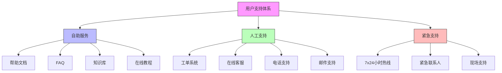

在企业级统一身份治理平台的日常运营中，标准化操作流程(SOP)是确保服务质量、提高运维效率和降低运营风险的关键。一个完善的SOP体系能够为运维团队提供清晰的操作指导，确保在各种情况下都能快速、准确地响应和处理问题。

## 引言

统一身份治理平台作为企业信息安全的核心基础设施，其稳定性和可靠性直接影响业务运营。日常运维SOP不仅包括常规的监控和维护工作，更重要的是建立高效的用户支持体系和快速的故障处理机制。通过标准化的流程，可以确保问题得到及时解决，最大程度减少对业务的影响。

## 用户支持体系

### 支持渠道设计

建立多层次、多渠道的用户支持体系，满足不同用户的需求：



### 工单管理系统

```java
public class TicketManagementSystem {
    private final TicketRepository ticketRepository;
    private final UserService userService;
    private final NotificationService notificationService;
    private final SLAService slaService;
    
    // 工单模型
    public class SupportTicket {
        private String id;
        private String title;
        private String description;
        private TicketType type;
        private TicketPriority priority;
        private TicketStatus status;
        private String requesterId;
        private String assigneeId;
        private List<TicketComment> comments;
        private List<TicketAttachment> attachments;
        private SLA sla;
        private LocalDateTime createdAt;
        private LocalDateTime updatedAt;
        private LocalDateTime resolvedAt;
        private LocalDateTime closedAt;
    }
    
    // 工单类型枚举
    public enum TicketType {
        TECHNICAL_ISSUE("技术问题"),
        FEATURE_REQUEST("功能请求"),
        ACCOUNT_ACCESS("账号访问"),
        PERMISSION_ISSUE("权限问题"),
        LOGIN_PROBLEM("登录问题"),
        PERFORMANCE_ISSUE("性能问题");
        
        private final String description;
        
        TicketType(String description) {
            this.description = description;
        }
        
        public String getDescription() {
            return description;
        }
    }
    
    // 工单优先级枚举
    public enum TicketPriority {
        LOW("低", 4),      // 48小时内响应
        MEDIUM("中", 3),   // 24小时内响应
        HIGH("高", 2),     // 4小时内响应
        CRITICAL("紧急", 1); // 1小时内响应
        
        private final String description;
        private final int responseHours;
        
        TicketPriority(String description, int responseHours) {
            this.description = description;
            this.responseHours = responseHours;
        }
        
        public String getDescription() {
            return description;
        }
        
        public int getResponseHours() {
            return responseHours;
        }
    }
    
    // 创建工单
    public SupportTicket createTicket(TicketCreationRequest request) {
        SupportTicket ticket = new SupportTicket();
        ticket.setId(generateTicketId());
        ticket.setTitle(request.getTitle());
        ticket.setDescription(request.getDescription());
        ticket.setType(request.getType());
        ticket.setPriority(determinePriority(request));
        ticket.setStatus(TicketStatus.OPEN);
        ticket.setRequesterId(request.getRequesterId());
        ticket.setCreatedAt(LocalDateTime.now());
        ticket.setUpdatedAt(LocalDateTime.now());
        ticket.setComments(new ArrayList<>());
        ticket.setAttachments(request.getAttachments());
        
        // 关联SLA
        ticket.setSla(slaService.getSLAForTicket(ticket));
        
        // 保存工单
        ticketRepository.save(ticket);
        
        // 分配处理人员
        String assigneeId = assignTicketToSupportStaff(ticket);
        ticket.setAssigneeId(assigneeId);
        
        // 发送通知
        notificationService.sendTicketCreatedNotification(ticket);
        
        // 记录审计日志
        auditService.logTicketCreation(ticket);
        
        return ticket;
    }
    
    // 确定工单优先级
    private TicketPriority determinePriority(TicketCreationRequest request) {
        // 基于问题类型和影响范围确定优先级
        switch (request.getType()) {
            case LOGIN_PROBLEM:
                // 登录问题通常影响所有用户，优先级较高
                return TicketPriority.HIGH;
            case ACCOUNT_ACCESS:
                // 账号访问问题可能影响业务，优先级中等
                return TicketPriority.MEDIUM;
            case TECHNICAL_ISSUE:
                // 技术问题需要根据描述判断影响范围
                if (request.getDescription().contains("all users") || 
                    request.getDescription().contains("system down")) {
                    return TicketPriority.CRITICAL;
                } else {
                    return TicketPriority.HIGH;
                }
            case PERFORMANCE_ISSUE:
                // 性能问题影响用户体验，优先级中等
                return TicketPriority.MEDIUM;
            default:
                return TicketPriority.LOW;
        }
    }
    
    // 分配工单给支持人员
    private String assignTicketToSupportStaff(SupportTicket ticket) {
        // 基于工单类型和技能匹配分配
        List<SupportStaff> availableStaff = supportStaffService.getAvailableStaff();
        
        // 查找最适合的处理人员
        SupportStaff bestMatch = findBestMatchStaff(ticket, availableStaff);
        
        if (bestMatch != null) {
            return bestMatch.getId();
        } else {
            // 如果没有找到匹配人员，分配给轮询队列
            return supportStaffService.getNextInRotation();
        }
    }
    
    // 更新工单状态
    public SupportTicket updateTicketStatus(String ticketId, TicketStatus newStatus, String updatedBy) {
        SupportTicket ticket = ticketRepository.findById(ticketId);
        
        if (ticket == null) {
            throw new TicketNotFoundException("工单不存在: " + ticketId);
        }
        
        TicketStatus oldStatus = ticket.getStatus();
        ticket.setStatus(newStatus);
        ticket.setUpdatedAt(LocalDateTime.now());
        
        // 如果是解决状态，记录解决时间
        if (newStatus == TicketStatus.RESOLVED) {
            ticket.setResolvedAt(LocalDateTime.now());
        }
        
        // 如果是关闭状态，记录关闭时间
        if (newStatus == TicketStatus.CLOSED) {
            ticket.setClosedAt(LocalDateTime.now());
        }
        
        // 保存更新
        ticketRepository.save(ticket);
        
        // 发送状态变更通知
        notificationService.sendTicketStatusUpdateNotification(ticket, oldStatus, updatedBy);
        
        // 检查SLA合规性
        checkSLACompliance(ticket);
        
        return ticket;
    }
    
    // 添加工单评论
    public TicketComment addComment(String ticketId, String commenterId, String commentText) {
        SupportTicket ticket = ticketRepository.findById(ticketId);
        
        if (ticket == null) {
            throw new TicketNotFoundException("工单不存在: " + ticketId);
        }
        
        TicketComment comment = new TicketComment();
        comment.setId(generateCommentId());
        comment.setTicketId(ticketId);
        comment.setCommenterId(commenterId);
        comment.setCommentText(commentText);
        comment.setCreatedAt(LocalDateTime.now());
        
        // 添加到工单
        ticket.getComments().add(comment);
        ticket.setUpdatedAt(LocalDateTime.now());
        
        // 保存更新
        ticketRepository.save(ticket);
        
        // 发送新评论通知
        notificationService.sendNewCommentNotification(ticket, comment);
        
        return comment;
    }
}
```

### 自助服务平台

```sql
-- 自助服务数据库设计
CREATE TABLE self_service_portal (
    id VARCHAR(50) PRIMARY KEY,
    title VARCHAR(200) NOT NULL,
    content_type VARCHAR(50) NOT NULL,  -- FAQ, TUTORIAL, GUIDE, VIDEO
    category VARCHAR(100),
    content TEXT,
    video_url VARCHAR(500),
    tags JSON,
    view_count INT DEFAULT 0,
    helpful_count INT DEFAULT 0,
    not_helpful_count INT DEFAULT 0,
    created_at TIMESTAMP DEFAULT CURRENT_TIMESTAMP,
    updated_at TIMESTAMP DEFAULT CURRENT_TIMESTAMP ON UPDATE CURRENT_TIMESTAMP,
    published BOOLEAN DEFAULT TRUE,
    
    INDEX idx_content_type (content_type),
    INDEX idx_category (category),
    INDEX idx_published (published),
    FULLTEXT(title, content)
);

-- 用户反馈表
CREATE TABLE self_service_feedback (
    id VARCHAR(50) PRIMARY KEY,
    content_id VARCHAR(50) NOT NULL,
    user_id VARCHAR(50),
    feedback_type VARCHAR(20) NOT NULL,  -- HELPFUL, NOT_HELPFUL
    comments TEXT,
    created_at TIMESTAMP DEFAULT CURRENT_TIMESTAMP,
    
    FOREIGN KEY (content_id) REFERENCES self_service_portal(id),
    INDEX idx_content (content_id),
    INDEX idx_user (user_id),
    INDEX idx_feedback_type (feedback_type)
);

-- 常见问题分类表
CREATE TABLE faq_categories (
    id VARCHAR(50) PRIMARY KEY,
    name VARCHAR(100) NOT NULL,
    description TEXT,
    display_order INT DEFAULT 0,
    created_at TIMESTAMP DEFAULT CURRENT_TIMESTAMP,
    updated_at TIMESTAMP DEFAULT CURRENT_TIMESTAMP ON UPDATE CURRENT_TIMESTAMP,
    
    INDEX idx_display_order (display_order)
);

-- 创建自助服务统计视图
CREATE VIEW self_service_statistics AS
SELECT 
    ssp.content_type,
    COUNT(*) as total_content,
    SUM(ssp.view_count) as total_views,
    SUM(ssp.helpful_count) as total_helpful,
    SUM(ssp.not_helpful_count) as total_not_helpful,
    ROUND(SUM(ssp.helpful_count) * 100.0 / NULLIF(SUM(ssp.helpful_count + ssp.not_helpful_count), 0), 2) as helpful_rate,
    MAX(ssp.updated_at) as last_updated
FROM self_service_portal ssp
WHERE ssp.published = TRUE
GROUP BY ssp.content_type;
```

## 故障处理机制

### 故障分类与响应

建立清晰的故障分类体系和响应机制，确保不同类型的问题能够得到适当的处理：

```python
class IncidentManagementSystem:
    def __init__(self, notification_service, escalation_service, recovery_service):
        self.notification_service = notification_service
        self.escalation_service = escalation_service
        self.recovery_service = recovery_service
        self.incidents = {}
    
    # 故障模型
    class Incident:
        def __init__(self, incident_id, report):
            self.id = incident_id
            self.report = report
            self.status = 'REPORTED'
            self.severity = self._determine_severity(report)
            self.category = self._categorize_incident(report)
            self.reported_at = datetime.utcnow()
            self.assigned_to = None
            self.response_time = None
            self.resolution_time = None
            self.impact_assessment = None
            self.root_cause_analysis = None
            self.resolution_actions = []
            self.communications = []
    
    # 故障严重程度枚举
    INCIDENT_SEVERITY = {
        'CRITICAL': {
            'description': '严重故障',
            'response_time': 15,  # 15分钟响应
            'notification_targets': ['executive_team', 'ops_director', 'system_admins'],
            'communication_frequency': 30  # 每30分钟更新一次
        },
        'HIGH': {
            'description': '高优先级故障',
            'response_time': 60,  # 1小时响应
            'notification_targets': ['ops_team', 'system_admins'],
            'communication_frequency': 120  # 每2小时更新一次
        },
        'MEDIUM': {
            'description': '中等优先级故障',
            'response_time': 240,  # 4小时响应
            'notification_targets': ['support_team'],
            'communication_frequency': 240  # 每4小时更新一次
        },
        'LOW': {
            'description': '低优先级故障',
            'response_time': 1440,  # 24小时响应
            'notification_targets': ['support_team'],
            'communication_frequency': 1440  # 每24小时更新一次
        }
    }
    
    # 故障分类
    INCIDENT_CATEGORIES = [
        'AUTHENTICATION_FAILURE',      # 认证失败
        'AUTHORIZATION_ERROR',         # 授权错误
        'PERFORMANCE_DEGRADATION',     # 性能下降
        'SYSTEM_UNAVAILABLE',          # 系统不可用
        'DATA_INTEGRITY_ISSUE',        # 数据完整性问题
        'SECURITY_BREACH',             # 安全漏洞
        'CONFIGURATION_ERROR',         # 配置错误
        'EXTERNAL_DEPENDENCY_FAILURE'  # 外部依赖故障
    ]
    
    # 报告故障
    def report_incident(self, incident_report):
        """报告新故障"""
        incident_id = self._generate_incident_id()
        incident = self.Incident(incident_id, incident_report)
        
        # 存储故障
        self.incidents[incident_id] = incident
        
        # 记录到数据库
        self._save_incident(incident)
        
        # 发送初始通知
        self._send_initial_notification(incident)
        
        # 启动响应流程
        self._initiate_response(incident)
        
        # 启动定时更新
        self._schedule_status_updates(incident)
        
        return incident
    
    # 确定故障严重程度
    def _determine_severity(self, report):
        """根据报告内容确定故障严重程度"""
        # 基于影响用户数、业务影响和系统可用性确定严重程度
        affected_users = report.get('affected_users', 0)
        business_impact = report.get('business_impact', 'LOW')
        system_availability = report.get('system_availability', 100)
        
        if affected_users > 1000 or business_impact == 'CRITICAL' or system_availability < 50:
            return 'CRITICAL'
        elif affected_users > 100 or business_impact == 'HIGH' or system_availability < 80:
            return 'HIGH'
        elif affected_users > 10 or business_impact == 'MEDIUM' or system_availability < 95:
            return 'MEDIUM'
        else:
            return 'LOW'
    
    # 分类故障
    def _categorize_incident(self, report):
        """对故障进行分类"""
        keywords = report.get('description', '').lower()
        
        if 'authentication' in keywords or 'login' in keywords:
            return 'AUTHENTICATION_FAILURE'
        elif 'permission' in keywords or 'access denied' in keywords:
            return 'AUTHORIZATION_ERROR'
        elif 'slow' in keywords or 'performance' in keywords:
            return 'PERFORMANCE_DEGRADATION'
        elif 'down' in keywords or 'unavailable' in keywords:
            return 'SYSTEM_UNAVAILABLE'
        elif 'data' in keywords or 'integrity' in keywords:
            return 'DATA_INTEGRITY_ISSUE'
        elif 'security' in keywords or 'breach' in keywords:
            return 'SECURITY_BREACH'
        elif 'config' in keywords or 'setting' in keywords:
            return 'CONFIGURATION_ERROR'
        elif 'external' in keywords or 'dependency' in keywords:
            return 'EXTERNAL_DEPENDENCY_FAILURE'
        else:
            return 'SYSTEM_UNAVAILABLE'
    
    # 发送初始通知
    def _send_initial_notification(self, incident):
        """发送故障初始通知"""
        severity_config = self.INCIDENT_SEVERITY[incident.severity]
        
        notification = {
            'type': 'INCIDENT_REPORTED',
            'incident_id': incident.id,
            'severity': incident.severity,
            'category': incident.category,
            'description': incident.report.get('description', ''),
            'reported_at': incident.reported_at.isoformat(),
            'notification_targets': severity_config['notification_targets']
        }
        
        self.notification_service.send_notification(notification)
    
    # 启动响应流程
    def _initiate_response(self, incident):
        """启动故障响应流程"""
        # 分配处理人员
        assigned_person = self._assign_incident_handler(incident)
        incident.assigned_to = assigned_person
        
        # 记录响应时间
        incident.response_time = datetime.utcnow()
        
        # 发送分配通知
        self._send_assignment_notification(incident, assigned_person)
        
        # 启动自动恢复尝试
        self._attempt_automatic_recovery(incident)
    
    # 分配故障处理人员
    def _assign_incident_handler(self, incident):
        """分配故障处理人员"""
        # 基于故障类别和技能匹配分配
        category_experts = self._get_category_experts(incident.category)
        
        if category_experts:
            # 分配给最空闲的专家
            return self._find_least_busy_expert(category_experts)
        else:
            # 分配给值班人员
            return self._get_on_call_staff()
    
    # 尝试自动恢复
    def _attempt_automatic_recovery(self, incident):
        """尝试自动恢复故障"""
        try:
            # 根据故障类别执行相应的自动恢复操作
            if incident.category == 'AUTHENTICATION_FAILURE':
                self.recovery_service.restart_auth_service()
            elif incident.category == 'PERFORMANCE_DEGRADATION':
                self.recovery_service.scale_up_resources()
            elif incident.category == 'CONFIGURATION_ERROR':
                self.recovery_service.rollback_configuration()
            
            # 记录恢复尝试
            incident.resolution_actions.append({
                'action': 'AUTOMATIC_RECOVERY_ATTEMPT',
                'timestamp': datetime.utcnow().isoformat(),
                'details': f'Attempted automatic recovery for {incident.category}'
            })
            
        except Exception as e:
            logger.error(f"自动恢复尝试失败: {e}")
            # 如果自动恢复失败，启动人工处理流程
            self._escalate_to_manual_handling(incident)
```

### 故障响应流程

```javascript
// 故障响应流程管理
class IncidentResponseProcess {
  constructor(incidentService, communicationService, recoveryService) {
    this.incidentService = incidentService;
    this.communicationService = communicationService;
    this.recoveryService = recoveryService;
    this.activeIncidents = new Map();
  }
  
  // 启动故障响应流程
  startIncidentResponse(incidentId) {
    const incident = this.incidentService.getIncident(incidentId);
    
    if (!incident) {
      throw new Error(`故障不存在: ${incidentId}`);
    }
    
    // 创建响应流程实例
    const responseProcess = {
      incidentId: incidentId,
      startTime: new Date(),
      status: 'INITIATED',
      steps: [],
      timeline: [],
      communications: []
    };
    
    // 记录流程启动
    this.logProcessStep(responseProcess, '流程启动', '已启动故障响应流程');
    
    // 通知相关人员
    this.notifyStakeholders(incident, 'INCIDENT_RESPONSE_STARTED');
    
    // 启动调查
    this.initiateInvestigation(responseProcess, incident);
    
    // 存储响应流程
    this.activeIncidents.set(incidentId, responseProcess);
    
    return responseProcess;
  }
  
  // 启动调查
  async initiateInvestigation(responseProcess, incident) {
    this.logProcessStep(responseProcess, '调查启动', '开始故障调查');
    
    // 收集初始信息
    const initialInfo = await this.collectInitialInformation(incident);
    
    // 分析故障模式
    const analysis = await this.analyzeIncidentPattern(incident, initialInfo);
    
    // 更新故障信息
    this.incidentService.updateIncident(incident.id, {
      impact_assessment: analysis.impact,
      root_cause_analysis: analysis.potential_causes
    });
    
    // 记录调查结果
    this.logProcessStep(responseProcess, '初步分析完成', 
      `影响评估: ${analysis.impact.level}, 潜在原因: ${analysis.potential_causes.join(', ')}`);
    
    // 制定恢复计划
    const recoveryPlan = this.createRecoveryPlan(incident, analysis);
    
    // 执行恢复操作
    await this.executeRecoveryActions(responseProcess, incident, recoveryPlan);
  }
  
  // 收集初始信息
  async collectInitialInformation(incident) {
    const info = {
      system_logs: await this.incidentService.getRecentLogs(incident.reported_at, 60), // 60分钟日志
      metrics_data: await this.incidentService.getMetricsData(incident.reported_at, 60),
      user_reports: await this.incidentService.getUserReports(incident.reported_at, 60),
      service_status: await this.incidentService.getServiceStatus()
    };
    
    return info;
  }
  
  // 分析故障模式
  async analyzeIncidentPattern(incident, initialInfo) {
    const analysis = {
      impact: {
        level: this.assessImpactLevel(incident, initialInfo),
        affected_services: this.identifyAffectedServices(initialInfo),
        affected_users: this.estimateAffectedUsers(initialInfo)
      },
      potential_causes: this.identifyPotentialCauses(incident, initialInfo),
      timeline: this.reconstructIncidentTimeline(initialInfo)
    };
    
    return analysis;
  }
  
  // 评估影响级别
  assessImpactLevel(incident, initialInfo) {
    // 基于受影响服务数、错误率、用户投诉等评估影响级别
    const serviceCount = initialInfo.service_status.filter(s => s.status === 'DOWN').length;
    const errorRate = this.calculateErrorRate(initialInfo.system_logs);
    const userReports = initialInfo.user_reports.length;
    
    if (serviceCount > 3 || errorRate > 0.5 || userReports > 50) {
      return 'HIGH';
    } else if (serviceCount > 1 || errorRate > 0.1 || userReports > 10) {
      return 'MEDIUM';
    } else {
      return 'LOW';
    }
  }
  
  // 制定恢复计划
  createRecoveryPlan(incident, analysis) {
    const plan = {
      priority_actions: [],
      sequential_actions: [],
      verification_steps: [],
      rollback_procedures: []
    };
    
    // 根据故障类别和分析结果制定恢复计划
    switch (incident.category) {
      case 'AUTHENTICATION_FAILURE':
        plan.priority_actions = [
          '重启认证服务',
          '检查数据库连接',
          '验证配置文件'
        ];
        plan.sequential_actions = [
          '检查第三方认证提供商状态',
          '验证SSL证书有效性',
          '审查安全策略'
        ];
        break;
        
      case 'PERFORMANCE_DEGRADATION':
        plan.priority_actions = [
          '扩容应用实例',
          '清理缓存',
          '重启性能最差的服务'
        ];
        plan.sequential_actions = [
          '分析慢查询',
          '检查网络延迟',
          '优化数据库索引'
        ];
        break;
        
      default:
        plan.priority_actions = [
          '检查系统资源使用情况',
          '重启核心服务',
          '验证配置'
        ];
    }
    
    // 添加验证步骤
    plan.verification_steps = [
      '确认服务恢复正常',
      '验证用户可以正常登录',
      '检查系统性能指标'
    ];
    
    // 添加回滚程序
    plan.rollback_procedures = [
      '回滚到最后稳定版本',
      '恢复备份配置',
      '通知所有受影响的用户'
    ];
    
    return plan;
  }
  
  // 执行恢复操作
  async executeRecoveryActions(responseProcess, incident, recoveryPlan) {
    this.logProcessStep(responseProcess, '恢复操作开始', '开始执行恢复计划');
    
    try {
      // 执行优先操作
      for (const action of recoveryPlan.priority_actions) {
        await this.executeRecoveryAction(action, incident);
        this.logProcessStep(responseProcess, `执行操作: ${action}`, '操作完成');
      }
      
      // 验证恢复效果
      const verificationResult = await this.verifyRecovery(incident, recoveryPlan.verification_steps);
      
      if (verificationResult.success) {
        this.logProcessStep(responseProcess, '恢复成功', '系统已恢复正常');
        this.completeIncidentResponse(responseProcess, incident, verificationResult);
      } else {
        this.logProcessStep(responseProcess, '恢复失败', '需要执行后续操作');
        // 执行顺序操作
        await this.executeSequentialActions(responseProcess, incident, recoveryPlan);
      }
      
    } catch (error) {
      this.logProcessStep(responseProcess, '恢复过程中出错', `错误: ${error.message}`);
      this.handleRecoveryFailure(responseProcess, incident, error);
    }
  }
  
  // 验证恢复效果
  async verifyRecovery(incident, verificationSteps) {
    const results = {
      success: true,
      details: {}
    };
    
    for (const step of verificationSteps) {
      try {
        const result = await this.executeVerificationStep(step, incident);
        results.details[step] = result;
        
        if (!result.passed) {
          results.success = false;
        }
      } catch (error) {
        results.success = false;
        results.details[step] = { passed: false, error: error.message };
      }
    }
    
    return results;
  }
  
  // 完成故障响应
  completeIncidentResponse(responseProcess, incident, verificationResult) {
    responseProcess.status = 'COMPLETED';
    responseProcess.endTime = new Date();
    
    // 更新故障状态
    this.incidentService.updateIncident(incident.id, {
      status: 'RESOLVED',
      resolution_time: responseProcess.endTime,
      resolution_details: verificationResult.details
    });
    
    // 发送完成通知
    this.notifyStakeholders(incident, 'INCIDENT_RESOLVED', {
      resolution_time: responseProcess.endTime,
      details: verificationResult.details
    });
    
    // 记录完成
    this.logProcessStep(responseProcess, '流程完成', '故障响应流程已成功完成');
    
    // 从活动故障列表中移除
    this.activeIncidents.delete(incident.id);
  }
}
```

### 故障沟通机制

```sql
-- 故障管理数据库设计
CREATE TABLE incident_management (
    id VARCHAR(50) PRIMARY KEY,
    incident_id VARCHAR(50) NOT NULL UNIQUE,
    title VARCHAR(200) NOT NULL,
    description TEXT,
    category VARCHAR(100),
    severity VARCHAR(20) NOT NULL,  -- CRITICAL, HIGH, MEDIUM, LOW
    status VARCHAR(20) DEFAULT 'REPORTED',  -- REPORTED, INVESTIGATING, RESOLVING, RESOLVED, CLOSED
    reported_at TIMESTAMP NOT NULL,
    acknowledged_at TIMESTAMP NULL,
    resolved_at TIMESTAMP NULL,
    closed_at TIMESTAMP NULL,
    assigned_to VARCHAR(50),
    impact_assessment JSON,
    root_cause_analysis TEXT,
    resolution_summary TEXT,
    created_at TIMESTAMP DEFAULT CURRENT_TIMESTAMP,
    updated_at TIMESTAMP DEFAULT CURRENT_TIMESTAMP ON UPDATE CURRENT_TIMESTAMP,
    
    INDEX idx_incident_id (incident_id),
    INDEX idx_severity (severity),
    INDEX idx_status (status),
    INDEX idx_category (category),
    INDEX idx_reported_at (reported_at)
);

-- 故障时间线表
CREATE TABLE incident_timeline (
    id VARCHAR(50) PRIMARY KEY,
    incident_id VARCHAR(50) NOT NULL,
    event_time TIMESTAMP NOT NULL,
    event_type VARCHAR(100) NOT NULL,
    description TEXT,
    performed_by VARCHAR(50),
    details JSON,
    
    FOREIGN KEY (incident_id) REFERENCES incident_management(incident_id),
    INDEX idx_incident (incident_id),
    INDEX idx_event_time (event_time),
    INDEX idx_event_type (event_type)
);

-- 故障沟通记录表
CREATE TABLE incident_communications (
    id VARCHAR(50) PRIMARY KEY,
    incident_id VARCHAR(50) NOT NULL,
    communication_type VARCHAR(50) NOT NULL,  -- INITIAL, UPDATE, RESOLUTION, FOLLOW_UP
    subject VARCHAR(200),
    content TEXT,
    recipients JSON,
    sent_at TIMESTAMP DEFAULT CURRENT_TIMESTAMP,
    delivery_status VARCHAR(20) DEFAULT 'SENT',  -- SENT, FAILED, PENDING
    
    FOREIGN KEY (incident_id) REFERENCES incident_management(incident_id),
    INDEX idx_incident (incident_id),
    INDEX idx_communication_type (communication_type),
    INDEX idx_sent_at (sent_at)
);

-- 故障后分析表
CREATE TABLE post_incident_analysis (
    id VARCHAR(50) PRIMARY KEY,
    incident_id VARCHAR(50) NOT NULL,
    analysis_date TIMESTAMP DEFAULT CURRENT_TIMESTAMP,
    root_cause TEXT,
    contributing_factors JSON,
    timeline JSON,
    impact_assessment TEXT,
    resolution_effectiveness TEXT,
    lessons_learned TEXT,
    improvement_recommendations JSON,
    reviewed_by VARCHAR(50),
    review_date TIMESTAMP NULL,
    
    FOREIGN KEY (incident_id) REFERENCES incident_management(incident_id),
    UNIQUE KEY unique_analysis (incident_id)
);

-- 创建故障统计视图
CREATE VIEW incident_statistics AS
SELECT 
    im.category,
    im.severity,
    COUNT(*) as incident_count,
    AVG(TIMESTAMPDIFF(MINUTE, im.reported_at, im.resolved_at)) as avg_resolution_minutes,
    COUNT(CASE WHEN TIMESTAMPDIFF(MINUTE, im.reported_at, im.acknowledged_at) <= 15 THEN 1 END) as met_response_sla,
    COUNT(CASE WHEN TIMESTAMPDIFF(MINUTE, im.reported_at, im.resolved_at) <= 120 THEN 1 END) as met_resolution_sla,
    MAX(im.reported_at) as last_incident_date
FROM incident_management im
WHERE im.reported_at > DATE_SUB(NOW(), INTERVAL 30 DAY)
GROUP BY im.category, im.severity
ORDER BY incident_count DESC;
```

## 总结

日常运维SOP是统一身份治理平台稳定运行的重要保障。通过建立完善的用户支持体系和故障处理机制，可以确保问题得到及时响应和有效解决。

关键要点包括：

1. **多渠道支持**：提供自助服务、人工支持和紧急支持等多种支持渠道
2. **标准化流程**：建立清晰的工单管理和故障处理流程
3. **分级响应**：根据问题严重程度实施分级响应机制
4. **有效沟通**：建立及时、透明的沟通机制
5. **持续改进**：通过故障分析和经验总结不断优化流程

在后续章节中，我们将继续探讨反馈收集与度量、版本管理与迭代规划等主题，为构建完整的平台运营体系提供全面指导。