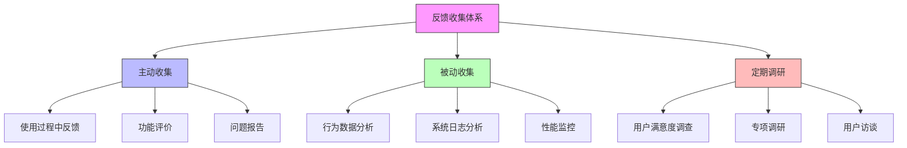

在企业级统一身份治理平台的持续运营中，收集用户反馈和度量成功指标是优化产品、提升用户体验和证明业务价值的关键环节。通过建立系统化的反馈收集机制和科学的度量体系，可以准确了解平台的实际表现，识别改进机会，并为决策提供数据支持。

## 引言

统一身份治理平台的成功不仅体现在技术实现上，更重要的是能够真正满足用户需求并创造业务价值。为了实现这一目标，必须建立有效的反馈收集机制和全面的度量体系，持续监控平台表现，及时发现问题并进行优化改进。

## 反馈收集机制

### 多维度反馈渠道

建立多样化的反馈收集渠道，覆盖用户在使用平台过程中的各个环节：



### 使用过程中反馈

```java
public class InAppFeedbackSystem {
    private final FeedbackService feedbackService;
    private final UserService userService;
    private final AnalyticsService analyticsService;
    
    // 反馈模型
    public class UserFeedback {
        private String id;
        private String userId;
        private String featureId;
        private FeedbackType type;
        private String title;
        private String description;
        private int rating; // 1-5星评级
        private List<String> tags;
        private String userAgent;
        private String ipAddress;
        private LocalDateTime createdAt;
        private FeedbackStatus status;
        private String assignedTo;
        private List<FeedbackComment> comments;
    }
    
    // 反馈类型枚举
    public enum FeedbackType {
        BUG_REPORT("问题报告"),
        FEATURE_REQUEST("功能建议"),
        USABILITY_ISSUE("易用性问题"),
        PERFORMANCE_ISSUE("性能问题"),
        GENERAL_COMMENT("一般评论");
        
        private final String description;
        
        FeedbackType(String description) {
            this.description = description;
        }
        
        public String getDescription() {
            return description;
        }
    }
    
    // 内嵌反馈组件
    public class InlineFeedbackWidget {
        
        // 显示反馈按钮
        public void showFeedbackButton(String featureId, String context) {
            // 根据用户使用情况智能显示反馈按钮
            if (shouldShowFeedbackButton(featureId, context)) {
                renderFeedbackButton(featureId, context);
            }
        }
        
        // 判断是否显示反馈按钮
        private boolean shouldShowFeedbackButton(String featureId, String context) {
            // 基于用户使用频率、使用时长等条件判断
            UserActivity activity = analyticsService.getUserActivityForFeature(getCurrentUserId(), featureId);
            
            // 如果用户使用该功能超过一定次数且使用时间较长，则显示反馈按钮
            return activity.getUsageCount() > 5 && activity.getTotalDuration() > 300; // 5分钟
        }
        
        // 渲染反馈按钮
        private void renderFeedbackButton(String featureId, String context) {
            String buttonHtml = String.format(
                "<button class='feedback-button' data-feature='%s' data-context='%s' onclick='showFeedbackDialog(\"%s\", \"%s\")'>" +
                "反馈建议" +
                "</button>",
                featureId, context, featureId, context
            );
            
            // 将按钮插入到页面适当位置
            injectFeedbackButton(buttonHtml);
        }
        
        // 显示反馈对话框
        public void showFeedbackDialog(String featureId, String context) {
            FeedbackDialog dialog = new FeedbackDialog();
            dialog.setFeatureId(featureId);
            dialog.setContext(context);
            dialog.setUserId(getCurrentUserId());
            dialog.setUserAgent(getCurrentUserAgent());
            dialog.setIpAddress(getCurrentUserIP());
            
            // 显示对话框
            dialog.show();
        }
    }
    
    // 反馈对话框
    public class FeedbackDialog {
        private String featureId;
        private String context;
        private String userId;
        private String userAgent;
        private String ipAddress;
        
        // 提交反馈
        public UserFeedback submitFeedback(FeedbackSubmission submission) {
            UserFeedback feedback = new UserFeedback();
            feedback.setId(generateFeedbackId());
            feedback.setUserId(userId);
            feedback.setFeatureId(featureId);
            feedback.setType(submission.getType());
            feedback.setTitle(submission.getTitle());
            feedback.setDescription(submission.getDescription());
            feedback.setRating(submission.getRating());
            feedback.setTags(submission.getTags());
            feedback.setUserAgent(userAgent);
            feedback.setIpAddress(ipAddress);
            feedback.setCreatedAt(LocalDateTime.now());
            feedback.setStatus(FeedbackStatus.NEW);
            feedback.setComments(new ArrayList<>());
            
            // 保存反馈
            feedbackService.saveFeedback(feedback);
            
            // 发送通知
            notificationService.sendFeedbackNotification(feedback);
            
            // 记录用户行为
            analyticsService.recordFeedbackSubmission(userId, featureId);
            
            return feedback;
        }
    }
    
    // 快速评分系统
    public class QuickRatingSystem {
        
        // 显示快速评分
        public void showQuickRating(String featureId, String context) {
            // 在用户完成某个操作后显示快速评分
            if (shouldShowQuickRating(featureId, context)) {
                renderQuickRating(featureId, context);
            }
        }
        
        // 判断是否显示快速评分
        private boolean shouldShowQuickRating(String featureId, String context) {
            // 基于用户完成操作的成功率和频率判断
            OperationMetrics metrics = analyticsService.getOperationMetrics(featureId, context);
            
            // 如果操作成功率高且用户频繁使用，则显示快速评分
            return metrics.getSuccessRate() > 0.9 && metrics.getFrequency() > 3;
        }
        
        // 处理评分提交
        public void handleRatingSubmission(String featureId, int rating, String userId) {
            // 记录评分
            feedbackService.recordQuickRating(featureId, rating, userId);
            
            // 如果评分较低，自动创建反馈建议
            if (rating <= 2) {
                createAutomaticFeedback(featureId, rating, userId);
            }
            
            // 更新功能评分统计
            updateFeatureRatingStats(featureId, rating);
        }
        
        // 创建自动反馈
        private void createAutomaticFeedback(String featureId, int rating, String userId) {
            UserFeedback feedback = new UserFeedback();
            feedback.setId(generateFeedbackId());
            feedback.setUserId(userId);
            feedback.setFeatureId(featureId);
            feedback.setType(FeedbackType.USABILITY_ISSUE);
            feedback.setTitle("低评分反馈");
            feedback.setDescription(String.format("用户对功能 %s 给出了 %d 星评分", featureId, rating));
            feedback.setRating(rating);
            feedback.setCreatedAt(LocalDateTime.now());
            feedback.setStatus(FeedbackStatus.NEW);
            
            feedbackService.saveFeedback(feedback);
        }
    }
}
```

### 用户行为分析

```sql
-- 用户反馈数据库设计
CREATE TABLE user_feedback (
    id VARCHAR(50) PRIMARY KEY,
    user_id VARCHAR(50),
    feature_id VARCHAR(100),
    feedback_type VARCHAR(50) NOT NULL,
    title VARCHAR(200) NOT NULL,
    description TEXT,
    rating INT DEFAULT 0,  -- 0-5星评级
    tags JSON,
    user_agent VARCHAR(500),
    ip_address VARCHAR(45),
    context JSON,  -- 使用上下文信息
    status VARCHAR(20) DEFAULT 'NEW',
    assigned_to VARCHAR(50),
    created_at TIMESTAMP DEFAULT CURRENT_TIMESTAMP,
    updated_at TIMESTAMP DEFAULT CURRENT_TIMESTAMP ON UPDATE CURRENT_TIMESTAMP,
    
    INDEX idx_user_id (user_id),
    INDEX idx_feature_id (feature_id),
    INDEX idx_feedback_type (feedback_type),
    INDEX idx_rating (rating),
    INDEX idx_status (status),
    INDEX idx_created_at (created_at),
    FULLTEXT(title, description)
);

-- 用户行为日志表
CREATE TABLE user_behavior_logs (
    id VARCHAR(50) PRIMARY KEY,
    user_id VARCHAR(50),
    session_id VARCHAR(100),
    feature_id VARCHAR(100),
    action_type VARCHAR(50) NOT NULL,  -- VIEW, CLICK, SUBMIT, ERROR, etc.
    action_details JSON,
    duration INT,  -- 操作持续时间（毫秒）
    success BOOLEAN DEFAULT TRUE,
    error_message VARCHAR(500),
    timestamp TIMESTAMP DEFAULT CURRENT_TIMESTAMP,
    
    INDEX idx_user_id (user_id),
    INDEX idx_feature_id (feature_id),
    INDEX idx_action_type (action_type),
    INDEX idx_success (success),
    INDEX idx_timestamp (timestamp)
);

-- 功能使用统计表
CREATE TABLE feature_usage_stats (
    id VARCHAR(50) PRIMARY KEY,
    feature_id VARCHAR(100) NOT NULL,
    date_key DATE NOT NULL,
    usage_count INT DEFAULT 0,
    unique_users INT DEFAULT 0,
    avg_duration INT DEFAULT 0,  -- 平均使用时长（秒）
    success_rate DECIMAL(5,4) DEFAULT 1.0000,  -- 成功率
    avg_rating DECIMAL(3,2) DEFAULT 0.00,  -- 平均评分
    feedback_count INT DEFAULT 0,
    
    UNIQUE KEY unique_feature_date (feature_id, date_key),
    INDEX idx_feature_id (feature_id),
    INDEX idx_date_key (date_key)
);

-- 创建反馈分析视图
CREATE VIEW feedback_analysis AS
SELECT 
    uf.feature_id,
    COUNT(*) as total_feedback,
    COUNT(CASE WHEN uf.feedback_type = 'BUG_REPORT' THEN 1 END) as bug_reports,
    COUNT(CASE WHEN uf.feedback_type = 'FEATURE_REQUEST' THEN 1 END) as feature_requests,
    COUNT(CASE WHEN uf.feedback_type = 'USABILITY_ISSUE' THEN 1 END) as usability_issues,
    AVG(uf.rating) as avg_rating,
    COUNT(CASE WHEN uf.rating <= 2 THEN 1 END) as low_ratings,
    COUNT(CASE WHEN uf.rating >= 4 THEN 1 END) as high_ratings,
    GROUP_CONCAT(DISTINCT JSON_EXTRACT(uf.tags, '$[*]')) as common_tags,
    MAX(uf.created_at) as latest_feedback
FROM user_feedback uf
WHERE uf.created_at > DATE_SUB(NOW(), INTERVAL 30 DAY)
GROUP BY uf.feature_id;
```

### 定期用户调研

```python
class UserResearchSystem:
    def __init__(self, survey_service, analytics_service, communication_service):
        self.survey_service = survey_service
        self.analytics_service = analytics_service
        self.communication_service = communication_service
        self.surveys = {}
    
    # 调研模型
    class Survey:
        def __init__(self, survey_id, config):
            self.id = survey_id
            self.name = config['name']
            self.description = config['description']
            self.target_audience = config['target_audience']
            self.questions = config['questions']
            self.frequency = config['frequency']  # DAILY, WEEKLY, MONTHLY, QUARTERLY
            self.channels = config['channels']  # EMAIL, IN_APP, SMS, etc.
            self.incentives = config['incentives']  # 奖励机制
            self.status = 'DRAFT'
            self.created_at = datetime.utcnow()
            self.scheduled_at = None
            self.completed_at = None
    
    # 满意度调研
    def create_satisfaction_survey(self):
        """创建满意度调研"""
        survey_config = {
            'name': '用户满意度调研',
            'description': '了解用户对统一身份治理平台的满意度',
            'target_audience': self._identify_target_users(),
            'questions': self._design_satisfaction_questions(),
            'frequency': 'QUARTERLY',
            'channels': ['EMAIL', 'IN_APP'],
            'incentives': {'type': 'POINTS', 'value': 100}
        }
        
        survey_id = self._generate_survey_id()
        survey = self.Survey(survey_id, survey_config)
        
        # 保存调研
        self.surveys[survey_id] = survey
        self.survey_service.save_survey(survey)
        
        return survey
    
    # 识别目标用户
    def _identify_target_users(self):
        """识别调研目标用户"""
        # 基于用户活跃度、使用频率等条件筛选
        active_users = self.analytics_service.get_active_users(days=30)
        frequent_users = self.analytics_service.get_frequent_users(min_sessions=10)
        power_users = self.analytics_service.get_power_users()
        
        # 合并用户列表并去重
        target_users = list(set(active_users + frequent_users + power_users))
        
        return target_users[:1000]  # 限制调研用户数量
    
    # 设计满意度问题
    def _design_satisfaction_questions(self):
        """设计满意度调研问题"""
        questions = [
            {
                'id': 'overall_satisfaction',
                'type': 'RATING',
                'text': '您对统一身份治理平台的整体满意度如何？',
                'scale': 5,
                'required': True
            },
            {
                'id': 'ease_of_use',
                'type': 'RATING',
                'text': '您认为平台的易用性如何？',
                'scale': 5,
                'required': True
            },
            {
                'id': 'feature_satisfaction',
                'type': 'MULTI_RATING',
                'text': '请评价以下功能的满意度：',
                'options': [
                    '用户管理',
                    '权限管理',
                    '单点登录',
                    '审计功能',
                    '报表分析'
                ],
                'scale': 5,
                'required': True
            },
            {
                'id': 'performance_satisfaction',
                'type': 'RATING',
                'text': '您对平台的性能表现（响应速度、稳定性）是否满意？',
                'scale': 5,
                'required': True
            },
            {
                'id': 'support_satisfaction',
                'type': 'RATING',
                'text': '您对技术支持服务的满意度如何？',
                'scale': 5,
                'required': True
            },
            {
                'id': 'improvement_suggestions',
                'type': 'TEXT',
                'text': '您希望我们在哪些方面进行改进？',
                'required': False,
                'max_length': 1000
            },
            {
                'id': 'would_recommend',
                'type': 'RATING',
                'text': '您会向同事或朋友推荐我们的平台吗？',
                'scale': 10,  # NPS评分
                'required': True
            }
        ]
        
        return questions
    
    # 发送调研邀请
    def send_survey_invitations(self, survey_id):
        """发送调研邀请"""
        survey = self.surveys.get(survey_id)
        if not survey:
            raise ValueError(f"调研不存在: {survey_id}")
        
        # 更新调研状态
        survey.status = 'ACTIVE'
        survey.scheduled_at = datetime.utcnow()
        self.survey_service.update_survey(survey)
        
        # 向目标用户发送邀请
        for user_id in survey.target_audience:
            try:
                self._send_survey_invitation(survey, user_id)
            except Exception as e:
                logger.error(f"发送调研邀请失败 {user_id}: {e}")
    
    # 发送调研邀请
    def _send_survey_invitation(self, survey, user_id):
        """发送单个调研邀请"""
        # 生成调研链接
        survey_link = self._generate_survey_link(survey.id, user_id)
        
        # 准备邀请内容
        invitation = {
            'type': 'SURVEY_INVITATION',
            'survey_id': survey.id,
            'survey_name': survey.name,
            'user_id': user_id,
            'link': survey_link,
            'incentive': survey.incentives
        }
        
        # 通过多个渠道发送
        for channel in survey.channels:
            if channel == 'EMAIL':
                self.communication_service.send_email(user_id, invitation)
            elif channel == 'IN_APP':
                self.communication_service.send_in_app_notification(user_id, invitation)
            elif channel == 'SMS':
                self.communication_service.send_sms(user_id, invitation)
    
    # 处理调研响应
    def process_survey_response(self, survey_id, user_id, responses):
        """处理调研响应"""
        # 保存响应数据
        self.survey_service.save_response(survey_id, user_id, responses)
        
        # 更新用户积分（如果设置了奖励）
        survey = self.surveys.get(survey_id)
        if survey and survey.incentives:
            self._award_incentive(user_id, survey.incentives)
        
        # 发送感谢信息
        self._send_thank_you_message(user_id, survey_id)
        
        # 更新统计信息
        self._update_survey_stats(survey_id)
    
    # 分析调研结果
    def analyze_survey_results(self, survey_id):
        """分析调研结果"""
        survey = self.surveys.get(survey_id)
        if not survey:
            raise ValueError(f"调研不存在: {survey_id}")
        
        # 获取所有响应
        responses = self.survey_service.get_all_responses(survey_id)
        
        # 计算各项指标
        analysis = {
            'response_rate': self._calculate_response_rate(survey, responses),
            'overall_satisfaction': self._calculate_overall_satisfaction(responses),
            'nps_score': self._calculate_nps_score(responses),
            'feature_satisfaction': self._calculate_feature_satisfaction(responses),
            'key_insights': self._extract_key_insights(responses),
            'improvement_areas': self._identify_improvement_areas(responses)
        }
        
        return analysis
    
    # 计算响应率
    def _calculate_response_rate(self, survey, responses):
        """计算调研响应率"""
        total_invited = len(survey.target_audience)
        total_responded = len(responses)
        
        if total_invited == 0:
            return 0
        
        return total_responded / total_invited
    
    # 计算整体满意度
    def _calculate_overall_satisfaction(self, responses):
        """计算整体满意度"""
        satisfaction_scores = [
            response['answers'].get('overall_satisfaction', 0) 
            for response in responses 
            if 'overall_satisfaction' in response['answers']
        ]
        
        if not satisfaction_scores:
            return 0
        
        return sum(satisfaction_scores) / len(satisfaction_scores)
```

## 成功度量体系

### 核心指标设计

建立全面的成功度量体系，涵盖用户采用、系统性能、业务价值等多个维度：

```javascript
// 成功度量系统
class SuccessMetricsSystem {
  constructor(analyticsService, businessService, userService) {
    this.analyticsService = analyticsService;
    this.businessService = businessService;
    this.userService = userService;
    this.metrics = new Map();
  }
  
  // 初始化核心指标
  initializeCoreMetrics() {
    // 用户采用指标
    this.metrics.set('user_adoption', {
      name: '用户采用率',
      description: '活跃用户占总用户的比例',
      category: 'user_engagement',
      calculation: this.calculateUserAdoption.bind(this),
      targets: {
        monthly: 0.95,  // 月度95%采用率目标
        quarterly: 0.98  // 季度98%采用率目标
      },
      frequency: 'daily'
    });
    
    // 系统性能指标
    this.metrics.set('system_performance', {
      name: '系统性能',
      description: '平均响应时间和系统可用性',
      category: 'performance',
      calculation: this.calculateSystemPerformance.bind(this),
      targets: {
        response_time: 1000,  // 1秒响应时间目标
        availability: 0.999   // 99.9%可用性目标
      },
      frequency: 'hourly'
    });
    
    // 业务价值指标
    this.metrics.set('business_value', {
      name: '业务价值',
      description: '通过平台实现的成本节省和效率提升',
      category: 'business',
      calculation: this.calculateBusinessValue.bind(this),
      targets: {
        cost_savings: 1000000,  // 年度100万成本节省目标
        time_savings: 5000      // 年度5000小时时间节省目标
      },
      frequency: 'monthly'
    });
    
    // 用户满意度指标
    this.metrics.set('user_satisfaction', {
      name: '用户满意度',
      description: '用户满意度评分和净推荐值(NPS)',
      category: 'user_experience',
      calculation: this.calculateUserSatisfaction.bind(this),
      targets: {
        satisfaction_score: 4.5,  // 5分制满意度目标
        nps_score: 70             // NPS分数目标
      },
      frequency: 'quarterly'
    });
  }
  
  // 计算用户采用率
  async calculateUserAdoption() {
    const totalUsers = await this.userService.getTotalUserCount();
    const activeUsers = await this.analyticsService.getActiveUserCount(30); // 30天内活跃用户
    const newUsers = await this.userService.getNewUserCount(30); // 30天内新增用户
    
    const adoptionRate = totalUsers > 0 ? activeUsers / totalUsers : 0;
    const growthRate = activeUsers > 0 ? newUsers / activeUsers : 0;
    
    return {
      adoptionRate: adoptionRate,
      totalUsers: totalUsers,
      activeUsers: activeUsers,
      newUsers: newUsers,
      growthRate: growthRate,
      unit: 'percentage'
    };
  }
  
  // 计算系统性能
  async calculateSystemPerformance() {
    const avgResponseTime = await this.analyticsService.getAverageResponseTime();
    const p95ResponseTime = await this.analyticsService.get95thPercentileResponseTime();
    const p99ResponseTime = await this.analyticsService.get99thPercentileResponseTime();
    const availability = await this.analyticsService.getSystemAvailability();
    const errorRate = await this.analyticsService.getErrorRate();
    
    return {
      avgResponseTime: avgResponseTime,
      p95ResponseTime: p95ResponseTime,
      p99ResponseTime: p99ResponseTime,
      availability: availability,
      errorRate: errorRate,
      unit: 'milliseconds'
    };
  }
  
  // 计算业务价值
  async calculateBusinessValue() {
    // 计算通过自助服务节省的支持成本
    const selfServiceSavings = await this.businessService.getSelfServiceSavings();
    
    // 计算通过自动化节省的运维成本
    const automationSavings = await this.businessService.getAutomationSavings();
    
    // 计算通过减少安全事件节省的成本
    const securitySavings = await this.businessService.getSecuritySavings();
    
    // 计算通过统一身份管理节省的管理成本
    const managementSavings = await this.businessService.getManagementSavings();
    
    // 计算时间节省
    const timeSavings = await this.businessService.getTimeSavings();
    
    const totalSavings = selfServiceSavings + automationSavings + securitySavings + managementSavings;
    
    return {
      totalSavings: totalSavings,
      selfServiceSavings: selfServiceSavings,
      automationSavings: automationSavings,
      securitySavings: securitySavings,
      managementSavings: managementSavings,
      timeSavings: timeSavings,
      unit: 'currency'
    };
  }
  
  // 计算用户满意度
  async calculateUserSatisfaction() {
    // 获取最新的满意度调研结果
    const surveyResults = await this.analyticsService.getLatestSurveyResults();
    
    // 获取NPS评分
    const npsScore = await this.analyticsService.getNPSScore();
    
    // 获取用户反馈统计
    const feedbackStats = await this.analyticsService.getFeedbackStatistics();
    
    // 计算综合满意度评分
    const satisfactionScore = surveyResults.overall_satisfaction || 0;
    
    return {
      satisfactionScore: satisfactionScore,
      npsScore: npsScore,
      totalFeedback: feedbackStats.total,
      positiveFeedback: feedbackStats.positive,
      negativeFeedback: feedbackStats.negative,
      feedbackResponseRate: feedbackStats.response_rate
    };
  }
  
  // 获取所有指标状态
  async getAllMetricsStatus() {
    const metricsStatus = [];
    
    for (const [key, metric] of this.metrics.entries()) {
      try {
        const value = await metric.calculation();
        const status = this.determineMetricStatus(key, value, metric.targets);
        
        metricsStatus.push({
          key: key,
          name: metric.name,
          category: metric.category,
          currentValue: value,
          targets: metric.targets,
          status: status,
          lastUpdated: new Date()
        });
      } catch (error) {
        console.error(`计算指标失败 ${metric.name}:`, error);
      }
    }
    
    return metricsStatus;
  }
  
  // 判定指标状态
  determineMetricStatus(metricKey, currentValue, targets) {
    // 根据不同指标类型判定状态
    switch (metricKey) {
      case 'user_adoption':
        const adoptionRate = currentValue.adoptionRate || 0;
        if (adoptionRate >= targets.monthly) {
          return 'EXCELLENT';
        } else if (adoptionRate >= targets.monthly * 0.9) {
          return 'GOOD';
        } else if (adoptionRate >= targets.monthly * 0.7) {
          return 'FAIR';
        } else {
          return 'POOR';
        }
        
      case 'system_performance':
        const responseTime = currentValue.avgResponseTime || 0;
        const availability = currentValue.availability || 0;
        if (responseTime <= targets.response_time && availability >= targets.availability) {
          return 'EXCELLENT';
        } else if (responseTime <= targets.response_time * 1.2 && availability >= targets.availability * 0.99) {
          return 'GOOD';
        } else if (responseTime <= targets.response_time * 1.5 && availability >= targets.availability * 0.95) {
          return 'FAIR';
        } else {
          return 'POOR';
        }
        
      case 'business_value':
        const totalSavings = currentValue.totalSavings || 0;
        if (totalSavings >= targets.cost_savings) {
          return 'EXCELLENT';
        } else if (totalSavings >= targets.cost_savings * 0.8) {
          return 'GOOD';
        } else if (totalSavings >= targets.cost_savings * 0.6) {
          return 'FAIR';
        } else {
          return 'POOR';
        }
        
      case 'user_satisfaction':
        const satisfactionScore = currentValue.satisfactionScore || 0;
        const npsScore = currentValue.npsScore || 0;
        if (satisfactionScore >= targets.satisfaction_score && npsScore >= targets.nps_score) {
          return 'EXCELLENT';
        } else if (satisfactionScore >= targets.satisfaction_score * 0.9 && npsScore >= targets.nps_score * 0.8) {
          return 'GOOD';
        } else if (satisfactionScore >= targets.satisfaction_score * 0.7 && npsScore >= targets.nps_score * 0.6) {
          return 'FAIR';
        } else {
          return 'POOR';
        }
        
      default:
        return 'UNKNOWN';
    }
  }
}
```

### 指标监控与告警

```sql
-- 成功指标数据库设计
CREATE TABLE success_metrics (
    id VARCHAR(50) PRIMARY KEY,
    metric_key VARCHAR(100) NOT NULL,
    metric_name VARCHAR(200) NOT NULL,
    category VARCHAR(50),
    value_type VARCHAR(20) NOT NULL,  -- PERCENTAGE, COUNT, CURRENCY, TIME
    current_value DECIMAL(15,4),
    target_value DECIMAL(15,4),
    previous_value DECIMAL(15,4),
    variance DECIMAL(15,4),  -- 与目标值的差异
    status VARCHAR(20) DEFAULT 'UNKNOWN',  -- EXCELLENT, GOOD, FAIR, POOR
    measured_at TIMESTAMP DEFAULT CURRENT_TIMESTAMP,
    updated_at TIMESTAMP DEFAULT CURRENT_TIMESTAMP ON UPDATE CURRENT_TIMESTAMP,
    
    INDEX idx_metric_key (metric_key),
    INDEX idx_category (category),
    INDEX idx_status (status),
    INDEX idx_measured_at (measured_at)
);

-- 指标历史表
CREATE TABLE metric_history (
    id VARCHAR(50) PRIMARY KEY,
    metric_id VARCHAR(50) NOT NULL,
    value DECIMAL(15,4) NOT NULL,
    measured_at TIMESTAMP NOT NULL,
    
    FOREIGN KEY (metric_id) REFERENCES success_metrics(id),
    INDEX idx_metric (metric_id),
    INDEX idx_measured_at (measured_at)
);

-- 指标告警配置表
CREATE TABLE metric_alerts (
    id VARCHAR(50) PRIMARY KEY,
    metric_key VARCHAR(100) NOT NULL,
    alert_condition VARCHAR(20) NOT NULL,  -- ABOVE, BELOW, EQUAL
    threshold_value DECIMAL(15,4) NOT NULL,
    severity VARCHAR(20) DEFAULT 'MEDIUM',  -- LOW, MEDIUM, HIGH, CRITICAL
    notification_targets JSON,
    is_active BOOLEAN DEFAULT TRUE,
    created_at TIMESTAMP DEFAULT CURRENT_TIMESTAMP,
    updated_at TIMESTAMP DEFAULT CURRENT_TIMESTAMP ON UPDATE CURRENT_TIMESTAMP,
    
    INDEX idx_metric_key (metric_key),
    INDEX idx_severity (severity),
    INDEX idx_is_active (is_active)
);

-- 指标告警记录表
CREATE TABLE alert_records (
    id VARCHAR(50) PRIMARY KEY,
    alert_id VARCHAR(50) NOT NULL,
    metric_key VARCHAR(100) NOT NULL,
    triggered_value DECIMAL(15,4) NOT NULL,
    severity VARCHAR(20) NOT NULL,
    triggered_at TIMESTAMP DEFAULT CURRENT_TIMESTAMP,
    resolved_at TIMESTAMP NULL,
    resolution_notes TEXT,
    
    FOREIGN KEY (alert_id) REFERENCES metric_alerts(id),
    INDEX idx_alert (alert_id),
    INDEX idx_metric_key (metric_key),
    INDEX idx_severity (severity),
    INDEX idx_triggered_at (triggered_at)
);

-- 创建指标仪表板视图
CREATE VIEW metrics_dashboard AS
SELECT 
    sm.metric_key,
    sm.metric_name,
    sm.category,
    sm.current_value,
    sm.target_value,
    sm.variance,
    sm.status,
    sm.measured_at,
    COUNT(mh.id) as history_count,
    MAX(mh.measured_at) as last_history_record,
    COUNT(ar.id) as active_alerts
FROM success_metrics sm
LEFT JOIN metric_history mh ON sm.id = mh.metric_id 
    AND mh.measured_at > DATE_SUB(NOW(), INTERVAL 30 DAY)
LEFT JOIN alert_records ar ON sm.metric_key = ar.metric_key 
    AND ar.resolved_at IS NULL
GROUP BY sm.id, sm.metric_key, sm.metric_name, sm.category, 
         sm.current_value, sm.target_value, sm.variance, sm.status, sm.measured_at;
```

### 数据可视化与报告

```java
public class MetricsVisualizationService {
    private final MetricsService metricsService;
    private final ReportingService reportingService;
    
    // 指标仪表板
    public class MetricsDashboard {
        private List<MetricCard> metricCards;
        private List<TrendChart> trendCharts;
        private List<AlertPanel> alertPanels;
        private SummaryStatistics summaryStats;
    }
    
    // 指标卡片
    public class MetricCard {
        private String metricKey;
        private String title;
        private String currentValue;
        private String targetValue;
        private String variance;
        private MetricStatus status;
        private String unit;
        private LocalDateTime lastUpdated;
    }
    
    // 趋势图表
    public class TrendChart {
        private String metricKey;
        private String title;
        private ChartType type;
        private List<DataPoint> dataPoints;
        private List<TargetLine> targetLines;
    }
    
    // 生成指标仪表板
    public MetricsDashboard generateMetricsDashboard() {
        MetricsDashboard dashboard = new MetricsDashboard();
        
        // 获取所有指标
        List<SuccessMetric> metrics = metricsService.getAllMetrics();
        
        // 生成指标卡片
        dashboard.setMetricCards(generateMetricCards(metrics));
        
        // 生成趋势图表
        dashboard.setTrendCharts(generateTrendCharts(metrics));
        
        // 生成告警面板
        dashboard.setAlertPanels(generateAlertPanels());
        
        // 生成汇总统计
        dashboard.setSummaryStats(generateSummaryStatistics(metrics));
        
        return dashboard;
    }
    
    // 生成指标卡片
    private List<MetricCard> generateMetricCards(List<SuccessMetric> metrics) {
        List<MetricCard> cards = new ArrayList<>();
        
        for (SuccessMetric metric : metrics) {
            MetricCard card = new MetricCard();
            card.setMetricKey(metric.getKey());
            card.setTitle(metric.getName());
            card.setCurrentValue(formatValue(metric.getCurrentValue(), metric.getValueType()));
            card.setTargetValue(formatValue(metric.getTargetValue(), metric.getValueType()));
            card.setVariance(formatVariance(metric.getVariance(), metric.getValueType()));
            card.setStatus(metric.getStatus());
            card.setUnit(getUnitForValueType(metric.getValueType()));
            card.setLastUpdated(metric.getMeasuredAt());
            
            cards.add(card);
        }
        
        return cards;
    }
    
    // 生成趋势图表
    private List<TrendChart> generateTrendCharts(List<SuccessMetric> metrics) {
        List<TrendChart> charts = new ArrayList<>();
        
        for (SuccessMetric metric : metrics) {
            TrendChart chart = new TrendChart();
            chart.setMetricKey(metric.getKey());
            chart.setTitle(metric.getName() + " 趋势");
            chart.setType(ChartType.LINE);
            
            // 获取历史数据
            List<MetricHistory> history = metricsService.getMetricHistory(metric.getId(), 30); // 30天数据
            chart.setDataPoints(convertToDataPoints(history));
            
            // 添加目标线
            chart.setTargetLines(generateTargetLines(metric));
            
            charts.add(chart);
        }
        
        return charts;
    }
    
    // 生成报告
    public MetricsReport generateMetricsReport(ReportPeriod period) {
        MetricsReport report = new MetricsReport();
        report.setPeriod(period);
        report.setGeneratedAt(LocalDateTime.now());
        
        // 获取指标数据
        List<SuccessMetric> metrics = metricsService.getMetricsForPeriod(period);
        
        // 按类别分组
        Map<String, List<SuccessMetric>> metricsByCategory = metrics.stream()
            .collect(Collectors.groupingBy(SuccessMetric::getCategory));
        
        // 生成各部分报告
        report.setExecutiveSummary(generateExecutiveSummary(metrics));
        report.setDetailedMetrics(generateDetailedMetrics(metricsByCategory));
        report.setTrendAnalysis(generateTrendAnalysis(metrics));
        report.setRecommendations(generateRecommendations(metrics));
        
        // 保存报告
        reportingService.saveReport(report);
        
        return report;
    }
}
```

## 总结

收集反馈与度量成功是统一身份治理平台持续改进和优化的重要手段。通过建立多维度的反馈收集机制和全面的成功度量体系，可以深入了解用户需求，准确评估平台表现，并为未来的改进提供数据支持。

关键要点包括：

1. **多样化反馈渠道**：提供使用过程中反馈、行为数据分析和定期调研等多种反馈收集方式
2. **全面的指标体系**：涵盖用户采用、系统性能、业务价值和用户满意度等多个维度
3. **实时监控与告警**：建立指标监控机制，及时发现和响应问题
4. **数据可视化与报告**：通过直观的仪表板和定期报告展示指标变化趋势

在后续章节中，我们将继续探讨版本管理与迭代规划等主题，为构建完整的平台运营体系提供全面指导。