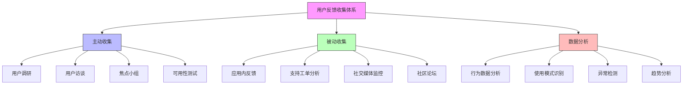

在企业级统一身份治理平台的持续运营中，收集用户反馈和度量成功指标是优化产品、提升用户体验和证明投资价值的关键环节。本文将深入探讨如何建立有效的反馈收集机制和科学的度量体系，为平台的持续改进提供数据支撑。

## 引言

统一身份治理平台的成功不仅体现在技术实现上，更体现在用户的实际使用效果和满意度上。通过系统性地收集用户反馈和度量关键成功指标，可以及时发现问题、识别改进机会，并向管理层展示平台的价值和投资回报。

## 用户反馈收集机制

### 多维度反馈渠道

建立全方位的用户反馈收集渠道，确保能够获取不同层面的用户声音：



### 反馈收集系统实现

```java
public class FeedbackCollectionSystem {
    private final FeedbackService feedbackService;
    private final AnalyticsService analyticsService;
    private final NotificationService notificationService;
    
    // 用户反馈收集
    public class FeedbackCollector {
        
        // 应用内反馈收集
        public void setupInAppFeedback() {
            // 在关键用户接触点添加反馈按钮
            FeedbackButton authSuccessButton = new FeedbackButton();
            authSuccessButton.setPosition("TOP_RIGHT");
            authSuccessButton.setTriggerEvent("AUTH_SUCCESS");
            authSuccessButton.setPrompt("登录成功！您对本次登录体验满意吗？");
            
            FeedbackButton authFailureButton = new FeedbackButton();
            authFailureButton.setPosition("TOP_RIGHT");
            authFailureButton.setTriggerEvent("AUTH_FAILURE");
            authFailureButton.setPrompt("登录遇到问题？请告诉我们您的体验。");
            
            // 配置反馈表单
            FeedbackForm form = new FeedbackForm();
            form.setFields(Arrays.asList(
                new FeedbackField("satisfaction", "整体满意度", FieldType.RATING_SCALE),
                new FeedbackField("ease_of_use", "易用性", FieldType.RATING_SCALE),
                new FeedbackField("speed", "速度", FieldType.RATING_SCALE),
                new FeedbackField("issues", "遇到的问题", FieldType.TEXT_AREA),
                new FeedbackField("suggestions", "改进建议", FieldType.TEXT_AREA),
                new FeedbackField("contact", "联系方式", FieldType.EMAIL)
            ));
            
            authSuccessButton.setForm(form);
            authFailureButton.setForm(form);
        }
        
        // 用户调研管理
        public Survey createUserExperienceSurvey() {
            Survey survey = new Survey();
            survey.setTitle("统一身份治理平台用户体验调研");
            survey.setDescription("帮助我们了解您的使用体验，持续改进平台");
            survey.setTargetAudience("ALL_USERS");
            survey.setFrequency("QUARTERLY");
            
            survey.setQuestions(Arrays.asList(
                new SurveyQuestion(
                    "overall_satisfaction",
                    "您对统一身份治理平台的整体满意度如何？",
                    QuestionType.RATING_SCALE,
                    true,
                    RatingScale.builder()
                        .min(1).max(5)
                        .labels(Arrays.asList("非常不满意", "不满意", "一般", "满意", "非常满意"))
                        .build()
                ),
                new SurveyQuestion(
                    "authentication_experience",
                    "您对登录认证体验的评价如何？",
                    QuestionType.RATING_SCALE,
                    true
                ),
                new SurveyQuestion(
                    "permission_management",
                    "您对权限管理功能的评价如何？",
                    QuestionType.RATING_SCALE,
                    true
                ),
                new SurveyQuestion(
                    "self_service",
                    "您对自助服务功能（如密码重置）的评价如何？",
                    QuestionType.RATING_SCALE,
                    true
                ),
                new SurveyQuestion(
                    "most_valuable_feature",
                    "您认为最有价值的功能是什么？",
                    QuestionType.MULTIPLE_CHOICE,
                    true,
                    Arrays.asList(
                        "统一登录", "多因子认证", "权限管理", "自助服务", "审计功能", "其他"
                    )
                ),
                new SurveyQuestion(
                    "improvement_areas",
                    "您希望我们在哪些方面进行改进？",
                    QuestionType.CHECKBOX,
                    false,
                    Arrays.asList(
                        "界面设计", "功能完善", "性能提升", "文档完善", "培训支持", "其他"
                    )
                ),
                new SurveyQuestion(
                    "open_feedback",
                    "您还有什么其他建议或意见？",
                    QuestionType.LONG_TEXT,
                    false
                )
            ));
            
            return survey;
        }
        
        // 用户访谈安排
        public void scheduleUserInterviews() {
            // 识别目标用户群体
            List<UserSegment> targetSegments = Arrays.asList(
                new UserSegment("IT_ADMIN", "IT管理员", 20),
                new UserSegment("BUSINESS_USER", "业务用户", 50),
                new UserSegment("SECURITY_OFFICER", "安全人员", 10),
                new UserSegment("DEVELOPER", "开发人员", 20)
            );
            
            // 安排访谈时间
            for (UserSegment segment : targetSegments) {
                scheduleSegmentInterviews(segment);
            }
        }
    }
    
    // 反馈分析与处理
    public class FeedbackAnalyzer {
        
        // 分析反馈数据
        public FeedbackAnalysisReport analyzeFeedback(List<Feedback> feedbacks) {
            FeedbackAnalysisReport report = new FeedbackAnalysisReport();
            report.setAnalysisPeriod(LocalDate.now().minusMonths(3));
            
            // 计算满意度指标
            report.setSatisfactionMetrics(calculateSatisfactionMetrics(feedbacks));
            
            // 识别主要问题
            report.setTopIssues(identifyTopIssues(feedbacks));
            
            // 提取改进建议
            report.setImprovementSuggestions(extractSuggestions(feedbacks));
            
            // 分析用户群体差异
            report.setUserSegmentAnalysis(analyzeByUserSegments(feedbacks));
            
            // 趋势分析
            report.setTrendAnalysis(performTrendAnalysis(feedbacks));
            
            return report;
        }
        
        // 计算满意度指标
        private SatisfactionMetrics calculateSatisfactionMetrics(List<Feedback> feedbacks) {
            SatisfactionMetrics metrics = new SatisfactionMetrics();
            
            // 整体满意度
            double avgSatisfaction = feedbacks.stream()
                .mapToDouble(f -> f.getRating("satisfaction"))
                .average()
                .orElse(0.0);
            metrics.setOverallSatisfaction(avgSatisfaction);
            
            // 各维度满意度
            metrics.setAuthenticationSatisfaction(
                calculateAverageRating(feedbacks, "authentication_experience"));
            metrics.setPermissionManagementSatisfaction(
                calculateAverageRating(feedbacks, "permission_management"));
            metrics.setSelfServiceSatisfaction(
                calculateAverageRating(feedbacks, "self_service"));
            
            // 净推荐值(NPS)
            metrics.setNpsScore(calculateNpsScore(feedbacks));
            
            // 反馈响应率
            metrics.setResponseRate(calculateResponseRate(feedbacks));
            
            return metrics;
        }
        
        // 生成改进行动计划
        public ImprovementActionPlan generateActionPlan(FeedbackAnalysisReport report) {
            ImprovementActionPlan plan = new ImprovementActionPlan();
            plan.setCreatedAt(Instant.now());
            plan.setStatus(ActionPlanStatus.PLANNED);
            
            // 基于反馈生成改进项
            List<ImprovementItem> items = new ArrayList<>();
            
            // 处理低分项
            SatisfactionMetrics metrics = report.getSatisfactionMetrics();
            if (metrics.getOverallSatisfaction() < 4.0) {
                items.add(new ImprovementItem(
                    "提升整体用户满意度",
                    Priority.HIGH,
                    "根据用户反馈优化界面设计和操作流程",
                    Arrays.asList("UI/UX团队", "产品经理"),
                    LocalDate.now().plusWeeks(2)
                ));
            }
            
            // 处理具体建议
            for (String suggestion : report.getImprovementSuggestions()) {
                items.add(new ImprovementItem(
                    "实现用户建议功能",
                    Priority.MEDIUM,
                    suggestion,
                    Arrays.asList("产品经理", "开发团队"),
                    LocalDate.now().plusWeeks(4)
                ));
            }
            
            plan.setItems(items);
            return plan;
        }
    }
}
```

## 关键成功指标(KSM)设计

### 用量指标体系

```sql
-- 用户行为指标数据库设计
CREATE TABLE user_metrics (
    id VARCHAR(50) PRIMARY KEY,
    metric_name VARCHAR(100) NOT NULL,
    metric_type VARCHAR(50) NOT NULL,  -- USAGE, PERFORMANCE, SATISFACTION
    metric_value DECIMAL(10,2) NOT NULL,
    dimension JSON,  -- 维度信息，如用户类型、部门等
    time_period VARCHAR(20) NOT NULL,  -- DAILY, WEEKLY, MONTHLY
    date_key DATE NOT NULL,
    calculated_at TIMESTAMP DEFAULT CURRENT_TIMESTAMP,
    
    INDEX idx_metric_name (metric_name),
    INDEX idx_metric_type (metric_type),
    INDEX idx_time_period (time_period),
    INDEX idx_date_key (date_key)
);

-- 用户活跃度指标
CREATE TABLE user_engagement_metrics (
    id VARCHAR(50) PRIMARY KEY,
    date_key DATE NOT NULL,
    total_users INT NOT NULL,
    active_users INT NOT NULL,
    new_users INT NOT NULL,
    returning_users INT NOT NULL,
    login_frequency JSON,  -- 不同频率的用户分布
    feature_usage JSON,    -- 各功能使用情况
    session_duration_avg INT,  -- 平均会话时长（秒）
    session_count INT,     -- 会话总数
    calculated_at TIMESTAMP DEFAULT CURRENT_TIMESTAMP,
    
    INDEX idx_date_key (date_key)
);

-- 功能使用指标
CREATE TABLE feature_usage_metrics (
    id VARCHAR(50) PRIMARY KEY,
    date_key DATE NOT NULL,
    feature_name VARCHAR(100) NOT NULL,
    usage_count INT NOT NULL,
    unique_users INT NOT NULL,
    adoption_rate DECIMAL(5,4),  -- 采用率
    satisfaction_score DECIMAL(3,2),  -- 满意度评分
    calculated_at TIMESTAMP DEFAULT CURRENT_TIMESTAMP,
    
    INDEX idx_date_key (date_key),
    INDEX idx_feature_name (feature_name)
);

-- 性能指标
CREATE TABLE performance_metrics (
    id VARCHAR(50) PRIMARY KEY,
    date_key DATE NOT NULL,
    metric_type VARCHAR(50) NOT NULL,  -- AUTH_LATENCY, AUTH_SUCCESS_RATE, etc.
    metric_value DECIMAL(10,2) NOT NULL,
    min_value DECIMAL(10,2),
    max_value DECIMAL(10,2),
    avg_value DECIMAL(10,2),
    sample_count INT NOT NULL,
    calculated_at TIMESTAMP DEFAULT CURRENT_TIMESTAMP,
    
    INDEX idx_date_key (date_key),
    INDEX idx_metric_type (metric_type)
);

-- 创建综合指标视图
CREATE VIEW comprehensive_metrics_view AS
SELECT 
    ume.date_key,
    ume.total_users,
    ume.active_users,
    ROUND(ume.active_users * 100.0 / NULLIF(ume.total_users, 0), 2) as active_user_rate,
    ume.new_users,
    ume.returning_users,
    ume.session_duration_avg,
    ume.session_count,
    pm_auth.metric_value as auth_latency_avg,
    pm_auth_success.metric_value as auth_success_rate,
    pm_auth_failure.metric_value as auth_failure_rate,
    SUM(fum.adoption_rate * fum.unique_users) / NULLIF(SUM(fum.unique_users), 0) as overall_feature_adoption
FROM user_engagement_metrics ume
LEFT JOIN performance_metrics pm_auth 
    ON ume.date_key = pm_auth.date_key 
    AND pm_auth.metric_type = 'AUTH_LATENCY_AVG'
LEFT JOIN performance_metrics pm_auth_success 
    ON ume.date_key = pm_auth_success.date_key 
    AND pm_auth_success.metric_type = 'AUTH_SUCCESS_RATE'
LEFT JOIN performance_metrics pm_auth_failure 
    ON ume.date_key = pm_auth_failure.date_key 
    AND pm_auth_failure.metric_type = 'AUTH_FAILURE_RATE'
LEFT JOIN feature_usage_metrics fum 
    ON ume.date_key = fum.date_key
WHERE ume.date_key > DATE_SUB(NOW(), INTERVAL 90 DAY)
GROUP BY ume.date_key, ume.total_users, ume.active_users, ume.new_users, 
         ume.returning_users, ume.session_duration_avg, ume.session_count,
         pm_auth.metric_value, pm_auth_success.metric_value, pm_auth_failure.metric_value
ORDER BY ume.date_key DESC;
```

### 用户满意度指标

```python
class UserSatisfactionMetrics:
    def __init__(self, metrics_service, feedback_service):
        self.metrics_service = metrics_service
        self.feedback_service = feedback_service
    
    def calculate_user_satisfaction_score(self):
        """计算综合用户满意度得分"""
        # 收集各类满意度数据
        survey_satisfaction = self._get_survey_satisfaction()
        support_satisfaction = self._get_support_satisfaction()
        usage_satisfaction = self._get_usage_satisfaction()
        performance_satisfaction = self._get_performance_satisfaction()
        
        # 加权计算综合得分
        weights = {
            'survey': 0.4,
            'support': 0.2,
            'usage': 0.2,
            'performance': 0.2
        }
        
        composite_score = (
            survey_satisfaction * weights['survey'] +
            support_satisfaction * weights['support'] +
            usage_satisfaction * weights['usage'] +
            performance_satisfaction * weights['performance']
        )
        
        return composite_score
    
    def _get_survey_satisfaction(self):
        """获取调研满意度"""
        recent_surveys = self.feedback_service.get_recent_surveys(days=90)
        if not recent_surveys:
            return 0.0
        
        total_responses = sum(len(survey.responses) for survey in recent_surveys)
        if total_responses == 0:
            return 0.0
        
        weighted_sum = 0
        response_count = 0
        
        for survey in recent_surveys:
            for response in survey.responses:
                # 假设满意度评分在1-5之间
                satisfaction_score = response.get_rating('overall_satisfaction', 0)
                weighted_sum += satisfaction_score
                response_count += 1
        
        return weighted_sum / response_count if response_count > 0 else 0.0
    
    def _get_support_satisfaction(self):
        """获取支持满意度"""
        recent_tickets = self.feedback_service.get_recent_support_tickets(days=90)
        if not recent_tickets:
            return 0.0
        
        resolved_tickets = [t for t in recent_tickets if t.status == 'RESOLVED']
        if not resolved_tickets:
            return 0.0
        
        # 计算解决时间和用户反馈
        satisfaction_sum = 0
        valid_tickets = 0
        
        for ticket in resolved_tickets:
            # 基于解决时间和用户反馈计算满意度
            resolution_time_satisfaction = self._calculate_resolution_time_satisfaction(ticket)
            user_feedback_satisfaction = self._get_ticket_user_feedback(ticket)
            
            if resolution_time_satisfaction is not None and user_feedback_satisfaction is not None:
                # 综合两个因素
                combined_satisfaction = (resolution_time_satisfaction + user_feedback_satisfaction) / 2
                satisfaction_sum += combined_satisfaction
                valid_tickets += 1
        
        return satisfaction_sum / valid_tickets if valid_tickets > 0 else 0.0
    
    def _calculate_resolution_time_satisfaction(self, ticket):
        """基于解决时间计算满意度"""
        if not ticket.resolution_time_minutes:
            return None
        
        # 假设SLA为240分钟（4小时）
        sla_minutes = 240
        
        if ticket.resolution_time_minutes <= sla_minutes:
            # 在SLA内解决，满意度较高
            return 5.0 - (ticket.resolution_time_minutes / sla_minutes) * 2.0
        else:
            # 超过SLA，满意度递减
            overtime_factor = ticket.resolution_time_minutes / sla_minutes
            return max(1.0, 3.0 / overtime_factor)
    
    def _get_ticket_user_feedback(self, ticket):
        """获取工单用户反馈"""
        feedback = getattr(ticket, 'user_satisfaction_rating', None)
        return float(feedback) if feedback else None
    
    def _get_usage_satisfaction(self):
        """基于使用行为计算满意度"""
        # 获取用户使用数据
        usage_data = self.metrics_service.get_user_usage_data(days=30)
        
        if not usage_data:
            return 0.0
        
        satisfaction_scores = []
        
        for user_data in usage_data:
            # 基于使用频率和功能采用率计算满意度
            login_frequency_score = self._calculate_login_frequency_score(user_data.login_count)
            feature_adoption_score = self._calculate_feature_adoption_score(user_data.adopted_features)
            
            # 综合得分
            user_satisfaction = (login_frequency_score + feature_adoption_score) / 2
            satisfaction_scores.append(user_satisfaction)
        
        return sum(satisfaction_scores) / len(satisfaction_scores) if satisfaction_scores else 0.0
    
    def _calculate_login_frequency_score(self, login_count):
        """基于登录频率计算满意度得分"""
        if login_count >= 20:  # 每月20次以上
            return 5.0
        elif login_count >= 10:  # 每月10-19次
            return 4.0
        elif login_count >= 5:   # 每月5-9次
            return 3.0
        elif login_count >= 1:   # 每月1-4次
            return 2.0
        else:  # 很少使用
            return 1.0
    
    def _calculate_feature_adoption_score(self, adopted_features):
        """基于功能采用率计算满意度得分"""
        total_features = 10  # 假设总共有10个主要功能
        adoption_rate = len(adopted_features) / total_features
        
        if adoption_rate >= 0.8:
            return 5.0
        elif adoption_rate >= 0.6:
            return 4.0
        elif adoption_rate >= 0.4:
            return 3.0
        elif adoption_rate >= 0.2:
            return 2.0
        else:
            return 1.0
```

## 度量仪表板设计

### 综合度量展示

```javascript
// 用户满意度和度量仪表板
class MetricsDashboard {
  constructor(metricsService, visualizationService) {
    this.metricsService = metricsService;
    this.visualizationService = visualizationService;
    this.dashboardContainer = null;
  }
  
  // 初始化仪表板
  init(containerId) {
    this.dashboardContainer = document.getElementById(containerId);
    this.renderDashboard();
    this.setupRealTimeUpdates();
  }
  
  // 渲染仪表板
  async renderDashboard() {
    // 创建仪表板布局
    const layout = this.createDashboardLayout();
    this.dashboardContainer.appendChild(layout);
    
    // 渲染各个指标组件
    await this.renderKeyMetrics();
    await this.renderTrendCharts();
    await this.renderSatisfactionScores();
    await this.renderUserSegments();
  }
  
  // 创建仪表板布局
  createDashboardLayout() {
    const dashboard = document.createElement('div');
    dashboard.className = 'metrics-dashboard';
    
    dashboard.innerHTML = `
      <div class="dashboard-header">
        <h1>用户满意度与度量仪表板</h1>
        <div class="time-controls">
          <select id="time-range">
            <option value="7d">最近7天</option>
            <option value="30d" selected>最近30天</option>
            <option value="90d">最近90天</option>
          </select>
          <button id="refresh-btn">刷新</button>
        </div>
      </div>
      
      <div class="dashboard-grid">
        <div class="grid-item key-metrics">
          <div class="panel-header">
            <h2>关键指标</h2>
          </div>
          <div id="key-metrics-content"></div>
        </div>
        
        <div class="grid-item trend-charts">
          <div class="panel-header">
            <h2>趋势图表</h2>
          </div>
          <div id="trend-charts-content"></div>
        </div>
        
        <div class="grid-item satisfaction-scores">
          <div class="panel-header">
            <h2>满意度得分</h2>
          </div>
          <div id="satisfaction-scores-content"></div>
        </div>
        
        <div class="grid-item user-segments">
          <div class="panel-header">
            <h2>用户群体分析</h2>
          </div>
          <div id="user-segments-content"></div>
        </div>
      </div>
    `;
    
    return dashboard;
  }
  
  // 渲染关键指标
  async renderKeyMetrics() {
    const metrics = await this.metricsService.getKeyMetrics();
    const container = document.getElementById('key-metrics-content');
    
    container.innerHTML = `
      <div class="metrics-grid">
        <div class="metric-card">
          <div class="metric-value">${metrics.activeUsers.toLocaleString()}</div>
          <div class="metric-label">活跃用户数</div>
          <div class="metric-trend ${metrics.activeUsersTrend >= 0 ? 'up' : 'down'}">
            ${metrics.activeUsersTrend >= 0 ? '↑' : '↓'} ${Math.abs(metrics.activeUsersTrend)}%
          </div>
        </div>
        
        <div class="metric-card">
          <div class="metric-value">${metrics.satisfactionScore.toFixed(1)}/5.0</div>
          <div class="metric-label">用户满意度</div>
          <div class="metric-trend ${metrics.satisfactionTrend >= 0 ? 'up' : 'down'}">
            ${metrics.satisfactionTrend >= 0 ? '↑' : '↓'} ${Math.abs(metrics.satisfactionTrend)}%
          </div>
        </div>
        
        <div class="metric-card">
          <div class="metric-value">${metrics.featureAdoptionRate.toFixed(1)}%</div>
          <div class="metric-label">功能采用率</div>
          <div class="metric-trend ${metrics.adoptionTrend >= 0 ? 'up' : 'down'}">
            ${metrics.adoptionTrend >= 0 ? '↑' : '↓'} ${Math.abs(metrics.adoptionTrend)}%
          </div>
        </div>
        
        <div class="metric-card">
          <div class="metric-value">${metrics.authSuccessRate.toFixed(2)}%</div>
          <div class="metric-label">认证成功率</div>
          <div class="metric-trend ${metrics.authSuccessTrend >= 0 ? 'up' : 'down'}">
            ${metrics.authSuccessTrend >= 0 ? '↑' : '↓'} ${Math.abs(metrics.authSuccessTrend)}%
          </div>
        </div>
      </div>
    `;
  }
  
  // 渲染趋势图表
  async renderTrendCharts() {
    const trendData = await this.metricsService.getTrendData();
    const container = document.getElementById('trend-charts-content');
    
    // 渲染用户活跃度趋势
    const activeUsersChart = this.visualizationService.createLineChart(
      'active-users-trend',
      trendData.activeUsers,
      {
        title: '用户活跃度趋势',
        yAxisLabel: '活跃用户数',
        isAreaChart: true
      }
    );
    
    // 渲染满意度趋势
    const satisfactionChart = this.visualizationService.createLineChart(
      'satisfaction-trend',
      trendData.satisfaction,
      {
        title: '用户满意度趋势',
        yAxisLabel: '满意度得分',
        threshold: 4.0
      }
    );
    
    container.innerHTML = `
      <div class="charts-container">
        <div class="chart-wrapper">
          ${activeUsersChart.outerHTML}
        </div>
        <div class="chart-wrapper">
          ${satisfactionChart.outerHTML}
        </div>
      </div>
    `;
  }
  
  // 渲染满意度得分详情
  async renderSatisfactionScores() {
    const satisfactionData = await this.metricsService.getSatisfactionDetails();
    const container = document.getElementById('satisfaction-scores-content');
    
    const scoresHtml = satisfactionData.scores.map(score => `
      <div class="satisfaction-item">
        <div class="score-label">${score.label}</div>
        <div class="score-value">
          <span class="score-number">${score.value.toFixed(1)}</span>
          <span class="score-max">/5.0</span>
        </div>
        <div class="score-bar">
          <div class="score-fill" style="width: ${(score.value / 5.0) * 100}%"></div>
        </div>
      </div>
    `).join('');
    
    container.innerHTML = `
      <div class="satisfaction-scores-list">
        ${scoresHtml}
      </div>
      
      <div class="nps-section">
        <div class="nps-header">
          <h3>净推荐值 (NPS)</h3>
          <div class="nps-score">${satisfactionData.nps.score}</div>
        </div>
        <div class="nps-breakdown">
          <div class="nps-category promoters">
            <div class="category-label">推荐者</div>
            <div class="category-value">${satisfactionData.nps.promoters}%</div>
          </div>
          <div class="nps-category passives">
            <div class="category-label">被动者</div>
            <div class="category-value">${satisfactionData.nps.passives}%</div>
          </div>
          <div class="nps-category detractors">
            <div class="category-label">批评者</div>
            <div class="category-value">${satisfactionData.nps.detractors}%</div>
          </div>
        </div>
      </div>
    `;
  }
}
```

## 持续改进机制

### 反馈闭环管理

```java
public class ContinuousImprovementSystem {
    private final FeedbackService feedbackService;
    private final ImprovementService improvementService;
    private final MetricsService metricsService;
    private final NotificationService notificationService;
    
    // 持续改进循环
    public class ImprovementLoop {
        
        // 启动改进循环
        public void startImprovementCycle() {
            // 1. 收集反馈
            List<Feedback> feedbacks = feedbackService.collectRecentFeedback(30);
            
            // 2. 分析反馈
            FeedbackAnalysisReport analysis = feedbackService.analyzeFeedback(feedbacks);
            
            // 3. 生成改进行动计划
            ImprovementActionPlan actionPlan = generateActionPlan(analysis);
            
            // 4. 执行改进
            executeImprovements(actionPlan);
            
            // 5. 监控效果
            monitorImprovementEffectiveness(actionPlan);
            
            // 6. 循环迭代
            scheduleNextCycle();
        }
        
        // 生成改进行动计划
        private ImprovementActionPlan generateActionPlan(FeedbackAnalysisReport analysis) {
            ImprovementActionPlan plan = new ImprovementActionPlan();
            plan.setAnalysisReport(analysis);
            plan.setCreatedAt(Instant.now());
            plan.setStatus(ActionPlanStatus.PLANNED);
            
            // 基于分析结果生成具体改进项
            List<ImprovementItem> items = new ArrayList<>();
            
            // 处理主要问题
            for (Issue issue : analysis.getTopIssues()) {
                ImprovementItem item = new ImprovementItem();
                item.setTitle("解决" + issue.getDescription());
                item.setDescription(issue.getDetails());
                item.setPriority(determinePriority(issue));
                item.setExpectedImpact(issue.getImpactLevel());
                item.setTargetCompletionDate(LocalDate.now().plusWeeks(2));
                item.setAssignedTeams(determineResponsibleTeams(issue));
                
                items.add(item);
            }
            
            // 处理用户建议
            for (String suggestion : analysis.getImprovementSuggestions()) {
                ImprovementItem item = new ImprovementItem();
                item.setTitle("实现用户建议");
                item.setDescription(suggestion);
                item.setPriority(Priority.MEDIUM);
                item.setExpectedImpact("MEDIUM");
                item.setTargetCompletionDate(LocalDate.now().plusWeeks(4));
                item.setAssignedTeams(Arrays.asList("产品团队", "开发团队"));
                
                items.add(item);
            }
            
            plan.setItems(items);
            return improvementService.saveActionPlan(plan);
        }
        
        // 执行改进
        private void executeImprovements(ImprovementActionPlan actionPlan) {
            for (ImprovementItem item : actionPlan.getItems()) {
                // 更新状态
                item.setStatus(ImprovementStatus.IN_PROGRESS);
                improvementService.updateImprovementItem(item);
                
                // 通知相关人员
                notificationService.sendImprovementNotification(item);
                
                // 跟踪进度
                trackImprovementProgress(item);
            }
        }
        
        // 监控改进效果
        private void monitorImprovementEffectiveness(ImprovementActionPlan actionPlan) {
            // 设置监控指标
            List<ImprovementMetric> metrics = setupMonitoringMetrics(actionPlan);
            
            // 定期检查效果
            scheduleEffectivenessCheck(metrics, actionPlan);
        }
        
        // 设置监控指标
        private List<ImprovementMetric> setupMonitoringMetrics(ImprovementActionPlan actionPlan) {
            List<ImprovementMetric> metrics = new ArrayList<>();
            
            for (ImprovementItem item : actionPlan.getItems()) {
                // 根据改进项类型设置相应的监控指标
                if (item.getTitle().contains("认证")) {
                    metrics.add(new ImprovementMetric(
                        "AUTH_SUCCESS_RATE",
                        "认证成功率",
                        item.getId(),
                        MetricType.PERCENTAGE
                    ));
                    metrics.add(new ImprovementMetric(
                        "AUTH_LATENCY",
                        "认证延迟",
                        item.getId(),
                        MetricType.DURATION
                    ));
                } else if (item.getTitle().contains("权限")) {
                    metrics.add(new ImprovementMetric(
                        "PERMISSION_MANAGEMENT_TIME",
                        "权限管理耗时",
                        item.getId(),
                        MetricType.DURATION
                    ));
                }
                
                // 用户满意度指标
                metrics.add(new ImprovementMetric(
                    "USER_SATISFACTION",
                    "用户满意度",
                    item.getId(),
                    MetricType.RATING
                ));
            }
            
            return metrics;
        }
    }
}
```

## 总结

收集反馈与度量成功是统一身份治理平台持续改进和价值证明的核心环节。通过建立完善的反馈收集机制、设计科学的度量指标体系和实施持续改进循环，可以不断提升用户体验，优化产品功能，并向管理层展示平台的投资价值。

关键要点包括：

1. **反馈收集**：建立多维度的反馈渠道，包括主动调研和被动收集
2. **度量体系**：设计涵盖用量、性能和满意度的综合指标体系
3. **持续改进**：建立反馈分析、改进行动和效果监控的闭环机制

在后续章节中，我们将继续探讨版本管理与迭代规划等重要内容，为构建完整的企业级身份治理解决方案提供全面指导。