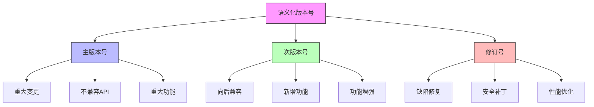

在企业级统一身份治理平台的持续发展过程中，科学的版本管理和系统的迭代规划是确保平台持续演进、满足不断变化的业务需求的关键。通过建立规范的版本控制体系和清晰的迭代规划流程，可以有效协调开发资源，控制发布风险，并确保平台功能的持续优化和创新。

## 引言

统一身份治理平台作为一个复杂的系统，需要在保持稳定性的前提下持续进行功能增强和性能优化。版本管理不仅涉及代码的版本控制，还包括功能规划、发布策略、回滚机制等多个方面。迭代规划则需要平衡业务需求、技术债务、用户反馈和资源约束，制定切实可行的开发计划。

## 版本管理体系

### 版本号规范

采用语义化版本控制(SemVer)规范，确保版本号能够清晰表达变更的性质和影响：



### 版本控制实现

```java
public class VersionManagementSystem {
    private final ReleaseService releaseService;
    private final ChangeManagementService changeManagementService;
    private final DeploymentService deploymentService;
    
    // 版本号模型
    public class SemanticVersion {
        private int major;
        private int minor;
        private int patch;
        private String preRelease;
        private String buildMetadata;
        
        // 构造函数
        public SemanticVersion(int major, int minor, int patch) {
            this.major = major;
            this.minor = minor;
            this.patch = patch;
        }
        
        // 解析版本字符串
        public static SemanticVersion parse(String versionString) {
            // 实现版本字符串解析逻辑
            String[] parts = versionString.split("[.-]");
            if (parts.length < 3) {
                throw new IllegalArgumentException("Invalid version format: " + versionString);
            }
            
            int major = Integer.parseInt(parts[0]);
            int minor = Integer.parseInt(parts[1]);
            int patch = Integer.parseInt(parts[2]);
            
            SemanticVersion version = new SemanticVersion(major, minor, patch);
            
            // 处理预发布版本和构建元数据
            if (versionString.contains("-")) {
                String[] versionParts = versionString.split("-");
                if (versionParts.length > 1) {
                    version.setPreRelease(versionParts[1]);
                }
            }
            
            if (versionString.contains("+")) {
                String[] versionParts = versionString.split("\\+");
                if (versionParts.length > 1) {
                    version.setBuildMetadata(versionParts[1]);
                }
            }
            
            return version;
        }
        
        // 版本比较
        public int compareTo(SemanticVersion other) {
            if (this.major != other.major) {
                return Integer.compare(this.major, other.major);
            }
            if (this.minor != other.minor) {
                return Integer.compare(this.minor, other.minor);
            }
            if (this.patch != other.patch) {
                return Integer.compare(this.patch, other.patch);
            }
            // 预发布版本的比较逻辑
            return comparePreRelease(other);
        }
        
        // 转换为字符串
        @Override
        public String toString() {
            StringBuilder version = new StringBuilder();
            version.append(major).append(".").append(minor).append(".").append(patch);
            
            if (preRelease != null && !preRelease.isEmpty()) {
                version.append("-").append(preRelease);
            }
            
            if (buildMetadata != null && !buildMetadata.isEmpty()) {
                version.append("+").append(buildMetadata);
            }
            
            return version.toString();
        }
    }
    
    // 发布计划模型
    public class ReleasePlan {
        private String id;
        private SemanticVersion version;
        private ReleaseType type;
        private String title;
        private String description;
        private List<ReleaseItem> items;
        private LocalDateTime plannedReleaseDate;
        private LocalDateTime actualReleaseDate;
        private ReleaseStatus status;
        private List<Risk> risks;
        private List<Milestone> milestones;
        private String releaseNotes;
        private List<DeploymentEnvironment> deploymentEnvironments;
    }
    
    // 发布类型枚举
    public enum ReleaseType {
        MAJOR("主版本", "包含重大功能和不兼容变更"),
        MINOR("次版本", "包含向后兼容的新功能"),
        PATCH("修订版本", "包含缺陷修复和安全补丁");
        
        private final String name;
        private final String description;
        
        ReleaseType(String name, String description) {
            this.name = name;
            this.description = description;
        }
        
        public String getName() {
            return name;
        }
        
        public String getDescription() {
            return description;
        }
    }
    
    // 创建发布计划
    public ReleasePlan createReleasePlan(ReleasePlanRequest request) {
        ReleasePlan plan = new ReleasePlan();
        plan.setId(generateReleasePlanId());
        plan.setVersion(request.getVersion());
        plan.setType(determineReleaseType(request.getVersion()));
        plan.setTitle(request.getTitle());
        plan.setDescription(request.getDescription());
        plan.setItems(request.getItems());
        plan.setPlannedReleaseDate(request.getPlannedReleaseDate());
        plan.setStatus(ReleaseStatus.PLANNING);
        plan.setRisks(new ArrayList<>());
        plan.setMilestones(new ArrayList<>());
        plan.setDeploymentEnvironments(request.getDeploymentEnvironments());
        
        // 保存发布计划
        releaseService.saveReleasePlan(plan);
        
        // 记录变更日志
        changeManagementService.logReleasePlanCreation(plan);
        
        return plan;
    }
    
    // 确定发布类型
    private ReleaseType determineReleaseType(SemanticVersion version) {
        if (version.getMajor() > 0) {
            return ReleaseType.MAJOR;
        } else if (version.getMinor() > 0) {
            return ReleaseType.MINOR;
        } else {
            return ReleaseType.PATCH;
        }
    }
    
    // 版本发布流程
    public class ReleaseProcess {
        
        // 执行发布
        public ReleaseResult executeRelease(ReleasePlan plan) {
            try {
                // 1. 预发布检查
                PreReleaseCheckResult preCheckResult = performPreReleaseChecks(plan);
                if (!preCheckResult.isPassed()) {
                    return ReleaseResult.failure("预发布检查失败: " + preCheckResult.getFailureReason());
                }
                
                // 2. 代码冻结
                codeFreeze(plan);
                
                // 3. 构建发布版本
                BuildResult buildResult = buildReleaseVersion(plan);
                if (!buildResult.isSuccess()) {
                    return ReleaseResult.failure("构建失败: " + buildResult.getErrorMessage());
                }
                
                // 4. 执行测试
                TestResult testResult = executeReleaseTesting(plan);
                if (!testResult.isPassed()) {
                    return ReleaseResult.failure("测试失败: " + testResult.getFailureReason());
                }
                
                // 5. 部署到预发布环境
                DeploymentResult preReleaseResult = deployToPreRelease(plan);
                if (!preReleaseResult.isSuccess()) {
                    return ReleaseResult.failure("预发布部署失败: " + preReleaseResult.getErrorMessage());
                }
                
                // 6. 预发布验证
                ValidationResult validationResult = validatePreRelease(plan);
                if (!validationResult.isValid()) {
                    return ReleaseResult.failure("预发布验证失败: " + validationResult.getValidationError());
                }
                
                // 7. 部署到生产环境
                DeploymentResult productionResult = deployToProduction(plan);
                if (!productionResult.isSuccess()) {
                    return ReleaseResult.failure("生产环境部署失败: " + productionResult.getErrorMessage());
                }
                
                // 8. 发布后验证
                PostReleaseValidationResult postValidationResult = validatePostRelease(plan);
                if (!postValidationResult.isValid()) {
                    return ReleaseResult.failure("发布后验证失败: " + postValidationResult.getValidationError());
                }
                
                // 9. 更新发布状态
                plan.setActualReleaseDate(LocalDateTime.now());
                plan.setStatus(ReleaseStatus.RELEASED);
                releaseService.updateReleasePlan(plan);
                
                // 10. 发送发布通知
                notificationService.sendReleaseNotification(plan);
                
                // 11. 生成发布说明
                generateReleaseNotes(plan);
                
                return ReleaseResult.success("版本发布成功", plan.getVersion().toString());
                
            } catch (Exception e) {
                // 记录错误并回滚
                logReleaseError(plan, e);
                rollbackRelease(plan);
                
                return ReleaseResult.failure("发布过程中发生错误: " + e.getMessage());
            }
        }
        
        // 预发布检查
        private PreReleaseCheckResult performPreReleaseChecks(ReleasePlan plan) {
            PreReleaseCheckResult result = new PreReleaseCheckResult();
            
            // 检查代码质量
            CodeQualityReport codeQuality = codeAnalysisService.analyzeCodeQuality();
            if (codeQuality.getIssues().size() > 0) {
                result.setPassed(false);
                result.setFailureReason("代码质量问题: " + codeQuality.getIssues().size() + " 个问题");
                return result;
            }
            
            // 检查测试覆盖率
            double coverage = testService.getTestCoverage();
            if (coverage < 0.8) {  // 80%覆盖率要求
                result.setPassed(false);
                result.setFailureReason("测试覆盖率不足: " + coverage);
                return result;
            }
            
            // 检查安全扫描结果
            SecurityScanResult securityScan = securityService.performSecurityScan();
            if (!securityScan.isPassed()) {
                result.setPassed(false);
                result.setFailureReason("安全扫描失败: " + securityScan.getVulnerabilities().size() + " 个漏洞");
                return result;
            }
            
            result.setPassed(true);
            return result;
        }
    }
}
```

### 版本分支策略

```sql
-- 版本管理数据库设计
CREATE TABLE release_plans (
    id VARCHAR(50) PRIMARY KEY,
    version_string VARCHAR(20) NOT NULL,
    release_type VARCHAR(20) NOT NULL,  -- MAJOR, MINOR, PATCH
    title VARCHAR(200) NOT NULL,
    description TEXT,
    planned_release_date TIMESTAMP NOT NULL,
    actual_release_date TIMESTAMP NULL,
    status VARCHAR(20) DEFAULT 'PLANNING',  -- PLANNING, DEVELOPING, TESTING, RELEASED, CANCELLED
    release_notes TEXT,
    created_at TIMESTAMP DEFAULT CURRENT_TIMESTAMP,
    updated_at TIMESTAMP DEFAULT CURRENT_TIMESTAMP ON UPDATE CURRENT_TIMESTAMP,
    
    INDEX idx_version (version_string),
    INDEX idx_release_type (release_type),
    INDEX idx_status (status),
    INDEX idx_planned_date (planned_release_date)
);

-- 发布项表
CREATE TABLE release_items (
    id VARCHAR(50) PRIMARY KEY,
    release_plan_id VARCHAR(50) NOT NULL,
    item_type VARCHAR(20) NOT NULL,  -- FEATURE, BUG_FIX, IMPROVEMENT
    title VARCHAR(200) NOT NULL,
    description TEXT,
    priority VARCHAR(20) DEFAULT 'MEDIUM',  -- LOW, MEDIUM, HIGH, CRITICAL
    estimated_effort INT,  -- 估算工作量（人天）
    status VARCHAR(20) DEFAULT 'PLANNED',  -- PLANNED, IN_PROGRESS, COMPLETED, CANCELLED
    assigned_to VARCHAR(50),
    created_at TIMESTAMP DEFAULT CURRENT_TIMESTAMP,
    updated_at TIMESTAMP DEFAULT CURRENT_TIMESTAMP ON UPDATE CURRENT_TIMESTAMP,
    
    FOREIGN KEY (release_plan_id) REFERENCES release_plans(id),
    INDEX idx_release_plan (release_plan_id),
    INDEX idx_priority (priority),
    INDEX idx_status (status),
    INDEX idx_item_type (item_type)
);

-- 版本分支表
CREATE TABLE version_branches (
    id VARCHAR(50) PRIMARY KEY,
    release_plan_id VARCHAR(50) NOT NULL,
    branch_name VARCHAR(100) NOT NULL,
    branch_type VARCHAR(20) NOT NULL,  -- MAIN, DEVELOP, RELEASE, HOTFIX
    base_commit VARCHAR(50),
    head_commit VARCHAR(50),
    created_at TIMESTAMP DEFAULT CURRENT_TIMESTAMP,
    merged_at TIMESTAMP NULL,
    status VARCHAR(20) DEFAULT 'ACTIVE',  -- ACTIVE, MERGED, ARCHIVED
    
    FOREIGN KEY (release_plan_id) REFERENCES release_plans(id),
    INDEX idx_release_plan (release_plan_id),
    INDEX idx_branch_type (branch_type),
    INDEX idx_status (status)
);

-- 部署记录表
CREATE TABLE deployment_records (
    id VARCHAR(50) PRIMARY KEY,
    release_plan_id VARCHAR(50) NOT NULL,
    environment VARCHAR(50) NOT NULL,  -- DEV, TEST, PRE_PROD, PROD
    deployment_type VARCHAR(20) NOT NULL,  -- INITIAL, ROLLBACK, HOTFIX
    version_string VARCHAR(20) NOT NULL,
    deployed_at TIMESTAMP DEFAULT CURRENT_TIMESTAMP,
    deployed_by VARCHAR(50),
    status VARCHAR(20) DEFAULT 'IN_PROGRESS',  -- IN_PROGRESS, SUCCESS, FAILED, ROLLED_BACK
    rollback_reason TEXT,
    
    FOREIGN KEY (release_plan_id) REFERENCES release_plans(id),
    INDEX idx_environment (environment),
    INDEX idx_status (status),
    INDEX idx_deployed_at (deployed_at)
);

-- 创建版本统计视图
CREATE VIEW release_statistics AS
SELECT 
    rp.release_type,
    COUNT(*) as total_releases,
    COUNT(CASE WHEN rp.status = 'RELEASED' THEN 1 END) as successful_releases,
    AVG(TIMESTAMPDIFF(DAY, rp.planned_release_date, rp.actual_release_date)) as avg_release_delay_days,
    MAX(rp.actual_release_date) as last_release_date,
    COUNT(ri.id) as total_items,
    COUNT(CASE WHEN ri.status = 'COMPLETED' THEN 1 END) as completed_items
FROM release_plans rp
LEFT JOIN release_items ri ON rp.id = ri.release_plan_id
WHERE rp.created_at > DATE_SUB(NOW(), INTERVAL 12 MONTH)
GROUP BY rp.release_type;
```

## 迭代规划流程

### 需求收集与优先级排序

```python
class IterationPlanningSystem:
    def __init__(self, backlog_service, estimation_service, resource_service):
        self.backlog_service = backlog_service
        self.estimation_service = estimation_service
        self.resource_service = resource_service
        self.iterations = {}
    
    # 迭代模型
    class Iteration:
        def __init__(self, iteration_id, config):
            self.id = iteration_id
            self.name = config['name']
            self.goal = config['goal']
            self.start_date = config['start_date']
            self.end_date = config['end_date']
            self.duration = (self.end_date - self.start_date).days
            self.team_capacity = config['team_capacity']  # 团队容量（人天）
            self.items = []
            self.status = 'PLANNING'
            self.risks = []
            self.dependencies = []
    
    # 需求收集
    def collect_requirements(self):
        """收集需求"""
        requirements = []
        
        # 1. 用户反馈
        user_feedback = self._collect_user_feedback()
        requirements.extend(user_feedback)
        
        # 2. 业务需求
        business_requirements = self._collect_business_requirements()
        requirements.extend(business_requirements)
        
        # 3. 技术债务
        tech_debt = self._collect_technical_debt()
        requirements.extend(tech_debt)
        
        # 4. 安全合规需求
        compliance_requirements = self._collect_compliance_requirements()
        requirements.extend(compliance_requirements)
        
        return requirements
    
    # 收集用户反馈
    def _collect_user_feedback(self):
        """收集用户反馈需求"""
        feedback_items = []
        
        # 获取高优先级反馈
        high_priority_feedback = self.backlog_service.get_high_priority_feedback()
        
        for feedback in high_priority_feedback:
            item = {
                'id': f"FEEDBACK-{feedback['id']}",
                'type': 'FEATURE' if feedback['type'] == 'FEATURE_REQUEST' else 'BUG_FIX',
                'title': feedback['title'],
                'description': feedback['description'],
                'source': 'USER_FEEDBACK',
                'priority': self._determine_feedback_priority(feedback),
                'effort': None,  # 待估算
                'business_value': self._calculate_feedback_business_value(feedback)
            }
            feedback_items.append(item)
        
        return feedback_items
    
    # 确定反馈优先级
    def _determine_feedback_priority(self, feedback):
        """确定反馈优先级"""
        # 基于反馈类型、投票数、影响用户数等因素确定优先级
        score = 0
        
        # 反馈类型权重
        type_weights = {
            'BUG_REPORT': 10,
            'FEATURE_REQUEST': 5,
            'USABILITY_ISSUE': 8,
            'PERFORMANCE_ISSUE': 7
        }
        score += type_weights.get(feedback['type'], 3)
        
        # 投票数权重
        vote_count = feedback.get('vote_count', 0)
        score += min(vote_count, 50)  # 最多50分
        
        # 影响用户数权重
        affected_users = feedback.get('affected_users', 0)
        score += min(affected_users // 10, 20)  # 每10个用户1分，最多20分
        
        # 根据总分确定优先级
        if score >= 50:
            return 'CRITICAL'
        elif score >= 30:
            return 'HIGH'
        elif score >= 15:
            return 'MEDIUM'
        else:
            return 'LOW'
    
    # 需求优先级排序
    def prioritize_requirements(self, requirements):
        """需求优先级排序"""
        # 使用加权评分法进行排序
        for requirement in requirements:
            requirement['priority_score'] = self._calculate_priority_score(requirement)
        
        # 按优先级分数排序
        sorted_requirements = sorted(requirements, key=lambda x: x['priority_score'], reverse=True)
        
        return sorted_requirements
    
    # 计算优先级分数
    def _calculate_priority_score(self, requirement):
        """计算需求优先级分数"""
        score = 0
        
        # 业务价值权重 (40%)
        business_value = requirement.get('business_value', 0)
        score += business_value * 0.4
        
        # 技术复杂度权重 (20%)
        technical_complexity = requirement.get('technical_complexity', 5)  # 1-10分
        score += (11 - technical_complexity) * 0.2  # 复杂度越低分数越高
        
        # 用户影响权重 (25%)
        user_impact = requirement.get('user_impact', 0)  # 1-10分
        score += user_impact * 0.25
        
        # 战略重要性权重 (15%)
        strategic_importance = requirement.get('strategic_importance', 5)  # 1-10分
        score += strategic_importance * 0.15
        
        return score
    
    # 迭代规划
    def plan_iteration(self, iteration_config):
        """规划迭代"""
        iteration_id = self._generate_iteration_id()
        iteration = self.Iteration(iteration_id, iteration_config)
        
        # 收集需求
        requirements = self.collect_requirements()
        
        # 优先级排序
        prioritized_requirements = self.prioritize_requirements(requirements)
        
        # 估算工作量
        estimated_requirements = self._estimate_requirements(prioritized_requirements)
        
        # 根据团队容量选择需求
        selected_items = self._select_items_for_iteration(estimated_requirements, iteration.team_capacity)
        
        # 分配给迭代
        iteration.items = selected_items
        iteration.status = 'PLANNED'
        
        # 识别风险和依赖
        iteration.risks = self._identify_iteration_risks(selected_items)
        iteration.dependencies = self._identify_iteration_dependencies(selected_items)
        
        # 保存迭代计划
        self.iterations[iteration_id] = iteration
        self._save_iteration_plan(iteration)
        
        return iteration
    
    # 估算需求工作量
    def _estimate_requirements(self, requirements):
        """估算需求工作量"""
        for requirement in requirements:
            if requirement['effort'] is None:
                # 使用三点估算法
                estimate = self.estimation_service.three_point_estimate(
                    requirement['description'],
                    requirement['technical_complexity']
                )
                requirement['effort'] = estimate
                
                # 记录估算依据
                requirement['estimation_details'] = {
                    'method': 'THREE_POINT',
                    'optimistic': estimate.optimistic,
                    'most_likely': estimate.most_likely,
                    'pessimistic': estimate.pessimistic,
                    'estimated_by': estimate.estimated_by
                }
        
        return requirements
    
    # 选择迭代需求
    def _select_items_for_iteration(self, requirements, team_capacity):
        """根据团队容量选择迭代需求"""
        selected_items = []
        total_effort = 0
        
        for requirement in requirements:
            estimated_effort = requirement['effort']
            
            # 检查是否超出团队容量
            if total_effort + estimated_effort <= team_capacity * 0.8:  # 保留20%缓冲
                selected_items.append(requirement)
                total_effort += estimated_effort
            elif total_effort + estimated_effort <= team_capacity:
                # 如果加上这个需求刚好或略微超出容量，仍然可以考虑加入
                selected_items.append(requirement)
                total_effort += estimated_effort
                break
            else:
                # 超出容量，停止选择
                break
        
        return selected_items
```

### 迭代执行与跟踪

```javascript
// 迭代执行管理系统
class IterationExecutionSystem {
  constructor(iterationService, trackingService, communicationService) {
    this.iterationService = iterationService;
    this.trackingService = trackingService;
    this.communicationService = communicationService;
    this.activeIterations = new Map();
  }
  
  // 启动迭代
  startIteration(iterationId) {
    const iteration = this.iterationService.getIteration(iterationId);
    
    if (!iteration) {
      throw new Error(`迭代不存在: ${iterationId}`);
    }
    
    // 更新迭代状态
    iteration.status = 'IN_PROGRESS';
    iteration.started_at = new Date();
    
    // 创建迭代执行实例
    const execution = {
      iterationId: iterationId,
      startDate: new Date(),
      status: 'ACTIVE',
      progress: 0,
      completedItems: 0,
      totalItems: iteration.items.length,
      dailyStandups: [],
      blockers: []
    };
    
    // 保存执行状态
    this.activeIterations.set(iterationId, execution);
    
    // 通知团队成员
    this.notifyTeam(iteration, 'ITERATION_STARTED');
    
    // 启动每日站会提醒
    this.scheduleDailyStandups(iteration);
    
    // 记录迭代启动
    this.trackingService.logIterationEvent(iterationId, 'STARTED');
    
    return execution;
  }
  
  // 更新迭代进度
  updateIterationProgress(iterationId, itemId, status, notes) {
    const iteration = this.iterationService.getIteration(iterationId);
    const execution = this.activeIterations.get(iterationId);
    
    if (!iteration || !execution) {
      throw new Error(`迭代未激活: ${iterationId}`);
    }
    
    // 更新需求项状态
    const item = iteration.items.find(i => i.id === itemId);
    if (item) {
      item.status = status;
      item.updated_at = new Date();
      item.progress_notes = notes;
      
      // 记录进度更新
      this.trackingService.logItemProgress(itemId, status, notes);
    }
    
    // 重新计算迭代进度
    execution.completedItems = iteration.items.filter(i => i.status === 'COMPLETED').length;
    execution.progress = (execution.completedItems / execution.totalItems) * 100;
    
    // 检查是否完成
    if (execution.completedItems === execution.totalItems) {
      this.completeIteration(iterationId);
    }
    
    // 发送进度更新通知
    this.notifyProgressUpdate(iteration, item, status);
    
    return execution;
  }
  
  // 处理阻碍问题
  handleBlocker(iterationId, blockerInfo) {
    const execution = this.activeIterations.get(iterationId);
    
    if (!execution) {
      throw new Error(`迭代未激活: ${iterationId}`);
    }
    
    // 记录阻碍问题
    const blocker = {
      id: this.generateBlockerId(),
      ...blockerInfo,
      reported_at: new Date(),
      resolved_at: null,
      status: 'OPEN'
    };
    
    execution.blockers.push(blocker);
    
    // 通知相关人员
    this.notifyBlocker(iterationId, blocker);
    
    // 记录阻碍问题
    this.trackingService.logBlocker(blocker);
    
    return blocker;
  }
  
  // 解决阻碍问题
  resolveBlocker(iterationId, blockerId, resolution) {
    const execution = this.activeIterations.get(iterationId);
    
    if (!execution) {
      throw new Error(`迭代未激活: ${iterationId}`);
    }
    
    const blocker = execution.blockers.find(b => b.id === blockerId);
    if (blocker) {
      blocker.status = 'RESOLVED';
      blocker.resolved_at = new Date();
      blocker.resolution = resolution;
      
      // 发送解决通知
      this.notifyBlockerResolved(iterationId, blocker);
      
      // 记录解决
      this.trackingService.logBlockerResolution(blockerId, resolution);
    }
    
    return blocker;
  }
  
  // 每日站会
  conductDailyStandup(iterationId, standupInfo) {
    const execution = this.activeIterations.get(iterationId);
    
    if (!execution) {
      throw new Error(`迭代未激活: ${iterationId}`);
    }
    
    // 记录站会信息
    const standup = {
      id: this.generateStandupId(),
      date: new Date(),
      ...standupInfo
    };
    
    execution.dailyStandups.push(standup);
    
    // 分析站会内容，识别潜在问题
    this.analyzeStandupForIssues(iterationId, standupInfo);
    
    // 记录站会
    this.trackingService.logDailyStandup(standup);
    
    return standup;
  }
  
  // 完成迭代
  completeIteration(iterationId) {
    const iteration = this.iterationService.getIteration(iterationId);
    const execution = this.activeIterations.get(iterationId);
    
    if (!iteration || !execution) {
      throw new Error(`迭代未激活: ${iterationId}`);
    }
    
    // 更新迭代状态
    iteration.status = 'COMPLETED';
    iteration.completed_at = new Date();
    execution.status = 'COMPLETED';
    execution.endDate = new Date();
    
    // 生成迭代回顾报告
    const retrospective = this.generateIterationRetrospective(iterationId);
    
    // 通知团队
    this.notifyTeam(iteration, 'ITERATION_COMPLETED', { retrospective });
    
    // 记录完成
    this.trackingService.logIterationEvent(iterationId, 'COMPLETED');
    
    // 从活动迭代中移除
    this.activeIterations.delete(iterationId);
    
    return {
      iteration: iteration,
      execution: execution,
      retrospective: retrospective
    };
  }
  
  // 生成迭代回顾
  generateIterationRetrospective(iterationId) {
    const iteration = this.iterationService.getIteration(iterationId);
    const execution = this.activeIterations.get(iterationId);
    
    // 收集迭代数据
    const metrics = this.trackingService.getIterationMetrics(iterationId);
    const blockers = execution.blockers;
    const standups = execution.dailyStandups;
    
    // 分析结果
    const retrospective = {
      iterationId: iterationId,
      startDate: execution.startDate,
      endDate: new Date(),
      plannedItems: execution.totalItems,
      completedItems: execution.completedItems,
      completionRate: execution.progress,
      metrics: metrics,
      blockers: blockers,
      lessonsLearned: this.extractLessonsLearned(standups, blockers),
      improvementSuggestions: this.generateImprovementSuggestions(metrics, blockers)
    };
    
    return retrospective;
  }
  
  // 提取经验教训
  extractLessonsLearned(standups, blockers) {
    const lessons = [];
    
    // 从阻碍问题中提取
    blockers.forEach(blocker => {
      if (blocker.resolution) {
        lessons.push({
          type: 'BLOCKER_RESOLUTION',
          description: blocker.description,
          resolution: blocker.resolution,
          impact: blocker.impact
        });
      }
    });
    
    // 从站会中提取常见问题
    const commonIssues = this.identifyCommonIssues(standups);
    commonIssues.forEach(issue => {
      lessons.push({
        type: 'COMMON_ISSUE',
        description: issue.description,
        frequency: issue.frequency,
        suggestions: issue.suggestions
      });
    });
    
    return lessons;
  }
}
```

### 迭代回顾与改进

```sql
-- 迭代管理数据库设计
CREATE TABLE iterations (
    id VARCHAR(50) PRIMARY KEY,
    name VARCHAR(100) NOT NULL,
    goal TEXT,
    start_date TIMESTAMP NOT NULL,
    end_date TIMESTAMP NOT NULL,
    team_capacity INT NOT NULL,  -- 团队容量（人天）
    status VARCHAR(20) DEFAULT 'PLANNING',  -- PLANNING, IN_PROGRESS, COMPLETED, CANCELLED
    created_at TIMESTAMP DEFAULT CURRENT_TIMESTAMP,
    updated_at TIMESTAMP DEFAULT CURRENT_TIMESTAMP ON UPDATE CURRENT_TIMESTAMP,
    
    INDEX idx_status (status),
    INDEX idx_date_range (start_date, end_date)
);

-- 迭代需求项表
CREATE TABLE iteration_items (
    id VARCHAR(50) PRIMARY KEY,
    iteration_id VARCHAR(50) NOT NULL,
    requirement_id VARCHAR(50),
    item_type VARCHAR(20) NOT NULL,  -- STORY, TASK, BUG
    title VARCHAR(200) NOT NULL,
    description TEXT,
    priority VARCHAR(20) DEFAULT 'MEDIUM',
    estimated_effort INT,  -- 估算工作量（人天）
    actual_effort INT,     -- 实际工作量（人天）
    status VARCHAR(20) DEFAULT 'PLANNED',  -- PLANNED, IN_PROGRESS, COMPLETED, BLOCKED
    assigned_to VARCHAR(50),
    created_at TIMESTAMP DEFAULT CURRENT_TIMESTAMP,
    updated_at TIMESTAMP DEFAULT CURRENT_TIMESTAMP ON UPDATE CURRENT_TIMESTAMP,
    
    FOREIGN KEY (iteration_id) REFERENCES iterations(id),
    INDEX idx_iteration (iteration_id),
    INDEX idx_priority (priority),
    INDEX idx_status (status)
);

-- 迭代执行记录表
CREATE TABLE iteration_execution (
    id VARCHAR(50) PRIMARY KEY,
    iteration_id VARCHAR(50) NOT NULL,
    execution_date DATE NOT NULL,
    progress_percentage DECIMAL(5,2) DEFAULT 0.00,
    completed_items INT DEFAULT 0,
    total_items INT DEFAULT 0,
    notes TEXT,
    
    FOREIGN KEY (iteration_id) REFERENCES iterations(id),
    INDEX idx_iteration (iteration_id),
    INDEX idx_execution_date (execution_date)
);

-- 阻碍问题表
CREATE TABLE iteration_blockers (
    id VARCHAR(50) PRIMARY KEY,
    iteration_id VARCHAR(50) NOT NULL,
    description TEXT NOT NULL,
    impact VARCHAR(20) DEFAULT 'MEDIUM',  -- LOW, MEDIUM, HIGH, CRITICAL
    reported_by VARCHAR(50),
    reported_at TIMESTAMP DEFAULT CURRENT_TIMESTAMP,
    assigned_to VARCHAR(50),
    resolved_at TIMESTAMP NULL,
    resolution TEXT,
    status VARCHAR(20) DEFAULT 'OPEN',  -- OPEN, IN_PROGRESS, RESOLVED
    
    FOREIGN KEY (iteration_id) REFERENCES iterations(id),
    INDEX idx_iteration (iteration_id),
    INDEX idx_status (status),
    INDEX idx_impact (impact)
);

-- 迭代回顾表
CREATE TABLE iteration_retrospectives (
    id VARCHAR(50) PRIMARY KEY,
    iteration_id VARCHAR(50) NOT NULL,
    conducted_at TIMESTAMP DEFAULT CURRENT_TIMESTAMP,
    completion_rate DECIMAL(5,2),
    lessons_learned JSON,
    improvement_suggestions JSON,
    action_items JSON,
    participants JSON,
    
    FOREIGN KEY (iteration_id) REFERENCES iterations(id),
    INDEX idx_iteration (iteration_id),
    INDEX idx_conducted_at (conducted_at)
);

-- 创建迭代统计视图
CREATE VIEW iteration_statistics AS
SELECT 
    i.id as iteration_id,
    i.name as iteration_name,
    i.start_date,
    i.end_date,
    i.status,
    COUNT(ii.id) as total_items,
    COUNT(CASE WHEN ii.status = 'COMPLETED' THEN 1 END) as completed_items,
    ROUND(COUNT(CASE WHEN ii.status = 'COMPLETED' THEN 1 END) * 100.0 / COUNT(ii.id), 2) as completion_rate,
    AVG(ii.estimated_effort) as avg_estimated_effort,
    AVG(ii.actual_effort) as avg_actual_effort,
    COUNT(ib.id) as total_blockers,
    COUNT(CASE WHEN ib.status = 'RESOLVED' THEN 1 END) as resolved_blockers
FROM iterations i
LEFT JOIN iteration_items ii ON i.id = ii.iteration_id
LEFT JOIN iteration_blockers ib ON i.id = ib.iteration_id
WHERE i.created_at > DATE_SUB(NOW(), INTERVAL 6 MONTH)
GROUP BY i.id, i.name, i.start_date, i.end_date, i.status;
```

## 总结

版本管理与迭代规划是统一身份治理平台持续发展的重要保障。通过建立规范的版本控制体系、科学的迭代规划流程和有效的执行跟踪机制，可以确保平台在保持稳定性的同时持续演进和优化。

关键要点包括：

1. **版本控制规范**：采用语义化版本控制，明确版本号含义和变更类型
2. **发布流程管理**：建立完整的发布流程，包括预检查、构建、测试、部署等环节
3. **迭代规划方法**：系统化的需求收集、优先级排序和容量规划
4. **执行跟踪机制**：实时跟踪迭代进度，及时处理阻碍问题
5. **持续改进循环**：通过迭代回顾不断优化流程和提升效率

通过这些实践，可以有效提升开发团队的协作效率，降低发布风险，并确保平台能够持续满足用户和业务的需求。