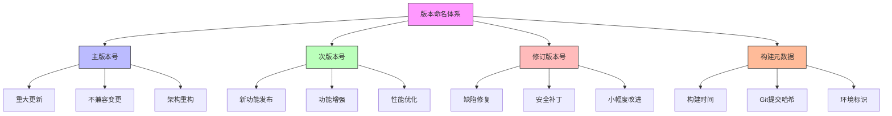

在企业级统一身份治理平台的持续发展过程中，科学的版本管理和合理的迭代规划是确保产品持续演进、满足用户需求并保持技术先进性的关键。本文将深入探讨如何建立有效的版本管理体系和制定合理的迭代规划策略。

## 引言

随着业务需求的不断变化和技术的快速发展，统一身份治理平台需要持续迭代和优化。良好的版本管理不仅能够帮助团队有效控制开发进度，还能确保产品稳定性和用户满意度。通过科学的迭代规划，可以合理分配资源，平衡新功能开发与系统维护，实现产品的可持续发展。

## 版本管理策略

### 版本命名规范

建立清晰的版本命名规范，便于团队协作和用户理解：



### 版本管理实现

```java
public class VersionManagementSystem {
    private final VersionService versionService;
    private final ReleaseService releaseService;
    private final DeploymentService deploymentService;
    
    // 版本信息管理
    public class VersionInfo {
        private String versionNumber;  // 版本号，如 2.1.0
        private VersionType versionType;  // 版本类型：MAJOR, MINOR, PATCH
        private ReleaseStatus status;  // 状态：DEVELOPING, TESTING, RELEASED
        private LocalDateTime createdAt;  // 创建时间
        private LocalDateTime releasedAt;  // 发布时间
        private List<Feature> features;  // 包含的功能
        private List<BugFix> bugFixes;  // 修复的缺陷
        private String releaseNotes;  // 发布说明
        private String gitTag;  // Git标签
        private String buildNumber;  // 构建号
    }
    
    // 创建新版本
    public VersionInfo createNewVersion(VersionRequest request) {
        VersionInfo version = new VersionInfo();
        version.setVersionNumber(generateVersionNumber(request.getVersionType(), request.getBaseVersion()));
        version.setVersionType(request.getVersionType());
        version.setStatus(ReleaseStatus.DEVELOPING);
        version.setCreatedAt(LocalDateTime.now());
        version.setFeatures(new ArrayList<>());
        version.setBugFixes(new ArrayList<>());
        
        // 保存版本信息
        versionService.saveVersion(version);
        
        // 创建Git标签
        version.setGitTag(createGitTag(version.getVersionNumber()));
        
        // 初始化版本分支
        initializeVersionBranch(version);
        
        return version;
    }
    
    // 版本发布流程
    public ReleaseResult releaseVersion(String versionNumber) {
        try {
            // 获取版本信息
            VersionInfo version = versionService.getVersion(versionNumber);
            
            // 执行发布前检查
            ReleaseCheckResult checkResult = performPreReleaseChecks(version);
            if (!checkResult.isPassed()) {
                return ReleaseResult.failure("发布前检查失败: " + checkResult.getFailures());
            }
            
            // 执行测试
            TestResult testResult = executeReleaseTests(version);
            if (!testResult.isPassed()) {
                return ReleaseResult.failure("测试失败: " + testResult.getFailures());
            }
            
            // 更新版本状态
            version.setStatus(ReleaseStatus.RELEASED);
            version.setReleasedAt(LocalDateTime.now());
            version.setReleaseNotes(generateReleaseNotes(version));
            
            // 保存更新
            versionService.updateVersion(version);
            
            // 创建发布包
            ReleasePackage releasePackage = createReleasePackage(version);
            
            // 部署到生产环境
            DeploymentResult deploymentResult = deployToProduction(releasePackage);
            if (!deploymentResult.isSuccessful()) {
                // 回滚处理
                rollbackRelease(version);
                return ReleaseResult.failure("部署失败: " + deploymentResult.getError());
            }
            
            // 发送发布通知
            sendReleaseNotification(version);
            
            return ReleaseResult.success("版本发布成功", version);
            
        } catch (Exception e) {
            log.error("版本发布失败", e);
            return ReleaseResult.failure("发布过程中发生错误: " + e.getMessage());
        }
    }
    
    // 版本回滚机制
    public RollbackResult rollbackVersion(String versionNumber) {
        try {
            VersionInfo version = versionService.getVersion(versionNumber);
            
            // 执行回滚前检查
            RollbackCheckResult checkResult = performRollbackChecks(version);
            if (!checkResult.isSafeToRollback()) {
                return RollbackResult.failure("回滚不安全: " + checkResult.getRisks());
            }
            
            // 执行回滚
            RollbackExecutionResult executionResult = executeRollback(version);
            if (!executionResult.isSuccessful()) {
                return RollbackResult.failure("回滚执行失败: " + executionResult.getError());
            }
            
            // 更新版本状态
            version.setStatus(ReleaseStatus.ROLLED_BACK);
            versionService.updateVersion(version);
            
            // 发送回滚通知
            sendRollbackNotification(version);
            
            return RollbackResult.success("版本回滚成功");
            
        } catch (Exception e) {
            log.error("版本回滚失败", e);
            return RollbackResult.failure("回滚过程中发生错误: " + e.getMessage());
        }
    }
    
    // 版本兼容性管理
    public CompatibilityReport checkCompatibility(String fromVersion, String toVersion) {
        CompatibilityReport report = new CompatibilityReport();
        report.setFromVersion(fromVersion);
        report.setToVersion(toVersion);
        
        // 检查API兼容性
        report.setApiCompatibility(checkApiCompatibility(fromVersion, toVersion));
        
        // 检查数据库兼容性
        report.setDatabaseCompatibility(checkDatabaseCompatibility(fromVersion, toVersion));
        
        // 检查配置兼容性
        report.setConfigurationCompatibility(checkConfigurationCompatibility(fromVersion, toVersion));
        
        // 检查依赖兼容性
        report.setDependencyCompatibility(checkDependencyCompatibility(fromVersion, toVersion));
        
        return report;
    }
}
```

### 版本数据库设计

```sql
-- 版本管理数据库设计
CREATE TABLE product_versions (
    id VARCHAR(50) PRIMARY KEY,
    version_number VARCHAR(20) NOT NULL UNIQUE,
    version_type VARCHAR(10) NOT NULL,  -- MAJOR, MINOR, PATCH
    status VARCHAR(20) NOT NULL,  -- DEVELOPING, TESTING, RELEASED, ROLLED_BACK
    created_at TIMESTAMP DEFAULT CURRENT_TIMESTAMP,
    released_at TIMESTAMP NULL,
    planned_release_date DATE,
    git_tag VARCHAR(50),
    git_branch VARCHAR(100),
    build_number VARCHAR(50),
    release_notes TEXT,
    changelog TEXT,
    created_by VARCHAR(50),
    
    INDEX idx_version_number (version_number),
    INDEX idx_version_type (version_type),
    INDEX idx_status (status),
    INDEX idx_created_at (created_at),
    INDEX idx_planned_release (planned_release_date)
);

-- 版本功能关联表
CREATE TABLE version_features (
    id VARCHAR(50) PRIMARY KEY,
    version_id VARCHAR(50) NOT NULL,
    feature_id VARCHAR(50) NOT NULL,
    feature_name VARCHAR(200) NOT NULL,
    description TEXT,
    priority VARCHAR(20),  -- HIGH, MEDIUM, LOW
    status VARCHAR(20),  -- PLANNED, IN_PROGRESS, COMPLETED
    estimated_hours INT,
    actual_hours INT,
    completed_at TIMESTAMP NULL,
    
    FOREIGN KEY (version_id) REFERENCES product_versions(id),
    INDEX idx_version_id (version_id),
    INDEX idx_feature_id (feature_id),
    INDEX idx_status (status)
);

-- 版本缺陷修复表
CREATE TABLE version_bug_fixes (
    id VARCHAR(50) PRIMARY KEY,
    version_id VARCHAR(50) NOT NULL,
    bug_id VARCHAR(50),
    description TEXT NOT NULL,
    severity VARCHAR(20),  -- CRITICAL, HIGH, MEDIUM, LOW
    priority VARCHAR(20),  -- HIGH, MEDIUM, LOW
    status VARCHAR(20),  -- OPEN, IN_PROGRESS, FIXED, VERIFIED
    created_at TIMESTAMP DEFAULT CURRENT_TIMESTAMP,
    fixed_at TIMESTAMP NULL,
    verified_at TIMESTAMP NULL,
    
    FOREIGN KEY (version_id) REFERENCES product_versions(id),
    INDEX idx_version_id (version_id),
    INDEX idx_severity (severity),
    INDEX idx_priority (priority),
    INDEX idx_status (status)
);

-- 版本部署记录表
CREATE TABLE version_deployments (
    id VARCHAR(50) PRIMARY KEY,
    version_id VARCHAR(50) NOT NULL,
    environment VARCHAR(20) NOT NULL,  -- DEV, TEST, STAGING, PROD
    deployment_status VARCHAR(20) NOT NULL,  -- PENDING, IN_PROGRESS, SUCCESS, FAILED, ROLLED_BACK
    deployed_by VARCHAR(50),
    deployed_at TIMESTAMP DEFAULT CURRENT_TIMESTAMP,
    completed_at TIMESTAMP NULL,
    rollback_at TIMESTAMP NULL,
    deployment_log TEXT,
    error_message TEXT,
    
    FOREIGN KEY (version_id) REFERENCES product_versions(id),
    INDEX idx_version_id (version_id),
    INDEX idx_environment (environment),
    INDEX idx_deployment_status (deployment_status),
    INDEX idx_deployed_at (deployed_at)
);

-- 创建版本统计视图
CREATE VIEW version_statistics AS
SELECT 
    pv.version_number,
    pv.version_type,
    pv.status,
    pv.released_at,
    COUNT(vf.id) as total_features,
    COUNT(CASE WHEN vf.status = 'COMPLETED' THEN 1 END) as completed_features,
    COUNT(vbf.id) as total_bug_fixes,
    COUNT(CASE WHEN vbf.status = 'FIXED' THEN 1 END) as fixed_bugs,
    AVG(vd.deployment_duration) as avg_deployment_time,
    COUNT(CASE WHEN vd.deployment_status = 'SUCCESS' THEN 1 END) as successful_deployments
FROM product_versions pv
LEFT JOIN version_features vf ON pv.id = vf.version_id
LEFT JOIN version_bug_fixes vbf ON pv.id = vbf.version_id
LEFT JOIN (
    SELECT 
        version_id,
        environment,
        TIMESTAMPDIFF(SECOND, deployed_at, completed_at) as deployment_duration,
        deployment_status
    FROM version_deployments
    WHERE environment = 'PROD'
) vd ON pv.id = vd.version_id
GROUP BY pv.id, pv.version_number, pv.version_type, pv.status, pv.released_at
ORDER BY pv.released_at DESC;
```

## 迭代规划方法

### 敏捷开发实践

```python
class IterationPlanningSystem:
    def __init__(self, planning_service, resource_service, tracking_service):
        self.planning_service = planning_service
        self.resource_service = resource_service
        self.tracking_service = tracking_service
    
    def create_iteration_plan(self, planning_request):
        """创建迭代计划"""
        # 评估团队容量
        team_capacity = self._assess_team_capacity(planning_request.team_id, planning_request.iteration_length)
        
        # 收集需求
        requirements = self._gather_requirements(planning_request)
        
        # 优先级排序
        prioritized_requirements = self._prioritize_requirements(requirements)
        
        # 估算工作量
        estimated_requirements = self._estimate_requirements(prioritized_requirements)
        
        # 制定迭代计划
        iteration_plan = self._build_iteration_plan(
            estimated_requirements, 
            team_capacity, 
            planning_request.iteration_length
        )
        
        # 验证计划可行性
        validation_result = self._validate_plan(iteration_plan)
        if not validation_result.is_valid:
            raise PlanningError(f"计划不可行: {validation_result.reasons}")
        
        # 保存计划
        saved_plan = self.planning_service.save_iteration_plan(iteration_plan)
        
        return saved_plan
    
    def _assess_team_capacity(self, team_id, iteration_length):
        """评估团队容量"""
        # 获取团队成员信息
        team_members = self.resource_service.get_team_members(team_id)
        
        # 计算可用工作日
        working_days = self._calculate_working_days(iteration_length)
        
        # 计算团队总容量（人天）
        total_capacity = 0
        for member in team_members:
            # 考虑休假、会议等时间
            availability = member.availability_factor  # 0.6-1.0
            daily_capacity = member.daily_working_hours  # 通常6-8小时
            member_capacity = working_days * daily_capacity * availability
            total_capacity += member_capacity
        
        return {
            'total_capacity': total_capacity,
            'working_days': working_days,
            'team_members': team_members
        }
    
    def _gather_requirements(self, planning_request):
        """收集需求"""
        # 从不同来源收集需求
        requirements = []
        
        # 业务需求
        business_requirements = self.planning_service.get_business_requirements(
            planning_request.business_area
        )
        requirements.extend(business_requirements)
        
        # 技术债务
        tech_debt_items = self.planning_service.get_technical_debt_items()
        requirements.extend(tech_debt_items)
        
        # 用户反馈
        user_feedback = self.planning_service.get_user_feedback_items()
        requirements.extend(user_feedback)
        
        # 缺陷修复
        bug_fixes = self.planning_service.get_high_priority_bugs()
        requirements.extend(bug_fixes)
        
        return requirements
    
    def _prioritize_requirements(self, requirements):
        """需求优先级排序"""
        # 使用加权评分法
        for req in requirements:
            # 业务价值 (1-10)
            business_value = req.get_business_value_score()
            
            # 技术复杂度 (1-10)
            technical_complexity = req.get_technical_complexity_score()
            
            # 用户影响 (1-10)
            user_impact = req.get_user_impact_score()
            
            # 紧急程度 (1-10)
            urgency = req.get_urgency_score()
            
            # 计算优先级分数
            priority_score = (
                business_value * 0.4 +
                user_impact * 0.3 +
                urgency * 0.2 +
                (11 - technical_complexity) * 0.1  # 复杂度越低权重越高
            )
            
            req.priority_score = priority_score
        
        # 按优先级排序
        return sorted(requirements, key=lambda x: x.priority_score, reverse=True)
    
    def _estimate_requirements(self, requirements):
        """估算需求工作量"""
        estimated_requirements = []
        
        for req in requirements:
            # 使用三点估算法
            optimistic = req.get_optimistic_estimate()
            pessimistic = req.get_pessimistic_estimate()
            most_likely = req.get_most_likely_estimate()
            
            # 计算期望值
            expected_effort = (optimistic + 4 * most_likely + pessimistic) / 6
            
            # 添加缓冲时间
            buffered_effort = expected_effort * 1.2  # 20%缓冲
            
            req.estimated_effort = buffered_effort
            req.estimation_method = 'THREE_POINT'
            
            estimated_requirements.append(req)
        
        return estimated_requirements
    
    def _build_iteration_plan(self, requirements, team_capacity, iteration_length):
        """构建迭代计划"""
        iteration_plan = {
            'iteration_length': iteration_length,
            'team_capacity': team_capacity['total_capacity'],
            'working_days': team_capacity['working_days'],
            'planned_requirements': [],
            'total_effort': 0,
            'utilization_rate': 0
        }
        
        # 按优先级选择可完成的需求
        remaining_capacity = team_capacity['total_capacity']
        planned_requirements = []
        total_effort = 0
        
        for req in requirements:
            if req.estimated_effort <= remaining_capacity:
                planned_requirements.append(req)
                total_effort += req.estimated_effort
                remaining_capacity -= req.estimated_effort
            else:
                # 如果剩余容量不足以完成当前需求，检查是否可以部分完成
                if remaining_capacity > req.estimated_effort * 0.5:  # 至少能完成50%
                    # 创建子任务
                    sub_task = self._create_sub_task(req, remaining_capacity)
                    planned_requirements.append(sub_task)
                    total_effort += remaining_capacity
                    remaining_capacity = 0
                    break
                else:
                    # 容量不足，停止计划
                    break
        
        iteration_plan['planned_requirements'] = planned_requirements
        iteration_plan['total_effort'] = total_effort
        iteration_plan['utilization_rate'] = total_effort / team_capacity['total_capacity']
        iteration_plan['remaining_capacity'] = remaining_capacity
        
        return iteration_plan
    
    def track_iteration_progress(self, iteration_id):
        """跟踪迭代进度"""
        # 获取迭代信息
        iteration = self.planning_service.get_iteration(iteration_id)
        
        # 获取任务状态
        tasks = self.tracking_service.get_iteration_tasks(iteration_id)
        
        # 计算进度指标
        progress_metrics = self._calculate_progress_metrics(tasks)
        
        # 识别风险
        risks = self._identify_iteration_risks(tasks, iteration)
        
        # 生成进度报告
        progress_report = {
            'iteration': iteration,
            'progress_metrics': progress_metrics,
            'risks': risks,
            'recommendations': self._generate_recommendations(risks)
        }
        
        return progress_report
    
    def _calculate_progress_metrics(self, tasks):
        """计算进度指标"""
        total_tasks = len(tasks)
        completed_tasks = len([t for t in tasks if t.status == 'COMPLETED'])
        in_progress_tasks = len([t for t in tasks if t.status == 'IN_PROGRESS'])
        blocked_tasks = len([t for t in tasks if t.status == 'BLOCKED'])
        
        total_effort = sum(t.estimated_effort for t in tasks)
        completed_effort = sum(t.actual_effort for t in tasks if t.status == 'COMPLETED')
        remaining_effort = sum(t.remaining_effort for t in tasks)
        
        return {
            'task_completion_rate': completed_tasks / total_tasks if total_tasks > 0 else 0,
            'effort_completion_rate': completed_effort / total_effort if total_effort > 0 else 0,
            'velocity': completed_effort / 10,  # 假设10个工作日
            'burndown_rate': remaining_effort / 5,  # 假设剩余5个工作日
            'blocked_tasks': blocked_tasks,
            'in_progress_tasks': in_progress_tasks
        }
```

### 迭代规划工具

```javascript
// 迭代规划界面
class IterationPlanningInterface {
  constructor(planningService, visualizationService) {
    this.planningService = planningService;
    this.visualizationService = visualizationService;
    this.currentPlan = null;
  }
  
  // 初始化规划界面
  init(containerId) {
    this.container = document.getElementById(containerId);
    this.renderPlanningDashboard();
    this.bindPlanningEvents();
  }
  
  // 渲染规划仪表板
  renderPlanningDashboard() {
    const dashboard = document.createElement('div');
    dashboard.className = 'planning-dashboard';
    
    dashboard.innerHTML = `
      <div class="dashboard-header">
        <h1>迭代规划仪表板</h1>
        <div class="planning-controls">
          <button id="new-plan-btn" class="primary">新建计划</button>
          <button id="view-backlog-btn">查看需求池</button>
          <select id="team-selector">
            <option value="">选择团队</option>
            <!-- 团队选项将动态加载 -->
          </select>
          <select id="iteration-length">
            <option value="14">2周迭代</option>
            <option value="21">3周迭代</option>
            <option value="28" selected>4周迭代</option>
          </select>
        </div>
      </div>
      
      <div class="planning-grid">
        <div class="grid-item capacity-view">
          <div class="panel-header">
            <h2>团队容量</h2>
          </div>
          <div id="capacity-content"></div>
        </div>
        
        <div class="grid-item backlog-view">
          <div class="panel-header">
            <h2>需求池</h2>
          </div>
          <div id="backlog-content"></div>
        </div>
        
        <div class="grid-item plan-view">
          <div class="panel-header">
            <h2>迭代计划</h2>
          </div>
          <div id="plan-content"></div>
        </div>
        
        <div class="grid-item metrics-view">
          <div class="panel-header">
            <h2>规划指标</h2>
          </div>
          <div id="metrics-content"></div>
        </div>
      </div>
    `;
    
    this.container.appendChild(dashboard);
  }
  
  // 渲染团队容量视图
  async renderCapacityView() {
    const capacity = await this.planningService.getTeamCapacity();
    const container = document.getElementById('capacity-content');
    
    const capacityHtml = `
      <div class="capacity-summary">
        <div class="capacity-metric">
          <div class="metric-value">${capacity.totalCapacity}</div>
          <div class="metric-label">总容量 (人天)</div>
        </div>
        <div class="capacity-metric">
          <div class="metric-value">${capacity.workingDays}</div>
          <div class="metric-label">工作日</div>
        </div>
        <div class="capacity-metric">
          <div class="metric-value">${capacity.teamMembers.length}</div>
          <div class="metric-label">团队成员</div>
        </div>
      </div>
      
      <div class="team-members">
        <h3>团队成员详情</h3>
        <table>
          <thead>
            <tr>
              <th>姓名</th>
              <th>角色</th>
              <th>可用性</th>
              <th>日容量</th>
            </tr>
          </thead>
          <tbody>
            ${capacity.teamMembers.map(member => `
              <tr>
                <td>${member.name}</td>
                <td>${member.role}</td>
                <td>${(member.availability * 100).toFixed(0)}%</td>
                <td>${member.dailyCapacity}小时</td>
              </tr>
            `).join('')}
          </tbody>
        </table>
      </div>
    `;
    
    container.innerHTML = capacityHtml;
  }
  
  // 渲染需求池视图
  async renderBacklogView() {
    const backlog = await this.planningService.getBacklogItems();
    const container = document.getElementById('backlog-content');
    
    const backlogHtml = `
      <div class="backlog-controls">
        <input type="text" id="backlog-search" placeholder="搜索需求...">
        <select id="backlog-filter">
          <option value="all">全部需求</option>
          <option value="feature">功能需求</option>
          <option value="bug">缺陷修复</option>
          <option value="tech-debt">技术债务</option>
        </select>
      </div>
      
      <div class="backlog-items">
        ${backlog.items.map(item => `
          <div class="backlog-item" data-item-id="${item.id}">
            <div class="item-header">
              <span class="item-type ${item.type.toLowerCase()}">${item.type}</span>
              <span class="item-priority priority-${item.priority.toLowerCase()}">${item.priority}</span>
            </div>
            <div class="item-content">
              <h4>${item.title}</h4>
              <p>${item.description}</p>
            </div>
            <div class="item-footer">
              <span class="item-estimate">${item.estimate} 人天</span>
              <span class="item-score">得分: ${item.priorityScore.toFixed(1)}</span>
            </div>
          </div>
        `).join('')}
      </div>
    `;
    
    container.innerHTML = backlogHtml;
  }
  
  // 创建迭代计划
  async createIterationPlan() {
    const planRequest = {
      teamId: document.getElementById('team-selector').value,
      iterationLength: parseInt(document.getElementById('iteration-length').value),
      // 其他计划参数
    };
    
    try {
      const plan = await this.planningService.createIterationPlan(planRequest);
      this.currentPlan = plan;
      this.renderPlanView(plan);
      this.renderMetricsView(plan);
      
      // 显示成功消息
      this.showNotification('迭代计划创建成功', 'success');
    } catch (error) {
      this.showNotification('创建计划失败: ' + error.message, 'error');
    }
  }
  
  // 渲染计划视图
  renderPlanView(plan) {
    const container = document.getElementById('plan-content');
    
    const planHtml = `
      <div class="plan-summary">
        <div class="plan-metric">
          <div class="metric-value">${plan.plannedRequirements.length}</div>
          <div class="metric-label">计划需求</div>
        </div>
        <div class="plan-metric">
          <div class="metric-value">${plan.totalEffort.toFixed(1)}</div>
          <div class="metric-label">总工作量</div>
        </div>
        <div class="plan-metric">
          <div class="metric-value">${(plan.utilizationRate * 100).toFixed(1)}%</div>
          <div class="metric-label">利用率</div>
        </div>
        <div class="plan-metric">
          <div class="metric-value">${plan.remainingCapacity.toFixed(1)}</div>
          <div class="metric-label">剩余容量</div>
        </div>
      </div>
      
      <div class="planned-items">
        <h3>计划中的需求</h3>
        <div class="items-list">
          ${plan.plannedRequirements.map((item, index) => `
            <div class="planned-item">
              <div class="item-number">${index + 1}</div>
              <div class="item-details">
                <h4>${item.title}</h4>
                <p>${item.description}</p>
              </div>
              <div class="item-effort">${item.estimatedEffort.toFixed(1)} 人天</div>
            </div>
          `).join('')}
        </div>
      </div>
      
      <div class="plan-actions">
        <button id="save-plan-btn" class="primary">保存计划</button>
        <button id="adjust-plan-btn">调整计划</button>
        <button id="start-iteration-btn">开始迭代</button>
      </div>
    `;
    
    container.innerHTML = planHtml;
  }
}
```

## 发布管理流程

### 发布准备检查清单

```sql
-- 发布管理数据库设计
CREATE TABLE release_checklists (
    id VARCHAR(50) PRIMARY KEY,
    version_id VARCHAR(50) NOT NULL,
    checklist_type VARCHAR(50) NOT NULL,  -- PRE_RELEASE, POST_RELEASE
    checklist_name VARCHAR(200) NOT NULL,
    description TEXT,
    created_at TIMESTAMP DEFAULT CURRENT_TIMESTAMP,
    updated_at TIMESTAMP DEFAULT CURRENT_TIMESTAMP ON UPDATE CURRENT_TIMESTAMP,
    
    FOREIGN KEY (version_id) REFERENCES product_versions(id),
    INDEX idx_version_id (version_id),
    INDEX idx_checklist_type (checklist_type)
);

-- 发布检查项表
CREATE TABLE release_checklist_items (
    id VARCHAR(50) PRIMARY KEY,
    checklist_id VARCHAR(50) NOT NULL,
    item_name VARCHAR(200) NOT NULL,
    item_description TEXT,
    is_required BOOLEAN DEFAULT TRUE,
    category VARCHAR(50),  -- CODE, TEST, DOCUMENTATION, DEPLOYMENT
    assigned_to VARCHAR(50),
    status VARCHAR(20) DEFAULT 'PENDING',  -- PENDING, IN_PROGRESS, COMPLETED, FAILED
    completed_at TIMESTAMP NULL,
    notes TEXT,
    
    FOREIGN KEY (checklist_id) REFERENCES release_checklists(id),
    INDEX idx_checklist_id (checklist_id),
    INDEX idx_status (status),
    INDEX idx_category (category)
);

-- 发布审批表
CREATE TABLE release_approvals (
    id VARCHAR(50) PRIMARY KEY,
    version_id VARCHAR(50) NOT NULL,
    approver_id VARCHAR(50) NOT NULL,
    approver_role VARCHAR(50) NOT NULL,
    approval_status VARCHAR(20) NOT NULL,  -- PENDING, APPROVED, REJECTED
    approval_comment TEXT,
    requested_at TIMESTAMP DEFAULT CURRENT_TIMESTAMP,
    approved_at TIMESTAMP NULL,
    
    FOREIGN KEY (version_id) REFERENCES product_versions(id),
    INDEX idx_version_id (version_id),
    INDEX idx_approver_id (approver_id),
    INDEX idx_approval_status (approval_status)
);

-- 发布回滚计划表
CREATE TABLE rollback_plans (
    id VARCHAR(50) PRIMARY KEY,
    version_id VARCHAR(50) NOT NULL,
    rollback_strategy TEXT NOT NULL,
    backup_procedures JSON,
    rollback_steps JSON,
    risk_assessment TEXT,
    estimated_rollback_time INT,  -- 分钟
    created_by VARCHAR(50),
    created_at TIMESTAMP DEFAULT CURRENT_TIMESTAMP,
    approved_at TIMESTAMP NULL,
    
    FOREIGN KEY (version_id) REFERENCES product_versions(id),
    INDEX idx_version_id (version_id)
);

-- 创建发布统计视图
CREATE VIEW release_statistics AS
SELECT 
    pv.version_number,
    pv.released_at,
    TIMESTAMPDIFF(DAY, pv.created_at, pv.released_at) as development_days,
    COUNT(rci.id) as total_checklist_items,
    COUNT(CASE WHEN rci.status = 'COMPLETED' THEN 1 END) as completed_items,
    COUNT(ra.id) as total_approvals,
    COUNT(CASE WHEN ra.approval_status = 'APPROVED' THEN 1 END) as approved_count,
    rp.estimated_rollback_time,
    COUNT(vd.id) as deployment_count,
    AVG(TIMESTAMPDIFF(MINUTE, vd.deployed_at, vd.completed_at)) as avg_deployment_minutes
FROM product_versions pv
LEFT JOIN release_checklists rc ON pv.id = rc.version_id
LEFT JOIN release_checklist_items rci ON rc.id = rci.checklist_id
LEFT JOIN release_approvals ra ON pv.id = ra.version_id
LEFT JOIN rollback_plans rp ON pv.id = rp.version_id
LEFT JOIN version_deployments vd ON pv.id = vd.version_id AND vd.environment = 'PROD'
WHERE pv.status = 'RELEASED'
GROUP BY pv.id, pv.version_number, pv.released_at, pv.created_at, 
         rp.estimated_rollback_time
ORDER BY pv.released_at DESC;
```

## 总结

版本管理与迭代规划是统一身份治理平台持续发展的重要保障。通过建立科学的版本管理体系、实施敏捷的迭代规划方法和完善发布管理流程，可以确保产品有序演进，满足用户需求，并保持技术先进性。

关键要点包括：

1. **版本管理**：建立清晰的版本命名规范和管理流程，确保版本控制的有效性
2. **迭代规划**：采用敏捷开发方法，合理规划迭代周期和团队容量
3. **发布管理**：建立完善的发布检查清单和审批流程，确保发布质量

在后续章节中，我们将继续探讨面向未来的身份治理技术和发展趋势，为构建前瞻性企业级身份治理解决方案提供指导。