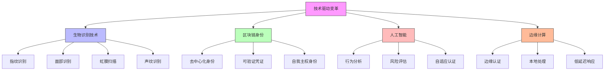

在数字化转型的浪潮中，身份治理正面临着前所未有的机遇与挑战。随着技术的快速发展和业务需求的不断演进，传统的身份管理方式已难以满足现代企业的需求。面向未来的身份治理需要拥抱新兴技术，适应新的应用场景，并为未知的挑战做好准备。

## 本章概要

第14章将深入探讨身份治理领域的前沿趋势和未来发展方向：

* **无密码未来**：探索WebAuthn/FIDO2等新一代认证技术
* **身份治理与管理（IGA）**：自动化权限治理工作流的实现
* **CIAM与员工身份的融合**：分析客户身份管理与员工身份管理的异同
* **零信任架构中的身份角色**：理解"永不信任，始终验证"原则下的身份新定位

通过本章的学习，读者将了解身份治理领域的最新发展趋势，为构建面向未来的企业级身份治理平台提供前瞻性思考。

## 核心发展趋势

### 技术驱动变革

新兴技术正在重塑身份治理的面貌，推动行业向更安全、更便捷、更智能的方向发展：



### 应用场景扩展

身份治理的应用场景正在从传统的内部员工身份管理扩展到更广泛的领域：

```java
public class FutureIdentityScenarios {
    
    // 无密码认证场景
    public class PasswordlessAuthentication {
        private final WebAuthnService webAuthnService;
        private final Fido2Service fido2Service;
        
        // WebAuthn认证流程
        public AuthenticationResult authenticateWithWebAuthn(String userId, PublicKeyCredential credential) {
            try {
                // 验证凭据
                boolean isValid = webAuthnService.verifyCredential(userId, credential);
                
                if (isValid) {
                    // 生成认证令牌
                    String accessToken = tokenService.generateAccessToken(userId);
                    String refreshToken = tokenService.generateRefreshToken(userId);
                    
                    // 记录认证日志
                    auditService.logAuthentication(userId, "WEBAUTHN", true);
                    
                    return AuthenticationResult.success(accessToken, refreshToken);
                } else {
                    // 记录失败日志
                    auditService.logAuthentication(userId, "WEBAUTHN", false);
                    return AuthenticationResult.failure("认证失败");
                }
            } catch (Exception e) {
                auditService.logAuthenticationError(userId, "WEBAUTHN", e.getMessage());
                return AuthenticationResult.failure("认证过程中发生错误: " + e.getMessage());
            }
        }
    }
    
    // 去中心化身份场景
    public class DecentralizedIdentity {
        private final DIDService didService;
        private final VerifiableCredentialService vcService;
        
        // 创建去中心化身份
        public DID createDecentralizedIdentity(String userId) {
            // 生成密钥对
            KeyPair keyPair = cryptoService.generateKeyPair();
            
            // 创建DID
            DID did = didService.createDID(userId, keyPair.getPublicKey());
            
            // 注册到区块链
            didService.registerDID(did, keyPair.getPrivateKey());
            
            // 生成可验证凭证
            VerifiableCredential vc = vcService.createEmployeeCredential(userId, did);
            
            return did;
        }
        
        // 验证可验证凭证
        public boolean verifyVerifiableCredential(VerifiableCredential credential) {
            return vcService.verifyCredential(credential);
        }
    }
    
    // 零信任访问场景
    public class ZeroTrustAccess {
        private final RiskAssessmentService riskService;
        private final AdaptiveAuthenticationService adaptiveAuthService;
        
        // 自适应访问控制
        public AccessDecision evaluateAccessRequest(AccessRequest request) {
            // 评估风险
            RiskAssessment riskAssessment = riskService.assessRisk(request);
            
            // 根据风险级别调整认证要求
            AuthenticationRequirements authRequirements = 
                adaptiveAuthService.determineAuthRequirements(riskAssessment);
            
            // 执行多层认证
            AuthenticationResult authResult = adaptiveAuthService.performAuthentication(
                request.getUserId(), authRequirements);
            
            if (authResult.isSuccess()) {
                // 授权决策
                AuthorizationDecision authzDecision = authorizationService.evaluate(request);
                return AccessDecision.builder()
                    .allowed(authzDecision.isAllowed())
                    .conditions(authzDecision.getConditions())
                    .sessionTimeout(authzDecision.getSessionTimeout())
                    .build();
            } else {
                return AccessDecision.denied("认证失败");
            }
        }
    }
}
```

## 无密码认证技术

### WebAuthn/FIDO2标准

WebAuthn和FIDO2标准为无密码认证提供了技术基础，通过公钥加密技术实现安全的身份验证：

```python
class WebAuthnImplementation:
    def __init__(self, crypto_service, storage_service):
        self.crypto_service = crypto_service
        self.storage_service = storage_service
    
    # 注册新凭据
    def register_credential(self, user_id, registration_options):
        """注册新的WebAuthn凭据"""
        try:
            # 验证注册选项
            if not self._validate_registration_options(registration_options):
                raise ValueError("无效的注册选项")
            
            # 解析客户端数据
            client_data = self._parse_client_data(registration_options.client_data_json)
            
            # 验证挑战
            if not self._verify_challenge(client_data.challenge, registration_options.challenge):
                raise ValueError("挑战验证失败")
            
            # 解析认证器数据
            attestation_object = self._parse_attestation_object(registration_options.attestation_object)
            
            # 验证认证器数据
            if not self._verify_attestation(attestation_object):
                raise ValueError("认证器验证失败")
            
            # 提取公钥
            public_key = self._extract_public_key(attestation_object.auth_data)
            
            # 创建凭据记录
            credential = {
                'id': registration_options.credential_id,
                'user_id': user_id,
                'public_key': public_key,
                'sign_count': attestation_object.auth_data.sign_count,
                'created_at': datetime.utcnow(),
                'last_used': None
            }
            
            # 存储凭据
            self.storage_service.save_credential(credential)
            
            # 记录注册日志
            self._log_registration(user_id, credential['id'])
            
            return {
                'success': True,
                'credential_id': credential['id']
            }
            
        except Exception as e:
            self._log_registration_error(user_id, str(e))
            return {
                'success': False,
                'error': str(e)
            }
    
    # 验证凭据
    def authenticate_credential(self, user_id, authentication_options):
        """验证WebAuthn凭据"""
        try:
            # 获取用户凭据
            credential = self.storage_service.get_credential(user_id, authentication_options.credential_id)
            if not credential:
                raise ValueError("凭据不存在")
            
            # 解析客户端数据
            client_data = self._parse_client_data(authentication_options.client_data_json)
            
            # 验证挑战
            if not self._verify_challenge(client_data.challenge, authentication_options.challenge):
                raise ValueError("挑战验证失败")
            
            # 解析认证器数据
            auth_data = self._parse_authenticator_data(authentication_options.authenticator_data)
            
            # 验证签名
            signature_valid = self._verify_signature(
                credential['public_key'],
                authentication_options.client_data_json,
                authentication_options.authenticator_data,
                authentication_options.signature
            )
            
            if signature_valid:
                # 更新签名计数
                credential['sign_count'] = auth_data.sign_count
                credential['last_used'] = datetime.utcnow()
                self.storage_service.update_credential(credential)
                
                # 生成访问令牌
                access_token = self._generate_access_token(user_id)
                
                # 记录认证日志
                self._log_authentication(user_id, credential['id'], True)
                
                return {
                    'success': True,
                    'access_token': access_token
                }
            else:
                # 记录认证失败
                self._log_authentication(user_id, credential['id'], False)
                raise ValueError("签名验证失败")
                
        except Exception as e:
            self._log_authentication_error(user_id, str(e))
            return {
                'success': False,
                'error': str(e)
            }
    
    # 生成注册选项
    def generate_registration_options(self, user_id, user_name):
        """生成WebAuthn注册选项"""
        challenge = self.crypto_service.generate_random_bytes(32)
        
        options = {
            'challenge': base64.urlsafe_b64encode(challenge).decode('utf-8'),
            'user': {
                'id': base64.urlsafe_b64encode(user_id.encode('utf-8')).decode('utf-8'),
                'name': user_name,
                'displayName': user_name
            },
            'rp': {
                'name': '企业身份治理平台',
                'id': 'identity-platform.example.com'
            },
            'pubKeyCredParams': [
                {
                    'type': 'public-key',
                    'alg': -7  # ES256
                },
                {
                    'type': 'public-key',
                    'alg': -257  # RS256
                }
            ],
            'timeout': 60000,  # 60秒超时
            'attestation': 'direct',
            'excludeCredentials': self._get_user_credentials(user_id)
        }
        
        # 存储挑战用于后续验证
        self.storage_service.store_challenge(user_id, challenge)
        
        return options
    
    # 生成认证选项
    def generate_authentication_options(self, user_id):
        """生成WebAuthn认证选项"""
        challenge = self.crypto_service.generate_random_bytes(32)
        
        options = {
            'challenge': base64.urlsafe_b64encode(challenge).decode('utf-8'),
            'timeout': 60000,  # 60秒超时
            'rpId': 'identity-platform.example.com',
            'allowCredentials': self._get_user_credentials(user_id),
            'userVerification': 'preferred'
        }
        
        # 存储挑战用于后续验证
        self.storage_service.store_challenge(user_id, challenge)
        
        return options
```

### 生物识别认证

生物识别技术为身份认证提供了更加自然和安全的方式：

```sql
-- 生物识别认证数据库设计
CREATE TABLE biometric_templates (
    id VARCHAR(50) PRIMARY KEY,
    user_id VARCHAR(50) NOT NULL,
    biometric_type VARCHAR(20) NOT NULL,  -- FINGERPRINT, FACE, IRIS, VOICE
    template_data BLOB NOT NULL,  -- 生物特征模板数据
    quality_score DECIMAL(3,2),   -- 质量评分
    enrollment_date TIMESTAMP DEFAULT CURRENT_TIMESTAMP,
    last_used TIMESTAMP NULL,
    is_active BOOLEAN DEFAULT TRUE,
    
    FOREIGN KEY (user_id) REFERENCES users(id),
    INDEX idx_user_id (user_id),
    INDEX idx_biometric_type (biometric_type),
    INDEX idx_is_active (is_active)
);

-- 生物识别认证日志表
CREATE TABLE biometric_auth_logs (
    id VARCHAR(50) PRIMARY KEY,
    user_id VARCHAR(50) NOT NULL,
    biometric_type VARCHAR(20) NOT NULL,
    auth_timestamp TIMESTAMP DEFAULT CURRENT_TIMESTAMP,
    success BOOLEAN NOT NULL,
    confidence_score DECIMAL(3,2),  -- 匹配置信度
    device_info JSON,  -- 设备信息
    ip_address VARCHAR(45),
    error_message VARCHAR(500),
    
    FOREIGN KEY (user_id) REFERENCES users(id),
    INDEX idx_user_id (user_id),
    INDEX idx_auth_timestamp (auth_timestamp),
    INDEX idx_success (success)
);

-- 多模态生物识别表
CREATE TABLE multimodal_biometrics (
    id VARCHAR(50) PRIMARY KEY,
    user_id VARCHAR(50) NOT NULL,
    primary_biometric VARCHAR(20) NOT NULL,  -- 主要生物识别方式
    secondary_biometric VARCHAR(20),         -- 次要生物识别方式
    fusion_method VARCHAR(50),               -- 融合方法
    overall_confidence DECIMAL(3,2),         -- 整体置信度
    created_at TIMESTAMP DEFAULT CURRENT_TIMESTAMP,
    updated_at TIMESTAMP DEFAULT CURRENT_TIMESTAMP ON UPDATE CURRENT_TIMESTAMP,
    
    FOREIGN KEY (user_id) REFERENCES users(id),
    INDEX idx_user_id (user_id)
);

-- 创建生物识别统计视图
CREATE VIEW biometric_statistics AS
SELECT 
    bt.biometric_type,
    COUNT(*) as total_templates,
    COUNT(CASE WHEN bt.is_active = TRUE THEN 1 END) as active_templates,
    AVG(bt.quality_score) as avg_quality_score,
    COUNT(bal.id) as total_auth_attempts,
    COUNT(CASE WHEN bal.success = TRUE THEN 1 END) as successful_auths,
    ROUND(COUNT(CASE WHEN bal.success = TRUE THEN 1 END) * 100.0 / COUNT(bal.id), 2) as success_rate,
    AVG(bal.confidence_score) as avg_confidence_score
FROM biometric_templates bt
LEFT JOIN biometric_auth_logs bal ON bt.user_id = bal.user_id 
    AND bt.biometric_type = bal.biometric_type
    AND bal.auth_timestamp > DATE_SUB(NOW(), INTERVAL 30 DAY)
GROUP BY bt.biometric_type;
```

## 身份治理自动化

### 智能权限管理

利用人工智能和机器学习技术实现权限管理的自动化和智能化：

```javascript
// 智能权限管理系统
class IntelligentPermissionManagement {
  constructor(mlService, permissionService, auditService) {
    this.mlService = mlService;
    this.permissionService = permissionService;
    this.auditService = auditService;
    this.models = new Map();
  }
  
  // 初始化机器学习模型
  async initializeModels() {
    // 权限推荐模型
    this.models.set('permission_recommendation', 
      await this.mlService.loadModel('permission_recommendation_model'));
    
    // 异常检测模型
    this.models.set('anomaly_detection', 
      await this.mlService.loadModel('anomaly_detection_model'));
    
    // 权限优化模型
    this.models.set('permission_optimization', 
      await this.mlService.loadModel('permission_optimization_model'));
  }
  
  // 智能权限推荐
  async recommendPermissions(userId, context) {
    // 收集用户上下文信息
    const userInfo = await this.permissionService.getUserInfo(userId);
    const userBehavior = await this.permissionService.getUserBehavior(userId);
    const roleInfo = await this.permissionService.getUserRoles(userId);
    const departmentInfo = await this.permissionService.getUserDepartment(userId);
    
    // 构建特征向量
    const features = this.buildFeatureVector({
      userInfo,
      userBehavior,
      roleInfo,
      departmentInfo,
      context
    });
    
    // 使用模型进行预测
    const model = this.models.get('permission_recommendation');
    const predictions = await model.predict(features);
    
    // 过滤和排序推荐结果
    const recommendations = this.processRecommendations(predictions, userId);
    
    // 记录推荐日志
    await this.auditService.logPermissionRecommendation(userId, recommendations);
    
    return recommendations;
  }
  
  // 构建特征向量
  buildFeatureVector(data) {
    const features = {
      // 用户特征
      user_tenure: this.calculateUserTenure(data.userInfo),
      user_role_level: this.calculateRoleLevel(data.roleInfo),
      department_risk_level: this.calculateDepartmentRisk(data.departmentInfo),
      
      // 行为特征
      login_frequency: data.userBehavior.login_frequency,
      resource_access_pattern: data.userBehavior.access_pattern,
      time_based_access: data.userBehavior.time_based_access,
      
      // 上下文特征
      access_time: data.context.access_time,
      access_location: data.context.access_location,
      access_device: data.context.access_device,
      
      // 历史特征
      previous_permissions: data.userInfo.previous_permissions,
      permission_changes: data.userInfo.permission_changes,
      access_requests: data.userInfo.access_requests
    };
    
    return features;
  }
  
  // 处理推荐结果
  processRecommendations(predictions, userId) {
    const recommendations = [];
    
    for (const [permissionId, score] of Object.entries(predictions)) {
      // 过滤低分推荐
      if (score < 0.3) continue;
      
      // 检查是否已拥有权限
      const hasPermission = this.permissionService.userHasPermission(userId, permissionId);
      if (hasPermission) continue;
      
      // 检查权限兼容性
      const isCompatible = this.permissionService.checkPermissionCompatibility(userId, permissionId);
      if (!isCompatible) continue;
      
      recommendations.push({
        permissionId: permissionId,
        score: score,
        confidence: this.calculateConfidence(score),
        reason: this.generateRecommendationReason(permissionId, score)
      });
    }
    
    // 按分数排序
    recommendations.sort((a, b) => b.score - a.score);
    
    return recommendations.slice(0, 10); // 返回前10个推荐
  }
  
  // 异常权限检测
  async detectAnomalousPermissions() {
    // 获取所有用户的权限数据
    const allPermissions = await this.permissionService.getAllUserPermissions();
    
    // 构建异常检测数据集
    const dataset = this.buildAnomalyDetectionDataset(allPermissions);
    
    // 使用异常检测模型
    const model = this.models.get('anomaly_detection');
    const anomalies = await model.detect(dataset);
    
    // 处理异常结果
    const processedAnomalies = await this.processAnomalies(anomalies);
    
    // 生成报告
    const report = this.generateAnomalyReport(processedAnomalies);
    
    return report;
  }
  
  // 权限优化建议
  async generatePermissionOptimizationSuggestions() {
    // 收集权限使用数据
    const usageData = await this.permissionService.getPermissionUsageData();
    
    // 使用优化模型
    const model = this.models.get('permission_optimization');
    const suggestions = await model.optimize(usageData);
    
    // 处理优化建议
    const processedSuggestions = this.processOptimizationSuggestions(suggestions);
    
    // 记录优化建议
    await this.auditService.logOptimizationSuggestions(processedSuggestions);
    
    return processedSuggestions;
  }
}
```

### 自动化工作流

构建自动化的身份治理工作流，减少人工干预，提高效率：

```java
public class AutomatedIdentityGovernance {
    private final WorkflowEngine workflowEngine;
    private final IdentityService identityService;
    private final ComplianceService complianceService;
    
    // 自动化工作流定义
    public class IdentityGovernanceWorkflow {
        
        // 用户入职自动化
        public Workflow createUserOnboardingWorkflow() {
            Workflow workflow = new Workflow("USER_ONBOARDING");
            
            // 步骤1: 用户信息验证
            workflow.addStep(new WorkflowStep("VERIFY_USER_INFO") {
                @Override
                public StepResult execute(WorkflowContext context) {
                    String userId = context.getVariable("userId");
                    UserInfo userInfo = identityService.getUserInfo(userId);
                    
                    // 验证必要信息
                    if (userInfo.getEmail() == null || userInfo.getDepartment() == null) {
                        return StepResult.failure("用户信息不完整");
                    }
                    
                    // 验证邮箱格式
                    if (!isValidEmail(userInfo.getEmail())) {
                        return StepResult.failure("邮箱格式不正确");
                    }
                    
                    context.setVariable("userInfo", userInfo);
                    return StepResult.success();
                }
            });
            
            // 步骤2: 分配基础权限
            workflow.addStep(new WorkflowStep("ASSIGN_BASE_PERMISSIONS") {
                @Override
                public StepResult execute(WorkflowContext context) {
                    String userId = context.getVariable("userId");
                    UserInfo userInfo = context.getVariable("userInfo");
                    
                    // 根据部门和职位分配基础权限
                    List<Permission> basePermissions = 
                        identityService.getBasePermissions(userInfo.getDepartment(), userInfo.getPosition());
                    
                    // 执行权限分配
                    boolean success = identityService.assignPermissions(userId, basePermissions);
                    
                    if (success) {
                        context.setVariable("assignedPermissions", basePermissions);
                        return StepResult.success();
                    } else {
                        return StepResult.failure("权限分配失败");
                    }
                }
            });
            
            // 步骤3: 创建系统账户
            workflow.addStep(new WorkflowStep("CREATE_SYSTEM_ACCOUNTS") {
                @Override
                public StepResult execute(WorkflowContext context) {
                    String userId = context.getVariable("userId");
                    UserInfo userInfo = context.getVariable("userInfo");
                    
                    // 为用户创建必要的系统账户
                    List<SystemAccount> accounts = 
                        identityService.createSystemAccounts(userId, userInfo);
                    
                    context.setVariable("systemAccounts", accounts);
                    return StepResult.success();
                }
            });
            
            // 步骤4: 发送欢迎邮件
            workflow.addStep(new WorkflowStep("SEND_WELCOME_EMAIL") {
                @Override
                public StepResult execute(WorkflowContext context) {
                    String userId = context.getVariable("userId");
                    UserInfo userInfo = context.getVariable("userInfo");
                    
                    // 发送欢迎邮件
                    boolean emailSent = notificationService.sendWelcomeEmail(userId, userInfo);
                    
                    if (emailSent) {
                        return StepResult.success();
                    } else {
                        return StepResult.failure("欢迎邮件发送失败");
                    }
                }
            });
            
            // 步骤5: 记录合规日志
            workflow.addStep(new WorkflowStep("LOG_COMPLIANCE") {
                @Override
                public StepResult execute(WorkflowContext context) {
                    String userId = context.getVariable("userId");
                    
                    // 记录合规日志
                    complianceService.logUserOnboarding(userId);
                    
                    return StepResult.success();
                }
            });
            
            return workflow;
        }
        
        // 用户转岗自动化
        public Workflow createUserTransferWorkflow() {
            Workflow workflow = new Workflow("USER_TRANSFER");
            
            // 步骤1: 验证转岗信息
            workflow.addStep(new WorkflowStep("VERIFY_TRANSFER_INFO") {
                @Override
                public StepResult execute(WorkflowContext context) {
                    String userId = context.getVariable("userId");
                    TransferInfo transferInfo = context.getVariable("transferInfo");
                    
                    // 验证转岗信息完整性
                    if (transferInfo.getNewDepartment() == null || transferInfo.getNewPosition() == null) {
                        return StepResult.failure("转岗信息不完整");
                    }
                    
                    context.setVariable("transferInfo", transferInfo);
                    return StepResult.success();
                }
            });
            
            // 步骤2: 撤销旧权限
            workflow.addStep(new WorkflowStep("REVOKE_OLD_PERMISSIONS") {
                @Override
                public StepResult execute(WorkflowContext context) {
                    String userId = context.getVariable("userId");
                    TransferInfo transferInfo = context.getVariable("transferInfo");
                    
                    // 获取用户当前权限
                    List<Permission> currentPermissions = 
                        identityService.getUserPermissions(userId);
                    
                    // 根据新部门撤销不必要的权限
                    List<Permission> permissionsToRevoke = 
                        identityService.getPermissionsToRevoke(
                            userId, 
                            transferInfo.getOldDepartment(), 
                            transferInfo.getNewDepartment()
                        );
                    
                    // 执行权限撤销
                    boolean success = identityService.revokePermissions(userId, permissionsToRevoke);
                    
                    if (success) {
                        context.setVariable("revokedPermissions", permissionsToRevoke);
                        return StepResult.success();
                    } else {
                        return StepResult.failure("权限撤销失败");
                    }
                }
            });
            
            // 步骤3: 分配新权限
            workflow.addStep(new WorkflowStep("ASSIGN_NEW_PERMISSIONS") {
                @Override
                public StepResult execute(WorkflowContext context) {
                    String userId = context.getVariable("userId");
                    TransferInfo transferInfo = context.getVariable("transferInfo");
                    
                    // 根据新部门和职位分配权限
                    List<Permission> newPermissions = 
                        identityService.getPermissionsForDepartmentAndPosition(
                            transferInfo.getNewDepartment(), 
                            transferInfo.getNewPosition()
                        );
                    
                    // 执行权限分配
                    boolean success = identityService.assignPermissions(userId, newPermissions);
                    
                    if (success) {
                        context.setVariable("newPermissions", newPermissions);
                        return StepResult.success();
                    } else {
                        return StepResult.failure("新权限分配失败");
                    }
                }
            });
            
            // 步骤4: 更新系统账户
            workflow.addStep(new WorkflowStep("UPDATE_SYSTEM_ACCOUNTS") {
                @Override
                public StepResult execute(WorkflowContext context) {
                    String userId = context.getVariable("userId");
                    TransferInfo transferInfo = context.getVariable("transferInfo");
                    
                    // 更新系统账户信息
                    boolean success = identityService.updateSystemAccounts(
                        userId, 
                        transferInfo.getNewDepartment(), 
                        transferInfo.getNewPosition()
                    );
                    
                    if (success) {
                        return StepResult.success();
                    } else {
                        return StepResult.failure("系统账户更新失败");
                    }
                }
            });
            
            // 步骤5: 发送通知
            workflow.addStep(new WorkflowStep("SEND_TRANSFER_NOTIFICATION") {
                @Override
                public StepResult execute(WorkflowContext context) {
                    String userId = context.getVariable("userId");
                    TransferInfo transferInfo = context.getVariable("transferInfo");
                    
                    // 发送转岗通知
                    boolean notificationSent = notificationService.sendTransferNotification(
                        userId, 
                        transferInfo
                    );
                    
                    if (notificationSent) {
                        return StepResult.success();
                    } else {
                        return StepResult.failure("转岗通知发送失败");
                    }
                }
            });
            
            return workflow;
        }
    }
}
```

## 总结

面向未来的身份治理需要我们拥抱技术创新，适应新的应用场景，并构建更加智能化和自动化的治理体系。通过无密码认证、去中心化身份、人工智能驱动的权限管理等前沿技术的应用，我们可以构建更加安全、便捷和高效的身份治理平台。

在接下来的章节中，我们将深入探讨无密码认证技术的具体实现、身份治理与管理的自动化工作流、CIAM与员工身份管理的融合策略，以及零信任架构中的身份新角色，为构建面向未来的企业级身份治理平台提供全面指导。