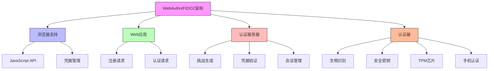

在数字化时代，密码作为身份认证的主要方式已经暴露出诸多安全和用户体验问题。忘记密码、弱密码、密码重用等问题不仅影响用户体验，更是安全漏洞的重要来源。无密码认证技术，特别是WebAuthn和FIDO2标准，为解决这些问题提供了革命性的解决方案，代表着身份认证的未来发展方向。

## 引言

传统的基于密码的身份认证方式已经无法满足现代企业对安全性和用户体验的双重需求。根据 Verizon 数据泄露调查报告，超过 80% 的数据泄露事件都与弱密码或被盗密码有关。无密码认证技术通过消除密码这一薄弱环节，从根本上提升了身份认证的安全性，同时大幅改善了用户体验。

## WebAuthn/FIDO2 技术基础

### 技术架构

WebAuthn（Web Authentication）是W3C标准，FIDO2是FIDO联盟基于WebAuthn开发的完整身份认证解决方案。它们共同构成了现代无密码认证的技术基础：



### 核心概念

```java
public class WebAuthnCoreConcepts {
    
    // 凭据模型
    public class PublicKeyCredential {
        private byte[] id;                    // 凭据ID
        private byte[] rawId;                 // 原始凭据ID
        private AuthenticatorResponse response; // 认证器响应
        private String type;                  // 凭据类型（public-key）
    }
    
    // 认证器响应
    public class AuthenticatorResponse {
        private byte[] clientDataJSON;        // 客户端数据
        private byte[] authenticatorData;     // 认证器数据
        private byte[] signature;             // 签名（仅认证时）
        private byte[] userHandle;            // 用户标识（仅注册时）
    }
    
    // 认证器数据
    public class AuthenticatorData {
        private byte[] rpIdHash;              // RP ID哈希
        private byte flags;                   // 标志位
        private int signCount;                // 签名计数
        private AttestedCredentialData attestedCredentialData; // 认证凭据数据
        private byte[] extensions;            // 扩展数据
    }
    
    // 客户端数据
    public class CollectedClientData {
        private String type;                  // 操作类型
        private String challenge;             // 挑战
        private String origin;                // 源站
        private String crossOrigin;           // 跨域标志
        private String tokenBinding;          // 令牌绑定
    }
    
    // 注册选项
    public class PublicKeyCredentialCreationOptions {
        private PublicKeyCredentialRpEntity rp;           // 依赖方信息
        private PublicKeyCredentialUserEntity user;       // 用户信息
        private byte[] challenge;                         // 挑战
        private List<PublicKeyCredentialParameters> pubKeyCredParams; // 公钥参数
        private long timeout;                             // 超时时间
        private List<PublicKeyCredentialDescriptor> excludeCredentials; // 排除凭据
        private AuthenticatorSelectionCriteria authenticatorSelection; // 认证器选择
        private String attestation;                       // 证明偏好
        private Map<String, Object> extensions;           // 扩展
    }
    
    // 认证选项
    public class PublicKeyCredentialRequestOptions {
        private byte[] challenge;                         // 挑战
        private long timeout;                             // 超时时间
        private String rpId;                              // 依赖方ID
        private List<PublicKeyCredentialDescriptor> allowCredentials; // 允许的凭据
        private String userVerification;                  // 用户验证要求
        private Map<String, Object> extensions;           // 扩展
    }
}
```

## 技术实现详解

### 注册流程实现

```python
class WebAuthnRegistration:
    def __init__(self, crypto_service, storage_service, config):
        self.crypto_service = crypto_service
        self.storage_service = storage_service
        self.config = config
    
    async def generate_registration_options(self, user_id, user_name, display_name=None):
        """生成注册选项"""
        # 生成挑战
        challenge = self.crypto_service.generate_random_bytes(32)
        
        # 构建依赖方信息
        rp = {
            'name': self.config.rp_name,
            'id': self.config.rp_id
        }
        
        # 构建用户信息
        user = {
            'id': self._encode_user_id(user_id),
            'name': user_name,
            'displayName': display_name or user_name
        }
        
        # 构建公钥参数
        pub_key_cred_params = [
            {'type': 'public-key', 'alg': -7},   # ES256
            {'type': 'public-key', 'alg': -257}  # RS256
        ]
        
        # 获取用户已有的凭据（用于排除）
        exclude_credentials = await self._get_user_credentials(user_id)
        
        # 构建注册选项
        options = {
            'rp': rp,
            'user': user,
            'challenge': self._encode_base64url(challenge),
            'pubKeyCredParams': pub_key_cred_params,
            'timeout': self.config.registration_timeout,
            'excludeCredentials': exclude_credentials,
            'authenticatorSelection': {
                'authenticatorAttachment': 'cross-platform',  # 或 'platform'
                'requireResidentKey': False,
                'userVerification': 'preferred'
            },
            'attestation': 'direct'
        }
        
        # 存储挑战用于后续验证
        await self.storage_service.store_registration_challenge(user_id, challenge)
        
        return options
    
    async def verify_registration_response(self, user_id, response):
        """验证注册响应"""
        try:
            # 获取存储的挑战
            stored_challenge = await self.storage_service.get_registration_challenge(user_id)
            if not stored_challenge:
                raise ValueError("未找到注册挑战")
            
            # 解析客户端数据
            client_data_json = self._decode_base64url(response['clientDataJSON'])
            client_data = json.loads(client_data_json)
            
            # 验证挑战
            if not self._verify_challenge(client_data['challenge'], stored_challenge):
                raise ValueError("挑战验证失败")
            
            # 验证来源
            if client_data['origin'] != self.config.origin:
                raise ValueError("来源验证失败")
            
            # 解析认证器数据
            attestation_object = self._decode_base64url(response['attestationObject'])
            attestation = cbor2.loads(attestation_object)
            
            # 验证认证器数据
            auth_data = attestation['authData']
            parsed_auth_data = self._parse_authenticator_data(auth_data)
            
            # 验证证明
            if not await self._verify_attestation(attestation):
                raise ValueError("证明验证失败")
            
            # 提取公钥
            public_key = self._extract_public_key(parsed_auth_data)
            
            # 创建凭据记录
            credential = {
                'id': response['id'],
                'raw_id': response['rawId'],
                'user_id': user_id,
                'public_key': public_key,
                'sign_count': parsed_auth_data['sign_count'],
                'credential_type': 'public-key',
                'created_at': datetime.utcnow(),
                'last_used': None,
                'transports': response.get('transports', [])
            }
            
            # 存储凭据
            await self.storage_service.save_credential(credential)
            
            # 清除临时挑战
            await self.storage_service.clear_registration_challenge(user_id)
            
            # 记录注册日志
            await self._log_registration(user_id, credential['id'])
            
            return {
                'success': True,
                'credential_id': credential['id']
            }
            
        except Exception as e:
            await self._log_registration_error(user_id, str(e))
            return {
                'success': False,
                'error': str(e)
            }
    
    async def _verify_attestation(self, attestation):
        """验证证明"""
        fmt = attestation['fmt']
        
        if fmt == 'none':
            # 无证明，直接接受
            return True
        elif fmt == 'self':
            # 自证明
            return await self._verify_self_attestation(attestation)
        elif fmt == 'packed':
            # 打包证明
            return await self._verify_packed_attestation(attestation)
        elif fmt == 'fido-u2f':
            # U2F证明
            return await self._verify_u2f_attestation(attestation)
        else:
            # 不支持的证明格式
            return False
    
    async def _verify_self_attestation(self, attestation):
        """验证自证明"""
        auth_data = attestation['authData']
        att_stmt = attestation['attStmt']
        
        # 获取公钥
        parsed_auth_data = self._parse_authenticator_data(auth_data)
        public_key = self._extract_public_key(parsed_auth_data)
        
        # 验证签名
        signature = att_stmt['sig']
        client_data_hash = self._hash_client_data(attestation['clientDataJSON'])
        signed_data = auth_data + client_data_hash
        
        return self.crypto_service.verify_signature(
            public_key, 
            signed_data, 
            signature
        )
```

### 认证流程实现

```sql
-- WebAuthn凭据存储表
CREATE TABLE webauthn_credentials (
    id VARCHAR(50) PRIMARY KEY,
    user_id VARCHAR(50) NOT NULL,
    raw_id BLOB NOT NULL,
    public_key BLOB NOT NULL,
    sign_count INT NOT NULL DEFAULT 0,
    credential_type VARCHAR(20) DEFAULT 'public-key',
    transports JSON,
    created_at TIMESTAMP DEFAULT CURRENT_TIMESTAMP,
    last_used TIMESTAMP NULL,
    is_active BOOLEAN DEFAULT TRUE,
    
    FOREIGN KEY (user_id) REFERENCES users(id),
    INDEX idx_user_id (user_id),
    INDEX idx_is_active (is_active),
    INDEX idx_last_used (last_used)
);

-- WebAuthn挑战存储表
CREATE TABLE webauthn_challenges (
    id VARCHAR(50) PRIMARY KEY,
    user_id VARCHAR(50) NOT NULL,
    challenge BLOB NOT NULL,
    challenge_type VARCHAR(20) NOT NULL,  -- REGISTRATION, AUTHENTICATION
    created_at TIMESTAMP DEFAULT CURRENT_TIMESTAMP,
    expires_at TIMESTAMP NOT NULL,
    
    FOREIGN KEY (user_id) REFERENCES users(id),
    INDEX idx_user_id (user_id),
    INDEX idx_challenge_type (challenge_type),
    INDEX idx_expires_at (expires_at)
);

-- WebAuthn认证日志表
CREATE TABLE webauthn_auth_logs (
    id VARCHAR(50) PRIMARY KEY,
    user_id VARCHAR(50) NOT NULL,
    credential_id VARCHAR(50) NOT NULL,
    auth_timestamp TIMESTAMP DEFAULT CURRENT_TIMESTAMP,
    success BOOLEAN NOT NULL,
    client_data JSON,
    auth_data BLOB,
    signature BLOB,
    error_message VARCHAR(500),
    ip_address VARCHAR(45),
    user_agent VARCHAR(500),
    
    FOREIGN KEY (user_id) REFERENCES users(id),
    FOREIGN KEY (credential_id) REFERENCES webauthn_credentials(id),
    INDEX idx_user_id (user_id),
    INDEX idx_auth_timestamp (auth_timestamp),
    INDEX idx_success (success)
);

-- 创建WebAuthn统计视图
CREATE VIEW webauthn_statistics AS
SELECT 
    COUNT(*) as total_credentials,
    COUNT(CASE WHEN wc.is_active = TRUE THEN 1 END) as active_credentials,
    COUNT(wal.id) as total_auth_attempts,
    COUNT(CASE WHEN wal.success = TRUE THEN 1 END) as successful_auths,
    ROUND(COUNT(CASE WHEN wal.success = TRUE THEN 1 END) * 100.0 / NULLIF(COUNT(wal.id), 0), 2) as success_rate,
    AVG(wc.sign_count) as avg_sign_count,
    MAX(wc.last_used) as last_auth_time
FROM webauthn_credentials wc
LEFT JOIN webauthn_auth_logs wal ON wc.id = wal.credential_id
WHERE wc.created_at > DATE_SUB(NOW(), INTERVAL 90 DAY);
```

```javascript
// WebAuthn认证实现
class WebAuthnAuthentication {
  constructor(cryptoService, storageService, config) {
    this.cryptoService = cryptoService;
    this.storageService = storageService;
    this.config = config;
  }
  
  // 生成认证选项
  async generateAuthenticationOptions(userId) {
    // 生成挑战
    const challenge = this.cryptoService.generateRandomBytes(32);
    
    // 获取用户凭据
    const allowCredentials = await this._getUserCredentials(userId);
    
    // 构建认证选项
    const options = {
      challenge: this._encodeBase64Url(challenge),
      timeout: this.config.authenticationTimeout,
      rpId: this.config.rpId,
      allowCredentials: allowCredentials,
      userVerification: 'preferred'
    };
    
    // 存储挑战用于后续验证
    await this.storageService.storeAuthenticationChallenge(userId, challenge);
    
    return options;
  }
  
  // 验证认证响应
  async verifyAuthenticationResponse(userId, response) {
    try {
      // 获取存储的挑战
      const storedChallenge = await this.storageService.getAuthenticationChallenge(userId);
      if (!storedChallenge) {
        throw new Error("未找到认证挑战");
      }
      
      // 解析客户端数据
      const clientDataJSON = this._decodeBase64Url(response.clientDataJSON);
      const clientData = JSON.parse(clientDataJSON);
      
      // 验证挑战
      if (!this._verifyChallenge(clientData.challenge, storedChallenge)) {
        throw new Error("挑战验证失败");
      }
      
      // 验证来源
      if (clientData.origin !== this.config.origin) {
        throw new Error("来源验证失败");
      }
      
      // 获取凭据
      const credential = await this.storageService.getCredential(response.id);
      if (!credential) {
        throw new Error("凭据不存在");
      }
      
      // 验证签名
      const isValid = await this._verifySignature(
        credential.public_key,
        response.clientDataJSON,
        response.authenticatorData,
        response.signature
      );
      
      if (isValid) {
        // 更新签名计数
        await this._updateSignCount(credential.id, response.authenticatorData);
        
        // 生成访问令牌
        const accessToken = await this._generateAccessToken(userId);
        
        // 记录认证日志
        await this._logAuthentication(userId, credential.id, true, {
          clientData: clientData,
          authenticatorData: response.authenticatorData
        });
        
        // 清除临时挑战
        await this.storageService.clearAuthenticationChallenge(userId);
        
        return {
          success: true,
          accessToken: accessToken
        };
      } else {
        // 记录认证失败
        await this._logAuthentication(userId, credential.id, false, {
          error: "签名验证失败"
        });
        
        throw new Error("签名验证失败");
      }
      
    } catch (error) {
      await this._logAuthenticationError(userId, error.message);
      return {
        success: false,
        error: error.message
      };
    }
  }
  
  // 验证签名
  async _verifySignature(publicKey, clientDataJSON, authenticatorData, signature) {
    // 计算客户端数据哈希
    const clientDataHash = await this.cryptoService.hash(clientDataJSON);
    
    // 构造签名数据
    const signatureBase = new Uint8Array([
      ...new Uint8Array(authenticatorData),
      ...new Uint8Array(clientDataHash)
    ]);
    
    // 验证签名
    return await this.cryptoService.verifySignature(
      publicKey,
      signatureBase,
      signature
    );
  }
  
  // 更新签名计数
  async _updateSignCount(credentialId, authenticatorData) {
    // 解析认证器数据获取签名计数
    const parsedAuthData = this._parseAuthenticatorData(authenticatorData);
    const newSignCount = parsedAuthData.signCount;
    
    // 更新凭据的签名计数
    await this.storageService.updateCredentialSignCount(credentialId, newSignCount);
    
    // 更新最后使用时间
    await this.storageService.updateCredentialLastUsed(credentialId);
  }
  
  // 解析认证器数据
  _parseAuthenticatorData(authData) {
    const data = new Uint8Array(authData);
    
    // RP ID哈希 (32字节)
    const rpIdHash = data.slice(0, 32);
    
    // 标志位 (1字节)
    const flags = data[32];
    
    // 签名计数 (4字节)
    const signCount = (data[33] << 24) | (data[34] << 16) | (data[35] << 8) | data[36];
    
    return {
      rpIdHash: rpIdHash,
      flags: flags,
      signCount: signCount,
      hasAttestedCredentialData: (flags & 0x40) !== 0,
      hasExtensions: (flags & 0x80) !== 0
    };
  }
}
```

## 安全性分析

### 安全优势

无密码认证相比传统密码认证具有显著的安全优势：

```java
public class PasswordlessSecurityAnalysis {
    
    // 安全优势对比
    public class SecurityComparison {
        
        // 传统密码的安全风险
        public List<SecurityRisk> getPasswordRisks() {
            return Arrays.asList(
                new SecurityRisk("凭证泄露", "密码可能被窃取、猜测或暴力破解", RiskLevel.HIGH),
                new SecurityRisk("重复使用", "用户在多个网站使用相同密码", RiskLevel.HIGH),
                new SecurityRisk("社会工程", "通过钓鱼等方式获取密码", RiskLevel.MEDIUM),
                new SecurityRisk("弱密码", "用户设置简单易猜的密码", RiskLevel.MEDIUM),
                new SecurityRisk("密码重置", "重置流程可能被利用", RiskLevel.MEDIUM)
            );
        }
        
        // WebAuthn的安全优势
        public List<SecurityBenefit> getWebAuthnBenefits() {
            return Arrays.asList(
                new SecurityBenefit("防钓鱼", "基于域绑定，无法在钓鱼网站使用", BenefitLevel.HIGH),
                new SecurityBenefit("私钥保护", "私钥永不离开安全环境", BenefitLevel.HIGH),
                new SecurityBenefit("挑战响应", "每次认证使用唯一挑战", BenefitLevel.HIGH),
                new SecurityBenefit("多因素", "结合"持有"和"生物"因素", BenefitLevel.HIGH),
                new SecurityBenefit("无秘密传输", "不传输秘密信息", BenefitLevel.HIGH)
            );
        }
    }
    
    // 攻击面分析
    public class AttackSurfaceAnalysis {
        
        // 可能的攻击向量
        public List<AttackVector> analyzeAttackVectors() {
            return Arrays.asList(
                new AttackVector(
                    "中间人攻击", 
                    "攻击者拦截认证通信", 
                    "通过TLS和挑战-响应机制防护",
                    MitigationLevel.HIGH
                ),
                new AttackVector(
                    "重放攻击", 
                    "重放之前的认证响应", 
                    "通过挑战唯一性和签名计数防护",
                    MitigationLevel.HIGH
                ),
                new AttackVector(
                    "克隆攻击", 
                    "克隆认证器", 
                    "大多数现代认证器具有防克隆机制",
                    MitigationLevel.MEDIUM
                ),
                new AttackVector(
                    "侧信道攻击", 
                    "通过功耗、电磁等信息推测密钥", 
                    "需要物理访问和专业设备",
                    MitigationLevel.LOW
                )
            );
        }
    }
}
```

### 实施安全措施

```python
class WebAuthnSecurityMeasures:
    def __init__(self, config):
        self.config = config
        self.security_logger = SecurityLogger()
    
    # 实施安全配置
    def implement_security_config(self):
        """实施WebAuthn安全配置"""
        security_config = {
            # 要求用户验证
            'user_verification': 'required',  # 或 'preferred'
            
            # 限制认证器类型
            'authenticator_attachment': 'cross-platform',  # 或 'platform'
            
            # 证明要求
            'attestation': 'direct',  # 或 'indirect', 'none'
            
            # 超时设置
            'timeout': 60000,  # 60秒
            
            # 挑战长度
            'challenge_length': 32,  # 32字节
            
            # 签名计数检查
            'check_sign_count': True,
            
            # 来源验证
            'validate_origin': True,
            
            # RP ID验证
            'validate_rp_id': True
        }
        
        return security_config
    
    # 验证安全要求
    async def validate_security_requirements(self, credential, auth_data):
        """验证安全要求"""
        issues = []
        
        # 检查用户验证标志
        if not self._is_user_verified(auth_data):
            issues.append("用户验证未执行")
        
        # 检查签名计数
        if not await self._validate_sign_count(credential, auth_data):
            issues.append("签名计数异常")
        
        # 检查证明质量
        if not await self._validate_attestation_quality(credential):
            issues.append("证明质量不足")
        
        # 检查传输安全性
        if not self._validate_transport_security(credential):
            issues.append("传输安全性不足")
        
        return issues
    
    # 监控安全事件
    async def monitor_security_events(self):
        """监控安全事件"""
        # 监控异常认证尝试
        suspicious_attempts = await self._detect_suspicious_attempts()
        
        # 监控凭据异常使用
        credential_anomalies = await self._detect_credential_anomalies()
        
        # 监控证明异常
        attestation_anomalies = await self._detect_attestation_anomalies()
        
        # 生成安全报告
        security_report = {
            'suspicious_attempts': suspicious_attempts,
            'credential_anomalies': credential_anomalies,
            'attestation_anomalies': attestation_anomalies,
            'timestamp': datetime.utcnow()
        }
        
        # 记录安全日志
        await self.security_logger.log_security_events(security_report)
        
        return security_report
```

## 用户体验优化

### 注册流程优化

```javascript
// 用户友好的注册界面
class UserFriendlyRegistration {
  constructor(webAuthnService) {
    this.webAuthnService = webAuthnService;
  }
  
  // 引导用户注册
  async guideUserRegistration(userId, userName) {
    try {
      // 显示注册引导
      this.showRegistrationGuide();
      
      // 生成注册选项
      const options = await this.webAuthnService.generateRegistrationOptions(userId, userName);
      
      // 显示设备选择
      const deviceType = await this.promptDeviceSelection();
      
      // 根据设备类型调整选项
      this.adjustOptionsForDevice(options, deviceType);
      
      // 调用WebAuthn API
      const credential = await navigator.credentials.create({
        publicKey: options
      });
      
      // 验证注册响应
      const result = await this.webAuthnService.verifyRegistrationResponse(userId, credential);
      
      if (result.success) {
        // 显示成功消息
        this.showSuccessMessage("注册成功！您现在可以使用无密码登录了。");
        
        // 提供使用指导
        this.showUsageGuide();
        
        return result;
      } else {
        throw new Error(result.error);
      }
      
    } catch (error) {
      // 处理错误
      this.handleRegistrationError(error);
      
      // 提供重试选项
      return await this.offerRetryOption(userId, userName);
    }
  }
  
  // 显示注册引导
  showRegistrationGuide() {
    const guideHtml = `
      <div class="registration-guide">
        <h2>设置无密码登录</h2>
        <p>无密码登录更安全、更便捷，您将不再需要记住复杂的密码。</p>
        <div class="steps">
          <div class="step">
            <div class="step-number">1</div>
            <div class="step-description">选择您的认证设备</div>
          </div>
          <div class="step">
            <div class="step-number">2</div>
            <div class="step-description">按照提示完成注册</div>
          </div>
          <div class="step">
            <div class="step-number">3</div>
            <div class="step-description">享受安全便捷的登录体验</div>
          </div>
        </div>
      </div>
    `;
    
    this.showModal(guideHtml);
  }
  
  // 处理注册错误
  handleRegistrationError(error) {
    let errorMessage = "注册过程中发生错误";
    
    if (error.name === "NotAllowedError") {
      errorMessage = "操作被取消或超时，请重试。";
    } else if (error.name === "InvalidStateError") {
      errorMessage = "凭据已存在，请使用其他设备。";
    } else if (error.name === "ConstraintError") {
      errorMessage = "设备不支持，请使用其他认证方式。";
    }
    
    this.showError(errorMessage);
  }
}
```

### 认证流程优化

```sql
-- 用户体验优化表
CREATE TABLE webauthn_user_experience (
    id VARCHAR(50) PRIMARY KEY,
    user_id VARCHAR(50) NOT NULL,
    registration_time TIMESTAMP,
    first_auth_time TIMESTAMP,
    auth_success_count INT DEFAULT 0,
    auth_failure_count INT DEFAULT 0,
    avg_auth_time INT,  -- 平均认证时间（毫秒）
    preferred_device VARCHAR(50),  -- 偏好设备类型
    feedback_rating INT,  -- 用户反馈评分（1-5）
    feedback_comments TEXT,
    created_at TIMESTAMP DEFAULT CURRENT_TIMESTAMP,
    updated_at TIMESTAMP DEFAULT CURRENT_TIMESTAMP ON UPDATE CURRENT_TIMESTAMP,
    
    FOREIGN KEY (user_id) REFERENCES users(id),
    INDEX idx_user_id (user_id),
    INDEX idx_preferred_device (preferred_device)
);

-- 设备使用统计表
CREATE TABLE webauthn_device_statistics (
    id VARCHAR(50) PRIMARY KEY,
    device_type VARCHAR(50) NOT NULL,  -- security-key, platform, etc.
    auth_success_count INT DEFAULT 0,
    auth_failure_count INT DEFAULT 0,
    avg_auth_time INT,  -- 平均认证时间（毫秒）
    success_rate DECIMAL(5,4),
    last_used TIMESTAMP,
    
    INDEX idx_device_type (device_type)
);

-- 创建用户体验视图
CREATE VIEW webauthn_user_experience_view AS
SELECT 
    wue.user_id,
    u.username,
    wue.registration_time,
    wue.first_auth_time,
    wue.auth_success_count,
    wue.auth_failure_count,
    wue.avg_auth_time,
    wue.preferred_device,
    wue.feedback_rating,
    ROUND(wue.auth_success_count * 100.0 / NULLIF(wue.auth_success_count + wue.auth_failure_count, 0), 2) as success_rate,
    TIMESTAMPDIFF(DAY, wue.registration_time, NOW()) as days_since_registration
FROM webauthn_user_experience wue
JOIN users u ON wue.user_id = u.id
WHERE wue.registration_time IS NOT NULL;
```

## 迁移策略

### 渐进式迁移

```java
public class PasswordlessMigrationStrategy {
    private final UserService userService;
    private final WebAuthnService webAuthnService;
    private final MigrationService migrationService;
    
    // 迁移阶段
    public enum MigrationPhase {
        PREPARATION("准备阶段"),
        PILOT("试点阶段"),
        ROLLOUT("推广阶段"),
        MANDATORY("强制阶段"),
        COMPLETION("完成阶段");
        
        private final String description;
        
        MigrationPhase(String description) {
            this.description = description;
        }
        
        public String getDescription() {
            return description;
        }
    }
    
    // 准备阶段
    public MigrationPlan prepareMigration() {
        MigrationPlan plan = new MigrationPlan();
        plan.setPhase(MigrationPhase.PREPARATION);
        plan.setStartDate(LocalDate.now());
        plan.setTargetDate(LocalDate.now().plusMonths(6));
        
        // 评估当前用户基础
        UserAssessment assessment = assessUserBase();
        plan.setUserAssessment(assessment);
        
        // 识别潜在障碍
        List<MigrationBarrier> barriers = identifyBarriers();
        plan.setBarriers(barriers);
        
        // 制定沟通策略
        CommunicationStrategy communication = developCommunicationStrategy();
        plan.setCommunicationStrategy(communication);
        
        // 准备技术支持
        TechnicalSupport support = prepareTechnicalSupport();
        plan.setTechnicalSupport(support);
        
        return plan;
    }
    
    // 试点阶段
    public PilotProgram launchPilot(List<String> pilotUsers) {
        PilotProgram pilot = new PilotProgram();
        pilot.setUsers(pilotUsers);
        pilot.setStartDate(LocalDate.now());
        pilot.setDuration(Weeks.of(4));
        
        // 为试点用户启用WebAuthn
        for (String userId : pilotUsers) {
            webAuthnService.enableForUser(userId);
            migrationService.recordUserEnrollment(userId, MigrationStatus.ENROLLED);
        }
        
        // 收集反馈
        pilot.setFeedbackCollection(startFeedbackCollection(pilotUsers));
        
        // 监控性能
        pilot.setPerformanceMonitoring(startPerformanceMonitoring(pilotUsers));
        
        return pilot;
    }
    
    // 推广阶段
    public RolloutPlan executeRollout() {
        RolloutPlan plan = new RolloutPlan();
        plan.setPhase(MigrationPhase.ROLLOUT);
        plan.setStartDate(LocalDate.now());
        
        // 分批推广
        List<UserGroup> userGroups = userService.getUserGroups();
        for (UserGroup group : userGroups) {
            RolloutBatch batch = new RolloutBatch();
            batch.setGroup(group);
            batch.setTargetDate(calculateBatchTargetDate(group));
            batch.setStatus(BatchStatus.SCHEDULED);
            
            plan.addBatch(batch);
        }
        
        // 启用激励机制
        plan.setIncentives(createMigrationIncentives());
        
        // 建立支持体系
        plan.setSupportSystem(establishSupportSystem());
        
        return plan;
    }
}
```

### 兼容性处理

```python
class CompatibilityHandler:
    def __init__(self, webauthn_service, legacy_auth_service):
        self.webauthn_service = webauthn_service
        self.legacy_auth_service = legacy_auth_service
    
    # 检测浏览器兼容性
    async def detect_browser_compatibility(self, user_agent):
        """检测浏览器对WebAuthn的支持"""
        compatibility = {
            'webauthn_supported': False,
            'platform_authenticator': False,
            'recommended_action': ''
        }
        
        # 解析用户代理字符串
        browser_info = self._parse_user_agent(user_agent)
        
        # 检查WebAuthn支持
        if browser_info['name'] in ['Chrome', 'Firefox', 'Safari', 'Edge']:
            if browser_info['version'] >= self._get_min_version(browser_info['name']):
                compatibility['webauthn_supported'] = True
                
                # 检查平台认证器支持
                if await self._check_platform_authenticator():
                    compatibility['platform_authenticator'] = True
        
        # 推荐行动
        if compatibility['webauthn_supported']:
            compatibility['recommended_action'] = '推荐使用无密码认证'
        else:
            compatibility['recommended_action'] = '请升级浏览器以使用无密码认证'
        
        return compatibility
    
    # 双重认证支持
    async def support_dual_authentication(self, user_id):
        """支持双重认证方式"""
        # 检查用户是否已注册WebAuthn
        has_webauthn = await self.webauthn_service.user_has_credentials(user_id)
        
        # 检查用户是否仍有密码
        has_password = await self.legacy_auth_service.user_has_password(user_id)
        
        auth_options = {
            'webauthn_available': has_webauthn,
            'password_available': has_password,
            'preferred_method': 'webauthn' if has_webauthn else 'password'
        }
        
        return auth_options
    
    # 渐进增强策略
    def implement_progressive_enhancement(self):
        """实施渐进增强策略"""
        enhancement_strategy = {
            # 基础功能：传统登录
            'basic': {
                'authentication_methods': ['password'],
                'security_level': 'standard',
                'user_experience': 'basic'
            },
            
            # 增强功能：支持WebAuthn
            'enhanced': {
                'authentication_methods': ['password', 'webauthn'],
                'security_level': 'high',
                'user_experience': 'improved'
            },
            
            # 高级功能：无密码优先
            'advanced': {
                'authentication_methods': ['webauthn', 'password'],
                'security_level': 'highest',
                'user_experience': 'optimal'
            }
        }
        
        return enhancement_strategy
```

## 总结

无密码认证技术，特别是WebAuthn/FIDO2标准，代表了身份认证的未来发展方向。通过消除密码这一薄弱环节，这些技术不仅显著提升了安全性，还大幅改善了用户体验。

关键要点包括：

1. **技术优势**：基于公钥加密，防钓鱼，无需传输秘密信息
2. **实现要点**：完整的注册和认证流程，严格的安全验证
3. **安全防护**：多层次的安全机制，有效防范各类攻击
4. **用户体验**：简化的认证流程，多种认证设备选择
5. **迁移策略**：渐进式迁移，兼容性处理，用户教育

随着技术的不断发展和用户接受度的提高，无密码认证将成为企业级身份治理平台的标准配置，为构建更加安全、便捷的数字身份体系奠定坚实基础。