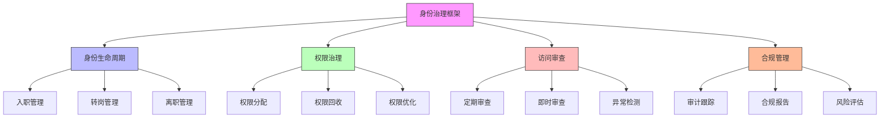

在企业数字化转型的进程中，身份治理与管理（Identity Governance and Administration, IGA）已成为确保信息安全、满足合规要求和提升运营效率的核心能力。随着组织规模的扩大和系统复杂性的增加，传统的手动权限管理方式已无法满足现代企业的需求。自动化权限治理工作流通过智能化的流程和算法，实现了权限管理的标准化、自动化和智能化。

## 引言

身份治理与管理（IGA）是现代企业身份安全体系的重要组成部分，它涵盖了从用户生命周期管理到权限治理的全流程。通过自动化权限治理工作流，企业可以实现权限分配的精准化、权限审查的常态化和权限回收的及时化，从而有效降低安全风险，提高合规水平，并优化用户体验。

## IGA核心概念

### 身份治理框架

IGA系统通过建立完整的身份治理框架，实现对用户身份和访问权限的全面管理：



### 自动化治理工作流

```java
public class IGAAutomatedWorkflows {
    private final WorkflowEngine workflowEngine;
    private final IdentityService identityService;
    private final PermissionService permissionService;
    private final ComplianceService complianceService;
    
    // 权限治理工作流
    public class PermissionGovernanceWorkflow {
        
        // 智能权限分配工作流
        public Workflow createIntelligentPermissionAssignmentWorkflow() {
            Workflow workflow = new Workflow("INTELLIGENT_PERMISSION_ASSIGNMENT");
            
            // 步骤1: 用户上下文分析
            workflow.addStep(new WorkflowStep("ANALYZE_USER_CONTEXT") {
                @Override
                public StepResult execute(WorkflowContext context) {
                    String userId = context.getVariable("userId");
                    
                    // 收集用户上下文信息
                    UserContext userContext = identityService.getUserContext(userId);
                    context.setVariable("userContext", userContext);
                    
                    // 分析用户角色和职责
                    UserRoleAnalysis roleAnalysis = analyzeUserRole(userContext);
                    context.setVariable("roleAnalysis", roleAnalysis);
                    
                    return StepResult.success();
                }
            });
            
            // 步骤2: 权限需求识别
            workflow.addStep(new WorkflowStep("IDENTIFY_PERMISSION_NEEDS") {
                @Override
                public StepResult execute(WorkflowContext context) {
                    UserContext userContext = context.getVariable("userContext");
                    UserRoleAnalysis roleAnalysis = context.getVariable("roleAnalysis");
                    
                    // 基于角色和职责识别权限需求
                    List<Permission> requiredPermissions = 
                        permissionService.identifyRequiredPermissions(userContext, roleAnalysis);
                    
                    // 应用权限策略
                    List<Permission> filteredPermissions = 
                        permissionService.applyPermissionPolicies(requiredPermissions, userContext);
                    
                    context.setVariable("requiredPermissions", filteredPermissions);
                    return StepResult.success();
                }
            });
            
            // 步骤3: 权限冲突检测
            workflow.addStep(new WorkflowStep("DETECT_PERMISSION_CONFLICTS") {
                @Override
                public StepResult execute(WorkflowContext context) {
                    String userId = context.getVariable("userId");
                    List<Permission> requiredPermissions = context.getVariable("requiredPermissions");
                    
                    // 检测权限冲突
                    List<PermissionConflict> conflicts = 
                        permissionService.detectPermissionConflicts(userId, requiredPermissions);
                    
                    if (!conflicts.isEmpty()) {
                        context.setVariable("permissionConflicts", conflicts);
                        return StepResult.warning("发现权限冲突");
                    }
                    
                    return StepResult.success();
                }
            });
            
            // 步骤4: 权限分配执行
            workflow.addStep(new WorkflowStep("EXECUTE_PERMISSION_ASSIGNMENT") {
                @Override
                public StepResult execute(WorkflowContext context) {
                    String userId = context.getVariable("userId");
                    List<Permission> requiredPermissions = context.getVariable("requiredPermissions");
                    
                    // 执行权限分配
                    boolean success = permissionService.assignPermissions(userId, requiredPermissions);
                    
                    if (success) {
                        // 记录分配日志
                        auditService.logPermissionAssignment(userId, requiredPermissions);
                        return StepResult.success();
                    } else {
                        return StepResult.failure("权限分配失败");
                    }
                }
            });
            
            // 步骤5: 合规性检查
            workflow.addStep(new WorkflowStep("CHECK_COMPLIANCE") {
                @Override
                public StepResult execute(WorkflowContext context) {
                    String userId = context.getVariable("userId");
                    List<Permission> assignedPermissions = context.getVariable("requiredPermissions");
                    
                    // 执行合规性检查
                    ComplianceCheckResult complianceResult = 
                        complianceService.checkUserCompliance(userId, assignedPermissions);
                    
                    context.setVariable("complianceResult", complianceResult);
                    
                    if (complianceResult.isCompliant()) {
                        return StepResult.success();
                    } else {
                        return StepResult.warning("发现合规性问题: " + complianceResult.getIssues());
                    }
                }
            });
            
            return workflow;
        }
        
        // 权限回收工作流
        public Workflow createPermissionRevocationWorkflow() {
            Workflow workflow = new Workflow("PERMISSION_REVOCATION");
            
            // 步骤1: 触发条件检测
            workflow.addStep(new WorkflowStep("DETECT_REVOCATION_TRIGGER") {
                @Override
                public StepResult execute(WorkflowContext context) {
                    String userId = context.getVariable("userId");
                    String triggerType = context.getVariable("triggerType");
                    
                    // 根据触发类型确定需要回收的权限
                    List<Permission> permissionsToRevoke = 
                        identifyPermissionsToRevoke(userId, triggerType);
                    
                    context.setVariable("permissionsToRevoke", permissionsToRevoke);
                    context.setVariable("triggerDetails", getTriggerDetails(triggerType));
                    
                    return StepResult.success();
                }
            });
            
            // 步骤2: 影响评估
            workflow.addStep(new WorkflowStep("ASSESS_IMPACT") {
                @Override
                public StepResult execute(WorkflowContext context) {
                    String userId = context.getVariable("userId");
                    List<Permission> permissionsToRevoke = context.getVariable("permissionsToRevoke");
                    
                    // 评估权限回收的影响
                    ImpactAssessment assessment = 
                        permissionService.assessRevocationImpact(userId, permissionsToRevoke);
                    
                    context.setVariable("impactAssessment", assessment);
                    
                    // 如果影响较大，需要审批
                    if (assessment.getRiskLevel() == RiskLevel.HIGH) {
                        context.setVariable("requiresApproval", true);
                        return StepResult.warning("高风险操作需要审批");
                    }
                    
                    return StepResult.success();
                }
            });
            
            // 步骤3: 审批流程（如需要）
            workflow.addStep(new WorkflowStep("APPROVAL_PROCESS") {
                @Override
                public StepResult execute(WorkflowContext context) {
                    Boolean requiresApproval = context.getVariable("requiresApproval");
                    
                    if (requiresApproval != null && requiresApproval) {
                        // 启动审批流程
                        ApprovalRequest approval = startApprovalProcess(context);
                        context.setVariable("approvalRequest", approval);
                        
                        // 等待审批结果
                        ApprovalResult result = waitForApproval(approval);
                        context.setVariable("approvalResult", result);
                        
                        if (result.isApproved()) {
                            return StepResult.success();
                        } else {
                            return StepResult.failure("审批被拒绝: " + result.getRejectionReason());
                        }
                    }
                    
                    return StepResult.success();
                }
            });
            
            // 步骤4: 执行权限回收
            workflow.addStep(new WorkflowStep("EXECUTE_REVOCATION") {
                @Override
                public StepResult execute(WorkflowContext context) {
                    String userId = context.getVariable("userId");
                    List<Permission> permissionsToRevoke = context.getVariable("permissionsToRevoke");
                    
                    // 执行权限回收
                    boolean success = permissionService.revokePermissions(userId, permissionsToRevoke);
                    
                    if (success) {
                        // 记录回收日志
                        auditService.logPermissionRevocation(userId, permissionsToRevoke);
                        return StepResult.success();
                    } else {
                        return StepResult.failure("权限回收失败");
                    }
                }
            });
            
            // 步骤5: 通知相关人员
            workflow.addStep(new WorkflowStep("NOTIFY_STAKEHOLDERS") {
                @Override
                public StepResult execute(WorkflowContext context) {
                    String userId = context.getVariable("userId");
                    List<Permission> revokedPermissions = context.getVariable("permissionsToRevoke");
                    ImpactAssessment assessment = context.getVariable("impactAssessment");
                    
                    // 发送通知
                    notificationService.sendRevocationNotification(
                        userId, revokedPermissions, assessment);
                    
                    return StepResult.success();
                }
            });
            
            return workflow;
        }
    }
}
```

## 智能权限治理

### 机器学习驱动的权限管理

```python
class MLDrivenPermissionGovernance:
    def __init__(self, ml_service, permission_service, audit_service):
        self.ml_service = ml_service
        self.permission_service = permission_service
        self.audit_service = audit_service
        self.models = {}
    
    # 初始化机器学习模型
    async def initialize_models(self):
        """初始化权限治理相关的机器学习模型"""
        # 权限推荐模型
        self.models['permission_recommendation'] = await self.ml_service.load_model(
            'permission_recommendation_model')
        
        # 异常检测模型
        self.models['anomaly_detection'] = await self.ml_service.load_model(
            'permission_anomaly_detection_model')
        
        # 权限优化模型
        self.models['permission_optimization'] = await self.ml_service.load_model(
            'permission_optimization_model')
        
        # 风险评估模型
        self.models['risk_assessment'] = await self.ml_service.load_model(
            'permission_risk_assessment_model')
    
    # 智能权限推荐
    async def recommend_permissions(self, user_id, context=None):
        """基于机器学习的智能权限推荐"""
        try:
            # 收集用户特征数据
            user_features = await self._collect_user_features(user_id, context)
            
            # 使用推荐模型进行预测
            model = self.models['permission_recommendation']
            predictions = await model.predict(user_features)
            
            # 处理推荐结果
            recommendations = await self._process_recommendations(predictions, user_id)
            
            # 记录推荐日志
            await self.audit_service.log_permission_recommendation(user_id, recommendations)
            
            return recommendations
            
        except Exception as e:
            await self.audit_service.log_error("权限推荐失败", str(e))
            return []
    
    # 收集用户特征
    async def _collect_user_features(self, user_id, context):
        """收集用户特征数据用于机器学习"""
        features = {
            # 用户基本信息
            'user_tenure': await self.permission_service.get_user_tenure(user_id),
            'user_department': await self.permission_service.get_user_department(user_id),
            'user_role': await self.permission_service.get_user_role(user_id),
            'user_level': await self.permission_service.get_user_level(user_id),
            
            # 历史行为特征
            'login_frequency': await self.permission_service.get_login_frequency(user_id),
            'access_patterns': await self.permission_service.get_access_patterns(user_id),
            'permission_usage': await self.permission_service.get_permission_usage(user_id),
            'recent_activities': await self.permission_service.get_recent_activities(user_id),
            
            # 同类用户特征
            'peer_group_behavior': await self.permission_service.get_peer_group_behavior(user_id),
            'department_norms': await self.permission_service.get_department_permission_norms(user_id),
            
            # 上下文特征
            'access_context': context or {},
            'time_of_day': datetime.now().hour,
            'day_of_week': datetime.now().weekday(),
            
            # 合规特征
            'compliance_history': await self.permission_service.get_compliance_history(user_id),
            'audit_findings': await self.permission_service.get_audit_findings(user_id)
        }
        
        return features
    
    # 处理推荐结果
    async def _process_recommendations(self, predictions, user_id):
        """处理机器学习推荐结果"""
        recommendations = []
        
        # 获取用户当前权限
        current_permissions = await self.permission_service.get_user_permissions(user_id)
        current_permission_ids = {p['id'] for p in current_permissions}
        
        for permission_id, score in predictions.items():
            # 过滤已拥有的权限
            if permission_id in current_permission_ids:
                continue
            
            # 过滤低分推荐
            if score < 0.3:  # 阈值可配置
                continue
            
            # 验证权限兼容性
            is_compatible = await self.permission_service.check_permission_compatibility(
                user_id, permission_id)
            if not is_compatible:
                continue
            
            # 检查合规性
            is_compliant = await self.permission_service.check_permission_compliance(
                user_id, permission_id)
            if not is_compliant:
                continue
            
            recommendations.append({
                'permission_id': permission_id,
                'confidence_score': score,
                'reasoning': await self._generate_recommendation_reasoning(permission_id, score),
                'priority': self._calculate_recommendation_priority(score)
            })
        
        # 按置信度排序
        recommendations.sort(key=lambda x: x['confidence_score'], reverse=True)
        
        return recommendations[:10]  # 返回前10个推荐
    
    # 异常权限检测
    async def detect_anomalous_permissions(self):
        """检测异常权限使用模式"""
        try:
            # 获取所有用户的权限数据
            all_permission_data = await self.permission_service.get_all_permission_data()
            
            # 构建异常检测数据集
            dataset = self._build_anomaly_detection_dataset(all_permission_data)
            
            # 使用异常检测模型
            model = self.models['anomaly_detection']
            anomalies = await model.detect(dataset)
            
            # 处理异常结果
            processed_anomalies = await self._process_anomalies(anomalies)
            
            # 生成报告
            report = await self._generate_anomaly_report(processed_anomalies)
            
            # 发送告警
            if processed_anomalies:
                await self._send_anomaly_alerts(processed_anomalies)
            
            return report
            
        except Exception as e:
            await self.audit_service.log_error("异常权限检测失败", str(e))
            return None
```

### 权限优化算法

```sql
-- IGA权限治理数据库设计
CREATE TABLE permission_governance_workflows (
    id VARCHAR(50) PRIMARY KEY,
    workflow_name VARCHAR(100) NOT NULL,
    workflow_type VARCHAR(50) NOT NULL,  -- PERMISSION_ASSIGNMENT, PERMISSION_REVOCATION, ACCESS_REVIEW
    description TEXT,
    version VARCHAR(20) DEFAULT '1.0',
    is_active BOOLEAN DEFAULT TRUE,
    created_at TIMESTAMP DEFAULT CURRENT_TIMESTAMP,
    updated_at TIMESTAMP DEFAULT CURRENT_TIMESTAMP ON UPDATE CURRENT_TIMESTAMP,
    
    INDEX idx_workflow_type (workflow_type),
    INDEX idx_is_active (is_active)
);

-- 工作流步骤表
CREATE TABLE workflow_steps (
    id VARCHAR(50) PRIMARY KEY,
    workflow_id VARCHAR(50) NOT NULL,
    step_name VARCHAR(100) NOT NULL,
    step_order INT NOT NULL,
    step_type VARCHAR(50) NOT NULL,  -- AUTOMATIC, MANUAL, CONDITIONAL
    step_config JSON,
    timeout_seconds INT DEFAULT 3600,
    retry_count INT DEFAULT 3,
    created_at TIMESTAMP DEFAULT CURRENT_TIMESTAMP,
    
    FOREIGN KEY (workflow_id) REFERENCES permission_governance_workflows(id),
    INDEX idx_workflow (workflow_id),
    INDEX idx_step_order (step_order)
);

-- 工作流执行实例表
CREATE TABLE workflow_executions (
    id VARCHAR(50) PRIMARY KEY,
    workflow_id VARCHAR(50) NOT NULL,
    trigger_event VARCHAR(100),
    status VARCHAR(20) DEFAULT 'PENDING',  -- PENDING, RUNNING, COMPLETED, FAILED, CANCELLED
    start_time TIMESTAMP,
    end_time TIMESTAMP NULL,
    execution_context JSON,
    result_data JSON,
    error_message TEXT,
    
    FOREIGN KEY (workflow_id) REFERENCES permission_governance_workflows(id),
    INDEX idx_workflow (workflow_id),
    INDEX idx_status (status),
    INDEX idx_start_time (start_time)
);

-- 权限推荐表
CREATE TABLE permission_recommendations (
    id VARCHAR(50) PRIMARY KEY,
    user_id VARCHAR(50) NOT NULL,
    permission_id VARCHAR(50) NOT NULL,
    confidence_score DECIMAL(5,4) NOT NULL,
    recommendation_reason TEXT,
    status VARCHAR(20) DEFAULT 'PENDING',  -- PENDING, ACCEPTED, REJECTED, EXPIRED
    recommended_at TIMESTAMP DEFAULT CURRENT_TIMESTAMP,
    actioned_at TIMESTAMP NULL,
    
    FOREIGN KEY (user_id) REFERENCES users(id),
    FOREIGN KEY (permission_id) REFERENCES permissions(id),
    INDEX idx_user_id (user_id),
    INDEX idx_status (status),
    INDEX idx_confidence_score (confidence_score)
);

-- 创建权限治理统计视图
CREATE VIEW permission_governance_statistics AS
SELECT 
    pgw.workflow_name,
    pgw.workflow_type,
    COUNT(we.id) as total_executions,
    COUNT(CASE WHEN we.status = 'COMPLETED' THEN 1 END) as successful_executions,
    COUNT(CASE WHEN we.status = 'FAILED' THEN 1 END) as failed_executions,
    ROUND(COUNT(CASE WHEN we.status = 'COMPLETED' THEN 1 END) * 100.0 / COUNT(we.id), 2) as success_rate,
    AVG(TIMESTAMPDIFF(SECOND, we.start_time, we.end_time)) as avg_execution_time,
    MAX(we.start_time) as last_execution
FROM permission_governance_workflows pgw
LEFT JOIN workflow_executions we ON pgw.id = we.workflow_id
WHERE we.start_time > DATE_SUB(NOW(), INTERVAL 30 DAY)
GROUP BY pgw.id, pgw.workflow_name, pgw.workflow_type;
```

## 访问审查自动化

### 定期访问审查

```javascript
// 自动化访问审查系统
class AutomatedAccessReview {
  constructor(reviewService, notificationService, workflowService) {
    this.reviewService = reviewService;
    this.notificationService = notificationService;
    this.workflowService = workflowService;
    this.reviewCycles = new Map();
  }
  
  // 创建审查周期
  async createReviewCycle(cycleConfig) {
    const cycleId = this._generateCycleId();
    
    const cycle = {
      id: cycleId,
      name: cycleConfig.name,
      description: cycleConfig.description,
      startDate: new Date(),
      endDate: new Date(Date.now() + cycleConfig.duration * 24 * 60 * 60 * 1000),
      status: 'ACTIVE',
      reviewers: cycleConfig.reviewers,
      reviewScope: cycleConfig.reviewScope,
      notificationSettings: cycleConfig.notificationSettings
    };
    
    // 生成审查任务
    const reviewTasks = await this._generateReviewTasks(cycle);
    
    // 保存审查周期
    await this.reviewService.saveReviewCycle(cycle);
    
    // 创建审查工作流
    const workflow = await this._createReviewWorkflow(cycle, reviewTasks);
    
    // 启动审查周期
    await this.startReviewCycle(cycleId);
    
    return {
      cycle: cycle,
      tasks: reviewTasks,
      workflow: workflow
    };
  }
  
  // 生成审查任务
  async _generateReviewTasks(cycle) {
    const tasks = [];
    
    // 根据审查范围生成任务
    for (const scope of cycle.reviewScope) {
      if (scope.type === 'USER') {
        // 为用户生成审查任务
        const userTasks = await this._generateUserReviewTasks(scope, cycle.reviewers);
        tasks.push(...userTasks);
      } else if (scope.type === 'ROLE') {
        // 为角色生成审查任务
        const roleTasks = await this._generateRoleReviewTasks(scope, cycle.reviewers);
        tasks.push(...roleTasks);
      } else if (scope.type === 'DEPARTMENT') {
        // 为部门生成审查任务
        const deptTasks = await this._generateDepartmentReviewTasks(scope, cycle.reviewers);
        tasks.push(...deptTasks);
      }
    }
    
    return tasks;
  }
  
  // 生成用户审查任务
  async _generateUserReviewTasks(scope, reviewers) {
    const tasks = [];
    
    // 获取需要审查的用户
    const users = await this.reviewService.getUsersForReview(scope.criteria);
    
    for (const user of users) {
      // 确定审查者
      const assignedReviewers = this._determineReviewers(user, reviewers);
      
      for (const reviewer of assignedReviewers) {
        const taskId = this._generateTaskId();
        
        const task = {
          id: taskId,
          cycleId: scope.cycleId,
          targetType: 'USER',
          targetId: user.id,
          reviewerId: reviewer.id,
          status: 'PENDING',
          dueDate: scope.endDate,
          permissions: await this.reviewService.getUserPermissions(user.id),
          accessHistory: await this.reviewService.getUserAccessHistory(user.id),
          recommendations: await this.reviewService.getReviewRecommendations(user.id)
        };
        
        tasks.push(task);
      }
    }
    
    return tasks;
  }
  
  // 智能审查建议
  async generateReviewRecommendations(targetId, targetType) {
    const recommendations = [];
    
    if (targetType === 'USER') {
      // 获取用户权限使用数据
      const usageData = await this.reviewService.getPermissionUsageData(targetId);
      
      // 分析权限使用频率
      for (const [permissionId, usage] of Object.entries(usageData)) {
        if (usage.frequency === 0 && usage.daysSinceLastUse > 90) {
          recommendations.push({
            permissionId: permissionId,
            action: 'REVOKE',
            reason: '超过90天未使用',
            confidence: 0.9
          });
        } else if (usage.frequency < 5 && usage.daysSinceLastUse > 30) {
          recommendations.push({
            permissionId: permissionId,
            action: 'REVIEW',
            reason: '使用频率低且超过30天未使用',
            confidence: 0.7
          });
        } else {
          recommendations.push({
            permissionId: permissionId,
            action: 'KEEP',
            reason: '正常使用',
            confidence: 0.95
          });
        }
      }
    }
    
    return recommendations;
  }
  
  // 执行审查任务
  async executeReviewTask(taskId, reviewerId, reviewData) {
    try {
      // 验证审查者身份
      const task = await this.reviewService.getReviewTask(taskId);
      if (task.reviewerId !== reviewerId) {
        throw new Error('未授权的审查者');
      }
      
      // 更新任务状态
      task.status = 'COMPLETED';
      task.reviewData = reviewData;
      task.completedAt = new Date();
      
      // 保存审查结果
      await this.reviewService.saveReviewResult(task);
      
      // 执行审查决策
      await this._executeReviewDecisions(task);
      
      // 发送完成通知
      await this.notificationService.sendReviewCompletionNotification(task);
      
      return {
        success: true,
        taskId: taskId
      };
      
    } catch (error) {
      await this.reviewService.logReviewError(taskId, error.message);
      return {
        success: false,
        error: error.message
      };
    }
  }
  
  // 执行审查决策
  async _executeReviewDecisions(task) {
    const decisions = task.reviewData.decisions;
    
    for (const decision of decisions) {
      if (decision.action === 'REVOKE') {
        // 执行权限撤销
        await this.reviewService.revokePermission(task.targetId, decision.permissionId);
      } else if (decision.action === 'MODIFY') {
        // 执行权限修改
        await this.reviewService.modifyPermission(task.targetId, decision.permissionId, decision.modifications);
      } else if (decision.action === 'APPROVE') {
        // 记录批准
        await this.reviewService.approvePermission(task.targetId, decision.permissionId);
      }
    }
  }
  
  // 发送提醒通知
  async sendReviewReminders() {
    // 获取即将到期的任务
    const pendingTasks = await this.reviewService.getPendingTasks();
    
    for (const task of pendingTasks) {
      const daysUntilDue = (task.dueDate - new Date()) / (24 * 60 * 60 * 1000);
      
      // 发送提醒的条件
      if (daysUntilDue <= 3 && task.reminderCount === 0) {
        // 3天前提醒
        await this.notificationService.sendReviewReminder(task, '3天前提醒');
        task.reminderCount = 1;
      } else if (daysUntilDue <= 1 && task.reminderCount === 1) {
        // 1天前提醒
        await this.notificationService.sendReviewReminder(task, '1天前提醒');
        task.reminderCount = 2;
      } else if (daysUntilDue <= 0 && task.status === 'PENDING') {
        // 逾期处理
        await this._handleOverdueTask(task);
      }
      
      // 更新任务
      await this.reviewService.updateTask(task);
    }
  }
}
```

### 即时审查机制

```java
public class RealTimeAccessReview {
    private final AccessReviewService reviewService;
    private final RiskAssessmentService riskService;
    private final NotificationService notificationService;
    
    // 即时审查触发器
    public class RealTimeReviewTrigger {
        
        // 高风险操作触发审查
        @EventListener
        public void handleHighRiskOperation(HighRiskOperationEvent event) {
            // 评估操作风险
            RiskAssessment riskAssessment = riskService.assessOperationRisk(event);
            
            // 如果风险等级较高，触发即时审查
            if (riskAssessment.getRiskLevel() >= RiskLevel.HIGH) {
                triggerImmediateReview(event.getUserId(), event.getOperation(), riskAssessment);
            }
        }
        
        // 异常行为触发审查
        @EventListener
        public void handleAnomalousBehavior(AnomalousBehaviorEvent event) {
            // 分析异常行为
            BehaviorAnalysis analysis = analyzeBehavior(event);
            
            // 如果异常程度较高，触发即时审查
            if (analysis.getAnomalyScore() > 0.8) {
                triggerImmediateReview(event.getUserId(), "异常行为", analysis);
            }
        }
        
        // 权限变更触发审查
        @EventListener
        public void handlePermissionChange(PermissionChangeEvent event) {
            // 检查权限变更的敏感性
            boolean isSensitive = isSensitivePermission(event.getPermissionId());
            
            // 如果是敏感权限变更，触发即时审查
            if (isSensitive) {
                triggerImmediateReview(event.getUserId(), "敏感权限变更", event);
            }
        }
    }
    
    // 触发即时审查
    private void triggerImmediateReview(String userId, String reason, Object context) {
        try {
            // 创建即时审查任务
            ImmediateReviewTask task = new ImmediateReviewTask();
            task.setId(generateTaskId());
            task.setUserId(userId);
            task.setReason(reason);
            task.setContext(context);
            task.setStatus(ReviewTaskStatus.PENDING);
            task.setCreatedAt(Instant.now());
            task.setPriority(TaskPriority.HIGH);
            
            // 确定审查者
            List<String> reviewers = determineImmediateReviewers(userId, reason);
            task.setReviewers(reviewers);
            
            // 保存任务
            reviewService.saveImmediateReviewTask(task);
            
            // 发送紧急通知
            notificationService.sendImmediateReviewNotification(task);
            
            // 启动审查超时监控
            startReviewTimeoutMonitoring(task);
            
        } catch (Exception e) {
            log.error("触发即时审查失败", e);
        }
    }
    
    // 即时审查处理
    public class ImmediateReviewHandler {
        
        // 处理审查决策
        public ReviewResult processReviewDecision(String taskId, String reviewerId, ReviewDecision decision) {
            ImmediateReviewTask task = reviewService.getImmediateReviewTask(taskId);
            
            // 验证审查者
            if (!task.getReviewers().contains(reviewerId)) {
                throw new UnauthorizedReviewException("未授权的审查者");
            }
            
            // 更新任务状态
            task.setStatus(ReviewTaskStatus.COMPLETED);
            task.setDecision(decision);
            task.setReviewedAt(Instant.now());
            task.setReviewerId(reviewerId);
            
            // 保存决策
            reviewService.saveReviewDecision(task);
            
            // 执行决策
            executeReviewDecision(task);
            
            // 发送决策通知
            notificationService.sendReviewDecisionNotification(task);
            
            return ReviewResult.success(taskId, decision);
        }
        
        // 执行审查决策
        private void executeReviewDecision(ImmediateReviewTask task) {
            ReviewDecision decision = task.getDecision();
            
            switch (decision.getAction()) {
                case APPROVE:
                    // 批准操作
                    approveOperation(task);
                    break;
                case REJECT:
                    // 拒绝操作
                    rejectOperation(task);
                    break;
                case ESCALATE:
                    // 升级处理
                    escalateOperation(task);
                    break;
                case REQUEST_MORE_INFO:
                    // 请求更多信息
                    requestMoreInformation(task);
                    break;
            }
        }
        
        // 批准操作
        private void approveOperation(ImmediateReviewTask task) {
            // 记录批准日志
            auditService.logOperationApproval(task);
            
            // 恢复被暂停的操作
            operationService.resumeOperation(task.getContext());
        }
        
        // 拒绝操作
        private void rejectOperation(ImmediateReviewTask task) {
            // 记录拒绝日志
            auditService.logOperationRejection(task);
            
            // 终止操作
            operationService.terminateOperation(task.getContext());
            
            // 可能需要触发安全事件
            if (task.getReason().contains("高风险")) {
                securityService.triggerSecurityEvent(
                    SecurityEventType.HIGH_RISK_OPERATION_REJECTED,
                    task.getUserId(),
                    task.getContext()
                );
            }
        }
    }
}
```

## 合规性管理

### 自动化合规检查

```sql
-- 合规性管理数据库设计
CREATE TABLE compliance_requirements (
    id VARCHAR(50) PRIMARY KEY,
    requirement_name VARCHAR(200) NOT NULL,
    standard_name VARCHAR(100) NOT NULL,  -- GDPR, SOX, HIPAA, etc.
    requirement_type VARCHAR(50) NOT NULL,  -- ACCESS_CONTROL, AUDIT, DATA_PROTECTION
    description TEXT,
    applicable_scopes JSON,  -- 适用范围
    check_frequency VARCHAR(20),  -- DAILY, WEEKLY, MONTHLY, QUARTERLY
    severity_level VARCHAR(20) DEFAULT 'MEDIUM',  -- LOW, MEDIUM, HIGH, CRITICAL
    created_at TIMESTAMP DEFAULT CURRENT_TIMESTAMP,
    updated_at TIMESTAMP DEFAULT CURRENT_TIMESTAMP ON UPDATE CURRENT_TIMESTAMP,
    
    INDEX idx_standard (standard_name),
    INDEX idx_requirement_type (requirement_type),
    INDEX idx_check_frequency (check_frequency)
);

-- 合规性检查执行表
CREATE TABLE compliance_checks (
    id VARCHAR(50) PRIMARY KEY,
    requirement_id VARCHAR(50) NOT NULL,
    check_date TIMESTAMP DEFAULT CURRENT_TIMESTAMP,
    status VARCHAR(20) DEFAULT 'PENDING',  -- PENDING, IN_PROGRESS, COMPLETED, FAILED
    result JSON,
    findings JSON,
    remediation_actions JSON,
    executed_by VARCHAR(50),
    duration_seconds INT,
    
    FOREIGN KEY (requirement_id) REFERENCES compliance_requirements(id),
    INDEX idx_requirement (requirement_id),
    INDEX idx_check_date (check_date),
    INDEX idx_status (status)
);

-- 合规性违规记录表
CREATE TABLE compliance_violations (
    id VARCHAR(50) PRIMARY KEY,
    requirement_id VARCHAR(50) NOT NULL,
    violation_date TIMESTAMP DEFAULT CURRENT_TIMESTAMP,
    severity VARCHAR(20) NOT NULL,
    description TEXT,
    affected_entities JSON,
    evidence JSON,
    status VARCHAR(20) DEFAULT 'OPEN',  -- OPEN, IN_REVIEW, RESOLVED, CLOSED
    assigned_to VARCHAR(50),
    resolution_plan TEXT,
    resolved_at TIMESTAMP NULL,
    
    FOREIGN KEY (requirement_id) REFERENCES compliance_requirements(id),
    INDEX idx_requirement (requirement_id),
    INDEX idx_severity (severity),
    INDEX idx_status (status),
    INDEX idx_violation_date (violation_date)
);

-- 创建合规性仪表板视图
CREATE VIEW compliance_dashboard AS
SELECT 
    cr.standard_name,
    COUNT(cc.id) as total_checks,
    COUNT(CASE WHEN cc.status = 'COMPLETED' THEN 1 END) as completed_checks,
    COUNT(cv.id) as total_violations,
    COUNT(CASE WHEN cv.status = 'OPEN' THEN 1 END) as open_violations,
    COUNT(CASE WHEN cv.severity = 'CRITICAL' THEN 1 END) as critical_violations,
    ROUND(COUNT(CASE WHEN cc.status = 'COMPLETED' THEN 1 END) * 100.0 / COUNT(cc.id), 2) as compliance_rate,
    MAX(cc.check_date) as last_check_date
FROM compliance_requirements cr
LEFT JOIN compliance_checks cc ON cr.id = cc.requirement_id 
    AND cc.check_date > DATE_SUB(NOW(), INTERVAL 30 DAY)
LEFT JOIN compliance_violations cv ON cr.id = cv.requirement_id 
    AND cv.violation_date > DATE_SUB(NOW(), INTERVAL 30 DAY)
GROUP BY cr.standard_name;
```

```python
class AutomatedComplianceManagement:
    def __init__(self, compliance_service, audit_service, notification_service):
        self.compliance_service = compliance_service
        self.audit_service = audit_service
        self.notification_service = notification_service
        self.check_schedules = {}
    
    # 初始化合规性检查
    async def initialize_compliance_checks(self):
        """初始化自动化合规性检查"""
        # 获取所有合规性要求
        requirements = await self.compliance_service.get_all_requirements()
        
        for requirement in requirements:
            # 根据检查频率设置调度
            if requirement.check_frequency == 'DAILY':
                self.check_schedules[requirement.id] = self._schedule_daily_check(requirement)
            elif requirement.check_frequency == 'WEEKLY':
                self.check_schedules[requirement.id] = self._schedule_weekly_check(requirement)
            elif requirement.check_frequency == 'MONTHLY':
                self.check_schedules[requirement.id] = self._schedule_monthly_check(requirement)
    
    # 执行合规性检查
    async def execute_compliance_check(self, requirement_id):
        """执行特定合规性要求的检查"""
        try:
            # 获取合规性要求
            requirement = await self.compliance_service.get_requirement(requirement_id)
            
            # 记录检查开始
            check_id = await self.audit_service.log_check_start(requirement_id)
            
            # 执行检查逻辑
            check_result = await self._perform_compliance_check(requirement)
            
            # 保存检查结果
            await self.compliance_service.save_check_result(check_id, check_result)
            
            # 处理检查发现
            if check_result.violations:
                await self._handle_violations(requirement, check_result.violations)
            
            # 发送检查报告
            await self._send_check_report(requirement, check_result)
            
            return check_result
            
        except Exception as e:
            await self.audit_service.log_check_error(requirement_id, str(e))
            raise
    
    # 执行具体的合规性检查
    async def _perform_compliance_check(self, requirement):
        """执行具体的合规性检查逻辑"""
        result = ComplianceCheckResult()
        result.requirement_id = requirement.id
        result.check_date = datetime.utcnow()
        result.findings = []
        result.violations = []
        
        # 根据要求类型执行不同的检查
        if requirement.requirement_type == 'ACCESS_CONTROL':
            await self._check_access_control(requirement, result)
        elif requirement.requirement_type == 'AUDIT':
            await self._check_audit_requirements(requirement, result)
        elif requirement.requirement_type == 'DATA_PROTECTION':
            await self._check_data_protection(requirement, result)
        
        # 计算合规性状态
        result.compliant = len(result.violations) == 0
        result.severity = self._calculate_overall_severity(result.violations)
        
        return result
    
    # 检查访问控制要求
    async def _check_access_control(self, requirement, result):
        """检查访问控制相关的合规性要求"""
        # 检查权限分配
        excessive_permissions = await self.compliance_service.find_excessive_permissions()
        for permission in excessive_permissions:
            result.findings.append({
                'type': 'EXCESSIVE_PERMISSION',
                'entity': permission.user_id,
                'details': permission.details,
                'severity': 'HIGH'
            })
            
            if permission.is_violation:
                result.violations.append({
                    'type': 'EXCESSIVE_PERMISSION',
                    'entity': permission.user_id,
                    'requirement': requirement.id,
                    'description': f'用户 {permission.user_id} 拥有过多权限',
                    'severity': 'HIGH'
                })
        
        # 检查权限审查
        overdue_reviews = await self.compliance_service.find_overdue_reviews()
        for review in overdue_reviews:
            result.findings.append({
                'type': 'OVERDUE_REVIEW',
                'entity': review.user_id,
                'details': review.details,
                'severity': 'MEDIUM'
            })
            
            if review.is_violation:
                result.violations.append({
                    'type': 'OVERDUE_REVIEW',
                    'entity': review.user_id,
                    'requirement': requirement.id,
                    'description': f'用户 {review.user_id} 的权限审查已逾期',
                    'severity': 'MEDIUM'
                })
    
    # 处理违规情况
    async def _handle_violations(self, requirement, violations):
        """处理合规性违规情况"""
        for violation in violations:
            # 记录违规
            violation_id = await self.compliance_service.record_violation(violation)
            
            # 分配处理人员
            assignee = await self.compliance_service.assign_violation_handler(violation)
            
            # 发送告警通知
            await self.notification_service.send_violation_alert(
                violation_id, 
                assignee, 
                violation
            )
            
            # 如果是严重违规，触发应急响应
            if violation.severity == 'CRITICAL':
                await self._trigger_incident_response(violation)
```

## 总结

身份治理与管理（IGA）通过自动化权限治理工作流，实现了权限管理的智能化、标准化和自动化。通过机器学习驱动的权限推荐、智能化的访问审查机制和自动化的合规性管理，企业可以显著提升身份治理的效率和效果。

关键要点包括：

1. **自动化工作流**：通过标准化的工作流实现权限分配、回收和审查的自动化
2. **智能权限管理**：利用机器学习技术实现智能权限推荐和异常检测
3. **访问审查机制**：建立定期和即时的访问审查机制，确保权限的合理性和必要性
4. **合规性管理**：自动化合规性检查和违规处理，满足监管要求

通过这些实践，企业可以构建更加安全、高效和合规的身份治理体系，为数字化转型提供坚实的基础保障。